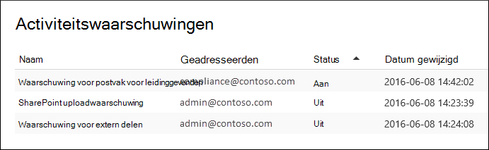
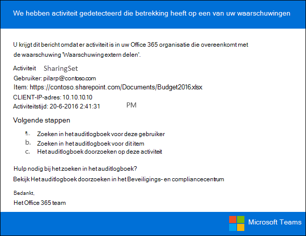

# Activiteitswaarschuwingen maken

U kunt een activiteitswaarschuwing maken die u een e-mailmelding stuurt wanneer gebruikers specifieke activiteiten uitvoeren in Office 365. Activiteitswaarschuwingen zijn vergelijkbaar met het zoeken naar gebeurtenissen in het auditlogboek, behalve dat u een e-mailbericht ontvangt wanneer er een gebeurtenis wordt verzonden voor een activiteit waarop u een waarschuwing hebt gemaakt. 
  
 **Waarom activiteitswaarschuwingen gebruiken in plaats van het auditlogboek te doorzoeken?** Er kunnen bepaalde soorten activiteiten of activiteiten worden uitgevoerd door specifieke gebruikers die u echt wilt weten. In plaats van te onthouden dat u in het auditlogboek naar deze activiteiten moet zoeken, kunt u activiteitswaarschuwingen gebruiken om u een e-mailbericht Microsoft 365 te sturen wanneer gebruikers deze activiteiten uitvoeren. U kunt bijvoorbeeld een activiteitsmelding maken om u op de hoogte te stellen wanneer een gebruiker bestanden verwijdert in SharePoint of u kunt een waarschuwing maken om u op de hoogte te stellen wanneer een gebruiker berichten definitief uit zijn postvak verwijdert. De e-mailmelding die naar u is verzonden, bevat informatie over welke activiteit is uitgevoerd en de gebruiker die deze heeft uitgevoerd.

> [!NOTE]
> Activiteitswaarschuwingen worden afgeschaft. U wordt aangeraden waarschuwingsbeleid te gebruiken in het beveiligings- en compliancecentrum in plaats van nieuwe activiteitswaarschuwingen te maken. Waarschuwingsbeleid biedt extra functionaliteit, zoals de mogelijkheid om een waarschuwingsbeleid te maken dat een waarschuwing activeert wanneer een gebruiker een opgegeven activiteit uitvoert, en waarschuwingen weergeven op de pagina Waarschuwingen weergeven in het beveiligings- en compliancecentrum.  Zie Waarschuwingsbeleid [voor meer informatie.](alert-policies.md)
  
## Rollen bevestigen en auditregistratie configureren

- U moet de rol Organisatieconfiguratie krijgen toegewezen in het beveiligings- & compliancecentrum om activiteitswaarschuwingen te beheren. Deze rol is standaard toegewezen aan de rollengroepen Compliancebeheerder en Organisatiebeheer. Zie Gebruikers toegang geven tot het beveiligings- & compliancecentrum voor meer informatie over het toevoegen van leden [aan rollengroepen.](../security/defender-365-security/grant-access-to-the-security-and-compliance-center.md)
    
- U (of een andere beheerder) moet eerst auditlogregistratie voor uw organisatie inschakelen voordat u activiteitswaarschuwingen kunt gaan gebruiken. Als u dit wilt doen, klikt u op **Start met het opnemen van gebruikers-** en beheerdersactiviteit op de pagina **Activiteitswaarschuwingen.** (Als u deze koppeling niet ziet, is auditing al ingeschakeld voor uw organisatie.) U kunt de controle ook  in- of uit- zetten op de zoekpagina auditlogboek in het Beveiligings- & Compliancecentrum (ga naar **Zoeken** in het \> **auditlogboek).** U hoeft dit maar één keer te doen voor uw organisatie.
  
- U kunt waarschuwingen maken voor dezelfde activiteiten die u kunt zoeken in het auditlogboek. Zie de [sectie Meer informatie](#more-information) voor een lijst met veelvoorkomende scenario's (en de specifieke activiteit die u moet controleren) waar u waarschuwingen voor kunt maken. 
    
- U kunt de pagina **Activiteitswaarschuwingen** in het beveiligings- & compliancecentrum gebruiken om alleen waarschuwingen te maken voor activiteiten die worden uitgevoerd door gebruikers die worden vermeld in het adresboek van uw organisatie. U kunt deze pagina niet gebruiken om waarschuwingen te maken voor activiteiten die worden uitgevoerd door externe gebruikers die niet in het adresboek worden vermeld. 
    
## Een activiteitswaarschuwing maken

1. Ga naar [https://protection.office.com/managealerts](https://protection.office.com/managealerts).
    
2. Meld u aan met uw werk- of schoolaccount.
    
3. Klik op **de pagina Activiteitswaarschuwingen** op  **toevoegen.**

   De flyoutpagina om een activiteitswaarschuwing te maken, wordt weergegeven.

    
    
  
4. Voltooi de volgende velden om een activiteitswaarschuwing te maken:
    
    a. **Naam:** typ een naam voor de waarschuwing. Waarschuwingsnamen moeten uniek zijn binnen uw organisatie.
    
    b. **Beschrijving** (optioneel) - Beschrijf de waarschuwing, zoals de activiteiten en gebruikers die worden bijgespoord, en de gebruikers naar waar e-mailmeldingen naar worden verzonden. Beschrijvingen bieden een snelle en eenvoudige manier om het doel van de waarschuwing aan andere beheerders te beschrijven.
    
    c. **Type waarschuwing:** zorg ervoor dat **de** optie Aangepast is geselecteerd. 

    d. **Deze waarschuwing verzenden wanneer** - Klik op **Deze waarschuwing verzenden wanneer** en configureer deze twee velden:
    
    - **Activiteiten:** klik op de vervolgkeuzelijst om de activiteiten weer te geven waar u een waarschuwing voor kunt maken. Dit is dezelfde lijst met activiteiten die wordt weergegeven wanneer u in het auditlogboek zoekt. U kunt een of meer specifieke activiteiten selecteren of u kunt op de naam van de activiteitsgroep klikken om alle activiteiten in de groep te selecteren. Zie de sectie 'Gecontroleerde activiteiten' in Het [auditlogboek doorzoeken](search-the-audit-log-in-security-and-compliance.md#audited-activities)voor een beschrijving van deze activiteiten. Wanneer een gebruiker een van de activiteiten uitvoert die u aan de waarschuwing hebt toegevoegd, wordt een e-mailmelding verzonden. 
    
     - **Gebruikers:** klik op dit vak en selecteer een of meer gebruikers. Als de gebruikers in dit vak de activiteiten uitvoeren die u hebt toegevoegd aan **het** vak Activiteiten, wordt een waarschuwing verzonden. Laat het **vak Gebruikers** leeg om een waarschuwing te verzenden wanneer een gebruiker in uw organisatie de activiteiten uitvoert die door de waarschuwing zijn opgegeven. 

    e. Deze waarschuwing verzenden  **naar-** Klik op Deze  waarschuwing verzenden en klik vervolgens in het vak Geadresseerden en typ een naam om een gebruikers toe te  voegen die een e-mailmelding ontvangen wanneer een gebruiker (opgegeven in het vak Gebruikers) een activiteit uitvoert (opgegeven in het vak Activiteiten).  U wordt standaard toegevoegd aan de lijst met geadresseerden. U kunt uw naam uit deze lijst verwijderen.
    
5. Klik **op Opslaan** om de waarschuwing te maken. 
    
    De nieuwe waarschuwing wordt weergegeven in de lijst op de pagina **Activiteitswaarschuwingen.** 
    
    
  
    De status van de waarschuwing is ingesteld op **Aan**. Houd er rekening mee dat de geadresseerden die een e-mailmelding ontvangen wanneer een waarschuwing wordt verzonden, ook worden vermeld. 
  
## Een activiteitswaarschuwing uitschakelen

U kunt een activiteitsmelding uitschakelen, zodat er geen e-mailmelding wordt verzonden. Nadat u de activiteitsmelding hebt uitgeschakeld, wordt deze nog steeds weergegeven in de lijst met activiteitswaarschuwingen voor uw organisatie en kunt u de eigenschappen ervan nog steeds bekijken.
  
1. Ga naar Ga naar [https://protection.office.com/managealerts](https://protection.office.com/managealerts) .
    
2. Meld u aan met uw werk- of schoolaccount.
    
3. Klik in de lijst met activiteitswaarschuwingen voor uw organisatie op de waarschuwing die u wilt uitschakelen.
    
4. Klik op **de pagina Waarschuwing** bewerken op de wisselknop **Aan** om de status te wijzigen in **Uit** en klik vervolgens op **Opslaan.**
    
    De status van de waarschuwing op de **pagina's Activiteitswaarschuwingen** is ingesteld op **Uit.** 
    
Als u een activiteitsmelding weer wilt inschakelen, herhaalt u deze stappen en klikt u op **de** wisselknop Uit om de status te wijzigen in **Aan.**
  
## Meer informatie

- Hier is een voorbeeld van de e-mailmelding die wordt verzonden naar de gebruikers die zijn  opgegeven in het veld Deze waarschuwing verzenden naar (en wordt weergegeven onder Geadresseerden op de pagina **Activiteitswaarschuwingen)** in het Beveiligings- & Compliancecentrum. 
    
    
  
- Hier volgen enkele veelvoorkomende document- en e-mailactiviteiten waar u een activiteitswaarschuwing voor kunt maken. In de tabellen worden de activiteit, de naam van de activiteit om een waarschuwing voor te maken  en de naam van de activiteitsgroep beschreven onder de activiteit in de vervolgkeuzelijst Activiteiten. Zie de sectie 'Gecontroleerde activiteiten' in [Het auditlogboek doorzoeken](search-the-audit-log-in-security-and-compliance.md#audited-activities)als u een volledige lijst met activiteiten wilt zien waar u activiteitswaarschuwingen voor kunt maken.
    
    > [!TIP]
    > Mogelijk wilt u een activiteitswaarschuwing maken voor slechts één activiteit die door elke gebruiker wordt uitgevoerd. U kunt ook een activiteitswaarschuwing maken die meerdere activiteiten bij houdt die door een of meer gebruikers worden uitgevoerd. 
  
    In de volgende tabel worden enkele veelvoorkomende documentgerelateerde activiteiten in SharePoint of OneDrive voor Bedrijven.
    
    |**Wanneer een gebruiker dit doet...**|**Een waarschuwing voor deze activiteit maken**|**Activiteitsgroep**|
    |:-----|:-----|:-----|
    |Een document op een site wordt bekeken.    |Accessed file    |Bestands- en mapactiviteiten    |
    |Een document bewerken of wijzigen.    |Gewijzigd bestand    |Bestands- en mapactiviteiten    |
    |Deelt een document met een gebruiker buiten uw organisatie.    |Bestand, map of site delen    En    Uitnodiging voor delen gemaakt    Zie Delen controleren gebruiken in het [auditlogboek](use-sharing-auditing.md)voor meer informatie.    |Activiteiten voor het delen en openen van aanvragen    |
    |Uploadt of downloadt een document.    |Geüpload bestand    En/of    Gedownload bestand    |Bestands- en mapactiviteiten    |
    |Wijzigt de toegangsmachtigingen voor een site.    |Gewijzigde sitemachtigingen    |Activiteiten voor sitebeheer    |

    In de volgende tabel vindt u enkele algemene e-mailgerelateerde activiteiten in Exchange Online.

    |**Wanneer een gebruiker dit doet...**|**Een waarschuwing voor deze activiteit maken**|**Activiteitsgroep**|
    |:-----|:-----|:-----|
    |Een e-mailbericht definitief verwijderen (verwijderen) uit het postvak.    |Verwijderde berichten uit postvak    | Exchange postvakactiviteiten    |
    |Hiermee wordt een e-mailbericht verzonden vanuit een gedeeld postvak.    |Verzonden bericht met de machtiging Verzenden als    En    Verzonden bericht met machtigingen voor Verzenden namens    | Exchange postvakactiviteiten    |
   
- U kunt ook de **cmdlets New-ActivityAlert** en **Set-ActivityAlert** in Security & Compliance Center PowerShell gebruiken om activiteitswaarschuwingen te maken en te bewerken. Houd rekening met de volgende zaken als u deze cmdlets gebruikt om activiteitswaarschuwingen te maken of te bewerken: 
    
  - Als u een cmdlet gebruikt om een activiteit toe te  voegen aan de waarschuwing die niet wordt weergegeven in de vervolgkeuzelijst Activiteiten, wordt er een bericht weergegeven op de eigenschappenpagina voor de waarschuwing met de tekst'Deze waarschuwing heeft geen aangepaste bewerkingen in de gewenste optie'. 
    
  - Een goede reden om de cmdlets te gebruiken om een activiteitswaarschuwing te maken of te bewerken, is door e-mailmeldingen te verzenden naar iemand buiten uw organisatie. Deze externe gebruiker wordt weergegeven in de lijst met geadresseerden voor de waarschuwing. Maar als u deze externe gebruiker uit de waarschuwing verwijdert, kan deze gebruiker niet opnieuw aan de waarschuwing worden toegevoegd via de **pagina Waarschuwing** bewerken. U moet de externe gebruiker opnieuw toevoegen met de cmdlet **Set-ActivityAlert** of de cmdlet **New-ActivityAlert** gebruiken om dezelfde (of andere) externe gebruiker toe te voegen aan een nieuwe waarschuwing. 
