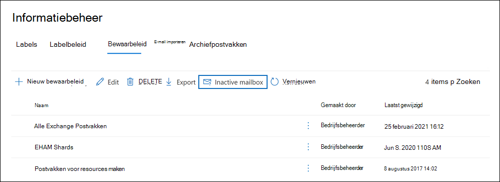
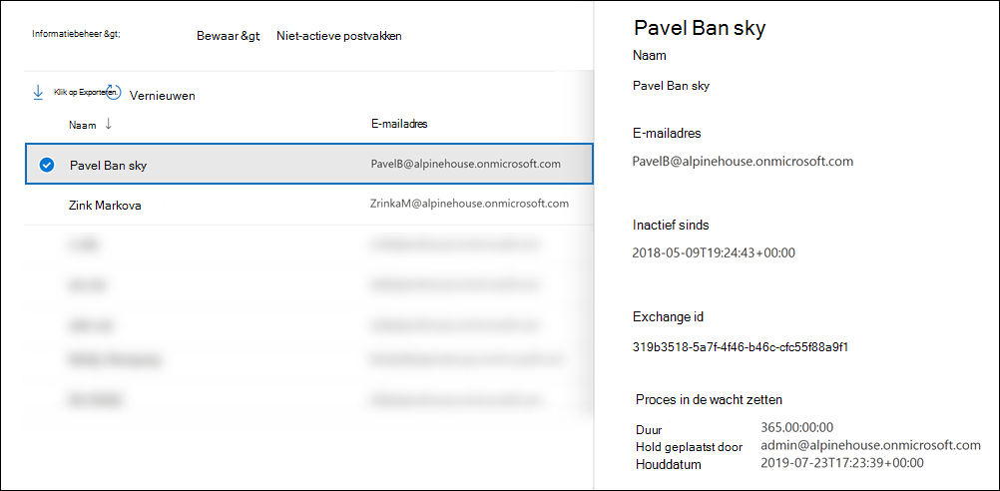

# <a name="create-and-manage-inactive-mailboxes"></a><span data-ttu-id="7e2de-103">Inactieve postvakken maken en beheren</span><span class="sxs-lookup"><span data-stu-id="7e2de-103">Create and manage inactive mailboxes</span></span>

<span data-ttu-id="7e2de-104">Microsoft 365 kunt u de inhoud van verwijderde postvakken behouden.</span><span class="sxs-lookup"><span data-stu-id="7e2de-104">Microsoft 365 makes it possible for you to retain the contents of deleted mailboxes.</span></span> <span data-ttu-id="7e2de-105">Deze functie wordt [inactieve postvakken genoemd.](inactive-mailboxes-in-office-365.md)</span><span class="sxs-lookup"><span data-stu-id="7e2de-105">This feature is called [inactive mailboxes](inactive-mailboxes-in-office-365.md).</span></span> <span data-ttu-id="7e2de-106">Met inactieve postvakken kunt u de e-mail van voormalige werknemers behouden nadat ze uw organisatie hebben verlaten.</span><span class="sxs-lookup"><span data-stu-id="7e2de-106">Inactive mailboxes allow you to retain former employees' email after they leave your organization.</span></span> <span data-ttu-id="7e2de-107">Een postvak wordt inactief wanneer een bewaringsbeleid (gemaakt in het beveiligings- en compliancecentrum in Office 365 of Microsoft 365) wordt toegepast op het postvak voordat het bijbehorende gebruikersaccount wordt verwijderd.</span><span class="sxs-lookup"><span data-stu-id="7e2de-107">A mailbox becomes inactive when a Litigation Hold or a retention policy (created in the security and compliance center in Office 365 or Microsoft 365) is applied to the mailbox before the corresponding user account is deleted.</span></span> <span data-ttu-id="7e2de-108">De inhoud van een inactief postvak blijft behouden gedurende de duur van de wacht die in het postvak is geplaatst voordat het inactief werd gemaakt.</span><span class="sxs-lookup"><span data-stu-id="7e2de-108">The contents of an inactive mailbox are retained for the duration of the hold that was placed on the mailbox before it was made inactive.</span></span> <span data-ttu-id="7e2de-109">Hierdoor kunnen beheerders, compliancemedewerkers en recordmanagers Inhoud zoeken gebruiken om de inhoud van een inactief postvak te doorzoeken en te exporteren.</span><span class="sxs-lookup"><span data-stu-id="7e2de-109">This allows administrators, compliance officers, and records managers to use Content Search to search and export the contents of an inactive mailbox.</span></span> <span data-ttu-id="7e2de-110">Inactieve postvakken kunnen geen e-mail ontvangen en worden niet weergegeven in het gedeelde adresboek van uw organisatie of in andere lijsten.</span><span class="sxs-lookup"><span data-stu-id="7e2de-110">Inactive mailboxes can't receive email and aren't displayed in your organization's shared address book or other lists.</span></span>
  
> [!IMPORTANT]
> <span data-ttu-id="7e2de-111">Terwijl we op verschillende manieren blijven investeren om postvakinhoud te behouden, kondigen we de uittreding aan van In-Place Holds in het Exchange beheercentrum.</span><span class="sxs-lookup"><span data-stu-id="7e2de-111">As we continue to invest in different ways to preserve mailbox content, we're announcing the retirement of In-Place Holds in the Exchange admin center.</span></span> <span data-ttu-id="7e2de-112">Dit betekent dat u beleidsregels voor bewaring en bewaring van rechtszaken moet gebruiken om een inactief postvak te maken.</span><span class="sxs-lookup"><span data-stu-id="7e2de-112">That means you should use Litigation Holds and retention policies to create an inactive mailbox.</span></span> <span data-ttu-id="7e2de-113">Vanaf 1 juli 2020 kunt u geen nieuwe In-Place in Exchange Online.</span><span class="sxs-lookup"><span data-stu-id="7e2de-113">Starting July 1, 2020 you won't be able to create new In-Place Holds in Exchange Online.</span></span> <span data-ttu-id="7e2de-114">Maar u kunt de duur van de wachttijd van een In-Place in een inactief postvak wijzigen.</span><span class="sxs-lookup"><span data-stu-id="7e2de-114">But you'll still be able to change the hold duration of an In-Place Hold placed on an inactive mailbox.</span></span> <span data-ttu-id="7e2de-115">Vanaf 1 oktober 2020 kunt u de duur van de wachttijd echter niet wijzigen.</span><span class="sxs-lookup"><span data-stu-id="7e2de-115">However, starting October 1, 2020, you won't be able to change the hold duration.</span></span> <span data-ttu-id="7e2de-116">U kunt alleen een inactief postvak verwijderen door de In-Place verwijderen.</span><span class="sxs-lookup"><span data-stu-id="7e2de-116">You'll only be able to delete an inactive mailbox by removing the In-Place Hold.</span></span> <span data-ttu-id="7e2de-117">Bestaande inactieve postvakken die in de wacht In-Place blijven behouden totdat de wacht wordt verwijderd.</span><span class="sxs-lookup"><span data-stu-id="7e2de-117">Existing inactive mailboxes that are on In-Place Hold will still be preserved until the hold is removed.</span></span> <span data-ttu-id="7e2de-118">Zie Retirement of legacy eDiscovery tools (Oude eDiscovery-hulpprogramma's) voor meer informatie over het In-Place van [eDiscovery-functies.](legacy-ediscovery-retirement.md)</span><span class="sxs-lookup"><span data-stu-id="7e2de-118">For more information about the retirement of In-Place Holds, see [Retirement of legacy eDiscovery tools](legacy-ediscovery-retirement.md).</span></span>
  
## <a name="preparations-before-creating-an-inactive-mailbox"></a><span data-ttu-id="7e2de-119">Voorbereidingen voor het maken van een inactief postvak</span><span class="sxs-lookup"><span data-stu-id="7e2de-119">Preparations before creating an inactive mailbox</span></span>

- <span data-ttu-id="7e2de-120">Als u een postvak inactief wilt maken, moet er een licentie Exchange Online Plan 2 aan het postvak worden toegewezen, zodat een bewaringstermijn of bewaarbeleid kan worden toegepast op het postvak voordat het wordt verwijderd.</span><span class="sxs-lookup"><span data-stu-id="7e2de-120">To make a mailbox inactive, it must be assigned an Exchange Online Plan 2 license so that a Litigation Hold or a retention policy can be applied to the mailbox before it's deleted.</span></span> <span data-ttu-id="7e2de-121">Exchange Online Abonnement 2-licenties maken deel uit van een Office 365 Enterprise E3- en E5-abonnement.</span><span class="sxs-lookup"><span data-stu-id="7e2de-121">Exchange Online Plan 2 licenses are part of an Office 365 Enterprise E3 and E5 subscription.</span></span> <span data-ttu-id="7e2de-122">Als aan een postvak een Exchange Online Abonnement 1- of Exchange Online Kiosk-licentie is toegewezen (die respectievelijk deel uitmaken van een Office 365 E1- en F1-abonnement), moet u het een aparte Exchange Online Archiving-licentie toewijzen, zodat er een hold kan worden toegepast op het postvak voordat het wordt verwijderd.</span><span class="sxs-lookup"><span data-stu-id="7e2de-122">If a mailbox is assigned an Exchange Online Plan 1 or Exchange Online Kiosk license (which are part of an Office 365 E1 and F1 subscription respectively), you would have to assign it a separate Exchange Online Archiving license so that a hold can be applied to the mailbox before it's deleted.</span></span> <span data-ttu-id="7e2de-123">Zie voor meer informatie [Exchange Online Archiving.](https://go.microsoft.com/fwlink/p/?LinkId=286153)</span><span class="sxs-lookup"><span data-stu-id="7e2de-123">For more information, see [Exchange Online Archiving](https://go.microsoft.com/fwlink/p/?LinkId=286153).</span></span>

- <span data-ttu-id="7e2de-124">De licenties die zijn gekoppeld aan het verwijderde Exchange Online postvak zijn beschikbaar nadat u het bijbehorende gebruikersaccount hebt verwijderd.</span><span class="sxs-lookup"><span data-stu-id="7e2de-124">The licenses associated with the deleted Exchange Online mailbox will be available after you delete the corresponding user account.</span></span> <span data-ttu-id="7e2de-125">U kunt deze [licenties vervolgens toewijzen aan een andere gebruiker.](../admin/manage/assign-licenses-to-users.md)</span><span class="sxs-lookup"><span data-stu-id="7e2de-125">You can then [assign those licenses to another user](../admin/manage/assign-licenses-to-users.md).</span></span>

- <span data-ttu-id="7e2de-126">Als een bewaring van rechtszaken of een bewaarbeleid (dat is geconfigureerd om inhoud te behouden of te behouden en vervolgens te verwijderen) niet wordt toegepast op een postvak voordat het wordt verwijderd, wordt de inhoud van het postvak niet bewaard of detecteerbaar.</span><span class="sxs-lookup"><span data-stu-id="7e2de-126">If a Litigation Hold or a retention policy (that's configured to retain or retain and then delete content) isn't applied to a mailbox before it's deleted, the contents of the mailbox won't be retained or discoverable.</span></span> <span data-ttu-id="7e2de-127">Het verwijderde postvak kan echter binnen 30 dagen na verwijdering worden hersteld, maar het postvak en de inhoud ervan worden na 30 dagen definitief verwijderd als het niet wordt hersteld.</span><span class="sxs-lookup"><span data-stu-id="7e2de-127">However, the deleted mailbox can be recovered within 30 days of deletion, but the mailbox and its contents will be permanently deleted after 30 days if it isn't recovered.</span></span>

- <span data-ttu-id="7e2de-128">Zie Litigation Hold voor meer informatie over Het in de wacht houden [van rechtszaken.](/exchange/security-and-compliance/in-place-and-litigation-holds)</span><span class="sxs-lookup"><span data-stu-id="7e2de-128">For more information about Litigation Hold, see [Litigation Hold](/exchange/security-and-compliance/in-place-and-litigation-holds).</span></span> <span data-ttu-id="7e2de-129">Zie Bewaarbeleid en bewaarlabels voor meer informatie over [bewaarbeleid.](retention.md)</span><span class="sxs-lookup"><span data-stu-id="7e2de-129">For more information about retention policies, see [Learn about retention policies and retention labels](retention.md).</span></span>
  
## <a name="create-an-inactive-mailbox"></a><span data-ttu-id="7e2de-130">Een inactief postvak maken</span><span class="sxs-lookup"><span data-stu-id="7e2de-130">Create an inactive mailbox</span></span>

<span data-ttu-id="7e2de-131">Het inactief maken van een postvak bestaat uit twee stappen: 1) het postvak in bewaring plaatsen of een bewaarbeleid toepassen op het postvak en 2) het postvak of bijbehorende gebruikersaccount verwijderen.</span><span class="sxs-lookup"><span data-stu-id="7e2de-131">Making a mailbox inactive involves two steps: 1) placing the mailbox on Litigation Hold or applying a  retention policy to it, and 2) deleting the mailbox or corresponding user account.</span></span> <span data-ttu-id="7e2de-132">Nadat het postvak inactief is, blijft de inhoud behouden totdat het bewaar- of bewaringsbeleid is verwijderd.</span><span class="sxs-lookup"><span data-stu-id="7e2de-132">After the mailbox is inactive, its contents are retained until the hold or retention policy is removed.</span></span>
  
### <a name="step-1-place-a-mailbox-on-litigation-hold-or-apply-a-retention-policy"></a><span data-ttu-id="7e2de-133">Stap 1: Een postvak in bewaring plaatsen of een bewaarbeleid toepassen</span><span class="sxs-lookup"><span data-stu-id="7e2de-133">Step 1: Place a mailbox on Litigation Hold or apply a retention policy</span></span>

<span data-ttu-id="7e2de-134">Als u een postvak in bewaring plaatst of een bewaarbeleid (dat is geconfigureerd voor het behouden of behouden en vervolgens verwijderen van inhoud) in bewaring plaatst, blijft de inhoud in het postvak behouden voordat deze wordt verwijderd.</span><span class="sxs-lookup"><span data-stu-id="7e2de-134">Placing a mailbox on Litigation Hold or applying a retention policy (that's configured to retain or retain and then delete content) retains the contents in the mailbox before it's deleted.</span></span> <span data-ttu-id="7e2de-135">Alle postvakinhoud, inclusief verwijderde items en oorspronkelijke versies van gewijzigde items, blijft behouden voor beide typen ingehouden postvakken.</span><span class="sxs-lookup"><span data-stu-id="7e2de-135">Both types of holds will retain all mailbox content, including deleted items and original versions of modified items.</span></span> <span data-ttu-id="7e2de-136">Verwijderde en gewijzigde items worden bewaard in het inactieve postvak voor een bepaalde periode of totdat u het inactieve postvak definitief verwijdert door het bewaringsbeleid te verwijderen dat is toegepast op het inactieve postvak.</span><span class="sxs-lookup"><span data-stu-id="7e2de-136">Deleted and modified items are retained in the inactive mailbox for a specified period, or until you permanently delete the inactive mailbox by removing the hold or retention policy that's applied to the inactive mailbox.</span></span>
  
<span data-ttu-id="7e2de-137">Als een bewaring al in een postvak is geplaatst of als er al een bewaarbeleid is toegepast op een postvak, hoeft u alleen het bijbehorende gebruikersaccount te verwijderen, zoals wordt uitgelegd in stap 2.</span><span class="sxs-lookup"><span data-stu-id="7e2de-137">If a hold is already placed on a mailbox, or if a retention policy is already applied to a mailbox, then all you have to do is delete the corresponding user account as explained in Step 2.</span></span>
  
<span data-ttu-id="7e2de-138">Zie het volgende voor stapsgewijs procedures voor het plaatsen van een postvak in De bewaring van rechtszaken of het toepassen van een bewaarbeleid:</span><span class="sxs-lookup"><span data-stu-id="7e2de-138">For step-by-step procedures for placing a mailbox on Litigation Hold or applying a retention policy, see:</span></span>
  
- [<span data-ttu-id="7e2de-139">Een postvak in de wacht houden voor rechtszaken plaatsen</span><span class="sxs-lookup"><span data-stu-id="7e2de-139">Place a mailbox on Litigation Hold</span></span>](create-a-litigation-hold.md)

- [<span data-ttu-id="7e2de-140">Meer informatie over bewaarbeleid en bewaarlabels</span><span class="sxs-lookup"><span data-stu-id="7e2de-140">Learn about retention policies and retention labels</span></span>](retention.md)

> [!NOTE]
> <span data-ttu-id="7e2de-141">Voor beleidsregels voor bewaring en bewaring van rechtszaken kunt u een bewaring voor onbepaalde tijd of een bewaring voor onbepaalde tijd maken.</span><span class="sxs-lookup"><span data-stu-id="7e2de-141">For Litigation Holds and retention policies, you can create an indefinite hold or on a time-based hold.</span></span> <span data-ttu-id="7e2de-142">In een onbepaalde periode blijft de inhoud van het inactieve postvak voor altijd behouden, of totdat de wacht wordt verwijderd of totdat de duur van de wacht wordt gewijzigd.</span><span class="sxs-lookup"><span data-stu-id="7e2de-142">In an indefinite hold, the contents of the inactive mailbox will be retained forever, or until the hold is removed or until the hold duration is changed.</span></span> <span data-ttu-id="7e2de-143">Nadat het bewaringsbeleid is verwijderd (ervan uitgaande dat het postvak meer dan 183 dagen geleden is verwijderd), wordt het inactieve postvak gemarkeerd voor permanent verwijderen en wordt de inhoud van het postvak niet meer bewaard of gedetecteerd.</span><span class="sxs-lookup"><span data-stu-id="7e2de-143">After the hold or retention policy is removed (assuming that the mailbox was deleted more than 183 days ago), the inactive mailbox will be marked for permanent deletion and the contents of the mailbox will no longer be retained or discoverable.</span></span> <span data-ttu-id="7e2de-144">In een op tijd gebaseerd bewaringsbeleid of bewaarbeleid geeft u de duur van de bewaring op.</span><span class="sxs-lookup"><span data-stu-id="7e2de-144">In a time-based hold or retention policy, you specify the duration of the hold.</span></span> <span data-ttu-id="7e2de-145">Deze duur is per item en wordt berekend vanaf de datum waarop een postvakitem is ontvangen of gemaakt.</span><span class="sxs-lookup"><span data-stu-id="7e2de-145">This duration is on a per-item basis and is calculated from the date a mailbox item was received or created.</span></span> <span data-ttu-id="7e2de-146">Nadat de bewaring voor een postvakitem is verlopen en het item is verplaatst naar of zich bevindt in de map Herstelbare items in het inactieve postvak, wordt het item definitief verwijderd (verwijderd) uit het inactieve postvak nadat de bewaarperiode van het verwijderde item is verlopen.</span><span class="sxs-lookup"><span data-stu-id="7e2de-146">After the hold expires for a mailbox item, and that item moved to or is located in the Recoverable Items folder in the inactive mailbox, the item is permanently deleted (purged) from the inactive mailbox after the deleted item retention period expires.</span></span> 
  
### <a name="step-2-delete-the-mailbox"></a><span data-ttu-id="7e2de-147">Stap 2: Het postvak verwijderen</span><span class="sxs-lookup"><span data-stu-id="7e2de-147">Step 2: Delete the mailbox</span></span>

<span data-ttu-id="7e2de-148">Nadat het postvak in bewaring is geplaatst of er een bewaarbeleid op is toegepast, is de volgende stap het verwijderen van het postvak.</span><span class="sxs-lookup"><span data-stu-id="7e2de-148">After the mailbox is placed on hold or a retention policy is applied to it, the next step is to delete the mailbox.</span></span> <span data-ttu-id="7e2de-149">De beste manier om een postvak te verwijderen, is door het bijbehorende gebruikersaccount in het Microsoft 365 verwijderen.</span><span class="sxs-lookup"><span data-stu-id="7e2de-149">The best way to delete a mailbox is to delete the corresponding user account in the Microsoft 365 admin center.</span></span> <span data-ttu-id="7e2de-150">Zie Een gebruiker verwijderen uit uw organisatie voor informatie over het verwijderen van [gebruikersaccounts.](../admin/add-users/delete-a-user.md)</span><span class="sxs-lookup"><span data-stu-id="7e2de-150">For information about deleting user accounts, see [Delete a user from your organization](../admin/add-users/delete-a-user.md).</span></span>
  
> [!NOTE]
> <span data-ttu-id="7e2de-151">U kunt het postvak  ook verwijderen met de cmdlet Postvak verwijderen in Exchange Online PowerShell.</span><span class="sxs-lookup"><span data-stu-id="7e2de-151">You can also delete the mailbox by using the **Remove-Mailbox** cmdlet in Exchange Online PowerShell.</span></span> <span data-ttu-id="7e2de-152">Zie Postvakken van gebruikers verwijderen [of herstellen in](/exchange/recipients-in-exchange-online/delete-or-restore-mailboxes)Exchange Online.</span><span class="sxs-lookup"><span data-stu-id="7e2de-152">For more information, see [Delete or restore user mailboxes in Exchange Online](/exchange/recipients-in-exchange-online/delete-or-restore-mailboxes).</span></span> 
  
## <a name="view-a-list-of-inactive-mailboxes"></a><span data-ttu-id="7e2de-153">Een lijst met inactieve postvakken weergeven</span><span class="sxs-lookup"><span data-stu-id="7e2de-153">View a list of inactive mailboxes</span></span>

<span data-ttu-id="7e2de-154">Een lijst met de inactieve postvakken in uw organisatie weergeven:</span><span class="sxs-lookup"><span data-stu-id="7e2de-154">To view a list of the inactive mailboxes in your organization:</span></span>

1. <span data-ttu-id="7e2de-155">Ga naar <https://compliance.microsoft.com> en meld u aan met de referenties voor een beheerdersaccount in uw organisatie.</span><span class="sxs-lookup"><span data-stu-id="7e2de-155">Go to <https://compliance.microsoft.com> and sign in using the credentials for an administrator account in your organization.</span></span>

2. <span data-ttu-id="7e2de-156">Klik in het linkernavigatiedeelvenster van het Microsoft 365 compliancecentrum op Alles weergeven **en** klik vervolgens op **Informatiebeheer > Bewaring.**</span><span class="sxs-lookup"><span data-stu-id="7e2de-156">In the left navigation pane of the Microsoft 365 compliance center, click **Show all**, and then click **Information governance > Retention**.</span></span>

   

3. <span data-ttu-id="7e2de-158">Klik op **de** pagina Bewaar op **Inactief postvak** om een lijst met inactieve postvakken weer te geven.</span><span class="sxs-lookup"><span data-stu-id="7e2de-158">On the **Retention** page, click **Inactive mailbox** to display a list of inactive mailboxes.</span></span>

4. <span data-ttu-id="7e2de-159">Selecteer een inactief postvak om een flyoutpagina weer te geven met informatie over het inactieve postvak.</span><span class="sxs-lookup"><span data-stu-id="7e2de-159">Select an inactive mailbox to display a flyout page with information about the inactive mailbox.</span></span>

     

<span data-ttu-id="7e2de-161">U kunt op Pictogram Zoekresultaten exporteren klikken Exporteren om een CSV-bestand weer te geven of te downloaden dat aanvullende informatie bevat over   de inactieve postvakken in uw organisatie.</span><span class="sxs-lookup"><span data-stu-id="7e2de-161">You can click  **Export** to view or download a CSV file that contains additional information about the inactive mailboxes in your organization.</span></span>

<span data-ttu-id="7e2de-162">U kunt ook de volgende opdracht uitvoeren in Exchange Online PowerShell om de lijst met inactieve postvakken weer te geven.</span><span class="sxs-lookup"><span data-stu-id="7e2de-162">Alternatively, you can run the following command in Exchange Online PowerShell to display the list of inactive mailboxes.</span></span>

```powershell
 Get-Mailbox -InactiveMailboxOnly | FT DisplayName,PrimarySMTPAddress,WhenSoftDeleted
```

<span data-ttu-id="7e2de-163">U kunt ook de volgende opdracht uitvoeren om de lijst met inactieve postvakken en andere informatie te exporteren naar een CSV-bestand.</span><span class="sxs-lookup"><span data-stu-id="7e2de-163">You can also run the following command to export the list of inactive mailboxes and other information to a CSV file.</span></span> <span data-ttu-id="7e2de-164">In dit voorbeeld wordt het CSV-bestand gemaakt in de huidige adreslijst.</span><span class="sxs-lookup"><span data-stu-id="7e2de-164">In this example, the CSV file is created in the current directory.</span></span>

```powershell
Get-Mailbox -InactiveMailboxOnly | Select Displayname,PrimarySMTPAddress,DistinguishedName,ExchangeGuid,WhenSoftDeleted | Export-Csv InactiveMailboxes.csv -NoType
```

> [!NOTE]
> <span data-ttu-id="7e2de-165">Het is mogelijk dat een inactief postvak hetzelfde SMTP-adres heeft als een actief gebruikerspostvak.</span><span class="sxs-lookup"><span data-stu-id="7e2de-165">It's possible that an inactive mailbox may have the same SMTP address as an active user mailbox.</span></span> <span data-ttu-id="7e2de-166">In dit geval kan de waarde van de **eigenschap DistinguishedName** of **ExchangeGuid** worden gebruikt om een inactief postvak uniek te identificeren.</span><span class="sxs-lookup"><span data-stu-id="7e2de-166">In this case, the value of the **DistinguishedName** or **ExchangeGuid** property can be used to uniquely identify an inactive mailbox.</span></span>
  
## <a name="search-and-export-the-contents-of-an-inactive-mailbox"></a><span data-ttu-id="7e2de-167">De inhoud van een inactief postvak zoeken en exporteren</span><span class="sxs-lookup"><span data-stu-id="7e2de-167">Search and export the contents of an inactive mailbox</span></span>

<span data-ttu-id="7e2de-168">U hebt toegang tot de inhoud van het inactieve postvak met behulp van het hulpprogramma Inhoud zoeken in & Compliancecentrum.</span><span class="sxs-lookup"><span data-stu-id="7e2de-168">You can access the contents of the inactive mailbox by using the Content Search tool in the Security & Compliance Center.</span></span> <span data-ttu-id="7e2de-169">Wanneer u in een inactief postvak zoekt, kunt u een trefwoordzoekquery maken om naar specifieke items te zoeken of u kunt de volledige inhoud van het inactieve postvak retourneren.</span><span class="sxs-lookup"><span data-stu-id="7e2de-169">When you search an inactive mailbox, you can create a keyword search query to search for specific items or you can return the entire contents of the inactive mailbox.</span></span> <span data-ttu-id="7e2de-170">U kunt een voorbeeld van de zoekresultaten bekijken of de zoekresultaten exporteren naar een Outlook-bestand (PST) of als afzonderlijke e-mailberichten.</span><span class="sxs-lookup"><span data-stu-id="7e2de-170">You can preview the search results or export the search results to an Outlook Data (PST) file or as individual email messages.</span></span> <span data-ttu-id="7e2de-171">Zie de volgende onderwerpen voor stapsgewijs procedures voor het zoeken naar postvakken en het exporteren van zoekresultaten:</span><span class="sxs-lookup"><span data-stu-id="7e2de-171">For step-by-step procedures for searching mailboxes and exporting search results, see the following topics:</span></span>
  
- [<span data-ttu-id="7e2de-172">Inhoud zoeken</span><span class="sxs-lookup"><span data-stu-id="7e2de-172">Content search</span></span>](content-search.md)

- [<span data-ttu-id="7e2de-173">Zoekresultaten exporteren</span><span class="sxs-lookup"><span data-stu-id="7e2de-173">Export search results</span></span>](export-search-results.md)

<span data-ttu-id="7e2de-174">Hier zijn een paar dingen waar u rekening mee moet houden bij het zoeken naar inactieve postvakken.</span><span class="sxs-lookup"><span data-stu-id="7e2de-174">Here are a few things to keep in mind when searching inactive mailboxes.</span></span>
  
- <span data-ttu-id="7e2de-175">Als een inhoudszoekactie een gebruikerspostvak bevat en dat postvak inactief is gemaakt, blijft de inhoudszoekactie het inactieve postvak doorzoeken wanneer u de zoekopdracht opnieuw uitzoekt nadat deze inactief is.</span><span class="sxs-lookup"><span data-stu-id="7e2de-175">If a content search includes a user mailbox and that mailbox is made inactive, the content search will continue to search the inactive mailbox when you rerun the search after it becomes inactive.</span></span>

- <span data-ttu-id="7e2de-176">In sommige gevallen heeft een gebruiker mogelijk een actief postvak en een inactief postvak met hetzelfde SMTP-adres.</span><span class="sxs-lookup"><span data-stu-id="7e2de-176">In some cases, a user may have an active mailbox and an inactive mailbox that have the same SMTP address.</span></span> <span data-ttu-id="7e2de-177">In dit geval wordt alleen gezocht naar het specifieke postvak dat u selecteert als locatie voor een inhoudszoekactie.</span><span class="sxs-lookup"><span data-stu-id="7e2de-177">In this case, only the specific mailbox that you select as a location for a content search will be searched.</span></span> <span data-ttu-id="7e2de-178">Met andere woorden: als u het postvak van een gebruiker toevoegt aan een zoekopdracht, kunt u er niet van uitgaan dat zowel de actieve als de inactieve postvakken worden doorzocht. alleen het postvak dat u expliciet aan de zoekopdracht toevoegt, wordt doorzocht.</span><span class="sxs-lookup"><span data-stu-id="7e2de-178">In other words, if you add a user's mailbox to a search, you can't assume that both their active and inactive mailboxes will be searched; only the mailbox that you explicitly add to the search will be searched.</span></span>

- <span data-ttu-id="7e2de-179">We raden u ten zeerste aan geen actief postvak en inactief postvak met hetzelfde SMTP-adres te hebben.</span><span class="sxs-lookup"><span data-stu-id="7e2de-179">We strongly recommend that you avoid having an active mailbox and inactive mailbox with the same SMTP address.</span></span> <span data-ttu-id="7e2de-180">Als u het SMTP-adres dat momenteel is toegewezen aan een inactief postvak opnieuw moet gebruiken, raden we u aan het inactieve postvak te herstellen of de inhoud van een inactief postvak te herstellen naar een actief postvak (of het archief van een actief postvak) en het inactieve postvak te verwijderen.</span><span class="sxs-lookup"><span data-stu-id="7e2de-180">If you need to reuse the SMTP address that is currently assigned to an inactive mailbox, we recommend that you recover the inactive mailbox or restore the contents of an inactive mailbox to an active mailbox (or the archive of an active mailbox), and then delete the inactive mailbox.</span></span>

## <a name="change-the-hold-duration-for-an-inactive-mailbox"></a><span data-ttu-id="7e2de-181">De duur van bewaring van een inactief postvak wijzigen</span><span class="sxs-lookup"><span data-stu-id="7e2de-181">Change the hold duration for an inactive mailbox</span></span>

<span data-ttu-id="7e2de-182">Nadat een postvak inactief is gemaakt, kunt u de duur van de bewaring of het bewaarbeleid wijzigen dat is toegepast op het inactieve postvak.</span><span class="sxs-lookup"><span data-stu-id="7e2de-182">After a mailbox is made inactive, you can change the duration of the hold or the retention policy applied to the inactive mailbox.</span></span> <span data-ttu-id="7e2de-183">Zie De duur van de wacht voor een inactief postvak wijzigen in Office 365 voor [stapsgewijse procedures.](change-the-hold-duration-for-an-inactive-mailbox.md)</span><span class="sxs-lookup"><span data-stu-id="7e2de-183">For step-by-step procedures, see [Change the hold duration for an inactive mailbox in Office 365](change-the-hold-duration-for-an-inactive-mailbox.md).</span></span>
  
## <a name="recover-an-inactive-mailbox"></a><span data-ttu-id="7e2de-184">Een inactief postvak herstellen</span><span class="sxs-lookup"><span data-stu-id="7e2de-184">Recover an inactive mailbox</span></span>

<span data-ttu-id="7e2de-185">Als een voormalige werknemer terugkeert naar uw organisatie of als een nieuwe werknemer wordt aangenomen om de taaktaken van de overleden werknemer op zich te nemen, kunt u de inhoud van het inactieve postvak herstellen.</span><span class="sxs-lookup"><span data-stu-id="7e2de-185">If a former employee returns to your organization, or if a new employee is hired to take on the job responsibilities of the departed employee, you can recover the contents of the inactive mailbox.</span></span> <span data-ttu-id="7e2de-186">Wanneer u een inactief postvak herstelt, wordt het postvak geconverteerd naar een nieuw postvak, blijven de inhoud en mapstructuur van het inactieve postvak behouden en is het postvak gekoppeld aan een nieuw gebruikersaccount.</span><span class="sxs-lookup"><span data-stu-id="7e2de-186">When you recover an inactive mailbox, the mailbox is converted to a new mailbox, the contents and folder structure of the inactive mailbox are retained, and the mailbox is linked to a new user account.</span></span> <span data-ttu-id="7e2de-187">Nadat het is hersteld, bestaat het inactieve postvak niet meer.</span><span class="sxs-lookup"><span data-stu-id="7e2de-187">After it's recovered, the inactive mailbox no longer exists.</span></span> <span data-ttu-id="7e2de-188">Zie Een inactief postvak herstellen in Office 365 voor stapsgewijs procedures en meer informatie over het herstellen van een [inactief postvak.](recover-an-inactive-mailbox.md)</span><span class="sxs-lookup"><span data-stu-id="7e2de-188">For step-by-step procedures and more information about happens when you recover an inactive mailbox, see [Recover an inactive mailbox in Office 365](recover-an-inactive-mailbox.md).</span></span>
  
## <a name="restore-the-contents-of-an-inactive-mailbox-to-another-mailbox"></a><span data-ttu-id="7e2de-189">De inhoud van een inactief postvak herstellen naar een ander postvak</span><span class="sxs-lookup"><span data-stu-id="7e2de-189">Restore the contents of an inactive mailbox to another mailbox</span></span>

<span data-ttu-id="7e2de-190">Als een andere werknemer de taakverantwoordelijkheden van een voormalige werknemer op zich neemt of als een andere persoon toegang nodig heeft tot de inhoud van het inactieve postvak, kunt u de inhoud van het inactieve postvak herstellen (of samenvoegen) naar een bestaand postvak.</span><span class="sxs-lookup"><span data-stu-id="7e2de-190">If another employee takes on the job responsibilities of a former employee, or if another person needs access to the contents of the inactive mailbox, you can restore (or merge) the contents of the inactive mailbox to an existing mailbox.</span></span> <span data-ttu-id="7e2de-191">Wanneer u een inactief postvak herstelt, wordt de inhoud gekopieerd naar een ander postvak.</span><span class="sxs-lookup"><span data-stu-id="7e2de-191">When you restore an inactive mailbox, the contents are copied to another mailbox.</span></span> <span data-ttu-id="7e2de-192">Het inactieve postvak blijft behouden en blijft een inactief postvak.</span><span class="sxs-lookup"><span data-stu-id="7e2de-192">The inactive mailbox is retained and remains an inactive mailbox.</span></span> <span data-ttu-id="7e2de-193">Het inactieve postvak kan nog steeds worden doorzocht met eDiscovery, de inhoud ervan kan worden hersteld naar een ander postvak of op een later tijdstip worden hersteld of verwijderd.</span><span class="sxs-lookup"><span data-stu-id="7e2de-193">The inactive mailbox can still be searched using eDiscovery, its contents can be restored to another mailbox, or it can be recovered or deleted at a later date.</span></span> <span data-ttu-id="7e2de-194">Zie Een inactief postvak herstellen in Office 365 voor [stapsgewijse procedures.](restore-an-inactive-mailbox.md)</span><span class="sxs-lookup"><span data-stu-id="7e2de-194">For step-by-step procedures, see [Restore an inactive mailbox in Office 365](restore-an-inactive-mailbox.md).</span></span>
  
## <a name="delete-an-inactive-mailbox"></a><span data-ttu-id="7e2de-195">Een inactief postvak verwijderen</span><span class="sxs-lookup"><span data-stu-id="7e2de-195">Delete an inactive mailbox</span></span>

<span data-ttu-id="7e2de-196">Als u de inhoud van een inactief postvak niet meer hoeft te behouden, kunt u het inactieve postvak permanent verwijderen door de bewaring te verwijderen of het bewaarbeleid te verwijderen dat is toegepast op het inactieve postvak.</span><span class="sxs-lookup"><span data-stu-id="7e2de-196">If you no longer need to retain the contents of an inactive mailbox, you can permanently delete the inactive mailbox by removing the hold or removing the retention policy applied to the inactive mailbox.</span></span> <span data-ttu-id="7e2de-197">Het postvak blijft 183 dagen behouden nadat u het bewaar- of bewaringsbeleid hebt verwijderd.</span><span class="sxs-lookup"><span data-stu-id="7e2de-197">The mailbox will be retained for 183 days after you remove the hold or retention policy.</span></span> <span data-ttu-id="7e2de-198">Na 183 dagen wordt het postvak gemarkeerd voor permanente verwijdering en kan het postvak niet meer worden hersteld.</span><span class="sxs-lookup"><span data-stu-id="7e2de-198">After 183 days, the mailbox will be marked for permanent deletion, and the mailbox will become non-recoverable.</span></span> <span data-ttu-id="7e2de-199">Als het inactieve postvak binnen de laatste 183 dagen is verwijderd, kunt u het nog steeds herstellen.</span><span class="sxs-lookup"><span data-stu-id="7e2de-199">If the inactive mailbox was deleted within the last 183 days, you can still recover it.</span></span> <span data-ttu-id="7e2de-200">Zie Een inactief postvak verwijderen voor stapsgewijs procedures voor het verwijderen van een bewarings- of bewaarbeleid voor het permanent verwijderen van een [inactief postvak.](delete-an-inactive-mailbox.md)</span><span class="sxs-lookup"><span data-stu-id="7e2de-200">For step-by-step procedures for removing a hold or a retention policy to permanently delete an inactive mailbox, see [Delete an inactive mailbox](delete-an-inactive-mailbox.md).</span></span>
