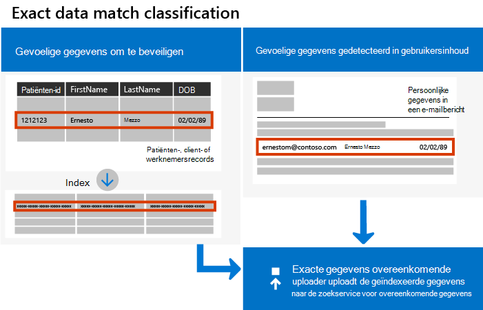
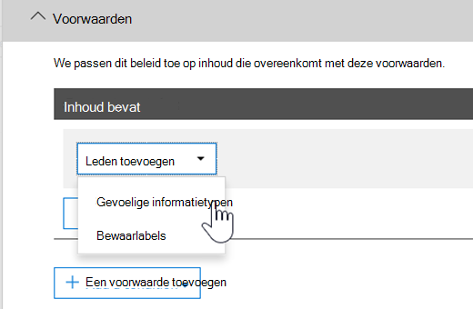

# <a name="create-custom-sensitive-information-types-with-exact-data-match-based-classification"></a>Aangepaste gevoelige informatietypen maken met een classificatie op basis van Exacte gegevensmatch


[Aangepaste gevoelige informatietypen worden](sensitive-information-type-learn-about.md) gebruikt om gevoelige items te identificeren, zodat u kunt voorkomen dat ze per ongeluk of ongepast worden gedeeld. U definieert een aangepast type gevoelige informatie (SIT)op basis van:

- patronen
- trefwoordbewijs, *zoals werknemer,* *badge* of *id*
- teken nabijheid van bewijs in een bepaald patroon
- betrouwbaarheidsniveaus

 Dergelijke aangepaste gevoelige informatietypen voldoen aan de zakelijke behoeften van veel organisaties.

Maar wat als u een aangepast type gevoelige informatie (SIT) wilt dat exacte gegevenswaarden gebruikt, in plaats van een type dat overeenkomsten op basis van algemene patronen heeft gevonden? Met de classificatie Exact Data Match (EDM) kunt u een aangepast type gevoelige informatie maken dat is ontworpen voor:

- dynamisch en eenvoudig worden vernieuwd
- schaalbaarder zijn
- leiden tot minder onwaar-positieven
- werken met gestructureerde gevoelige gegevens
- gevoelige informatie veiliger verwerken
- worden gebruikt met verschillende Microsoft-cloudservices



Met EDM-classificatie kunt u aangepaste gevoelige informatietypen maken die verwijzen naar exacte waarden in een database met gevoelige informatie. De database kan dagelijks worden vernieuwd en maximaal 100 miljoen rijen met gegevens bevatten. Als werknemers, patiënten of klanten komen en gaan en records veranderen, blijven uw aangepaste gevoelige informatietypen actueel en van toepassing. En u kunt classificatie op basis van EDM gebruiken met beleidsregels, zoals beleid voor preventie van gegevensverlies of Microsoft Cloud App Security [bestandsbeleid.](/cloud-app-security/data-protection-policies) [](dlp-learn-about-dlp.md)

> [!NOTE]
> Microsoft 365 Information Protection ondersteunt dubbele bytetekensettalen voor:
> - Vereenvoudigd Chinees
> - Traditioneel Chinees
> - Koreaks
> - Japans
> 
> Deze ondersteuning is beschikbaar voor typen gevoelige informatie. Zie [Ondersteuning voor Information Protection voor releaseopmerkingen bij dubbel-bytetekensets (preview)](mip-dbcs-relnotes.md) voor meer informatie.


## <a name="required-licenses-and-permissions"></a>Vereiste licenties en machtigingen

U moet een globale beheerder, compliancebeheerder of Exchange Online zijn om de taken uit te voeren die in dit artikel worden beschreven. Zie [Machtigingen](data-loss-prevention-policies.md#permissions) voor meer informatie over DLP-machtigingen.

EDM-gebaseerde classificatie is inbegrepen in deze abonnementen

- Office 365 E5
- Microsoft 365 E5
- Microsoft 365 E5 Compliance
- Microsoft E5/A5 Gegevensbeveiliging en -beheer

## <a name="portal-links-for-your-subscription"></a>Portalkoppelingen voor uw abonnement


|Portal  |World Wide/GCC  |GCC-High  |DOD  |
|---------|---------|---------|---------|
|Office SCC     |  protection.office.com       |scc.office365.us         |scc.protection.apps.mil |
|Microsoft 365 Beveiligingscentrum     |security.microsoft.com         |security.microsoft.us         |security.apps.mil|
|Microsoft 365 Compliancecentrum     |compliance.microsoft.com         |compliance.microsoft.us         |compliance.apps.mil|


## <a name="the-work-flow-at-a-glance"></a>De werkstroom in één oogopslag

|Fase  |Wat is er nodig  |
|---------|---------|
|[Deel 1: Classificatie op basis van EDM instellen](#part-1-set-up-edm-based-classification)<br/><br/>(Indien nodig)<br/>- [Het databaseschema bewerken](#editing-the-schema-for-edm-based-classification) <br/>- [Het schema verwijderen](#removing-the-schema-for-edm-based-classification) |- Lees de toegang tot de gevoelige gegevens<br/>- Databaseschema in XML-indeling (voorbeeld opgegeven)<br/>- Regelpakket in XML-indeling (voorbeeld beschikbaar)<br/>- Beheerdersmachtigingen voor het beveiligings- & compliancecentrum (met PowerShell) |
|[Deel 2: Hash en upload de gevoelige gegevens](#part-2-hash-and-upload-the-sensitive-data)<br/><br/>(Indien nodig)<br/>[De gegevens vernieuwen](#refreshing-your-sensitive-information-database) |- Aangepaste beveiligingsgroep en gebruikersaccount<br/>- Toegang van lokale beheerder tot machine met EDM-Upload Agent<br/>- Lees de toegang tot de gevoelige gegevens<br/>- Verwerken en plannen voor het vernieuwen van de gegevens|
|[Deel 3: Classificatie op basis van EDM gebruiken met uw Microsoft-cloudservices](#part-3-use-edm-based-classification-with-your-microsoft-cloud-services) |- Microsoft 365 abonnement met DLP<br/>- Classificatiefunctie op basis van EDM ingeschakeld |

### <a name="part-1-set-up-edm-based-classification"></a>Deel 1: Classificatie op basis van EDM instellen

Het instellen en configureren van classificatie op basis van EDM houdt in:

1. [Gevoelige gegevens opslaan in .csv of .tsv-indeling](#save-sensitive-data-in-csv-or-tsv-format)
2. [Het databaseschema voor gevoelige informatie definiëren](#define-the-schema-for-your-database-of-sensitive-information)
3. [Een regelpakket maken](#set-up-a-rule-package)


#### <a name="save-sensitive-data-in-csv-or-tsv-format"></a>Gevoelige gegevens opslaan in .csv of .tsv-indeling

1. Identificeer de gevoelige informatie die u wilt gebruiken. Exporteert de gegevens naar een app, zoals Microsoft Excel, en sla het bestand op in een tekstbestand. Het bestand kan worden opgeslagen in .csv (door komma's gescheiden waarden), .tsv (door tabbladen gescheiden waarden) of door een |. De TSV-indeling wordt aanbevolen in gevallen waarin uw gegevenswaarden komma's kunnen bevatten, zoals straatadressen.
Het gegevensbestand kan een maximum van:
      - Maximaal 100 miljoen rijen met gevoelige gegevens
      - Maximaal 32 kolommen (velden) per gegevensbron
      - Maximaal 5 kolommen (velden) gemarkeerd als doorzoekbaar

2. Structureer de gevoelige gegevens in het .csv of .tsv-bestand zodanig dat de eerste rij de namen bevat van de velden die worden gebruikt voor op EDM gebaseerde classificatie. In uw bestand hebt u mogelijk veldnamen zoals 'ssn', 'geboortedatum', 'voornaam', 'achternaam'. De namen van de kolomkoppen kunnen geen spaties of onderstrepingstekens bevatten. Het voorbeeldbestand .csv dat we in dit artikel gebruiken, heeft bijvoorbeeld de naam *PatientRecords.csv* en de kolommen zijn *PatientID,* *MRN,* *LastName,* *FirstName,* *SSN* en meer.

3. Let op de opmaak van de gevoelige gegevensvelden. Met name velden die komma's in hun inhoud kunnen bevatten, bijvoorbeeld een straatadres met de waarde 'Seattle,WA', worden geparseerd als twee afzonderlijke velden wanneer ze worden geparseerd als de .csv-indeling is geselecteerd. U kunt dit voorkomen door de TSV-indeling te gebruiken of de komma met waarden te omgeven door dubbele aanhalingstekens in de gevoelige gegevenstabel. Als komma's ook spaties bevatten, moet u een aangepaste SIT maken die overeenkomt met de bijbehorende indeling. Een SIT bijvoorbeeld die tekenreeks met meerdere woorden detecteert met komma's en spaties.

#### <a name="define-the-schema-for-your-database-of-sensitive-information"></a>Het schema voor uw database met gevoelige informatie definiëren

Als u om zakelijke of technische redenen liever geen PowerShell of opdrachtregel gebruikt om uw schema en EDM-patroon (regelpakket) te maken, kunt u de wizard Exacte gegevensmatch en Gevoelige [informatietype](sit-edm-wizard.md) gebruiken om deze te maken. Wanneer u klaar bent met het maken van het schema en het EDM-gevoelige infotypepatroon, gaat u terug naar alle stappen die nodig zijn om uw op EDM gebaseerde gevoelige informatietype beschikbaar te maken voor gebruik.

> [!NOTE]
> De wizard voor het schema voor exacte gegevensovereenkomst en het type gevoelige informatie is alleen beschikbaar voor de wereldwijde en GCC-cloud.

1. Definieer het schema voor de database met gevoelige informatie in XML-indeling (vergelijkbaar met ons voorbeeld hieronder). Noem dit schemabestand **edm.xml** en configureer het zo dat er voor elke kolom in de database een regel is waarin de syntaxis wordt gebruikt: 

      `\<Field name="" searchable=""/\>`.

      - Kolomnamen gebruiken voor *veldnaamwaarden.*
      - Gebruik *searchable="true"* voor de velden die u wilt doorzoeken tot maximaal 5 velden. Ten minste één veld moet doorzoekbaar zijn.

      In het volgende XML-bestand wordt bijvoorbeeld het schema voor een patiëntenrecorddatabase gedefinieerd, met vijf velden die als doorzoekbaar zijn opgegeven: *PatientID,* *MRN,* *SSN,* *Telefoon* en *DOB.*

      (U kunt ons voorbeeld kopiëren, wijzigen en gebruiken.)

      ```xml
      <EdmSchema xmlns="http://schemas.microsoft.com/office/2018/edm">
            <DataStore name="PatientRecords" description="Schema for patient records" version="1">
                  <Field name="PatientID" searchable="true" caseInsensitive="true" ignoredDelimiters="-,/,*,#,^" />
                  <Field name="MRN" searchable="true" />
                  <Field name="FirstName" />
                  <Field name="LastName" />
                  <Field name="SSN" searchable="true" />
                  <Field name="Phone" searchable="true" />
                  <Field name="DOB" searchable="true" />
                  <Field name="Gender" />
                  <Field name="Address" />
            </DataStore>
      </EdmSchema>
      ```

##### <a name="configurable-match-using-the-caseinsensitive-and-ignoreddelimiters-fields"></a>Configureerbare overeenkomst met de velden CaseInensitive en ignoredDelimiters

In het bovenstaande XML-voorbeeld wordt gebruik gemaakt van `caseInsensitive` de velden en de `ignoredDelimiters` velden. 

Wanneer u het veld ***caseInsensitive** _ op de waarde van in uw schemadefinitie op neemt, wordt een item niet uitgesloten op basis van `true` caseverschillen voor `PatientID` veld. Dus EDM ziet, `PatientID` _ *FOO-1234** en **fOo-1234** als identiek.

Wanneer u het veld ***ignoredDelimiters** _ met ondersteunde tekens op neemt, worden deze tekens genegeerd in `PatientID` de . Dus EDM ziet, `PatientID` _ *FOO-1234** en `PatientID` **FOO#1234** als identiek. De `ignoredDelimiters` vlag ondersteunt alle niet-alfanumerieke tekens. Hier volgen enkele voorbeelden:
- \.
- \-
- \/
- \_
- \*
- \^
- \#
- \!
- \?
- \[
- \]
- \{
- \}
- \\
- \~
- \; 

The `ignoredDelimiters` vlag ondersteunt het volgende niet:
- tekens 0-9
- A-Z
- a-z
- \"
- \,

In dit voorbeeld, waarin beide en worden gebruikt, worden `caseInsensitive` `ignoredDelimiters` **FOO-1234** en **fOo#1234** door EDM als identiek geclassificeerd en wordt het item geclassificeerd als een type gevoelige informatie voor patiëntenrecords. 

4. Verbinding maken met het Beveiligings- en compliancecentrum met behulp van de procedures in [Verbinding maken met Beveiligings- en compliancecentrum van PowerShell](/powershell/exchange/connect-to-scc-powershell).

5. Als u het databaseschema wilt uploaden, moet u de volgende cmdlets één voor één uitvoeren:

      ```powershell
      $edmSchemaXml=Get-Content .\\edm.xml -Encoding Byte -ReadCount 0
      New-DlpEdmSchema -FileData $edmSchemaXml -Confirm:$true
      ```

      U wordt als volgt gevraagd om dit te bevestigen:

      > Bevestigen
      >
      > Weet u zeker dat u deze actie wilt uitvoeren?
      >
      > Nieuw EDM-schema voor het gegevensopslag 'patiëntenrecords' wordt geïmporteerd.
      >
      > \[Y \] Yes A Yes to All N No L No to All \[ \] \[ \] \[ \] \[ ? \] Help (standaard is 'Y'):

> [!TIP]
> Als u wilt dat uw wijzigingen zonder bevestiging plaatsvinden, gebruikt u in stap 5 deze cmdlet: New-DlpEdmSchema -FileData $edmSchemaXml

> [!NOTE]
> Het kan 10 tot 60 minuten duren voordat het EDMSchema wordt bijgewerkt met toevoegingen. De update moet worden voltooid voordat u stappen uitvoert die gebruikmaken van de toevoegingen.

#### <a name="set-up-a-rule-package"></a>Een regelpakket instellen

1. Maak een regelpakket in XML-indeling (met Unicode-codering), vergelijkbaar met het volgende voorbeeld. (U kunt ons voorbeeld kopiëren, wijzigen en gebruiken.)

      Wanneer u het regelpakket in stelt, moet u uw .csv of .tsv-bestand en hetedm.xml **verwijzen.** U kunt ons voorbeeld kopiëren, wijzigen en gebruiken. In deze voorbeeld-xml moeten de volgende velden worden aangepast om het gevoelige type EDM te maken:

      - **RulePack-id & ExactMatch-id:** Gebruik [Nieuwe GUID](/powershell/module/microsoft.powershell.utility/new-guid?view=powershell-6) om een GUID te genereren.

      - **Gegevensstore:** in dit veld wordt aangegeven dat het opzoekgegevensopslag van EDM moet worden gebruikt. U geeft een gegevensbronnaam op van een geconfigureerd EDM-schema.

      - **idMatch:** dit veld wijst naar het primaire element voor EDM.
        - Overeenkomsten: hiermee geeft u het veld op dat moet worden gebruikt voor exacte opzoekactie. U geeft een doorzoekbare veldnaam op in EDM-schema voor de DataStore.
        - Classificatie: Dit veld geeft de gevoelige type overeenkomst aan die EDM-opzoekactie activeert. U kunt de naam of GUID van een bestaand ingebouwde of aangepaste gevoelige informatietype geven. Elke tekenreeks die overeenkomt met het opgegeven type gevoelige informatie, wordt gehasht en vergeleken met elke vermelding in de tabel met gevoelige informatie. Als u een aangepast type gevoelige informatie gebruikt als het element Classificatie in EDM, vermijdt u het gebruik van een element dat past bij een groot percentage inhoud (zoals 'elk getal' of 'een woord met vijf letters') door ondersteunende trefwoorden toe te voegen of opmaak toe te voegen in de definitie van het aangepaste classificatiegevoelige informatietype. 

      - **Overeenkomen:** Dit veld wijst naar extra bewijs dat is gevonden in de nabijheid van idMatch.
        - Overeenkomsten: U geeft een veldnaam op in het EDM-schema voor DataStore.
      - **Resource:** In deze sectie worden de naam en beschrijving opgegeven voor het gevoelige type in meerdere locales.
        - idRef: U geeft GUID voor ExactMatch-id.
        - Naam & beschrijvingen: zo nodig aanpassen.

      ```xml
      <RulePackage xmlns="http://schemas.microsoft.com/office/2018/edm">
        <RulePack id="fd098e03-1796-41a5-8ab6-198c93c62b11">
          <Version build="0" major="2" minor="0" revision="0" />
          <Publisher id="eb553734-8306-44b4-9ad5-c388ad970528" />
          <Details defaultLangCode="en-us">
            <LocalizedDetails langcode="en-us">
              <PublisherName>IP DLP</PublisherName>
              <Name>Health Care EDM Rulepack</Name>
              <Description>This rule package contains the EDM sensitive type for health care sensitive types.</Description>
            </LocalizedDetails>
          </Details>
        </RulePack>
        <Rules>
          <ExactMatch id = "E1CC861E-3FE9-4A58-82DF-4BD259EAB371" patternsProximity = "300" dataStore ="PatientRecords" recommendedConfidence = "65" >
            <Pattern confidenceLevel="65">
              <idMatch matches = "SSN" classification = "U.S. Social Security Number (SSN)" />
            </Pattern>
            <Pattern confidenceLevel="75">
              <idMatch matches = "SSN" classification = "U.S. Social Security Number (SSN)" />
              <Any minMatches ="3" maxMatches ="6">
                <match matches="PatientID" />
                <match matches="MRN"/>
                <match matches="FirstName"/>
                <match matches="LastName"/>
                <match matches="Phone"/>
                <match matches="DOB"/>
              </Any>
            </Pattern>
          </ExactMatch>
          <LocalizedStrings>
            <Resource idRef="E1CC861E-3FE9-4A58-82DF-4BD259EAB371">
              <Name default="true" langcode="en-us">Patient SSN Exact Match.</Name>
              <Description default="true" langcode="en-us">EDM Sensitive type for detecting Patient SSN.</Description>
            </Resource>
          </LocalizedStrings>
        </Rules>
      </RulePackage>
      ```

2. Upload het regelpakket door de volgende PowerShell-cmdlets één voor één uit te laten lopen:

      ```powershell
      $rulepack=Get-Content .\\rulepack.xml -Encoding Byte -ReadCount 0
      New-DlpSensitiveInformationTypeRulePackage -FileData $rulepack
      ```

Op dit moment hebt u classificatie op basis van EDM ingesteld. De volgende stap is om de gevoelige gegevens te hashen en vervolgens de hashes voor indexering te uploaden.

In de vorige procedure wordt in ons schema PatientRecords vijf velden gedefinieerd als doorzoekbaar: *PatientID,* *MRN, SSN,* *Telefoon* en *DOB.*  Ons voorbeeldregelpakket bevat deze velden en verwijst naar het databaseschemabestand **(edm.xml),** met één *ExactMatch-item* per doorzoekbaar veld. Houd rekening met het volgende ExactMatch-item:

```xml
<ExactMatch id = "E1CC861E-3FE9-4A58-82DF-4BD259EAB371" patternsProximity = "300" dataStore ="PatientRecords" recommendedConfidence = "65" >
      <Pattern confidenceLevel="65">
        <idMatch matches = "SSN" classification = "U.S. Social Security Number (SSN)" />
      </Pattern>
      <Pattern confidenceLevel="75">
        <idMatch matches = "SSN" classification = "U.S. Social Security Number (SSN)" />
        <Any minMatches ="3" maxMatches ="100">
          <match matches="PatientID" />
          <match matches="MRN"/>
          <match matches="FirstName"/>
          <match matches="LastName"/>
          <match matches="Phone"/>
          <match matches="DOB"/>
        </Any>
      </Pattern>
    </ExactMatch>
```

Houd er in dit voorbeeld rekening mee dat:

- De gegevensStore-naam verwijst naar het .csv bestand dat we eerder hebben gemaakt: **dataStore = "PatientRecords"**.

- De idMatch-waarde verwijst naar een doorzoekbaar veld dat wordt weergegeven in het databaseschemabestand: **idMatch matches = "SSN"**.

- De classificatiewaarde verwijst naar een bestaand of aangepast type gevoelige informatie: **classificatie = "U.S. Social Security Number (SSN)"**. (In dit geval gebruiken we het bestaande type gevoelige informatie van het Amerikaanse sociale-zekerheidsnummer.)

> [!NOTE]
> Het kan 10 tot 60 minuten duren voordat het EDMSchema wordt bijgewerkt met toevoegingen. De update moet worden voltooid voordat u stappen uitvoert die gebruikmaken van de toevoegingen.
 
Nadat u uw regelpakket hebt geïmporteerd met uw EDM-gevoelige gegevenstype en uw gevoelige gegevenstabel hebt geïmporteerd, kunt u het nieuwe type testen met de functie **Test** in de wizard EDM in het compliancecentrum. Zie [De wizard Exacte gegevensmatchschema en wizard Gevoelige](sit-edm-wizard.md) informatie gebruiken voor instructies over het gebruik van deze functionaliteit.

#### <a name="editing-the-schema-for-edm-based-classification"></a>Het schema voor classificatie op basis van EDM bewerken

Als u wijzigingen wilt  aanbrengen in uwedm.xmlbestand, zoals het wijzigen van de velden die worden gebruikt voor op EDM gebaseerde classificatie, volgt u de volgende stappen:

> [!TIP]
> U kunt uw EDM-schema en gegevensbestand wijzigen om te profiteren van **configureerbare overeenkomst.** Wanneer EDM is geconfigureerd, worden caseverschillen en enkele scheidingstekens genegeerd wanneer een item wordt geëvalueerd. Dit maakt het definiëren van uw xml-schema en uw gevoelige gegevensbestanden eenvoudiger. Zie Schema voor exacte gegevensmatch wijzigen om configureerbare overeenkomst te gebruiken voor [meer informatie.](sit-modify-edm-schema-configurable-match.md)

1. Bewerk **uwedm.xml** bestand (dit is het bestand dat wordt besproken in de sectie Het [schema](#define-the-schema-for-your-database-of-sensitive-information) definiëren van dit artikel).

2. Verbinding maken met het Beveiligings- en compliancecentrum met behulp van de procedures in [Verbinding maken met Beveiligings- en compliancecentrum van PowerShell](/powershell/exchange/connect-to-scc-powershell).

3. Als u het databaseschema wilt bijwerken, moet u de volgende cmdlets één voor één uitvoeren:

      ```powershell
      $edmSchemaXml=Get-Content .\\edm.xml -Encoding Byte -ReadCount 0
      Set-DlpEdmSchema -FileData $edmSchemaXml -Confirm:$true
      ```

      U wordt als volgt gevraagd om dit te bevestigen:

      > Bevestigen
      >
      > Weet u zeker dat u deze actie wilt uitvoeren?
      >
      > EDM-schema voor het gegevensopslag 'patiëntenrecords' wordt bijgewerkt.
      >
      > \[Y \] Yes A Yes to All N No L No to All \[ \] \[ \] \[ \] \[ ? \] Help (standaard is 'Y'):

      > [!TIP]
      > Als u wilt dat uw wijzigingen zonder bevestiging plaatsvinden, gebruikt u in stap 3 in plaats daarvan deze cmdlet: Set-DlpEdmSchema -FileData $edmSchemaXml

      > [!NOTE]
      > Het kan 10 tot 60 minuten duren voordat het EDMSchema wordt bijgewerkt met toevoegingen. De update moet worden voltooid voordat u stappen uitvoert die gebruikmaken van de toevoegingen.

#### <a name="removing-the-schema-for-edm-based-classification"></a>Het schema voor classificatie op basis van EDM verwijderen

(Indien nodig) Als u het schema wilt verwijderen dat u gebruikt voor op EDM gebaseerde classificatie, gaat u als volgt te werk:

1. Verbinding maken met het Beveiligings- en compliancecentrum met behulp van de procedures in [Verbinding maken met Beveiligings- en compliancecentrum van PowerShell](/powershell/exchange/connect-to-scc-powershell).

2. Voer de volgende PowerShell-cmdlets uit en vervang de naam van de gegevensopslag van 'patiëntenrecords' met de cmdlets die u wilt verwijderen:

      ```powershell
      Remove-DlpEdmSchema -Identity patientrecords
      ```

      U wordt gevraagd het volgende te bevestigen:

      > Bevestigen
      >
      > Weet u zeker dat u deze actie wilt uitvoeren?
      >
      > EDM-schema voor het gegevensopslag 'patiëntenrecords' wordt verwijderd.
      >
      > \[Y \] Yes A Yes to All N No L No to All \[ \] \[ \] \[ \] \[ ? \] Help (standaard is 'Y'):

      > [!TIP]
      >  Als u wilt dat uw wijzigingen zonder bevestiging plaatsvinden, gebruikt u in stap 2 deze cmdlet: Remove-DlpEdmSchema -Identity patientrecords -Confirm:$false

### <a name="part-2-hash-and-upload-the-sensitive-data"></a>Deel 2: Hash en upload de gevoelige gegevens

In deze fase stelt u een aangepaste beveiligingsgroep en gebruikersaccount in en stelt u het hulpprogramma EDM Upload Agent in. Vervolgens gebruikt u het hulpprogramma om de gevoelige gegevens te hashen met een zoutwaarde en deze te uploaden.

Het hashen en uploaden kan worden uitgevoerd met één computer of u kunt de stap voor hashing scheiden van de uploadstap voor meer beveiliging.

Als u wilt hashen en uploaden vanaf één computer, moet u dit doen vanaf een computer die rechtstreeks verbinding kan maken met uw Microsoft 365 tenant. Hiervoor moeten uw duidelijke tekstgevoelige gegevensbestanden op die computer staan voor hashing.

Als u het gevoelige gegevensbestand met duidelijke tekst niet wilt onthullen, kunt u het hashen op een computer op een veilige locatie en vervolgens het hashbestand en het zoutbestand kopiëren naar een computer die rechtstreeks verbinding kan maken met uw Microsoft 365-tenant voor uploaden. In dit scenario hebt u de EDMUploadAgent op beide computers nodig.

> [!IMPORTANT]
> Als u de wizard Exacte gegevensmatch en de wizard Gevoelige gegevenstype hebt gebruikt om uw schema- en patroonbestanden te maken, moet u ***het*** schema voor deze procedure downloaden.

> [!NOTE]
> Als uw organisatie Klantsleutel heeft ingesteld voor Microsoft 365 op [tenantniveau,](customer-key-overview.md)wordt de versleutelingsfunctionaliteit van Exact data match automatisch gebruikt. Dit is alleen beschikbaar voor E5-gelicentieerde tenants in de commerciële cloud.

#### <a name="prerequisites"></a>Vereisten

- een werk- of schoolaccount voor Microsoft 365 dat wordt toegevoegd aan de **beveiligingsgroep EDM \_ DataUploaders**
- een Windows 10 of Windows Server 2016 met .NET versie 4.6.2 voor het uitvoeren van de EDMUploadAgent
- een adreslijst op uw uploadmachine voor het volgende:
  - EDMUploadAgent
  - uw gevoelige itembestand in .csv of .tsv-indeling, **PatientRecords.csv** in onze voorbeelden
  - de uitvoerhash- en zoutbestanden
  - de gegevensstorenaam uit **hetedm.xml** bestand, voor dit voorbeeld de naam `PatientRecords`
- Als u de wizard Exacte gegevensmatch en de wizard [Gevoelige gegevenstype hebt gebruikt,](sit-edm-wizard.md) ***moet u het*** downloaden

#### <a name="set-up-the-security-group-and-user-account"></a>De beveiligingsgroep en het gebruikersaccount instellen

1. Als globale beheerder gaat u naar het beheercentrum met de juiste [koppeling](#portal-links-for-your-subscription) voor uw abonnement en maakt u een [beveiligingsgroep](/office365/admin/email/create-edit-or-delete-a-security-group) met de naam **EDM \_ DataUploaders.**

2. Voeg een of meer gebruikers toe aan de **beveiligingsgroep EDM \_ DataUploaders.** (Deze gebruikers beheren de database met gevoelige informatie.)

#### <a name="hash-and-upload-from-one-computer"></a>Hash en upload vanaf één computer

Deze computer moet directe toegang hebben tot uw Microsoft 365 tenant.

> [!NOTE]
>
> Voordat u deze procedure start, moet u ervoor zorgen dat u lid bent van de **beveiligingsgroep EDM \_ DataUploaders.**
>
> Desgewenst kunt u een validatie uitvoeren op uw .csv of .tsv-bestand voordat u het uploadt door het volgende uit te voeren:
>
> `EdmUploadAgent.exe /ValidateData /DataFile [data file] /Schema [schema file]`
>
> Voor meer informatie over alle EdmUploadAgent.exe >ondersteunde parameters uitvoeren
>
> `EdmUploadAgent.exe /?`

#### <a name="links-to-edm-upload-agent-by-subscription-type"></a>Koppelingen naar EDM-uploadagent per abonnementstype

- [Commercial + GCC](https://go.microsoft.com/fwlink/?linkid=2088639) - de meeste commerciële klanten moeten dit gebruiken
- [GCC-High](https://go.microsoft.com/fwlink/?linkid=2137521) - Dit is specifiek voor abonnees van de cloud van de overheid met hoge beveiliging
- [DoD](https://go.microsoft.com/fwlink/?linkid=2137807) - dit is specifiek voor klanten van de cloud van het Department of Defense van de Verenigde Staten

1. Maak een werkmap voor de EDMUploadAgent. Bijvoorbeeld **C:\EDM\Data.** Plaats het **PatientRecords.csv** daar.

2. Download en installeer de juiste [EDM-Upload agent](#links-to-edm-upload-agent-by-subscription-type) voor uw abonnement in de adreslijst die u in stap 1 hebt gemaakt.

   > [!NOTE]
   > De EDMUploadAgent op de bovenstaande koppelingen is bijgewerkt om automatisch een zoute waarde toe te voegen aan de gehashte gegevens. U kunt ook uw eigen zoutwaarde leveren. Wanneer u deze versie hebt gebruikt, kunt u de vorige versie van de EDMUploadAgent niet meer gebruiken.
   >
   > U kunt gegevens met de EDMUploadAgent slechts twee keer per dag uploaden naar een bepaalde gegevensopslag.

   > [!TIP]
   > Als u een lijst wilt halen uit de ondersteunde opdrachtparameters, moet u de agent geen argumenten geven. Bijvoorbeeld 'EdmUploadAgent.exe'.

2. Machtig de EDM-Upload agent, open het venster Opdrachtprompt (als beheerder), schakel over naar de **adreslijst C:\EDM\Data** en voer vervolgens de volgende opdracht uit:

   `EdmUploadAgent.exe /Authorize`

3. Meld u aan met uw werk- of schoolaccount voor Microsoft 365 die is toegevoegd aan de EDM_DataUploaders beveiligingsgroep. Uw tenantgegevens worden uit het gebruikersaccount gehaald om de verbinding te maken.

   OPTIONEEL: Als u de wizard Exacte gegevensmatch en de wizard Gevoelige gegevenstype hebt gebruikt om uw schema- en patroonbestanden te maken, voer dan de volgende opdracht uit in een opdrachtpromptvenster:

   `EdmUploadAgent.exe /SaveSchema /DataStoreName <schema name> /OutputDir <path to output folder>`

4. Als u de gevoelige gegevens wilt hashen en uploaden, voer u de volgende opdracht uit in het venster Opdrachtprompt:

   `EdmUploadAgent.exe /UploadData /DataStoreName [DS Name] /DataFile [data file] /HashLocation [hash file location] /Schema [Schema file] /ColumnSeparator ["{Tab}"|"|"]`

   Voorbeeld: **EdmUploadAgent.exe /UploadData /DataStoreName PatientRecords /DataFile C:\Edm\Hash\PatientRecords.csv /HashLocation C:\Edm\Hash /Schema edm.xml**

   De standaardindeling voor het gevoelige gegevensbestand is door komma's gescheiden waarden. U kunt een bestand met tabs opgeven door de optie {Tab}" aan te geven met de parameter /ColumnSeparator, of u kunt een door een pijp gescheiden bestand opgeven door de optie '|' aan te geven.  
   Deze opdracht voegt automatisch een willekeurig gegenereerde zoutwaarde toe aan de hash voor meer beveiliging. Als u desgewenst uw eigen zoutwaarde wilt gebruiken, voegt u de **/Salt <saltvalue>** toe aan de opdracht. Deze waarde moet 64 tekens lang zijn en mag alleen de a-z-tekens en 0-9 tekens bevatten.

5. Controleer de uploadstatus door deze opdracht uit te voeren:

   `EdmUploadAgent.exe /GetSession /DataStoreName \<DataStoreName\>`

   Voorbeeld: **EdmUploadAgent.exe /GetSession /DataStoreName PatientRecords**

   Zoek naar de status in **ProcessingInProgress.** Controleer opnieuw om de paar minuten totdat de status wordt gewijzigd in **Voltooid.** Wanneer de status is voltooid, zijn uw EDM-gegevens klaar voor gebruik.

#### <a name="separate-hash-and-upload"></a>Hash scheiden en uploaden

Voer de hash uit op een computer in een veilige omgeving.

OPTIONEEL: Als u de wizard Exacte gegevensmatch en de wizard Gevoelige gegevenstype hebt gebruikt om uw schema- en patroonbestanden te maken, voer dan de volgende opdracht uit in een opdrachtpromptvenster:

`EdmUploadAgent.exe /SaveSchema /DataStoreName <schema name> /OutputDir <path to output folder>`

1. Voer de volgende opdracht uit in opdrachtpromptvensters:

   `EdmUploadAgent.exe /CreateHash /DataFile [data file] /HashLocation [hash file location] /Schema [Schema file] >`

   Bijvoorbeeld:

   > **EdmUploadAgent.exe /CreateHash /DataFile C:\Edm\Data\PatientRecords.csv /HashLocation C:\Edm\Hash /Schema edm.xml**

   Hiermee worden een gehasht bestand en een zoutbestand met deze extensies uitgevoerd als u de optie **/Zout <saltvalue>** niet hebt opgegeven:
   - . EdmHash
   - . EdmSalt

2. Kopieer deze bestanden op een veilige manier naar de computer die u gebruikt om uw gevoelige items .csv of .tsv-bestand (PatientRecords) naar uw tenant te uploaden.

   Als u de gehashte gegevens wilt uploaden, moet u de volgende opdracht uitvoeren in Windows opdrachtprompt:

   `EdmUploadAgent.exe /UploadHash /DataStoreName \<DataStoreName\> /HashFile \<HashedSourceFilePath\>`

   Bijvoorbeeld:

   > **EdmUploadAgent.exe /UploadHash /DataStoreName PatientRecords /HashFile C: \\ Edm \\ Hash \\ PatientRecords.EdmHash**


   Voer de volgende opdracht uit in het venster Opdrachtprompt om te controleren of uw gevoelige gegevens zijn geüpload:

   `EdmUploadAgent.exe /GetDataStore`

   U ziet een lijst met gegevensopslag en wanneer deze voor het laatst zijn bijgewerkt.

   Als u alle gegevens uploads naar een bepaalde winkel wilt zien, voer dan de volgende opdracht uit in Windows opdrachtprompt:

   `EdmUploadAgent.exe /GetSession /DataStoreName <DataStoreName>`

   Ga verder met het instellen van uw proces en planning voor [het vernieuwen van de database met gevoelige informatie.](#refreshing-your-sensitive-information-database)

Op dit moment kunt u de classificatie op basis van EDM gebruiken met uw Microsoft-cloudservices. U kunt bijvoorbeeld een [DLP-beleid instellen met EDM-classificatie.](#to-create-a-dlp-policy-with-edm)

#### <a name="refreshing-your-sensitive-information-database"></a>Uw database met gevoelige informatie vernieuwen

U kunt de database met gevoelige gegevens dagelijks vernieuwen en met het EDM-Upload kunt u de gevoelige gegevens opnieuw indexeren en vervolgens de geïndexeerde gegevens opnieuw uploaden.

1. Bepaal uw proces en frequentie (dagelijks of wekelijks) voor het vernieuwen van de database met gevoelige informatie.

2. Export de gevoelige gegevens opnieuw naar een app, zoals Microsoft Excel, en sla het bestand op in een .csv of .tsv-indeling. Bewaar dezelfde bestandsnaam en locatie die u hebt gebruikt toen u de stappen in Hash hebt gevolgd [en de gevoelige gegevens uploadt.](#part-2-hash-and-upload-the-sensitive-data)

      > [!NOTE]
      > Als er geen wijzigingen zijn aangebracht in de structuur (veldnamen) van het .csv- of TSV-bestand, hoeft u geen wijzigingen aan te brengen in het databaseschemabestand wanneer u de gegevens vernieuwt. Maar als u wijzigingen moet aanbrengen, moet u het databaseschema en het regelpakket dienovereenkomstig bewerken.

3. Gebruik [Taakplanning om stap](/windows/desktop/TaskSchd/task-scheduler-start-page) 2 en 3 in de hash te automatiseren en de gevoelige [gegevensprocedure te](#part-2-hash-and-upload-the-sensitive-data) uploaden. U kunt taken op verschillende manieren plannen:

      | Methode             | Wat moet u doen? |
      | ---------------------- | ---------------- |
      | Windows PowerShell     | Zie de [documentatie van ScheduledTasks](/powershell/module/scheduledtasks/?view=win10-ps) en het [voorbeeld van PowerShell-script](#example-powershell-script-for-task-scheduler) in dit artikel |
      | Task Scheduler API     | Zie de [documentatie van Taakplanning](/windows/desktop/TaskSchd/using-the-task-scheduler)                                                                                                                                                                                                                                                                                |
      | Windows gebruikersinterface | Klik Windows op **Start** en typ Taakplanning. Klik vervolgens in de lijst met resultaten met de rechtermuisknop op **Taakplanning** en kies **Uitvoeren als beheerder.**                                                                                                                                                                                                                                                                           |

#### <a name="example-powershell-script-for-task-scheduler"></a>Voorbeeld van PowerShell-script voor taakplanning

Deze sectie bevat een voorbeeld van PowerShell-script dat u kunt gebruiken om uw taken te plannen voor het hashen van gegevens en het uploaden van de gehashte gegevens:

##### <a name="to-schedule-hashing-and-upload-in-a-combined-step"></a>Hashing plannen en uploaden in een gecombineerde stap

```powershell
param(\[string\]$dataStoreName,\[string\]$fileLocation)
\# Assuming current user is also the user context to run the task
$user = "$env:USERDOMAIN\\$env:USERNAME"
$edminstallpath = 'C:\\Program Files\\Microsoft\\EdmUploadAgent\\'
$edmuploader = $edminstallpath + 'EdmUploadAgent.exe'
$csvext = '.csv'
$schemaext = '.xml'
\# Assuming file name is same as data store name and file is in .csv format
$dataFile = "$fileLocation\\$dataStoreName$csvext"
\# Assuming location to store hash file is same as the location of csv file
$hashLocation = $fileLocation
\# Assuming Schema file name is same as data store name
$schemaFile = "$fileLocation\\$dataStoreName$schemaext"
$uploadDataArgs = '/UploadData /DataStoreName ' + $dataStoreName + ' /DataFile ' + $dataFile + ' /HashLocation' + $hashLocation + ' /Schema ' + $schemaFile
\# Set up actions associated with the task
$actions = @()
$actions += New-ScheduledTaskAction -Execute $edmuploader -Argument $uploadDataArgs -WorkingDirectory $edminstallpath
\# Set up trigger for the task
$trigger = New-ScheduledTaskTrigger -Weekly -DaysOfWeek Sunday -At 2am
\# Set up task settings
$principal = New-ScheduledTaskPrincipal -UserId $user -LogonType S4U -RunLevel Highest
$settings = New-ScheduledTaskSettingsSet -RunOnlyIfNetworkAvailable -StartWhenAvailable -WakeToRun
\# Create the scheduled task
$scheduledTask = New-ScheduledTask -Action $actions -Principal $principal -Trigger $trigger -Settings $settings
\# Get credentials to run the task
$creds = Get-Credential -UserName $user -Message "Enter credentials to run the task"
$password=\[Runtime.InteropServices.Marshal\]::PtrToStringAuto(\[Runtime.InteropServices.Marshal\]::SecureStringToBSTR($creds.Password))
\# Register the scheduled task
$taskName = 'EDMUpload\_' + $dataStoreName
Register-ScheduledTask -TaskName $taskName -InputObject $scheduledTask -User $user -Password $password
```

#### <a name="to-schedule-hashing-and-upload-as-separate-steps"></a>Hashing plannen en uploaden als afzonderlijke stappen

```powershell
param(\[string\]$dataStoreName,\[string\]$fileLocation)
\# Assuming current user is also the user context to run the task
$user = "$env:USERDOMAIN\\$env:USERNAME"
$edminstallpath = 'C:\\Program Files\\Microsoft\\EdmUploadAgent\\'
$edmuploader = $edminstallpath + 'EdmUploadAgent.exe'
$csvext = '.csv'
$edmext = '.EdmHash'
$schemaext = '.xml'
\# Assuming file name is same as data store name and file is in .csv format
$dataFile = "$fileLocation\\$dataStoreName$csvext"
$hashFile = "$fileLocation\\$dataStoreName$edmext"
\# Assuming Schema file name is same as data store name
$schemaFile = "$fileLocation\\$dataStoreName$schemaext "

\# Assuming location to store hash file is same as the location of csv file
$hashLocation = $fileLocation
$createHashArgs = '/CreateHash' + ' /DataFile ' + $dataFile + ' /HashLocation ' + $hashLocation + ' /Schema ' + $schemaFile
$uploadHashArgs = '/UploadHash /DataStoreName ' + $dataStoreName + ' /HashFile ' + $hashFile
\# Set up actions associated with the task
$actions = @()
$actions += New-ScheduledTaskAction -Execute $edmuploader -Argument $createHashArgs -WorkingDirectory $edminstallpath
$actions += New-ScheduledTaskAction -Execute $edmuploader -Argument $uploadHashArgs -WorkingDirectory $edminstallpath
\# Set up trigger for the task
$trigger = New-ScheduledTaskTrigger -Weekly -DaysOfWeek Sunday -At 2am
\# Set up task settings
$principal = New-ScheduledTaskPrincipal -UserId $user -LogonType S4U -RunLevel Highest
$settings = New-ScheduledTaskSettingsSet -RunOnlyIfNetworkAvailable -StartWhenAvailable -WakeToRun
\# Create the scheduled task
$scheduledTask = New-ScheduledTask -Action $actions -Principal $principal -Trigger $trigger -Settings $settings
\# Get credentials to run the task
$creds = Get-Credential -UserName $user -Message "Enter credentials to run the task"
$password=\[Runtime.InteropServices.Marshal\]::PtrToStringAuto(\[Runtime.InteropServices.Marshal\]::SecureStringToBSTR($creds.Password))
\# Register the scheduled task
$taskName = 'EDMUpload\_' + $dataStoreName
Register-ScheduledTask -TaskName $taskName -InputObject $scheduledTask -User $user -Password $password

```

### <a name="part-3-use-edm-based-classification-with-your-microsoft-cloud-services"></a>Deel 3: Classificatie op basis van EDM gebruiken met uw Microsoft-cloudservices

Deze locaties ondersteunen EDM-gevoelige informatietypen:

- DLP voor Exchange Online (e-mail)
- OneDrive voor Bedrijven (bestanden)
- Microsoft Teams (gesprekken)
- DLP voor SharePoint (bestanden)
- Microsoft Cloud App Security DLP-beleid
- Beleid voor automatisch labelen op de server - beschikbaar voor commerciële cloudklanten en cloudklanten van de overheid

#### <a name="to-create-a-dlp-policy-with-edm"></a>Een DLP-beleid maken met EDM

1. Ga naar het Beveiligings- & compliancecentrum met de juiste [koppeling voor uw abonnement.](#portal-links-for-your-subscription)

2. Kies **Beleid voor preventie van** \> **gegevensverlies.**

3. Kies **Een beleid aangepaste** \> **volgende** \> **maken.**

4. Geef op **het tabblad Naam** uw beleid een naam en beschrijving op en kies **volgende**.

5. Selecteer op **het tabblad** Locaties kiezen de optie Laat mij specifieke **locaties kiezen** en kies vervolgens **Volgende.**

6. Selecteer in **de kolom** Status **Exchange e-mail, OneDrive accounts, Teams chat-** en kanaalbericht en kies vervolgens **Volgende.**

7. Kies op **het tabblad** Beleidsinstellingen de optie Geavanceerde **instellingen gebruiken** en kies vervolgens **Volgende.**

8. Kies **+ Nieuwe regel**.

9. Geef in **de** sectie Naam een naam en beschrijving op voor de regel.

10. Kies in **de sectie** Voorwaarden in de lijst + **Een voorwaarde** toevoegen de optie Inhoud bevat **gevoelig type.**

      

11. Zoek naar het gevoelige informatietype dat u hebt gemaakt bij het instellen van het regelpakket en kies **vervolgens + Toevoegen.**  
    Kies vervolgens **Klaar**.

12. Selecteer de opties voor uw regel, zoals Gebruikersmeldingen, Gebruiker **overschrijven,** **Incidentrapporten,** en kies **vervolgens Opslaan.**

13. Controleer op **het tabblad** Beleidsinstellingen uw regels en kies **Volgende.**

14. Geef op of u het beleid meteen wilt in- of uitschakelen, of uitgeschakeld wilt houden. Kies vervolgens **Volgende**.

15. Controleer uw **beleid op het** tabblad Uw instellingen controleren. Breng de benodigde wijzigingen aan. Wanneer u klaar bent, kiest u **Maken.**

> [!NOTE]
> Sta ongeveer één uur toe dat uw nieuwe DLP-beleid zijn weg door uw datacenter kan vinden.

## <a name="related-articles"></a>Verwante artikelen

- [Definities van entiteiten van het type gevoelige informatie](sensitive-information-type-entity-definitions.md)
- [Meer informatie over typen gevoelige informatie](sensitive-information-type-learn-about.md)
- [Meer informatie over preventie van gegevensverlies](dlp-learn-about-dlp.md)
- [Microsoft Cloud App Security](/cloud-app-security)
- [New-DlpEdmSchema](/powershell/module/exchange/new-dlpedmschema)
- [Schema exacte gegevensmatch wijzigen om configureerbare overeenkomst te gebruiken](sit-modify-edm-schema-configurable-match.md)
