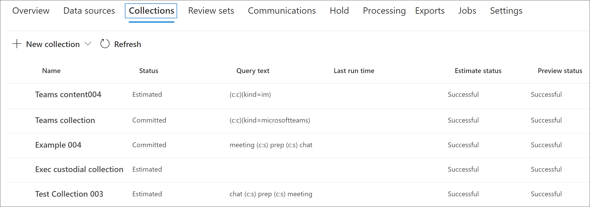
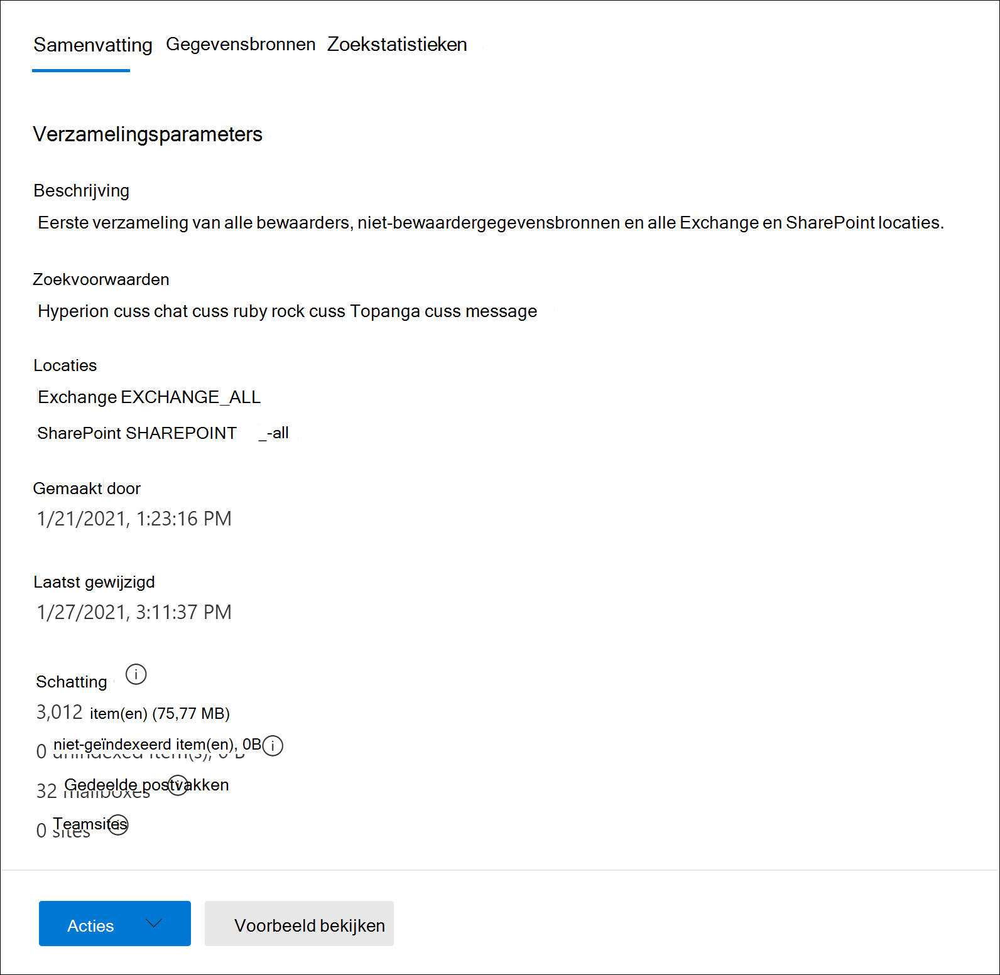
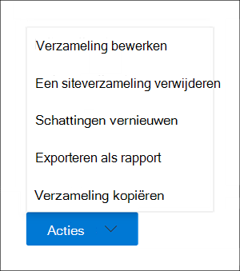

# Een conceptverzameling maken in Advanced eDiscovery

Nadat u beheerders en niet-bewaardergegevensbronnen voor de zaak hebt geïdentificeerd, bent u klaar om een reeks relevante documenten te identificeren en te zoeken. U doet dit met het hulpprogramma Verzamelingen om gegevensbronnen te zoeken naar relevante inhoud. U doet dit door een verzameling te maken die op opgegeven gegevensbronnen zoekt naar inhoud die voldoet aan uw zoekcriteria. U hebt de optie om een conceptverzameling te *maken,* een schatting van de items die worden gevonden of u kunt een verzameling maken waarmee de items automatisch worden toegevoegd aan een revisieset. Wanneer u een conceptverzameling maakt, kunt u informatie bekijken over de geschatte resultaten die overeenkomen met de zoekquery, zoals het totale aantal en de grootte van de gevonden items, de verschillende gegevensbronnen waar ze zijn gevonden en statistieken over de zoekquery. U kunt ook een voorbeeld bekijken van items die door de verzameling zijn geretourneerd. Met deze statistieken kunt u de zoekquery wijzigen en de conceptverzameling opnieuw uitvoeren om de resultaten te beperken. Wanneer u tevreden bent over de resultaten van de verzameling, kunt u de verzameling verbinden met een revisieset. Wanneer u een conceptverzameling gaat maken, worden de items die door de verzameling worden geretourneerd, toegevoegd aan een revisieset voor revisie, analyse en export.

## Voordat u een conceptverzameling maakt

- Voeg beheerders en niet-bewaardergegevensbronnen toe aan de zaak voordat u een conceptverzameling maakt. Dit is vereist, zodat u de gegevensbronnen kunt selecteren wanneer u een conceptverzameling maakt. Zie voor meer informatie:

  - [Beheerders toevoegen aan een case](add-custodians-to-case.md)

  - [Niet-beheerde gegevensbronnen toevoegen aan een case](non-custodial-data-sources.md)

- U kunt in een conceptverzameling zoeken naar inhoud die relevant kan zijn voor de zaak als aanvullende gegevensbronnen (die niet als bewaarlocaties of niet-bewaarlocaties aan de zaak zijn toegevoegd). Deze gegevensbronnen kunnen postvakken, SharePoint sites en Teams. Als deze situatie van toepassing is op uw zaak, stelt u een lijst met deze gegevensbronnen samen, zodat u deze kunt toevoegen aan de verzameling.

## Een conceptverzameling maken

1. Open in Microsoft 365 compliancecentrum de hoofd- Advanced eDiscovery en selecteer vervolgens het **tabblad Verzamelingen.**

2. Selecteer op **de pagina** Verzamelingen de optie **Nieuwe verzameling**  >  **Standaardverzameling**.

3. Typ een naam (vereist) en beschrijving (optioneel) voor de verzameling. Nadat de verzameling is gemaakt, kunt u de naam niet wijzigen, maar u kunt de beschrijving wel wijzigen.

4. Ga op **de pagina Bewaargegevensbronnen** op een van de volgende dingen te werk om de bewaargegevensbronnen te identificeren waar u inhoud van kunt verzamelen:

   - Klik **op Bewaarders selecteren** om specifieke bewaarders te zoeken die aan de zaak zijn toegevoegd. Als u deze optie gebruikt, wordt een lijst met de beheerders van de zaak weergegeven. Selecteer een of meer bewaarders. Nadat u de bewaarders hebt geselecteerd en toevoegt, kunt u ook de specifieke gegevensbronnen selecteren om naar elke bewaarder te zoeken. Deze gegevensbronnen die worden weergegeven, zijn opgegeven wanneer de bewaarder aan de zaak is toegevoegd.

   - Klik op **de schakelknop Alles** selecteren om te zoeken naar alle bewaarders die aan de zaak zijn toegevoegd. Wanneer u deze optie selecteert, worden alle gegevensbronnen voor alle beheerders doorzocht.

5. Ga op **de pagina Niet-bewaardergegevensbronnen** op een van de volgende dingen te werk om de niet-bewaardergegevensbronnen te identificeren om inhoud van te verzamelen:

   - Klik **op Niet-bewaardergegevensbronnen selecteren** om specifieke niet-bewaardergegevensbronnen te selecteren die aan de zaak zijn toegevoegd. Als u deze optie gebruikt, wordt een lijst met gegevensbronnen weergegeven. Selecteer een of meer van deze gegevensbronnen.

   - Klik op **de schakelknop** Alles selecteren om alle niet-bewaardergegevensbronnen te selecteren die aan de zaak zijn toegevoegd.

6. Op de **pagina Aanvullende gegevensbronnen** kunt u andere postvakken en sites selecteren om te zoeken als onderdeel van de verzameling. Deze typen gegevensbronnen zijn niet toegevoegd als bewaar- of niet-bewaardergegevenslocaties in de zaak. U hebt ook twee opties bij het zoeken naar extra gegevensbronnen:

   - Als u alle inhoudslocaties wilt doorzoeken op een specifieke service (Exchange-postvakken, SharePoint- en OneDrive-sites of Exchange openbare mappen), klikt u op de bijbehorende schakelknop Alles selecteren in de **kolom Status.**  Met deze optie wordt gezocht op alle inhoudslocaties in de geselecteerde service.

   - Als u specifieke inhoudslocatie voor  een service wilt zoeken, klikt u op de bijbehorende schakelknop Alles selecteren  in de kolom **Status** en klikt u vervolgens op **Gebruikers,** groepen of teams (voor Exchange-postvakken) of Sites kiezen voor (SharePoint en OneDrive sites) om specifieke inhoudslocaties te zoeken.

7. Op de **pagina** Voorwaarden kunt u de zoekquery maken die wordt gebruikt om items te verzamelen uit de gegevensbronnen die u hebt geïdentificeerd in de vorige wizardpagina's. U kunt zoeken naar trefwoorden, eigenschap:waardeparen of een lijst met trefwoorden gebruiken. U kunt ook verschillende zoekvoorwaarden toevoegen om het bereik van de verzameling te beperken. Zie Zoekquery's [voor verzamelingen maken voor meer informatie.](building-search-queries.md)

8. Selecteer op **de pagina Opslaan als concept of toevoegen** om de set te controleren de optie Verzameling opslaan als **concept.**

   > [!NOTE]
   > Met de andere optie op deze pagina kunt u items verzamelen en rechtstreeks toevoegen aan een revisieset. In plaats van een conceptverzameling te maken die u statistieken kunt bekijken en een voorbeeld van de verzamelingsresultaten kunt bekijken, wordt dit proces overgeslagen en wordt de verzameling automatisch toegevoegd aan een revisieset. Als u de tweede optie selecteert om de verzameling toe te voegen aan een revisieset, moet u aanvullende instellingen configureren, zoals het verzamelen van volledige chatgesprekken in Microsoft Teams en Yammer en het verzamelen van cloudbijlagen (ook wel moderne bijlagen *genoemd).* Zie Een conceptverzameling aan een revisieset verbinden voor meer [informatie over deze instellingen.](commit-draft-collection.md)

9. Op de **pagina Uw verzameling** controleren kunt u de verzamelingsinstellingen bekijken en bijwerken die u op de vorige pagina's hebt geconfigureerd.

   - **Tabblad** Overzicht: Controleer en wijzig de naam en beschrijving van de verzameling, de zoekcriteria voor verzamelingen, extra gegevenslocaties en het verzamelingstype.

   - **Tabblad** Bronnen: Controleer en wijzig de bewaarder- en niet-bewaardergegevensbronnen voor de verzameling.

10. Klik **op Verzenden** om de conceptverzameling te maken. Er wordt een pagina weergegeven die bevestigt dat de verzameling is gemaakt.

## Wat gebeurt er nadat u een conceptverzameling hebt opgesteld

Nadat u een conceptverzameling hebt gemaakt, wordt deze weergegeven op de pagina **Verzamelingen** in de zaak en de status laat zien dat deze wordt uitgevoerd. Een taak met **de naam Het voorbereiden van** een zoekvoorbeeld en schattingen wordt ook gemaakt en weergegeven op de pagina Taken in de zaak. 

Tijdens het conceptverzamelingsproces Advanced eDiscovery een zoekschatting uitgevoerd met behulp van de zoekcriteria en gegevensbronnen die u in de verzameling hebt opgegeven. Advanced eDiscovery maakt ook een steekproef van items die u kunt bekijken. Wanneer de verzameling is voltooid, worden de volgende kolommen en bijbehorende waarden op **de** pagina Verzameling bijgewerkt:

- **Status:** geeft de status en het type verzameling aan. Een waarde van **Geschatte** geeft aan dat een conceptverzameling is voltooid. Deze zelfde waarde geeft ook aan dat de verzameling een conceptverzameling is en dat deze niet is toegevoegd aan een revisieset. Een waarde van **Vastgelegd** in de **kolom Status** geeft aan dat de verzameling is toegevoegd aan een revisieset.

- **Schattingsstatus:** geeft de status van de geschatte zoekresultaten aan en geeft aan of de zoekschattingen en -statistieken klaar zijn om te worden beoordeeld. Een waarde van **Succesvol** geeft aan dat de resultaten van de conceptverzameling gereed zijn voor controle. Nadat u voor het eerst een conceptverzameling hebt verzenden, wordt de waarde **In uitvoering** weergegeven om aan te geven dat de verzameling nog steeds wordt uitgevoerd

- **Voorbeeldstatus:** geeft de status aan van de voorbeelditems die u kunt bekijken. Een waarde van **Geslaagd** geeft aan dat de items klaar zijn voor een voorbeeld. Nadat u voor het eerst een conceptverzameling hebt verzenden, wordt de waarde **In uitvoering** weergegeven om aan te geven dat de verzameling nog steeds actief is.

## Volgende stappen nadat een conceptverzameling is voltooid

Nadat de conceptverzameling is voltooid, kunt u verschillende taken uitvoeren. Als u de meeste van  deze taken wilt uitvoeren, gaat u naar het tabblad Verzamelingen en klikt u op de naam van de conceptverzameling om de flyoutpagina weer te geven.

Hier ziet u een lijst met dingen die u kunt doen op de flyoutpagina van de verzameling:

- Selecteer het **tabblad** Overzicht om overzichtsgegevens weer te geven over de verzameling en de geschatte zoekresultaten die door de verzameling worden geretourneerd. Dit omvat het totale aantal items en de grootte van de geschatte zoekresultaten, het aantal postvakken en sites met zoekresultaten en de zoekvoorwaarden (indien gebruikt) die worden gebruikt voor het bereik van de verzameling.

- Selecteer het **tabblad Gegevensbronnen** om een lijst weer te geven met bewaarders en niet-bewaardergegevensbronnen) die in de verzameling zijn doorzocht. Eventuele extra inhoudslocaties die zijn gezocht, worden weergegeven onder **Locaties** op **het tabblad** Overzicht.

- Selecteer het **tabblad Statistieken zoeken** om statistieken over de verzameling weer te zien. Dit omvat het totale aantal en de grootte van items die in elke service zijn gevonden (bijvoorbeeld Exchange postvakken of SharePoint-sites) en een voorwaarderapport waarin statistieken worden weergegeven over het aantal items dat wordt geretourneerd door verschillende onderdelen van de zoekquery die door de verzameling wordt gebruikt. Zie Verzamelingsstatistieken en [rapporten voor meer informatie.](collection-statistics-reports.md)

- Klik **op Voorbeeld controleren** (onder aan de flyoutpagina) om een voorbeeld te bekijken van de items die door de verzameling worden geretourneerd.

- De conceptverzameling verbinden met een revisieset (door te klikken op **De verzameling Acties**  >  **bewerken).** Dit betekent dat u de verzameling opnieuw gebruikt (met de huidige instellingen) en de items die door de verzameling worden geretourneerd, toevoegt aan een revisieset. Zoals eerder uitgelegd, kunt u ook aanvullende instellingen configureren (zoals gespreksthreading en cloudbijlagen) wanneer u de verzameling toevoegt aan een revisieset. Zie Een conceptverzameling aan een revisieset verbinden voor meer informatie en stapsgewijs [instructies.](commit-draft-collection.md)

## Een conceptverzameling beheren

U kunt de opties in het **menu** Acties op de flyoutpagina van een conceptverzameling gebruiken om verschillende beheertaken uit te voeren.

Hier zijn beschrijvingen van de beheeropties.

- **Verzameling bewerken:** De instellingen van de conceptverzameling wijzigen. Nadat u wijzigingen hebt aangebracht, kunt u de verzameling opnieuw gebruiken en de zoekschattingen en statistieken bijwerken. Zoals eerder uitgelegd, gebruikt u deze optie om een conceptverzameling toe te voegen aan een revisieset.  

- **Verzameling verwijderen:** Een conceptverzameling verwijderen. Houd er rekening mee dat nadat een conceptverzameling is vastgelegd voor een revisieset, deze niet kan worden verwijderd.

- **Schattingen vernieuwen:** de query (ten opzichte van de gegevensbronnen) die in de conceptverzameling is opgegeven, opnieuw uitvoeren om de zoekschattingen en -statistieken bij te werken.

- **Exporteren als rapport:** Hiermee exporteert u informatie over de conceptverzameling naar een CSV-bestand dat u naar uw lokale computer kunt downloaden. Het exportrapport bevat de volgende informatie:

  - De identiteit van elke inhoudslocatie die items bevat die overeenkomen met de zoekquery in de conceptverzameling. Deze locaties zijn meestal postvakken of sites.
  
  - Het totale aantal items op elke inhoudslocatie.
  
  - De totale grootte (in bytes) van de items op elke inhoudslocatie.

  - De service (zoals Exchange of SharePoint) waarin de inhoudslocatie zich bevindt.

- **Verzameling kopiëren:** maak een nieuwe conceptverzameling door de instellingen uit een bestaande verzameling te kopiëren. U moet een andere naam gebruiken voor de nieuwe verzameling. U hebt ook de optie om de instellingen te wijzigen voordat u de nieuwe verzameling indient. Nadat u deze hebt verzenden, wordt de zoekquery uitgevoerd en worden nieuwe schattingen en statistieken gegenereerd. Dit is een goede manier om snel extra conceptverzamelingen te maken en de geselecteerde instellingen zo nodig te wijzigen, met behoud van informatie in de oorspronkelijke verzameling. Op deze manier kunt u ook eenvoudig de resultaten van twee soortgelijke verzamelingen vergelijken.

> [!NOTE]
> Nadat een conceptverzameling is vastgelegd in een revisieset, kunt u alleen de verzameling kopiëren en een rapport exporteren.
