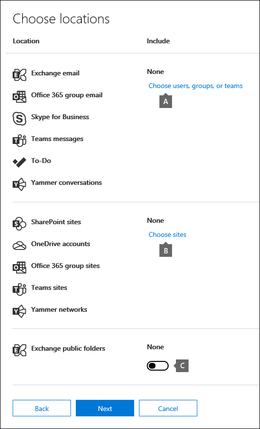
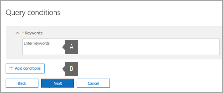

# <a name="create-an-ediscovery-hold"></a><span data-ttu-id="50d05-103">Een eDiscovery-greep maken</span><span class="sxs-lookup"><span data-stu-id="50d05-103">Create an eDiscovery hold</span></span>

<span data-ttu-id="50d05-104">U kunt een Hoofd-eDiscovery-zaak gebruiken om bewaar bewaart inhoud te maken die mogelijk relevant is voor de zaak.</span><span class="sxs-lookup"><span data-stu-id="50d05-104">You can use a Core eDiscovery case to create holds to preserve content that might be relevant to the case.</span></span> <span data-ttu-id="50d05-105">U kunt de postvakken van Exchange en OneDrive voor Bedrijven accounts van personen die u in de zaak onderzoekt, in de wacht zetten.</span><span class="sxs-lookup"><span data-stu-id="50d05-105">You can place a hold on the Exchange mailboxes and OneDrive for Business accounts of people you're investigating in the case.</span></span> <span data-ttu-id="50d05-106">U kunt ook een wacht houden op de postvakken en sites die zijn gekoppeld aan Microsoft Teams, Office 365 Groepen en Yammer Groepen.</span><span class="sxs-lookup"><span data-stu-id="50d05-106">You can also place a hold on the mailboxes and sites that are associated with Microsoft Teams, Office 365 Groups, and Yammer Groups.</span></span> <span data-ttu-id="50d05-107">Wanneer u inhoudslocaties in de wacht zet, blijft inhoud behouden totdat u de inhoudslocatie verwijdert of totdat u de bewaarplaats verwijdert.</span><span class="sxs-lookup"><span data-stu-id="50d05-107">When you place content locations on hold, content is preserved until you remove the hold from the content location or until you delete the hold.</span></span>

<span data-ttu-id="50d05-108">Nadat u een eDiscovery-greep hebt aan maken, kan het tot 24 uur duren voordat de wacht wordt in werking treedt.</span><span class="sxs-lookup"><span data-stu-id="50d05-108">After you create an eDiscovery hold, it may take up to 24 hours for the hold to take effect.</span></span> 

<span data-ttu-id="50d05-109">Wanneer u een wachtruimte maakt, hebt u de volgende opties voor het bereik van de inhoud die behouden blijft op de opgegeven inhoudslocaties:</span><span class="sxs-lookup"><span data-stu-id="50d05-109">When you create a hold, you have the following options to scope the content that is preserved in the specified content locations:</span></span>
  
- <span data-ttu-id="50d05-110">U maakt een oneindige greep waarin alle inhoud op de opgegeven locaties in de wacht wordt geplaatst.</span><span class="sxs-lookup"><span data-stu-id="50d05-110">You create an infinite hold where all content in the specified locations is placed on hold.</span></span> <span data-ttu-id="50d05-111">U kunt ook een op query's gebaseerde wachtplaats maken waarbij alleen de inhoud op de opgegeven locaties die overeenkomt met een zoekquery, in de wacht wordt geplaatst.</span><span class="sxs-lookup"><span data-stu-id="50d05-111">Alternatively, you can create a query-based hold where only the content in the specified locations that matches a search query is placed on hold.</span></span>

- <span data-ttu-id="50d05-112">U kunt een datumbereik opgeven om alleen de inhoud te behouden die binnen dat datumbereik is verzonden, ontvangen of gemaakt.</span><span class="sxs-lookup"><span data-stu-id="50d05-112">You can specify a date range to preserve only the content that was sent, received, or created within that date range.</span></span> <span data-ttu-id="50d05-113">U kunt ook alle inhoud op opgegeven locaties houden, ongeacht wanneer deze is verzonden, ontvangen of gemaakt.</span><span class="sxs-lookup"><span data-stu-id="50d05-113">Alternatively, you can hold all content in specified locations regardless of when it was sent, received, or created.</span></span>
  
## <a name="how-to-create-an-ediscovery-hold"></a><span data-ttu-id="50d05-114">Een eDiscovery-wacht houden maken</span><span class="sxs-lookup"><span data-stu-id="50d05-114">How to create an eDiscovery hold</span></span>

<span data-ttu-id="50d05-115">Ga als volgende te werk om een eDiscovery-wacht te maken die is gekoppeld aan een Core eDiscovery-zaak:</span><span class="sxs-lookup"><span data-stu-id="50d05-115">To create an eDiscovery hold that's associated with a Core eDiscovery case:</span></span>
  
1. <span data-ttu-id="50d05-116">Ga naar en meld u aan met de referenties voor gebruikersaccount die zijn toegewezen aan de juiste [https://compliance.microsoft.com](https://compliance.microsoft.com) eDiscovery-machtigingen.</span><span class="sxs-lookup"><span data-stu-id="50d05-116">Go to [https://compliance.microsoft.com](https://compliance.microsoft.com) and sign in using the credentials for user account that has been assigned the appropriate eDiscovery permissions.</span></span>

2. <span data-ttu-id="50d05-117">Klik in het linkernavigatiedeelvenster van Microsoft 365 compliancecentrum op Alles weergeven **en** klik vervolgens op **eDiscovery > Core.**</span><span class="sxs-lookup"><span data-stu-id="50d05-117">In the left navigation pane of the Microsoft 365 compliance center, click **Show all**, and then click **eDiscovery > Core**.</span></span>

3. <span data-ttu-id="50d05-118">Selecteer op **de pagina Core eDiscovery** de zaak waarin u de greep wilt maken en klik vervolgens op **Hoofd zaak openen.**</span><span class="sxs-lookup"><span data-stu-id="50d05-118">On the **Core eDiscovery** page, select the case that you want to create the hold in, and then click **Open case**.</span></span>

4. <span data-ttu-id="50d05-119">Klik op **de startpagina** voor de zaak op het **tabblad Ingedrukt.**</span><span class="sxs-lookup"><span data-stu-id="50d05-119">On the **Home** page for the case, click the **Holds** tab.</span></span>
  
5. <span data-ttu-id="50d05-120">Klik op **de pagina** Vasthoudt op **Maken.**</span><span class="sxs-lookup"><span data-stu-id="50d05-120">On the **Holds** page, click **Create**.</span></span>

6. <span data-ttu-id="50d05-121">Geef op **de pagina Naam van** de wizard Uw wacht ingedrukt houden een naam op en voeg een optionele beschrijving toe en klik op **Volgende.**</span><span class="sxs-lookup"><span data-stu-id="50d05-121">On the **Name your hold** wizard page, give the hold a name and add an optional description, and then click **Next**.</span></span> <span data-ttu-id="50d05-122">De naam van de wacht moet uniek zijn in uw organisatie.</span><span class="sxs-lookup"><span data-stu-id="50d05-122">The name of the hold must be unique in your organization.</span></span>

7. <span data-ttu-id="50d05-123">Kies op **de pagina** Inhoudslocaties de inhoudslocaties die u in de wacht wilt zetten.</span><span class="sxs-lookup"><span data-stu-id="50d05-123">On the **Content locations** page, choose the content locations that you want to place on hold.</span></span> <span data-ttu-id="50d05-124">U kunt postvakken, sites en openbare mappen in de wacht zetten.</span><span class="sxs-lookup"><span data-stu-id="50d05-124">You can place mailboxes, sites, and public folders on hold.</span></span>

    
  
   1. <span data-ttu-id="50d05-126">**Postvaklocaties:** klik op **Gebruikers,** groepen of teams kiezen en klik vervolgens nogmaals op **Gebruikers,** groepen of teams kiezen om de postvakken op te geven die in de wacht moeten worden geplaatst.</span><span class="sxs-lookup"><span data-stu-id="50d05-126">**Mailbox locations** - Click **Choose users, groups, or teams** and then click **Choose users, groups, or teams** again to specify the mailboxes to place on hold.</span></span> <span data-ttu-id="50d05-127">Gebruik het zoekvak om gebruikerspostvakken en distributiegroepen te zoeken (om de postvakken van groepsleden in de wacht te zetten) om deze in de wacht te zetten.</span><span class="sxs-lookup"><span data-stu-id="50d05-127">Use the search box to find user mailboxes and distribution groups (to place a hold on the mailboxes of group members) to place on hold.</span></span> <span data-ttu-id="50d05-128">U kunt ook het bijbehorende postvak in de wacht zetten voor een Microsoft-team, Office 365 groep of Yammer groep.</span><span class="sxs-lookup"><span data-stu-id="50d05-128">You can also place a hold on the associated mailbox for a Microsoft Team, Office 365 Group, or Yammer Group.</span></span> <span data-ttu-id="50d05-129">Schakel het selectievakje gebruiker, groep, team in, klik **op Kiezen** en klik vervolgens op **Klaar.**</span><span class="sxs-lookup"><span data-stu-id="50d05-129">Select the user, group, team check box, click **Choose**, and then click **Done**.</span></span>

   1. <span data-ttu-id="50d05-130">**Sitelocaties:** klik op **Sites kiezen** en klik nogmaals op **Sites** kiezen om de SharePoint en OneDrive accounts in de wacht te zetten.</span><span class="sxs-lookup"><span data-stu-id="50d05-130">**Site locations** - Click **Choose sites** and then click **Choose sites** again to specify SharePoint and OneDrive accounts to place on hold.</span></span> <span data-ttu-id="50d05-131">Typ de URL voor elke site die u in de wacht wilt zetten.</span><span class="sxs-lookup"><span data-stu-id="50d05-131">Type the URL for each site that you want to place on hold.</span></span> <span data-ttu-id="50d05-132">U kunt ook de URL voor de SharePoint toevoegen voor een Microsoft-team, Office 365 groep of een Yammer Groep.</span><span class="sxs-lookup"><span data-stu-id="50d05-132">You can also add the URL for the SharePoint site for a Microsoft Team, Office 365 Group or a Yammer Group.</span></span> <span data-ttu-id="50d05-133">Klik **op** Kiezen en klik vervolgens op **Klaar.**</span><span class="sxs-lookup"><span data-stu-id="50d05-133">Click **Choose**, and then click **Done**.</span></span>
  
   1. <span data-ttu-id="50d05-134">**Exchange openbare mappen.**</span><span class="sxs-lookup"><span data-stu-id="50d05-134">**Exchange public folders.**</span></span> <span data-ttu-id="50d05-135">Verplaats de wisselknop Wisselknop Besturingselement naar de positie Alles om alle openbare mappen in uw Exchange Online  in de wachtstand te zetten. </span><span class="sxs-lookup"><span data-stu-id="50d05-135">Move the toggle switch  to the **All** position to put all public folders in your Exchange Online organization on hold.</span></span> <span data-ttu-id="50d05-136">U kunt geen specifieke openbare mappen kiezen om in de wacht te zetten.</span><span class="sxs-lookup"><span data-stu-id="50d05-136">You can't choose specific public folders to put on hold.</span></span> <span data-ttu-id="50d05-137">Laat de wisselknop ingesteld op **Geen** als u openbare mappen niet in de wacht wilt zetten.</span><span class="sxs-lookup"><span data-stu-id="50d05-137">Leave the toggle switch set to **None** if you don't want to put a hold on public folders.</span></span>

   > [!NOTE]
   > <span data-ttu-id="50d05-138">U moet ten minste één inhoudslocatie aan de wacht houden toevoegen.</span><span class="sxs-lookup"><span data-stu-id="50d05-138">You must add at least one content location to the hold.</span></span> <span data-ttu-id="50d05-139">Anders wordt met de statische eDiscovery-hold-elementen laten zien dat er geen items in de wacht staan.</span><span class="sxs-lookup"><span data-stu-id="50d05-139">Otherwise, the eDiscovery hold statics will show that no items are on hold.</span></span>

8. <span data-ttu-id="50d05-140">Wanneer u klaar bent met het toevoegen van inhoudslocaties aan de wacht, klikt u op **Volgende.**</span><span class="sxs-lookup"><span data-stu-id="50d05-140">When you're done adding content locations to the hold, click **Next**.</span></span>

9. <span data-ttu-id="50d05-141">Als u een query met voorwaarden wilt maken, vult u het volgende in.</span><span class="sxs-lookup"><span data-stu-id="50d05-141">To create a query-based hold with conditions, complete the following.</span></span> <span data-ttu-id="50d05-142">Als u anders alle inhoud op de opgegeven inhoudslocaties wilt behouden, klikt u op **Volgende.**</span><span class="sxs-lookup"><span data-stu-id="50d05-142">Otherwise, to preserve all content in the specified content locations, click **Next**.</span></span>

    
  
    1. <span data-ttu-id="50d05-144">Typ in het vak onder **Trefwoorden** een zoekquery, zodat alleen de inhoud die aan de zoekcriteria voldoet, behouden blijft.</span><span class="sxs-lookup"><span data-stu-id="50d05-144">In the box under **Keywords**, type a search query so that only the content that meets the search criteria is preserved.</span></span> <span data-ttu-id="50d05-145">U kunt trefwoorden, e-mailberichteigenschappen of documenteigenschappen opgeven, zoals bestandsnamen.</span><span class="sxs-lookup"><span data-stu-id="50d05-145">You can specify keywords, email message properties, or document properties, such as file names.</span></span> <span data-ttu-id="50d05-146">U kunt ook complexere query's gebruiken die een Booleaanse operator gebruiken, zoals **EN,** **OF** of **NIET.**</span><span class="sxs-lookup"><span data-stu-id="50d05-146">You can also use more complex queries that use a Boolean operator, such as **AND**, **OR**, or **NOT**.</span></span>

    1. <span data-ttu-id="50d05-147">Klik **op Voorwaarden toevoegen** om een of meer voorwaarden toe te voegen om de zoekquery voor de wacht te beperken.</span><span class="sxs-lookup"><span data-stu-id="50d05-147">Click **Add conditions** to add one or more conditions to narrow the search query for the hold.</span></span> <span data-ttu-id="50d05-148">Elke voorwaarde voegt een component toe aan de KQL-zoekquery die wordt gemaakt en uitgevoerd wanneer u de wacht houdt.</span><span class="sxs-lookup"><span data-stu-id="50d05-148">Each condition adds a clause to the KQL search query that is created and run when you create the hold.</span></span> <span data-ttu-id="50d05-149">U kunt bijvoorbeeld een datumbereik opgeven, zodat e-mail- of sitedocumenten die zijn gemaakt binnen de opgegeven datum, in de wacht worden geplaatst.</span><span class="sxs-lookup"><span data-stu-id="50d05-149">For example, you can specify a date range so that email or site documents that were created within the date ranged are placed on hold.</span></span> <span data-ttu-id="50d05-150">Een voorwaarde is logisch verbonden met de trefwoordquery (opgegeven in het vak Trefwoorden) door de **operator AND.** </span><span class="sxs-lookup"><span data-stu-id="50d05-150">A condition is logically connected to the keyword query (specified in the **Keywords** box) by the **AND** operator.</span></span> <span data-ttu-id="50d05-151">Dit betekent dat items moeten voldoen aan zowel de trefwoordquery als de voorwaarde die moet worden bewaard.</span><span class="sxs-lookup"><span data-stu-id="50d05-151">That means that items have to satisfy both the keyword query and the condition to be preserved.</span></span>

    <span data-ttu-id="50d05-152">Zie Trefwoordenquery's en zoekvoorwaarden voor Inhoud zoeken voor meer informatie over het maken van een zoekquery en het gebruik van [voorwaarden.](keyword-queries-and-search-conditions.md)</span><span class="sxs-lookup"><span data-stu-id="50d05-152">For more information about creating a search query and using conditions, see [Keyword queries and search conditions for Content Search](keyword-queries-and-search-conditions.md).</span></span>

10. <span data-ttu-id="50d05-153">Klik na het configureren van een query-hold op **Volgende.**</span><span class="sxs-lookup"><span data-stu-id="50d05-153">After configuring a query-based hold, click **Next**.</span></span>

11. <span data-ttu-id="50d05-154">Controleer uw instellingen (en bewerk ze zo nodig) en klik vervolgens **op Deze wacht houden maken.**</span><span class="sxs-lookup"><span data-stu-id="50d05-154">Review your settings (and edit them if necessary), and then click **Create this hold**.</span></span>

## <a name="query-based-holds-placed-on-site-documents"></a><span data-ttu-id="50d05-155">Op query's gebaseerde op sitedocumenten geplaatste in-</span><span class="sxs-lookup"><span data-stu-id="50d05-155">Query-based holds placed on site documents</span></span>

<span data-ttu-id="50d05-156">Houd rekening met de volgende zaken wanneer u een eDiscovery-bewaarfunctie op basis van query's op documenten op SharePoint plaatsen:</span><span class="sxs-lookup"><span data-stu-id="50d05-156">Keep the following things in mind when you place a query-based eDiscovery hold on documents located in SharePoint sites:</span></span>

- <span data-ttu-id="50d05-157">In een op query gebaseerde bewaarperiode worden in eerste instantie alle documenten op een site bewaard voor een korte periode nadat ze zijn verwijderd.</span><span class="sxs-lookup"><span data-stu-id="50d05-157">A query-based hold initially preserves all documents in a site for a short period of time after they are deleted.</span></span> <span data-ttu-id="50d05-158">Dat betekent dat wanneer een document wordt verwijderd, het wordt verplaatst naar de bewaringsbibliotheek, zelfs als het niet voldoet aan de criteria van de query-bewaring.</span><span class="sxs-lookup"><span data-stu-id="50d05-158">That means when a document is deleted, it will be moved to the Preservation Hold library even if it doesn't match the criteria of the query-based hold.</span></span> <span data-ttu-id="50d05-159">Verwijderde documenten die niet overeenkomen met een bewaring op basis van query's, worden echter verwijderd door een timerfunctie die de bewaringsbibliotheek verwerkt.</span><span class="sxs-lookup"><span data-stu-id="50d05-159">However, deleted documents that don't match a query-based hold will be removed by a timer job that processes the Preservation Hold library.</span></span> <span data-ttu-id="50d05-160">De timerfunctie wordt regelmatig uitgevoerd en vergelijkt alle documenten in de bewaringsbibliotheek met uw op query's gebaseerde eDiscovery-bewaring (en andere typen bewaar- en bewaarbeleid).</span><span class="sxs-lookup"><span data-stu-id="50d05-160">The timer job runs periodically and compares all documents in the Preservation Hold library to your query-based eDiscovery holds (and other types of holds and retention policies).</span></span> <span data-ttu-id="50d05-161">Met de timerfunctie worden de documenten verwijderd die niet overeenkomen met een op query gebaseerde bewaarfunctie en worden de documenten behouden die wel worden bewaard.</span><span class="sxs-lookup"><span data-stu-id="50d05-161">The timer job deletes the documents that don't match a query-based hold and preserves the documents that do.</span></span>

- <span data-ttu-id="50d05-162">Op query's gebaseerde bewaringen mogen niet worden gebruikt om gerichte bewaring uit te voeren, zoals het bewaren van documenten in een specifieke map of site of met behulp van andere bewaarcriteria op basis van locatie.</span><span class="sxs-lookup"><span data-stu-id="50d05-162">Query-based holds should not be used to perform targeted preservation, like preserving documents in a specific folder or site or by using other location-based hold criteria.</span></span> <span data-ttu-id="50d05-163">Dit kan onbedoelde resultaten hebben.</span><span class="sxs-lookup"><span data-stu-id="50d05-163">Doing so may have unintended results.</span></span> <span data-ttu-id="50d05-164">Het is raadzaam niet-locatiegebaseerde bewaarcriteria, zoals trefwoorden, datumbereiken of andere documenteigenschappen, te gebruiken om sitedocumenten te behouden.</span><span class="sxs-lookup"><span data-stu-id="50d05-164">We recommend using non-location based hold criteria such as keywords, date ranges, or other document properties to preserve site documents.</span></span>

## <a name="ediscovery-hold-statistics"></a><span data-ttu-id="50d05-165">eDiscovery-holdstatistieken</span><span class="sxs-lookup"><span data-stu-id="50d05-165">eDiscovery hold statistics</span></span>

<span data-ttu-id="50d05-166">Nadat u een eDiscovery-hold hebt gemaakt, wordt informatie over de nieuwe wacht in de flyoutpagina weergegeven voor de geselecteerde wacht.</span><span class="sxs-lookup"><span data-stu-id="50d05-166">After you create an eDiscovery hold, information about the new hold is displayed on the flyout page for the selected hold.</span></span> <span data-ttu-id="50d05-167">Deze informatie omvat het aantal postvakken en sites dat in de wacht staat en statistieken over de inhoud die in de wacht is geplaatst, zoals het totale aantal en de grootte van items die in de wacht zijn geplaatst en de laatste keer dat de holdstatistieken zijn berekend.</span><span class="sxs-lookup"><span data-stu-id="50d05-167">This information includes the number of mailboxes and sites on hold and statistics about the content that was placed on hold, such as the total number and size of items placed on hold and the last time the hold statistics were calculated.</span></span> <span data-ttu-id="50d05-168">Deze bewaarstatistieken helpen u bij het vaststellen van de hoeveelheid inhoud die aan de zaak is gerelateerd.</span><span class="sxs-lookup"><span data-stu-id="50d05-168">These hold statistics help you identify the amount of content related to the case is being preserved.</span></span>
  

  
<span data-ttu-id="50d05-170">Houd rekening met de volgende dingen over de statistieken van eDiscovery-bewaar:</span><span class="sxs-lookup"><span data-stu-id="50d05-170">Keep the following things in mind about eDiscovery hold statistics:</span></span>
  
- <span data-ttu-id="50d05-171">Het totale aantal items dat in de wacht staat, geeft het aantal items aan van alle inhoudsbronnen die in de wacht zijn geplaatst.</span><span class="sxs-lookup"><span data-stu-id="50d05-171">The total number of items on hold indicates the number of items from all content sources that are placed on hold.</span></span> <span data-ttu-id="50d05-172">Als u een query hold hebt gemaakt, geeft deze statistiek het aantal items aan dat bij de query past.</span><span class="sxs-lookup"><span data-stu-id="50d05-172">If you've created a query-based hold, this statistic indicates the number of items that match the query.</span></span>

- <span data-ttu-id="50d05-173">Het aantal items dat in de wacht staat, bevat ook niet-geïndexeerde items die op de inhoudslocaties worden gevonden.</span><span class="sxs-lookup"><span data-stu-id="50d05-173">The number of items on hold also includes unindexed items found in the content locations.</span></span> <span data-ttu-id="50d05-174">Als u een query in de wacht houdt, worden alle niet-geïndexeerde items op de inhoudslocaties in de wacht geplaatst.</span><span class="sxs-lookup"><span data-stu-id="50d05-174">If you create a query-based hold, all unindexed items in the content locations are placed on hold.</span></span> <span data-ttu-id="50d05-175">Dit geldt ook voor niet-geïndexeerde items die niet overeenkomen met de zoekcriteria van een op query gebaseerde greep en niet-geïndexeerde items die buiten een datumbereikvoorwaarde vallen.</span><span class="sxs-lookup"><span data-stu-id="50d05-175">This includes unindexed items that don't match the search criteria of a query-based hold and unindexed items that might fall outside of a date range condition.</span></span> <span data-ttu-id="50d05-176">Dit is anders dan wat er gebeurt wanneer u een zoekopdracht uitvoert, waarbij niet-geïndexeerde items die niet overeenkomen met de zoekquery of die zijn uitgesloten door een datumbereik, niet worden opgenomen in de zoekresultaten.</span><span class="sxs-lookup"><span data-stu-id="50d05-176">This is different than what happens when you run a search, in which unindexed items that don't match the search query or are excluded by a date range condition aren't included in the search results.</span></span> <span data-ttu-id="50d05-177">Zie Gedeeltelijk geïndexeerde items voor meer informatie over niet-geïndexeerde [items.](partially-indexed-items-in-content-search.md)</span><span class="sxs-lookup"><span data-stu-id="50d05-177">For more information about unindexed items, see [Partially indexed items](partially-indexed-items-in-content-search.md).</span></span>

- <span data-ttu-id="50d05-178">U kunt de meest recente holdstatistieken krijgen door op **Statistieken** bijwerken te klikken om een zoekschatting opnieuw uit te werken waarmee het huidige aantal items in de wacht wordt berekend.</span><span class="sxs-lookup"><span data-stu-id="50d05-178">You can get the latest hold statistics by clicking **Update statistics** to rerun a search estimate that calculates the current number of items on hold.</span></span>

- <span data-ttu-id="50d05-179">Het is normaal dat het aantal items dat in de wacht staat in de tijd toeneemt, omdat gebruikers van wie het postvak of de site in de wacht staat, gewoonlijk een nieuw e-mailbericht verzenden of ontvangen en nieuwe documenten maken in SharePoint en OneDrive.</span><span class="sxs-lookup"><span data-stu-id="50d05-179">It's normal for the number of items on hold to increase over time because users whose mailbox or site is on hold are typically sending or receiving new email message and creating new documents in SharePoint and OneDrive.</span></span>

- <span data-ttu-id="50d05-180">Als een Exchange-, SharePoint-site- of OneDrive-account wordt verplaatst naar een andere regio in een multi-geo-omgeving, worden de statistieken voor die site niet opgenomen in de hold-statistieken.</span><span class="sxs-lookup"><span data-stu-id="50d05-180">If an Exchange mailbox, SharePoint site, or OneDrive account is moved to a different region in a multi-geo environment, the statistics for that site won't be included in the hold statistics.</span></span> <span data-ttu-id="50d05-181">Maar de inhoud op deze locaties blijft behouden.</span><span class="sxs-lookup"><span data-stu-id="50d05-181">But the content in those locations will still be preserved.</span></span> <span data-ttu-id="50d05-182">Als een postvak of site naar een ander gebied wordt verplaatst, wordt het SMTP-adres of de URL die in de wacht wordt weergegeven, niet automatisch bijgewerkt.</span><span class="sxs-lookup"><span data-stu-id="50d05-182">Also, if a mailbox or site is moved to a different region, the SMTP address or URL that's displayed in the hold will not automatically be updated.</span></span> <span data-ttu-id="50d05-183">U moet de wacht houden bewerken en de URL of HET SMTP-adres bijwerken, zodat de inhoudslocaties opnieuw worden opgenomen in de hold-statistieken</span><span class="sxs-lookup"><span data-stu-id="50d05-183">You'll have to edit the hold and update the URL or SMTP address so the content locations are once again included in the hold statistics</span></span>

## <a name="search-locations-on-ediscovery-hold"></a><span data-ttu-id="50d05-184">Zoeklocaties in de eDiscovery-wachtfunctie</span><span class="sxs-lookup"><span data-stu-id="50d05-184">Search locations on eDiscovery hold</span></span>

<span data-ttu-id="50d05-185">Wanneer u [zoekt naar inhoud](search-for-content-in-core-ediscovery.md) in een Hoofd-eDiscovery-zaak, kunt u de zoekopdracht snel configureren om alleen te zoeken op de inhoudslocaties die zijn geplaatst in een wachtplaats die aan de zaak is gekoppeld.</span><span class="sxs-lookup"><span data-stu-id="50d05-185">When you [search for content](search-for-content-in-core-ediscovery.md) in a Core eDiscovery case, you can quickly configure the search to only search the content locations that have been placed on a hold associated with the case.</span></span>


<span data-ttu-id="50d05-187">Selecteer de **optie Locaties in de wacht** om te zoeken naar alle inhoudslocaties die in de wacht zijn geplaatst.</span><span class="sxs-lookup"><span data-stu-id="50d05-187">Select the **Locations on hold** option to search all the content locations that have been placed on hold.</span></span> <span data-ttu-id="50d05-188">Als de zaak meerdere eDiscovery-inhoudslocaties bevat, worden de inhoudslocaties uit alle ophoudt doorzocht wanneer u deze optie selecteert.</span><span class="sxs-lookup"><span data-stu-id="50d05-188">If the case contains multiple eDiscovery holds, the content locations from all holds will be searched when you select this option.</span></span> <span data-ttu-id="50d05-189">Als een inhoudslocatie in een op query's gebaseerde wachtplaats is geplaatst, worden alleen de items gezocht die overeenkomen met de wachtquery wanneer u de zoekopdracht uitvoert.</span><span class="sxs-lookup"><span data-stu-id="50d05-189">Additionally, if a content location was placed on a query-based hold, only the items that match the hold query will be searched when you run the search.</span></span> <span data-ttu-id="50d05-190">Met andere woorden: alleen de inhoud die overeenkomt met zowel de criteria voor het vasthouden als het zoekcriterium, wordt geretourneerd met de zoekresultaten.</span><span class="sxs-lookup"><span data-stu-id="50d05-190">In other words, only the content that matches both the hold criteria and the search criteria is returned with the search results.</span></span> <span data-ttu-id="50d05-191">Als een gebruiker bijvoorbeeld is geplaatst op basis van query's met items die vóór een bepaalde datum zijn verzonden of gemaakt, worden alleen die items doorzocht.</span><span class="sxs-lookup"><span data-stu-id="50d05-191">For example, if a user was placed on query-based case hold that preserves items that were sent or created before a specific date, only those items would be searched.</span></span> <span data-ttu-id="50d05-192">Dit wordt gedaan door de query voor het vasthouden van de zaak en de zoekquery te verbinden door een **OPERATOR EN.**</span><span class="sxs-lookup"><span data-stu-id="50d05-192">This is accomplished by connecting the case hold query and the search query by an **AND** operator.</span></span>

<span data-ttu-id="50d05-193">Hier zijn enkele andere dingen waar u rekening mee moet houden bij het zoeken naar locaties in de eDiscovery-wacht:</span><span class="sxs-lookup"><span data-stu-id="50d05-193">Here are some other things to keep in mind when searching locations on eDiscovery hold:</span></span>

- <span data-ttu-id="50d05-194">Als een inhoudslocatie deel uitmaakt van meerdere inhoudsoperatoren  in hetzelfde geval, worden de query's voor het vasthouden door OF-operatoren gecombineerd wanneer u op die inhoudslocatie zoekt met de optie Inhoud van alle gevallen.</span><span class="sxs-lookup"><span data-stu-id="50d05-194">If a content location is part of multiple holds within the same case, the hold queries are combined by **OR** operators when you search that content location using the all case content option.</span></span> <span data-ttu-id="50d05-195">Als een inhoudslocatie deel uitmaakt van twee verschillende holds, waarbij de ene op query's is gebaseerd en de andere een oneindige greep is (waarbij alle inhoud in de wacht wordt geplaatst), is alle inhoud zoeken vanwege de oneindige greep.</span><span class="sxs-lookup"><span data-stu-id="50d05-195">Similarly, if a content location is part of two different holds, where one is query-based and the other is an infinite hold (where all content is placed on hold), then all content is search because of the infinite hold.</span></span>

- <span data-ttu-id="50d05-196">Als een zoekopdracht is geconfigureerd om locaties in de wacht te zetten en vervolgens een eDiscovery-wacht in de zaak wijzigt (door een locatie toe te voegen of te verwijderen of een wachtquery te wijzigen), wordt de zoekconfiguratie bijgewerkt met deze wijzigingen.</span><span class="sxs-lookup"><span data-stu-id="50d05-196">If a search is configured it to search locations on hold and then you change an eDiscovery hold in the case (by adding or removing a location or changing a hold query), the search configuration is updated with those changes.</span></span> <span data-ttu-id="50d05-197">U moet de zoekopdracht echter opnieuw doen nadat de wacht is gewijzigd om de zoekresultaten bij te werken.</span><span class="sxs-lookup"><span data-stu-id="50d05-197">However, you have to rerun the search after the hold is changed to update the search results.</span></span>

- <span data-ttu-id="50d05-198">Als meerdere eDiscovery-items op één locatie in een eDiscovery-zaak worden geplaatst en u selecteert om locaties in de wacht te zetten, is het maximum aantal trefwoorden voor die zoekquery 500.</span><span class="sxs-lookup"><span data-stu-id="50d05-198">If multiple eDiscovery holds are placed on a single location in an eDiscovery case and you select to search locations on hold, the maximum number of keywords for that search query is 500.</span></span> <span data-ttu-id="50d05-199">De zoekactie combineert namelijk alle op query's gebaseerde in- en uitbaters met behulp van de **operator OF.**</span><span class="sxs-lookup"><span data-stu-id="50d05-199">That's because the search combines all the query-based holds by using the **OR** operator.</span></span> <span data-ttu-id="50d05-200">Als de gecombineerde query's en de zoekquery meer dan 500 trefwoorden bevatten, wordt naar alle inhoud in het postvak gezocht, niet alleen naar de inhoud die overeenkomt met het op query gebaseerde geval.</span><span class="sxs-lookup"><span data-stu-id="50d05-200">If there are more than 500 keywords in the combined hold queries and the search query, then all content in the mailbox is searched, not just that content that matches the query-based case holds.</span></span>

- <span data-ttu-id="50d05-201">Als een eDiscovery-wachtpositie de status In- en uitschakelen **heeft,** kunt u nog steeds zoeken op de locaties in de wacht terwijl de wachtpositie wordt ingeschakeld.</span><span class="sxs-lookup"><span data-stu-id="50d05-201">If an eDiscovery hold has a status of **Turning on**, you can still search the locations on hold while the hold is being turned on.</span></span>

## <a name="preserve-content-in-microsoft-teams"></a><span data-ttu-id="50d05-202">Inhoud behouden in Microsoft Teams</span><span class="sxs-lookup"><span data-stu-id="50d05-202">Preserve content in Microsoft Teams</span></span>

<span data-ttu-id="50d05-203">Gesprekken die deel uitmaken van een Microsoft Teams kanaal, worden opgeslagen in het postvak dat is gekoppeld aan het Microsoft-team.</span><span class="sxs-lookup"><span data-stu-id="50d05-203">Conversations that are part of a Microsoft Teams channel are stored in the mailbox that's associated with the Microsoft Team.</span></span> <span data-ttu-id="50d05-204">Op dezelfde manier worden bestanden die teamleden delen in een kanaal opgeslagen op de SharePoint teamsite.</span><span class="sxs-lookup"><span data-stu-id="50d05-204">Similarly, files that team members share in a channel are stored on the team's SharePoint site.</span></span> <span data-ttu-id="50d05-205">Daarom moet u het teampostvak en de SharePoint in de eDiscovery-wachtplaats plaatsen om gesprekken en bestanden in een kanaal te behouden.</span><span class="sxs-lookup"><span data-stu-id="50d05-205">Therefore, you have to place the Team mailbox and SharePoint site on eDiscovery hold to preserve conversations and files in a channel.</span></span>

<span data-ttu-id="50d05-206">U kunt ook gesprekken die deel uitmaken van de chatlijst in Teams (chats met de naam *1:1* of *groepschats van 1:N)* opslaan in de postvakken van de gebruikers die deelnemen aan de chat.</span><span class="sxs-lookup"><span data-stu-id="50d05-206">Alternatively, conversations that are part of the Chat list in Teams (called *1:1 chats* or *1:N group chats*) are stored in the mailboxes of the users who participate in the chat.</span></span> <span data-ttu-id="50d05-207">En bestanden die gebruikers delen in chatgesprekken, worden opgeslagen in OneDrive account van de gebruiker die het bestand deelt.</span><span class="sxs-lookup"><span data-stu-id="50d05-207">And files that users share in chat conversations are stored in the OneDrive account of the user who shares the file.</span></span> <span data-ttu-id="50d05-208">Daarom moet u de afzonderlijke gebruikerspostvakken en -OneDrive toevoegen aan een eDiscovery-wachtruimte om gesprekken en bestanden in de chatlijst te behouden.</span><span class="sxs-lookup"><span data-stu-id="50d05-208">Therefore, you have to add the individual user mailboxes and OneDrive accounts to an eDiscovery hold to preserve conversations and files in the chat list.</span></span> <span data-ttu-id="50d05-209">Het is een goed idee om de postvakken van leden van een Microsoft-team in de wacht te zetten, naast het in de wacht zetten van het teampostvak en de site.</span><span class="sxs-lookup"><span data-stu-id="50d05-209">It's a good idea to place a hold on the mailboxes of members of a Microsoft Team in addition to placing the team mailbox and site on hold.</span></span>

> [!NOTE]
> <span data-ttu-id="50d05-210">Als uw organisatie een hybride Exchange-implementatie heeft (of als uw organisatie een on-premises Exchange-organisatie synchroniseert met Office 365) en Microsoft Teams heeft ingeschakeld, kunnen on-premises gebruikers de Teams-chattoepassing gebruiken en deelnemen aan 1:1 chats en 1:N-groepschats.</span><span class="sxs-lookup"><span data-stu-id="50d05-210">If your organization has an Exchange hybrid deployment (or your organization synchronizes an on-premises Exchange organization with Office 365) and has enabled Microsoft Teams, on-premises users can use the Teams chat application and participate in 1:1 chats and 1:N group chats.</span></span> <span data-ttu-id="50d05-211">Deze gesprekken worden opgeslagen in cloudopslag die is gekoppeld aan een on-premises gebruiker.</span><span class="sxs-lookup"><span data-stu-id="50d05-211">These conversations are stored in cloud-based storage that's associated with an on-premises user.</span></span> <span data-ttu-id="50d05-212">Als een on-premises gebruiker in een eDiscovery-bewaring wordt geplaatst, blijft Teams chatinhoud in de cloudopslag behouden.</span><span class="sxs-lookup"><span data-stu-id="50d05-212">If an on-premises user is placed on an eDiscovery hold, the Teams chat content in the cloud-based storage will be preserved.</span></span> <span data-ttu-id="50d05-213">Zie Zoeken naar Teams [chatgegevens voor on-premises gebruikers](search-cloud-based-mailboxes-for-on-premises-users.md)voor meer informatie.</span><span class="sxs-lookup"><span data-stu-id="50d05-213">For more information, see [Search for Teams chat data for on-premises users](search-cloud-based-mailboxes-for-on-premises-users.md).</span></span>

<span data-ttu-id="50d05-214">Zie Een gebruiker of [team](/MicrosoftTeams/legal-hold)in Microsoft Teams juridische Microsoft Teams voor meer informatie over het behoud van Teams inhoud.</span><span class="sxs-lookup"><span data-stu-id="50d05-214">For more information about preserving Teams content, see [Place a Microsoft Teams user or team on legal hold](/MicrosoftTeams/legal-hold).</span></span>

### <a name="preserve-card-content"></a><span data-ttu-id="50d05-215">Kaartinhoud behouden</span><span class="sxs-lookup"><span data-stu-id="50d05-215">Preserve card content</span></span>

<span data-ttu-id="50d05-216">Op dezelfde manier wordt kaartinhoud die wordt gegenereerd door apps in Teams-kanalen, 1:1-chats en 1:N-groepschats, opgeslagen in postvakken en behouden wanneer een postvak in een eDiscovery-wachtruimte wordt geplaatst.</span><span class="sxs-lookup"><span data-stu-id="50d05-216">Similarly, card content generated by apps in Teams channels, 1:1 chats, and 1:N group chats is stored in mailboxes and is preserved when a mailbox is placed on an eDiscovery hold.</span></span> <span data-ttu-id="50d05-217">Een *kaart* is een gebruikersinterfacecontainer voor korte stukken inhoud.</span><span class="sxs-lookup"><span data-stu-id="50d05-217">A *card* is a UI container for short pieces of content.</span></span> <span data-ttu-id="50d05-218">Kaarten kunnen meerdere eigenschappen en bijlagen hebben en kunnen knoppen bevatten waarmee kaartacties worden ge triggerd.</span><span class="sxs-lookup"><span data-stu-id="50d05-218">Cards can have multiple properties and attachments, and can include buttons that trigger card actions.</span></span> <span data-ttu-id="50d05-219">Zie Kaarten voor meer [informatie.](/microsoftteams/platform/task-modules-and-cards/what-are-cards)</span><span class="sxs-lookup"><span data-stu-id="50d05-219">For more information, see [Cards](/microsoftteams/platform/task-modules-and-cards/what-are-cards).</span></span> <span data-ttu-id="50d05-220">Net als Teams inhoud, wordt de kaartinhoud opgeslagen op basis van de plaats waar de kaart is gebruikt.</span><span class="sxs-lookup"><span data-stu-id="50d05-220">Like other Teams content, where card content is stored is based on where the card was used.</span></span> <span data-ttu-id="50d05-221">Inhoud voor kaarten die in een Teams kanaal worden gebruikt, wordt opgeslagen in Teams groepspostvak.</span><span class="sxs-lookup"><span data-stu-id="50d05-221">Content for cards used in a Teams channel is stored in the Teams group mailbox.</span></span> <span data-ttu-id="50d05-222">Kaartinhoud voor 1:1- en 1xN-chats worden opgeslagen in de postvakken van de chatdeelnemers.</span><span class="sxs-lookup"><span data-stu-id="50d05-222">Card content for 1:1 and 1xN chats are stored in the mailboxes of the chat participants.</span></span>

### <a name="preserve-meeting-and-call-information"></a><span data-ttu-id="50d05-223">Vergaderings- en gespreksgegevens behouden</span><span class="sxs-lookup"><span data-stu-id="50d05-223">Preserve meeting and call information</span></span>

<span data-ttu-id="50d05-224">Overzichtsgegevens voor vergaderingen en oproepen in een Teams kanaal worden ook opgeslagen in de postvakken van gebruikers die inbelden bij de vergadering of oproep.</span><span class="sxs-lookup"><span data-stu-id="50d05-224">Summary information for meetings and calls in a Teams channel is also stored in the mailboxes of users who dialed into the meeting or call.</span></span> <span data-ttu-id="50d05-225">Deze inhoud blijft ook behouden wanneer een eDiscovery-bewaarplaats in gebruikerspostvakken wordt geplaatst.</span><span class="sxs-lookup"><span data-stu-id="50d05-225">This content is also preserved when an eDiscovery hold is placed on user mailboxes.</span></span>

### <a name="preserve-content-in-private-channels"></a><span data-ttu-id="50d05-226">Inhoud behouden in privékanalen</span><span class="sxs-lookup"><span data-stu-id="50d05-226">Preserve content in private channels</span></span>

<span data-ttu-id="50d05-227">Vanaf februari 2020 hebben we ook de mogelijkheid ingeschakeld om inhoud in privékanalen te behouden.</span><span class="sxs-lookup"><span data-stu-id="50d05-227">Starting in February 2020, we also turned on the ability to preserve content in private channels.</span></span> <span data-ttu-id="50d05-228">Omdat privékanaalchats worden opgeslagen in de postvakken van de chatdeelnemers, blijven privékanaalchats behouden door een gebruikerspostvak in de eDiscovery-wachtruimte te plaatsen.</span><span class="sxs-lookup"><span data-stu-id="50d05-228">Because private channel chats are stored in the mailboxes of the chat participants, placing a user mailbox on eDiscovery hold will preserve private channel chats.</span></span> <span data-ttu-id="50d05-229">Als een postvak van een gebruiker vóór februari 2020 in een eDiscovery-opslag is geplaatst, wordt de opslag nu automatisch toegepast op berichten van privékanaals die in dat postvak zijn opgeslagen.</span><span class="sxs-lookup"><span data-stu-id="50d05-229">Also, if a user mailbox was placed on an eDiscovery hold prior to February 2020, the hold will now automatically apply to private channel messages stored in that mailbox.</span></span> <span data-ttu-id="50d05-230">Het behouden van bestanden die in privékanalen worden gedeeld, wordt ook ondersteund.</span><span class="sxs-lookup"><span data-stu-id="50d05-230">Preserving files shared in private channels is also supported.</span></span>

### <a name="preserve-wiki-content"></a><span data-ttu-id="50d05-231">Wiki-inhoud behouden</span><span class="sxs-lookup"><span data-stu-id="50d05-231">Preserve wiki content</span></span>

<span data-ttu-id="50d05-232">Elk team- of teamkanaal bevat ook een Wiki voor het maken van notitie en samenwerking.</span><span class="sxs-lookup"><span data-stu-id="50d05-232">Every Team or team channel also contains a Wiki for note taking and collaboration.</span></span> <span data-ttu-id="50d05-233">De Wiki-inhoud wordt automatisch opgeslagen in een bestand met een MHT-indeling.</span><span class="sxs-lookup"><span data-stu-id="50d05-233">The Wiki content is automatically saved to a file with a .mht format.</span></span> <span data-ttu-id="50d05-234">Dit bestand wordt opgeslagen in de Teams wikigegevens op de teamsite SharePoint wikigegevens.</span><span class="sxs-lookup"><span data-stu-id="50d05-234">This file is stored in the Teams Wiki Data document library on the team's SharePoint site.</span></span> <span data-ttu-id="50d05-235">U kunt de wiki-inhoud behouden door de teamsite SharePoint aan een eDiscovery-wachtplaats toe te voegen.</span><span class="sxs-lookup"><span data-stu-id="50d05-235">You can preserve the wiki content by adding the team's SharePoint site to an eDiscovery hold.</span></span>

> [!NOTE]
> <span data-ttu-id="50d05-236">De mogelijkheid om Wiki-inhoud voor een team- of teamkanaal te behouden (wanneer u de SharePoint-site van het team in de wacht zet) is uitgebracht op 22 juni 2017.</span><span class="sxs-lookup"><span data-stu-id="50d05-236">The capability to preserve Wiki content for a Team or team channel (when you place the team's SharePoint site on hold) was released on June 22, 2017.</span></span> <span data-ttu-id="50d05-237">Als een teamsite in de wacht staat, blijft de Wiki-inhoud behouden vanaf die datum.</span><span class="sxs-lookup"><span data-stu-id="50d05-237">If a team site is on hold, the Wiki content will be retained starting on that date.</span></span> <span data-ttu-id="50d05-238">Als een teamsite echter in de wacht staat en de Wiki-inhoud vóór 22 juni 2017 is verwijderd, blijft de Wiki-inhoud niet behouden.</span><span class="sxs-lookup"><span data-stu-id="50d05-238">However, if a team site is on hold and the Wiki content was deleted before June 22, 2017, the Wiki content was not preserved.</span></span>

### <a name="office-365-groups"></a><span data-ttu-id="50d05-239">Office 365 Groepen</span><span class="sxs-lookup"><span data-stu-id="50d05-239">Office 365 Groups</span></span>

<span data-ttu-id="50d05-240">Teams is gebaseerd op Office 365 Groepen.</span><span class="sxs-lookup"><span data-stu-id="50d05-240">Teams is built on Office 365 Groups.</span></span> <span data-ttu-id="50d05-241">Het plaatsen van Office 365 groepen in de eDiscovery-wacht is daarom vergelijkbaar door de inhoud Teams in de wacht te zetten.</span><span class="sxs-lookup"><span data-stu-id="50d05-241">Therefore, placing Office 365 Groups on eDiscovery hold is similar placing Teams content on hold.</span></span>

<span data-ttu-id="50d05-242">Houd rekening met de volgende dingen wanneer u zowel Teams als Office 365 groepen in een eDiscovery-wacht houdt:</span><span class="sxs-lookup"><span data-stu-id="50d05-242">Keep the following things in mind when placing both Teams and Office 365 Groups on an eDiscovery hold:</span></span>

- <span data-ttu-id="50d05-243">Als u inhoud in Teams en Office 365 Groepen in de wacht wilt zetten, moet u het postvak en de SharePoint opgeven die is gekoppeld aan een groep of team.</span><span class="sxs-lookup"><span data-stu-id="50d05-243">As previously explained, to place content located in Teams and Office 365 Groups on hold, you have to specify the mailbox and SharePoint site that associated with a group or team.</span></span>

- <span data-ttu-id="50d05-244">Voer de **Get-UnifiedGroup-cmdlet** uit in [Exchange Online PowerShell](/powershell/exchange/connect-to-exchange-online-powershell) om eigenschappen voor Teams en Office 365 groepen.</span><span class="sxs-lookup"><span data-stu-id="50d05-244">Run the **Get-UnifiedGroup** cmdlet in [Exchange Online PowerShell](/powershell/exchange/connect-to-exchange-online-powershell) to view properties for Teams and Office 365 Groups.</span></span> <span data-ttu-id="50d05-245">Dit is een goede manier om de URL op te halen voor de site die is gekoppeld aan een team of Office 365 groep.</span><span class="sxs-lookup"><span data-stu-id="50d05-245">This is a good way to get the URL for the site that's associated with a Team or Office 365 Group.</span></span> <span data-ttu-id="50d05-246">Met de volgende opdracht worden bijvoorbeeld geselecteerde eigenschappen weergegeven voor een Office 365 groep met de naam Senior Leadership Team:</span><span class="sxs-lookup"><span data-stu-id="50d05-246">For example, the following command displays selected properties for an Office 365 Group named Senior Leadership Team:</span></span>

    ```text
    Get-UnifiedGroup "Senior Leadership Team" | FL DisplayName,Alias,PrimarySmtpAddress,SharePointSiteUrl

    DisplayName            : Senior Leadership Team
    Alias                  : seniorleadershipteam
    PrimarySmtpAddress     : seniorleadershipteam@contoso.onmicrosoft.com
    SharePointSiteUrl      : https://contoso.sharepoint.com/sites/seniorleadershipteam
    ```

    > [!NOTE]
    > <span data-ttu-id="50d05-247">Als u de **cmdlet Get-UnifiedGroup** wilt uitvoeren, moet u de rol View-Only Geadresseerden toegewezen krijgen in Exchange Online of lid zijn van een rollengroep die de rol View-Only Geadresseerden heeft toegewezen.</span><span class="sxs-lookup"><span data-stu-id="50d05-247">To run the **Get-UnifiedGroup** cmdlet, you have to be assigned the View-Only Recipients role in Exchange Online or be a member of a role group that's assigned the View-Only Recipients role.</span></span> 
  
- <span data-ttu-id="50d05-248">Wanneer het postvak van een gebruiker wordt doorzocht, wordt Office 365 team of groep waar de gebruiker lid van is, niet gezocht.</span><span class="sxs-lookup"><span data-stu-id="50d05-248">When a user's mailbox is searched, any Team or Office 365 Group that the user is a member of won't be searched.</span></span> <span data-ttu-id="50d05-249">Wanneer u een team of groep Office 365 in de eDiscovery-wacht, worden alleen het groepspostvak en de groepssite in de wacht geplaatst.</span><span class="sxs-lookup"><span data-stu-id="50d05-249">Similarly, when you place a Team or Office 365 Group on eDiscovery hold, only the group mailbox and group site are placed on hold.</span></span> <span data-ttu-id="50d05-250">De postvakken en OneDrive voor Bedrijven van groepsleden worden niet in de wacht gezet, tenzij u ze expliciet toevoegt aan de eDiscovery-wachtplaats.</span><span class="sxs-lookup"><span data-stu-id="50d05-250">The mailboxes and OneDrive for Business sites of group members aren't placed on hold unless you explicitly add them to the eDiscovery hold.</span></span> <span data-ttu-id="50d05-251">Dus als u een Team of Office 365-groep om een juridische reden in de wacht moet zetten, kunt u overwegen om de postvakken en OneDrive accounts van team- of groepsleden in dezelfde wacht te zetten.</span><span class="sxs-lookup"><span data-stu-id="50d05-251">So if you have  to place a Team or Office 365 Group on hold for a legal reason, consider adding the mailboxes and OneDrive accounts of team or group members on the same hold.</span></span>

- <span data-ttu-id="50d05-252">Als u een lijst met de leden van een team of groep  Office 365, kunt u de eigenschappen weergeven op de pagina Groepen in het Microsoft 365 beheercentrum.</span><span class="sxs-lookup"><span data-stu-id="50d05-252">To get a list of the members of a Team or Office 365 Group, you can view the properties on the **Groups** page in the Microsoft 365 admin center.</span></span> <span data-ttu-id="50d05-253">U kunt ook de volgende opdracht uitvoeren in Exchange Online PowerShell:</span><span class="sxs-lookup"><span data-stu-id="50d05-253">Alternatively, you can run the following command in Exchange Online PowerShell:</span></span>

    ```powershell
    Get-UnifiedGroupLinks <group or team name> -LinkType Members | FL DisplayName,PrimarySmtpAddress
    ```

    > [!NOTE]
    > <span data-ttu-id="50d05-254">Als u de **cmdlet Get-UnifiedGroupLinks** wilt uitvoeren, moet u de rol View-Only Geadresseerden in Exchange Online krijgen of lid zijn van een rollengroep die de rol View-Only Geadresseerden heeft toegewezen.</span><span class="sxs-lookup"><span data-stu-id="50d05-254">To run the **Get-UnifiedGroupLinks** cmdlet, you have to be assigned the View-Only Recipients role in Exchange Online or be a member of a role group that's assigned the View-Only Recipients role.</span></span>

## <a name="preserve-content-in-onedrive-accounts"></a><span data-ttu-id="50d05-255">Inhoud behouden in OneDrive accounts</span><span class="sxs-lookup"><span data-stu-id="50d05-255">Preserve content in OneDrive accounts</span></span>

<span data-ttu-id="50d05-256">Zie Een lijst maken met alle OneDrive-locaties in uw organisatie als u een lijst wilt verzamelen met de URL's voor de [OneDrive voor Bedrijven-sites in](/onedrive/list-onedrive-urls)uw organisatie, zodat u deze kunt toevoegen aan een wacht- of zoekactie die is gekoppeld aan een eDiscovery-zaak.</span><span class="sxs-lookup"><span data-stu-id="50d05-256">To collect a list of the URLs for the OneDrive for Business sites in your organization so you can add them to a hold or search associated with an eDiscovery case, see [Create a list of all OneDrive locations in your organization](/onedrive/list-onedrive-urls).</span></span> <span data-ttu-id="50d05-257">Met het script in dit artikel wordt een tekstbestand gemaakt met een lijst met alle OneDrive sites in uw organisatie.</span><span class="sxs-lookup"><span data-stu-id="50d05-257">The script in this article creates a text file that contains a list of all OneDrive sites in your organization.</span></span> <span data-ttu-id="50d05-258">Als u dit script wilt uitvoeren, moet u de SharePoint Online Management Shell installeren en gebruiken.</span><span class="sxs-lookup"><span data-stu-id="50d05-258">To run this script, you have to install and use the SharePoint Online Management Shell.</span></span> <span data-ttu-id="50d05-259">Zorg ervoor dat u de URL voor het MySite-domein van uw organisatie aan elke site OneDrive die u wilt zoeken.</span><span class="sxs-lookup"><span data-stu-id="50d05-259">Be sure to append the URL for your organization's MySite domain to each OneDrive site that you want to search.</span></span> <span data-ttu-id="50d05-260">Dit is het domein dat al uw OneDrive; `https://contoso-my.sharepoint.com`bijvoorbeeld.</span><span class="sxs-lookup"><span data-stu-id="50d05-260">This is the domain that contains all your OneDrive; for example,  `https://contoso-my.sharepoint.com`.</span></span> <span data-ttu-id="50d05-261">Hier is een voorbeeld van een URL voor de OneDrive van een gebruiker: `https://contoso-my.sharepoint.com/personal/sarad_contoso_onmicrosoft.com` .</span><span class="sxs-lookup"><span data-stu-id="50d05-261">Here's an example of a URL for a user's OneDrive site:  `https://contoso-my.sharepoint.com/personal/sarad_contoso_onmicrosoft.com`.</span></span>

> [!IMPORTANT]
> <span data-ttu-id="50d05-262">De URL voor het OneDrive account van een gebruiker bevat de naam van de gebruikershoofdnaam (UPN) `https://alpinehouse-my.sharepoint.com/personal/sarad_alpinehouse_onmicrosoft_com` (bijvoorbeeld).</span><span class="sxs-lookup"><span data-stu-id="50d05-262">The URL for a user's OneDrive account includes their user principal name (UPN) (for example, `https://alpinehouse-my.sharepoint.com/personal/sarad_alpinehouse_onmicrosoft_com`).</span></span> <span data-ttu-id="50d05-263">In het zeldzame geval dat de UPN van een persoon wordt gewijzigd, wordt OneDrive URL ook gewijzigd om de nieuwe UPN in te nemen.</span><span class="sxs-lookup"><span data-stu-id="50d05-263">In the rare case that a person's UPN is changed, their OneDrive URL will also change to incorporate the new UPN.</span></span> <span data-ttu-id="50d05-264">Als het OneDrive-account van een gebruiker deel uitmaakt van een eDiscovery-wacht, oud en hun UPN wordt gewijzigd, moet u de wacht houden bijwerken en de nieuwe OneDrive-URL van de gebruiker toevoegen en de oude verwijderen.</span><span class="sxs-lookup"><span data-stu-id="50d05-264">If a user's OneDrive account is part of an eDiscovery hold, old and their UPN is changed, you need to update the hold and you'll have to update the hold and add the user's new OneDrive URL and remove the old one.</span></span> <span data-ttu-id="50d05-265">Zie Hoe UPN-wijzigingen van invloed zijn op de [OneDrive URL voor meer informatie.](/onedrive/upn-changes)</span><span class="sxs-lookup"><span data-stu-id="50d05-265">For more information, see [How UPN changes affect the OneDrive URL](/onedrive/upn-changes).</span></span>

## <a name="removing-content-locations-from-an-ediscovery-hold"></a><span data-ttu-id="50d05-266">Inhoudslocaties verwijderen uit een eDiscovery-wacht</span><span class="sxs-lookup"><span data-stu-id="50d05-266">Removing content locations from an eDiscovery hold</span></span>

<span data-ttu-id="50d05-267">Nadat een postvak, SharePoint site of OneDrive account is verwijderd uit een eDiscovery-wachtstand, wordt een *vertragingsstop* toegepast.</span><span class="sxs-lookup"><span data-stu-id="50d05-267">After a mailbox, SharePoint site, or OneDrive account is removed from an eDiscovery hold, a *delay hold* is applied.</span></span> <span data-ttu-id="50d05-268">Dit betekent dat de feitelijke verwijdering van de wacht 30 dagen wordt uitgesteld om te voorkomen dat gegevens permanent worden verwijderd (verwijderd) van een inhoudslocatie.</span><span class="sxs-lookup"><span data-stu-id="50d05-268">This means that the actual removal of the hold is delayed for 30 days to prevent data from being permanently deleted (purged) from a content location.</span></span> <span data-ttu-id="50d05-269">Hierdoor kunnen beheerders zoeken naar of inhoud herstellen die wordt verwijderd nadat een eDiscovery-hold is verwijderd.</span><span class="sxs-lookup"><span data-stu-id="50d05-269">This gives admins an opportunity to search for or recover content that will be purged after an eDiscovery hold is removed.</span></span> <span data-ttu-id="50d05-270">De details van de vertragingsvertraging voor postvakken en sites verschillen.</span><span class="sxs-lookup"><span data-stu-id="50d05-270">The details of how the delay hold works for mailboxes and sites are different.</span></span>

- <span data-ttu-id="50d05-271">**Postvakken:** Een vertragingsstop wordt in een postvak geplaatst wanneer de volgende keer dat de assistent voor beheerde mappen het postvak verwerkt en detecteert dat een eDiscovery-wachtstand is verwijderd.</span><span class="sxs-lookup"><span data-stu-id="50d05-271">**Mailboxes:** A delay hold is placed on a mailbox the next time the Managed Folder Assistant processes the mailbox and detects that an eDiscovery hold was removed.</span></span> <span data-ttu-id="50d05-272">In het bijzonder wordt een vertragingsvertraging toegepast op een postvak wanneer de assistent voor beheerde mappen een van de volgende postvakeigenschappen in stelt op **Waar:**</span><span class="sxs-lookup"><span data-stu-id="50d05-272">Specifically, a delay hold is applied to a mailbox when the Managed Folder Assistant sets one of the following mailbox properties to **True**:</span></span>

   - <span data-ttu-id="50d05-273">**DelayHoldApplied:** Deze eigenschap is van toepassing op e-mailgerelateerde inhoud (die wordt gegenereerd door personen die gebruikmaken van Outlook en Outlook op het web) die is opgeslagen in het postvak van een gebruiker.</span><span class="sxs-lookup"><span data-stu-id="50d05-273">**DelayHoldApplied:** This property applies to email-related content (generated by people using Outlook and Outlook on the web) that's stored in a user's mailbox.</span></span>

   - <span data-ttu-id="50d05-274">**DelayReleaseHoldApplied:** Deze eigenschap is van toepassing op cloudinhoud (gegenereerd door niet-Outlook-apps zoals Microsoft Teams, Microsoft Forms en Microsoft Yammer) die is opgeslagen in het postvak van een gebruiker.</span><span class="sxs-lookup"><span data-stu-id="50d05-274">**DelayReleaseHoldApplied:** This property applies to cloud-based content (generated by non-Outlook apps such as Microsoft Teams, Microsoft Forms, and Microsoft Yammer) that's stored in a user's mailbox.</span></span> <span data-ttu-id="50d05-275">Cloudgegevens die door een Microsoft-app worden gegenereerd, worden meestal opgeslagen in een verborgen map in het postvak van een gebruiker.</span><span class="sxs-lookup"><span data-stu-id="50d05-275">Cloud data generated by a Microsoft app is typically stored in a hidden folder in a user's mailbox.</span></span>

   <span data-ttu-id="50d05-276">Wanneer een vertragingsbehoud in het postvak wordt geplaatst (wanneer een van de vorige eigenschappen is ingesteld op **Waar),** wordt het postvak nog steeds beschouwd als in de wachtstand voor een onbeperkte duur van de wachtstand, alsof het postvak in de wachtstand staat.</span><span class="sxs-lookup"><span data-stu-id="50d05-276">When a delay hold is placed on the mailbox (when either of the previous properties is set to **True**), the mailbox is still considered to be on hold for an unlimited hold duration, as if the mailbox was on Litigation Hold.</span></span> <span data-ttu-id="50d05-277">Na 30 dagen verloopt de vertragingstermijn en Microsoft 365 probeert automatisch de vertragingsbehoud te verwijderen (door de eigenschap DelayHoldApplied of DelayReleaseHoldApplied in te stellen op **Onwaar)** zodat de wachtstand wordt verwijderd.</span><span class="sxs-lookup"><span data-stu-id="50d05-277">After 30 days, the delay hold expires, and Microsoft 365 will automatically attempt to remove the delay hold (by setting the DelayHoldApplied or DelayReleaseHoldApplied property to **False**) so that the hold is removed.</span></span> <span data-ttu-id="50d05-278">Nadat een van deze eigenschappen is ingesteld op Onwaar, worden de bijbehorende items die zijn gemarkeerd voor verwijdering, verwijderd wanneer het postvak de volgende keer wordt verwerkt door de Assistent voor beheerde mappen.</span><span class="sxs-lookup"><span data-stu-id="50d05-278">After either of these properties are set to **False**, the corresponding items that are marked for removal are purged the next time the mailbox is processed by the Managed Folder Assistant.</span></span>

   <span data-ttu-id="50d05-279">Zie Postvakken beheren [bij vertragingsvertraging](identify-a-hold-on-an-exchange-online-mailbox.md#managing-mailboxes-on-delay-hold)voor meer informatie.</span><span class="sxs-lookup"><span data-stu-id="50d05-279">For more information, see [Managing mailboxes on delay hold](identify-a-hold-on-an-exchange-online-mailbox.md#managing-mailboxes-on-delay-hold).</span></span>

- <span data-ttu-id="50d05-280">**SharePoint en OneDrive sites:** Alle SharePoint of OneDrive inhoud die wordt bewaard in de bewaringsbibliotheek, wordt niet verwijderd tijdens de bewaringsperiode van 30 dagen nadat een site is verwijderd uit een eDiscovery-bewaring.</span><span class="sxs-lookup"><span data-stu-id="50d05-280">**SharePoint and OneDrive sites:** Any SharePoint or OneDrive content that's being retained in the Preservation Hold library isn't deleted during the 30-day delay hold period after a site is removed from an eDiscovery hold.</span></span> <span data-ttu-id="50d05-281">Dit is vergelijkbaar met wat er gebeurt wanneer een site wordt vrijgegeven uit een bewaarbeleid.</span><span class="sxs-lookup"><span data-stu-id="50d05-281">This is similar to what happens when a site is released from a retention policy.</span></span> <span data-ttu-id="50d05-282">Bovendien kunt u deze inhoud niet handmatig verwijderen in de bewaringsbibliotheek tijdens de bewaringsperiode van 30 dagen.</span><span class="sxs-lookup"><span data-stu-id="50d05-282">Additionally, you can't manually delete this content in the Preservation Hold library during the 30-day delay hold period.</span></span> 

   <span data-ttu-id="50d05-283">Zie Een bewaarbeleid vrijgeven voor [meer informatie.](retention.md#releasing-a-policy-for-retention)</span><span class="sxs-lookup"><span data-stu-id="50d05-283">For more information, see [Releasing a policy for retention](retention.md#releasing-a-policy-for-retention).</span></span>

<span data-ttu-id="50d05-284">Er wordt ook een vertragingsstop toegepast op inhoudslocaties die in de wachtstand staan wanneer u een core eDiscovery-zaak sluit, omdat wachtstanden zijn uitgeschakeld wanneer een zaak wordt gesloten.</span><span class="sxs-lookup"><span data-stu-id="50d05-284">A delay hold is also applied to content locations on hold when you close a Core eDiscovery case because holds are turned off when a case is closed.</span></span> <span data-ttu-id="50d05-285">Zie Een [hoofd-eDiscovery-zaak sluiten,](close-reopen-delete-core-ediscovery-cases.md)opnieuw openen en verwijderen voor meer informatie over het sluiten van een zaak.</span><span class="sxs-lookup"><span data-stu-id="50d05-285">For more information about closing a case, see [Close, reopen, and delete a Core eDiscovery case](close-reopen-delete-core-ediscovery-cases.md).</span></span>

## <a name="ediscovery-hold-limits"></a><span data-ttu-id="50d05-286">eDiscovery-limieten voor het vasthouden van eDiscovery</span><span class="sxs-lookup"><span data-stu-id="50d05-286">eDiscovery hold limits</span></span>

<span data-ttu-id="50d05-287">De volgende tabel bevat de limieten voor eDiscovery-zaken en case-holds.</span><span class="sxs-lookup"><span data-stu-id="50d05-287">The following table lists the limits for eDiscovery cases and case holds.</span></span>

  | <span data-ttu-id="50d05-288">Beschrijving van limiet</span><span class="sxs-lookup"><span data-stu-id="50d05-288">Description of limit</span></span> | <span data-ttu-id="50d05-289">Limiet</span><span class="sxs-lookup"><span data-stu-id="50d05-289">Limit</span></span> |
  |:-----|:-----|
  |<span data-ttu-id="50d05-290">Maximum aantal zaken voor een organisatie.</span><span class="sxs-lookup"><span data-stu-id="50d05-290">Maximum number of cases for an organization.</span></span>  <br/> |<span data-ttu-id="50d05-291">Geen limiet</span><span class="sxs-lookup"><span data-stu-id="50d05-291">No limit</span></span>  <br/> |
  |<span data-ttu-id="50d05-292">Het maximum aantal eDiscovery-bezit voor een organisatie.</span><span class="sxs-lookup"><span data-stu-id="50d05-292">Maximum number of eDiscovery holds for an organization.</span></span>  <br/> |<span data-ttu-id="50d05-293">10,000</span><span class="sxs-lookup"><span data-stu-id="50d05-293">10,000</span></span>  <br/> |
  |<span data-ttu-id="50d05-294">Maximum aantal postvakken in één eDiscovery-wacht.</span><span class="sxs-lookup"><span data-stu-id="50d05-294">Maximum number of mailboxes in a single eDiscovery hold.</span></span> <span data-ttu-id="50d05-295">Deze limiet omvat het gecombineerde totaal van gebruikerspostvakken en de postvakken die zijn gekoppeld aan Microsoft 365 Groepen, Microsoft Teams en Yammer Groepen.</span><span class="sxs-lookup"><span data-stu-id="50d05-295">This limit includes the combined total of user mailboxes, and the mailboxes associated with Microsoft 365 Groups, Microsoft Teams, and Yammer Groups.</span></span>  <br/> |<span data-ttu-id="50d05-296">1,000</span><span class="sxs-lookup"><span data-stu-id="50d05-296">1,000</span></span>  <br/> |
  |<span data-ttu-id="50d05-297">Maximum aantal sites in één eDiscovery-wacht.</span><span class="sxs-lookup"><span data-stu-id="50d05-297">Maximum number of sites in a single eDiscovery hold.</span></span> <span data-ttu-id="50d05-298">Deze limiet omvat het gecombineerde totaal OneDrive voor Bedrijven sites, SharePoint sites en de sites die zijn gekoppeld aan Microsoft 365 Groepen, Microsoft Teams en Yammer Groepen.</span><span class="sxs-lookup"><span data-stu-id="50d05-298">This limit includes the combined total of OneDrive for Business sites, SharePoint sites, and the sites associated with Microsoft 365 Groups, Microsoft Teams, and Yammer Groups.</span></span>  <br/> |<span data-ttu-id="50d05-299">100</span><span class="sxs-lookup"><span data-stu-id="50d05-299">100</span></span>  <br/> |
  |<span data-ttu-id="50d05-300">Het maximum aantal zaken dat wordt weergegeven op de startpagina van eDiscovery en het maximum aantal items dat wordt weergegeven op de tabbladen Houdt, Zoekopdrachten en Exporteren in een zaak.</span><span class="sxs-lookup"><span data-stu-id="50d05-300">Maximum number of cases displayed on the eDiscovery home page, and the maximum number of items displayed on the Holds, Searches, and Export tabs within a case.</span></span> <span data-ttu-id="50d05-301"><sup>1</sup></span><span class="sxs-lookup"><span data-stu-id="50d05-301"><sup>1</sup></span></span> |<span data-ttu-id="50d05-302">1,000</span><span class="sxs-lookup"><span data-stu-id="50d05-302">1,000</span></span>|
  |||

   > [!NOTE]
   > <span data-ttu-id="50d05-303"><sup>1</sup> Als u een lijst wilt weergeven met meer dan 1.000 zaken, opgeslagen, gezocht of exporteert, kunt u de bijbehorende powershell-cmdlet Office 365 Security & Compliance PowerShell gebruiken:</span><span class="sxs-lookup"><span data-stu-id="50d05-303"><sup>1</sup> To view a list of more than 1,000 cases, holds, searches, or exports, you can use the corresponding Office 365 Security & Compliance PowerShell cmdlet:</span></span>
   >
   > - [<span data-ttu-id="50d05-304">Get-ComplianceCase</span><span class="sxs-lookup"><span data-stu-id="50d05-304">Get-ComplianceCase</span></span>](/powershell/module/exchange/get-compliancecase)
   > - [<span data-ttu-id="50d05-305">Get-CaseHoldPolicy</span><span class="sxs-lookup"><span data-stu-id="50d05-305">Get-CaseHoldPolicy</span></span>](/powershell/module/exchange/get-caseholdpolicy)
   > - [<span data-ttu-id="50d05-306">Get-ComplianceSearch</span><span class="sxs-lookup"><span data-stu-id="50d05-306">Get-ComplianceSearch</span></span>](/powershell/module/exchange/get-compliancesearch)
   > - [<span data-ttu-id="50d05-307">Get-ComplianceSearchAction</span><span class="sxs-lookup"><span data-stu-id="50d05-307">Get-ComplianceSearchAction</span></span>](/powershell/module/exchange/get-compliancesearchaction)
