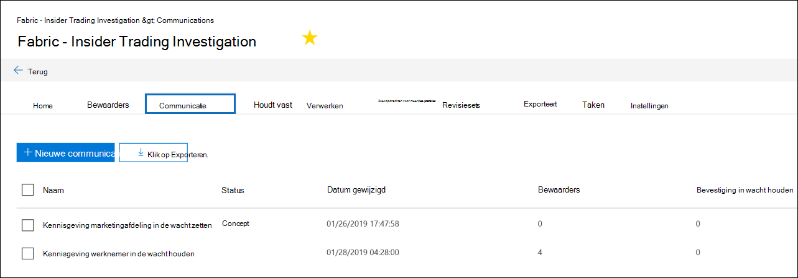
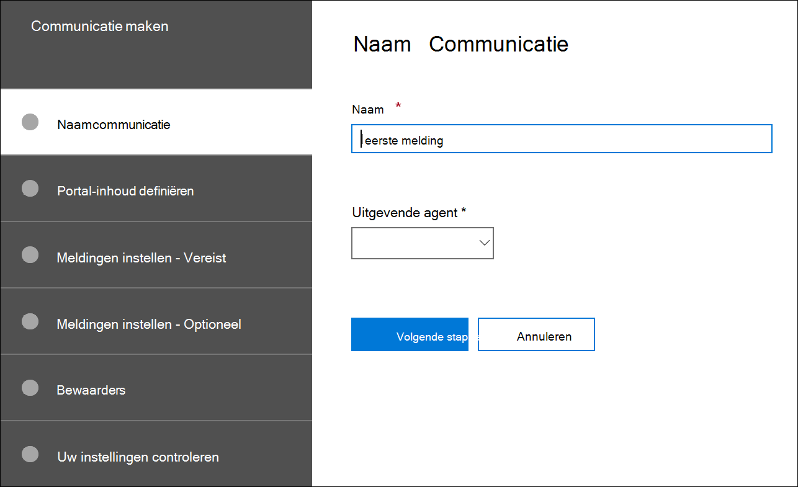
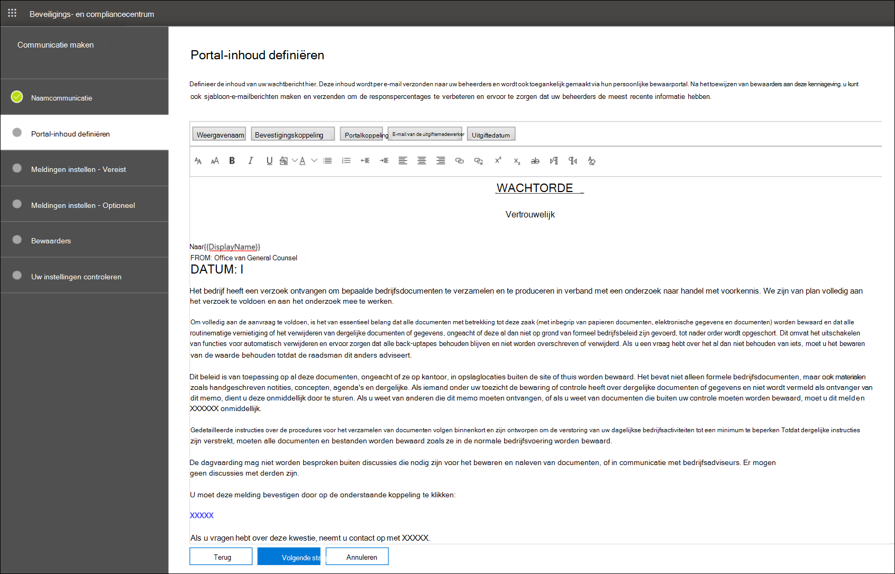

# Een kennisgeving voor een wettelijke wachttermijn makenCreate a legal hold notice

Met Advanced eDiscovery beheerderscommunicatie kunnen organisaties hun werkstroom beheren rond communiceren met bewaarders.Using Advanced eDiscovery custodian communications, organizations can manage their workflow around communicating with custodians. Via het hulpmiddel Communicatie kunnen juridische teams systematisch meldingen over juridische wacht houden verzenden, verzamelen en bijhouden.Through the Communications tool, legal teams can systematically send, collect, and track legal hold notifications. Het flexibele creatieproces stelt teams ook in staat om de werkstroom voor wachtberichten en de inhoud in de kennisgevingen aan beheerders aan te passen.The flexible creation process also allows teams to customize the hold notification workflow and the content in the notices sent to custodians.

In het artikel worden de stappen in de werkstroom voor wachtmeldingen beschreven.The article outlines the steps in the hold notification workflow.

## Stap 1: Communicatiedetails opgevenStep 1: Specify communication details

De eerste stap is het specificeren van de juiste details voor kennisgevingen voor wettelijke bewaartermijnen of andere bewaartermijnen.The first step is to specify the appropriate details for legal hold notices or other custodian communications.

1. Ga in het & compliancecentrum naar **eDiscovery > Advanced eDiscovery** om de lijst met zaken in uw organisatie weer te geven.In the Security & Compliance Center, go to **eDiscovery > Advanced eDiscovery** to display the list of cases in your organization.

2. Selecteer een zaak, klik op **het tabblad Communicatie** en klik vervolgens op Nieuwe **communicatie.**Select a case, click the **Communications** tab, and then click **New communication**.

3. Geef op **de pagina Naamcommunicatie** de volgende (vereiste) communicatiedetails op.On the **Name communication** page, specify the following (required) communication details.

    - **Naam:** dit is de naam voor de communicatie.**Name**: This is the name for the communication.

    - **Uitgiftemedewerker:** In de vervolgkeuzelijst ziet u een lijst met caseleden.**Issuing officer**: The dropdown list displays a list of case members. Zie Een Advanced eDiscovery maken voor meer informatie over het toevoegen [van nieuwe leden aan een zaak.](create-and-manage-advanced-ediscoveryv2-case.md#create-a-case)For more information on how to add new members to a case, see [Create an Advanced eDiscovery case](create-and-manage-advanced-ediscoveryv2-case.md#create-a-case). Elke kennisgeving die naar bewaarders wordt verzonden, wordt verzonden namens de opgegeven uitgevende agent.Each notice sent to custodians will be sent on behalf of the specified issuing officer.

> [!NOTE]
> De uitgevende agent moet een **actief postvak hebben om** in de vervolgkeuzekeuze van de uitgevende agent te wordenThe issuing officer must have an **active mailbox** to show up in the Issuing Officer dropdown

4. Klik op **Volgende**.Click **Next**.

## Stap 2: De portalinhoud definiërenStep 2: Define the portal content

Vervolgens kunt u de inhoud van de wachtbericht maken en toevoegen.Next, you can create and add the content of the hold notice. Geef op **de pagina Portalinhoud** definiëren in de wizard **Communicatie maken** de inhoud van de berichtopgave op.On the **Define portal content** page in the **Create communication** wizard, specify the contents of the hold notice. Deze inhoud wordt automatisch toegevoegd aan de aankondigingen Uitgifte, Opnieuw probleem, Herinnering en Escalatie.This content will be automatically appended to the Issuance, Re-Issue, Reminder, and Escalation notices. Bovendien wordt deze inhoud weergegeven in de complianceportal van de bewaarder.Additionally, this content will appear in the custodian's Compliance Portal. 

De portalinhoud maken:To create the portal content:

1. Typ (of knip en plak uit een ander document) uw wachtbericht in het tekstvak voor de portalinhoud.Type (or cut and paste from another document) your hold notice in the textbox for the portal content. 

2. Voeg samenvoegvariabelen in uw kennisgeving in om de kennisgeving aan te passen en de Bewaarder complianceportal te delen.Insert merge variables into your notice to customize the notice and share the Custodian Compliance Portal.

3. Klik op **Volgende**.Click **Next**.

  >[!Tip]
  >Zie De communicatieeditor gebruiken voor meer informatie over het aanpassen van de inhoud en opmaak van de [portalinhoud.](using-communications-editor.md)To learn more about how to can customize the content and format of the portal content, see [Use the Communications Editor](using-communications-editor.md).

## Stap 3: De vereiste meldingen instellenStep 3: Set the required notifications

Nadat u de inhoud van de kennisgeving hebt gedefinieerd, kunt u de werkstromen voor het verzenden en beheren van het meldingsproces instellen.After you've defined the contents of the hold notice, you can set up the workflows around sending and managing the notification process. Meldingen zijn e-mailberichten die worden verzonden om beheerders op de hoogte te stellen en op te volgen.Notifications are email messages that are sent to notify and follow up with custodians. Elke bewaarder die aan de communicatie wordt toegevoegd, ontvangt dezelfde melding.Every custodian added to the communication will receive the same notification. 

Als u een aanmeldbericht wilt instellen en verzenden, moet u uitgifte-, heruitgifte- en releasemeldingen opnemen.To set up and send a hold notice, you must include Issuance, Re-Issuance, and Release notifications.

### UitgiftemeldingIssuance notification 

Nadat de communicatie is  gemaakt, wordt de uitgiftemelding gestart door de opgegeven uitgiftemedewerker.After the communication is created, the **Issuance Notification** is initiated by the specified Issuing Officer. De uitgiftemelding is de eerste mededeling die naar de bewaarder wordt verzonden om hen te informeren over hun bewaarverplichtingen.The Issuance notification is the first communication sent to the custodian to inform them about their preservation obligations. 

Een uitgiftemelding maken:To create an issuance notification:

1. Klik in **de tegel** Uitgifte op **Bewerken.**In the **Issuance** tile, click **Edit**.

2. Voeg indien nodig extra caseleden of personeelsleden toe aan de **velden CC** en **BCC.**If necessary, add additional case members or staff to the **Cc** and **Bcc** fields. Als u meerdere gebruikers aan deze velden wilt toevoegen, scheidt u e-mailadressen met een dubbele punt.To add multiple users to these fields, separate email addresses with a semi-colon.

3. Geef het **onderwerp** op voor de kennisgeving (vereist).Specify the **Subject** for the notice (required).

4. Geef de inhoud of aanvullende instructies op die u wilt verstrekken aan de bewaarder (vereist).Specify the contents or additional instructions that you would like to provide to the custodian (required). De portalinhoud die u hebt gedefinieerd in stap 2, wordt toegevoegd aan het einde van de uitgiftebericht.The portal content you defined in Step 2 is added to the end of the issuance notice. 

5. Klik op **Opslaan**.Click **Save**.

### Re-Issuance meldingRe-Issuance notification

Naarmate het geval vordert, moeten bewaarders mogelijk aanvullende of minder gegevens bewaren dan eerder is geïnstrueerd.As the case progresses, custodians may be required to preserve additional or less data than was previously instructed. Nadat u de portalinhoud hebt bijgewerkt, wordt de melding voor de heruitgifte verzonden en worden beheerders gewaarschuwd voor wijzigingen in hun bewaarverplichting.After you update the portal content, the re-issuance notification is sent and alerts custodians about any changes to their preservation obligations.

Een melding voor heruitgifte maken:To create a re-issuance notification:

1. Klik in **de tegel** Heruitgave op **Bewerken.**In the **Reissue** tile, click **Edit**.

2. Voeg indien nodig extra caseleden of personeelsleden toe aan de **velden CC** en **BCC.**If necessary, add additional case members or staff to the **Cc** and **Bcc** fields. Als u meerdere gebruikers aan deze velden wilt toevoegen, scheidt u e-mailadressen met een dubbele punt.To add multiple users to these fields, separate email addresses with a semi-colon.

3. Geef het **onderwerp** op voor de kennisgeving (vereist).Specify the **Subject** for the notice (required).

4. Geef de inhoud of aanvullende instructies op die u wilt verstrekken aan de bewaarder (vereist).Specify the contents or additional instructions that you would like to provide to the custodian (required). De portalinhoud die u hebt gedefinieerd in stap 2, wordt toegevoegd aan het einde van de heruitgiftebericht.The portal content you defined in Step 2 is added to the end of the re-issuance notice.

5. Klik op **Opslaan**.Click **Save**.

> [!NOTE]
> Als de portalinhoud wordt  gewijzigd (op de  pagina Portalinhoud definiëren in de wizard Communicatie bewerken), wordt de melding van de heruitgifte automatisch verzonden naar alle beheerders die aan de melding zijn toegewezen.If the portal content is modified (on the **Define Portal Content** page in the **Edit communication** wizard), the re-issuance notification will be automatically sent to all custodians assigned to the notice. Nadat de melding is verzonden, wordt bewaarders gevraagd hun aanmelding opnieuw te bevestigen.After the notification is sent, custodians will be asked to re-acknowledge their hold notice. Als u een herinnerings- of escalatiewerkstroom hebt ingesteld, worden deze ook opnieuw ingesteld.If you have set up any reminder or escalation workflows, these will also re-start. Zie Gebeurtenissen die meldingen activeren voor meer informatie over andere gebeurtenissen voor casemanagement die communicatie [activeren.](#events-that-trigger-notifications)For more information about what other case management events trigger communications, see [Events that trigger notifications](#events-that-trigger-notifications).

### ReleasemeldingRelease notification

Nadat een zaak is opgelost of als een bewaarder niet langer onderworpen is aan het bewaren van inhoud, kunt u de bewaarder vrij laten van een zaak.After a matter is resolved or if a custodian is no longer subject to preserve content, you can release the custodian from a case. Als de bewaarder eerder een bewaartermijn is afgegeven, kan de releasemelding worden gebruikt om bewaarders te waarschuwen dat ze zijn vrijgekomen van hun verplichting.If the custodian was previously issued a hold notice, the release notification can be used to alert custodians that they have been released from their obligation.

Een releasemelding maken:To create a release notification: 

1. Klik in **de tegel** Release op **Bewerken.**In the **Release** tile, click **Edit**.

2. Voeg indien nodig extra caseleden of personeelsleden toe aan de **velden CC** en **BCC.**If necessary, add additional case members or staff to the **Cc** and **Bcc** fields. Als u meerdere gebruikers aan deze velden wilt toevoegen, scheidt u e-mailadressen met een dubbele punt.To add multiple users to these fields, separate email addresses with a semi-colon.

3. Geef het **onderwerp** op voor de kennisgeving (vereist).Specify the **Subject** for the notice (required).

4. Geef de inhoud of aanvullende instructies op die u wilt verstrekken aan de bewaarder (vereist).Specify the contents or additional instructions that you would like to provide to the custodian (required).

5. Klik **op Opslaan** en ga naar de volgende stap.Click **Save** and go to the next step.

## (Optioneel) Stap 4: De optionele meldingen instellen(Optional) Step 4: Set the optional notifications

Desgewenst kunt u de werkstroom vereenvoudigen voor het volgen van niet-reagerende beheerders door automatische herinneringen en escalatiemeldingen te maken en te plannen.Optionally, you can simplify the workflow for following up with unresponsive custodians by creating and scheduling automated reminder and escalation notifications.

### HerinneringenReminders

Nadat u een melding over de wacht houden hebt verzonden, kunt u de opvolging van niet-reagerende beheerders volgen door een herinneringswerkstroom te definiëren.After you have sent a hold notification, you can follow up with unresponsive custodians by defining a reminder workflow.

Herinneringen plannen:To schedule reminders:

1. Klik in **de tegel** Herinnering op **Bewerken.**In the **Reminder** tile, click **Edit**.

2. Schakel de **werkstroom Herinnering** in door de **schakelknop Status** in te schakelen (vereist).Enable the **Reminder** workflow by turning on the **Status** toggle (required).

3. Geef het **herinneringsinterval op (in dagen)** (vereist).Specify the **Reminder interval (in days)** (required). Dit is het aantal dagen dat u moet wachten voordat u de eerste en de volgende herinneringsmeldingen verstuurt.This is the number of days to wait before sending the first and follow-up reminder notifications. Als u bijvoorbeeld het herinneringsinterval hebt ingesteld op zeven dagen, wordt de eerste herinnering zeven dagen na de eerste melding verzonden.For example, if you set the reminder interval to seven days, then the first reminder would be sent seven days after the hold notification was initially issued. Alle volgende herinneringen worden ook om de zeven dagen verzonden.All subsequent reminders would also be sent every seven days.

4. Geef het **aantal herinneringen op** (vereist).Specify the **Number of reminders** (required). In dit veld wordt aangegeven hoeveel herinneringen u moet verzenden naar niet-reagerende bewaarders.This field specifies how many reminders to send to unresponsive custodians. Als u bijvoorbeeld het aantal herinneringen in stelt op 3, ontvangt een bewaarder maximaal drie herinneringen.For example, if you set the number of reminders to 3, then a custodian would receive a maximum of three reminders. Nadat een bewaarder de melding van de bewaarplicht heeft bevestigd, worden er geen herinneringen meer naar die gebruiker verzonden.After a custodian acknowledges the hold notification, reminders will no longer be sent to that user.

5. Geef het **onderwerp** op voor de kennisgeving (vereist).Specify the **Subject** for the notice (required). 

6. Geef de inhoud of aanvullende instructies op die u wilt verstrekken aan de bewaarder (vereist).Specify the contents or additional instructions that you would like to provide to the custodian (required). De portalinhoud die u hebt gedefinieerd in stap 2, wordt toegevoegd aan het einde van de herinneringsbericht.The portal content you defined in Step 2 is added to the end of the reminder notice.

7. Klik **op Opslaan** en ga verder met de volgende stap.Click **Save** and go the next step.

### EscalatiesEscalations

In sommige situaties hebt u mogelijk extra manieren nodig om op te volgen met niet-reagerende bewaarders.In some situations, you may need additional ways to follow up with unresponsive custodians. Als een bewaarder een melding over een bewaartermijn niet erkent na ontvangst van het opgegeven aantal herinneringen, kan het juridische team een werkstroom opgeven om automatisch een escalatiemelding te verzenden naar de beheerder en hun manager.If a custodian doesn't acknowledge a hold notification after receiving the specified number of reminders, the legal team can specify a workflow to automatically send an escalation notice to the custodian and their manager.

Escalaties plannen:To schedule escalations:

1. Klik in **de tegel Escalatie** op **Bewerken.**In the **Escalation** tile, click **Edit**.

2. Schakel de **werkstroom Escalatie** in door de schakelknop **Status** in te schakelen.Enable the **Escalation** workflow by turning on the **Status** toggle.

3. Geef het **escalatieinterval op (in dagen)** (vereist).Specify the **Escalation interval (in days)** (required).

4. Geef het **aantal escalaties op** (vereist).Specify the **Number of escalations** (required). In dit veld wordt aangegeven hoeveel escalaties u wilt verzenden naar niet-reagerende bewaarders.This field specifies how many escalations to send to unresponsive custodians. Als u bijvoorbeeld het aantal escalaties in stelt op 3, wordt er maximaal drie keer een escalatiebericht verzonden naar de beheerder en hun manager.For example, if you set the number of escalations to 3, then an escalation notice would be sent to the custodian and their manager a maximum of three times. Nadat een bewaarder de melding van de bewaarplicht heeft bevestigd, worden escalaties niet meer verzonden.After a custodian acknowledges the hold notification, escalations will no longer be sent.

5. Geef het **onderwerp** op voor de kennisgeving (vereist).Specify the **Subject** for the notice (required). 

6. Geef de inhoud of aanvullende instructies op die u wilt verstrekken aan de bewaarder (vereist).Specify the contents or additional instructions that you would like to provide to the custodian (required). De portalinhoud die u in stap 2 hebt gedefinieerd, wordt toegevoegd aan het einde van de escalatiebericht.The portal content you defined in Step 2 is added to the end of the escalation notice.

7. Klik **op Opslaan** en ga verder met de volgende stap.Click **Save** and go the next step.

## Stap 5: Beheerders toewijzen om meldingen te ontvangenStep 5: Assign custodians to receive notifications

Nadat u de inhoud voor meldingen hebt afgerond, selecteert u de bewaarders naar wie u meldingen wilt verzenden.After you have finalized the content for notifications, select the custodians that you would like to send notifications to. 

Beheerders toevoegen:To add custodians:

1. Wijs beheerders toe aan de communicatie door op het selectievakje naast hun naam te klikken.Assign custodians to the communication by clicking the checkbox next to their name.

    Nadat de communicatie is gemaakt, wordt de meldingswerkstroom automatisch toegepast op de geselecteerde beheerders.After the communication is created, the notification workflow will automatically apply to the selected custodians.

2. Klik **op Volgende** om de communicatie-instellingen en details te bekijken.Click **Next** to review the communication settings and details.

>[!NOTE]
>U kunt alleen beheerders toevoegen die aan de zaak zijn toegevoegd en geen andere melding binnen de zaak hebben ontvangen.You can only add custodians who have been added to the case and haven't been sent another notification within the case.

## Stap 6: Instellingen controlerenStep 6: Review settings

Nadat u de instellingen hebt beoordeeld en **op** Verzenden hebt geklikt om de communicatie te voltooien, wordt de communicatiewerkstroom automatisch door het systeem verzonden.After you review the settings and click **Send** to complete the communication, the system will automatically start the communication workflow by sending the issuance notice.

## Gebeurtenissen die meldingen activerenEvents that trigger notifications

In de volgende tabel worden gebeurtenissen in het proces voor casebeheer beschreven die worden veroorzaakt wanneer de verschillende typen meldingen worden verzonden naar beheerders.The following table describes events in the case management process that trigger when the different types of notifications are sent to custodians.

|Type communicatieType of communication|TriggerTrigger |
|:---------|:---------|
|Uitgifte-kennisgevingenIssuance notices|De eerste aanmaak van de melding.The initial creation of the notification. U kunt ook handmatig een wachtmelding opnieuw sturen.You can also manually resend a hold notification. |
|Kennisgevingen voor heruitgifteRe-issuance notices|De portalinhoud bijwerken op de pagina **Portalinhoud** definiëren in **de wizard Communicatie bewerken.**Updating the portal content on the **Define Portal Content** page in the **Edit communication** wizard.|
|Release-aankondigingenRelease notices|De bewaarder wordt uit de zaak vrijgegeven.The custodian is released from the case.|
|HerinneringenReminders|Het interval en het aantal herinneringen dat is geconfigureerd voor de herinnering.The interval and number of reminders configured for the reminder.|
|EscalatiesEscalations|Het interval en het aantal herinneringen dat is geconfigureerd voor de escalatie.The interval and number of reminders configured for the escalation.|
|||
