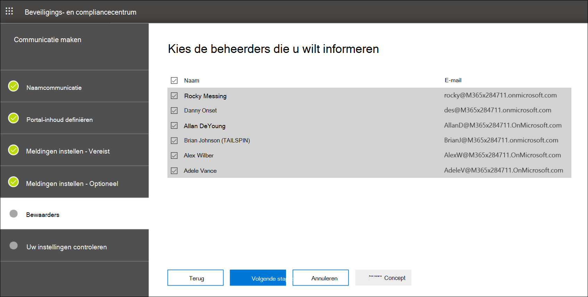

# Een kennisgeving voor een wettelijke wachttermijn maken

Met Advanced eDiscovery beheerderscommunicatie kunnen organisaties hun werkstroom beheren rond communiceren met bewaarders. Via het hulpmiddel Communicatie kunnen juridische teams systematisch meldingen over juridische wacht houden verzenden, verzamelen en bijhouden. Het flexibele creatieproces stelt teams ook in staat om de werkstroom voor wachtberichten en de inhoud in de kennisgevingen aan beheerders aan te passen.

In het artikel worden de stappen in de werkstroom voor wachtmeldingen beschreven.

## Stap 1: Communicatiedetails opgeven

De eerste stap is het specificeren van de juiste details voor kennisgevingen voor wettelijke bewaartermijnen of andere bewaartermijnen.

1. Ga in het & compliancecentrum naar **eDiscovery > Advanced eDiscovery** om de lijst met zaken in uw organisatie weer te geven.

2. Selecteer een zaak, klik op **het tabblad Communicatie** en klik vervolgens op Nieuwe **communicatie.**

3. Geef op **de pagina Naamcommunicatie** de volgende (vereiste) communicatiedetails op.

    - **Naam:** dit is de naam voor de communicatie.

    - **Uitgiftemedewerker:** In de vervolgkeuzelijst ziet u een lijst met caseleden. Zie Een Advanced eDiscovery maken voor meer informatie over het toevoegen [van nieuwe leden aan een zaak.](create-and-manage-advanced-ediscoveryv2-case.md#create-a-case) Elke kennisgeving die naar bewaarders wordt verzonden, wordt verzonden namens de opgegeven uitgevende agent.

> [!NOTE]
> De uitgevende agent moet een **actief postvak hebben om** in de vervolgkeuzekeuze van de uitgevende agent te worden

4. Klik op **Volgende**.

## Stap 2: De portalinhoud definiëren

Vervolgens kunt u de inhoud van de wachtbericht maken en toevoegen. Geef op **de pagina Portalinhoud** definiëren in de wizard **Communicatie maken** de inhoud van de berichtopgave op. Deze inhoud wordt automatisch toegevoegd aan de aankondigingen Uitgifte, Opnieuw probleem, Herinnering en Escalatie. Bovendien wordt deze inhoud weergegeven in de complianceportal van de bewaarder.

De portalinhoud maken:

1. Typ (of knip en plak uit een ander document) uw wachtbericht in het tekstvak voor de portalinhoud.

2. Voeg samenvoegvariabelen in uw kennisgeving in om de kennisgeving aan te passen en de Bewaarder complianceportal te delen.

3. Klik op **Volgende**.

  > [!TIP]
  > Zie De communicatieeditor gebruiken voor meer informatie over het aanpassen van de inhoud en opmaak van de [portalinhoud.](using-communications-editor.md)

## Stap 3: De vereiste meldingen instellen

Nadat u de inhoud van de kennisgeving hebt gedefinieerd, kunt u de werkstromen voor het verzenden en beheren van het meldingsproces instellen. Meldingen zijn e-mailberichten die worden verzonden om beheerders op de hoogte te stellen en op te volgen. Elke bewaarder die aan de communicatie wordt toegevoegd, ontvangt dezelfde melding.

Als u een aanmeldbericht wilt instellen en verzenden, moet u uitgifte-, heruitgifte- en releasemeldingen opnemen.

### Uitgiftemelding

Nadat de communicatie is  gemaakt, wordt de uitgiftemelding gestart door de opgegeven uitgiftemedewerker. De uitgiftemelding is de eerste mededeling die naar de bewaarder wordt verzonden om hen te informeren over hun bewaarverplichtingen.

Een uitgiftemelding maken:

1. Klik in **de tegel** Uitgifte op **Bewerken.**

2. Voeg indien nodig extra caseleden of personeelsleden toe aan de **velden CC** en **BCC.** Als u meerdere gebruikers aan deze velden wilt toevoegen, scheidt u e-mailadressen met een dubbele punt.

3. Geef het **onderwerp** op voor de kennisgeving (vereist).

4. Geef de inhoud of aanvullende instructies op die u wilt verstrekken aan de bewaarder (vereist). De portalinhoud die u hebt gedefinieerd in stap 2, wordt toegevoegd aan het einde van de uitgiftebericht.

5. Klik op **Opslaan**.

### Re-Issuance melding

Naarmate het geval vordert, moeten bewaarders mogelijk aanvullende of minder gegevens bewaren dan eerder is geïnstrueerd. Nadat u de portalinhoud hebt bijgewerkt, wordt de melding voor de heruitgifte verzonden en worden beheerders gewaarschuwd voor wijzigingen in hun bewaarverplichting.

Een melding voor heruitgifte maken:

1. Klik in **de tegel** Heruitgave op **Bewerken.**

2. Voeg indien nodig extra caseleden of personeelsleden toe aan de **velden CC** en **BCC.** Als u meerdere gebruikers aan deze velden wilt toevoegen, scheidt u e-mailadressen met een dubbele punt.

3. Geef het **onderwerp** op voor de kennisgeving (vereist).

4. Geef de inhoud of aanvullende instructies op die u wilt verstrekken aan de bewaarder (vereist). De portalinhoud die u hebt gedefinieerd in stap 2, wordt toegevoegd aan het einde van de heruitgiftebericht.

5. Klik op **Opslaan**.

> [!NOTE]
> Als de portalinhoud wordt  gewijzigd (op de  pagina Portalinhoud definiëren in de wizard Communicatie bewerken), wordt de melding van de heruitgifte automatisch verzonden naar alle beheerders die aan de melding zijn toegewezen. Nadat de melding is verzonden, wordt bewaarders gevraagd hun aanmelding opnieuw te bevestigen. Als u een herinnerings- of escalatiewerkstroom hebt ingesteld, worden deze ook opnieuw ingesteld. Zie Gebeurtenissen die meldingen activeren voor meer informatie over andere gebeurtenissen voor casemanagement die communicatie [activeren.](#events-that-trigger-notifications)

### Releasemelding

Nadat een zaak is opgelost of als een bewaarder niet langer onderworpen is aan het bewaren van inhoud, kunt u de bewaarder vrij laten van een zaak. Als de bewaarder eerder een bewaartermijn is afgegeven, kan de releasemelding worden gebruikt om bewaarders te waarschuwen dat ze zijn vrijgekomen van hun verplichting.

Een releasemelding maken:

1. Klik in **de tegel** Release op **Bewerken.**

2. Voeg indien nodig extra caseleden of personeelsleden toe aan de **velden CC** en **BCC.** Als u meerdere gebruikers aan deze velden wilt toevoegen, scheidt u e-mailadressen met een dubbele punt.

3. Geef het **onderwerp** op voor de kennisgeving (vereist).

4. Geef de inhoud of aanvullende instructies op die u wilt verstrekken aan de bewaarder (vereist).

5. Klik **op Opslaan** en ga naar de volgende stap.

## (Optioneel) Stap 4: De optionele meldingen instellen

Desgewenst kunt u de werkstroom vereenvoudigen voor het volgen van niet-reagerende beheerders door automatische herinneringen en escalatiemeldingen te maken en te plannen.

### Herinneringen

Nadat u een melding over de wacht houden hebt verzonden, kunt u de opvolging van niet-reagerende beheerders volgen door een herinneringswerkstroom te definiëren.

Herinneringen plannen:

1. Klik in **de tegel** Herinnering op **Bewerken.**

2. Schakel de **werkstroom Herinnering** in door de **schakelknop Status** in te schakelen (vereist).

3. Geef het **herinneringsinterval op (in dagen)** (vereist). Dit is het aantal dagen dat u moet wachten voordat u de eerste en de volgende herinneringsmeldingen verstuurt. Als u bijvoorbeeld het herinneringsinterval hebt ingesteld op zeven dagen, wordt de eerste herinnering zeven dagen na de eerste melding verzonden. Alle volgende herinneringen worden ook om de zeven dagen verzonden.

4. Geef het **aantal herinneringen op** (vereist). In dit veld wordt aangegeven hoeveel herinneringen u moet verzenden naar niet-reagerende bewaarders. Als u bijvoorbeeld het aantal herinneringen in stelt op 3, ontvangt een bewaarder maximaal drie herinneringen. Nadat een bewaarder de melding van de bewaarplicht heeft bevestigd, worden er geen herinneringen meer naar die gebruiker verzonden.

5. Geef het **onderwerp** op voor de kennisgeving (vereist).

6. Geef de inhoud of aanvullende instructies op die u wilt verstrekken aan de bewaarder (vereist). De portalinhoud die u hebt gedefinieerd in stap 2, wordt toegevoegd aan het einde van de herinneringsbericht.

7. Klik **op Opslaan** en ga verder met de volgende stap.

### Escalaties

In sommige situaties hebt u mogelijk extra manieren nodig om op te volgen met niet-reagerende bewaarders. Als een bewaarder een melding over een bewaartermijn niet erkent na ontvangst van het opgegeven aantal herinneringen, kan het juridische team een werkstroom opgeven om automatisch een escalatiemelding te verzenden naar de beheerder en hun manager.

Escalaties plannen:

1. Klik in **de tegel Escalatie** op **Bewerken.**

2. Schakel de **werkstroom Escalatie** in door de schakelknop **Status** in te schakelen.

3. Geef het **escalatieinterval op (in dagen)** (vereist).

4. Geef het **aantal escalaties op** (vereist). In dit veld wordt aangegeven hoeveel escalaties u wilt verzenden naar niet-reagerende bewaarders. Als u bijvoorbeeld het aantal escalaties in stelt op 3, wordt er maximaal drie keer een escalatiebericht verzonden naar de beheerder en hun manager. Nadat een bewaarder de melding van de bewaarplicht heeft bevestigd, worden escalaties niet meer verzonden.

5. Geef het **onderwerp** op voor de kennisgeving (vereist).

6. Geef de inhoud of aanvullende instructies op die u wilt verstrekken aan de bewaarder (vereist). De portalinhoud die u in stap 2 hebt gedefinieerd, wordt toegevoegd aan het einde van de escalatiebericht.

7. Klik **op Opslaan** en ga verder met de volgende stap.

## Stap 5: Beheerders toewijzen om meldingen te ontvangen

Nadat u de inhoud voor meldingen hebt afgerond, selecteert u de bewaarders naar wie u meldingen wilt verzenden.

Beheerders toevoegen:

1. Wijs beheerders toe aan de communicatie door op het selectievakje naast hun naam te klikken.

    Nadat de communicatie is gemaakt, wordt de meldingswerkstroom automatisch toegepast op de geselecteerde beheerders.

2. Klik **op Volgende** om de communicatie-instellingen en details te bekijken.

> [!NOTE]
> U kunt alleen beheerders toevoegen die aan de zaak zijn toegevoegd en geen andere melding binnen de zaak hebben ontvangen.

## Stap 6: Instellingen controleren

Nadat u de instellingen hebt beoordeeld en **op** Verzenden hebt geklikt om de communicatie te voltooien, wordt de communicatiewerkstroom automatisch door het systeem verzonden.

## Gebeurtenissen die meldingen activeren

In de volgende tabel worden gebeurtenissen in het proces voor casebeheer beschreven die worden veroorzaakt wanneer de verschillende typen meldingen worden verzonden naar beheerders.

|Type communicatie|Trigger |
|:---------|:---------|
|Uitgifte-kennisgevingen|De eerste aanmaak van de melding. U kunt ook handmatig een wachtmelding opnieuw sturen. |
|Kennisgevingen voor heruitgifte|De portalinhoud bijwerken op de pagina **Portalinhoud** definiëren in **de wizard Communicatie bewerken.**|
|Release-aankondigingen|De bewaarder wordt uit de zaak vrijgegeven.|
|Herinneringen|Het interval en het aantal herinneringen dat is geconfigureerd voor de herinnering.|
|Escalaties|Het interval en het aantal herinneringen dat is geconfigureerd voor de escalatie.|
|||
