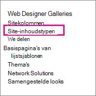

# Beleidsregels voor informatiebeheer maken en toepassen

Met beleidsregels voor informatiebeheer kan uw organisatie bepalen hoe lang inhoud moet worden bewaard, kan worden gecontroleerd wat personen met inhoud doen en streepjescodes of etiketten toevoegen aan documenten. Een beleid kan helpen naleving van wettelijke en overheidsvoorschriften of interne bedrijfsprocessen af te dwingen. Als beheerder kunt u een beleid instellen om te bepalen hoe u documenten bijhoudt en hoe lang documenten moeten worden bewaard.

U kunt een informatiebeheerbeleid maken op drie verschillende locaties in de sitehiërarchie, van breed naar smal:

- Maak een beleid voor gebruik op meerdere inhoudstypen in een siteverzameling.
- Een beleid maken voor een site-inhoudstype.
- Een beleid maken voor een lijst of bibliotheek.

Zie Inleiding tot informatiebeheerbeleid voor [meer informatie.](intro-to-info-mgmt-policies.md)

## Een beleid maken voor meerdere inhoudstypen in een siteverzameling

Als u ervoor wilt zorgen dat een informatiebeleid wordt toegepast op alle documenten van een bepaald type binnen een siteverzameling, kunt u overwegen het beleid op siteverzamelingsniveau te maken en het beleid later toe te passen op inhoudstypen. Deze worden siteverzamelingsbeleid genoemd.

1. Op de startpagina van de \> **siteverzameling Instellingen**  \>**Site Instellingen**.

    Klik in SharePoint groep op **Instellingen,** klik op **Site-inhoud** en klik vervolgens op **Site-Instellingen.**

2. Klik op de pagina Site Instellingen onder **Beleidssjablonen** voor \> **inhoudstype Siteverzamelingsbeheer**.

   

3. Op de pagina Beleid \> **maken**.

4. Voer een naam en beschrijving in voor het beleid en schrijf vervolgens een korte beleidsverklaring waarin gebruikers worden uitgelegd waar het beleid voor is.

5. Zie de volgende sectie over het maken van beleidsregels voor een site-inhoudstype voor meer informatie over het instellen van de functies die u wilt koppelen aan het beleid.

6. Kies **OK**.

## Een beleid maken voor een site-inhoudstype

Als u een informatiebeheerbeleid toevoegt aan een inhoudstype, kunt u eenvoudig beleidsfuncties koppelen aan meerdere lijsten of bibliotheken. U kunt ervoor kiezen om een bestaand informatiebeheerbeleid toe te voegen aan een inhoudstype of een uniek beleid te maken dat specifiek is voor een afzonderlijk inhoudstype.

 U kunt ook een informatiebeheerbeleid toevoegen aan een inhoudstype dat specifiek is voor lijsten. Dit heeft tot gevolg dat het beleid alleen wordt toegepast op items in die lijst die het inhoudstype gebruiken.

1. Op de startpagina van de \> **siteverzameling Instellingen**  \>**Site Instellingen**.

    Klik in SharePoint groep op **Instellingen,** klik op **Site-inhoud** en klik vervolgens op **Site-Instellingen.**

2. Op de pagina Site Instellingen onder **Web Designer Galleries** \> **Site-inhoudstypen**.

   

3. Selecteer op de pagina Site-inhoudstype Instellingen het inhoudstype dat u een beleid wilt toevoegen.

4. Klik op de pagina Site-inhoudstype **onder Instellingen** \> **beleidsinstellingen voor informatiebeheer.**

5. Voer op de pagina Beleid bewerken een naam en beschrijving in voor het beleid en schrijf vervolgens een korte beschrijving waarin gebruikers worden uitgelegd waarvoor het beleid is.

6. Selecteer in de volgende secties de afzonderlijke beleidsfuncties die u wilt toevoegen aan uw informatiebeheerbeleid.

   

7. Als u een bewaarperiode wilt opgeven voor documenten en items die onderworpen zijn aan dit beleid, kiest u Bewaarperiode inschakelen en geeft u vervolgens de bewaarperiode en de acties op die u wilt uitvoeren wanneer de items verlopen.

   Een bewaarperiode opgeven:

   1. Kies **Een bewaarfase toevoegen voor records.**

   2. Selecteer een bewaarperiodeoptie om op te geven wanneer documenten of items zijn ingesteld op verlopen. Ga op een van de volgende stappen te werk:
      - Als u de vervaldatum wilt instellen  op basis van een datum-eigenschap, selecteert u onder Gebeurtenis Deze fase is gebaseerd op een datum-eigenschap op het item en selecteert u vervolgens de actie voor het document of item (bijvoorbeeld Gemaakt of Gewijzigd) en de periode na deze actie (bijvoorbeeld het aantal dagen, maanden of jaren) wanneer u wilt dat het \> item verloopt.
      - Als u een aangepaste bewaarformule wilt gebruiken om verloop te bepalen, kiest u **Instellen op een aangepaste bewaarformule die op deze server is geïnstalleerd.**

        > [!NOTE]
        > Deze optie is alleen beschikbaar als een aangepaste formule is ingesteld door uw beheerder.

   3. De **optie Een werkstroom** starten is alleen beschikbaar als u een beleid definit voor een lijst, bibliotheek of inhoudstype waarin al een werkstroom is gekoppeld. Vervolgens krijgt u de keuze uit een aantal werkstromen.

   4. Selecteer in **de** sectie Terugkeerpatroon de actie **van deze fase herhalen...** en geef op hoe vaak u de actie opnieuw wilt laten terugkeren.

      > [!NOTE]
      >  Deze optie is alleen beschikbaar als de actie die u hebt geselecteerd, kan worden herhaald. U kunt bijvoorbeeld geen terugkeerpatroon instellen voor de actie **Permanent verwijderen.**

   5. Kies **OK.**

8. Als u controle wilt inschakelen voor de documenten en items die aan dit beleid zijn onderworpen, kiest u Controle inschakelen **en** geeft u vervolgens de gebeurtenissen op die u wilt controleren.

   Controle inschakelen:

   1. Selecteer op de  pagina Beleid bewerken onder Controleren de optie Controle inschakelen en schakel vervolgens de selectievakjes in naast de gebeurtenissen waar u een controlespoor voor wilt behouden.

   2. Als u gebruikers wilt vragen om deze streepjescodes in te voegen in documenten, kiest u **Gebruikers vragen een streepjescode** in te voegen voordat ze deze opslaan of afdrukken.

   3. Kies **OK** om de controlefunctie toe te passen op het beleid.

   Met de functie Controlebeleid kunnen organisaties auditpaden voor documenten maken en analyseren en items zoals takenlijsten, lijsten met problemen, discussiegroepen en agenda's op een lijst zetten. Deze beleidsfunctie bevat een auditlogboek waarmee gebeurtenissen worden gerecordd, zoals wanneer inhoud wordt bekeken, bewerkt of verwijderd.

   Wanneer auditing is ingeschakeld als onderdeel van een informatiebeheerbeleid, kunnen beheerders de controlegegevens weergeven in beleidsgebruiksrapporten die zijn gebaseerd op Microsoft Excel en die het huidige gebruik samenvatten. Beheerders kunnen deze rapporten gebruiken om te bepalen hoe gegevens worden gebruikt binnen de organisatie. Deze rapporten kunnen organisaties ook helpen hun naleving van de regelgeving te controleren en te documenteren of mogelijke problemen te onderzoeken.

   Het auditlogboek registreert de volgende gegevens: gebeurtenisnaam, datum en tijd van de gebeurtenis en systeemnaam van de gebruiker die de actie heeft uitgevoerd.

9. Wanneer streepjescodes zijn ingeschakeld als onderdeel van een beleid, worden ze toegevoegd aan documenteigenschappen en weergegeven in het koptekstgebied van het document waarop de streepjescode wordt toegepast. Net als etiketten kunnen streepjescodes ook handmatig uit een document worden verwijderd. U kunt opgeven of gebruikers moeten worden gevraagd de streepjescode op te nemen bij  het afdrukken of opslaan van een item of dat de streepjescode handmatig moet worden ingevoegd met behulp van het tabblad Invoegen in 2010 Office releaseprogramma's.

   Streepjescodes inschakelen:

   1. Selecteer op **de pagina Beleid** bewerken onder **Streepjescodes** de optie **Streepjescodes inschakelen.**

   2. Als u gebruikers wilt vragen om deze streepjescodes in te voegen in documenten, kiest u **Gebruikers vragen een streepjescode** in te voegen voordat ze deze opslaan of afdrukken.

   3. Kies **OK** om de streepjescodefunctie toe te passen op het beleid.

   Met het streepjescodebeleid worden code 39 standaardcodes gegenereerd. Elke streepjescodeafbeelding bevat tekst onder het streepjescodesymbool dat de waarde van de streepjescode vertegenwoordigt. Hierdoor kunnen de streepjescodegegevens worden gebruikt, zelfs wanneer er geen scanhardware beschikbaar is. Gebruikers kunnen het streepjescodenummer handmatig typen in het zoekvak om het item op een site te zoeken.    |

10. Als u wilt dat documenten waarvoor dit beleid van pas komt, etiketten bevatten, kiest u Labels inschakelen **en** geeft u vervolgens de beste instellingen voor de etiketten op.

    Labels inschakelen:

    1. Als u wilt dat gebruikers een label aan een document toevoegen, kiest u Gebruikers vragen om een label in te voegen voordat ze **het document opslaan of afdrukken.**

       > [!NOTE]
       > Als u wilt dat etiketten optioneel zijn, schakel dan dit selectievakje niet in.

    2. Als u een label wilt vergrendelen zodat het niet kan worden gewijzigd nadat het is ingevoegd, kiest u Wijzigingen in etiketten voorkomen **nadat ze zijn toegevoegd.**

       Met deze instelling wordt voorkomen dat de labeltekst wordt bijgewerkt nadat het label is ingevoegd in een item in een clienttoepassing, zoals Word, Excel of PowerPoint. Als u wilt dat het label wordt bijgewerkt wanneer de eigenschappen voor dit document of item worden bijgewerkt, schakel dan dit selectievakje niet in.

    3. Voer in het vak Labelnotatie de tekst voor het label in zoals u wilt dat deze wordt weergegeven. Labels kunnen maximaal tien kolomverwijzingen bevatten, die elk maximaal 255 tekens kunnen bevatten. Als u de opmaak voor uw label wilt maken, gaat u als volgt te werk:
       - Typ de namen van de kolommen die u wilt opnemen in het label in de volgorde waarin u ze wilt laten verschijnen. Sluit de kolomnamen tussen haakjes () in, zoals wordt weergegeven in het {} voorbeeld op de pagina Beleid bewerken.
       - Typ woorden om de kolommen buiten de haken te identificeren, zoals wordt weergegeven in het voorbeeld op de pagina Beleid bewerken.

    4. Als u een regel-onderbreking wilt toevoegen, **typt u\n** de plaats waar u het regel-onderbreking wilt laten verschijnen.

    5. Selecteer de tekengrootte en -stijl die u wilt gebruiken en geef op of u het label links, midden of rechts in het document wilt positioneren.

       Selecteer een lettertype en stijl die beschikbaar zijn op de computers van de gebruikers. De grootte van het lettertype is van invloed op de tekst die op het etiket kan worden weergegeven.

    6. Voer de hoogte en breedte van het label in. Labelhoogte kan variëren van 0,25 inch tot 20 inch en de labelbreedte kan variëren van 0,25 inch tot 20 inch. Labeltekst is altijd verticaal gecentreerd in de labelafbeelding.

    7. Kies **Vernieuwen om** een voorbeeld van de labelinhoud te bekijken.

11. Kies **OK**.

## Een beleid maken voor een lijst, bibliotheek of map (bewaarbeleid op basis van locatie)

U kunt een bewaarbeleid definiëren dat alleen van toepassing is op een specifieke lijst, bibliotheek of map. Als u echter op deze manier een bewaarbeleid maakt, kunt u dit beleid niet opnieuw gebruiken voor andere lijsten, bibliotheken, mappen of sites en kunt u geen siteverzamelingsbeleid toepassen op een beleid op basis van een locatie.

Als u één bewaarbeleid wilt toepassen op alle soorten inhoud op één locatie, wilt u waarschijnlijk op locatie gebaseerde bewaring gebruiken. In de meeste andere gevallen wilt u controleren of er een bewaarbeleid is opgegeven voor alle inhoudstypen.

Elke submap neemt het bewaarbeleid van de bovenliggende hoofdmap over, tenzij u ervoor kiest overname te breken en een nieuw bewaarbeleid op onderliggend niveau te definiëren.

Als u een ander informatiebeheerbeleid wilt definiëren dan het bewaren van een lijst of bibliotheek, moet u een informatiebeheerbeleid definiëren voor elk afzonderlijk lijstinhoudstype dat aan die lijst of bibliotheek is gekoppeld.

Als u op een bepaald moment besluit om over te schakelen van inhoudstype naar op locatie gebaseerd beleid voor een lijst of bibliotheek, wordt alleen het bewaarbeleid gebruikt als het beleid op basis van de locatie. Alle andere beheerbeleidsregels (audits, streepjescodes en streepjescodes) worden overgenomen van de bijbehorende inhoudstypen.

Op locatie gebaseerde beleidsregels kunnen worden uitgeschakeld voor een siteverzameling door de functie Bibliotheek- en mapretentie te deactiveren. Hierdoor kunnen beheerders van siteverzamelingen ervoor zorgen dat hun inhoudstypebeleid niet wordt overgenomen door het locatiebeleid van een lijstbeheerder.

U hebt ten minste de machtiging Lijsten beheren nodig om de beleidsinstellingen voor informatiebeheer voor een lijst of bibliotheek te wijzigen.

1. Ga naar de lijst of bibliotheek waarvoor u een informatiebeheerbeleid wilt opgeven.

2. Kies op het lint  het tabblad **Bibliotheek of** Lijst Instellingen of \>  **Lijst Instellingen.**

   Klik SharePoint online **op** Instellingen en klik vervolgens op **Lijstinstellingen** **of Bibliotheekinstellingen.**

3. Klik **onder Beleidsinstellingen voor machtigingen en** \> **beheergegevensbeheer**.

   

4. Op de pagina Informatiebeheerbeleid Instellingen, moet u ervoor zorgen dat de bewaarbron voor de lijst of bibliotheek is ingesteld op Bibliotheek en mappen.

   Als **inhoudstype** wordt weergegeven als de bron, klikt u **op Bron** wijzigen en klikt u vervolgens op Bibliotheek en **mappen.** U wordt gewaarschuwd dat bewaarbeleid voor inhoudstype wordt genegeerd. Kies **OK**.

5. Voer op de pagina Beleid bewerken onder **Bewaarschema** voor bibliotheken een korte beschrijving in voor het beleid dat u aan het maken bent.

6. Kies **Een bewaarfase toevoegen...**

   Houd er rekening mee dat u onder Records verschillende bewaarbeleidsregels voor records kunt definiëren door de optie Verschillende bewaarfasen definiëren voor records te selecteren.

7. Selecteer in het dialoogvenster Eigenschappen van fase een optie voor bewaarperiode om op te geven wanneer documenten of items zijn ingesteld op verlopen. Voer een van de volgende handelingen uit:

   - Als u de vervaldatum wilt instellen  op basis van een datum-eigenschap, selecteert u onder Gebeurtenis Deze fase is gebaseerd op een datum-eigenschap op het item en selecteert u vervolgens de actie voor het document of item (bijvoorbeeld Gemaakt of Gewijzigd) en de periode na deze actie (bijvoorbeeld het aantal dagen, maanden of jaren) wanneer u wilt dat het \> item verloopt.

   - Als u een aangepaste bewaarformule wilt gebruiken om verloop te bepalen, kiest u **Instellen op een aangepaste bewaarformule die op deze server is geïnstalleerd.**

     > [!NOTE]
     >  Deze optie is alleen beschikbaar als een aangepaste formule is ingesteld door uw beheerder.

   - Geef **onder** Actie op wat u wilt doen wanneer het document of item verloopt. Als u een specifieke actie wilt inschakelen voor het document of item (zoals verwijderen), selecteert u een actie in de lijst.

8. De **optie Een werkstroom** starten is alleen beschikbaar als u een beleid definit voor een lijst, bibliotheek of inhoudstype waarin al een werkstroom is gekoppeld. Vervolgens krijgt u de keuze uit een aantal werkstromen.

9. Kies **onder** Terugkeerpatroon **de optie Actie van deze fase herhalen...** en geef op hoe vaak u de actie opnieuw wilt laten terugkeren.

   > [!NOTE]
   >  Deze optie is alleen beschikbaar als de actie die u hebt geselecteerd, kan worden herhaald. U kunt bijvoorbeeld geen terugkeerpatroon instellen voor de actie **Permanent verwijderen.**

10. Kies **OK**.

## Een siteverzamelingsbeleid toepassen op een inhoudstype

Als er al beleidsregels voor informatiebeheer voor uw site zijn gemaakt als siteverzamelingsbeleid, kunt u een van de beleidsregels toepassen op een inhoudstype. Hierdoor kunt u hetzelfde beleid toepassen op meerdere inhoudstypen in een siteverzameling die niet hetzelfde bovenliggende inhoudstype delen.

 Als u beleid wilt toepassen op meerdere inhoudstypen in een siteverzameling en u een service voor beheerde metagegevens hebt geconfigureerd, kunt u Publiceren van inhoudstypen gebruiken om informatiebeheerbeleid te publiceren naar meerdere siteverzamelingen. Zie de sectie [Een beleid toepassen op siteverzamelingen voor](#apply-a-policy-across-site-collections) meer informatie.

1. Ga naar de lijst of bibliotheek met het inhoudstype waarop u een beleid wilt toepassen.

2. Kies op het lint  het tabblad **Bibliotheek of** Lijst Instellingen of \>  **Lijst Instellingen.**

   Klik SharePoint online **op** Instellingen en klik vervolgens op **Lijstinstellingen** **of Bibliotheekinstellingen.**

3. Klik **onder Beleidsinstellingen voor machtigingen en** \> **beheergegevensbeheer**.

   

4. Controleer of de beleidsbron is ingesteld op **Inhoudstypen** en selecteer onder **Inhoudstypebeleid** het inhoudstype waar u het beleid op wilt toepassen.

5. Selecteer **onder Geef het beleid** Een \> **siteverzamelingsbeleid gebruiken** op en selecteer vervolgens het beleid dat u wilt toepassen in de lijst.

   > [!NOTE]
   >  Als de **optie Een siteverzamelingsbeleid gebruiken** niet beschikbaar is, is er geen beleid voor siteverzamelingen gedefinieerd voor de siteverzameling.

6. Kies **OK**.

   Als de lijst of bibliotheek waarmee u werkt het  beheer van meerdere inhoudstypen ondersteunt, kunt u onder Inhoudstypen het inhoudstype kiezen waarvoor u een informatiebeheerbeleid wilt opgeven. Hiermee gaat u rechtstreeks naar stap 5 hierboven.

## Een beleid toepassen op alle siteverzamelingen

Deel inhoudstypen in siteverzamelingen met behulp van een servicetoepassing beheerde metagegevens om publicatie van inhoudstypen in te stellen. Met publicatie van inhoudstypen kunt u inhoud en metagegevens consistent beheren op uw sites, omdat inhoudstypen centraal kunnen worden gemaakt en bijgewerkt, en updates kunnen worden gepubliceerd naar meerdere siteverzamelingen of webtoepassingen voor het abonneren.

## Een sjabloon maken op basis van een bestaand beleid voor gebruik in verschillende siteverzamelingen

U kunt een informatiebeheerbeleid definiëren en er vervolgens een sjabloon van maken die u zo nodig in meerdere siteverzamelingen kunt gebruiken. Deze methode kan worden gebruikt als u een back-up wilt maken van uw informatiebeleid of als alternatieve methode voor het gebruik van publicatie van inhoudstype voor het toepassen van één beleid in siteverzamelingen. U maakt een sjabloon of back-up van het beleid door het beleid uit de ene siteverzameling te exporteren en vervolgens te importeren naar een opgeslagen locatie of naar een andere siteverzameling.

> [!IMPORTANT]
> Als u de functie exporteren/importeren gebruikt als een manier om een set beleidssjablonen te maken, moet u er rekening mee houden dat er een unieke id bestaat in het .xml beleid. Hierdoor kunt u dat beleid niet meer dan één keer in een site importeren zonder deze unieke id te wijzigen.

### Een beleid exporteren

1. Kies op de startpagina van de **siteverzameling Instellingen** Kleine Instellingen die de plaats heeft in van  \> **Instellingen.**

   Klik in SharePoint groep op **Instellingen,** klik op **Site-inhoud** en klik vervolgens op **Site-Instellingen.**

2. Klik op de pagina Site Instellingen onder **Beleidssjablonen** voor \> **inhoudstype Siteverzamelingsbeheer**.

   

3. Kies het beleid dat u wilt exporteren \> naar de onderste \> **export.**

4. Kies opslaan bij de prompt om het bestand op te slaan of te openen **en** selecteer vervolgens een locatie waar u het bestand wilt opslaan. Selecteer een locatie die beschikbaar is voor de siteverzamelingen die het beleid importeren.

5. Wanneer het dialoogvenster Downloaden voltooid wordt weergegeven, kiest u **Sluiten.**

### Een beleid importeren in een andere siteverzameling

Als u een informatiebeheerbeleid importeert, kunt u dit toepassen op meerdere inhoudstypen op site- of lijstniveau binnen een bepaalde siteverzameling. De voordelen zijn tweeledig: u hoeft het beleid niet opnieuw te definiëren en toe te passen op elk inhoudstype en u kunt beleidswijzigingen gemakkelijker beheren door op slechts één plaats wijzigingen aan te brengen in het beleid.

1. Op de startpagina van de siteverzameling waarop u het beleid wilt toepassen, kiest u **Instellingen** Kleine Instellingen-tandwiel dat de plaats heeft in van  \> **Instellingen.**

   Klik in SharePoint groep op **Instellingen,** klik op **Site-inhoud** en klik vervolgens op **Site-Instellingen.**

2. Klik op de pagina Site Instellingen onder **Beleidssjablonen** voor \> **inhoudstype Siteverzamelingsbeheer**.

3. Op de pagina Beleid \> **importeren** \> **bladert** u naar het XML-bestand voor het beleid.

4. Selecteer het XML-bestand waarin het beleid is opgeslagen \> **Openen.**

5. Importeer op de pagina Siteverzamelingsbeleid \> **importeren om** het beleid toe te voegen aan de siteverzameling.

Uw geïmporteerde beleid kan nu worden toegepast op een of meer inhoudstypen op site- of lijstniveau.

Met beleidsregels voor informatiebeheer kan uw organisatie bepalen hoe lang inhoud moet worden bewaard, kan worden gecontroleerd wat personen met inhoud doen en streepjescodes of etiketten toevoegen aan documenten. Een beleid kan helpen naleving van wettelijke en overheidsvoorschriften of interne bedrijfsprocessen af te dwingen. Als beheerder kunt u een beleid instellen om te bepalen hoe u documenten bijhoudt en hoe lang documenten moeten worden bewaard.

U kunt een informatiebeheerbeleid maken op drie verschillende locaties in de sitehiërarchie, van breed naar smal:

- Maak een beleid voor gebruik op meerdere inhoudstypen in een siteverzameling.
- Een beleid maken voor een site-inhoudstype.
- Een beleid maken voor een lijst of bibliotheek.

Zie Inleiding tot informatiebeheerbeleid voor [meer informatie.](intro-to-info-mgmt-policies.md)
