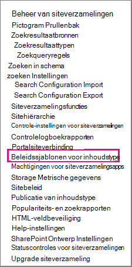
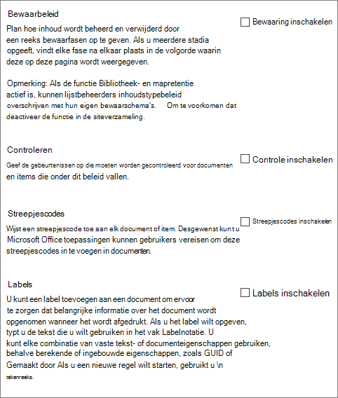

# Beleidsregels voor informatiebeheer maken en toepassenCreate and apply information management policies

Met beleidsregels voor informatiebeheer kan uw organisatie bepalen hoe lang inhoud moet worden bewaard, kan worden gecontroleerd wat personen met inhoud doen en streepjescodes of etiketten toevoegen aan documenten.Information management policies enable your organization to control how long to retain content, to audit what people do with content, and to add barcodes or labels to documents. Een beleid kan helpen naleving van wettelijke en overheidsvoorschriften of interne bedrijfsprocessen af te dwingen.A policy can help enforce compliance with legal and governmental regulations or internal business processes. Als beheerder kunt u een beleid instellen om te bepalen hoe u documenten bijhoudt en hoe lang documenten moeten worden bewaard.As an administrator, you can set up a policy to control how to track documents and how long to retain documents.

U kunt een informatiebeheerbeleid maken op drie verschillende locaties in de sitehiërarchie, van breed naar smal:You can create an information management policy can at three different locations in the site hierarchy, from the broadest to the narrowest:

- Maak een beleid voor gebruik op meerdere inhoudstypen in een siteverzameling.Create a policy to use on multiple content types within a site collection.
- Een beleid maken voor een site-inhoudstype.Create a policy for a site content type.
- Een beleid maken voor een lijst of bibliotheek.Create a policy for a list or library.

Zie Inleiding tot informatiebeheerbeleid voor [meer informatie.](intro-to-info-mgmt-policies.md)For more information, see [Introduction to information management policies](intro-to-info-mgmt-policies.md).

## Een beleid maken voor meerdere inhoudstypen in een siteverzamelingCreate a policy for multiple content types within a site collection

Als u ervoor wilt zorgen dat een informatiebeleid wordt toegepast op alle documenten van een bepaald type binnen een siteverzameling, kunt u overwegen het beleid op siteverzamelingsniveau te maken en het beleid later toe te passen op inhoudstypen.To ensure that an information policy is applied to all documents of a certain type within a site collection, consider creating the policy at the site collection level and then later apply the policy to content types. Deze worden siteverzamelingsbeleid genoemd.These are referred to as site collection policies.

1. Op de startpagina van de \> **siteverzameling Instellingen** On the site collection home page \> **Settings** \>**Site Instellingen**.\> **Site Settings**.

    Klik in SharePoint groep op **Instellingen,** klik op **Site-inhoud** en klik vervolgens op **Site-Instellingen.**In a SharePoint group-connected site, click **Settings**, click **Site Contents**, and then click **Site Settings**.

2. Klik op de pagina Site Instellingen onder **Beleidssjablonen** voor \> **inhoudstype Siteverzamelingsbeheer**.On the Site Settings page, under **Site Collection Administration** \> **Content Type Policy Templates**.

   

3. Op de pagina Beleid \> **maken**.On the Policies page \> **Create**.

4. Voer een naam en beschrijving in voor het beleid en schrijf vervolgens een korte beleidsverklaring waarin gebruikers worden uitgelegd waar het beleid voor is.Enter a name and description for the policy, and then write a brief policy statement that explains to users what the policy is for.

5. Zie de volgende sectie over het maken van beleidsregels voor een site-inhoudstype voor meer informatie over het instellen van de functies die u wilt koppelen aan het beleid.See the next section on creating policies for a site content type to learn how to set up the features you want to associate with the policy.

6. Kies **OK**.Choose **OK**.

## Een beleid maken voor een site-inhoudstypeCreate a policy for a site content type

Als u een informatiebeheerbeleid toevoegt aan een inhoudstype, kunt u eenvoudig beleidsfuncties koppelen aan meerdere lijsten of bibliotheken.Adding an information management policy to a content type makes it easy to associate policy features with multiple lists or libraries. U kunt ervoor kiezen om een bestaand informatiebeheerbeleid toe te voegen aan een inhoudstype of een uniek beleid te maken dat specifiek is voor een afzonderlijk inhoudstype.You can choose to add an existing information management policy to a content type or create a unique policy specific to an individual content type.

 U kunt ook een informatiebeheerbeleid toevoegen aan een inhoudstype dat specifiek is voor lijsten.You can also add an information management policy to a content type that is specific to lists. Dit heeft tot gevolg dat het beleid alleen wordt toegepast op items in die lijst die het inhoudstype gebruiken.This has the effect of applying the policy only to items in that list that are using the content type.

1. Op de startpagina van de \> **siteverzameling Instellingen** On the site collection home page \> **Settings** \>**Site Instellingen**.\> **Site Settings**.

    Klik in SharePoint groep op **Instellingen,** klik op **Site-inhoud** en klik vervolgens op **Site-Instellingen.**In a SharePoint group-connected site, click **Settings**, click **Site Contents**, and then click **Site Settings**.

2. Op de pagina Site Instellingen onder **Web Designer Galleries** \> **Site-inhoudstypen**.On the Site Settings page, under **Web Designer Galleries** \> **Site content types**.

   

3. Selecteer op de pagina Site-inhoudstype Instellingen het inhoudstype dat u een beleid wilt toevoegen.On the Site Content Type Settings page, select the content type that you want to add a policy to.

4. Klik op de pagina Site-inhoudstype **onder Instellingen** \> **beleidsinstellingen voor informatiebeheer.**On the Site Content Type page, under **Settings** \> **Information management policy settings**.

5. Voer op de pagina Beleid bewerken een naam en beschrijving in voor het beleid en schrijf vervolgens een korte beschrijving waarin gebruikers worden uitgelegd waarvoor het beleid is.On the Edit Policy page, enter a name and description for the policy, and then write a brief description that explains to users what the policy is for.

6. Selecteer in de volgende secties de afzonderlijke beleidsfuncties die u wilt toevoegen aan uw informatiebeheerbeleid.In the next sections, select the individual policy features that you want to add to your information management policy.

   

7. Als u een bewaarperiode wilt opgeven voor documenten en items die onderworpen zijn aan dit beleid, kiest u Bewaarperiode inschakelen en geeft u vervolgens de bewaarperiode en de acties op die u wilt uitvoeren wanneer de items verlopen.To specify a retention period for documents and items that are subject to this policy, choose **Enable Retention**, and then specify the retention period and the actions that you want to occur when the items expire.

   Een bewaarperiode opgeven:To specify a retention period:

   1. Kies **Een bewaarfase toevoegen voor records.**Choose **Add a retention stage for records**.

   2. Selecteer een bewaarperiodeoptie om op te geven wanneer documenten of items zijn ingesteld op verlopen.Select a retention period option to specify when documents or items are set to expire. Ga op een van de volgende stappen te werk:Do one of the following steps:
      - Als u de vervaldatum wilt instellen  op basis van een datum-eigenschap, selecteert u onder Gebeurtenis Deze fase is gebaseerd op een datum-eigenschap op het item en selecteert u vervolgens de actie voor het document of item (bijvoorbeeld Gemaakt of Gewijzigd) en de periode na deze actie (bijvoorbeeld het aantal dagen, maanden of jaren) wanneer u wilt dat het \> item verloopt.To set the expiration date based on a date property, under **Event** \> **This stage is based off a date property on the item**, and then select the document or item action (for example, Created or Modified) and the increment of time after this action (for example, the number of days, months, or years) when you want the item to expire.
      - Als u een aangepaste bewaarformule wilt gebruiken om verloop te bepalen, kiest u **Instellen op een aangepaste bewaarformule die op deze server is geïnstalleerd.**To use a custom retention formula to determine expiration, choose **Set by a custom retention formula installed on this server**.

        > [!NOTE]
        > Deze optie is alleen beschikbaar als een aangepaste formule is ingesteld door uw beheerder.This option is only available if a custom formula has been set up by your administrator.

   3. De **optie Een werkstroom** starten is alleen beschikbaar als u een beleid definit voor een lijst, bibliotheek of inhoudstype waarin al een werkstroom is gekoppeld.The **Start a workflow** option is available only if you are defining a policy for a list, library, or content type that already has a workflow associated with it. Vervolgens krijgt u de keuze uit een aantal werkstromen.You will then be given a choice of workflows to choose from.

   4. Selecteer in **de** sectie Terugkeerpatroon de actie **van deze fase herhalen...** en geef op hoe vaak u de actie opnieuw wilt laten terugkeren.In the **Recurrence** section, select **Repeat this stage's action…** and enter how often you want the action to reoccur.

      > [!NOTE]
      >  Deze optie is alleen beschikbaar als de actie die u hebt geselecteerd, kan worden herhaald.This option is only available if the action you selected can be repeated. U kunt bijvoorbeeld geen terugkeerpatroon instellen voor de actie **Permanent verwijderen.**For example, you cannot set recurrence for the action **Permanently Delete**.

   5. Kies **OK.**Chose **OK**.

8. Als u controle wilt inschakelen voor de documenten en items die aan dit beleid zijn onderworpen, kiest u Controle inschakelen **en** geeft u vervolgens de gebeurtenissen op die u wilt controleren.To enable auditing for the documents and items that are subject to this policy, choose **Enable Auditing**, and then specify the events you want to audit.

   Controle inschakelen:To enable auditing:

   1. Selecteer op de  pagina Beleid bewerken onder Controleren de optie Controle inschakelen en schakel vervolgens de selectievakjes in naast de gebeurtenissen waar u een controlespoor voor wilt behouden.On the Edit Policy page under **Auditing** select **Enable auditing**, and then select the check boxes next to the events you want to keep an audit trail for.

   2. Als u gebruikers wilt vragen om deze streepjescodes in te voegen in documenten, kiest u **Gebruikers vragen een streepjescode** in te voegen voordat ze deze opslaan of afdrukken.To prompt users to insert these barcodes into documents, choose **Prompt users to insert a barcode before saving or printing**.

   3. Kies **OK** om de controlefunctie toe te passen op het beleid.Choose **OK** to apply the auditing feature to the policy.

   Met de functie Controlebeleid kunnen organisaties auditpaden voor documenten maken en analyseren en items zoals takenlijsten, lijsten met problemen, discussiegroepen en agenda's op een lijst zetten.The Auditing Policy feature enables organizations to create and analyze audit trails for documents and to list items such as task lists, issues lists, discussion groups, and calendars. Deze beleidsfunctie bevat een auditlogboek waarmee gebeurtenissen worden gerecordd, zoals wanneer inhoud wordt bekeken, bewerkt of verwijderd.This policy feature provides an audit log that records events, such as when content is viewed, edited, or deleted.

   Wanneer auditing is ingeschakeld als onderdeel van een informatiebeheerbeleid, kunnen beheerders de controlegegevens weergeven in beleidsgebruiksrapporten die zijn gebaseerd op Microsoft Excel en die het huidige gebruik samenvatten.When auditing is enabled as part of an information management policy, administrators can view the audit data in policy usage reports that are based in Microsoft Excel and that summarize current usage. Beheerders kunnen deze rapporten gebruiken om te bepalen hoe gegevens worden gebruikt binnen de organisatie.Administrators can use these reports to determine how information is being used within the organization. Deze rapporten kunnen organisaties ook helpen hun naleving van de regelgeving te controleren en te documenteren of mogelijke problemen te onderzoeken.These reports can also help organizations to verify and document their regulatory compliance or to investigate potential concerns.

   Het auditlogboek registreert de volgende gegevens: gebeurtenisnaam, datum en tijd van de gebeurtenis en systeemnaam van de gebruiker die de actie heeft uitgevoerd.The audit log records the following information: event name, date and time of the event, and system name of the user who performed the action.

9. Wanneer streepjescodes zijn ingeschakeld als onderdeel van een beleid, worden ze toegevoegd aan documenteigenschappen en weergegeven in het koptekstgebied van het document waarop de streepjescode wordt toegepast.When barcodes are enabled as part of a policy, they are added to document properties and displayed in the header area of the document to which the barcode is applied. Net als etiketten kunnen streepjescodes ook handmatig uit een document worden verwijderd.Like labels, barcodes can also be manually removed from a document. U kunt opgeven of gebruikers moeten worden gevraagd de streepjescode op te nemen bij  het afdrukken of opslaan van een item of dat de streepjescode handmatig moet worden ingevoegd met behulp van het tabblad Invoegen in 2010 Office releaseprogramma's.You can specify whether users should be prompted to include the barcode when printing or saving an item or if the barcode should be inserted manually using the **Insert** tab in 2010 Office release programs.

   Streepjescodes inschakelen:To enable barcodes:

   1. Selecteer op **de pagina Beleid** bewerken onder **Streepjescodes** de optie **Streepjescodes inschakelen.**On the **Edit Policy** page under **Barcodes**, select **Enable Barcodes**.

   2. Als u gebruikers wilt vragen om deze streepjescodes in te voegen in documenten, kiest u **Gebruikers vragen een streepjescode** in te voegen voordat ze deze opslaan of afdrukken.To prompt users to insert these barcodes into documents, choose **Prompt users to insert a barcode before saving or printing**.

   3. Kies **OK** om de streepjescodefunctie toe te passen op het beleid.Choose **OK** to apply the barcode feature to the policy.

   Met het streepjescodebeleid worden code 39 standaardcodes gegenereerd.The barcode policy generates Code 39 standard barcodes. Elke streepjescodeafbeelding bevat tekst onder het streepjescodesymbool dat de waarde van de streepjescode vertegenwoordigt.Each barcode image includes text below the barcode symbol that represents the barcode value. Hierdoor kunnen de streepjescodegegevens worden gebruikt, zelfs wanneer er geen scanhardware beschikbaar is.This enables the barcode data to be used even when scanning hardware is not available. Gebruikers kunnen het streepjescodenummer handmatig typen in het zoekvak om het item op een site te zoeken.Users can manually type the barcode number into the search box to locate the item on a site.    |

10. Als u wilt dat documenten waarvoor dit beleid van pas komt, etiketten bevatten, kiest u Labels inschakelen **en** geeft u vervolgens de beste instellingen voor de etiketten op.To require that documents that are subject to this policy have labels, choose **Enable Labels**, and then specify the settings that you want for the labels.

    Labels inschakelen:To enable labels:

    1. Als u wilt dat gebruikers een label aan een document toevoegen, kiest u Gebruikers vragen om een label in te voegen voordat ze **het document opslaan of afdrukken.**To require users to add a label to a document, choose **Prompt users to insert a label before saving or printing**.

       > [!NOTE]
       > Als u wilt dat etiketten optioneel zijn, schakel dan dit selectievakje niet in.If you want labels to be optional, do not select this check box.

    2. Als u een label wilt vergrendelen zodat het niet kan worden gewijzigd nadat het is ingevoegd, kiest u Wijzigingen in etiketten voorkomen **nadat ze zijn toegevoegd.**To lock a label so that it cannot be changed after it has been inserted, choose **Prevent changes to labels after they are added**.

       Met deze instelling wordt voorkomen dat de labeltekst wordt bijgewerkt nadat het label is ingevoegd in een item in een clienttoepassing, zoals Word, Excel of PowerPoint.This setting prevents the label text from updating once the label has been inserted into an item within a client application such as Word, Excel, or PowerPoint. Als u wilt dat het label wordt bijgewerkt wanneer de eigenschappen voor dit document of item worden bijgewerkt, schakel dan dit selectievakje niet in.If you want the label to be updated when the properties for this document or item are updated, do not select this check box.

    3. Voer in het vak Labelnotatie de tekst voor het label in zoals u wilt dat deze wordt weergegeven.In the Label format box, enter the text for the label as you want it to be displayed. Labels kunnen maximaal tien kolomverwijzingen bevatten, die elk maximaal 255 tekens kunnen bevatten.Labels can contain up to 10 column references, each of which can be up to 255 characters long. Als u de opmaak voor uw label wilt maken, gaat u als volgt te werk:To create the format for your label, do the following steps:
       - Typ de namen van de kolommen die u wilt opnemen in het label in de volgorde waarin u ze wilt laten verschijnen.Type the names of the columns that you want to include in the label in the order in which you want them to appear. Sluit de kolomnamen tussen haakjes () in, zoals wordt weergegeven in het {} voorbeeld op de pagina Beleid bewerken.Enclose the column names in curly brackets ({}), as shown in the example on the Edit Policy page.
       - Typ woorden om de kolommen buiten de haken te identificeren, zoals wordt weergegeven in het voorbeeld op de pagina Beleid bewerken.Type words to identify the columns outside the brackets, as shown in the example on the Edit Policy page.

    4. Als u een regel-onderbreking wilt toevoegen, **typt u\n** de plaats waar u het regel-onderbreking wilt laten verschijnen.To add a line break, enter **\n** where you want the line break to appear.

    5. Selecteer de tekengrootte en -stijl die u wilt gebruiken en geef op of u het label links, midden of rechts in het document wilt positioneren.Select the font size and style that you want, and specify whether you want the label positioned left, center, or right within the document.

       Selecteer een lettertype en stijl die beschikbaar zijn op de computers van de gebruikers.Select a font and style that are available on the users' computers. De grootte van het lettertype is van invloed op de tekst die op het etiket kan worden weergegeven.The size of the font affects how much text can be displayed on the label.

    6. Voer de hoogte en breedte van het label in.Enter the height and width of the label. Labelhoogte kan variëren van 0,25 inch tot 20 inch en de labelbreedte kan variëren van 0,25 inch tot 20 inch.Label height can range from .25 inches to 20 inches, and label width can range from .25 inches to 20 inches. Labeltekst is altijd verticaal gecentreerd in de labelafbeelding.Label text is always vertically centered within the label image.

    7. Kies **Vernieuwen om** een voorbeeld van de labelinhoud te bekijken.Choose **Refresh** to preview the label content.

11. Kies **OK**.Choose **OK**.

## Een beleid maken voor een lijst, bibliotheek of map (bewaarbeleid op basis van locatie)Create a policy for a list, library or folder (location-based retention policy)

U kunt een bewaarbeleid definiëren dat alleen van toepassing is op een specifieke lijst, bibliotheek of map.You can define a retention policy that applies only to a specific list, library or folder. Als u echter op deze manier een bewaarbeleid maakt, kunt u dit beleid niet opnieuw gebruiken voor andere lijsten, bibliotheken, mappen of sites en kunt u geen siteverzamelingsbeleid toepassen op een beleid op basis van een locatie.However, if you create a retention policy this way, you cannot reuse this policy on other lists, libraries, folders or sites, and you cannot apply a site collection policy to a location based policy.

Als u één bewaarbeleid wilt toepassen op alle soorten inhoud op één locatie, wilt u waarschijnlijk op locatie gebaseerde bewaring gebruiken.If you want to apply a single retention policy to all types of content in a single location, you will most likely want to use location-based retention. In de meeste andere gevallen wilt u controleren of er een bewaarbeleid is opgegeven voor alle inhoudstypen.In most other cases, you will want to verify that a retention policy is specified for all content types.

Elke submap neemt het bewaarbeleid van de bovenliggende hoofdmap over, tenzij u ervoor kiest overname te breken en een nieuw bewaarbeleid op onderliggend niveau te definiëren.Each subfolder inherits the retention policy of its parent, unless you choose to break inheritance and define a new retention policy at the child level.

Als u een ander informatiebeheerbeleid wilt definiëren dan het bewaren van een lijst of bibliotheek, moet u een informatiebeheerbeleid definiëren voor elk afzonderlijk lijstinhoudstype dat aan die lijst of bibliotheek is gekoppeld.If you want to define an information management policy other than retention to a list or library, you need to define an information management policy for each individual list content type associated with that list or library.

Als u op een bepaald moment besluit om over te schakelen van inhoudstype naar op locatie gebaseerd beleid voor een lijst of bibliotheek, wordt alleen het bewaarbeleid gebruikt als het beleid op basis van de locatie.If at any point you decide to switch from content type to location-based policies for a list or library, only the retention policy will be used as the location-based policy. Alle andere beheerbeleidsregels (audits, streepjescodes en streepjescodes) worden overgenomen van de bijbehorende inhoudstypen.All other management policies (audits, barcodes, and barcodes) will be inherited from the associated content types.

Op locatie gebaseerde beleidsregels kunnen worden uitgeschakeld voor een siteverzameling door de functie Bibliotheek- en mapretentie te deactiveren.Location based policies can be disabled for a site collection by deactivating the Library and Folder Based Retention feature. Hierdoor kunnen beheerders van siteverzamelingen ervoor zorgen dat hun inhoudstypebeleid niet wordt overgenomen door het locatiebeleid van een lijstbeheerder.This enables site collection administrators to ensure that their content type policies are not overridden by a list administrator's location based policies.

U hebt ten minste de machtiging Lijsten beheren nodig om de beleidsinstellingen voor informatiebeheer voor een lijst of bibliotheek te wijzigen.You need at least the Manage Lists permission to change the information management policy settings for a list or library.

1. Ga naar de lijst of bibliotheek waarvoor u een informatiebeheerbeleid wilt opgeven.Navigate to the list or library for which you want to specify an information management policy.

2. Kies op het lint  het tabblad **Bibliotheek of** Lijst Instellingen of \>  **Lijst Instellingen.**On the ribbon, choose the **Library** or **List** tab \> **Library Settings** or **List Settings**.

   Klik SharePoint online **op** Instellingen en klik vervolgens op **Lijstinstellingen** **of Bibliotheekinstellingen.**In SharePoint Online, click **Settings** and then click **List settings** or **Library settings**.

3. Klik **onder Beleidsinstellingen voor machtigingen en** \> **beheergegevensbeheer**.Under **Permissions and Management**\> **Information management policy settings**.

   

4. Op de pagina Informatiebeheerbeleid Instellingen, moet u ervoor zorgen dat de bewaarbron voor de lijst of bibliotheek is ingesteld op Bibliotheek en mappen.On the Information Management Policy Settings page, make sure that the source of retention for the list or library is set to Library and Folders.

   Als **inhoudstype** wordt weergegeven als de bron, klikt u **op Bron** wijzigen en klikt u vervolgens op Bibliotheek en **mappen.**If **Content Type** appears as the source, click **Change Source**, and then click **Library and Folders**. U wordt gewaarschuwd dat bewaarbeleid voor inhoudstype wordt genegeerd.You are alerted that content type retention policies will be ignored. Kies **OK**.Choose **OK**.

5. Voer op de pagina Beleid bewerken onder **Bewaarschema** voor bibliotheken een korte beschrijving in voor het beleid dat u aan het maken bent.On the Edit Policy page, under **Library Based Retention Schedule**, enter a brief description for the policy you are creating.

6. Kies **Een bewaarfase toevoegen...**Choose **Add a retention stage…**

   Houd er rekening mee dat u onder Records verschillende bewaarbeleidsregels voor records kunt definiëren door de optie Verschillende bewaarfasen definiëren voor records te selecteren.Note that under Records, you can choose to define different retention policies for records by selecting the Define different retention stages for records option.

7. Selecteer in het dialoogvenster Eigenschappen van fase een optie voor bewaarperiode om op te geven wanneer documenten of items zijn ingesteld op verlopen.In the Stage properties dialog, select a retention period option to specify when documents or items are set to expire. Voer een van de volgende handelingen uit:Do one of the following:

   - Als u de vervaldatum wilt instellen  op basis van een datum-eigenschap, selecteert u onder Gebeurtenis Deze fase is gebaseerd op een datum-eigenschap op het item en selecteert u vervolgens de actie voor het document of item (bijvoorbeeld Gemaakt of Gewijzigd) en de periode na deze actie (bijvoorbeeld het aantal dagen, maanden of jaren) wanneer u wilt dat het \> item verloopt.To set the expiration date based on a date property, under **Event** \> **This stage is based off a date property on the item**, and then select the document or item action (for example, Created or Modified) and the increment of time after this action (for example, the number of days, months, or years) when you want the item to expire.

   - Als u een aangepaste bewaarformule wilt gebruiken om verloop te bepalen, kiest u **Instellen op een aangepaste bewaarformule die op deze server is geïnstalleerd.**To use a custom retention formula to determine expiration, choose **Set by a custom retention formula installed on this server**.

     > [!NOTE]
     >  Deze optie is alleen beschikbaar als een aangepaste formule is ingesteld door uw beheerder.This option is only available if a custom formula has been set up by your administrator.

   - Geef **onder** Actie op wat u wilt doen wanneer het document of item verloopt.Under **Action**, specify what you want to happen when the document or item expires. Als u een specifieke actie wilt inschakelen voor het document of item (zoals verwijderen), selecteert u een actie in de lijst.To enable a specific action to happen to the document or item (such as deletion), select an action from the list.

8. De **optie Een werkstroom** starten is alleen beschikbaar als u een beleid definit voor een lijst, bibliotheek of inhoudstype waarin al een werkstroom is gekoppeld.The **Start a workflow** option is available only if you are defining a policy for a list, library, or content type that already has a workflow associated with it. Vervolgens krijgt u de keuze uit een aantal werkstromen.You will then be given a choice of workflows to choose from.

9. Kies **onder** Terugkeerpatroon **de optie Actie van deze fase herhalen...** en geef op hoe vaak u de actie opnieuw wilt laten terugkeren.Under **Recurrence**, choose **Repeat this stage's action…** and enter how often you want the action to reoccur.

   > [!NOTE]
   >  Deze optie is alleen beschikbaar als de actie die u hebt geselecteerd, kan worden herhaald.This option is only available if the action you selected can be repeated. U kunt bijvoorbeeld geen terugkeerpatroon instellen voor de actie **Permanent verwijderen.**For example, you cannot set recurrence for the action **Permanently Delete**.

10. Kies **OK**.Choose **OK**.

## Een siteverzamelingsbeleid toepassen op een inhoudstypeApply a site collection policy to a content type

Als er al beleidsregels voor informatiebeheer voor uw site zijn gemaakt als siteverzamelingsbeleid, kunt u een van de beleidsregels toepassen op een inhoudstype.If information management policies have already been created for your site as site collection policies, you can apply one of the policies to a content type. Hierdoor kunt u hetzelfde beleid toepassen op meerdere inhoudstypen in een siteverzameling die niet hetzelfde bovenliggende inhoudstype delen.By doing this, you can apply the same policy to multiple content types in a site collection that do not share the same parent content type.

 Als u beleid wilt toepassen op meerdere inhoudstypen in een siteverzameling en u een service voor beheerde metagegevens hebt geconfigureerd, kunt u Publiceren van inhoudstypen gebruiken om informatiebeheerbeleid te publiceren naar meerdere siteverzamelingen.If you want to apply policies to multiple content types in a site collection, and you have a Managed Metadata Service configured, you can use Content Type Publishing to publish out information management polices to multiple site collections. Zie de sectie [Een beleid toepassen op siteverzamelingen voor](#apply-a-policy-across-site-collections) meer informatie.See the section [Apply a policy across site collections](#apply-a-policy-across-site-collections) for more information.

1. Ga naar de lijst of bibliotheek met het inhoudstype waarop u een beleid wilt toepassen.Navigate to the list or library that contains the content type to which you want to apply a policy.

2. Kies op het lint  het tabblad **Bibliotheek of** Lijst Instellingen of \>  **Lijst Instellingen.**On the ribbon, choose the **Library** or **List** tab \> **Library Settings** or **List Settings**.

   Klik SharePoint online **op** Instellingen en klik vervolgens op **Lijstinstellingen** **of Bibliotheekinstellingen.**In SharePoint Online, click **Settings** and then click **List settings** or **Library settings**.

3. Klik **onder Beleidsinstellingen voor machtigingen en** \> **beheergegevensbeheer**.Under **Permissions and Management** \> **Information management policy settings**.

   

4. Controleer of de beleidsbron is ingesteld op **Inhoudstypen** en selecteer onder **Inhoudstypebeleid** het inhoudstype waar u het beleid op wilt toepassen.Verify that the policy source is set to **Content Types**, and under **Content Type Policies** select the content type you want to apply the policy to.

5. Selecteer **onder Geef het beleid** Een \> **siteverzamelingsbeleid gebruiken** op en selecteer vervolgens het beleid dat u wilt toepassen in de lijst.Under **Specify the Policy** \> **Use a site collection policy**, and then select the policy that you want to apply from the list.

   > [!NOTE]
   >  Als de **optie Een siteverzamelingsbeleid gebruiken** niet beschikbaar is, is er geen beleid voor siteverzamelingen gedefinieerd voor de siteverzameling.If the **Use a site collection policy** option is not available, no site collection policies have been defined for the site collection.

6. Kies **OK**.Choose **OK**.

   Als de lijst of bibliotheek waarmee u werkt het  beheer van meerdere inhoudstypen ondersteunt, kunt u onder Inhoudstypen het inhoudstype kiezen waarvoor u een informatiebeheerbeleid wilt opgeven.If the list or library you are working with supports the management of multiple content types, under **Content Types** you can choose the content type for which you want to specify an information management policy. Hiermee gaat u rechtstreeks naar stap 5 hierboven.This will take you directly to Step 5 above.

## Een beleid toepassen op alle siteverzamelingenApply a policy across site collections

Deel inhoudstypen in siteverzamelingen met behulp van een servicetoepassing beheerde metagegevens om publicatie van inhoudstypen in te stellen.Share content types across site collections by using a Managed Metadata service application to set up content type publishing. Met publicatie van inhoudstypen kunt u inhoud en metagegevens consistent beheren op uw sites, omdat inhoudstypen centraal kunnen worden gemaakt en bijgewerkt, en updates kunnen worden gepubliceerd naar meerdere siteverzamelingen of webtoepassingen voor het abonneren.Content type publishing helps you manage content and metadata consistently across your sites because content types can be created and updated centrally, and updates can be published out to multiple subscribing site collections or Web applications.

## Een sjabloon maken op basis van een bestaand beleid voor gebruik in verschillende siteverzamelingenCreate a template from an existing policy to use across site collections

U kunt een informatiebeheerbeleid definiëren en er vervolgens een sjabloon van maken die u zo nodig in meerdere siteverzamelingen kunt gebruiken.You can define an information management policy and then create a template from it to use as needed across multiple site collections. Deze methode kan worden gebruikt als u een back-up wilt maken van uw informatiebeleid of als alternatieve methode voor het gebruik van publicatie van inhoudstype voor het toepassen van één beleid in siteverzamelingen.This method can be used if you want to have a backup of your information policies, or it can also be used as an alternate method to using content type publishing for applying one policy across site collections. U maakt een sjabloon of back-up van het beleid door het beleid uit de ene siteverzameling te exporteren en vervolgens te importeren naar een opgeslagen locatie of naar een andere siteverzameling.You create a template or backup of the policy by exporting the policy from one site collection and then importing it to a saved location or to another site collection.

> [!IMPORTANT]
> Als u de functie exporteren/importeren gebruikt als een manier om een set beleidssjablonen te maken, moet u er rekening mee houden dat er een unieke id bestaat in het .xml beleid.If you using the export/import feature as a way to make a set of policy templates, keep in mind that a unique identifier exists in the policy .xml file. Hierdoor kunt u dat beleid niet meer dan één keer in een site importeren zonder deze unieke id te wijzigen.Because of this, you cannot import that policy into a site more than once without changing this unique identifier.

### Een beleid exporterenExport a policy

1. Kies op de startpagina van de **siteverzameling Instellingen** Kleine Instellingen die de plaats heeft in van  \> **Instellingen.**On the site collection home page, choose **Settings**\> **Site Settings**.

   Klik in SharePoint groep op **Instellingen,** klik op **Site-inhoud** en klik vervolgens op **Site-Instellingen.**In a SharePoint group-connected site, click **Settings**, click **Site Contents**, and then click **Site Settings**.

2. Klik op de pagina Site Instellingen onder **Beleidssjablonen** voor \> **inhoudstype Siteverzamelingsbeheer**.On the Site Settings page, under **Site Collection Administration** \> **Content Type Policy Templates**.

   

3. Kies het beleid dat u wilt exporteren \> naar de onderste \> **export.**Choose the policy you want to export \> scroll to the bottom \> **Export**.

4. Kies opslaan bij de prompt om het bestand op te slaan of te openen **en** selecteer vervolgens een locatie waar u het bestand wilt opslaan.At the prompt to save or open the file, choose **Save**, and then select a location to save the file to. Selecteer een locatie die beschikbaar is voor de siteverzamelingen die het beleid importeren.Be sure to select a location that is available to the site collections that are importing the policy.

5. Wanneer het dialoogvenster Downloaden voltooid wordt weergegeven, kiest u **Sluiten.**When the Download Complete dialog is displayed, choose **Close**.

### Een beleid importeren in een andere siteverzamelingImport a policy to a different site collection

Als u een informatiebeheerbeleid importeert, kunt u dit toepassen op meerdere inhoudstypen op site- of lijstniveau binnen een bepaalde siteverzameling.Importing an information management policy enables you to apply it to multiple content types at the site or list level within any given site collection. De voordelen zijn tweeledig: u hoeft het beleid niet opnieuw te definiëren en toe te passen op elk inhoudstype en u kunt beleidswijzigingen gemakkelijker beheren door op slechts één plaats wijzigingen aan te brengen in het beleid.The benefits of doing this are twofold: you don't have to re-define and apply the policy on each content type, and you can more easily manage policy modifications by making changes to the policy in just one place.

1. Op de startpagina van de siteverzameling waarop u het beleid wilt toepassen, kiest u **Instellingen** Kleine Instellingen-tandwiel dat de plaats heeft in van  \> **Instellingen.**On the home page of the site collection to which you want to apply the policy, choose **Settings**\> **Site Settings**.

   Klik in SharePoint groep op **Instellingen,** klik op **Site-inhoud** en klik vervolgens op **Site-Instellingen.**In a SharePoint group-connected site, click **Settings**, click **Site Contents**, and then click **Site Settings**.

2. Klik op de pagina Site Instellingen onder **Beleidssjablonen** voor \> **inhoudstype Siteverzamelingsbeheer**.On the Site Settings page, under **Site Collection Administration** \> **Content Type Policy Templates**.

3. Op de pagina Beleid \> **importeren** \> **bladert** u naar het XML-bestand voor het beleid.On the Policies page \> **Import** \> **Browse** to find the XML file for the policy.

4. Selecteer het XML-bestand waarin het beleid is opgeslagen \> **Openen.**Select the XML file in which the policy has been saved \> **Open**.

5. Importeer op de pagina Siteverzamelingsbeleid \> **importeren om** het beleid toe te voegen aan de siteverzameling.On the Import a Site Collection Policy page \> **Import** to add the policy to the site collection.

Uw geïmporteerde beleid kan nu worden toegepast op een of meer inhoudstypen op site- of lijstniveau.Your imported policy can now be applied to one or many content types at the site or list level.

Met beleidsregels voor informatiebeheer kan uw organisatie bepalen hoe lang inhoud moet worden bewaard, kan worden gecontroleerd wat personen met inhoud doen en streepjescodes of etiketten toevoegen aan documenten.Information management policies enable your organization to control how long to retain content, to audit what people do with content, and to add barcodes or labels to documents. Een beleid kan helpen naleving van wettelijke en overheidsvoorschriften of interne bedrijfsprocessen af te dwingen.A policy can help enforce compliance with legal and governmental regulations or internal business processes. Als beheerder kunt u een beleid instellen om te bepalen hoe u documenten bijhoudt en hoe lang documenten moeten worden bewaard.As an administrator, you can set up a policy to control how to track documents and how long to retain documents.

U kunt een informatiebeheerbeleid maken op drie verschillende locaties in de sitehiërarchie, van breed naar smal:You can create an information management policy can at three different locations in the site hierarchy, from the broadest to the narrowest:

- Maak een beleid voor gebruik op meerdere inhoudstypen in een siteverzameling.Create a policy to use on multiple content types within a site collection.
- Een beleid maken voor een site-inhoudstype.Create a policy for a site content type.
- Een beleid maken voor een lijst of bibliotheek.Create a policy for a list or library.

Zie Inleiding tot informatiebeheerbeleid voor [meer informatie.](intro-to-info-mgmt-policies.md)For more information, see [Introduction to information management policies](intro-to-info-mgmt-policies.md).
