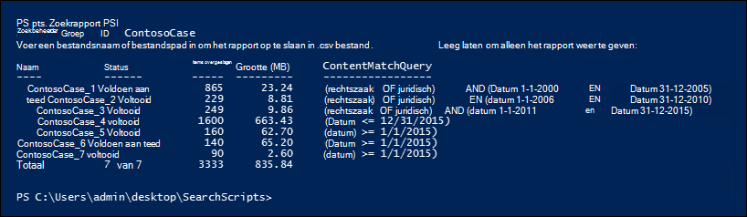

# <a name="create-report-on-and-delete-multiple-content-searches"></a>Meerdere inhoudszoekingen maken, rapporteren en verwijderen

 Het snel maken en rapporteren van zoekopdrachten voor detecties is vaak een belangrijke stap in eDiscovery en onderzoeken wanneer u meer wilt weten over de onderliggende gegevens en de rijkdom en kwaliteit van uw zoekopdrachten. Om u te helpen dit te doen, biedt & Security & Compliance Center PowerShell een set cmdlets om tijdrovende inhoudszoektaken te automatiseren. Deze scripts bieden een snelle en eenvoudige manier om een aantal zoekopdrachten te maken en vervolgens rapporten uit te voeren van de geschatte zoekresultaten die u kunnen helpen bij het bepalen van de hoeveelheid gegevens in kwestie. U kunt de scripts ook gebruiken om verschillende versies van zoekopdrachten te maken om de resultaten te vergelijken die elk resultaat oplevert. Met deze scripts kunt u uw gegevens snel en efficiënt identificeren en verwijderen.

## <a name="before-you-create-a-content-search"></a>Voordat u een inhoudszoekactie maakt

- U moet lid zijn van de rollengroep eDiscovery Manager in het beveiligings- & compliancecentrum om de scripts uit te voeren die in dit onderwerp worden beschreven.

- Zie Een lijst maken met alle OneDrive-locaties in uw organisatie als u een lijst wilt verzamelen met de URL's voor de OneDrive voor Bedrijven-sites [in](/onedrive/list-onedrive-urls)uw organisatie die u kunt toevoegen aan het CSV-bestand in stap 1.

- Sla alle bestanden die u in dit onderwerp maakt op in dezelfde map. Dat maakt het gemakkelijker om de scripts uit te voeren.

- De scripts bevatten minimale foutafhandeling. Het primaire doel is om snel meerdere inhoudszoekingen te maken, te rapporteren en te verwijderen.

- De voorbeeldscripts in dit onderwerp worden niet ondersteund onder een standaardondersteuningsprogramma of -service van Microsoft. De voorbeeldscripts worden zonder enige garantie ONGEWIJZIGD verstrekt. Microsoft wijst alle impliciete garanties met inbegrip van, maar niet beperkt tot, impliciete garanties van verkoopbaarheid en geschiktheid voor een bepaald doel af. Het risico dat ontstaat als gevolg van het gebruik of prestaties van de voorbeeldscripts ligt geheel bij u. In geen geval kan Microsoft, haar auteurs of anderen die bij het maken, produceren of leveren van de scripts zijn betrokken, aansprakelijk worden gehouden voor enige schade om welke reden dan ook (met inbegrip van maar niet beperkt tot schade door verlies van bedrijfswinsten, belemmering van de bedrijfsuitvoering, verlies van bedrijfsinformatie of andere geldelijke verliezen) voortvloeiend uit het gebruik of de onmogelijkheid van het gebruik van de voorbeeldscripts, zelfs als Microsoft op de hoogte is gesteld van de mogelijkheid van dergelijke schade.

## <a name="step-1-create-a-csv-file-that-contains-information-about-the-searches-you-want-to-run"></a>Stap 1: Een CSV-bestand maken met informatie over de zoekopdrachten die u wilt uitvoeren

Het door komma's gescheiden waardebestand (CSV) dat u in deze stap maakt, bevat een rij voor elke gebruiker die wilt zoeken. U kunt zoeken in het Exchange Online postvak van de gebruiker (inclusief het archiefpostvak, als dit is ingeschakeld) en de OneDrive voor Bedrijven site. U kunt ook zoeken in alleen het postvak of de OneDrive voor Bedrijven site. U kunt ook zoeken op elke site in uw SharePoint Online-organisatie. Met het script dat u in stap 3 hebt uitgevoerd, wordt een afzonderlijke zoekopdracht gemaakt voor elke rij in het CSV-bestand.

1. Kopieer en plak de volgende tekst in een .txt met Kladblok. Sla dit bestand op in een map op uw lokale computer. De andere scripts worden ook in deze map opgeslagen.

   ```text
   ExchangeLocation,SharePointLocation,ContentMatchQuery,StartDate,EndDate
   sarad@contoso.onmicrosoft.com,https://contoso-my.sharepoint.com/personal/sarad_contoso_onmicrosoft_com,(lawsuit OR legal),1/1/2000,12/31/2005
   sarad@contoso.onmicrosoft.com,https://contoso-my.sharepoint.com/personal/sarad_contoso_onmicrosoft_com,(lawsuit OR legal),1/1/2006,12/31/2010
   sarad@contoso.onmicrosoft.com,https://contoso-my.sharepoint.com/personal/sarad_contoso_onmicrosoft_com,(lawsuit OR legal),1/1/2011,3/21/2016
   ,https://contoso.sharepoint.com/sites/contoso,,,3/21/2016
   ,https://contoso-my.sharepoint.com/personal/davidl_contoso_onmicrosoft_com,,1/1/2015,
   ,https://contoso-my.sharepoint.com/personal/janets_contoso_onmicrosoft_com,,1/1/2015,
   ```

   De eerste rij of veldnamenrij van het bestand bevat de parameters die worden gebruikt door de cmdlet **New-ComplianceSearch** (in het script in stap 3) om een nieuwe inhoudszoekactie te maken. De namen van parameters worden gescheiden door een komma. Zorg ervoor dat er geen spaties in de veldnamenrij staan. Elke rij onder de veldnamenrij vertegenwoordigt de parameterwaarden voor elke zoekopdracht. Zorg ervoor dat u de tijdelijke aanduidingsgegevens in het CSV-bestand vervangt door uw werkelijke gegevens.

2. Open het .txt in Excel en gebruik de gegevens in de volgende tabel om het bestand te bewerken met informatie voor elke zoekopdracht.

   ****

   |Parameter|Beschrijving|
   |---|---|
   |`ExchangeLocation`|Het SMTP-adres van het postvak van de gebruiker.|
   |`SharePointLocation`|De URL voor de OneDrive voor Bedrijven site van de gebruiker of de URL voor een site in uw organisatie. Voor de URL voor OneDrive voor Bedrijven sites gebruikt u deze indeling: ` https://<your organization>-my.sharepoint.com/personal/<user alias>_<your organization>_onmicrosoft_com ` . Bijvoorbeeld. `https://contoso-my.sharepoint.com/personal/sarad_contoso_onmicrosoft_com`|
   |`ContentMatchQuery`|De zoekquery voor de zoekopdracht. Zie Trefwoordenquery's en zoekvoorwaarden voor Inhoud zoeken voor meer informatie over het maken van [een zoekquery.](keyword-queries-and-search-conditions.md)|
   |`StartDate`|Voor e-mail is de datum op of na het ontvangen van een bericht door een geadresseerde of verzonden door de afzender. Voor documenten op SharePoint of OneDrive voor Bedrijven sites, is de datum op of nadat een document voor het laatst is gewijzigd.|
   |`EndDate`|Voor e-mail is de datum op of vóór een bericht verzonden door een verzonden door de gebruiker. Voor documenten op SharePoint of OneDrive voor Bedrijven sites, is de datum op of vóór een document voor het laatst gewijzigd.|
   |

3. Sla het Excel bestand op als een CSV-bestand in een map op uw lokale computer. Het script dat u in stap 3 maakt, gebruikt de informatie in dit CSV-bestand om de zoekopdrachten te maken.

## <a name="step-2-connect-to-security--compliance-center-powershell"></a>Stap 2: Verbinding maken met PowerShell van het beveiligings- en compliancecentrum

De volgende stap is het maken van verbinding met PowerShell voor het beveiligings- en compliancecentrum voor uw organisatie. Zie [Verbinding maken met Exchange Online PowerShell](/powershell/exchange/connect-to-scc-powershell) voor stapsgewijze instructies.

## <a name="step-3-run-the-script-to-create-and-start-the-searches"></a>Stap 3: Het script uitvoeren om de zoekopdrachten te maken en te starten

Met het script in deze stap wordt een afzonderlijke inhoudszoekfunctie gemaakt voor elke rij in het CSV-bestand dat u in stap 1 hebt gemaakt. Wanneer u dit script uit te voeren, wordt u gevraagd om twee waarden:

- **Groeps-id zoeken:** deze naam biedt een eenvoudige manier om de zoekopdrachten te organiseren die zijn gemaakt vanuit het CSV-bestand. Elke zoekopdracht die wordt gemaakt, wordt benoemd met de zoekgroep-id en vervolgens wordt een getal toegevoegd aan de zoeknaam. Als u bijvoorbeeld **ContosoCase** voor de groep-id zoeken in typt, worden de zoekopdrachten benoemd **ContosoCase_1**, **ContosoCase_2**, **ContosoCase_3**, en ga zo maar door. Houd er rekening mee dat de naam die u typt, casegevoelig is. Wanneer u de groeps-id zoeken gebruikt in stap 4 en stap 5, moet u hetzelfde geval gebruiken als toen u deze maakte.

- **CSV-bestand:** de naam van het CSV-bestand dat u hebt gemaakt in stap 1. Zorg ervoor dat u de volledige bestandsnaam gebruikt, inclusief de .csv bestandsextensie.  `ContosoCase.csv`bijvoorbeeld.

Het script uitvoeren:

1. Sla de volgende tekst op in een Windows PowerShell scriptbestand met behulp van een achtervoegsel voor bestandsnaam van .ps1; `CreateSearches.ps1`bijvoorbeeld. Sla het bestand op in dezelfde map waar u de andere bestanden hebt opgeslagen.

   ```Powershell
   # Get the Search Group ID and the location of the CSV input file
   $searchGroup = Read-Host 'Search Group ID'
   $csvFile = Read-Host 'Source CSV file'

   # Do a quick check to make sure our group name will not collide with other searches
   $searchCounter = 1
   import-csv $csvFile |
     ForEach-Object{

    $searchName = $searchGroup +'_' + $searchCounter
    $search = Get-ComplianceSearch $searchName -EA SilentlyContinue
    if ($search)
    {
       Write-Error "The Search Group ID conflicts with existing searches.  Please choose a search group name and restart the script."
       return
    }
    $searchCounter++
   }

   $searchCounter = 1
   import-csv $csvFile |
     ForEach-Object{

    # Create the query
    $query = $_.ContentMatchQuery
    if(($_.StartDate -or $_.EndDate))
    {
          # Add the appropriate date restrictions.  NOTE: Using the Date condition property here because it works across Exchange, SharePoint, and OneDrive for Business.
          # For Exchange, the Date condition property maps to the Sent and Received dates; for SharePoint and OneDrive for Business, it maps to Created and Modified dates.
          if($query)
          {
              $query += " AND"
          }
          $query += " ("
          if($_.StartDate)
          {
              $query += "Date >= " + $_.StartDate
          }
          if($_.EndDate)
          {
              if($_.StartDate)
              {
                  $query += " AND "
              }
              $query += "Date <= " + $_.EndDate
          }
          $query += ")"
    }

     # -ExchangeLocation can't be set to an empty string, set to null if there's no location.
     $exchangeLocation = $null
     if ( $_.ExchangeLocation)
     {
           $exchangeLocation = $_.ExchangeLocation
     }

    # Create and run the search
    $searchName = $searchGroup +'_' + $searchCounter
    Write-Host "Creating and running search: " $searchName -NoNewline
    $search = New-ComplianceSearch -Name $searchName -ExchangeLocation $exchangeLocation -SharePointLocation $_.SharePointLocation -ContentMatchQuery $query

    # Start and wait for each search to complete
    Start-ComplianceSearch $search.Name
    while ((Get-ComplianceSearch $search.Name).Status -ne "Completed")
    {
       Write-Host " ." -NoNewline
       Start-Sleep -s 3
    }
    Write-Host ""

    $searchCounter++
   }
   ```

2. Ga Windows PowerShell naar de map waar u het script in de vorige stap hebt opgeslagen en voer het script vervolgens uit. bijvoorbeeld:

   ```Powershell
   .\CreateSearches.ps1
   ```

3. Typ een **naam van** een zoekgroep bij de vraag Groeps-id zoeken en druk vervolgens op **Enter**;  `ContosoCase`bijvoorbeeld. Onthoud dat deze naam casegevoelig is, dus u moet deze op dezelfde manier typen in de volgende stappen.

4. Typ bij **de bron-CSV-bestandsprompt** de naam van het CSV-bestand, inclusief de .csv bestandsextensie;  `ContosoCase.csv`bijvoorbeeld.

5. Druk **op Enter** om het script te blijven uitvoeren.

   Het script geeft de voortgang weer van het maken en uitvoeren van de zoekopdrachten. Wanneer het script is voltooid, wordt het opnieuw gevraagd.

   

## <a name="step-4-run-the-script-to-report-the-search-estimates"></a>Stap 4: Het script uitvoeren om de zoekschattingen te rapporteren

Nadat u de zoekopdrachten hebt gemaakt, is de volgende stap het uitvoeren van een script waarin een eenvoudig rapport wordt weergegeven van het aantal zoektreffers voor elke zoekopdracht die is gemaakt in stap 3. Het rapport bevat ook de grootte van de resultaten voor elke zoekopdracht en het totale aantal treffers en de totale grootte van alle zoekopdrachten. Wanneer u het rapportscript uit te voeren, wordt u gevraagd om de groep-id zoeken en een CSV-bestandsnaam als u het rapport wilt opslaan in een CSV-bestand.

1. Sla de volgende tekst op in een Windows PowerShell scriptbestand met behulp van een achtervoegsel voor bestandsnaam van .ps1; `SearchReport.ps1`bijvoorbeeld. Sla het bestand op in dezelfde map waar u de andere bestanden hebt opgeslagen.

   ```Powershell
   $searchGroup = Read-Host 'Search Group ID'
   $outputFile = Read-Host 'Enter a file name or file path to save the report to a .csv file. Leave blank to only display the report'
   $searches = Get-ComplianceSearch | ?{$_.Name -clike $searchGroup + "_*"}
   $allSearchStats = @()
   foreach ($partialObj in $searches)
   {
      $search = Get-ComplianceSearch $partialObj.Name
      $sizeMB = [System.Math]::Round($search.Size / 1MB, 2)
      $searchStatus = $search.Status
      if($search.Errors)
      {
          $searchStatus = "Failed"
      }elseif($search.NumFailedSources -gt 0)
      {
          $searchStatus = "Failed Sources"
      }
      $searchStats = New-Object PSObject
      Add-Member -InputObject $searchStats -MemberType NoteProperty -Name Name -Value $search.Name
      Add-Member -InputObject $searchStats -MemberType NoteProperty -Name ContentMatchQuery -Value $search.ContentMatchQuery
      Add-Member -InputObject $searchStats -MemberType NoteProperty -Name Status -Value $searchStatus
      Add-Member -InputObject $searchStats -MemberType NoteProperty -Name Items -Value $search.Items
      Add-Member -InputObject $searchStats -MemberType NoteProperty -Name "Size" -Value $search.Size
      Add-Member -InputObject $searchStats -MemberType NoteProperty -Name "Size(MB)" -Value $sizeMB
      $allSearchStats += $searchStats
   }
   # Calculate the totals
   $allItems = ($allSearchStats | Measure-Object Items -Sum).Sum
   # Convert the total size to MB and round to the nearst 100th
   $allSize = ($allSearchStats | Measure-Object 'Size' -Sum).Sum
   $allSizeMB = [System.Math]::Round($allSize  / 1MB, 2)
   # Get the total successful searches and total of all searches
   $allSuccessCount = ($allSearchStats |?{$_.Status -eq "Completed"}).Count
   $allCount = $allSearchStats.Count
   $allStatus = [string]$allSuccessCount + " of " + [string]$allCount
   # Totals Row
   $totalSearchStats = New-Object PSObject
   Add-Member -InputObject $totalSearchStats -MemberType NoteProperty -Name Name -Value "Total"
   Add-Member -InputObject $totalSearchStats -MemberType NoteProperty -Name Status -Value $allStatus
   Add-Member -InputObject $totalSearchStats -MemberType NoteProperty -Name Items -Value $allItems
   Add-Member -InputObject $totalSearchStats -MemberType NoteProperty -Name "Size(MB)" -Value $allSizeMB
   $allSearchStats += $totalSearchStats
   # Just get the columns we're interested in showing
   $allSearchStatsPrime = $allSearchStats | Select-Object Name, Status, Items, "Size(MB)", ContentMatchQuery
   # Print the results to the screen
   $allSearchStatsPrime |ft -AutoSize -Wrap
   # Save the results to a CSV file
   if ($outputFile)
   {
      $allSearchStatsPrime | Export-Csv -Path $outputFile -NoTypeInformation
   }
   ```

2. Ga Windows PowerShell naar de map waar u het script in de vorige stap hebt opgeslagen en voer het script vervolgens uit. bijvoorbeeld:

   ```Powershell
   .\SearchReport.ps1
   ```

3. Typ een **naam van** een zoekgroep bij de vraag Groeps-id zoeken en druk vervolgens op **Enter**; bijvoorbeeld  `ContosoCase` . Onthoud dat deze naam casegevoelig is, dus u moet deze op dezelfde manier typen als u deed toen u het script in stap 3 uitliep.

4. Typ op het pad Bestand om het rapport op te slaan in een **CSV-bestand (leeg** laten om alleen het rapport weer te geven) een bestandsnaam van het volledige bestandsnaampad (inclusief de bestandsextensie .csv) als u het rapport wilt opslaan in een CSV-bestand. naam van het CSV-bestand, inclusief de .csv bestandsextensie. U kunt bijvoorbeeld typen om deze op te slaan in de huidige adreslijst of u kunt typen om deze op te slaan  `ContosoCaseReport.csv`  `C:\Users\admin\OneDrive for Business\ContosoCase\ContosoCaseReport.csv` in een andere map. U kunt de prompt ook leeg laten om het rapport weer te geven, maar niet opslaan in een bestand.

5. Druk **op Enter**.

   Het script geeft de voortgang weer van het maken en uitvoeren van de zoekopdrachten. Wanneer het script is voltooid, wordt het rapport weergegeven.

   

> [!NOTE]
> Als hetzelfde postvak of dezelfde site is opgegeven als een inhoudslocatie in meer dan één zoekopdracht in een zoekgroep, kan de schatting van de totale resultaten in het rapport (voor zowel het aantal items als de totale grootte) resultaten voor dezelfde items bevatten. Dit komt omdat hetzelfde e-mailbericht of hetzelfde document meerdere keer wordt geteld als het overeenkomt met de query voor verschillende zoekopdrachten in de zoekgroep.

## <a name="step-5-run-the-script-to-delete-the-searches"></a>Stap 5: Het script uitvoeren om de zoekopdrachten te verwijderen

Omdat u mogelijk veel zoekopdrachten maakt, kunt u met dit laatste script de zoekopdrachten die u in stap 3 hebt gemaakt, eenvoudig verwijderen. Net als de andere scripts wordt u ook gevraagd om de id Van de zoekgroep. Alle zoekopdrachten met de zoekgroep-id in de zoeknaam worden verwijderd wanneer u dit script uit te voeren.

1. Sla de volgende tekst op in een Windows PowerShell scriptbestand met behulp van een achtervoegsel voor bestandsnaam van .ps1; `DeleteSearches.ps1`bijvoorbeeld. Sla het bestand op in dezelfde map waar u de andere bestanden hebt opgeslagen.

   ```Powershell
   # Delete all searches in a search group
   $searchGroup = Read-Host 'Search Group ID'
   Get-ComplianceSearch |
      ForEach-Object{
      # If the name matches the search group name pattern (case sensitive), delete the search
      if ($_.Name -cmatch $searchGroup + "_\d+")
      {
          Write-Host "Deleting search: " $_.Name
          Remove-ComplianceSearch $_.Name -Confirm:$false
      }
   }
   ```

2. Ga Windows PowerShell naar de map waar u het script in de vorige stap hebt opgeslagen en voer het script vervolgens uit. bijvoorbeeld:

   ```Powershell
   .\DeleteSearches.ps1
   ```

3. Typ in **de prompt Groeps-id** zoeken een naam van de zoekgroep voor de zoekopdrachten die u wilt verwijderen en druk vervolgens op **Enter**;  `ContosoCase`bijvoorbeeld. Onthoud dat deze naam casegevoelig is, dus u moet deze op dezelfde manier typen als u deed toen u het script in stap 3 uitliep.

   In het script wordt de naam weergegeven van elke zoekopdracht die wordt verwijderd.

   
