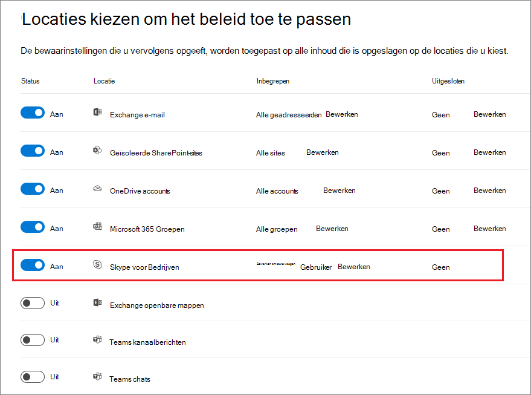
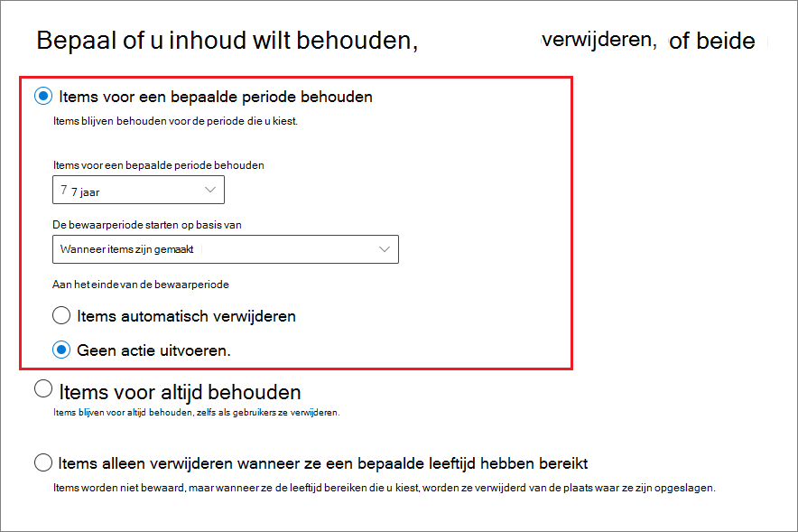

# Bewaarbeleid maken en configureren

>*[Richtlijnen voor Microsoft 365-licenties voor beveiliging en compliance](/office365/servicedescriptions/microsoft-365-service-descriptions/microsoft-365-tenantlevel-services-licensing-guidance/microsoft-365-security-compliance-licensing-guidance).*

Gebruik bewaarbeleid om de gegevens van uw organisatie te beheren door proactief te beslissen of inhoud moet worden bewaard, verwijderd of eerst bewaard en vervolgens verwijderd.

Met bewaarbeleid kunt u dit bijzonder efficiënt doen door dezelfde bewaarinstellingen toe te wijzen op containerniveau die automatisch worden overgenomen door inhoud in die container. Bijvoorbeeld alle items in SharePoint-sites, alle e-mailberichten in de Exchange-postvakken van gebruikers, alle kanaalberichten voor teams die worden gebruikt met Microsoft Teams. Zie [Bewaarbeleid en bewaarlabels](retention.md#retention-policies-and-retention-labels) als u niet zeker weet of u bewaarbeleid wilt gebruiken op containerniveau of een bewaarlabel op itemniveau.

Zie [Meer informatie over bewaarbeleid en bewaarlabels](retention.md) voor meer informatie over bewaarbeleid en de manier waarop bewaren werkt in Microsoft 365.

> [!NOTE]
> De informatie op deze pagina is bedoeld voor nalevingsbeheerders. Als u geen administrator bent en wilt begrijpen hoe bewaarbeleid is geconfigureerd voor de apps die u gebruikt, neemt u contact op met uw helpdesk, IT-afdeling of administrator. Als u berichten over bewaarbeleid ziet in Teams-chats en kanaalberichten, kan het handig zijn [Teams-berichten over bewaarbeleid](https://support.microsoft.com/office/teams-messages-about-retention-policies-c151fa2f-1558-4cf9-8e51-854e925b483b) te lezen.

## Voordat u begint

De globale beheerder voor uw organisatie heeft volledige machtigingen om bewaarbeleid te maken en te bewerken. Zie [Vereiste machtigingen om bewaarbeleid en bewaarlabels te maken en te beheren](get-started-with-retention.md#permissions-required-to-create-and-manage-retention-policies-and-retention-labels) als u niet bent aangemeld als globale beheerder.

## Bewaarbeleid maken en configureren

Hoewel bewaarbeleid meerdere services kan ondersteunen die in bewaarbeleid worden aangeduid als 'locaties', kunt u geen enkelvoudig bewaarbeleid maken dat alle ondersteunde locaties omvat:

- Exchange-e-mail
- SharePoint-site
- OneDrive-accounts
- Microsoft 365-groepen
- Skype voor Bedrijven
- Openbare Exchange-mappen
- Teams-kanaalberichten
- Teams-chats
- Berichten in de Yammer-community
- Berichten Yammer-gebruikers

Wanneer u de Teams- of Yammer-locaties selecteert bij het maken van bewaarbeleid, worden de andere locaties automatisch uitgesloten. Dit betekent dat de instructies die u moet volgen, afhankelijk zijn van of u de Teams- of Yammer-locaties moet opnemen:

- [Instructies voor bewaarbeleid voor Teams-locaties](#retention-policy-for-teams-locations)
- [Instructies voor bewaarbeleid voor Yammer-locaties](#retention-policy-for-yammer-locations)
- [Instructies voor bewaarbeleid voor locaties anders dan Teams en Yammer](#retention-policy-for-locations-other-than-teams-and-yammer)

Zie [De principes van bewaren of wat heeft prioriteit?](retention.md#the-principles-of-retention-or-what-takes-precedence) als u meer dan één bewaarbeleidsregel hebt en ook bewaarlabels gebruikt, voor meer informatie over het resultaat van meerdere bewaarinstellingen die worden toegepast op dezelfde inhoud.

### Bewaarbeleid voor Teams-locaties

1. Selecteer in het [Microsoft 365-compliancecentrum](https://compliance.microsoft.com/), **Beleid** > **Bewaarbeleid**.

2. Selecteer **Nieuw bewaarbeleid** om de wizard Bewaarbeleid maken te starten en geef uw nieuwe bewaarbeleid een naam.

3. Voor de pagina **Locaties kiezen om het beleid op toe te passen** selecteert u een of beide locaties voor Teams: **Teams-kanaalberichten** en **Teams-chats**.

   Bij **Teams-kanaalberichten** zijn berichten van standaardkanalen opgenomen, maar niet van [privékanalen](/microsoftteams/private-channels). Momenteel worden privékanalen niet ondersteund door bewaarbeleid.

   Standaard [worden alle teams en alle gebruikers geselecteerd](#a-policy-that-applies-to-entire-locations), maar u kunt dit verfijnen door de opties [ **Kiezen** en **Uitsluiten** te selecteren](#a-policy-with-specific-inclusions-or-exclusions). Voordat u de standaard wijzigt, moet u echter rekening houden met de volgende gevolgen voor een bewaarbeleid waarin berichten worden verwijderd wanneer deze zijn geconfigureerd voor omvat of uitgesloten:
    
    - Voor groepschats, omdat een kopie van berichten wordt opgeslagen in het postvak van elke gebruiker die in de chat is opgenomen, blijven kopieën van berichten worden geretourneerd in eDiscovery-resultaten van gebruikers aan wie het beleid niet is toegewezen.
    - Voor gebruikers aan wie het beleid niet is toegewezen, worden verwijderde berichten geretourneerd in de zoekresultaten van Teams, maar wordt de inhoud van het bericht niet weergegeven als gevolg van de permanente verwijdering van het beleid dat is toegewezen aan gebruikers.

4. Voor de pagina **Beslissen of uw inhoud wilt bewaren, verwijderen of beide** van de wizard, specificeert u de configuratieopties voor het bewaren en verwijderen van inhoud.

   U kunt bewaarbeleid maken dat alleen inhoud bewaart zonder te verwijderen, bewaart en vervolgens na een opgegeven periode verwijdert of alleen verwijdert na een opgegeven periode. Zie [Instellingen voor bewaren en verwijderen van inhoud](#settings-for-retaining-and-deleting-content) op deze pagina voor meer informatie.

5. Voltooi de wizard om uw instellingen op te slaan.

Zie [Bewaarbeleid voor Microsoft Teams beheren](/microsoftteams/retention-policies) in de documentatie van Teams voor informatie over het gebruik van bewaarbeleid voor Teams en de eindgebruikerservaring.

Zie [Meer informatie over bewaren voor Microsoft Teams](retention-policies-teams.md)voor technische informatie over hoe bewaren werkt voor Teams, inclusief welke elementen van berichten worden ondersteund voor bewaren en timinginformatie met stapsgewijze voorbeelden.

#### Bekende configuratieproblemen

- Hoewel u de optie kunt selecteren om de bewaarperiode te starten wanneer items voor het laatst zijn gewijzigd, wordt altijd de waarde van **Wanneer items zijn gemaakt** gebruikt. Voor berichten die zijn bewerkt wordt een kopie van het oorspronkelijke bericht opgeslagen met het oorspronkelijke tijdstempel om vast te stellen wanneer dit bericht is gemaakt vóór de bewerking en het bericht na de bewerking krijgt een nieuwer tijdstempel.

- Wanneer u **Teams kiezen** selecteert voor de locatie **Teams-kanaalberichten** ziet u mogelijk Microsoft 365-groepen die geen teams zijn. Selecteer deze groepen niet.

- Wanneer u de locatie **Gebruikers kiezen voor de Teams-chats** ziet u mogelijk gasten en niet-postvakgebruikers. Bewaarbeleid is niet ontworpen voor deze gebruikers, selecteer ze daarom ook niet.

#### Aanvullend bewaarbeleid dat nodig is om Teams te ondersteunen

Teams is meer dan alleen chats en kanaalberichten. Wanneer u teams heb die zijn gemaakt vanuit een Microsoft 365-groep (voorheen Office 365-groep) moet u aanvullend bewaarbeleid configureren dat die Microsoft 365-groep omvat door de locatie **Microsoft 365 Groepen** te gebruiken. Dit bewaarbeleid is ook van toepassing op inhoud in het postvak, de site en de bestanden van de groep.

Wanneer u teamsites hebt die niet zijn verbonden aan een Microsoft 365-groep, hebt u bewaarbeleid nodig dat de locaties **SharePoint-sites** of **OneDrive-accounts** omvat om bestanden in Teams te bewaren en te verwijderen:

- Een bestand dat is gedeeld in een chat wordt opgeslagen in de OneDrive-account van de gebruiker die het bestand heeft gedeeld.

- Bestanden die zijn geüpload naar kanalen worden opgeslagen in de SharePoint-site voor het team.

> [!TIP]
> U kunt bewaarbeleid toepassen op de bestanden van een specifiek team dat niet is verbonden met een Microsoft 365-groep door de SharePoint-site voor het team te selecteren en de OneDrive-accounts van gebruikers in het team.

Het is mogelijk dat bewaarbeleid dat wordt toegepast op Microsoft 365-groepen, SharePoint-sites of OneDrive-accounts een bestand verwijdert waarnaar wordt verwezen in een Teams-chat of kanaalbericht voordat die berichten zijn verwijderd. In dit scenario wordt het bestand nog steeds weergegeven in het Teams-bericht, maar wanneer een gebruiker het bestand selecteert, wordt de fout 'Bestand niet gevonden' weergegeven. Dit gedrag is niet specifiek voor bewaarbeleid en kan ook voorkomen als een gebruiker handmatig een bestand verwijdert uit SharePoint of OneDrive.

### Bewaarbeleid voor Yammer-locaties

> [!NOTE]
> Bewaarbeleid voor Yammer is in preview.
>
> Om deze functie te gebruiken, moet uw Yammer-netwerk zijn ingesteld op de modus [Native](/yammer/configure-your-yammer-network/overview-native-mode) en niet de modus Hybride.

1. Selecteer in het [Microsoft 365-compliancecentrum](https://compliance.microsoft.com/), **Beleid** > **Bewaarbeleid**.

2. Selecteer **Nieuw bewaarbeleid** om nieuw bewaarbeleid te maken.

3. Voor de pagina **Beslissen of uw inhoud wilt bewaren, verwijderen of beide** van de wizard, specificeert u de configuratieopties voor het bewaren en verwijderen van inhoud. 
    
    U kunt bewaarbeleid maken dat alleen inhoud bewaart zonder te verwijderen, bewaart en vervolgens na een opgegeven periode verwijdert of alleen verwijdert na een opgegeven periode. Zie [Instellingen voor bewaren en verwijderen van inhoud](#settings-for-retaining-and-deleting-content) op deze pagina voor meer informatie.

4. Selecteer voor de pagina **Locaties kiezen**, **Ik wil specifieke locaties kiezen**. Schakel vervolgens een of beide locaties voor Yammer in: **Berichten in de Yammer-community** en **Gebruikersberichten in Yammer**.
    
    Standaard worden alle community's en gebruikers geselecteerd, maar u kunt dit verfijnen door specifieke community's en gebruikers op te geven die moeten worden opgenomen of uitgesloten.
    
    Voor gebruikersberichten in Yammer: 
    - Als u de standaard op **Alle** laat staan, worden Azure B2B-gasten niet opgenomen. 
    - Als u **Gebruiker selecteren** selecteert, kunt u bewaarbeleid toepassen op externe gebruikers als u hun account kent.

5. Voltooi de wizard om uw instellingen op te slaan.

Zie [Meer informatie over bewaarbeleid voor Yammer](retention-policies-yammer.md) voor meer informatie over hoe bewaarbeleid werkt voor Yammer.

#### Aanvullend bewaarbeleid nodig om Yammer te ondersteunen

Yammer bestaat uit meer dan alleen communityberichten en privéberichten. Om e-mailberichten voor uw Yammer-netwerk te bewaren en te verwijderen, configureert u aanvullend bewaarbeleid dat Microsoft 365-groepen omvat die worden gebruikt voor Yammer door de locatie **Microsoft 365 Groepen** te gebruiken. 

Om bestanden die in Yammer zijn opgeslagen te bewaren en te verwijderen, hebt u bewaarbeleid nodig dat de locaties **SharePoint-sites** of **OneDrive-accounts** omvat:

- Bestanden die worden gedeeld in privéberichten worden opgeslagen in de OneDrive-account van de gebruiker die het bestand heeft gedeeld. 

- Bestanden die zijn geüpload naar community's worden opgeslagen in de SharePoint-site voor de Yammer-community.

Het is mogelijk dat bewaarbeleid dat wordt toegepast op SharePoint-sites of OneDrive-accounts een bestand verwijdert waarnaar wordt verwezen in een Yammer-bericht voordat die berichten zijn verwijderd. In dit scenario wordt het bestand nog steeds weergegeven in het Yammer-bericht, maar wanneer een gebruiker het bestand selecteert, wordt de fout 'Bestand niet gevonden' weergegeven. Dit gedrag is niet specifiek voor bewaarbeleid en kan ook voorkomen als een gebruiker handmatig een bestand verwijdert uit SharePoint of OneDrive.

### Bewaarbeleid voor locaties anders dan Teams en Yammer

Gebruik de volgende instructies voor bewaarbeleid dat van toepassing is op een van de volgende services:

- Exchange: e-mail en openbare mappen
- SharePoint: sites
- OneDrive: accounts
- Microsoft 365-groepen
- Skype voor Bedrijven

1. Selecteer in het [Microsoft 365-compliancecentrum](https://compliance.microsoft.com/), **Beleid** > **Bewaarbeleid**.

2. Selecteer **Nieuw bewaarbeleid** om de wizard Bewaarbeleid maken te starten en geef uw nieuwe bewaarbeleid een naam.

3. Schakel voor de pagina **Locaties kiezen** de locaties in of uit, behalve de locaties voor Teams. U kunt voor elke locatie de standaard [beleid toepassen op de volledige locatie](#a-policy-that-applies-to-entire-locations) laten staan of [opnames en uitsluitingen opgeven](#a-policy-with-specific-inclusions-or-exclusions).

    Informatie specifiek voor locaties:
    - [Exchange-e-mail en openbare Exchange-mappen](#configuration-information-for-exchange-email-and-exchange-public-folders)
    - [SharePoint-sites en OneDrive-accounts](#configuration-information-for-sharepoint-sites-and-onedrive-accounts)
    - [Microsoft 365-groepen](#configuration-information-for-microsoft-365-groups)
    - [Skype voor Bedrijven](#configuration-information-for-skype-for-business)

4. Voor de pagina **Beslissen of uw inhoud wilt bewaren, verwijderen of beide** van de wizard, specificeert u de configuratieopties voor het bewaren en verwijderen van inhoud.

    U kunt bewaarbeleid maken dat alleen inhoud bewaart zonder te verwijderen, bewaart en vervolgens na een opgegeven periode verwijdert of alleen verwijdert na een opgegeven periode. Zie [Instellingen voor bewaren en verwijderen van inhoud](#settings-for-retaining-and-deleting-content) op deze pagina voor meer informatie.

5. Voltooi de wizard om uw instellingen op te slaan.

#### Configuratiegegevens voor Exchange-e-mail en openbare Exchange-mappen

De locatie **Exchange-e-mail** ondersteunt bewaarbeleid voor e-mail, agenda's en andere postvakitems voor gebruikers door bewaarinstellingen toe te passen op het niveau van een postvak.

Zie [Wat is opgenomen voor bewaren en verwijderen?](retention-policies-exchange.md#whats-included-for-retention-and-deletion) voor meer informatie over welke items zijn opgenomen en uitgesloten wanneer u bewaarinstellingen configureert voor Exchange.

Let op, ook al heeft een Microsoft 365-groep een Exchange-postvak, bewaarbeleid dat de volledige **Exchange-e-mail** locatie omvat, omvat geen inhoud in Microsoft 365-groepspostvakken. Om inhoud in deze postvakken te bewaren, selecteert u de locatie **Microsoft 365 Groepen**.

De locatie **Openbare Exchange-mappen** past bewaarinstellingen toe op alle openbare mappen en kan niet worden toegepast op de het map- of postvakniveau.

#### Configuratiegegevens voor SharePoint-sites en OneDrive-accounts

Wanneer u de locatie **SharePoint-sites** kiest, kan het bewaarbeleid documenten bewaren en verwijderen op SharePoint-communicatiesites, teamsites die niet zijn verbonden door Microsoft 365-groepen en klassieke sites. Teamsites die zijn verbonden door Microsoft 365-groepen worden niet ondersteund door deze optie. Gebruik in plaats daarvan de locatie **Microsoft 365 Groepen** die van toepassing is op de inhoud van het postvak, de site en de bestanden van de groep.

Hoewel het bewaarbeleid wordt toegepast op het siteniveau, worden bewaarinstellingen alleen toegepast op documenten. Zie [Wat is opgenomen voor bewaren en verwijderen?](retention-policies-sharepoint.md#whats-included-for-retention-and-deletion) voor meer informatie over welke items zijn opgenomen en uitgesloten wanneer u bewaarinstellingen configureert voor SharePoint en OneDrive. 

Wanneer u locaties voor SharePoint-sites of OneDrive-accounts opgeeft, hebt u geen machtigingen nodig om de sites te openen en wordt er geen validatie uitgevoerd wanneer u de URL specificeert op de pagina **Locaties bewerken**. Op het eind van de wizard, wordt echter wel gecontroleerd of de SharePoint-sites bestaan die u opgeeft. Als deze controle mislukt, ziet u een bericht dat de validatie is mislukt voor de URL die u hebt opgegeven en maakt de wizard geen bewaarbeleid totdat de validatie is geslaagd. Als u dit bericht ziet, gaat u terug in de wizard om de URL te wijzigen of de site te verwijderen uit het bewaarbeleid.

Om afzonderlijke OneDrive-accounts op te geven die moeten worden opgenomen of uitgesloten, moet de URL de volgende indeling hebben: `https://<tenant name>-my.sharepoint.com/personal/<user_name>_<tenant name>_com`

Bijvoorbeeld voor een gebruiker in de contoso-tenant met de gebruikersnaam 'rismone': `https://contoso-my.sharepoint.com/personal/rsimone_contoso_onmicrosoft_com`

Zie [Een lijst met alle OneDrive-URL's van gebruikers in uw organisatie ophalen](/onedrive/list-onedrive-urls) om de syntaxis voor uw tenant te verifiëren en URL's voor gebruikers te identificeren.

### Configuratiegegevens voor Microsoft 365 Groepen

Gebruik de locatie **Microsoft 365 Groepen** als u inhoud van een Microsoft 365-groep (voorheen Office 365-groep) wilt bewaren of verwijderen. Ook al heeft een Microsoft 365-groep een Exchange-postvak, bewaarbeleid dat de volledige **Exchange-e-mail** locatie omvat, omvat geen inhoud in Microsoft 365-groepspostvakken. Hoewel u met de locatie **Exchange-e-mail** in eerste instantie een groepspostvak kunt opgeven dat moet worden opgenomen of uitgesloten, krijgt u bij het opslaan de foutmelding dat 'RemoteGroupMailbox' geen geldige selectie is voor de locatie Exchange.

Standaard omvat bewaarbeleid dat wordt toegepast op een Microsoft 365-groep het postvak van de groep en de SharePoint-teamsite van de groep. Bestanden die zijn opgeslagen in de SharePoint-teamsite vallen onder deze locatie, maar Teams-chats of Teams-kanaalberichten hebben hun eigen bewaarbeleidslocaties.

Om de standaardinstelling te wijzigen, omdat u het bewaarbeleid wilt toepassen op alleen de Microsoft 365-postvakken of alleen de verbonden SharePoint-teamsites, gebruikt u de cmdlet [Set-RetentionCompliancePolicy](/powershell/module/exchange/set-retentioncompliancepolicy) met de parameter *Toepassingen* met een van de volgende waarden:

- `Group:Exchange`voor alleen Microsoft 365-postvakken die zijn verbonden met de groep.
- `Group:SharePoint` voor alleen SharePoint-sites die zijn verbonden met de groep.

Specificeer `Group:Exchange,SharePoint` als u terug wilt keren naar de standaardwaarde van zowel het postvak als de SharePoint-site voor de geselecteerde Microsoft 365-groepen.

### Configuratiegegevens voor Skype voor Bedrijven 

Anders dan andere locaties kan je de status van Skype-locaties niet inschakelen om automatisch alle gebruikers op te nemen. In plaats daarvan, als je de locatie wilt inschakelen, moet je de optie **Bewerken** selecteren om de gebruikers waarvan je de gesprekken wilt bewaren manueel te kiezen:

Als je de optie **Bewerken** selecteert in het deelvenster **Skype voor Bedrijven**, kan je snel alle gebruikers opnemen door het verborgen selectievakje te selecteren voor de kolom **Naam**. Het is echter belangrijk om te weten dat elke gebruiker telt als een specifieke opname in het beleid. Dus, als je 1.000 gebruikers opneemt door dit selectievakje te selecteren, is dat hetzelfde als wanneer je handmatig 1.000 gebruikers selecteert. Dit is het maximale aantal dat wordt ondersteund door Skype voor Bedrijven.

Let op dat **Gespreksgeschiedenis**, een map in Outlook, een functie is die niets te doen heeft met Skype-archivering. **Gespreksgeschiedenis** kan worden uitgeschakeld door de eindgebruiker, maar in Skype wordt gearchiveerd door een kopie van Skype-gesprekken op te slaan in een verborgen map die niet toegankelijk is voor de gebruiker, maar wel beschikbaar voor eDiscovery.

## Instellingen voor bewaren en verwijderen van inhoud

Door in uw bewaarbeleid de instellingen te kiezen voor het bewaren en verwijderen van inhoud, heeft uw bewaarbeleid een van de volgende configuraties voor een bepaalde periode:

- Alleen bewaren

    Voor deze configuratie kiest u **Items voor een specifieke periode bewaren** en **Aan het eind van de bewaarperiode: doe niets**. Of selecteer **Items permanent bewaren**.

- Gegevens behouden en verwijderen

    Voor deze configuratie kiest u **Items voor een specifieke periode bewaren** en **Aan het eind van de bewaarperiode: items automatisch verwijderen**.

- Alleen verwijderen

    Voor deze configuratie kiest u **Items alleen verwijderen wanneer ze een bepaalde leeftijd bereiken**.

### Inhoud bewaren voor een specifieke periode

Wanneer u bewaarbeleid configureert, kiest u ervoor items te bewaren voor een specifiek aantal dagen, maanden of jaren. U kunt de items ook voor altijd bewaren.

Wanneer u bewaarbeleid configureert, kunt u ervoor kiezen inhoud voor onbepaalde tijd te bewaren of voor een specifiek aantal dagen, maanden of jaren. De bewaarperiode wordt berekend op basis van de leeftijd van de inhoud, niet vanaf wanneer het bewaarbeleid wordt toegepast.

Voor het begin van de bewaarperiode kunt u ook kiezen voor wanneer de inhoud is gemaakt of, alleen ondersteund voor bestanden en SharePoint-, OneDrive- en Microsoft 365-groepen, wanneer de inhoud voor het laatst is gewijzigd.

Voorbeelden:

- SharePoint: als u items in een siteverzameling 7 jaar wilt bewaren nadat de inhoud voor het laatst werd gewijzigd en een document in die siteverzameling is in zes jaar niet gewijzigd, wordt het document nog maar één jaar bewaard als het niet wordt gewijzigd. Als het document wordt bewerkt, wordt de leeftijd van het document berekend vanaf de nieuwe laatste wijzigingsdatum en wordt het nog eens 7 jaar bewaard.

- Exchange: als u items in een postvak 7 jaar wilt bewaren en een bericht is zes jaar geleden verzonden, wordt het bericht nog maar één jaar bewaard. Voor Exchange-items wordt de leeftijd gebaseerd op de datum van ontvangst voor inkomende e-mail en datum van verzending voor uitgaande e-mail. Het bewaren van items op basis van wanneer die het laatst zijn gewijzigd, geldt alleen voor site-inhoud in OneDrive en SharePoint.

Aan het einde van de bewaarperiode kiest u of u de inhoud permanent wilt verwijderen:

### Inhoud verwijderen die ouder is dan een specifieke leeftijd

Met bewaarbeleid kunt u zowel items bewaren en dan verwijderen als oude items verwijderen zonder ze te bewaren.

In beide gevallen is het belangrijk om te weten, dat wanneer uw bewaarbeleid de items verwijdert, de tijdperiode die is opgegeven voor bewaarbeleid wordt berekend vanaf de tijd waarop het item is gemaakt of gewijzigd en niet de tijd sinds het beleid is toegewezen.

Denk, voordat u voor de eerste keer bewaarbeleid toewijst en specifiek wanneer dat beleid items verwijdert, eerst aan de leeftijd van bestaande inhoud en wat voor gevolgen dat beleid heeft voor die inhoud. U kunt het nieuwe beleid ook aan gebruikers communiceren voordat u het toewijst, zodat ze de tijd hebben om te beoordelen wat de mogelijke gevolgen zijn.

### Beleid dat van toepassing is op volledige locaties

Wanneer u locaties kiest, is de standaardinstelling, met uitzondering van Skype voor Bedrijven, **Alle** wanneer de status van de locatie **Aan** is.

Wanneer bewaarbeleid van toepassing is op een combinatie van volledige locaties is er geen limiet aan het aantal ontvangers, sites, accounts, groepen, enz., dat in het beleid kan worden opgenomen.

Als beleid bijvoorbeeld alle Exchange-e-mail en alle SharePoint-sites omvat, worden alle sites en ontvangers opgenomen, ongeacht het aantal. En voor Exchange geldt, dat elk nieuw postvak, dat wordt gemaakt nadat het beleid is toegepast, automatisch het beleid overneemt.

### Beleid met specifieke opnames of uitsluitingen

Denk eraan dat als u de optionele configuratie gebruikt om uw bewaarinstellingen te beperken tot specifieke gebruikers, specifieke Microsoft 365-groepen, of specifieke sites, u rekening moet houden met bepaalde limieten per beleidsregel. Zie [Limieten voor bewaarbeleid en bewaarlabelbeleid](retention-limits.md) voor meer informatie. 

Wanneer u de optionele configuratie wilt gebruiken om het bereik van uw bewaarinstellingen te bepalen, zorg er dan voor dat de **Status** van die locaties **Aan** is en gebruik de koppelingen om specifieke gebruikers, Microsoft 365-groepen of sites op te nemen of uit te sluiten.

> [!WARNING]
> Als u opnemen configureert en vervolgens de laatste verwijdert, wordt de configuratie opnieuw ingesteld op **Alle** voor die locatie.  Zorg ervoor dat dit de configuratie is die u wilt hebben voordat u het beleid opslaat.
>
> Als u bijvoorbeeld één SharePoint-site specificeert die moet worden opgenomen in uw bewaarbeleid dat is ingesteld op het verwijderen van gegevens en vervolgens verwijdert u die ene site, is het bewaarbeleid dat gegevens permanent verwijdert standaard van toepassing op alle SharePoint-sites. Hetzelfde geldt voor opnemingen voor Exchange-ontvangers, OneDrive-accounts, Teams-chatgebruikers, enzovoort.
>
> Schakel in dit scenario de locatie uit als u niet wilt dat het bewaarbeleid wordt toegepast op de instelling **Alle** van de locatie. U kunt ook specifieke uitsluitingen van het bewaarbeleid opgeven.

## Bewaarbeleid bijwerken

Sommige instellingen kunnen niet worden gewijzigd nadat bewaarbeleid is gemaakt en opgeslagen, waaronder:
- De naam van het bewaarbeleid en de bewaarinstellingen, behalve de bewaarperiode en wanneer de bewaarperiode ingaat.

Wanneer u bewaarbeleid bewerkt en de originele instellingen van uw bewaarbeleid zijn al toegepast op items, worden uw bijgewerkte instellingen automatisch toegepast op deze items en op items die nieuw worden geïdentificeerd.

Normaal gesproken is deze update redelijk snel, maar het kan meerdere dagen duren. Wanneer de beleidsreplicatie in uw Microsoft 365-locaties is voltooid, ziet u de status van het bewaarbeleid in het Microsoft 365-compliancecentrum veranderen van **Aan (in behandeling)** in **Aan (voltooid)**.

## Het beleid vergrendelen om wijzigingen te voorkomen

Zie [Behoudvergrendeling gebruiken om wijzigingen in bewaarbeleid en bewaarlabelbeleid te beperken](retention-preservation-lock.md) als u ervoor wilt zorgen dat niemand het beleid kan uitschakelen, verwijderen of verruimen.
