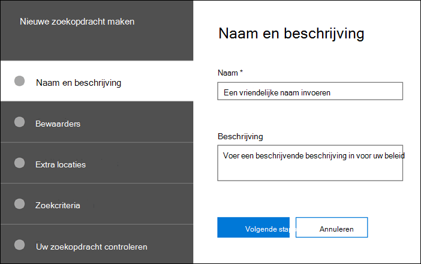

# Een zoekactie makenCreate a search

Op **het tabblad Zoekopdrachten** in uw zaak kunt u een nieuwe zoekopdracht maken door op Nieuwe **zoekopdracht** te klikken en de wizard te volgen.On the **Searches** tab in your case, you can create a new search by clicking **New search** and following the wizard.

## Geef de zoekopdracht een naam en geef deze een beschrijvingName the search and give it a description

Elke zoekopdracht met een zaak moet een unieke naam hebben.Each search with a case should have a unique name. U kunt desgewenst een beschrijving geven voor uw zoekopdracht.You can optionally provide a description for your search. 

## Kies de bewaarders en bewaarlocaties om te zoekenChoose the custodians and custodial locations to search

Kies bewaarlocaties voor inhoud om te zoeken door op te geven dat bewaarders u aan de zaak hebt toegevoegd.Choose custodian content locations to search by specifying that custodians you have added to the case. Door een bewaarder te selecteren, wordt de zoekopdracht uitgevoerd op basis van alle gegevensbronnen die aan de bewaarder zijn toebezorgd.By selecting a custodian, you will run the search against all data sources mapped to the custodian. U hebt ook de optie om de zoekopdracht te beperken tot geselecteerde gegevensbronnen voor elke bewaarder.You also have the option to narrow the search to selected data sources for each custodian. Zie Werken met beheerders voor meer informatie over het toevoegen van beheerders en het beheren van hun [gegevensbronnen.](managing-custodians.md)For more information about how to add custodians and manage their data sources, see [Work with custodians](managing-custodians.md).

## Niet-bewaarderlocaties kiezenChoose non-custodial locations

In sommige gevallen wilt u mogelijk zoeken naar gegevensbronnen die niet zijn gekoppeld aan een bewaarder.In some cases, you may want to search data sources that are not associated with a custodian. In dit geval kunt u de locaties opgeven die u wilt zoeken of ervoor kiezen om alle inhoudslocaties te doorzoeken op een specifieke Microsoft-service (zoals het doorzoeken van alle Exchange-postvakken of alle SharePoint-sites en OneDrive-accounts).In this case, you can specify the locations you want to search, or choose to search all content locations for a specific Microsoft service (such as searching all Exchange mailboxes or all SharePoint sites and OneDrive accounts).

## De zoekquery en -voorwaarden definiërenDefine the search query and conditions

U kunt de trefwoordenquery en eventuele voorwaarden voor de zoekopdracht definiëren met behulp van de vooraf gebouwde voorwaardenkaarten of met KQL (Keyword Query Language).You can define the keywords query and any conditions for the search by using the pre-built condition cards or using Keyword Query Language (KQL). Zie Zoekquery's maken voor meer [informatie.](building-search-queries.md)For more information, see [Build search queries](building-search-queries.md).
