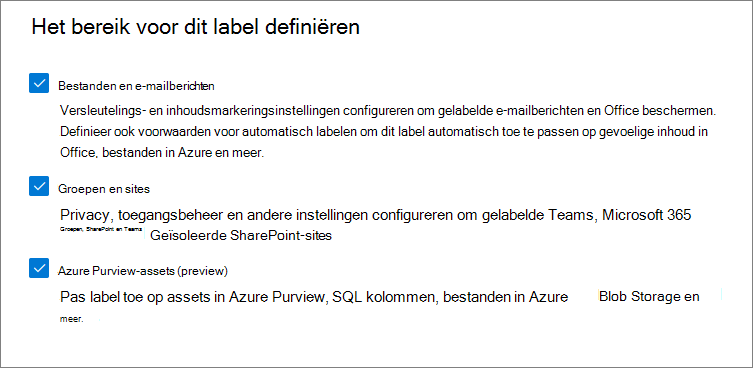

# <a name="create-and-configure-sensitivity-labels-and-their-policies"></a><span data-ttu-id="0207f-103">Gevoeligheidslabels en hun beleid maken en configureren</span><span class="sxs-lookup"><span data-stu-id="0207f-103">Create and configure sensitivity labels and their policies</span></span>

><span data-ttu-id="0207f-104">*[Richtlijnen voor Microsoft 365-licenties voor beveiliging en compliance](/office365/servicedescriptions/microsoft-365-service-descriptions/microsoft-365-tenantlevel-services-licensing-guidance/microsoft-365-security-compliance-licensing-guidance).*</span><span class="sxs-lookup"><span data-stu-id="0207f-104">*[Microsoft 365 licensing guidance for security & compliance](/office365/servicedescriptions/microsoft-365-service-descriptions/microsoft-365-tenantlevel-services-licensing-guidance/microsoft-365-security-compliance-licensing-guidance).*</span></span>

<span data-ttu-id="0207f-105">Alle Microsoft Information Protection-oplossingen (soms afgekort tot MIP) worden geïmplementeerd met behulp van [gevoeligheidslabels](sensitivity-labels.md).</span><span class="sxs-lookup"><span data-stu-id="0207f-105">All Microsoft Information Protection solutions (sometimes abbreviated to MIP) are implemented by using [sensitivity labels](sensitivity-labels.md).</span></span> <span data-ttu-id="0207f-106">Ga naar het [compliancecentrum van Microsoft 365](https://compliance.microsoft.com/) om deze labels te maken en publiceren.</span><span class="sxs-lookup"><span data-stu-id="0207f-106">To create and publish these labels, go to the [Microsoft 365 compliance center](https://compliance.microsoft.com/).</span></span> <span data-ttu-id="0207f-107">U kunt ook de oudere portal, het Office 365-beveiligings- en compliancecentrum, gebruiken.</span><span class="sxs-lookup"><span data-stu-id="0207f-107">You can also use the older portal, Office 365 Security & Compliance Center.</span></span>

<span data-ttu-id="0207f-108">Maak en configureer eerst de gevoeligheidslabels die u beschikbaar wilt maken voor apps en andere services.</span><span class="sxs-lookup"><span data-stu-id="0207f-108">First, create and configure the sensitivity labels that you want to make available for apps and other services.</span></span> <span data-ttu-id="0207f-109">Dit zijn bijvoorbeeld de labels die gebruikers moeten zien en toepassen vanuit Office-apps.</span><span class="sxs-lookup"><span data-stu-id="0207f-109">For example, the labels you want users to see and apply from Office apps.</span></span> 

<span data-ttu-id="0207f-110">Maak vervolgens een of meer labelbeleidsregels met de labels en beleidsinstellingen die u configureert.</span><span class="sxs-lookup"><span data-stu-id="0207f-110">Then, create one or more label policies that contain the labels and policy settings that you configure.</span></span> <span data-ttu-id="0207f-111">Het labelbeleid publiceert de labels en instellingen voor de gekozen gebruikers en locaties.</span><span class="sxs-lookup"><span data-stu-id="0207f-111">It's the label policy that publishes the labels and settings for your chosen users and locations.</span></span>

## <a name="before-you-begin"></a><span data-ttu-id="0207f-112">Voordat u begint</span><span class="sxs-lookup"><span data-stu-id="0207f-112">Before you begin</span></span>

<span data-ttu-id="0207f-113">De globale beheerder voor uw organisatie heeft volledige machtigingen om alle aspecten van gevoeligheidslabels te maken en beheren.</span><span class="sxs-lookup"><span data-stu-id="0207f-113">The global admin for your organization has full permissions to create and manage all aspects of sensitivity labels.</span></span> <span data-ttu-id="0207f-114">Zie [Vereiste machtigingen om gevoeligheidslabels te maken en beheren](get-started-with-sensitivity-labels.md#permissions-required-to-create-and-manage-sensitivity-labels) als u niet bent aangemeld als globale beheerder.</span><span class="sxs-lookup"><span data-stu-id="0207f-114">If you aren't signing in as a global admin, see [Permissions required to create and manage sensitivity labels](get-started-with-sensitivity-labels.md#permissions-required-to-create-and-manage-sensitivity-labels).</span></span>

## <a name="create-and-configure-sensitivity-labels"></a><span data-ttu-id="0207f-115">Gevoeligheidslabels maken en configureren</span><span class="sxs-lookup"><span data-stu-id="0207f-115">Create and configure sensitivity labels</span></span>

1. <span data-ttu-id="0207f-116">Ga in uw beheercentrum voor labels naar gevoeligheidslabels:</span><span class="sxs-lookup"><span data-stu-id="0207f-116">In your labeling admin center, navigate to sensitivity labels:</span></span>
    
    - <span data-ttu-id="0207f-117">Microsoft 365-compliancecentrum:</span><span class="sxs-lookup"><span data-stu-id="0207f-117">Microsoft 365 compliance center:</span></span> 
        - <span data-ttu-id="0207f-118">**Oplossingen** > **Informatiebescherming**</span><span class="sxs-lookup"><span data-stu-id="0207f-118">**Solutions** > **Information protection**</span></span>
        
        <span data-ttu-id="0207f-119">Selecteer eerst **Alles weergeven** als u deze optie niet meteen ziet.</span><span class="sxs-lookup"><span data-stu-id="0207f-119">If you don't immediately see this option, first select **Show all**.</span></span> 
    
    - <span data-ttu-id="0207f-120">Beveiligings- en compliancecentrum:</span><span class="sxs-lookup"><span data-stu-id="0207f-120">Security & Compliance Center:</span></span>
        - <span data-ttu-id="0207f-121">**Classificatie** > **Gevoeligheidslabels**</span><span class="sxs-lookup"><span data-stu-id="0207f-121">**Classification** > **Sensitivity labels**</span></span>

2. <span data-ttu-id="0207f-122">Selecteer op de pagina **Labels** de optie **+ Een label maken** om de wizard Nieuw gevoeligheidslabel te starten.</span><span class="sxs-lookup"><span data-stu-id="0207f-122">On the **Labels** page, select **+ Create a label** to start the New sensitivity label wizard.</span></span> 
    
    <span data-ttu-id="0207f-123">Bijvoorbeeld in het Microsoft 365-compliancecentrum:</span><span class="sxs-lookup"><span data-stu-id="0207f-123">For example, from the Microsoft 365 compliance center:</span></span>
    
    
    
    > [!NOTE]
    > <span data-ttu-id="0207f-125">Tenants hebben standaard geen labels; u moet deze maken.</span><span class="sxs-lookup"><span data-stu-id="0207f-125">By default, tenants don't have any labels and you must create them.</span></span> <span data-ttu-id="0207f-126">De labels in de voorbeeldafbeelding bevatten standaardlabels die [zijn gemigreerd vanuit Azure Information Protection](/azure/information-protection/configure-policy-migrate-labels).</span><span class="sxs-lookup"><span data-stu-id="0207f-126">The labels in the example picture show default labels that were [migrated from Azure Information Protection](/azure/information-protection/configure-policy-migrate-labels).</span></span>

3. <span data-ttu-id="0207f-127">De opties die op de pagina **Het bereik voor dit label definiëren** zijn geselecteerd, bepalen de het bereik van het label voor de instellingen die u kunt configureren en waar deze zichtbaar zijn wanneer ze worden gepubliceerd:</span><span class="sxs-lookup"><span data-stu-id="0207f-127">On the **Define the scope for this label** page, the options selected determine the label's scope for the settings that you can configure and where they will be visible when they are published:</span></span>
    
    
    
    - <span data-ttu-id="0207f-129">Als **Bestanden en e-mailberichten** is geselecteerd, kunt u in deze wizard instellingen configureren die van toepassing zijn op apps die gevoeligheidslabels ondersteunen, zoals Office Word en Outlook.</span><span class="sxs-lookup"><span data-stu-id="0207f-129">If **Files & emails** is selected, you can configure settings in this wizard that apply to apps that support sensitivity labels, such as Office Word and Outlook.</span></span> <span data-ttu-id="0207f-130">Als deze optie niet is geselecteerd, geeft de wizard de eerste pagina van deze instellingen weer, maar kunt u deze niet configureren en kunnen gebruikers de labels niet selecteren in deze apps.</span><span class="sxs-lookup"><span data-stu-id="0207f-130">If this option isn't selected, the wizard displays the first page of these settings but you can't configure them and the labels won't be available for users to select in these apps.</span></span>
    
    - <span data-ttu-id="0207f-131">Als **Groepen en sites** is geselecteerd, kunt u in deze wizard instellingen configureren die van toepassing zijn op Microsoft 365-groepen en sites voor Teams en SharePoint.</span><span class="sxs-lookup"><span data-stu-id="0207f-131">If **Groups & sites** is selected, you can configure settings in this wizard that apply to Microsoft 365 groups, and sites for Teams and SharePoint.</span></span> <span data-ttu-id="0207f-132">Als deze optie niet is geselecteerd, geeft de wizard de eerste pagina van deze instellingen weer, maar kunt u deze niet configureren en kunnen gebruikers de labels niet selecteren voor groepen en sites.</span><span class="sxs-lookup"><span data-stu-id="0207f-132">If this option isn't selected, the wizard displays the first page of these settings but you can't configure them and the labels won't be available for users to select for groups and site.</span></span>
    
    <span data-ttu-id="0207f-133">Raadpleeg [Uw inhoud automatisch labelen in Azure Purview](/azure/purview/create-sensitivity-label) voor meer informatie over de **Azure Purview-assets (preview)**.</span><span class="sxs-lookup"><span data-stu-id="0207f-133">For information about the **Azure Purview assets (preview)** scope, see [Automatically label your content in Azure Purview](/azure/purview/create-sensitivity-label).</span></span>

4. <span data-ttu-id="0207f-134">Volg de aanwijzingen in de wizard voor de labelinstellingen.</span><span class="sxs-lookup"><span data-stu-id="0207f-134">Follow the prompts in the wizard for the label settings.</span></span>
    
    <span data-ttu-id="0207f-135">Raadpleeg [Wat gevoeligheidslabels kunnen doen](sensitivity-labels.md#what-sensitivity-labels-can-do) in de overzichtsgegevens voor meer informatie over de labelinstellingen en gebruik de hulp in de wizard voor afzonderlijke instellingen.</span><span class="sxs-lookup"><span data-stu-id="0207f-135">For more information about the label settings, see [What sensitivity labels can do](sensitivity-labels.md#what-sensitivity-labels-can-do) from the overview information and use the help in the wizard for individual settings.</span></span>

5. <span data-ttu-id="0207f-136">Herhaal deze stappen als u meer labels wilt maken.</span><span class="sxs-lookup"><span data-stu-id="0207f-136">Repeat these steps to create more labels.</span></span> <span data-ttu-id="0207f-137">Als u echter een sublabel wilt maken, moet u eerst het bovenliggende label en vervolgens **...** selecteren voor **Meer acties**. Selecteer daarna **Sublabel toevoegen**.</span><span class="sxs-lookup"><span data-stu-id="0207f-137">However, if you want to create a sublabel, first select the parent label and select **...** for **More actions**, and then select **Add sub label**.</span></span>

6. <span data-ttu-id="0207f-138">Controleer de volgorde als u alle benodigde labels hebt gemaakt en verplaats de labels zo nodig omhoog of omlaag.</span><span class="sxs-lookup"><span data-stu-id="0207f-138">When you have created all the labels you need, review their order and if necessary, move them up or down.</span></span> <span data-ttu-id="0207f-139">Selecteer **...** voor **Meer acties** en selecteer daarna **Omhoog** of **Omlaag** om de volgorde van een label te wijzigen.</span><span class="sxs-lookup"><span data-stu-id="0207f-139">To change the order of a label, select **...** for **More actions**, and then select **Move up** or **Move down**.</span></span> <span data-ttu-id="0207f-140">Raadpleeg [Labelprioriteit (volgorde is van belang)](sensitivity-labels.md#label-priority-order-matters) in de overzichtsgegevens voor meer informatie.</span><span class="sxs-lookup"><span data-stu-id="0207f-140">For more information, see [Label priority (order matters)](sensitivity-labels.md#label-priority-order-matters) from the overview information.</span></span>

<span data-ttu-id="0207f-141">Bewerk een bestaand label door het te selecteren en selecteer vervolgens de knop **Label bewerken**:</span><span class="sxs-lookup"><span data-stu-id="0207f-141">To edit an existing label, select it, and then select the **Edit label** button:</span></span>


<span data-ttu-id="0207f-143">Met deze knop start u wizard **Gevoeligheidslabel bewerken**, waarmee u alle labelinstellingen in stap 4 kunt wijzigen.</span><span class="sxs-lookup"><span data-stu-id="0207f-143">This button starts the **Edit sensitivity label** wizard, which lets you change all the label settings in step 4.</span></span>

<span data-ttu-id="0207f-144">Verwijder een label alleen als u weet wat de gevolgen voor gebruikers zijn.</span><span class="sxs-lookup"><span data-stu-id="0207f-144">Don't delete a label unless you understand the impact for users.</span></span> <span data-ttu-id="0207f-145">Raadpleeg het kopje [Labels verwijderen](#removing-and-deleting-labels) voor meer informatie.</span><span class="sxs-lookup"><span data-stu-id="0207f-145">For more information, see the [Removing and deleting labels](#removing-and-deleting-labels) section.</span></span> 

> [!NOTE]
> <span data-ttu-id="0207f-146">Als u een label bewerkt dat al is gepubliceerd met een labelbeleid, hoeft u geen extra stappen uit te voeren wanneer u de wizard voltooit.</span><span class="sxs-lookup"><span data-stu-id="0207f-146">If you edit a label that's already published by using a label policy, no extra steps are needed when you finish the wizard.</span></span> <span data-ttu-id="0207f-147">U hoeft het bijvoorbeeld niet toe te voegen aan een nieuw labelbeleid om de wijzigingen beschikbaar te maken voor dezelfde gebruikers.</span><span class="sxs-lookup"><span data-stu-id="0207f-147">For example, you don't need to add it to a new label policy for the changes to become available to the same users.</span></span> <span data-ttu-id="0207f-148">Het duurt echter maximaal 24 uur voordat de wijzigingen naar alle apps en services worden gerepliceerd.</span><span class="sxs-lookup"><span data-stu-id="0207f-148">However, allow up to 24 hours for the changes to replicate to all apps and services.</span></span>

<span data-ttu-id="0207f-149">De labels kunnen niet in apps of voor services worden geselecteerd totdat u ze publiceert.</span><span class="sxs-lookup"><span data-stu-id="0207f-149">Until you publish your labels, they won't be available to select in apps or for services.</span></span> <span data-ttu-id="0207f-150">Als u de labels wilt publiceren, moeten ze [worden toegevoegd aan een labelbeleid](#publish-sensitivity-labels-by-creating-a-label-policy).</span><span class="sxs-lookup"><span data-stu-id="0207f-150">To publish the labels, they must be [added to a label policy](#publish-sensitivity-labels-by-creating-a-label-policy).</span></span>

> [!IMPORTANT]
> <span data-ttu-id="0207f-151">Selecteer op dit tabblad **Labels** niet het tabblad **Labels publiceren** (of de knop **Label publiceren** wanneer u een label bewerkt), tenzij u een nieuw labelbeleid moet maken.</span><span class="sxs-lookup"><span data-stu-id="0207f-151">On this **Labels** tab, do not select the **Publish labels** tab (or the **Publish label** button when you edit a label) unless you need to create a new label policy.</span></span> <span data-ttu-id="0207f-152">U hebt alleen meerdere labelbeleidsregels nodig als gebruikers verschillende labels of verschillende beleidsinstellingen nodig hebben.</span><span class="sxs-lookup"><span data-stu-id="0207f-152">You need multiple label policies only if users need different labels or different policy settings.</span></span> <span data-ttu-id="0207f-153">Streef naar zo min mogelijk labelbeleid. Het is niet ongebruikelijk dat er slechts één labelbeleid voor de organisatie is.</span><span class="sxs-lookup"><span data-stu-id="0207f-153">Aim to have as few label policies as possible—it's not uncommon to have just one label policy for the organization.</span></span>

### <a name="additional-label-settings-with-security--compliance-center-powershell"></a><span data-ttu-id="0207f-154">Aanvullende labelinstellingen met Beveiligings- en compliancecentrum PowerShell</span><span class="sxs-lookup"><span data-stu-id="0207f-154">Additional label settings with Security & Compliance Center PowerShell</span></span>

<span data-ttu-id="0207f-155">Er zijn aanvullende labelinstellingen beschikbaar met de [Set-Label](/powershell/module/exchange/set-label)-cmdlet van [Beveiligings- en compliancecentrum PowerShell](/powershell/exchange/scc-powershell).</span><span class="sxs-lookup"><span data-stu-id="0207f-155">Additional label settings are available with the [Set-Label](/powershell/module/exchange/set-label) cmdlet from [Security & Compliance Center PowerShell](/powershell/exchange/scc-powershell).</span></span>

<span data-ttu-id="0207f-156">Bijvoorbeeld:</span><span class="sxs-lookup"><span data-stu-id="0207f-156">For example:</span></span>

- <span data-ttu-id="0207f-157">Gebruik de parameter *LocaleSettings* voor meertalige implementaties, zodat gebruikers de labelnaam en knopinfo in hun lokale taal kunnen weergeven.</span><span class="sxs-lookup"><span data-stu-id="0207f-157">Use the *LocaleSettings* parameter for multinational deployments so that users see the label name and tooltip in their local language.</span></span> <span data-ttu-id="0207f-158">De [volgende sectie](#example-configuration-to-configure-a-sensitivity-label-for-different-languages) heeft een voorbeeldconfiguratie voor de labelnaam en knopinfotekst voor Frans, Italiaans en Duits.</span><span class="sxs-lookup"><span data-stu-id="0207f-158">The [following section](#example-configuration-to-configure-a-sensitivity-label-for-different-languages) has an example configuration that specifies the label name and tooltip text for French, Italian, and German.</span></span>

- <span data-ttu-id="0207f-159">Alleen voor de geïntegreerde labelclient van Azure Information Protection geeft u [geavanceerde instellingen](/azure/information-protection/rms-client/clientv2-admin-guide-customizations) op, die onder andere een labelkleur instellen en een aangepaste eigenschap toepassen wanneer een label wordt toegepast.</span><span class="sxs-lookup"><span data-stu-id="0207f-159">For the Azure Information Protection unified labeling client only, specify [advanced settings](/azure/information-protection/rms-client/clientv2-admin-guide-customizations) that include setting a label color, and applying a custom property when a label is applied.</span></span> <span data-ttu-id="0207f-160">Raadpleeg [Beschikbare geavanceerde instellingen voor labels](/azure/information-protection/rms-client/clientv2-admin-guide-customizations#available-advanced-settings-for-labels) in deze beheerdershandleiding voor clients voor een volledig overzicht.</span><span class="sxs-lookup"><span data-stu-id="0207f-160">For the full list, see [Available advanced settings for labels](/azure/information-protection/rms-client/clientv2-admin-guide-customizations#available-advanced-settings-for-labels) from this client's admin guide.</span></span>

#### <a name="example-configuration-to-configure-a-sensitivity-label-for-different-languages"></a><span data-ttu-id="0207f-161">Voorbeeldconfiguratie voor het configureren van een gevoeligheidslabel voor verschillende talen</span><span class="sxs-lookup"><span data-stu-id="0207f-161">Example configuration to configure a sensitivity label for different languages</span></span>

<span data-ttu-id="0207f-162">In het volgende voorbeeld ziet u de PowerShell-configuratie voor een label met de naam "Openbaar" met tijdelijke aanduidingen voor de knopinfo.</span><span class="sxs-lookup"><span data-stu-id="0207f-162">The following example shows the PowerShell configuration for a label named "Public" with placeholder text for the tooltip.</span></span> <span data-ttu-id="0207f-163">In dit voorbeeld zijn de labelnaam en de knopinfotekst geconfigureerd voor Frans, Italiaans en Duits.</span><span class="sxs-lookup"><span data-stu-id="0207f-163">In this example, the label name and tooltip text are configured for French, Italian, and German.</span></span>

<span data-ttu-id="0207f-164">Als gevolg van deze configuratie zien gebruikers van Office-apps met deze weergavetalen hun labelnamen en knopinfo in dezelfde taal.</span><span class="sxs-lookup"><span data-stu-id="0207f-164">As a result of this configuration, users who have Office apps that use those display languages see their label names and tooltips in the same language.</span></span> <span data-ttu-id="0207f-165">Als u de geïntegreerde labelclient van Azure Information Protection hebt geïnstalleerd om bestanden in Verkenner van een label te voorzien, zien gebruikers met deze taalversies van Windows hun labelnamen en knopinfo in hun lokale taal wanneer ze de rechtermuisknop voor labelacties gebruiken.</span><span class="sxs-lookup"><span data-stu-id="0207f-165">Similarly, if you have the Azure Information Protection unified labeling client installed to label files from File Explorer, users who have those language versions of Windows see their label names and tooltips in their local language when they use the right-click actions for labeling.</span></span>

<span data-ttu-id="0207f-166">Gebruik voor de talen die u wilt ondersteunen de [taalaanduidingen](/deployoffice/office2016/language-identifiers-and-optionstate-id-values-in-office-2016#language-identifiers) voor Office (ook wel taallabels genoemd) en geef uw eigen vertaling op voor de labelnaam en knopinfo.</span><span class="sxs-lookup"><span data-stu-id="0207f-166">For the languages that you need to support, use the Office [language identifiers](/deployoffice/office2016/language-identifiers-and-optionstate-id-values-in-office-2016#language-identifiers) (also known as language tags), and specify your own translation for the label name and tooltip.</span></span>

<span data-ttu-id="0207f-167">Voordat u de opdrachten in PowerShell kunt uitvoeren, moet u eerst [verbinding maken met het Beveiligings- en compliancecentrum PowerShell](/powershell/exchange/connect-to-scc-powershell).</span><span class="sxs-lookup"><span data-stu-id="0207f-167">Before you run the commands in PowerShell, you must first [connect to Security & Compliance Center PowerShell](/powershell/exchange/connect-to-scc-powershell).</span></span>


```powershell
$Languages = @("fr-fr","it-it","de-de")
$DisplayNames=@("Publique","Publico","Oeffentlich")
$Tooltips = @("Texte Français","Testo italiano","Deutscher text")
$label = "Public"
$DisplayNameLocaleSettings = [PSCustomObject]@{LocaleKey='DisplayName';
Settings=@(
@{key=$Languages[0];Value=$DisplayNames[0];}
@{key=$Languages[1];Value=$DisplayNames[1];}
@{key=$Languages[2];Value=$DisplayNames[2];})}
$TooltipLocaleSettings = [PSCustomObject]@{LocaleKey='Tooltip';
Settings=@(
@{key=$Languages[0];Value=$Tooltips[0];}
@{key=$Languages[1];Value=$Tooltips[1];}
@{key=$Languages[2];Value=$Tooltips[2];})}
Set-Label -Identity $Label -LocaleSettings (ConvertTo-Json $DisplayNameLocaleSettings -Depth 3 -Compress),(ConvertTo-Json $TooltipLocaleSettings -Depth 3 -Compress)
```

## <a name="publish-sensitivity-labels-by-creating-a-label-policy"></a><span data-ttu-id="0207f-168">Gevoeligheidslabels publiceren door een labelbeleid te maken</span><span class="sxs-lookup"><span data-stu-id="0207f-168">Publish sensitivity labels by creating a label policy</span></span>

1. <span data-ttu-id="0207f-169">Ga in uw beheercentrum voor labels naar gevoeligheidslabels:</span><span class="sxs-lookup"><span data-stu-id="0207f-169">In your labeling admin center, navigate to sensitivity labels:</span></span>
    
    - <span data-ttu-id="0207f-170">Microsoft 365-compliancecentrum:</span><span class="sxs-lookup"><span data-stu-id="0207f-170">Microsoft 365 compliance center:</span></span> 
        - <span data-ttu-id="0207f-171">**Oplossingen** > **Informatiebescherming**</span><span class="sxs-lookup"><span data-stu-id="0207f-171">**Solutions** > **Information protection**</span></span>
        
        <span data-ttu-id="0207f-172">Selecteer eerst **Alles weergeven** als u deze optie niet meteen ziet.</span><span class="sxs-lookup"><span data-stu-id="0207f-172">If you don't immediately see this option, first select **Show all**.</span></span> 
    
    - <span data-ttu-id="0207f-173">Beveiligings- en compliancecentrum:</span><span class="sxs-lookup"><span data-stu-id="0207f-173">Security & Compliance Center:</span></span>
        - <span data-ttu-id="0207f-174">**Classificatie** > **Gevoeligheidslabels**</span><span class="sxs-lookup"><span data-stu-id="0207f-174">**Classification** > **Sensitivity labels**</span></span>

2. <span data-ttu-id="0207f-175">Selecteer het tabblad **Labelbeleid** en klik op **Labels publiceren** om de wizard Beleid maken te starten:</span><span class="sxs-lookup"><span data-stu-id="0207f-175">Select the **Label policies** tab, and then **Publish labels** to start the Create policy wizard:</span></span>
    
    <span data-ttu-id="0207f-176">Bijvoorbeeld in het Microsoft 365-compliancecentrum:</span><span class="sxs-lookup"><span data-stu-id="0207f-176">For example, from the Microsoft 365 compliance center:</span></span>
        
    
    
    > [!NOTE]
    > <span data-ttu-id="0207f-178">Tenants hebben standaard geen labelbeleid; u moet dit maken.</span><span class="sxs-lookup"><span data-stu-id="0207f-178">By default, tenants don't have any label policies and you must create them.</span></span> 

3. <span data-ttu-id="0207f-179">Selecteer in de wizard **Kies gevoeligheidslabels om deze te publiceren**.</span><span class="sxs-lookup"><span data-stu-id="0207f-179">In the wizard, select **Choose sensitivity labels to publish**.</span></span> <span data-ttu-id="0207f-180">Selecteer de labels die u beschikbaar wilt maken in apps en services en selecteer vervolgens **Toevoegen**.</span><span class="sxs-lookup"><span data-stu-id="0207f-180">Select the labels that you want to make available in apps and to services, and then select **Add**.</span></span>
    
    > [!IMPORTANT]
    > <span data-ttu-id="0207f-181">Als u een sublabel selecteert, moet u ook het bovenliggende label selecteren.</span><span class="sxs-lookup"><span data-stu-id="0207f-181">If you select a sublabel, make sure you also select its parent label.</span></span>
    
4. <span data-ttu-id="0207f-182">Controleer de geselecteerde labels en selecteer **Bewerken** als u wijzigingen wilt aanbrengen.</span><span class="sxs-lookup"><span data-stu-id="0207f-182">Review the selected labels and to make any changes, select **Edit**.</span></span> <span data-ttu-id="0207f-183">Selecteer anders **Volgende**.</span><span class="sxs-lookup"><span data-stu-id="0207f-183">Otherwise, select **Next**.</span></span>

5. <span data-ttu-id="0207f-184">Volg de aanwijzingen om de beleidsinstellingen te configureren.</span><span class="sxs-lookup"><span data-stu-id="0207f-184">Follow the prompts to configure the policy settings.</span></span>
    
    <span data-ttu-id="0207f-185">De beleidsinstellingen die u ziet, komen overeen met het bereik van de labels die u hebt geselecteerd.</span><span class="sxs-lookup"><span data-stu-id="0207f-185">The policy settings that you see match the scope of the labels that you selected.</span></span> <span data-ttu-id="0207f-186">Als u bijvoorbeeld labels hebt geselecteerd die alleen het bereik **Bestanden en e-mailberichten** hebben, ziet u de beleidsinstellingen **Dit label standaard toepassen op groepen en sites** en **Gebruikers moeten een label toepassen op hun groepen en sites**.</span><span class="sxs-lookup"><span data-stu-id="0207f-186">For example, if you selected labels that have just the **Files & emails** scope, you don't see the policy settings **Apply this label by default to groups and sites** and **Require users to apply a label to their groups and sites**.</span></span>
    
    <span data-ttu-id="0207f-187">Raadpleeg [Wat labelbeleid kan doen](sensitivity-labels.md#what-label-policies-can-do) in de overzichtsgegevens voor meer informatie over deze instellingen en gebruik de hulp in de wizard voor afzonderlijke instellingen.</span><span class="sxs-lookup"><span data-stu-id="0207f-187">For more information about these settings, see [What label policies can do](sensitivity-labels.md#what-label-policies-can-do) from the overview information and use the help in the wizard for individual settings.</span></span>
    
    <span data-ttu-id="0207f-188">Voor labels die zijn geconfigureerd voor **Azure Purview-assets (preview)**: deze labels hebben geen bijbehorende beleidsinstellingen.</span><span class="sxs-lookup"><span data-stu-id="0207f-188">For labels configured for **Azure Purview assets (preview)**: These labels don't have any associated policy settings.</span></span>

7. <span data-ttu-id="0207f-189">Herhaal deze stappen als u verschillende beleidsinstellingen nodig hebt voor verschillende gebruikers of bereiken.</span><span class="sxs-lookup"><span data-stu-id="0207f-189">Repeat these steps if you need different policy settings for different users or scopes.</span></span> <span data-ttu-id="0207f-190">Stel dat u extra labels voor een groep gebruikers wilt of een ander standaardlabel wilt voor een subset van gebruikers.</span><span class="sxs-lookup"><span data-stu-id="0207f-190">For example, you want additional labels for a group of users, or a different default label for a subset of users.</span></span> <span data-ttu-id="0207f-191">Of dat u labels hebt geconfigureerd voor verschillende bereiken.</span><span class="sxs-lookup"><span data-stu-id="0207f-191">Or, if you have configured labels to have different scopes.</span></span>

8. <span data-ttu-id="0207f-192">Als u meer dan één labelbeleid maakt dat kan leiden tot een conflict voor een gebruiker, controleert u de beleidsvolgorde en verplaatst u beleidsregels zo nodig omhoog of omlaag.</span><span class="sxs-lookup"><span data-stu-id="0207f-192">If you create more than one label policy that might result in a conflict for a user, review the policy order and if necessary, move them up or down.</span></span> <span data-ttu-id="0207f-193">Selecteer **...** voor **Meer acties** en selecteer daarna **Omhoog** of **Omlaag** om de volgorde van een labelbeleid te wijzigen.</span><span class="sxs-lookup"><span data-stu-id="0207f-193">To change the order of a label policy, select **...** for **More actions**, and then select **Move up** or **Move down**.</span></span> <span data-ttu-id="0207f-194">Raadpleeg [Labelbeleidsprioriteit (volgorde is van belang)](sensitivity-labels.md#label-policy-priority-order-matters) in de overzichtsgegevens voor meer informatie.</span><span class="sxs-lookup"><span data-stu-id="0207f-194">For more information, see [Label policy priority (order matters)](sensitivity-labels.md#label-policy-priority-order-matters) from the overview information.</span></span>

<span data-ttu-id="0207f-195">Als u de wizard voltooit, wordt het labelbeleid automatisch gepubliceerd.</span><span class="sxs-lookup"><span data-stu-id="0207f-195">Completing the wizard automatically publishes the label policy.</span></span> <span data-ttu-id="0207f-196">U kunt gewoon wijzigingen in een gepubliceerd beleid aanbrengen door het beleid te bewerken.</span><span class="sxs-lookup"><span data-stu-id="0207f-196">To make changes to a published policy, simply edit it.</span></span> <span data-ttu-id="0207f-197">Er is geen specifieke actie voor publiceren of opnieuw publiceren die u kunt selecteren.</span><span class="sxs-lookup"><span data-stu-id="0207f-197">There is no specific publish or republish action for you to select.</span></span>

<span data-ttu-id="0207f-198">Bewerk een bestaand labelbeleid door het te selecteren en selecteer vervolgens de knop **Beleid bewerken**:</span><span class="sxs-lookup"><span data-stu-id="0207f-198">To edit an existing label policy, select it, and then select the **Edit Policy** button:</span></span> 


<span data-ttu-id="0207f-200">Met deze knop start u de wizard **Beleid maken** , waarmee u de opgenomen labels en labelinstellingen kunt bewerken.</span><span class="sxs-lookup"><span data-stu-id="0207f-200">This button starts the **Create policy** wizard, which lets you edit which labels are included and the label settings.</span></span> <span data-ttu-id="0207f-201">Wanneer u de wizard voltooit, worden alle wijzigingen automatisch gerepliceerd naar de geselecteerde gebruikers en services.</span><span class="sxs-lookup"><span data-stu-id="0207f-201">When you complete the wizard, any changes are automatically replicated to the selected users and services.</span></span>

<span data-ttu-id="0207f-p125">Wanneer u ingebouwde labeling gebruikt voor Office-apps op Windows, macOS, iOS en Android, zien gebruikers nieuwe labels binnen vier uur en binnen een uur voor de webversie van Word, Excel en PowerPoint wanneer u de browser vernieuwt. Het kan echter 24 uur duren voordat wijzigingen naar alle apps en services zijn gerepliceerd.</span><span class="sxs-lookup"><span data-stu-id="0207f-p125">When you use built-in labeling for Office apps on Windows, macOS, iOS, and Android, users see new labels within four hours, and within one hour for Word, Excel, and PowerPoint on the web when you refresh the browser. However, allow up to 24 hours for changes to replicate to all apps and services.</span></span>

> [!NOTE]
> <span data-ttu-id="0207f-204">Andere apps en services die gevoeligheidslabels ondersteunen, worden mogelijk vaker dan 24 uur bijgewerkt met hun eigen updateschema's en triggers voor beleidsupdates.</span><span class="sxs-lookup"><span data-stu-id="0207f-204">Other apps and services that support sensitivity labels might update more frequently than 24 hours with their own update schedules and triggers for policy updates.</span></span> <span data-ttu-id="0207f-205">Raadpleeg de documentatie voor meer informatie.</span><span class="sxs-lookup"><span data-stu-id="0207f-205">Check their documentation for details.</span></span> <span data-ttu-id="0207f-206">Zie bijvoorbeeld voor de Azure Information Protection Unified labeling-client de rij **Beleidsupdate** in de tabel [Gedetailleerde vergelijkingen voor de Azure Information Protection-clients](/azure/information-protection/rms-client/use-client#detailed-comparisons-for-the-azure-information-protection-clients).</span><span class="sxs-lookup"><span data-stu-id="0207f-206">For example, for the Azure Information Protection unified labeling client, see the **Policy update** row in the [Detailed comparisons for the Azure Information Protection clients](/azure/information-protection/rms-client/use-client#detailed-comparisons-for-the-azure-information-protection-clients) table.</span></span>

### <a name="additional-label-policy-settings-with-security--compliance-center-powershell"></a><span data-ttu-id="0207f-207">Aanvullende labelbeleidsinstellingen met Beveiligings- en compliancecentrum PowerShell</span><span class="sxs-lookup"><span data-stu-id="0207f-207">Additional label policy settings with Security & Compliance Center PowerShell</span></span>

<span data-ttu-id="0207f-208">Er zijn aanvullende labelbeleidsinstellingen beschikbaar met de [Set-LabelPolicy](/powershell/module/exchange/set-labelpolicy)-cmdlet van [Beveiligings- en compliancecentrum PowerShell](/powershell/exchange/scc-powershell).</span><span class="sxs-lookup"><span data-stu-id="0207f-208">Additional label policy settings are available with the [Set-LabelPolicy](/powershell/module/exchange/set-labelpolicy) cmdlet from [Security & Compliance Center PowerShell](/powershell/exchange/scc-powershell).</span></span>

<span data-ttu-id="0207f-209">De geïntegreerde labelclient van Azure Information Protection ondersteunt een groot aantal [geavanceerde instellingen](/azure/information-protection/rms-client/clientv2-admin-guide-customizations), waaronder migratie van andere labeloplossingen en pop-upberichten in Outlook met waarschuwingen, uitzonderingen en blokkeringsmogelijkheden voor e-mailberichten die worden verzonden.</span><span class="sxs-lookup"><span data-stu-id="0207f-209">The Azure Information Protection unified labeling client supports many [advanced settings](/azure/information-protection/rms-client/clientv2-admin-guide-customizations) that include migrating from other labeling solutions, and pop-up messages in Outlook that warn, justify, or block emails being sent.</span></span> <span data-ttu-id="0207f-210">Raadpleeg [Beschikbare geavanceerde instellingen voor labelbeleidsregels](/azure/information-protection/rms-client/clientv2-admin-guide-customizations#available-advanced-settings-for-label-policies) in deze beheerdershandleiding voor clients voor een volledig overzicht.</span><span class="sxs-lookup"><span data-stu-id="0207f-210">For the full list, see [Available advanced settings for label policies](/azure/information-protection/rms-client/clientv2-admin-guide-customizations#available-advanced-settings-for-label-policies) from this client's admin guide.</span></span>

## <a name="use-powershell-for-sensitivity-labels-and-their-policies"></a><span data-ttu-id="0207f-211">PowerShell gebruiken voor gevoeligheidslabels en hun beleid</span><span class="sxs-lookup"><span data-stu-id="0207f-211">Use PowerShell for sensitivity labels and their policies</span></span>

<span data-ttu-id="0207f-212">U kunt nu [Beveiligings- en compliancecentrum PowerShell](/powershell/exchange/scc-powershell) gebruiken om alle instellingen te maken en configureren die worden weergegeven in het beheercentrum voor labels.</span><span class="sxs-lookup"><span data-stu-id="0207f-212">You can now use [Security & Compliance Center PowerShell](/powershell/exchange/scc-powershell) to create and configure all the settings you see in your labeling admin center.</span></span> <span data-ttu-id="0207f-213">Dit betekent dat u niet alleen PowerShell kunt gebruiken voor instellingen die niet beschikbaar zijn in de beheercentra voor labeling, maar ook het maken en onderhouden van gevoeligheidslabels en beleidsregels voor gevoeligheidslabels volledig kunt scripten.</span><span class="sxs-lookup"><span data-stu-id="0207f-213">This means that in addition to using PowerShell for settings that aren't available in the labeling admin centers, you can now fully script the creation and maintenance of sensitivity labels and sensitivity label policies.</span></span> 

<span data-ttu-id="0207f-214">Raadpleeg de volgende documentatie voor ondersteunde parameters en waarden:</span><span class="sxs-lookup"><span data-stu-id="0207f-214">See the following documentation for supported parameters and values:</span></span>

- [<span data-ttu-id="0207f-215">New-Label</span><span class="sxs-lookup"><span data-stu-id="0207f-215">New-Label</span></span>](/powershell/module/exchange/new-label)
- [<span data-ttu-id="0207f-216">New-LabelPolicy</span><span class="sxs-lookup"><span data-stu-id="0207f-216">New-LabelPolicy</span></span>](/powershell/module/exchange/new-labelpolicy)
- [<span data-ttu-id="0207f-217">Set-Label</span><span class="sxs-lookup"><span data-stu-id="0207f-217">Set-Label</span></span>](/powershell/module/exchange/set-label)
- [<span data-ttu-id="0207f-218">Set-LabelPolicy</span><span class="sxs-lookup"><span data-stu-id="0207f-218">Set-LabelPolicy</span></span>](/powershell/module/exchange/set-labelpolicy)

<span data-ttu-id="0207f-219">U kunt ook [Remove-Label](/powershell/module/exchange/remove-label) en [Remove-LabelPolicy](/powershell/module/exchange/remove-labelpolicy) gebruiken als u het verwijderen van gevoeligheidslabels of het beleid voor gevoeligheidslabels moet uitvoeren.</span><span class="sxs-lookup"><span data-stu-id="0207f-219">You can also use [Remove-Label](/powershell/module/exchange/remove-label) and [Remove-LabelPolicy](/powershell/module/exchange/remove-labelpolicy) if you need to script the deletion of sensitivity labels or sensitivity label policies.</span></span> <span data-ttu-id="0207f-220">Lees echter de volgende sectie voordat u gevoeligheidslabels verwijdert.</span><span class="sxs-lookup"><span data-stu-id="0207f-220">However, before you delete sensitivity labels, make sure you read the following section.</span></span>

## <a name="removing-and-deleting-labels"></a><span data-ttu-id="0207f-221">Labels verwijderen en verwijderen</span><span class="sxs-lookup"><span data-stu-id="0207f-221">Removing and deleting labels</span></span>

<span data-ttu-id="0207f-222">In een productieomgeving is het onwaarschijnlijk dat u gevoeligheidslabels moet verwijderen uit een labelbeleid of dat u gevoeligheidslabels verwijdert.</span><span class="sxs-lookup"><span data-stu-id="0207f-222">In a production environment, it's unlikely that you will need to remove sensitivity labels from a label policy, or delete sensitivity labels.</span></span> <span data-ttu-id="0207f-223">De kans is groter dat u een of meer van deze acties moet uitvoeren tijdens een eerste testfase.</span><span class="sxs-lookup"><span data-stu-id="0207f-223">It's more likely that you might need to do one or either of these actions during an initial testing phase.</span></span> <span data-ttu-id="0207f-224">Zorg ervoor dat u begrijpt wat er gebeurt wanneer u een van deze acties uitvoert.</span><span class="sxs-lookup"><span data-stu-id="0207f-224">Make sure you understand what happens when you do either of these actions.</span></span>

<span data-ttu-id="0207f-225">Het is minder riskant om een label uit een labelbeleid te verwijderen dan om het te verwijderen. U kunt het label zo nodig later altijd weer toevoegen aan een labelbeleid:</span><span class="sxs-lookup"><span data-stu-id="0207f-225">Removing a label from a label policy is less risky than deleting it, and you can always add it back to a label policy later if needed:</span></span>

- <span data-ttu-id="0207f-226">Als u een label uit een labelbeleid verwijdert, zodat het label niet meer wordt gepubliceerd naar de oorspronkelijke gebruikers, kunnen gebruikers dat label niet meer selecteren in hun Office-app wanneer het labelbeleid de volgende keer wordt vernieuwd.</span><span class="sxs-lookup"><span data-stu-id="0207f-226">When you remove a label from a label policy so that the label is no longer published to the originally specified users, the next time the label policy is refreshed, users no longer see that label to select in their Office app.</span></span> <span data-ttu-id="0207f-227">Maar als het label op documenten of e-mailberichten is toegepast, wordt het label niet verwijderd van die inhoud.</span><span class="sxs-lookup"><span data-stu-id="0207f-227">However, if the label has been applied to documents or emails, the label isn't removed from that content.</span></span> <span data-ttu-id="0207f-228">Versleuteling die door het label is toegepast, blijft bestaan. Ook de onderliggende beveiligingssjabloon blijft gepubliceerd.</span><span class="sxs-lookup"><span data-stu-id="0207f-228">Any encryption that was applied by the label remains and the underlying protection template remains published.</span></span> 

- <span data-ttu-id="0207f-229">Gebruikers die gebruikmaken van ingebouwde labels voor Word, Excel en PowerPoint zien voor labels die zijn verwijderd maar eerder op inhoud zijn toegepast nog steeds de naam van het toegepaste label op de statusbalk.</span><span class="sxs-lookup"><span data-stu-id="0207f-229">For labels that are removed but have previously been applied to content, users who are using built-in labeling for Word, Excel, and PowerPoint, still see the applied label name on the status bar.</span></span> <span data-ttu-id="0207f-230">Op dezelfde manier wordt bij verwijderde labels die op SharePoint-sites waren toegepast, nog steeds de labelnaam weergegeven in de kolom **Gevoeligheid**.</span><span class="sxs-lookup"><span data-stu-id="0207f-230">Similarly, labels that are removed that were applied to SharePoint sites still display the label name in the **Sensitivity** column.</span></span>

<span data-ttu-id="0207f-231">Ter vergelijking: wanneer u een label verwijdert:</span><span class="sxs-lookup"><span data-stu-id="0207f-231">In comparison, when you delete a label:</span></span>

- <span data-ttu-id="0207f-232">Als het label versleuteling heeft toegepast, wordt de onderliggende beveiligingssjabloon zo gearchiveerd dat eerder beveiligde inhoud nog steeds kan worden geopend.</span><span class="sxs-lookup"><span data-stu-id="0207f-232">If the label applied encryption, the underlying protection template is archived so that previously protected content can still be opened.</span></span> <span data-ttu-id="0207f-233">Vanwege deze gearchiveerde beveiligingssjabloon kunt u geen nieuw label met dezelfde naam maken.</span><span class="sxs-lookup"><span data-stu-id="0207f-233">Because of this archived protection template, you won't be able to create a new label with the same name.</span></span> <span data-ttu-id="0207f-234">Hoewel het mogelijk is om een beveiligingssjabloon te verwijderen met behulp van [PowerShell](/powershell/module/aipservice/remove-aipservicetemplate), moet u dit alleen doen als u zeker weet dat u geen inhoud hoeft te openen die is versleuteld met de gearchiveerde sjabloon.</span><span class="sxs-lookup"><span data-stu-id="0207f-234">Although it's possible to delete a protection template by using [PowerShell](/powershell/module/aipservice/remove-aipservicetemplate), don't do this unless you're sure you don't need to open content that was encrypted with the archived template.</span></span>

- <span data-ttu-id="0207f-235">Voor bureaublad-apps: de labelgegevens in de metagegevens blijven behouden, maar omdat een label-id voor het toewijzen van namen niet meer mogelijk is, zien gebruikers de toegepaste labelnaam niet (bijvoorbeeld op de statusbalk). Er wordt daardoor van uitgegaan dat de inhoud geen label heeft.</span><span class="sxs-lookup"><span data-stu-id="0207f-235">For desktop apps: The label information in the metadata remains, but because a label ID to name mapping is no longer possible, users don't see the applied label name displayed (for example, on the status bar) so users will assume the content isn't labeled.</span></span> <span data-ttu-id="0207f-236">Als het label versleuteling heeft toegepast, blijft de versleuteling bestaan. Wanneer de inhoud wordt geopend, kunnen gebruikers nog steeds de naam en beschrijving zien van de nu gearchiveerde beveiligingssjabloon.</span><span class="sxs-lookup"><span data-stu-id="0207f-236">If the label applied encryption, the encryption remains and when the content is opened, users still see the name and description of the now archived protection template.</span></span>

- <span data-ttu-id="0207f-237">Voor de webversie van Office: gebruikers zien de labelnaam niet op de statusbalk of in de kolom **Gevoeligheid**.</span><span class="sxs-lookup"><span data-stu-id="0207f-237">For Office on the web: Users don't see the label name on the status bar or in the **Sensitivity** column.</span></span> <span data-ttu-id="0207f-238">De labelgegevens in de metagegevens blijven alleen behouden als het label geen versleuteling heeft toegepast.</span><span class="sxs-lookup"><span data-stu-id="0207f-238">The label information in the metadata remains only if the label didn't apply encryption.</span></span> <span data-ttu-id="0207f-239">Als het label versleuteling heeft toegepast en u [gevoeligheidslabels hebt ingeschakeld voor SharePoint en OneDrive](sensitivity-labels-sharepoint-onedrive-files.md), worden de labelgegevens in de metagegevens verwijderd en wordt de versleuteling verwijderd.</span><span class="sxs-lookup"><span data-stu-id="0207f-239">If the label applied encryption, and you've enabled [sensitivity labels for SharePoint and OneDrive](sensitivity-labels-sharepoint-onedrive-files.md), the label information in the metadata is removed and the encryption is removed.</span></span> 

<span data-ttu-id="0207f-240">Als u een gevoeligheidslabel verwijdert uit een labelbeleid of een gevoeligheidslabel verwijdert, kan het maximaal 24 uur duren voordat deze wijzigingen zijn gerepliceerd naar alle gebruikers en services.</span><span class="sxs-lookup"><span data-stu-id="0207f-240">When you remove a sensitivity label from a label policy, or delete a sensitivity label, these changes can take up to 24 hours to replicate to all users and services.</span></span>

## <a name="next-steps"></a><span data-ttu-id="0207f-241">Volgende stappen</span><span class="sxs-lookup"><span data-stu-id="0207f-241">Next steps</span></span>

<span data-ttu-id="0207f-242">Gebruik de volgende artikelen als u uw gevoeligheidslabels wilt configureren en gebruiken voor specifieke scenario's:</span><span class="sxs-lookup"><span data-stu-id="0207f-242">To configure and use your sensitivity labels for specific scenarios, use the following articles:</span></span>

- [<span data-ttu-id="0207f-243">Toegang tot inhoud beperken door versleuteling te gebruiken met gevoeligheidslabels</span><span class="sxs-lookup"><span data-stu-id="0207f-243">Restrict access to content by using encryption in sensitivity labels</span></span>](encryption-sensitivity-labels.md)

- [<span data-ttu-id="0207f-244">Een vertrouwelijkheidslabel automatisch toepassen op inhoud</span><span class="sxs-lookup"><span data-stu-id="0207f-244">Apply a sensitivity label to content automatically</span></span>](apply-sensitivity-label-automatically.md)

- [<span data-ttu-id="0207f-245">Vertrouwelijkheidslabels gebruiken voor teams, groepen en sites</span><span class="sxs-lookup"><span data-stu-id="0207f-245">Use sensitivity labels with teams, groups, and sites</span></span>](sensitivity-labels-teams-groups-sites.md)

- [<span data-ttu-id="0207f-246">Vertrouwelijkheidslabels inschakelen voor Office-bestanden in SharePoint en OneDrive</span><span class="sxs-lookup"><span data-stu-id="0207f-246">Enable sensitivity labels for Office files in SharePoint and OneDrive</span></span>](sensitivity-labels-sharepoint-onedrive-files.md)

<span data-ttu-id="0207f-247">Zie [Aan de slag met gegevensclassificatie](data-classification-overview.md) om te bewaken hoe uw labels worden gebruikt.</span><span class="sxs-lookup"><span data-stu-id="0207f-247">To monitor how your labels are being used, see [Get started with data classification](data-classification-overview.md).</span></span>
