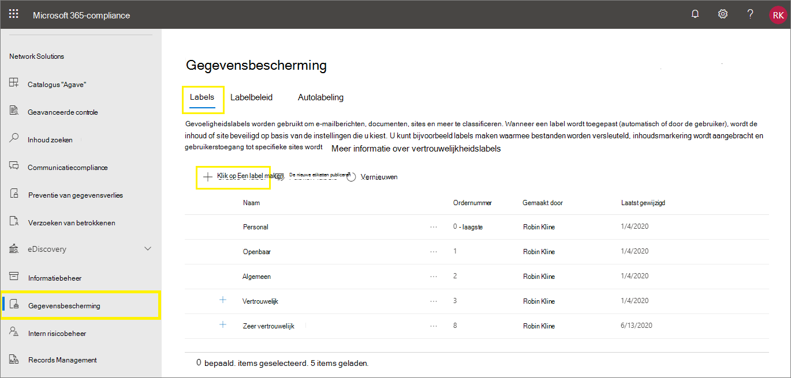

# <a name="create-and-configure-sensitivity-labels-and-their-policies"></a>Gevoeligheidslabels en hun beleid maken en configureren

>*[Richtlijnen voor Microsoft 365-licenties voor beveiliging en compliance](/office365/servicedescriptions/microsoft-365-service-descriptions/microsoft-365-tenantlevel-services-licensing-guidance/microsoft-365-security-compliance-licensing-guidance).*

Alle Microsoft Information Protection-oplossingen (soms afgekort tot MIP) worden geïmplementeerd met behulp van [gevoeligheidslabels](sensitivity-labels.md). Ga naar het [compliancecentrum van Microsoft 365](https://compliance.microsoft.com/) om deze labels te maken en publiceren. U kunt ook de oudere portal, het Office 365-beveiligings- en compliancecentrum, gebruiken.

Maak en configureer eerst de gevoeligheidslabels die u beschikbaar wilt maken voor apps en andere services. Dit zijn bijvoorbeeld de labels die gebruikers moeten zien en toepassen vanuit Office-apps. 

Maak vervolgens een of meer labelbeleidsregels met de labels en beleidsinstellingen die u configureert. Het labelbeleid publiceert de labels en instellingen voor de gekozen gebruikers en locaties.

## <a name="before-you-begin"></a>Voordat u begint

De globale beheerder voor uw organisatie heeft volledige machtigingen om alle aspecten van gevoeligheidslabels te maken en beheren. Zie [Vereiste machtigingen om gevoeligheidslabels te maken en beheren](get-started-with-sensitivity-labels.md#permissions-required-to-create-and-manage-sensitivity-labels) als u niet bent aangemeld als globale beheerder.

## <a name="create-and-configure-sensitivity-labels"></a>Gevoeligheidslabels maken en configureren

1. Ga in uw beheercentrum voor labels naar gevoeligheidslabels:

    - Microsoft 365-compliancecentrum: 
        - **Oplossingen** > **Informatiebescherming**

        Selecteer eerst **Alles weergeven** als u deze optie niet meteen ziet. 

    - Beveiligings- en compliancecentrum:
        - **Classificatie** > **Gevoeligheidslabels**

2. Selecteer op de pagina **Labels** de optie **+ Een label maken** om de wizard Nieuw gevoeligheidslabel te starten. 

    Bijvoorbeeld in het Microsoft 365-compliancecentrum:

    

    > [!NOTE]
    > Tenants hebben standaard geen labels; u moet deze maken. De labels in de voorbeeldafbeelding bevatten standaardlabels die [zijn gemigreerd vanuit Azure Information Protection](/azure/information-protection/configure-policy-migrate-labels).

3. De opties die op de pagina **Het bereik voor dit label definiëren** zijn geselecteerd, bepalen de het bereik van het label voor de instellingen die u kunt configureren en waar deze zichtbaar zijn wanneer ze worden gepubliceerd:

    

    - Als **Bestanden en e-mailberichten** is geselecteerd, kunt u in deze wizard instellingen configureren die van toepassing zijn op apps die gevoeligheidslabels ondersteunen, zoals Office Word en Outlook. Als deze optie niet is geselecteerd, geeft de wizard de eerste pagina van deze instellingen weer, maar kunt u deze niet configureren en kunnen gebruikers de labels niet selecteren in deze apps.

    - Als **Groepen en sites** is geselecteerd, kunt u in deze wizard instellingen configureren die van toepassing zijn op Microsoft 365-groepen en sites voor Teams en SharePoint. Als deze optie niet is geselecteerd, geeft de wizard de eerste pagina van deze instellingen weer, maar kunt u deze niet configureren en kunnen gebruikers de labels niet selecteren voor groepen en sites.

    Raadpleeg [Uw inhoud automatisch labelen in Azure Purview](/azure/purview/create-sensitivity-label) voor meer informatie over de **Azure Purview-assets (preview)**.

4. Volg de aanwijzingen in de wizard voor de labelinstellingen.

    Raadpleeg [Wat gevoeligheidslabels kunnen doen](sensitivity-labels.md#what-sensitivity-labels-can-do) in de overzichtsgegevens voor meer informatie over de labelinstellingen en gebruik de hulp in de wizard voor afzonderlijke instellingen.

5. Herhaal deze stappen als u meer labels wilt maken. Als u echter een sublabel wilt maken, moet u eerst het bovenliggende label en vervolgens **...** selecteren voor **Meer acties**. Selecteer daarna **Sublabel toevoegen**.

6. Controleer de volgorde als u alle benodigde labels hebt gemaakt en verplaats de labels zo nodig omhoog of omlaag. Selecteer **...** voor **Meer acties** en selecteer daarna **Omhoog** of **Omlaag** om de volgorde van een label te wijzigen. Raadpleeg [Labelprioriteit (volgorde is van belang)](sensitivity-labels.md#label-priority-order-matters) in de overzichtsgegevens voor meer informatie.

Bewerk een bestaand label door het te selecteren en selecteer vervolgens de knop **Label bewerken**:


Met deze knop start u wizard **Gevoeligheidslabel bewerken**, waarmee u alle labelinstellingen in stap 4 kunt wijzigen.

Verwijder een label alleen als u weet wat de gevolgen voor gebruikers zijn. Raadpleeg het kopje [Labels verwijderen](#removing-and-deleting-labels) voor meer informatie. 

> [!NOTE]
> Als u een label bewerkt dat al is gepubliceerd met een labelbeleid, hoeft u geen extra stappen uit te voeren wanneer u de wizard voltooit. U hoeft het bijvoorbeeld niet toe te voegen aan een nieuw labelbeleid om de wijzigingen beschikbaar te maken voor dezelfde gebruikers. Het duurt echter maximaal 24 uur voordat de wijzigingen naar alle apps en services worden gerepliceerd.

De labels kunnen niet in apps of voor services worden geselecteerd totdat u ze publiceert. Als u de labels wilt publiceren, moeten ze [worden toegevoegd aan een labelbeleid](#publish-sensitivity-labels-by-creating-a-label-policy).

> [!IMPORTANT]
> Selecteer op dit tabblad **Labels** niet het tabblad **Labels publiceren** (of de knop **Label publiceren** wanneer u een label bewerkt), tenzij u een nieuw labelbeleid moet maken. U hebt alleen meerdere labelbeleidsregels nodig als gebruikers verschillende labels of verschillende beleidsinstellingen nodig hebben. Streef naar zo min mogelijk labelbeleid. Het is niet ongebruikelijk dat er slechts één labelbeleid voor de organisatie is.

### <a name="additional-label-settings-with-security--compliance-center-powershell"></a>Aanvullende labelinstellingen met Beveiligings- en compliancecentrum PowerShell

Er zijn aanvullende labelinstellingen beschikbaar met de [Set-Label](/powershell/module/exchange/set-label)-cmdlet van [Beveiligings- en compliancecentrum PowerShell](/powershell/exchange/scc-powershell).

Bijvoorbeeld:

- Gebruik de parameter *LocaleSettings* voor meertalige implementaties, zodat gebruikers de labelnaam en knopinfo in hun lokale taal kunnen weergeven. De [volgende sectie](#example-configuration-to-configure-a-sensitivity-label-for-different-languages) heeft een voorbeeldconfiguratie voor de labelnaam en knopinfotekst voor Frans, Italiaans en Duits.

- Alleen voor de geïntegreerde labelclient van Azure Information Protection geeft u [geavanceerde instellingen](/azure/information-protection/rms-client/clientv2-admin-guide-customizations) op, die onder andere een labelkleur instellen en een aangepaste eigenschap toepassen wanneer een label wordt toegepast. Raadpleeg [Beschikbare geavanceerde instellingen voor labels](/azure/information-protection/rms-client/clientv2-admin-guide-customizations#available-advanced-settings-for-labels) in deze beheerdershandleiding voor clients voor een volledig overzicht.

#### <a name="example-configuration-to-configure-a-sensitivity-label-for-different-languages"></a>Voorbeeldconfiguratie voor het configureren van een gevoeligheidslabel voor verschillende talen

In het volgende voorbeeld ziet u de PowerShell-configuratie voor een label met de naam "Openbaar" met tijdelijke aanduidingen voor de knopinfo. In dit voorbeeld zijn de labelnaam en de knopinfotekst geconfigureerd voor Frans, Italiaans en Duits.

Als gevolg van deze configuratie zien gebruikers van Office-apps met deze weergavetalen hun labelnamen en knopinfo in dezelfde taal. Als u de geïntegreerde labelclient van Azure Information Protection hebt geïnstalleerd om bestanden in Verkenner van een label te voorzien, zien gebruikers met deze taalversies van Windows hun labelnamen en knopinfo in hun lokale taal wanneer ze de rechtermuisknop voor labelacties gebruiken.

Gebruik voor de talen die u wilt ondersteunen de [taalaanduidingen](/deployoffice/office2016/language-identifiers-and-optionstate-id-values-in-office-2016#language-identifiers) voor Office (ook wel taallabels genoemd) en geef uw eigen vertaling op voor de labelnaam en knopinfo.

Voordat u de opdrachten in PowerShell kunt uitvoeren, moet u eerst [verbinding maken met het Beveiligings- en compliancecentrum PowerShell](/powershell/exchange/connect-to-scc-powershell).

```powershell
$Languages = @("fr-fr","it-it","de-de")
$DisplayNames=@("Publique","Publico","Oeffentlich")
$Tooltips = @("Texte Français","Testo italiano","Deutscher text")
$label = "Public"
$DisplayNameLocaleSettings = [PSCustomObject]@{LocaleKey='DisplayName';
Settings=@(
@{key=$Languages[0];Value=$DisplayNames[0];}
@{key=$Languages[1];Value=$DisplayNames[1];}
@{key=$Languages[2];Value=$DisplayNames[2];})}
$TooltipLocaleSettings = [PSCustomObject]@{LocaleKey='Tooltip';
Settings=@(
@{key=$Languages[0];Value=$Tooltips[0];}
@{key=$Languages[1];Value=$Tooltips[1];}
@{key=$Languages[2];Value=$Tooltips[2];})}
Set-Label -Identity $Label -LocaleSettings (ConvertTo-Json $DisplayNameLocaleSettings -Depth 3 -Compress),(ConvertTo-Json $TooltipLocaleSettings -Depth 3 -Compress)
```

## <a name="publish-sensitivity-labels-by-creating-a-label-policy"></a>Gevoeligheidslabels publiceren door een labelbeleid te maken

1. Ga in uw beheercentrum voor labels naar gevoeligheidslabels:

    - Microsoft 365-compliancecentrum: 
        - **Oplossingen** > **Informatiebescherming**

        Selecteer eerst **Alles weergeven** als u deze optie niet meteen ziet. 

    - Beveiligings- en compliancecentrum:
        - **Classificatie** > **Gevoeligheidslabels**

2. Selecteer het tabblad **Labelbeleid** en klik op **Labels publiceren** om de wizard Beleid maken te starten:

    Bijvoorbeeld in het Microsoft 365-compliancecentrum:

    

    > [!NOTE]
    > Tenants hebben standaard geen labelbeleid; u moet dit maken. 

3. Selecteer in de wizard **Kies gevoeligheidslabels om deze te publiceren**. Selecteer de labels die u beschikbaar wilt maken in apps en services en selecteer vervolgens **Toevoegen**.

    > [!IMPORTANT]
    > Als u een sublabel selecteert, moet u ook het bovenliggende label selecteren.

4. Controleer de geselecteerde labels en selecteer **Bewerken** als u wijzigingen wilt aanbrengen. Selecteer anders **Volgende**.

5. Volg de aanwijzingen om de beleidsinstellingen te configureren.

    De beleidsinstellingen die u ziet, komen overeen met het bereik van de labels die u hebt geselecteerd. Als u bijvoorbeeld labels hebt geselecteerd die alleen het bereik **Bestanden en e-mailberichten** hebben, ziet u de beleidsinstellingen **Dit label standaard toepassen op groepen en sites** en **Gebruikers moeten een label toepassen op hun groepen en sites**.

    Raadpleeg [Wat labelbeleid kan doen](sensitivity-labels.md#what-label-policies-can-do) in de overzichtsgegevens voor meer informatie over deze instellingen en gebruik de hulp in de wizard voor afzonderlijke instellingen.

    Voor labels die zijn geconfigureerd voor **Azure Purview-assets (preview)**: deze labels hebben geen bijbehorende beleidsinstellingen.

6. Herhaal deze stappen als u verschillende beleidsinstellingen nodig hebt voor verschillende gebruikers of bereiken. Stel dat u extra labels voor een groep gebruikers wilt of een ander standaardlabel wilt voor een subset van gebruikers. Of dat u labels hebt geconfigureerd voor verschillende bereiken.

7. Als u meer dan één labelbeleid maakt dat kan leiden tot een conflict voor een gebruiker, controleert u de beleidsvolgorde en verplaatst u beleidsregels zo nodig omhoog of omlaag. Selecteer **...** voor **Meer acties** en selecteer daarna **Omhoog** of **Omlaag** om de volgorde van een labelbeleid te wijzigen. Raadpleeg [Labelbeleidsprioriteit (volgorde is van belang)](sensitivity-labels.md#label-policy-priority-order-matters) in de overzichtsgegevens voor meer informatie.

Als u de wizard voltooit, wordt het labelbeleid automatisch gepubliceerd. U kunt gewoon wijzigingen in een gepubliceerd beleid aanbrengen door het beleid te bewerken. Er is geen specifieke actie voor publiceren of opnieuw publiceren die u kunt selecteren.

Bewerk een bestaand labelbeleid door het te selecteren en selecteer vervolgens de knop **Beleid bewerken**: 


Met deze knop start u de wizard **Beleid maken** , waarmee u de opgenomen labels en labelinstellingen kunt bewerken. Wanneer u de wizard voltooit, worden alle wijzigingen automatisch gerepliceerd naar de geselecteerde gebruikers en services.

Wanneer je ingebouwde labeling gebruikt voor Office-apps in Windows, macOS, iOS en Android, zien gebruikers nieuwe labels binnen vier uur en binnen een uur voor de webversie van Word, Excel en PowerPoint wanneer je de browser vernieuwt. Het kan echter 24 uur duren voordat wijzigingen naar alle apps en services zijn gerepliceerd.

> [!NOTE]
> Andere apps en services die vertrouwelijkheidslabels ondersteunen, worden mogelijk vaker dan per 24 uur bijgewerkt met hun eigen updateschema's en triggers voor beleidsupdates. Raadpleeg de documentatie voor meer informatie. Voor de unified labeling-client van Azure Information Protection raadpleeg je bijvoorbeeld de rij **Beleidsupdate** in de tabel [Gedetailleerde vergelijkingen voor de Azure Information Protection-clients](/azure/information-protection/rms-client/use-client#detailed-comparisons-for-the-azure-information-protection-clients).

### <a name="additional-label-policy-settings-with-security--compliance-center-powershell"></a>Aanvullende labelbeleidsinstellingen met Beveiligings- en compliancecentrum PowerShell

Er zijn aanvullende labelbeleidsinstellingen beschikbaar met de [Set-LabelPolicy](/powershell/module/exchange/set-labelpolicy)-cmdlet van [Beveiligings- en compliancecentrum PowerShell](/powershell/exchange/scc-powershell).

De geïntegreerde labelclient van Azure Information Protection ondersteunt een groot aantal [geavanceerde instellingen](/azure/information-protection/rms-client/clientv2-admin-guide-customizations), waaronder migratie van andere labeloplossingen en pop-upberichten in Outlook met waarschuwingen, uitzonderingen en blokkeringsmogelijkheden voor e-mailberichten die worden verzonden. Raadpleeg [Beschikbare geavanceerde instellingen voor labelbeleidsregels](/azure/information-protection/rms-client/clientv2-admin-guide-customizations#available-advanced-settings-for-label-policies) in deze beheerdershandleiding voor clients voor een volledig overzicht.

## <a name="use-powershell-for-sensitivity-labels-and-their-policies"></a>PowerShell gebruiken voor gevoeligheidslabels en hun beleid

U kunt nu [Beveiligings- en compliancecentrum PowerShell](/powershell/exchange/scc-powershell) gebruiken om alle instellingen te maken en configureren die worden weergegeven in het beheercentrum voor labels. Dit betekent dat u niet alleen PowerShell kunt gebruiken voor instellingen die niet beschikbaar zijn in de beheercentra voor labeling, maar ook het maken en onderhouden van gevoeligheidslabels en beleidsregels voor gevoeligheidslabels volledig kunt scripten. 

Raadpleeg de volgende documentatie voor ondersteunde parameters en waarden:

- [New-Label](/powershell/module/exchange/new-label)
- [New-LabelPolicy](/powershell/module/exchange/new-labelpolicy)
- [Set-Label](/powershell/module/exchange/set-label)
- [Set-LabelPolicy](/powershell/module/exchange/set-labelpolicy)

U kunt ook [Remove-Label](/powershell/module/exchange/remove-label) en [Remove-LabelPolicy](/powershell/module/exchange/remove-labelpolicy) gebruiken als u het verwijderen van gevoeligheidslabels of het beleid voor gevoeligheidslabels moet uitvoeren. Lees echter de volgende sectie voordat u gevoeligheidslabels verwijdert.

## <a name="removing-and-deleting-labels"></a>Labels verwijderen en verwijderen

In een productieomgeving is het onwaarschijnlijk dat u gevoeligheidslabels moet verwijderen uit een labelbeleid of dat u gevoeligheidslabels verwijdert. De kans is groter dat u een of meer van deze acties moet uitvoeren tijdens een eerste testfase. Zorg ervoor dat u begrijpt wat er gebeurt wanneer u een van deze acties uitvoert.

Het is minder riskant om een label uit een labelbeleid te verwijderen dan om het te verwijderen. U kunt het label zo nodig later altijd weer toevoegen aan een labelbeleid:

- Als u een label uit een labelbeleid verwijdert, zodat het label niet meer wordt gepubliceerd naar de oorspronkelijke gebruikers, kunnen gebruikers dat label niet meer selecteren in hun Office-app wanneer het labelbeleid de volgende keer wordt vernieuwd. Maar als het label op documenten of e-mailberichten is toegepast, wordt het label niet verwijderd van die inhoud. Versleuteling die door het label is toegepast, blijft bestaan. Ook de onderliggende beveiligingssjabloon blijft gepubliceerd. 

- Gebruikers die gebruikmaken van ingebouwde labels voor Word, Excel en PowerPoint zien voor labels die zijn verwijderd maar eerder op inhoud zijn toegepast nog steeds de naam van het toegepaste label op de statusbalk. Op dezelfde manier wordt bij verwijderde labels die op SharePoint-sites waren toegepast, nog steeds de labelnaam weergegeven in de kolom **Gevoeligheid**.

Ter vergelijking: wanneer u een label verwijdert:

- Als het label versleuteling heeft toegepast, wordt de onderliggende beveiligingssjabloon zo gearchiveerd dat eerder beveiligde inhoud nog steeds kan worden geopend. Vanwege deze gearchiveerde beveiligingssjabloon kunt u geen nieuw label met dezelfde naam maken. Hoewel het mogelijk is om een beveiligingssjabloon te verwijderen met behulp van [PowerShell](/powershell/module/aipservice/remove-aipservicetemplate), moet u dit alleen doen als u zeker weet dat u geen inhoud hoeft te openen die is versleuteld met de gearchiveerde sjabloon.

- Voor bureaublad-apps: de labelgegevens in de metagegevens blijven behouden, maar omdat een label-id voor het toewijzen van namen niet meer mogelijk is, zien gebruikers de toegepaste labelnaam niet (bijvoorbeeld op de statusbalk). Er wordt daardoor van uitgegaan dat de inhoud geen label heeft. Als het label versleuteling heeft toegepast, blijft de versleuteling bestaan. Wanneer de inhoud wordt geopend, kunnen gebruikers nog steeds de naam en beschrijving zien van de nu gearchiveerde beveiligingssjabloon.

- Voor de webversie van Office: gebruikers zien de labelnaam niet op de statusbalk of in de kolom **Gevoeligheid**. De labelgegevens in de metagegevens blijven alleen behouden als het label geen versleuteling heeft toegepast. Als het label versleuteling heeft toegepast en u [gevoeligheidslabels hebt ingeschakeld voor SharePoint en OneDrive](sensitivity-labels-sharepoint-onedrive-files.md), worden de labelgegevens in de metagegevens verwijderd en wordt de versleuteling verwijderd. 

Als u een gevoeligheidslabel verwijdert uit een labelbeleid of een gevoeligheidslabel verwijdert, kan het maximaal 24 uur duren voordat deze wijzigingen zijn gerepliceerd naar alle gebruikers en services.

## <a name="next-steps"></a>Volgende stappen

Gebruik de volgende artikelen als u uw gevoeligheidslabels wilt configureren en gebruiken voor specifieke scenario's:

- [Toegang tot inhoud beperken door versleuteling te gebruiken met gevoeligheidslabels](encryption-sensitivity-labels.md)

- [Een vertrouwelijkheidslabel automatisch toepassen op inhoud](apply-sensitivity-label-automatically.md)

- [Vertrouwelijkheidslabels gebruiken voor teams, groepen en sites](sensitivity-labels-teams-groups-sites.md)

- [Vertrouwelijkheidslabels inschakelen voor Office-bestanden in SharePoint en OneDrive](sensitivity-labels-sharepoint-onedrive-files.md)

Zie [Aan de slag met gegevensclassificatie](data-classification-overview.md) om te bewaken hoe uw labels worden gebruikt.
