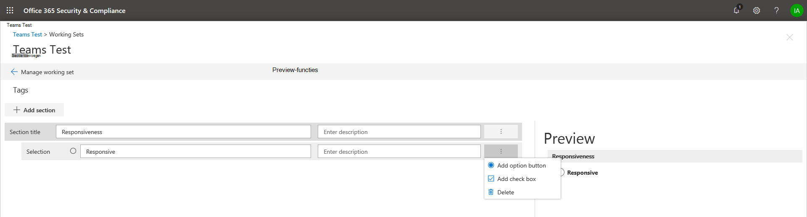

# Taggroepen makenCreate tag groups

Voordat u of andere personen documenten in een revisieset kunnen taggen, moeten de tags worden gemaakt.Before you or other people can tag documents in a review set, the tags must be created. U kunt dit doen door taggroepen te maken die onderliggende tags bevatten.You can do this by creating tag groups that contain child tags. Tags worden weergegeven in het labelingsvenster bij het controleren van documenten in een revisieset.Tags are displayed in the tagging panel when reviewing documents in a review set.

Een taggroep maken:To create a tag group:

1.  Klik in een revisieset op **Revisieset beheren.**In a review set, click **Manage review set**.

    

2.  Klik in **de tegel** Tags op **Tags beheren.**In the **Tags** tile, click **Manage tags**.

    

Eenmaal binnen het tagbeheer kunnen tags worden gemaakt om te voldoen aan de vereisten van uw zaak.Once inside the tag management, tags can be created to meet the requirements of your case. U kunt beginnen met het maken van een taggroep.You can start by creating a tag group.

1.  Klik **op Sectie toevoegen.**Click **Add section**.

    

    Het voorbeeldscherm wordt bijgewerkt wanneer u het opstipt, zodat u een voorbeeld van het tagvenster kunt bekijken zonder dat u het scherm voor tagbeheer moet sluiten en terug kunt gaan naar de werkset.The preview screen will update when you save so you can preview the tag panel without having to close the tag management screen and go back to the working set.

2. Voer een titel en optionele beschrijving in.Enter a title and optional description. 

3. Als u een tag in die groep wilt maken, klikt u op de drie puntjes in de nieuwe taggroep om tags te maken in die nieuwe sectie.To create a tag within that group, click the ellipses on the new tag group to create tags in that new section.
    
    

   - **Optielabels** dwingen gebruikers om één tag te selecteren uit een groep tags.**Option tags** will force users to select one tag from a group of tags.
   
   - **Met selectievakjes** kunnen gebruikers een combinatie van tags selecteren.**Check box tags** will allow users to select any combination of tags. |

## Geneste tagsNested tags

Als u tags wilt nesten, klikt u op de drie puntjes naast een tag en selecteert u een nieuwe tag die u wilt toevoegen.To nest tags, click the ellipses next to a tag and then select a new tag to add.

