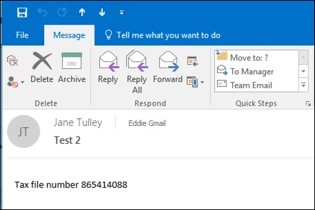

# Een DLP-beleid maken, testen en afstemmen

Met DLP (Data Loss Prevention) voorkomt u onbedoeld of per ongeluk delen van gevoelige informatie.

DLP onderzoekt e-mailberichten en bestanden op gevoelige informatie, zoals een creditcardnummer. Met DLP kunt u gevoelige informatie detecteren en actie ondernemen, zoals:

- De gebeurtenis registreren voor controledoeleinden
- Een waarschuwing weergeven aan de eindgebruiker die de e-mail verzendt of het bestand deelt
- Het actief blokkeren van het delen van e-mail of bestanden

## Machtigingen

Leden van uw nalevingsteam die DLP-beleid maken, hebben machtigingen nodig voor het Compliance Center. Standaard heeft uw Tenant beheerder toegang en kunnen nalevings functionarissen en andere mensen toegang geven. Volg deze stappen:
  
1. Maak een groep in Microsoft 365 en voeg er nalevingsfunctionarissen aan toe.
    
2. Maak een rolgroep op de pagina **Machtigingen** van het Security &amp; Compliance Center. 

3. Gebruik tijdens het maken van de rolgroep de sectie **Rollen kiezen** om de volgende rol aan de rolgroep toe te voegen: **DLP Compliance Management**.
    
4. Gebruik de sectie **Leden kiezen** om de Microsoft 365 groep die u eerder hebt gemaakt, toe te voegen aan de rolgroep.

Gebruik de rol **Alleen-weergeven DLP-nalevingsbeheer** om een rolgroep te maken met alleen-weergeven bevoegdheden voor het DLP-beleid en de DLP-rapporten.

Zie [Gebruikers toegang geven tot het Office 365 Compliance Center voor](../security/office-365-security/grant-access-to-the-security-and-compliance-center.md)meer informatie.
  
Deze machtigingen zijn vereist om een DLP-beleid te maken en toe te passen om geen beleid af te dwingen.

## Hoe gevoelige informatie wordt gedetecteerd door DLP

DLP vindt gevoelige informatie door regex-patroonmatching (Regular Expression), in combinatie met andere indicatoren, zoals de nabijheid van bepaalde trefwoorden tot de overeenkomende patronen. Een VISA-creditcardnummer heeft bijvoorbeeld 16 cijfers. Maar die cijfers kunnen op verschillende manieren worden geschreven, zoals 1111-1111-1111-1111, 1111 1111 1111 1111 1111 of 111111111111111111111111111111111111111111111111111111111111111111111111111111111111111111111111111111111111111111111111111111111111111111111111111111111111111111111111111111

Elke tekenreeks van 16 cijfers is niet noodzakelijkerwijs een creditcardnummer, het kan een ticketnummer van een helpdesksysteem zijn of een serienummer van een stuk hardware. Om het verschil te zien tussen een creditcardnummer en een onschadelijke tekenreeks van 16 cijfers, wordt een berekening uitgevoerd (checksum) om te bevestigen dat de nummers overeenkomen met een bekend patroon van de verschillende creditcardmerken.

Als DLP trefwoorden zoals "VISA" of "AMEX" vindt, in de buurt van datumwaarden die de vervaldatum van de creditcard kunnen zijn, gebruikt DLP die gegevens ook om te beslissen of de tekenreeks een creditcardnummer is of niet.

Met andere woorden, DLP is slim genoeg om het verschil tussen deze twee tekenreeksen tekst in een e-mail te herkennen:

- "Kun je een nieuwe laptop voor me bestellen? Gebruik mijn VISA-nummer 1111-1111-1111-1111, vervaldatum 11/22, en stuur me de geschatte leverdatum wanneer u deze hebt."
- "Mijn laptop serienummer is 2222-2222-2222-2222 en het werd gekocht op 11/2010. Trouwens, is mijn reisvisum al goedgekeurd?"

Zie [Entiteitsdefinities van gevoelig informatietype](sensitive-information-type-entity-definitions.md) waarin wordt uitgelegd hoe elk informatietype wordt gedetecteerd.

## Waar te beginnen met preventie van gegevensverlies

Wanneer de risico's van datalekken niet helemaal duidelijk zijn, is het moeilijk om uit te zoeken waar u precies moet beginnen met het implementeren van DLP. Gelukkig kan DLP-beleid worden uitgevoerd in de "testmodus", zodat u hun effectiviteit en nauwkeurigheid kunt meten voordat u ze inschakelt.

DLP-beleid voor Exchange Online kan worden beheerd via het Exchange-beheercentrum. Maar u kunt DLP-beleid configureren voor alle workloads via het Security & Compliance Center, dus dat is wat ik zal gebruiken voor demonstraties in dit artikel. In het Security & Compliance Center vindt u het DLP-beleid onder Beleid **voor het voorkomen van**  >  **gegevensverlies**. Kies **Een beleid maken** om te starten.

Microsoft 365 biedt een reeks [DLP-beleidssjablonen](what-the-dlp-policy-templates-include.md) die u kunt gebruiken om beleid te maken. Laten we zeggen dat je een Australisch bedrijf bent. U kunt de sjablonen filteren op Australië en Financiële, medische en gezondheids- en privacy kiezen.

Voor deze demonstratie kies ik Australian Personally Identifiable Information (PII) Data, inclusief de informatietypen Australian Tax File Number (TFN) en Rijbewijsnummer.

Geef uw nieuwe DLP-beleid een naam. De standaardnaam komt overeen met de DLP-beleidssjabloon, maar u moet zelf een meer beschrijvende naam kiezen, omdat er meerdere beleidsregels kunnen worden gemaakt op basis van dezelfde sjabloon.

Kies de locaties waarop het beleid van toepassing is. DLP-beleid kan van toepassing zijn op Exchange Online, SharePoint online en OneDrive voor Bedrijven. Ik laat dit beleid geconfigureerd om van toepassing te zijn op alle locaties.

Accepteer bij de eerste **stap policy Instellingen** de standaardinstellingen voorlopig. U kunt DLP-beleid aanpassen, maar de standaardinstellingen zijn een prima plek om te beginnen.

Nadat u op Volgende** hebt geklikt, krijgt u een pagina met meer **beleids- Instellingen** met meer aanpassingsopties te zien. Voor een beleid dat u alleen maar test, kunt u hier beginnen met het aanbrengen van enkele aanpassingen.

- Ik heb beleidstips voor nu uitgeschakeld, wat een redelijke stap is om te nemen als je gewoon dingen uit test en nog niets aan gebruikers wilt weergeven. Beleidstips geven waarschuwingen weer aan gebruikers dat ze op het punt staan een DLP-beleid te schenden. Een Outlook gebruiker ziet bijvoorbeeld een waarschuwing dat het bestand dat ze hebben bijgevoegd creditcardnummers bevat en ervoor zorgt dat hun e-mail wordt geweigerd. Het doel van beleidstips is om het niet-conforme gedrag te stoppen voordat het gebeurt.
- Ik heb ook het aantal exemplaren verlaagd van 10 naar 1, zodat dit beleid het delen van Australische PII-gegevens detecteert, niet alleen het bulk delen van de gegevens.
- Ik heb ook een andere ontvanger toegevoegd aan de e-mail met het incidentrapport.

Ten slotte heb ik dit beleid geconfigureerd om in eerste instantie in de testmodus te worden uitgevoerd. Merk op dat er hier ook een optie is om beleidstips uit te schakelen in de testmodus. Dit geeft u de flexibiliteit om beleidstips in het beleid in te schakelen, maar vervolgens te beslissen of u ze wilt weergeven of onderdrukken tijdens uw tests.

Klik in het laatste beoordelingsscherm op **Maken** om het maken van het beleid te voltooien.

## Een DLP-beleid testen

Uw nieuwe DLP-beleid wordt binnen ongeveer 1 uur van kracht. U kunt zitten en wachten tot het wordt geactiveerd door normale gebruikersactiviteit, of u kunt proberen het zelf te activeren. Eerder heb ik gekoppeld aan [entiteitsdefinities van het gevoelige informatietype](sensitive-information-type-entity-definitions.md), die u informatie geven over het activeren van DLP-overeenkomsten.

Als voorbeeld, het DLP-beleid dat ik voor dit artikel heb gemaakt, detecteert Australische belastingbestandsnummers (TFN). Volgens de documentatie is de match gebaseerd op de volgende criteria.

 
Om TFN-detectie op een nogal botte manier te demonstreren, zal een e-mail met de woorden "Fiscaal dossiernummer" en een tekenreeks van negen cijfers in de buurt zonder problemen doorvaren. De reden dat het DLP-beleid niet wordt geactiveerd, is dat de negencijferige tekenreeks de controlesom moet passeren die aangeeft dat het een geldige TFN is en niet alleen een onschadelijke reeks getallen.

Ter vergelijking: een e-mail met de woorden "Fiscaal dossiernummer" en een geldige TFN die de controlesom passeert, activeert het beleid. Voor de goede orde, de TFN die ik gebruik is afkomstig van een website die geldige, maar niet echte TFN's genereert. Dergelijke sites zijn handig omdat een van de meest voorkomende fouten bij het testen van een DLP-beleid het gebruik van een nepnummer is dat niet geldig is en de controlesom niet doorgeeft (en daarom het beleid niet activeert).

De e-mail met het incidentrapport bevat het type gevoelige informatie dat is gedetecteerd, het aantal exemplaren dat is gedetecteerd en het betrouwbaarheidsniveau van de detectie.

Als u uw DLP-beleid in de testmodus laat staan en de e-mails met het incidentrapport analyseert, kunt u een beeld krijgen van de nauwkeurigheid van het DLP-beleid en hoe effectief het zal zijn wanneer het wordt afgedwongen. Naast de incident rapporten kunt u [de DLP-rapporten gebruiken](view-the-dlp-reports.md) om een geaggregeerde weergave van beleids overeenkomsten in uw Tenant weer te geven.

## Een DLP-beleid afstemmen

Wanneer u uw beleidstreffers analyseert, wilt u misschien enkele aanpassingen aanbrengen in hoe het beleid zich gedraagt. Als eenvoudig voorbeeld kunt u vaststellen dat één TFN in een e-mail geen probleem is (ik denk dat het dat nog steeds is, maar laten we er voor demonstratie mee doorgaan), maar twee of meer gevallen zijn een probleem. Meerdere instanties kunnen een riskant scenario zijn, zoals een werknemer die een CSV-export vanuit de HR-database e-mailt naar een externe partij, bijvoorbeeld een externe boekhoudservice. Zeker iets dat je liever zou detecteren en blokkeren.

In het Compliance Center kunt u een bestaand beleid bewerken om het gedrag aan te passen.

 
U kunt de locatie-instellingen aanpassen zodat het beleid alleen wordt toegepast op specifieke workloads of op specifieke sites en accounts.

U kunt ook de beleidsinstellingen aanpassen en de regels aanpassen aan uw behoeften.

Wanneer u een regel binnen een DLP-beleid bewerkt, kunt u het aantal wijzigen:

- De voorwaarden, waaronder het type en het aantal exemplaren van gevoelige gegevens die de regel activeren.
- De acties die worden ondernomen, zoals het beperken van de toegang tot de inhoud.
- Gebruikersmeldingen, dit zijn beleidstips die aan de gebruiker worden weergegeven in hun e-mailclient of webbrowser.
- Gebruikersoverschrijvingen bepalen of gebruikers er toch voor kunnen kiezen om door te gaan met het delen van e-mail of bestanden.
- Incidentrapporten, om beheerders op de hoogte te stellen.

Voor deze demonstratie heb ik gebruikersmeldingen toegevoegd aan het beleid (wees voorzichtig om dit te doen zonder adequate training voor gebruikersbewustzijn) en heb ik gebruikers toegestaan het beleid te overschrijven met een zakelijke rechtvaardiging of door het als een vals positief te markeren. U kunt ook de tekst van de e-mail- en beleidstip aanpassen als u aanvullende informatie over het beleid van uw organisatie wilt opnemen of gebruikers vragen contact op te nemen met de ondersteuning als ze vragen hebben.

Het beleid bevat twee regels voor het verwerken van een hoog volume en een laag volume, dus zorg ervoor dat u beide bewerkt met de gewenste acties. Dit is een kans om gevallen anders te behandelen, afhankelijk van hun kenmerken. U kunt bijvoorbeeld overschrijvingen toestaan voor schendingen van een laag volume, maar geen overschrijvingen toestaan voor schendingen van grote volumes.

Als u ook daadwerkelijk de toegang tot inhoud wilt blokkeren of beperken die in strijd is met het beleid, moet u hiervoor een actie op de regel configureren.

Nadat ik deze wijzigingen in de beleidsinstellingen heb opgeslagen, moet ik ook terugkeren naar de hoofdinstellingenpagina voor het beleid en de optie inschakelen om beleidstips aan gebruikers weer te geven terwijl het beleid zich in de testmodus bevindt. Dit is een effectieve manier om DLP-beleid aan uw eindgebruikers te introduceren en gebruikersbewustzijnstrainingen te doen, zonder al te veel valse positieven te riskeren die hun productiviteit beïnvloeden.

Aan de serverzijde (of cloudzijde indien u dat liever heeft), wordt de wijziging mogelijk niet onmiddellijk van kracht vanwege verschillende verwerkingsintervallen. Als u een DLP-beleidswijziging aanbrengt die nieuwe beleidstips weergeeft aan een gebruiker, ziet de gebruiker mogelijk niet dat de wijzigingen onmiddellijk van kracht worden in de Outlook client, die elke 24 uur controleert op beleidswijzigingen. Als u de testsnelheid wilt versnellen, kunt u deze registerfix gebruiken om [de laatste downloadtijdstempel van de sleutel PolicyNudges](https://support.microsoft.com/en-au/help/2823261/changes-to-a-data-loss-prevention-policy-don-t-take-effect-in-outlook?__hstc=18650278.46377037dc0a82baa8a30f0ef07a7b2f.1538687978676.1538693509953.1540315763430.3&__hssc=18650278.1.1540315763430&__hsfp=3446956451)te wissen. Outlook de meest recente beleidsinformatie de volgende keer dat u deze opnieuw opstart, downloadt en begint met het opstellen van een e-mailbericht.

Als u beleidstips hebt ingeschakeld, ziet de gebruiker de tips in Outlook en kan hij of zij valse positieven aan u rapporteren wanneer deze zich voordoen.

## Valse positieven onderzoeken

DLP-beleidssjablonen zijn niet direct perfect. Het is waarschijnlijk dat u een aantal valse positieven zult tegenkomen in uw omgeving, daarom is het zo belangrijk om uw weg naar een DLP-implementatie te vergemakkelijken en de tijd te nemen om uw beleid adequaat te testen en af te stemmen.

Hier is een voorbeeld van een vals positief. Deze e-mail is vrij onschadelijk. De gebruiker geeft zijn mobiele telefoonnummer aan iemand op en inclusief zijn e-mailhandtekening.

 
Maar de gebruiker ziet een beleidstip die hen waarschuwt dat de e-mail gevoelige informatie bevat, met name een Australisch rijbewijsnummer.

De gebruiker kan het valse positieve melden en de beheerder kan onderzoeken waarom het is opgetreden. In de e-mail met het incidentrapport wordt de e-mail gemarkeerd als een vals positief.

Deze rijbewijszaak is een goed voorbeeld om in te graven. De reden dat dit valse positieve is opgetreden, is dat het type "Australian Driver's License" wordt geactiveerd door elke 9-cijferige tekenreeks (zelfs een die deel uitmaakt van een tekenreeks van 10 cijfers), binnen 300 tekens in de buurt van de trefwoorden "Sydney nsw" (niet hoofdlettergevoelig). Het wordt dus geactiveerd door het telefoonnummer en de e-mailhandtekening, alleen omdat de gebruiker toevallig in Sydney is.

Een optie is om het Australische rijbewijsinformatietype uit het beleid te verwijderen. Het zit erin omdat het deel uitmaakt van de DLP-beleidssjabloon, maar we zijn niet gedwongen om het te gebruiken. Als u alleen geïnteresseerd bent in belastingbestandsnummers en niet in rijbewijzen, kunt u deze gewoon verwijderen. U kunt het bijvoorbeeld verwijderen uit de regel voor een laag volume in het beleid, maar het in de regel voor een hoog volume laten staan, zodat lijsten met meerdere rijbewijzen nog steeds worden gedetecteerd.
 
Een andere optie is om het aantal exemplaren te verhogen, zodat een laag aantal rijbewijzen alleen wordt gedetecteerd als er meerdere exemplaren zijn.

Naast het wijzigen van het aantal exemplaren, kunt u ook de overeenkomstnauwkeurigheid (of betrouwbaarheidsniveau) aanpassen. Als uw gevoelige informatietype meerdere patronen heeft, kunt u de overeenkomstnauwkeurigheid in uw regel aanpassen, zodat uw regel alleen overeenkomt met specifieke patronen. Als u bijvoorbeeld valse positieven wilt verminderen, kunt u de overeenkomstnauwkeurigheid van uw regel zo instellen dat deze alleen overeenkomt met het patroon met het hoogste betrouwbaarheidsniveau. Zie Vertrouwensniveau gebruiken om uw regels af te stemmen voor meer informatie over [vertrouwensniveaus.](data-loss-prevention-policies.md#match-accuracy)

Ten slotte, als u nog een beetje geavanceerder wilt worden, kunt u elk gevoelig informatietype aanpassen - u kunt bijvoorbeeld "Sydney NSW" verwijderen uit de lijst met trefwoorden voor [het rijbewijsnummer](sensitive-information-type-entity-definitions.md#australia-drivers-license-number)van Australië , om het vals-positieve hierboven geactiveerde te elimineren. Zie [een ingebouwd gevoelig informatietype aanpassen](customize-a-built-in-sensitive-information-type.md)voor meer informatie over hoe u dit kunt doen met XML en PowerShell.

## Een DLP-beleid inschakelen

Als u tevreden bent dat uw DLP-beleid gevoelige informatietypen nauwkeurig en effectief detecteert en dat uw eindgebruikers klaar zijn om het beleid te verwerken dat wordt uitgevoerd, kunt u het beleid inschakelen.

 
Als u wacht om te zien wanneer het beleid van kracht wordt, [Verbinding maken naar Security & PowerShell van het Compliance Center](/powershell/exchange/connect-to-scc-powershell) en voert u de [cmdlet Get-DlpCompliancePolicy](/powershell/module/exchange/get-dlpcompliancepolicy) uit om de Distributiestatus te zien.

Nadat u het DLP-beleid hebt ingeschakeld, moet u zelf enkele laatste tests uitvoeren om ervoor te zorgen dat de verwachte beleidsacties plaatsvinden. Als u dingen zoals creditcardgegevens probeert te testen, zijn er online websites met informatie over het genereren van voorbeeldcreditcards of andere persoonlijke informatie die controlesommen doorgeeft en uw beleid activeert.

Beleidsregels die gebruikersoverschrijvingen toestaan, presenteren deze optie aan de gebruiker als onderdeel van de beleidstip.

Beleidsregels die inhoud beperken, geven de waarschuwing aan de gebruiker als onderdeel van de beleidstip en voorkomen dat ze de e-mail verzenden.

## Samenvatting

Beleid ter voorkoming van gegevensverlies is nuttig voor organisaties van alle soorten. Het testen van sommige DLP-beleidsregels is een oefening met een laag risico vanwege de controle die u hebt over zaken als beleidstips, overschrijvingen van eindgebruikers en incidentrapporten. U kunt in stilte een aantal DLP-beleidsregels testen om te zien wat voor soort schendingen zich al voordoen in uw organisatie, en vervolgens beleid maken met lage vals-positieve percentages, uw gebruikers informeren over wat wel en niet is toegestaan en vervolgens uw DLP-beleid uitrollen naar de organisatie.