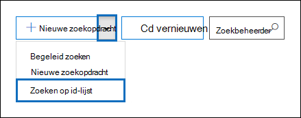
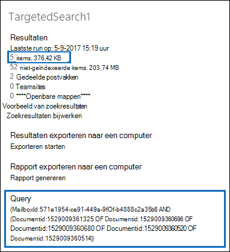

# Een CSV-bestand voorbereiden voor een inhoudszoekactie in een id-lijstPrepare a CSV file for an ID list Content Search

U kunt zoeken naar specifieke postvak-e-mailberichten en andere postvakitems met een lijst met Exchange-ed's.You can search for specific mailbox email messages and other mailbox items using a list of Exchange IDs. Als u een zoekopdracht naar een id-lijst wilt maken (formeel een gerichte zoekopdracht genoemd), dient u een CSV-bestand (door komma's gescheiden waarde) in dat de specifieke postvakitems identificeert die moeten worden gezocht.To create an ID list search (formally called a targeted search), you submit a comma separated value (CSV) file that identifies the specific mailbox items to search for. Voor dit CSV-bestand gebruikt u het **Results.csv-bestand of** het niet-geïndexeerde **Items.csv-bestand** dat is opgenomen wanneer u de resultaten van Inhoudszoekactie exporteert of een inhoudszoekrapport exporteert van en bestaande inhoudszoekactie.For this CSV file you use the **Results.csv** file or the **Unindexed Items.csv** file that are included when you export the Content Search results or export a Content Search report from and existing Content Search. Vervolgens bewerkt u een van deze bestanden om de specifieke items aan te geven die u wilt zoeken. Vervolgens maakt u een nieuwe zoekopdracht in de lijst met id's en verstuurt u het CSV-bestand.Then you edit one of these files to indicate the specific items to search for, and then create a new ID list search and submit the CSV file.

Hier is een kort overzicht van het proces voor het maken van een zoekopdracht naar een lijst met id's.Here's a quick overview of the process for creating an ID list search.

1. Maak en voer een nieuwe of begeleide inhoudszoekactie uit in het & Compliancecentrum.Create and run a new or guided Content Search in the Security & Compliance Center.

2. Exporteert de zoekresultaten voor inhoud of exporteert het inhoudszoekrapport.Export the content search results or export the content search report. Zie voor meer informatie:For more information, see:

    - [Inhoudszoekresultaten exporterenExport Content Search results](export-search-results.md)

    - [Een inhoudszoekrapport exporterenExport a Content Search report](export-a-content-search-report.md)

3. Bewerk **hetResults.csv** bestand of de niet-geïndexeerde **Items.csv** en identificeer de specifieke postvakitems die u wilt opnemen in de zoekopdracht in de lijst met id's.Edit the **Results.csv** file or the **Unindexed Items.csv** and identify the specific mailbox items that you want to include in the ID list search. Zie de [instructies voor](#prepare-the-csv-file-for-an-id-list-search) het voorbereiden van een CSV-bestand voor het zoeken naar een id-lijst.See the [instructions](#prepare-the-csv-file-for-an-id-list-search) for preparing a CSV file for an ID list search.

4. Maak een nieuwe id-lijst zoeken (zie de [instructies)](#create-an-id-list-search)en verzend het CSV-bestand dat u hebt voorbereid.Create a new ID list search (see the [instructions](#create-an-id-list-search)) and submit the CSV file that you prepared. De zoekquery die is gemaakt, zoekt alleen naar de items die zijn geselecteerd in het CSV-bestand.The search query that's created will only search for the items selected in the CSV file.

> [!NOTE]
> Zoekopdrachten in id-lijst worden alleen ondersteund voor postvakitems.ID list searches are only supported for mailbox items. U kunt niet zoeken naar SharePoint en OneDrive zoeken in een id-lijst.You can't search for SharePoint and OneDrive documents in an ID list search.

 **Waarom een id-lijst zoeken?****Why create an ID list search?** Als u niet kunt bepalen of een item reageert op een eDiscovery-aanvraag op basis van de metagegevens in **deResults.csv-** of Niet-geïndexeerde **Items.csv-bestanden,** kunt u een zoekopdracht naar een id-lijst gebruiken om dat item te zoeken, een voorbeeld te bekijken en vervolgens te exporteren om te bepalen of het reageert op de zaak die u onderzoekt.If you're unable to determine if an item is responsive to an eDiscovery request based on the metadata in the **Results.csv** or **Unindexed Items.csv** files, you can use an ID list search to find, preview, and then export that item to determine if it's responsive to the case you're investigating. Zoekopdrachten in id-lijst worden meestal gebruikt om een specifieke set niet-geïndexeerde items te zoeken en te retourneren.ID list searches are typically used to search for and return a specific set of unindexed items.

## Het CSV-bestand voorbereiden voor een zoekopdracht in een id-lijstPrepare the CSV file for an ID list search

Nadat u de zoekresultaten of het rapport voor een inhoudszoekactie hebt geëxporteerd, kunt u de volgende stappen uitvoeren om het CSV-bestand voor te bereiden op een zoekopdracht naar een id-lijst.After you export the search results or report for a content search, you can perform the following steps to prepare the CSV file for an ID list search. Dit CSV-bestand identificeert elk item in de zoekopdracht id-lijst.This CSV file will identify every item in the ID list search.

Houd er rekening mee dat u een CSV-bestand kunt gebruiken uit een zoekopdracht die  SharePoint sites en OneDrive-accounts bevat, maar u kunt alleen postvakitems selecteren voor een zoekopdracht in een id-lijst.Note that you can use a CSV file from a search that included SharePoint sites and OneDrive accounts, but you can select  *only*  mailbox items for an ID list search. Als u een document selecteert in SharePoint of OneDrive, mislukt de validatie van het CSV-bestand wanneer u een zoekopdracht naar een id-lijst maakt.If you select a document in SharePoint or OneDrive, the CSV file will fail validation when you create an ID list search.

1. Open het **Results.csv** **of niet-geïndexeerd Items.csv** bestand in Excel.Open the **Results.csv** or **Unindexed Items.csv** file in Excel.

2. Typ **ja** **in** de kolom Geselecteerd in de cel die overeenkomt met het item dat u wilt zoeken.In the **Selected** column, type **Yes** in the cell that corresponds to the item that you want to search for. Herhaal deze stap voor elk item dat u wilt zoeken.Repeat this step for every item that you want to search for.

    > [!IMPORTANT]
    > Wanneer u het CSV-bestand in Excel opent, wordt de gegevensindeling voor de **kolom Document-id** gewijzigd in **Algemeen.**When you open the CSV file in Excel, the data format for the **Document ID** column is changed to **General**. Dit resulteert in het weergeven van de document-id voor een item in wetenschappelijke notatie.This results in displaying the document ID for an item in scientific notation. De document-id van '481037338205' wordt bijvoorbeeld weergegeven als '4.81037E+11'. U moet de volgende stappen  uitvoeren om de gegevensindeling van de **kolom Document-id** te wijzigen in Getal om de juiste notatie voor de document-id te herstellen.For example, the document ID of "481037338205" is displayed as "4.81037E+11" You have to perform the next steps to change the data format of the **Document ID** column to **Number** to restore the correct format for the document ID. Als u dit niet doet, mislukt de zoekopdracht id-lijst met het CSV-bestand.If you don't do this, the ID list search that uses the CSV file will fail.

3. Klik met de rechtermuisknop op de hele **kolom Document-id** en selecteer **Cellen opmaken.**Right-click the entire **Document ID** column and select **Format Cells**.

4. Klik in **het** vak Categorie op **Getal**.In the **Category** box, click **Number**.

5. Wijzig het aantal decimalen in **0** en klik vervolgens op **OK** om de wijzigingen op te slaan.Change the number of decimal places to **0**, and then click **OK** to save your changes. U ziet dat de waarden in de kolom Document-id worden gewijzigd in getallen.Notice that the values in the Document ID column are changed to numbers.

    Hier is een voorbeeld van het CSV-bestand dat klaar is om te worden verzonden voor een zoekopdracht naar inhoud in de lijst met id's.Here's an example of the a CSV file that's ready to be submitted for a ID list content search.

    

6. Sla het CSV-bestand op of gebruik **Opslaan als** om het bestand met een andere bestandsnaam op te slaan.Save the CSV file or use **Save As** to the save the file with different file name. In beide gevallen moet u het bestand opslaan met de CSV-indeling.In both cases, be sure to save the file with the CSV format.

## Zoeken naar een id-lijst makenCreate an ID list search

De volgende stap is het maken van een nieuwe id-lijst Inhoud zoeken en het CSV-bestand indienen dat u in de vorige stap hebt voorbereid.The next step is to create a new ID list Content Search and submit the CSV file that you prepared in the previous step.

> [!IMPORTANT]
> U moet niet meer dan twee dagen na het exporteren van de resultaten of het rapport vanuit een inhoudszoekactie een zoekactie voor een id-lijst maken.You should create an ID list search no more than 2 days after exporting the results or report from a Content Search. Als de zoekresultaten of het rapport meer dan 2 dagen geleden zijn geëxporteerd, moet u de zoekresultaten of het rapport opnieuw exporteren om bijgewerkte CSV-bestanden te genereren.If the search results or report where exported more than 2 days ago, you should re-export the search results or report to generate updated CSV files. Vervolgens kunt u een van de bijgewerkte CSV-bestanden voorbereiden en deze gebruiken om een zoekopdracht naar een id-lijst te maken.Then you can prepare one of the updated CSV files and use it to create an ID list search.

1. Ga in het & Compliancecentrum naar **Zoeken naar** inhoud \> **zoeken.**In the Security & Compliance Center, go to **Search** \> **Content search**.

2. Klik op **de pagina** Zoeken op de pijl naast Pictogram Nieuw  **toevoegen** en klik vervolgens op Zoeken **op id-lijst.**On the **Search** page, click the arrow next to  **New search**, and then click **Search by ID List**.

    

3. In het **flyout** Zoeken op id-lijst geeft u de zoekfunctie een naam (en beschrijft u deze desgewenst) en klikt u op Bladeren en selecteert u het CSV-bestand dat u in de vorige stap hebt voorbereid. On the **Search by ID List** flyout, name the search (and optionally describe it) and then click **Browse** and select the CSV file that you prepared in the previous step.

    Microsoft 365 probeert het CSV-bestand te valideren.Microsoft 365 attempts to validate the CSV file. Als de validatie mislukt, wordt een foutbericht weergegeven dat u kan helpen bij het oplossen van de validatiefouten.If the validation is unsuccessful, an error message is displayed that might help you troubleshoot the validation errors. Het CSV-bestand moet worden gevalideerd om een zoekopdracht in een id-lijst te maken.The CSV file has to be successfully validated to create an ID list search.

4. Nadat het CSV-bestand is gevalideerd, klikt u **op Zoeken om** de zoekopdracht in de lijst met id's te maken.After the CSV file is successfully validated, click **Search** to create the ID list search.

    Hier volgen een voorbeeld van de geschatte zoekresultaten en de query die wordt gegenereerd voor een zoekopdracht in een lijst met id's.Here's an example of the estimated search results and the query that's generated for an ID list search.

    

    Het aantal geschatte items dat wordt weergegeven in statistieken voor het zoeken naar id's, moet overeenkomen met het aantal items dat u hebt geselecteerd in het CSV-bestand.Note that the number of estimated items displayed in statistics for the ID search should match the number of items that you selected in the CSV file.

5. Bekijk of exporteert de items die worden geretourneerd door de zoekactie naar de lijst met id's.Preview or export the items returned by the ID list search.

> [!NOTE]
> Als u een postvak verplaatst na het maken van een zoekopdracht naar de lijst met id's, worden de opgegeven items niet door de query voor de zoekopdracht retourneerd.If you move a mailbox after creating an ID list search, the query for the search won't return the specified items. De eigenschap **DocumentId** voor postvakitems wordt namelijk gewijzigd wanneer een postvak wordt verplaatst.That's because the **DocumentId** property for mailbox items are changed when a mailbox is moved. In het zeldzame geval dat een postvak wordt verplaatst nadat u een zoekopdracht naar een id-lijst hebt gemaakt, moet u een nieuwe inhoudszoekactie maken (of de zoekresultaten bijwerken voor de bestaande inhoudszoekactie) en vervolgens de zoekresultaten of het rapport exporteren om bijgewerkte CSV-bestanden te genereren die kunnen worden gebruikt om een nieuwe zoekopdracht in de lijst met id's te maken.In the rare instance when a mailbox is moved after you create an ID list search, you should create a new content search (or update the search results for the existing content search) and then export the search results or report to generate updated CSV files that can be used to create a new ID list search.
