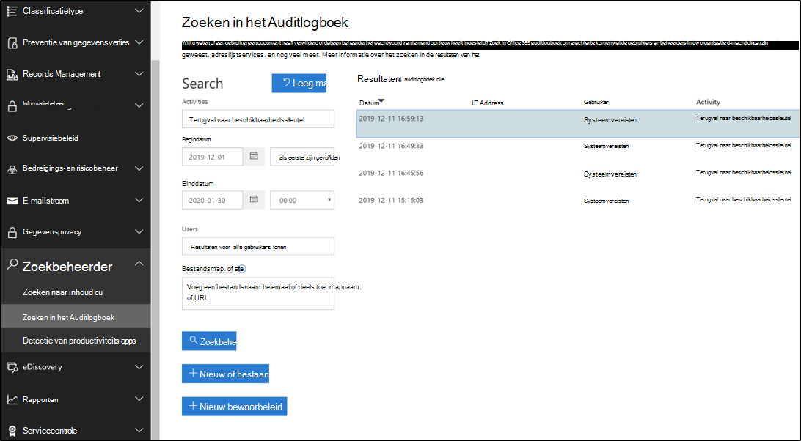
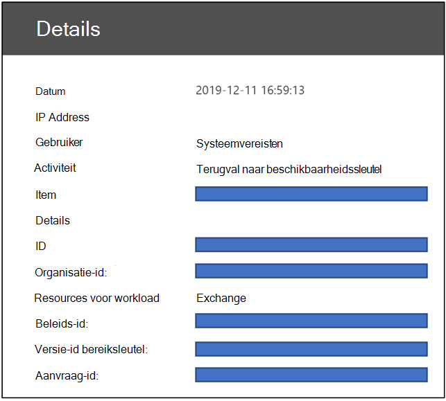
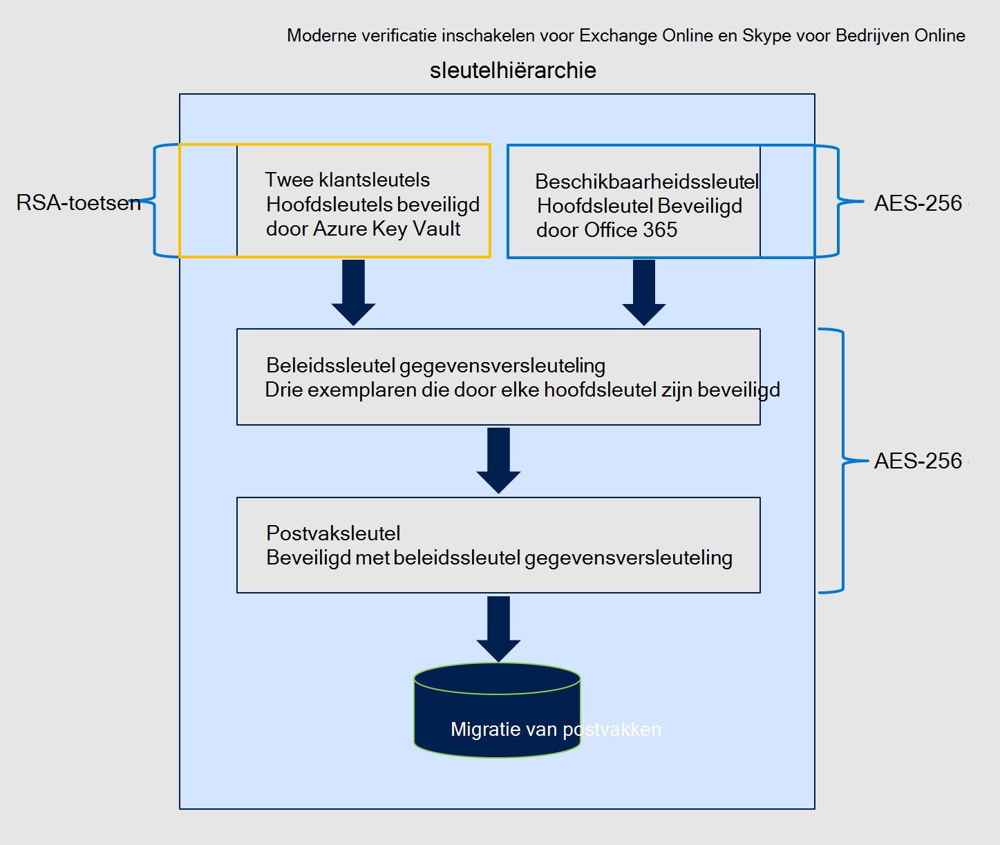
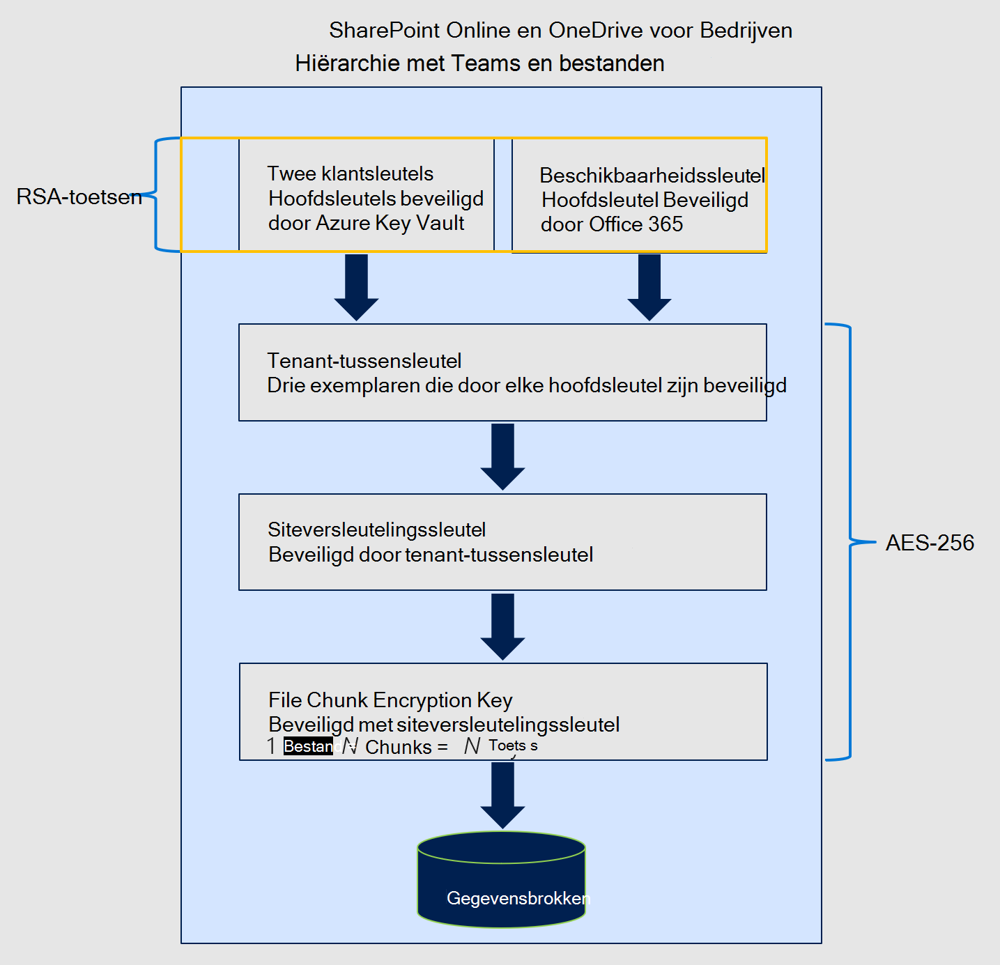

# Meer informatie over de beschikbaarheidssleutel voor de klantsleutel

De beschikbaarheidssleutel is een hoofdsleutel die automatisch wordt gegenereerd en ingericht wanneer u een gegevensversleutelingsbeleid maakt. Microsoft 365 slaat de beschikbaarheidscode op en beschermt deze. De beschikbaarheidssleutel is functioneel als de twee hoofdsleutels die u levert voor serviceversleuteling met klantsleutel. Met de beschikbaarheidssleutel worden de toetsen één laag lager in de sleutelhiërarchie teruggewikkeld. In tegenstelling tot de sleutels die u verstrekt en beheert in Azure Key Vault, hebt u niet rechtstreeks toegang tot de beschikbaarheidssleutel. Microsoft 365 geautomatiseerde services beheren de beschikbaarheidscode programmaatically. Deze services starten geautomatiseerde bewerkingen waarbij nooit directe toegang tot de beschikbaarheidssleutel is betrokken.

Het primaire doel van de beschikbaarheidssleutel is om herstelmogelijkheden te bieden vanaf het onverwachte verlies van hoofdsleutels dat u beheert. Verlies kan het gevolg zijn van wanbeheer of kwaadwillende acties. Als u de controle over uw hoofdsleutels kwijt bent, neemt u contact op met Microsoft Support en microsoft helpt u bij het herstelproces met behulp van de beschikbaarheidssleutel. U gebruikt de beschikbaarheidssleutel om te migreren naar een nieuw gegevensversleutelingsbeleid met nieuwe hoofdsleutels die u inrichten.

Storage en beheer van de beschikbaarheidssleutel verschillen bewust van Azure Key Vault-sleutels om drie redenen:

- De beschikbaarheidssleutel biedt een herstelfunctie, 'break-glass' als de besturing van beide Azure Key Vault-sleutels verloren gaat.
- De scheiding van logische besturingselementen en veilige opslaglocaties biedt een uitgebreide verdediging en beschermt tegen het verlies van alle sleutels en uw gegevens, tegen één aanval of een foutpunt.
- De beschikbaarheidssleutel biedt een hoge beschikbaarheidsmogelijkheid als Microsoft 365 services geen sleutels kunnen bereiken die worden gehost in Azure Key Vault vanwege tijdelijke fouten. Deze regel is alleen van toepassing op Exchange Online en Skype voor Bedrijven serviceversleuteling. SharePoint Online, OneDrive voor Bedrijven en Teams nooit de beschikbaarheidssleutel gebruiken, tenzij u Microsoft expliciet instrueert het herstelproces te starten.

Als u de verantwoordelijkheid deelt om uw gegevens te beschermen, met behulp van diverse beveiligingen en processen voor sleutelbeheer, wordt uiteindelijk het risico verkleind dat alle sleutels (en dus uw gegevens) definitief verloren gaan of worden vernietigd. Microsoft verleent u de enige bevoegdheid over het uitschakelen of vernietigen van de beschikbaarheidscode wanneer u de service verlaat. Op basis van het ontwerp heeft niemand bij Microsoft toegang tot de beschikbaarheidscode: deze is alleen toegankelijk Microsoft 365 servicecode.

Zie het [Microsoft Trust Center voor](https://www.microsoft.com/trustcenter/Privacy/govt-requests-for-data) meer informatie over hoe we sleutels beveiligen.
  
## Gebruik van beschikbaarheidssleutel

De beschikbaarheidssleutel biedt herstelmogelijkheden voor scenario's waarin een externe malefactor of kwaadwillende insider de controle over uw sleutelkluis steelt of wanneer onbedoeld wanbeheer resulteert in het verlies van hoofdsleutels. Deze herstelfunctie is van toepassing op alle Microsoft 365 services die compatibel zijn met Customer Key. Afzonderlijke services gebruiken de beschikbaarheidscode anders. Microsoft 365 gebruikt alleen de beschikbaarheidssleutel op de onderstaande manieren.

### Exchange Online en Skype voor Bedrijven gebruikt

Naast de herstelfunctie gebruiken Exchange Online en Skype voor Bedrijven de beschikbaarheidssleutel om ervoor te zorgen dat gegevens beschikbaar zijn tijdens tijdelijke of onregelmatige operationele problemen, met betrekking tot de service die toegang heeft tot hoofdsleutels. Wanneer de service geen van uw klantsleutels in Azure Key Vault kan bereiken vanwege tijdelijke fouten, gebruikt de service automatisch de beschikbaarheidssleutel. De service GAAT NOOIT rechtstreeks naar de beschikbaarheidscode.

Geautomatiseerde systemen in Exchange Online en Skype voor Bedrijven kunnen de beschikbaarheidssleutel gebruiken tijdens tijdelijke fouten ter ondersteuning van geautomatiseerde back-endservices, zoals anti-virus, e-discovery, preventie van gegevensverlies, postvakbewegingen en gegevensindexering.

### SharePoint Online, OneDrive voor Bedrijven en Teams bestanden gebruikt

Voor SharePoint Online-, OneDrive voor Bedrijven- en Teams-bestanden wordt de beschikbaarheidssleutel nooit buiten de herstelfunctie gebruikt en moeten klanten Microsoft expliciet instrueren om het gebruik van de beschikbaarheidssleutel te starten tijdens een herstelscenario. Geautomatiseerde servicebewerkingen zijn uitsluitend afhankelijk van uw klantsleutels in de Azure Key-kluis. Zie Hoe [SharePoint Online, OneDrive voor Bedrijven](#how-sharepoint-online-onedrive-for-business-and-teams-files-use-the-availability-key)en Teams de beschikbaarheidssleutel gebruiken voor uitgebreide informatie over hoe de sleutelhiërarchie voor deze services werkt.

## Beveiliging van beschikbaarheidssleutel

Microsoft deelt de verantwoordelijkheid voor gegevensbescherming met u door de beschikbaarheidssleutel direct aan te geven en uitgebreide maatregelen te nemen om deze te beschermen. Microsoft geeft klanten geen directe controle over de beschikbaarheidscode. U kunt bijvoorbeeld alleen de sleutels rollen (draaien) die u bezit in Azure Key Vault. Zie Een klantsleutel [of beschikbaarheidssleutel](customer-key-availability-key-roll.md)rollen of draaien voor meer informatie.

### Beschikbaarheidscode geheime winkels

Microsoft beschermt beschikbaarheidssleutels in toegangsgestuurde, interne geheime winkels, zoals de azure-sleutelkluis die aan de klant is gericht. We implementeren toegangsbesturingselementen om te voorkomen dat Microsoft-beheerders rechtstreeks toegang krijgen tot de geheimen in. Secret Store-bewerkingen, waaronder sleutelrotatie en verwijdering, vinden plaats via geautomatiseerde opdrachten die nooit directe toegang tot de beschikbaarheidssleutel bevatten. Beheerbewerkingen van geheime winkels zijn beperkt tot specifieke technici en vereisen escalatie van bevoegdheden via een intern hulpprogramma, Lockbox. Voor escalatie van bevoegdheden is goedkeuring en rechtvaardiging van de manager vereist voordat deze wordt verleend. Lockbox zorgt ervoor dat toegang afhankelijk is van de tijd met automatische intrekking van toegang na verloop van tijd of door een engineer uit te loggen.

**Exchange Online en Skype voor Bedrijven** beschikbaarheidssleutels worden opgeslagen in een Exchange Online Active Directory-geheime winkel. Beschikbaarheidssleutels worden veilig opgeslagen in tenantspecifieke containers binnen de Active Directory-domeincontroller. Deze veilige opslaglocatie is gescheiden en geïsoleerd van de SharePoint Online, OneDrive voor Bedrijven en Teams bestanden secret store.

**SharePoint Online, OneDrive voor Bedrijven en Teams** bestanden worden opgeslagen in een interne geheime winkel die wordt beheerd door het serviceteam. Deze beveiligde, geheime opslagservice heeft front-endservers met toepassings-eindpunten en een SQL Database als back-end. Beschikbaarheidssleutels worden opgeslagen in de SQL Database en worden gewikkeld (versleuteld) door versleutelingssleutels van het geheime winkelgebruik die een combinatie van AES-256 en HMAC gebruiken om de beschikbaarheidssleutel in rust te versleutelen. De versleutelingssleutels van het geheime winkelbestand worden opgeslagen in een logisch geïsoleerd onderdeel van hetzelfde SQL Database en worden verder versleuteld met RSA-2048-sleutels in certificaten die worden beheerd door de Certificeringsinstantie van Microsoft (CA). Deze certificaten worden opgeslagen in de front-endservers van het secret store die bewerkingen uitvoeren tegen de database.

### De diepte van de verdediging

Microsoft gebruikt een uitgebreide strategie om te voorkomen dat kwaadwillende partijen van invloed zijn op de vertrouwelijkheid, integriteit of beschikbaarheid van klantgegevens die zijn opgeslagen in de Microsoft Cloud. Specifieke preventie- en toezichtbesturingselementen worden geïmplementeerd om de geheime winkel en de beschikbaarheidssleutel te beschermen als onderdeel van de overkoepelende beveiligingsstrategie.

Microsoft 365 is ontworpen om misbruik van de beschikbaarheidscode te voorkomen. De toepassingslaag is de enige methode waarmee sleutels, inclusief de beschikbaarheidssleutel, kunnen worden gebruikt om gegevens te versleutelen en te ontsleutelen. Alleen Microsoft 365 servicecode kan de sleutelhiërarchie voor versleutelings- en ontsleutelingsactiviteiten interpreteren en doorlopen. Logische isolatie bestaat tussen de opslaglocaties van klantsleutels, beschikbaarheidstoetsen, andere hiërarchische sleutels en klantgegevens. Door deze isolatie wordt het risico van blootstelling aan gegevens beperkt als een of meer locaties worden gecompromitteerd. Elke laag in de hiërarchie heeft 24x7 mogelijkheden voor inbraakdetectie ingebouwd om gegevens en geheimen te beveiligen die zijn opgeslagen.

Toegangsbesturingselementen worden geïmplementeerd om ongeautoriseerde toegang tot interne systemen te voorkomen, inclusief beschikbaarheidscodes. Microsoft-technici hebben geen directe toegang tot de beschikbaarheidscodes voor geheime winkels. Voor meer informatie over toegangsbesturingselementen, controleert u [Beheertoegangsbesturingselementen in Microsoft 365.](/Office365/securitycompliance/office-365-administrative-access-controls-overview)

Technische besturingselementen voorkomen dat Medewerkers van Microsoft zich aanmelden bij zeer bevoorrechte serviceaccounts, die anders door aanvallers kunnen worden gebruikt om zich voor te Microsoft-services. Deze besturingselementen voorkomen bijvoorbeeld interactieve aanmelding.

Beveiligingsregistratie en controlebesturingselementen zijn een andere uitgebreide beveiliging die is geïmplementeerd om het risico voor Microsoft-services en uw gegevens te beperken. Microsoft-serviceteams hebben actieve monitoringoplossingen geïmplementeerd waarmee waarschuwingen en auditlogboeken worden gegenereerd. Alle serviceteams uploaden hun logboeken naar een centrale opslagplaats waar de logboeken worden samengevoegd en verwerkt. Interne hulpprogramma's controleren automatisch records om te controleren of services in een optimale, veerkrachtige en veilige toestand werken. Ongebruikelijke activiteit wordt gemarkeerd voor verder onderzoek.

Een logboekgebeurtenis die een mogelijke schending van het Microsoft-beveiligingsbeleid aangeeft, wordt onmiddellijk onder de aandacht gebracht van Microsoft-beveiligingsteams. Microsoft 365 beveiliging heeft waarschuwingen geconfigureerd voor het detecteren van poging tot toegang tot geheime winkels met beschikbaarheidssleutels. Waarschuwingen worden ook gegenereerd als Microsoft-personeel interactieve aanmeldingen probeert te doen bij serviceaccounts, wat is verboden en beveiligd met toegangsbesturingselementen. Microsoft 365 beveiliging detecteert en waarschuwt ook bij afwijkingen van de Microsoft 365 van normale basislijnbewerkingen. Malefactors die misbruik maken van Microsoft 365 services, leiden tot waarschuwingen die leiden tot de uitzetting van de overtreder uit de Microsoft-cloudomgeving.

## De beschikbaarheidssleutel gebruiken om te herstellen van sleutelverlies

Als u de controle over uw klantsleutels kwijt bent, kunt u met de beschikbaarheidssleutel uw gegevens herstellen en opnieuw versleutelen.

### Herstelprocedure voor Exchange Online en Skype voor Bedrijven

Als u de controle over uw klantsleutels kwijt bent, kunt u met de beschikbaarheidssleutel uw gegevens herstellen en uw beïnvloede Microsoft 365 weer online zetten. De beschikbaarheidssleutel blijft uw gegevens beschermen terwijl u herstelt. Als u op hoog niveau volledig wilt herstellen van sleutelverlies, moet u een nieuw DEP maken en beïnvloede resources verplaatsen naar het nieuwe beleid.

Als u uw gegevens wilt versleutelen met nieuwe klantsleutels, maakt u nieuwe sleutels in Azure Key Vault, maakt u een nieuwe DEP met de nieuwe klantsleutels en wijst u het nieuwe DEP toe aan de postvakken die momenteel zijn versleuteld met de vorige DEP waarvoor de sleutels zijn verloren of gecompromitteerd.

Deze herversleuteling kan tot 72 uur duren. Dit is de standaardduur wanneer u een DEP wijzigt.
  
### Herstelprocedure voor SharePoint Online OneDrive voor Bedrijven en Teams bestanden

Voor SharePoint Online, OneDrive voor Bedrijven en Teams, wordt de beschikbaarheidssleutel nooit buiten de herstelfunctie gebruikt. U moet Microsoft expliciet instrueren om het gebruik van de beschikbaarheidssleutel te starten tijdens een herstelscenario. Neem contact op met Microsoft om de beschikbaarheidscode te activeren om het herstelproces te starten. Nadat deze is geactiveerd, wordt de beschikbaarheidssleutel automatisch gebruikt om uw gegevens te ontsleutelen, zodat u de gegevens kunt versleutelen met een nieuw gemaakt DEP dat is gekoppeld aan nieuwe klantsleutels.  

Deze bewerking is proportioneel met het aantal sites in uw organisatie. Zodra u Microsoft belt om de beschikbaarheidscode te gebruiken, moet u binnen ongeveer vier uur volledig online zijn.

## Hoe Exchange Online en Skype voor Bedrijven de beschikbaarheidssleutel gebruiken

Wanneer u een DEP met klantsleutel maakt, Microsoft 365 een DEP-sleutel (Data Encryption Policy Key) gegenereerd die aan die DEP is gekoppeld. De service versleutelt de DEP-toets drie keer: eenmaal met elk van de klantsleutels en eenmaal met de beschikbaarheidssleutel. Alleen de versleutelde versies van de DEP-sleutel worden opgeslagen en een DEP-toets kan alleen worden ontsleuteld met de klantsleutels of de beschikbaarheidssleutel. De DEP-toets wordt vervolgens gebruikt om postvaksleutels te versleutelen, waarmee afzonderlijke postvakken worden versleuteld.
  
Microsoft 365 volgt dit proces om gegevens te ontsleutelen en op te geven wanneer klanten de service gebruiken:
  
1. Ontsleutel de DEP-sleutel met de klantsleutel.

2. Gebruik de ontsleutelde DEP-toets om een postvaksleutel te ontsleutelen.

3. Gebruik de ontsleutelde postvaksleutel om het postvak zelf te ontsleutelen, zodat u toegang hebt tot de gegevens in het postvak.

## Hoe SharePoint online, OneDrive voor Bedrijven en Teams de beschikbaarheidscode gebruiken

De SharePoint online en OneDrive voor Bedrijven en implementatie voor klantcode en beschikbaarheidscode verschillen van Exchange Online en Skype voor Bedrijven.
  
Wanneer een organisatie overstapt naar door de klant beheerde sleutels, Microsoft 365 een organisatiespecifieke tussentijdse sleutel (TIK) maken. Microsoft 365 versleutelt de TIK tweemaal, eenmaal met elk van de klantsleutels, en slaat de twee versleutelde versies van de TIK op. Alleen de versleutelde versies van de TIK worden opgeslagen en een TIK kan alleen worden ontsleuteld met de klantsleutels. De TIK wordt vervolgens gebruikt om sitetoetsen te versleutelen, die vervolgens worden gebruikt om blobtoetsen (ook wel bestandsbrokkentoetsen genoemd) te versleutelen. Afhankelijk van de bestandsgrootte kan de service een bestand splitsen in meerdere bestandsbrokken, elk met een unieke sleutel. De blobs (bestandsbrokken) zelf worden versleuteld met de blobtoetsen en opgeslagen in de Microsoft Azure Blob Storage Service.
  
Microsoft 365 volgt dit proces om klantbestanden te ontsleutelen en aan te bieden wanneer klanten de service gebruiken:

1. Ontsleutel de TIK met de klantsleutel.

2. Gebruik de ontsleutelde TIK om een sitesleutel te ontsleutelen.

3. Gebruik de ontsleutelde sitetoets om een blobtoets te ontsleutelen.

4. Gebruik de ontsleutelde blobtoets om de blob te ontsleutelen.

Microsoft 365 een TIK ontsleutelt door twee ontsleutelingsaanvragen uit te geven aan Azure Key Vault met een kleine verschuiving. De eerste die klaar is, levert het resultaat op, waardoor de andere aanvraag wordt geannuleerd.
  
Als u geen toegang meer hebt tot uw klantsleutels, versleutelt Microsoft 365 tik ook met een beschikbaarheidssleutel en slaat u deze samen met de TIK's op die met elke klantsleutel zijn versleuteld. De TIK die is versleuteld met de beschikbaarheidscode, wordt alleen gebruikt wanneer de klant Microsoft belt om het herstelpad in te voeren wanneer ze de toegang tot hun sleutels, kwaadwillend of per ongeluk, hebben verloren.
  
Om beschikbaarheids- en schaalredenen worden ontsleutelde TIK's in de cache opgeslagen in een geheugencache met beperkte tijd. Twee uur voordat een TIK-cache is ingesteld om te verlopen, Microsoft 365 probeert elke TIK te ontsleutelen. Als u de TIK's ontsleutelt, wordt de levensduur van de cache verlengd. Als TIK-ontsleuteling een aanzienlijke hoeveelheid tijd mislukt, wordt Microsoft 365 waarschuwing gegenereerd om de techniek te informeren voordat de cache verloopt. Alleen als de klant Microsoft belt, start Microsoft 365 de herstelbewerking, waarbij de TIK wordt ontsleuteld met de beschikbaarheidssleutel die is opgeslagen in de geheime winkel van Microsoft en de tenant opnieuw onboarding met behulp van de ontsleutelde TIK en een nieuwe set door de klant geleverde Azure Key Vault-sleutels.
  
Klantsleutel is vanaf vandaag betrokken bij de versleutelings- en ontsleutelingsketen van SharePoint Online-bestandsgegevens die zijn opgeslagen in de Azure Blob Store, maar niet SharePoint Online-lijstitems of metagegevens die zijn opgeslagen in de SQL Database. Microsoft 365 gebruikt de beschikbaarheidssleutel niet voor andere bestanden Exchange Online, Skype voor Bedrijven, SharePoint Online, OneDrive voor Bedrijven en Teams dan het bovenstaande geval, dat door de klant is gestart. Menselijke toegang tot klantgegevens wordt beveiligd door Customer Lockbox.

## Beschikbaarheidssleutels

Microsoft 365 de beschikbaarheidssleutel alleen in specifieke omstandigheden. Deze omstandigheden verschillen per service.

### Triggers voor Exchange Online en Skype voor Bedrijven
  
1. Microsoft 365 leest het DEP voor waaraan het postvak is toegewezen om de locatie van de twee klantsleutels in Azure Key Vault te bepalen.

2. Microsoft 365 kiest willekeurig een van de twee klantsleutels uit de DEP en verzendt een verzoek naar Azure Key Vault om de DEP-toets uit te pakken met de klantsleutel.

3. Als de aanvraag voor het uitpakken van de DEP-sleutel met de klantsleutel mislukt, verzendt Microsoft 365 een tweede aanvraag naar Azure Key Vault, ditmaal met de opdracht om de alternatieve (tweede) klantsleutel te gebruiken.

4. Als de tweede aanvraag voor het uitpakken van de DEP-toets met de klantsleutel mislukt, Microsoft 365 de resultaten van beide aanvragen worden onderzocht.

    - Als tijdens het onderzoek wordt bepaald dat de aanvragen een systeemFOUT hebben retourn mislukt:

       - Microsoft 365 de beschikbaarheidscode om de DEP-toets te ontsleutelen.

       - Microsoft 365 gebruikt vervolgens de DEP-toets om de postvaksleutel te ontsleutelen en de gebruikersaanvraag te voltooien. 

       - In dit geval kan Azure Key Vault niet reageren of kan deze niet onbereikbaar zijn vanwege een tijdelijke FOUT.

    - Als bij het onderzoek wordt bepaald dat de aanvragen geen toegang geweigerd hebben:

       - Dit betekent dat er opzettelijk, onbedoeld of kwaadwillend is actie ondernomen om de klantsleutels niet beschikbaar te maken (bijvoorbeeld tijdens het gegevens verwijderen als onderdeel van het verlaten van de service).

       - In dit geval wordt de beschikbaarheidssleutel alleen gebruikt voor systeemacties en niet voor gebruikersacties, mislukt de gebruikersaanvraag en ontvangt de gebruiker een foutbericht.

>[!IMPORTANT]
>Microsoft 365 servicecode heeft altijd een geldig aanmeldingslogoken om te redeneren over klantgegevens om cloudservices met toegevoegde waarde te leveren. Dus totdat de beschikbaarheidssleutel is verwijderd, kan deze worden gebruikt als een terugval voor acties die zijn gestart door of intern naar Exchange Online en Skype voor Bedrijven, zoals het maken van zoekindexen of het verplaatsen van postvakken. Dit is van toepassing op tijdelijke fouten en GEWEIGERDe ACCESS-aanvragen voor Azure Key Vault.

### Triggers voor SharePoint Online, OneDrive voor Bedrijven en Teams bestanden

Voor SharePoint Online-, OneDrive voor Bedrijven- en Teams-bestanden wordt de beschikbaarheidssleutel nooit buiten de herstelfunctie gebruikt en moeten klanten Microsoft expliciet instrueren om het gebruik van de beschikbaarheidssleutel te starten tijdens een herstelscenario.

## Auditlogboeken en de beschikbaarheidscode

Geautomatiseerde systemen in Microsoft 365 verwerken alle gegevens terwijl deze door het systeem stromen om cloudservices aan te bieden, bijvoorbeeld anti-virus, e-discovery, preventie van gegevensverlies en gegevensindexering. Microsoft 365 genereert geen logboeken die zichtbaar zijn voor de klant voor deze activiteit. Daarnaast hebben Microsoft-medewerkers geen toegang tot uw gegevens als onderdeel van deze normale systeembewerkingen.

### Exchange Online en Skype voor Bedrijven beschikbaarheidssleutelregistratie

Wanneer Exchange Online en Skype voor Bedrijven toegang heeft tot de beschikbaarheidscode om service te verlenen, worden Microsoft 365 logboeken gepubliceerd die toegankelijk zijn vanuit het Beveiligings- en compliancecentrum. Een auditlogboekrecord voor de beschikbaarheidssleutelbewerking wordt gegenereerd telkens als de service de beschikbaarheidssleutel gebruikt. Met een nieuw recordtype genaamd 'Customer Key Service Encryption' met het activiteitstype 'Fallback to Availability Key' kunnen beheerders zoekresultaten van unified [auditlogboek](./search-the-audit-log-in-security-and-compliance.md) filteren om de beschikbaarheidssleutelrecords te bekijken.

Logboekrecords bevatten kenmerken zoals datum, tijd, activiteit, organisatie-id en beleids-id voor gegevensversleuteling. De record is beschikbaar als onderdeel van Unified Audit Logs en is toegankelijk via het tabblad & Compliance Center Audit Log Search.

Exchange Online en Skype voor Bedrijven beschikbaarheidssleutelrecords gebruiken het algemene schema  Office 365 managementactiviteit met aangepaste parameters: Beleids-id, versie-id bereikcode en aanvraag-id.

### SharePoint Online, OneDrive voor Bedrijven en Teams beschikbaarheidssleutelregistratie voor bestanden

Logboekregistratie van beschikbaarheidssleutels is nog niet beschikbaar voor deze services. Voor SharePoint Online-, OneDrive voor Bedrijven- en Teams-bestanden wordt de beschikbaarheidssleutel alleen geactiveerd door Microsoft, wanneer u dit door u hebt geïnstrueerd, voor hersteldoeleinden. Hierdoor weet u al elke gebeurtenis waarin de beschikbaarheidssleutel voor deze services wordt gebruikt.

## Beschikbaarheidssleutel in de hiërarchie klantsleutel
  
Microsoft 365 de beschikbaarheidssleutel gebruikt om de laag met sleutels lager in de sleutelhiërarchie te laten terugvallen die is ingesteld voor klantenserviceversleuteling. Er bestaan verschillende sleutelhiërarchieën tussen services. Belangrijke algoritmen verschillen ook tussen beschikbaarheidstoetsen en andere sleutels in de hiërarchie van elke toepasselijke service. De algoritmen voor beschikbaarheidssleutels die door de verschillende services worden gebruikt, zijn als volgt:

- De Exchange Online en Skype voor Bedrijven beschikbaarheidstoetsen gebruiken AES-256.

- De SharePoint online, OneDrive voor Bedrijven en Teams beschikbaarheidstoetsen voor bestanden gebruiken RSA-2048.

### Versleutelingssleutels die worden gebruikt om sleutels voor Exchange Online en Skype voor Bedrijven

### Versleutelingscodes die worden gebruikt om sleutels te versleutelen voor SharePoint Online en OneDrive voor Bedrijven

## Verwante artikelen

- [Serviceversleuteling met klantsleutel](customer-key-overview.md)

- [Klantsleutel instellen](customer-key-set-up.md)

- [Klantcode beheren](customer-key-manage.md)

- [Een klantsleutel of een beschikbaarheidssleutel rollen of draaien](customer-key-availability-key-roll.md)