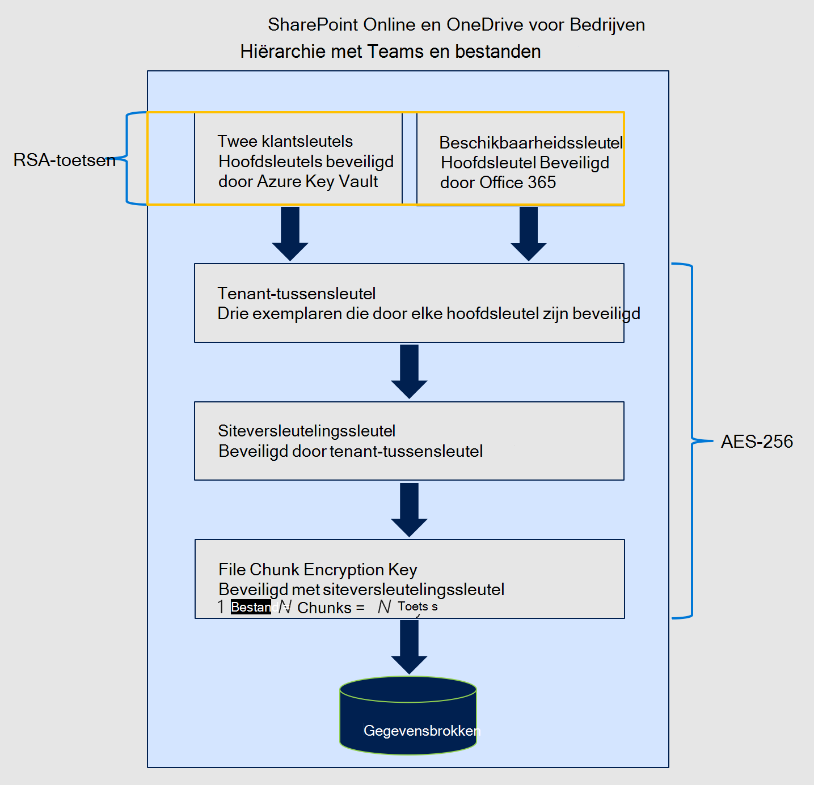

# Serviceversleuteling met klantsleutel

Microsoft 365 biedt basislijnversleuteling, volumeversleuteling die is ingeschakeld via BitLocker en Distributed Key Manager (DKM). Microsoft 365 biedt een extra versleutelingslaag voor uw inhoud. Deze inhoud bevat gegevens uit Exchange Online, Skype voor Bedrijven, SharePoint Online, OneDrive voor Bedrijven en Microsoft Teams.

## Hoe serviceversleuteling, BitLocker en Klantsleutel samenwerken

Uw gegevens worden altijd in rust versleuteld in de Microsoft 365 service met BitLocker en DKM. Zie Hoe beveiligt u [uw Exchange Online e-mailgeheimen](exchange-online-secures-email-secrets.md)voor meer informatie. Klantsleutel biedt extra bescherming tegen het weergeven van gegevens door onbevoegde systemen of personeel en vormt een aanvulling op de BitLocker schijfversleuteling in Microsoft-datacenters. Serviceversleuteling is niet bedoeld om te voorkomen dat medewerkers van Microsoft toegang krijgen tot uw gegevens. In plaats daarvan helpt Customer Key u om te voldoen aan wettelijke of nalevingsvereisten voor het beheren van hoofdsleutels. U machtigt Microsoft 365 services expliciet om uw versleutelingssleutels te gebruiken om cloudservices met toegevoegde waarde te leveren, zoals eDiscovery, anti-malware, antispam, zoekindexering, en dergelijke.

Klantsleutel is gebaseerd op serviceversleuteling en u kunt versleutelingssleutels leveren en bedienen. Microsoft 365 gebruikt deze sleutels om uw gegevens in rust te versleutelen, zoals beschreven in de [Voorwaarden voor Online Services (OST).](https://www.microsoft.com/licensing/product-licensing/products.aspx) Met De klantsleutel kunt u voldoen aan nalevingsverplichtingen omdat u de versleutelingssleutels controleert die Microsoft 365 gegevens versleutelen en ontsleutelen.
  
Klantsleutel verbetert de mogelijkheid van uw organisatie om te voldoen aan de vereisten voor naleving die belangrijke afspraken met de cloudserviceprovider specificeren. Met De klantsleutel geeft u de hoofdversleutelingssleutels voor uw Microsoft 365 op het toepassingsniveau. Hierdoor oefent u de controle over de sleutels van uw organisatie uit.

## Klantcode met hybride implementaties

Klantsleutel versleutelt alleen gegevens in rust in de cloud. Klantcode werkt niet om uw on-premises postvakken en bestanden te beveiligen. U kunt uw on-premises gegevens versleutelen met een andere methode, zoals BitLocker.

## Gegevensversleutelingsbeleid

Een decodeerbeleid voor gegevensversleuteling definieert de versleutelingshiërarchie. Deze hiërarchie wordt door de service gebruikt om gegevens te versleutelen met elk van de sleutels die u beheert en de beschikbaarheidssleutel die door Microsoft is beveiligd. U maakt DEP's met PowerShell-cmdlets en wijst deze DEP's toe om toepassingsgegevens te versleutelen. Er zijn drie typen DEP's die worden ondersteund door Microsoft 365 Klantsleutel, elk beleidstype gebruikt verschillende cmdlets en biedt dekking voor een ander type gegevens. De DEP's die u kunt definiëren, zijn:

**DEP voor meerdere Microsoft 365 werkbelastingen** Deze DEP's versleutelen gegevens over meerdere M365-werkbelastingen voor alle gebruikers binnen de tenant. Deze werkbelastingen omvatten:

- Teams chatberichten (1:1 chats, groepschats, vergaderingschats en kanaalgesprekken)
- Teams mediaberichten (afbeeldingen, codefragmenten, videoberichten, audioberichten, wikiafbeeldingen)
- Teams gespreks- en vergaderingsopnamen die zijn opgeslagen in Teams opslag
- Teams chatmeldingen
- Teams chatsuggesties van Cortana
- Teams statusberichten
- Gebruikers- en signaalgegevens voor Exchange Online
- Exchange Online postvakken die nog niet zijn versleuteld door postvakDEP's
- Microsoft Information Protection:

  - Exacte gegevens komen overeen met EDM-gegevens( inclusief gegevensbestandsschema's, regelpakketten en de zouten die worden gebruikt om de gevoelige gegevens te hashen. Voor EDM en Microsoft Teams versleutelt de DEP met meerdere werkbelastingen nieuwe gegevens vanaf het moment dat u de DEP aan de tenant toewijst. Voor Exchange Online versleutelt Customer Key alle bestaande en nieuwe gegevens.

  - Labelconfiguratie voor gevoeligheidslabels

DEP's met meerdere werkbelastingen versleutelen de volgende typen gegevens niet. In plaats Microsoft 365 andere typen versleuteling gebruikt om deze gegevens te beveiligen.

- SharePoint en OneDrive voor Bedrijven gegevens.
- Microsoft Teams bestanden en sommige Teams gespreks- en vergaderingsopnamen die zijn opgeslagen in OneDrive voor Bedrijven en SharePoint Online worden versleuteld met behulp van SharePoint onlineDEP.
- Andere Microsoft 365 werkbelastingen zoals Yammer en Planner die momenteel niet worden ondersteund door Customer Key.
- Teams Livegebeurtenissen en Q&A in Live Events. Voor Teams scenario is dit het enige scenario dat niet wordt versleuteld door Customer Key met behulp van DEP met meerdere werkbelastingen.

U kunt meerdere DEP's per tenant maken, maar slechts één DEP tegelijk toewijzen. Wanneer u het DEP toewijst, wordt de versleuteling automatisch gestart, maar duurt het enige tijd, afhankelijk van de grootte van de tenant.

**DEP's voor Exchange Online postvakken** PostvakDEP's bieden nauwkeurigere controle over afzonderlijke postvakken binnen Exchange Online. Gebruik postvakDEP's om gegevens te versleutelen die zijn opgeslagen in EXO-postvakken van verschillende typen, zoals UserMailbox, MailUser, Group, PublicFolder en Shared mailboxen. U kunt maximaal 50 actieve DEP's per tenant hebben en deze DEP's toewijzen aan afzonderlijke postvakken. U kunt één DEP toewijzen aan meerdere postvakken.

Standaard worden uw postvakken versleuteld met behulp van door Microsoft beheerde sleutels. Wanneer u een klantcodeDEP aan een postvak toewijst:

- Als het postvak is versleuteld met een DEP met meerdere werkbelastingen, wordt het postvak opnieuw gewikkeld met de nieuwe postvakDEP zolang een gebruiker of een systeembewerking toegang heeft tot de postvakgegevens.

- Als het postvak al is versleuteld met behulp van door Microsoft beheerde sleutels, wordt het postvak opnieuw gewikkeld met de nieuwe postvakDEP zolang een gebruiker of een systeembewerking toegang heeft tot de postvakgegevens.

- Als het postvak nog niet is versleuteld met standaardversleuteling, markeert de service het postvak voor een verhuizing. De versleuteling vindt plaats zodra de overstap is voltooid. Postvakbewegingen worden bepaald op basis van prioriteiten die zijn ingesteld voor alle Microsoft 365. Zie Aanvragen verplaatsen in de Microsoft 365 [voor meer informatie.](/exchange/mailbox-migration/office-365-migration-best-practices#move-requests-in-the-office-365-service) Als de postvakken niet binnen de opgegeven tijd zijn versleuteld, neem dan contact op met Microsoft.

Later kunt u het DEP vernieuwen of een ander DEP toewijzen aan het postvak, zoals beschreven in Klantsleutel beheren [voor Office 365.](customer-key-manage.md) Elk postvak moet de juiste licenties hebben om aan een DEP te worden toegewezen. Zie Voordat u Klantcode in stelt voor meer informatie over [licenties.](customer-key-set-up.md#before-you-set-up-customer-key)

DEP's kunnen worden toegewezen aan een gedeeld postvak, een postvak in een openbare map en Microsoft 365 voor tenants die voldoen aan de licentievereiste voor gebruikerspostvakken. U hebt geen afzonderlijke licenties nodig voor niet-gebruikersspecifieke postvakken om klantcodeDEP toe te wijzen.

Voor klantcodeDEP's die u aan afzonderlijke postvakken toewijst, kunt u vragen of Microsoft specifieke DEP's moet verwijderen wanneer u de service verlaat. Zie Uw sleutels intrekken en het proces voor het verwijderen van gegevens starten voor informatie over het proces voor het verwijderen van gegevens en het intrekken van [sleutels.](customer-key-manage.md#revoke-your-keys-and-start-the-data-purge-path-process)

Wanneer u de toegang tot uw sleutels int als onderdeel van het verlaten van de service, wordt de beschikbaarheidssleutel verwijderd, wat resulteert in cryptografische verwijdering van uw gegevens. Cryptografische verwijdering verkleint het risico op gegevensmanie, wat belangrijk is voor het voldoen aan zowel beveiligings- als nalevingsverplichtingen.

**DEP voor SharePoint Online en OneDrive voor Bedrijven** Deze DEP wordt gebruikt om inhoud te versleutelen die is opgeslagen in SPO en OneDrive voor Bedrijven, Microsoft Teams bestanden die zijn opgeslagen in SPO. Als u de functie multi-geo gebruikt, kunt u één DEP per geo voor uw organisatie maken. Als u de functie multi-geo niet gebruikt, kunt u slechts één DEP per tenant maken. Raadpleeg de details in [Klantsleutel instellen.](customer-key-set-up.md)

### Versleutelingscodes die door klantsleutel worden gebruikt

Klantsleutel gebruikt verschillende versleutelingscodes om sleutels te versleutelen, zoals wordt weergegeven in de volgende cijfers.

De sleutelhiërarchie die wordt gebruikt voor DEP's die gegevens voor meerdere Microsoft 365-workloads versleutelen, is vergelijkbaar met de hiërarchie die wordt gebruikt voor DEP's voor afzonderlijke Exchange Online postvakken. Het enige verschil is dat de postvaksleutel wordt vervangen door de bijbehorende Microsoft 365 Workload Key.

#### Versleutelingssleutels die worden gebruikt om sleutels voor Exchange Online en Skype voor Bedrijven

#### Versleutelingscodes die worden gebruikt om sleutels te versleutelen voor SharePoint Online OneDrive voor Bedrijven en Teams bestanden

## Aanverwante artikelen

- [Klantsleutel instellen](customer-key-set-up.md)

- [Klantcode beheren](customer-key-manage.md)

- [Een klantsleutel of een beschikbaarheidssleutel rollen of draaien](customer-key-availability-key-roll.md)

- [Meer informatie over de beschikbaarheidssleutel](customer-key-availability-key-understand.md)

- [Klanten-lockbox](customer-lockbox-requests.md)

- [Serviceversleuteling](office-365-service-encryption.md)