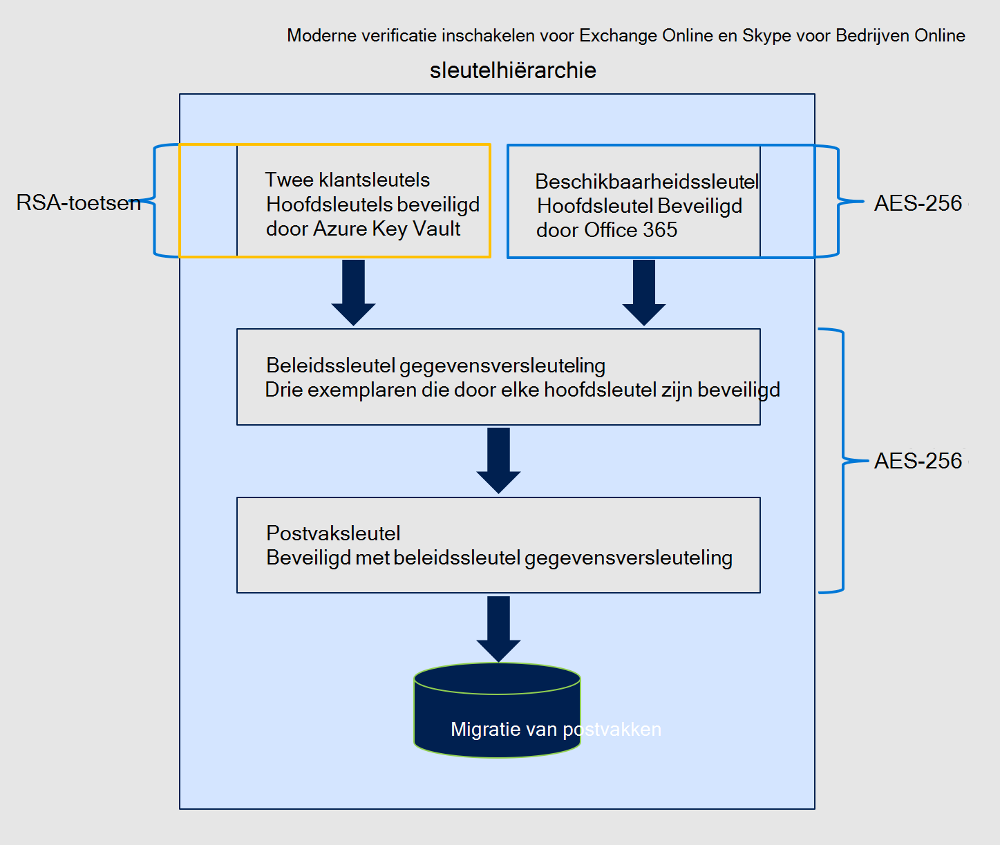

# Serviceversleuteling met klantsleutelService encryption with Customer Key

Microsoft 365 biedt basislijnversleuteling, volumeversleuteling die is ingeschakeld via BitLocker en Distributed Key Manager (DKM).Microsoft 365 provides baseline, volume-level encryption enabled through BitLocker and Distributed Key Manager (DKM). Microsoft 365 biedt een extra versleutelingslaag op de toepassingslaag voor uw inhoud.Microsoft 365 offers an added layer of encryption at the application layer for your content. Deze inhoud bevat gegevens uit Exchange Online, Skype voor Bedrijven, SharePoint Online, OneDrive voor Bedrijven en Teams bestanden.This content includes data from Exchange Online, Skype for Business, SharePoint Online, OneDrive for Business, and Teams files. Deze toegevoegde versleutelingslaag wordt serviceversleuteling genoemd.This added layer of encryption is called service encryption.

## Hoe serviceversleuteling, BitLocker en Klantsleutel samenwerkenHow service encryption, BitLocker, and Customer Key work together

Serviceversleuteling zorgt ervoor dat inhoud in rust wordt versleuteld op de servicelaag.Service encryption ensures that content at rest is encrypted at the service layer. Uw gegevens worden altijd in rust versleuteld in de Microsoft 365 **service met BitLocker en DKM.****Your data is always encrypted at rest in the Microsoft 365 service with BitLocker and DKM**. Zie de 'Beveiligings-, privacy- en compliancegegevens' en Hoe Exchange Online uw e-mailgeheimen [beveiligt](exchange-online-secures-email-secrets.md)voor meer informatie.For more information, see the "Security, Privacy, and Compliance Information", and [How Exchange Online secures your email secrets](exchange-online-secures-email-secrets.md). Klantsleutel biedt extra bescherming tegen het weergeven van gegevens door onbevoegde systemen of personeel en vormt een aanvulling op de BitLocker schijfversleuteling in Microsoft-datacenters.Customer Key provides additional protection against viewing of data by unauthorized systems or personnel, and complements BitLocker disk encryption in Microsoft datacenters. Serviceversleuteling is niet bedoeld om te voorkomen dat microsoft-personeel toegang heeft tot klantgegevens.Service encryption is not meant to prevent Microsoft personnel from accessing customer data. Het primaire doel is klanten te helpen bij het voldoen aan wettelijke of nalevingsverplichtingen voor het beheren van hoofdsleutels.The primary purpose is to assist customers in meeting regulatory or compliance obligations for controlling root keys. Klanten machtigen O365-services expliciet om hun versleutelingssleutels te gebruiken om cloudservices met toegevoegde waarde te leveren, zoals eDiscovery, anti-malware, antispam, zoekindexering, enzovoort.Customers explicitly authorize O365 services to use their encryption keys to provide value added cloud services, such as eDiscovery, anti-malware, anti-spam, search indexing, etc.

Klantsleutel is gebaseerd op serviceversleuteling en u kunt versleutelingssleutels leveren en bedienen.Customer Key is built on service encryption and lets you provide and control encryption keys. Microsoft 365 gebruikt deze sleutels om uw gegevens in rust te versleutelen, zoals beschreven in de [Voorwaarden voor Online Services (OST).](https://www.microsoft.com/licensing/product-licensing/products.aspx)Microsoft 365 then uses these keys to encrypt your data at rest as described in the [Online Services Terms (OST)](https://www.microsoft.com/licensing/product-licensing/products.aspx). Met De klantsleutel kunt u voldoen aan nalevingsverplichtingen omdat u de versleutelingssleutels controleert die Microsoft 365 gegevens versleutelen en ontsleutelen.Customer Key helps you meet compliance obligations because you control the encryption keys that Microsoft 365 uses to encrypt and decrypt data.
  
Klantsleutel verbetert de mogelijkheid van uw organisatie om te voldoen aan de vereisten voor naleving die belangrijke afspraken met de cloudserviceprovider specificeren.Customer Key enhances the ability of your organization to meet the demands of compliance requirements that specify key arrangements with the cloud service provider. Met De klantsleutel geeft u de hoofdversleutelingssleutels voor uw Microsoft 365 op het toepassingsniveau.With Customer Key, you provide and control the root encryption keys for your Microsoft 365 data at-rest at the application level. Hierdoor oefent u de controle over de sleutels van uw organisatie uit.As a result, you exercise control over your organization's keys. Als u besluit de service te verlaten, trekt u de toegang tot de hoofdsleutels van uw organisatie in.If you decide to exit the service, you revoke access to your organization's root keys. Voor alle Microsoft 365 services is het inroepen van toegang tot de sleutels de eerste stap op het pad naar gegevensverhaling.For all Microsoft 365 services, revoking access to the keys is the first step on the path towards data deletion. Als u de toegang tot de sleutels inroept, zijn de gegevens onleesbaar voor de service.By revoking access to the keys, the data is unreadable to the service.

## Klantsleutel versleutelt gegevens in rust in Office 365Customer Key encrypts data at rest in Office 365

Met behulp van de door u op te geven sleutels versleutelt Klantsleutel op toepassingsniveau:Using keys you provide, Customer Key at the application level encrypts:

- SharePoint Online, OneDrive voor Bedrijven en Teams bestanden.SharePoint Online, OneDrive for Business, and Teams files.
- Bestanden die zijn geüpload naar OneDrive voor Bedrijven.Files uploaded to OneDrive for Business.
- Exchange Online inhoud van het postvak, inclusief inhoud van e-mail, agenda-items en de inhoud in e-mailbijlagen.Exchange Online mailbox content including e-mail body content, calendar entries, and the content within email attachments.
- Tekstgesprekken uit Skype voor Bedrijven.Text conversations from Skype for Business.

We bieden momenteel geen klantcontrole over de versleutelingssleutels voor Skype-vergadering Broadcast en Skype-vergadering inhoud uploaden.We don't currently offer customer control of the encryption keys for Skype Meeting Broadcast and Skype Meeting content uploads. In plaats daarvan wordt deze inhoud versleuteld samen met alle andere inhoud in Office 365.Instead, this content is encrypted along with all other content in Office 365.

### Klantcode met hybride implementatiesCustomer Key with hybrid deployments

Klantsleutel versleutelt alleen gegevens in rust in de cloud.Customer Key only encrypts data at rest in the cloud. Klantcode werkt niet om uw on-premises postvakken en bestanden te beveiligen.Customer Key does not work to protect your on-premises mailboxes and files. U kunt uw on-premises gegevens versleutelen met een andere methode, zoals BitLocker.You can encrypt your on-premises data using another method, such as BitLocker.

## Informatie over het beleid voor gegevensversleuteling (DEP)About the data encryption policy (DEP)

Een gegevensversleutelingsbeleid definieert de versleutelingshiërarchie om gegevens te versleutelen met behulp van elk van de sleutels die u verstrekt, evenals de beschikbaarheidssleutel die door Microsoft is beveiligd.A data encryption policy defines the encryption hierarchy to encrypt data using each of the keys you provide as well as the availability key protected by Microsoft. U maakt DEP's met PowerShell-cmdlets, die voor elke service verschillen, en wijst deze DEP's toe om toepassingsgegevens te versleutelen.You create DEPs using PowerShell cmdlets, which are different for each service, and assign those DEPs to encrypt application data. Bijvoorbeeld:For example:

**Exchange Online en Skype voor Bedrijven** U kunt maximaal 50 DEP's per tenant maken.**Exchange Online and Skype for Business** You can create up to 50 DEPs per tenant. U koppelt DEP's aan uw klantsleutels in Azure Key Vault en wijst vervolgens DEP's toe aan afzonderlijke postvakken.You associate DEPs to your Customer Keys in Azure Key Vault and then assign DEPs to individual mailboxes. Wanneer u een DEP aan een postvak toewijst:When you assign a DEP to a mailbox:

- het postvak is gemarkeerd voor een postvak verplaatsen.the mailbox is marked for a mailbox move. Op basis van prioriteiten in Microsoft 365 zoals hier wordt [beschreven, verplaatst u aanvragen in de Microsoft 365 service.](/exchange/mailbox-migration/office-365-migration-best-practices#move-requests-in-the-office-365-service)Based on priorities in Microsoft 365 as described here [Move requests in the Microsoft 365 service](/exchange/mailbox-migration/office-365-migration-best-practices#move-requests-in-the-office-365-service).

- De versleuteling vindt plaats terwijl het postvak wordt verplaatst.The encryption takes place while the mailbox is moved. Sta 72 uur toe dat het postvak wordt versleuteld met de nieuwe DEP.Allow 72 hours for the mailbox to become encrypted with the new DEP. Als de postvakken niet zijn versleuteld na 72 uur te hebben gewacht vanaf het moment dat u de DEP hebt toegewezen, neem dan contact op met Microsoft.If the mailboxes aren't encrypted after waiting 72 hours from the time you assigned the DEP, contact Microsoft.

Later kunt u het DEP vernieuwen of een ander DEP toewijzen aan het postvak, zoals beschreven in Klantsleutel beheren [voor Office 365.](customer-key-manage.md)Later, you can either refresh the DEP or assign a different DEP to the mailbox as described in [Manage Customer Key for Office 365](customer-key-manage.md). Elk postvak moet over de juiste licenties zijn om een DEP toe te wijzen.Each mailbox must have appropriate licenses in order to assign a DEP. Zie Voordat u Klantcode in stelt voor meer informatie over [licenties.](customer-key-set-up.md#before-you-set-up-customer-key)For more information about licensing, see [Before you set up Customer Key](customer-key-set-up.md#before-you-set-up-customer-key).

> [!NOTE]
> De DEP kan worden toegepast op een gedeeld postvak, een postvak in een openbare map en een Microsoft 365-groepspostvak voor tenants die voldoen aan de licentievereiste voor gebruikerspostvakken, hoewel sommige van deze postvakken geen toegewezen licentie kunnen zijn (postvak voor openbare mappen en Microsoft 365 groepspostvak) of een licentie nodig hebben voor het vergroten van de opslag (gedeeld postvak).The DEP can be applied to a shared mailbox, public folder mailbox, and Microsoft 365 group mailbox for tenants that meet the licensing requirement for user mailboxes, even though some of these mailbox types cannot be an assigned license (public folder mailbox and Microsoft 365 group mailbox) or need a license for increasing storage (shared mailbox).

**SharePoint Online, OneDrive voor Bedrijven en Teams bestanden** Als u de functie multi-geo gebruikt, kunt u maximaal één DEP per geo maken voor uw organisatie.**SharePoint Online, OneDrive for Business, and Teams files** If you're using the multi-geo feature, you can create up to one DEP per geo for your organization. U kunt verschillende klantsleutels voor elke geo gebruiken.You can use different Customer Keys for each geo. Als u de functie multi-geo niet gebruikt, kunt u slechts één DEP per tenant maken.If you're not using the multi-geo feature, you can only create one DEP per tenant. Wanneer u de DEP toewijst, wordt de versleuteling automatisch gestart, maar kan het enige tijd duren om de versleuteling te voltooien.When you assign the DEP, encryption begins automatically but can take some time to complete. Raadpleeg de details in [Klantsleutel instellen.](customer-key-set-up.md)Refer to the details in [Set up Customer Key](customer-key-set-up.md).

## De service verlatenLeaving the service

Klantsleutel helpt u bij het voldoen aan nalevingsverplichtingen doordat u uw sleutels kunt intrekken wanneer u de service Microsoft 365 verlaten.Customer Key assists you in meeting compliance obligations by allowing you to revoke your keys when you leave the Microsoft 365 service. Wanneer u uw sleutels int als onderdeel van het verlaten van de service, wordt de beschikbaarheidssleutel verwijderd, wat resulteert in cryptografische verwijdering van uw gegevens.When you revoke your keys as part of leaving the service, the availability key is deleted resulting in cryptographic deletion of your data. Cryptografische verwijdering verkleint het risico op gegevensmanie, wat belangrijk is voor het voldoen aan zowel beveiligings- als nalevingsverplichtingen.Cryptographic deletion mitigates the risk of data remanence which is important for meeting both security and compliance obligations. Zie Uw sleutels intrekken en het proces voor het verwijderen van gegevens starten voor informatie over het proces voor het verwijderen van gegevens en het intrekken van [sleutels.](customer-key-manage.md#revoke-your-keys-and-start-the-data-purge-path-process)For information about the data purge process and key revocation, see [Revoke your keys and start the data purge path process](customer-key-manage.md#revoke-your-keys-and-start-the-data-purge-path-process).

### Versleutelingscodes die door klantsleutel worden gebruiktEncryption ciphers used by Customer Key

Klantsleutel gebruikt diverse versleutelingscodes om sleutels te versleutelen, zoals wordt weergegeven in de volgende cijfers.Customer Key uses a variety of encryption ciphers to encrypt keys as shown in the following figures.

#### Versleutelingssleutels die worden gebruikt om sleutels voor Exchange Online en Skype voor BedrijvenEncryption ciphers used to encrypt keys for Exchange Online and Skype for Business

#### Versleutelingscodes die worden gebruikt om sleutels te versleutelen voor SharePoint Online OneDrive voor Bedrijven en Teams bestandenEncryption ciphers used to encrypt keys for SharePoint Online, OneDrive for Business, and Teams files

## Verwante artikelenRelated articles

- [Klantsleutel instellenSet up Customer Key](customer-key-set-up.md)

- [Klantcode beherenManage Customer Key](customer-key-manage.md)

- [Een klantsleutel of een beschikbaarheidssleutel rollen of draaienRoll or rotate a Customer Key or an availability key](customer-key-availability-key-roll.md)

- [Meer informatie over de beschikbaarheidssleutelLearn about the availability key](customer-key-availability-key-understand.md)

- [Klanten-lockboxCustomer Lockbox](customer-lockbox-requests.md)

- [ServiceversleutelingService Encryption](office-365-service-encryption.md)