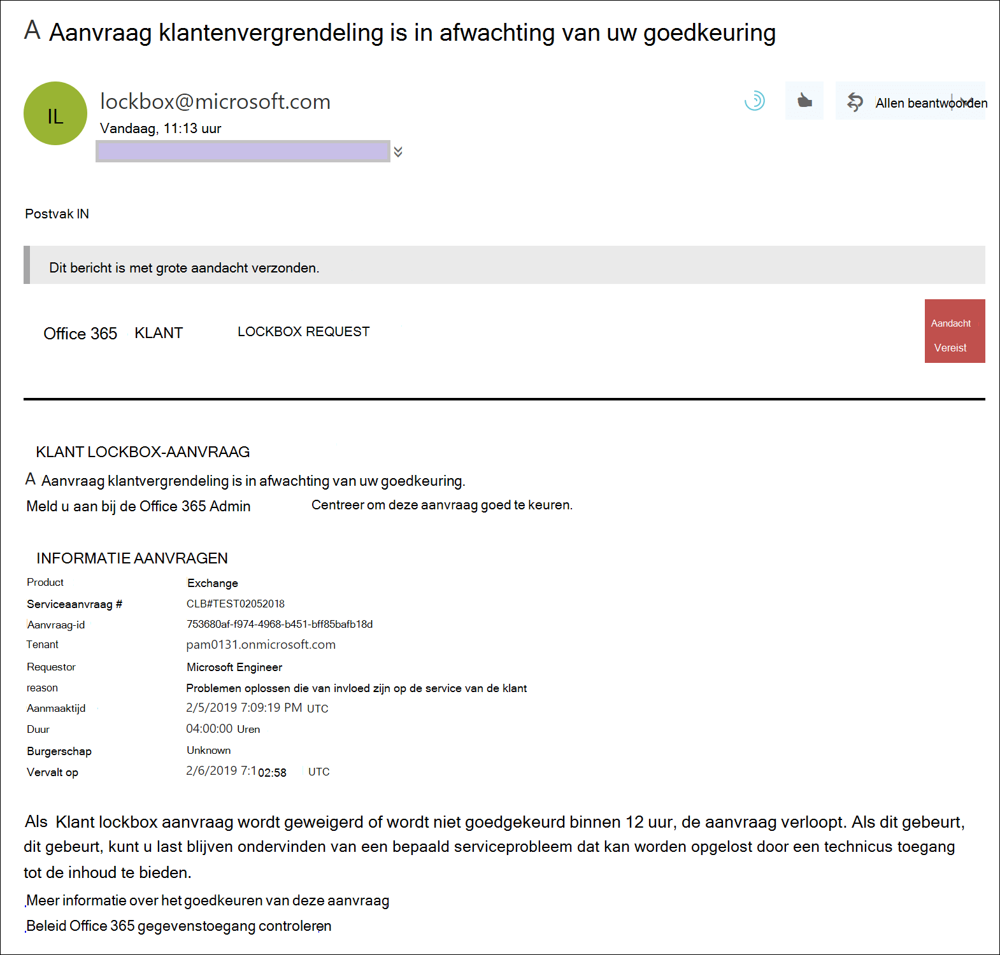
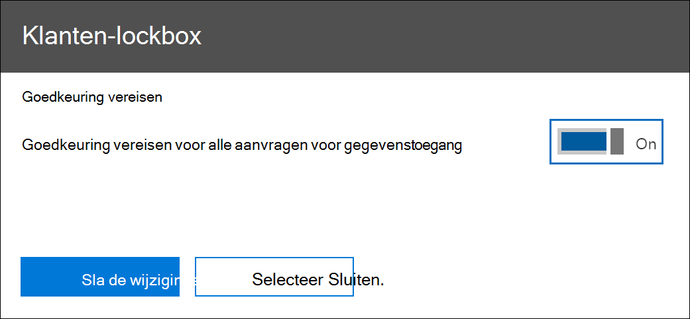
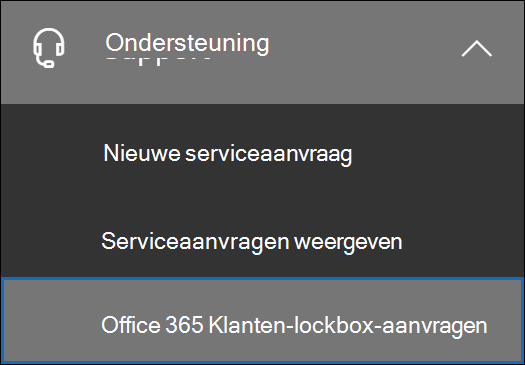
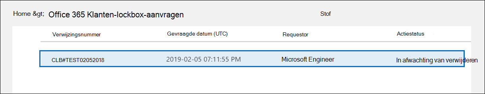
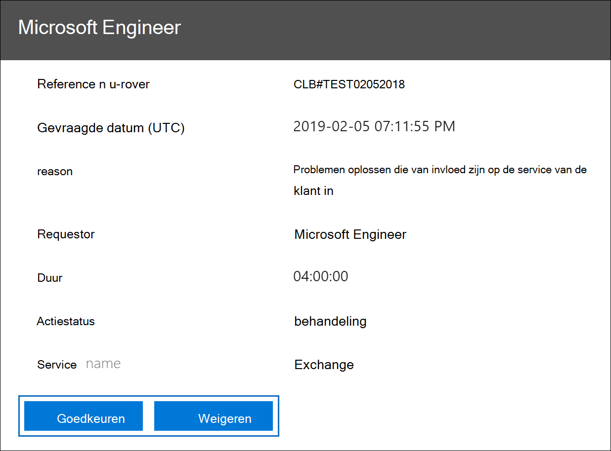
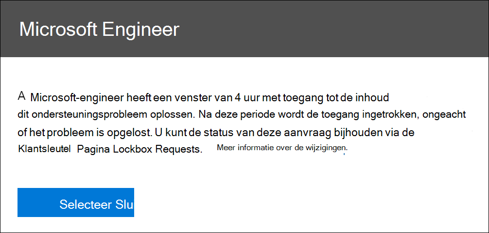
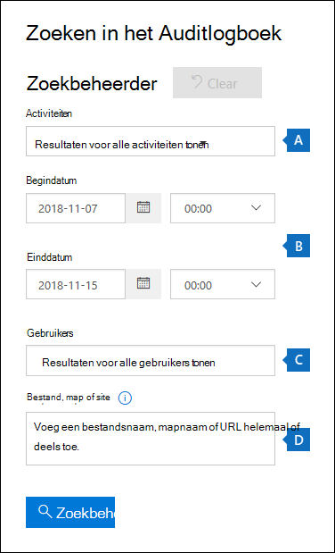
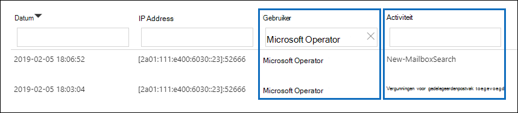
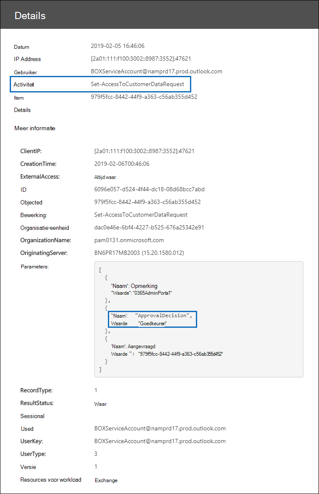

# Klanten lockbox in Office 365Customer Lockbox in Office 365

Dit artikel bevat implementatie- en configuratie-richtlijnen voor Customer Lockbox.This article provides deployment and configuration guidance for Customer Lockbox. Customer Lockbox ondersteunt aanvragen voor toegang tot gegevens in Exchange Online, SharePoint Online en OneDrive voor Bedrijven.Customer Lockbox supports requests to access data in Exchange Online, SharePoint Online, and OneDrive for Business. Als u ondersteuning voor andere services wilt aanbevelen, dient u een aanvraag in [Office 365 UserVoice.](https://office365.uservoice.com/)To recommend support for other services, please submit a request at [Office 365 UserVoice](https://office365.uservoice.com/).

Zie de richtlijnen voor Microsoft 365-licentieverlening voor beveiligings- en compliance Microsoft 365 als u de opties wilt bekijken voor het gebruik van Microsoft 365-complianceaanbiedingen, waaronder [deze,](/office365/servicedescriptions/microsoft-365-service-descriptions/microsoft-365-tenantlevel-services-licensing-guidance/microsoft-365-security-compliance-licensing-guidance)&.To see the options for licensing your users to benefit from Microsoft 365 compliance offerings, including this one, as of April 1, 2020, see the [Microsoft 365 licensing guidance for security & compliance](/office365/servicedescriptions/microsoft-365-service-descriptions/microsoft-365-tenantlevel-services-licensing-guidance/microsoft-365-security-compliance-licensing-guidance).

Customer Lockbox zorgt ervoor dat Microsoft geen toegang heeft tot uw inhoud om een servicebewerking uit te voeren zonder uw expliciete goedkeuring.Customer Lockbox ensures that Microsoft cannot access your content to perform a service operation without your explicit approval. Customer Lockbox brengt u in de goedkeuringswerkstroom voor aanvragen voor toegang tot uw inhoud.Customer Lockbox brings you into the approval workflow for requests to access your content.

Af en toe helpen Microsoft-technici bij het oplossen en oplossen van problemen met klanten die zijn gerapporteerd in het ondersteuningsproces.Occasionally, Microsoft engineers help troubleshoot and fix customer reported issues in the support process. Meestal worden problemen opgelost via uitgebreide telemetrie- en debugprogramma's die Microsoft voor haar services heeft.Usually, issues are fixed through extensive telemetry and debugging tools Microsoft has in place for its services. In sommige gevallen moet een Microsoft-technicus echter toegang hebben tot klantinhoud om de hoofdoorzaak te bepalen en het probleem op te lossen.However, some cases require a Microsoft engineer to access customer content to determine the root cause and fix the issue. Voor Customer Lockbox moet de technicus toegang aanvragen bij de klant als laatste stap in de goedkeuringswerkstroom.Customer Lockbox requires the engineer to request access from the customer as a final step in the approval workflow. Dit biedt organisaties de mogelijkheid om deze aanvragen goed te keuren of te weigeren en directe toegangsbeheer te bieden aan de klant.This gives organizations the option to approve or deny these requests, and provide direct-access control to the customer.

### Overzichtsvideo klantenvergrendelingCustomer Lockbox overview video

> [!VIDEO https://www.microsoft.com/videoplayer/embed/8fecf10b-1f03-4849-8b67-76d3d2a43f26?autoplay=false]

## Werkstroom KlantenvergrendelingCustomer Lockbox workflow

In de volgende stappen wordt een overzicht van de gebruikelijke werkstroom beschreven wanneer een Microsoft-engineer een klantvergrendelingsaanvraag start:The following steps outline the typical workflow when a Microsoft engineer initiates a Customer Lockbox request:

1. Iemand bij een organisatie ervaart een probleem met zijn Microsoft 365 postvak.Someone at an organization experiences an issue with their Microsoft 365 mailbox.

2. Nadat de gebruiker het probleem heeft opgelost, maar het probleem niet kan oplossen, wordt er een ondersteuningsaanvraag geopend met Microsoft Support.After the user troubleshoots the issue, but can't fix it, they open a support request with Microsoft Support.

3. Een ondersteuningsmedewerker van Microsoft controleert de serviceaanvraag en bepaalt of u toegang moet krijgen tot de tenant van de organisatie om het probleem in de Exchange Online.A Microsoft support engineer reviews the service request and determines a need to access the organization's tenant to repair the issue in Exchange Online.

4. De ondersteuningstechnicus van Microsoft meldt zich aan bij het aanvraagprogramma Customer Lockbox en doet een aanvraag voor gegevenstoegang met de tenantnaam van de organisatie, het serviceaanvraagnummer en de geschatte tijd dat de technicus toegang nodig heeft tot de gegevens.The Microsoft support engineer logs into the Customer Lockbox request tool and makes a data access request that includes the organization's tenant name, service request number, and the estimated time the engineer needs access to the data.

5. Nadat een Microsoft Support Manager de aanvraag heeft goedgekeurd, stuurt Customer Lockbox de aangewezen goedkeurder bij de organisatie een e-mailmelding over de in behandeling zijnde toegangsaanvraag van Microsoft.After a Microsoft Support manager approves the request, Customer Lockbox sends the designated approver at the organization an email notification about the pending access request from Microsoft.

    

   Iedereen aan wie de rol van beheerder van [customer lockbox access](/office365/admin/add-users/about-admin-roles) is toegewezen in Microsoft 365 beheercentrum, kan aanvragen voor Klantenvergrendeling goedkeuren.Anyone who is assigned the [Customer Lockbox access approver](/office365/admin/add-users/about-admin-roles) admin role in Microsoft 365 admin center can approve Customer Lockbox requests.

6. De goedkeurder meldt zich aan bij het Microsoft 365 en keurt de aanvraag goed.The approver signs in to the Microsoft 365 admin center and approves the request. Met deze stap wordt een auditrecord gemaakt die beschikbaar is door in het auditlogboek te zoeken.This step triggers the creation of an audit record available by searching the audit log. Zie Aanvragen voor klantenvergrendeling controleren voor [meer informatie.](#auditing-customer-lockbox-requests)For more information, see [Auditing Customer Lockbox requests](#auditing-customer-lockbox-requests).

   Als de klant de aanvraag binnen 12 uur weigert of de aanvraag niet goedkeurt, verloopt de aanvraag en wordt er geen toegang verleend aan de Microsoft-engineer.If the customer rejects the request or doesn't approve the request within 12 hours, the request expires and no access is granted to the Microsoft engineer.

   > [!IMPORTANT]
   > Microsoft bevat geen koppelingen in e-mailmeldingen van Customer Lockbox waarvoor u zich moet aanmelden bij Office 365.Microsoft does not include any links in Customer Lockbox email notifications requiring you to sign in to Office 365.

7. Nadat de goedkeurder van de organisatie de aanvraag heeft goedgekeurd, ontvangt de Microsoft-engineer het goedkeuringsbericht, meldt hij zich aan bij de tenant in Exchange Online en lost hij het probleem van de klant op.After the approver from the organization approves the request, the Microsoft engineer receives the approval message, logs into the tenant in Exchange Online, and fixes the customer's issue. Microsoft-technici hebben de gevraagde duur om het probleem op te lossen waarna de toegang automatisch wordt ingetrokken.Microsoft engineers have the requested duration to fix the issue after which the access is automatically revoked.

> [!NOTE]
> Alle acties die door een Microsoft-technicus worden uitgevoerd, worden geregistreerd in het auditlogboek.All actions performed by a Microsoft engineer are logged in the audit log. U kunt deze auditrecords zoeken en controleren.You can search for and review these audit records.

## Klantenvergrendelingsverzoeken in- of uitschakelenTurn Customer Lockbox requests on or off

U kunt de besturingselementen voor het Klantenvergrendelingsvak in het Microsoft 365 in.You can turn on Customer Lockbox controls in the Microsoft 365 admin center. Wanneer u Customer Lockbox in- of uitstijt, moet Microsoft de goedkeuring van uw organisatie verkrijgen voordat u toegang krijgt tot de inhoud van uw tenant.When you turn on Customer Lockbox, Microsoft must obtain your organization's approval before accessing any of your tenant's content.

1. Ga naar en meld u aan met  een werk- of schoolaccount dat is toegewezen aan de globale beheerder of de rol van de klantverbinder voor toegang tot Het postvak [https://admin.microsoft.com](https://admin.microsoft.com) IN.Using a work or school account that has either the global administrator or the **Customer Lockbox access approver** role assigned, go to [https://admin.microsoft.com](https://admin.microsoft.com) and sign in.

2. Kies **Instellingen > Org Instellingen.**Choose **Settings > Org Settings**.

3. Selecteer **Beveiligingsfunctie & Privacy** Customer  >  **Lockbox** Bewerken en verplaats de schakelknop naar Aan of Uit om de functie in of uit te  >  schakelen.  Select **Security & Privacy** > **Customer Lockbox** > **Edit**, and then move the toggle to **On** or **Off** to turn the feature on or off.

    

## Een aanvraag voor klantenvergrendeling goedkeuren of weigerenApprove or deny a Customer Lockbox request

1. Ga naar en meld u aan met  een werk- of schoolaccount dat is toegewezen aan de globale beheerder of de rol van de klantverbinder voor toegang tot Het postvak [https://admin.microsoft.com](https://admin.microsoft.com) IN.Using a work or school account that has either the global administrator or the **Customer Lockbox access approver** role assigned, go to [https://admin.microsoft.com](https://admin.microsoft.com) and sign in.

2. Kies **Ondersteuning voor > Klantenvergrendelingsverzoeken.**Choose **Support > Customer Lockbox Requests**.

    

    Er wordt een lijst met klantvergrendelingsaanvragen weergegeven.A list of Customer Lockbox requests displays.

    

3. Selecteer een klantvergrendelingsaanvraag en kies **goedkeuren of** **Weigeren.**Select a Customer Lockbox request, and then choose **Approve** or **Deny**.

    

    Er wordt een bevestigingsbericht weergegeven over de goedkeuring van de aanvraag voor het Klantenvergrendelingsvak.A confirmation message about the approval of the Customer Lockbox request displays.

    

> [!NOTE]
> Gebruik de Set-AccessToCustomerDataRequest cmdlet voor het goedkeuren, weigeren of annuleren van Microsoft 365 klantenvergrendelingsverzoeken die de toegang tot uw gegevens bepalen door ondersteuningstechnici van Microsoft.Use the Set-AccessToCustomerDataRequest cmdlet to approve, deny, or cancel Microsoft 365 customer lockbox requests that control access to your data by Microsoft support engineers. Zie [Set-AccessToCustomerDataRequest](/powershell/module/exchange/set-accesstocustomerdatarequest)voor meer informatie.For more information, see [Set-AccessToCustomerDataRequest](/powershell/module/exchange/set-accesstocustomerdatarequest).

## Aanvragen voor klantenvergrendeling controlerenAuditing Customer Lockbox requests

Auditrecords die overeenkomen met de aanvragen voor Klantenvergrendeling worden geregistreerd in het auditlogboek.Audit records that correspond to the Customer Lockbox requests are logged in the audit log. U kunt deze logboeken openen met behulp van het [zoekprogramma voor auditlogboeken](search-the-audit-log-in-security-and-compliance.md) in & compliancecentrum.You can access these logs by using the [audit log search tool](search-the-audit-log-in-security-and-compliance.md) in the Security & Compliance Center. Acties met betrekking tot het accepteren of weigeren van een aanvraag voor het Klantenvergrendelingsvak en acties die worden uitgevoerd door Microsoft-technici (wanneer toegangsaanvragen worden goedgekeurd) worden ook geregistreerd in het auditlogboek.Actions related to accepting or denying a Customer Lockbox request and actions performed by Microsoft engineers (when access requests are approved) are also logged in the audit log. U kunt deze auditrecords zoeken en controleren.You can search for and review these audit records.

### In het auditlogboek zoeken naar activiteiten met betrekking tot klantvergrendelingsaanvragenSearch the audit log for activity related to Customer Lockbox requests

Voordat u het auditlogboek kunt gebruiken om aanvragen voor Klantenvergrendeling bij te houden, moet u enkele stappen uitvoeren om auditlogboekregistratie in te stellen.Before you can use the audit log to track requests for Customer Lockbox, there are some steps you need to take to set up audit logging. Zie Het auditlogboek doorzoeken in het beveiligings- & [compliancecentrum voor meer informatie.](/office365/securitycompliance/search-the-audit-log-in-security-and-compliance#before-you-begin)For more information, see [Search the audit log in the Security & Compliance Center](/office365/securitycompliance/search-the-audit-log-in-security-and-compliance#before-you-begin). Nadat u de installatie hebt voltooid, gebruikt u deze stappen om een zoekquery voor auditlogboek te maken om auditrecords met betrekking tot Customer Lockbox te retourneren:Once you've completed setup, use these steps to create an audit log search query to return audit records related to Customer Lockbox:

1. Ga naar [https://protection.office.com](https://protection.office.com).Go to [https://protection.office.com](https://protection.office.com).
  
2. Meld u aan met uw werk- of schoolaccount.Sign in using your work or school account.

3. Kies in het linkerdeelvenster van het & Compliancecentrum de optie **Zoeken & zoeken in** het  >  **auditlogboek.**In the left pane of the Security & Compliance Center, choose **Search & investigation** > **Audit log search**.

    De **zoekpagina Auditlogboek** wordt weergegeven.The **Audit log search** page displays.

    
  
4. De volgende zoekcriteria configureren:Configure the following search criteria:

    1. **Activiteiten:** Laat dit veld leeg zodat de zoekopdracht auditrecords retourneert voor alle activiteiten.**Activities** - Leave this field blank so that the search returns audit records for all activities. Dit is nodig om controlerecords te retourneren die betrekking hebben op aanvragen voor Klantenvergrendeling en bijbehorende activiteiten die door Microsoft-technici zijn uitgevoerd.This is necessary to return any audit records related to Customer Lockbox requests and corresponding activity performed by Microsoft engineers.

    1. **Begindatum** en **einddatum:** selecteer een datum en tijdbereik om de gebeurtenissen weer te geven die binnen die periode hebben plaatsgevonden.**Start date** and **End date** - Select a date and time range to display the events that occurred within that period.

    1. **Gebruikers:** laat dit veld leeg.**Users** - Leave this field blank.

    1. **Bestand, map of site:** laat dit veld leeg.**File, folder, or site** - Leave this field blank.

5. Klik **op Zoeken** om de zoekopdracht uit te voeren met behulp van uw zoekcriteria.Click **Search** to run the search using your search criteria.

    De zoekresultaten worden geladen en na enkele ogenblikken worden ze weergegeven onder Resultaten **op** de **zoekpagina** auditlogboek.The search results are loaded, and after a few moments they are displayed under **Results** on the **Audit log search** page.

6. Klik **op Resultaten filteren** op de pagina met zoekresultaten en ga op een van de volgende dingen te werk:Click **Filter results** on the search results page, and do one of the following things:

   - Als u auditrecords wilt weergeven die betrekking hebben op een goedkeurder in uw  organisatie, waarmee u een aanvraag voor klantenvergrendeling goedkeurt of weigert: Typ in het vak onder de kolom **Activiteit Set-AccessToCustomerDataRequest**.To display audit records related to an approver in your organization approving or denying a Customer Lockbox request: In the box under the **Activity** column, type **Set-AccessToCustomerDataRequest**.

   - Als u auditrecords wilt weergeven die betrekking hebben op een Microsoft-technicus  die acties uitwerkt in reactie op een goedgekeurde aanvraag voor klantenvergrendeling: Typ Microsoft Operator in het vak onder de kolom **Gebruiker.**To display audit records related to a Microsoft engineer performing actions in response to an approved Customer Lockbox request: In the box under the **User** column, type **Microsoft Operator**. In **de kolom** Activiteit wordt de actie weergegeven die door de technicus is uitgevoerd.The **Activity** column displays the action performed by the engineer.

      

7. Klik in de lijst met resultaten op een auditrecord om deze weer te geven.In the list of results, click an audit record to display it.

### Auditrecord voor een toegangsaanvraag voor KlantenvergrendelingAudit record for a Customer Lockbox access request

Wanneer een persoon in uw organisatie een aanvraag voor klantenvergrendeling goedkeurt of ontkent, wordt er een auditrecord geregistreerd in het auditlogboek.When a person in your organization approves or denies a Customer Lockbox request, an audit record is logged in the audit log. Deze record bevat de volgende informatie.This record contains the following information.

| De eigenschap AuditrecordAudit record property| BeschrijvingDescription|
|:---------- |:----------|
| DatumDate       | De datum en tijd waarop de aanvraag voor het Klantenvergrendelingsvak is goedgekeurd of geweigerd.The date and time when the Customer Lockbox request was approved or denied.
| IP-adresIP address | Het IP-adres van de computer die de goedkeurder heeft gebruikt om een aanvraag goed te keuren of te weigeren.The IP address of the machine the approver used to approve or deny a request. |
| GebruikerUser       | Het serviceaccount BOXServiceAccount@ \[ customerforest \] .prod.outlook.com.The service account BOXServiceAccount@\[customerforest\].prod.outlook.com.            |
| ActiviteitActivity   | Set-AccessToCustomerDataRequest; Dit is de controleactiviteit die wordt geregistreerd wanneer u een aanvraag voor klantenvergrendeling goedkeurt of weigert.Set-AccessToCustomerDataRequest; this is the auditing activity that is logged when you approve or deny a Customer Lockbox request.                                |
| ItemItem       | De Guid van de aanvraag voor het klantenvergrendelingsvakThe Guid of the Customer Lockbox request                             |

In de volgende schermafbeelding ziet u een voorbeeld van een auditlogboekrecord die overeenkomt met een goedgekeurde aanvraag voor klantenvergrendeling.The following screenshot shows an example of an audit log record that corresponds to an approved Customer Lockbox request. Als een klantvergrendelingsaanvraag is geweigerd, is de waarde van de parameter **ApprovalDecision** **Weigeren**.If a Customer Lockbox request was denied, then the value of **ApprovalDecision** parameter would be **Deny**.

> [!TIP]
> Als u meer gedetailleerde informatie wilt weergeven in een auditrecord, klikt u op **Meer informatie.**To display more detailed information in an audit record, click **More information**.

### Auditrecord voor een actie uitgevoerd door een Microsoft-engineerAudit record for an action performed by a Microsoft engineer

De acties die door een Microsoft-technicus worden uitgevoerd nadat een aanvraag voor klantenvergrendeling is goedgekeurd (en die kunnen leiden tot toegang tot klantinhoud) worden geregistreerd in het auditlogboek.The actions performed by a Microsoft engineer after a Customer Lockbox request is approved (and that may result in accessing customer content) are logged in the audit log. Deze records bevatten de volgende informatie.These records contain the following information.

| De eigenschap AuditrecordAudit record property| BeschrijvingDescription|
|:---------- |:----------|
| DatumDate       | Datum waarop de actie is uitgevoerd.Date time when the action was performed. Houd er rekening mee dat de tijd dat deze actie is uitgevoerd binnen 4 uur na de goedkeuring van de aanvraag voor het Klantenvergrendelingsvak is uitgevoerd.Note that the time that this action was performed will be within 4 hours of when the Customer Lockbox request was approved.              |
| IP-adresIP address | Het IP-adres van de computer die Door Microsoft is gebruikt.The IP Address of the machine Microsoft engineer used. |
| GebruikerUser       | Microsoft Operator; deze waarde geeft aan dat deze record is gerelateerd aan een aanvraag voor klantenvergrendeling.Microsoft Operator; this value indicates that this record is related to a Customer Lockbox request.                                  |
| ActiviteitActivity   | Naam van de activiteit die is uitgevoerd door de Microsoft-engineer.Name of the activity performed by the Microsoft engineer.|
| ItemItem       | \<empty\>                                             |

## Veelgestelde vragenFrequently asked questions

#### Op Microsoft 365 services is Customer Lockbox van toepassing?Which Microsoft 365 services does Customer Lockbox apply to?

Customer Lockbox wordt momenteel ondersteund in Exchange Online, SharePoint Online en OneDrive voor Bedrijven.Customer Lockbox is currently supported in Exchange Online, SharePoint Online, and OneDrive for Business.

#### Is Customer Lockbox beschikbaar voor alle klanten?Is Customer Lockbox available to all customers?

Customer Lockbox is opgenomen in Microsoft 365- of Office 365 E5-abonnementen en kan worden toegevoegd aan andere abonnementen met een invoegabonnement voor informatiebescherming en naleving of een advanced compliance-invoegabonnement.Customer Lockbox is included with the Microsoft 365 or Office 365 E5 subscriptions and can be added to other plans with an Information Protection and Compliance or an Advanced Compliance add-on subscription. Zie [Abonnementen en prijzen voor](https://products.office.com/business/office-365-enterprise-e5-business-software) meer informatie.Please see [Plans and pricing](https://products.office.com/business/office-365-enterprise-e5-business-software) for more information.

#### Wat is klantinhoud?What is customer content?

Klantinhoud is de gegevens die zijn gemaakt door gebruikers van Microsoft 365 services en toepassingen.Customer content is the data created by users of Microsoft 365 services and applications. Voorbeelden van klantinhoud zijn:Examples of customer content include:

- E-mailbijlagen of e-mailbijlagenEmail body or email attachments

- SharePoint site-inhoudSharePoint site contents

- Informatie in de body van een SharePoint bestandInformation in the body of a SharePoint file

- Skype voor Bedrijven de bestandsindeling van de presentatieSkype for Business presentation file body

- Chatberichten (chatberichten) of spraakgesprekkenInstant messages (IM) or voice conversations

- Door klanten gegenereerde blob- of gestructureerde opslaggegevens (bijvoorbeeld SQL Containers)Customer-generated blob or structured storage data (for example, SQL Containers)

- Beveiligingsgegevens van klanten (bijvoorbeeld certificaten, versleutelingssleutels en wachtwoorden)Customer-owned security information (for example, certificates, encryption keys, and passwords)

- Gevolgtrekkingen en alle daaropvolgende gevolgtrekkingen, als klantinhoud blijft bestaanInferences, and all subsequent inferences, if customer content remains

Zie het Office 365 vertrouwenscentrum voor [meer Office 365 klantinhoud in Office 365.](https://products.office.com/business/office-365-trust-center-privacy/)For additional information about customer content in Office 365, see the [Office 365 Trust Center](https://products.office.com/business/office-365-trust-center-privacy/).

#### Wie wordt een melding ontvangen wanneer er een verzoek is om toegang te krijgen tot mijn inhoud?Who is notified when there is a request to access my content?

Globale beheerders en iedereen die de rol klantvergrendeling voor toegangstoegang heeft toegewezen, wordt op de hoogte gesteld.Global administrators and anyone assigned the Customer Lockbox access approver admin role are notified. Dit zijn ook dezelfde gebruikers die aanvragen voor Klantenvergrendeling kunnen goedkeuren.These are also the same users who can approve for Customer Lockbox requests.

#### Wie kan ik deze aanvragen in mijn organisatie goedkeuren of weigeren?Who can approve or reject these requests in my organization?

Globale beheerders en iedereen die de rol klantvergrendeling voor toegangstoegang heeft toegewezen, kan aanvragen voor Klantenvergrendeling goedkeuren.Global administrators and anyone assigned the Customer Lockbox access approver admin role can approve Customer Lockbox requests. Klanten bepalen deze roltoewijzingen in hun organisatie.Customers control these role assignments in their organizations.

#### Hoe kan ik me bij Customer Lockbox aan?How do I opt in to Customer Lockbox?

Een globale beheerder kan het postvak Klantvergrendeling inschakelen en configureren in het Microsoft 365 of Microsoft 365 beheercentrum.A global administrator can enable and configure Customer Lockbox in the Microsoft 365 or Microsoft 365 admin center.

#### Als ik een aanvraag voor klantenvergrendeling goedkeur, wat kan de technicus dan doen en hoe weet ik wat de Microsoft-engineer heeft gedaan?If I approve a Customer Lockbox request, what can the engineer do and how will I know what the Microsoft engineer did?

Nadat u een klantvergrendelingsaanvraag hebt goedgekeurd, heeft de Microsoft-engineer deze benodigde bevoegdheden verleend voor toegang tot klantinhoud met behulp van vooraf goedgekeurde cmdlets.After you approve a Customer Lockbox request, the Microsoft engineer granted these necessary privileges to access customer content by using pre-approved cmdlets. Acties die door Microsoft-technici zijn uitgevoerd in reactie op aanvragen voor klantenvergrendeling, worden geregistreerd en toegankelijk in het auditlogboek in het beveiligings- & Compliancecentrum.Actions taken by Microsoft engineers in response to Customer Lockbox requests are logged and accessible in the audit log in the Security & Compliance Center.

#### Hoe weet ik of Microsoft het goedkeuringsproces volgt?How do I know that Microsoft follows the approval process?

U kunt de e-mailgoedkeuringsmeldingen die naar beheerders en goedkeurders in uw organisatie zijn verzonden, kruisen met de aanvraaggeschiedenis klantvergrendeling in het Microsoft 365 beheercentrum.You can cross-reference the email approval notifications sent to admins and approvers in your organization with the Customer Lockbox request history in the Microsoft 365 admin center.

Customer Lockbox is opgenomen in het meest recente [SOC 1 SSAE 16-auditrapport.](https://servicetrust.microsoft.com/ViewPage/MSComplianceGuide?command=Download&downloadType=Document&downloadId=91592749-e86a-43ac-801e-121382614681&docTab=4ce99610-c9c0-11e7-8c2c-f908a777fa4d_SOC%20%2F%20SSAE%2016%20Reports)Customer Lockbox is included in the latest [SOC 1 SSAE 16 audit report](https://servicetrust.microsoft.com/ViewPage/MSComplianceGuide?command=Download&downloadType=Document&downloadId=91592749-e86a-43ac-801e-121382614681&docTab=4ce99610-c9c0-11e7-8c2c-f908a777fa4d_SOC%20%2F%20SSAE%2016%20Reports). Voor meer informatie vindt u de meest recente rapporten in de [Microsoft Service Trust Portal.](https://servicetrust.microsoft.com/ViewPage/MSComplianceGuide?command=Download&downloadType=Document&downloadId=91592749-e86a-43ac-801e-121382614681&docTab=4ce99610-c9c0-11e7-8c2c-f908a777fa4d_SOC%20%2F%20SSAE%2016%20Reports)For more details, you can find the latest reports in the [Microsoft Service Trust Portal](https://servicetrust.microsoft.com/ViewPage/MSComplianceGuide?command=Download&downloadType=Document&downloadId=91592749-e86a-43ac-801e-121382614681&docTab=4ce99610-c9c0-11e7-8c2c-f908a777fa4d_SOC%20%2F%20SSAE%2016%20Reports).

#### Kan Microsoft de lijst met goedkeurders voor mijn tenant wijzigen?Can Microsoft modify the list of approvers for my tenant? Zo niet, hoe wordt dit voorkomen?If not, how is it prevented?

Alleen een globale beheerder in uw organisatie kan opgeven wie klantvergrendelingsaanvragen kan goedkeuren.Only a global administrator in your organization can specify who can approve Customer Lockbox requests. Dat betekent dat alleen de leden van de groep globale beheerders in Azure Active Directory kunnen opgeven wie de aanvraag kan goedkeuren.That means only the members of the Global administrator group in Azure Active Directory can specify who can approve request. Lidmaatschap van de groep Globale beheerder in Azure Active Directory wordt alleen beheerd door uw organisatie.Membership of the Global administrator group in Azure Active Directory is managed only by your organization.

#### Wat moet ik doen als ik meer informatie nodig heb over een aanvraag voor inhoudstoegang om het goed te keuren?What if I need more information about a content access request to approve it?

Elke klantvergrendelingsaanvraag bevat een Microsoft 365 serviceaanvraagnummer.Each Customer Lockbox request contains a Microsoft 365 service request number. U kunt contact opnemen met Microsoft Support en naar dit servicenummer verwijzen voor meer informatie over de aanvraag.You can contact Microsoft Support and reference this service number to get more information about the request.

#### Wanneer een aanvraag voor klantenvergrendeling is goedgekeurd, hoe lang zijn de machtigingen geldig?When a Customer Lockbox request is approved, how long are the permissions valid?

Momenteel is de maximumperiode voor de toegangsmachtigingen die aan de Microsoft-engineer zijn verleend, 4 uur.Currently, the maximum period for the access permissions granted to the Microsoft engineer is 4 hours. De Microsoft-engineer kan ook een kortere periode aanvragen.The Microsoft engineer can also request a shorter period.

#### Hoe kan ik een geschiedenis krijgen van alle klantvergrendelingsaanvragen?How can I get a history of all Customer Lockbox requests?

Alle klantvergrendelingsaanvragen worden bekeken in het Microsoft 365 beheercentrum.All Customer Lockbox requests are viewed in the Microsoft 365 admin center.

#### Hoe correleer ik de aanvragen voor inhoudstoegang met de gerelateerde auditlogboeken?How do I correlate the content access requests with the related audit logs?

De compliancecentrumactiviteitsfeed bevat logboekactiviteiten van Customer Lockbox.The Compliance Center Activity Feed contains log activities of Customer Lockbox. Klanten kunnen de logboekactiviteiten van Customer Lockbox uit de activiteitsfeed kruisen aan de e-mailaanvraag die ze ontvangen.Customers can cross-reference the Customer Lockbox log activities from the activity feed against the email request they receive.

#### Wat gebeurt er als een klant niet reageert op een klantvergrendelingsaanvraag?What happens when a customer doesn't respond to a Customer Lockbox request?

Klantenvergrendelingsaanvragen hebben een standaardduur van 12 uur.Customer Lockbox requests have a default duration of 12 hours. Als u niet binnen 12 uur op een aanvraag reageert, verloopt de aanvraag.If you don't respond to a request within 12 hour, the request expires.

#### Wat doet Microsoft als een klant een aanvraag voor klantenvergrendeling weigert?What does Microsoft do when a customer rejects a Customer Lockbox request?

Als een klant een aanvraag voor klantenvergrendeling weigert, vindt er geen toegang tot klantinhoud plaats.If a customer rejects a Customer Lockbox request, no access to customer content occurs. Als een gebruiker in uw organisatie nog steeds te maken krijgt met een serviceprobleem waarbij Microsoft toegang heeft tot klantinhoud om het probleem op te lossen, kan het serviceprobleem zich voordoen en zal Microsoft de gebruiker hiervan op de hoogte stellen.If a user in your organization continues to experience a service issue requiring Microsoft to access customer content to resolve the issue, then the service issue might persist and Microsoft will inform the user about this.

#### Beschermt Customer Lockbox zich tegen gegevensaanvragen van rechtshandhavingsinstanties of andere derden?Does Customer Lockbox protect against data requests from law enforcement agencies or other third parties?

Nee.No. Microsoft neemt verzoeken van derden voor klantgegevens serieus.Microsoft takes third-party requests for customer data seriously. Als cloudserviceprovider is Microsoft altijd voorstander van de privacy van klantgegevens.As a cloud service provider, Microsoft always advocates for the privacy of customer data. In het geval we een dagvaarding krijgen, probeert Microsoft altijd de derde partij om te leiden naar de klant om de informatie te verkrijgen.In the event we get a subpoena, Microsoft always attempts to redirect the third party to the customer to obtain the information. (Lees Brad Smith's blog: [Bescherm klantgegevens tegen overheidsinkijkers).](https://blogs.microsoft.com/blog/2013/12/04/protecting-customer-data-from-government-snooping/)(Read Brad Smith's blog: [Protecting customer data from government snooping](https://blogs.microsoft.com/blog/2013/12/04/protecting-customer-data-from-government-snooping/)). We publiceren regelmatig gedetailleerde [informatie over](https://www.microsoft.com/corporate-responsibility/lerr) de verzoeken om de wetshandhaving die Microsoft ontvangt.We periodically publish [detailed information](https://www.microsoft.com/corporate-responsibility/lerr) about the law enforcement requests that Microsoft receives.

Zie het [Microsoft Trust Center met](https://www.microsoft.com/trustcenter/default.aspx) betrekking tot gegevensaanvragen van derden en de sectie 'Openbaarmaking van klantgegevens' in de Voorwaarden voor [onlineservices](https://www.microsoft.com/Licensing/product-licensing/products.aspx) voor meer informatie.See the [Microsoft Trust Center](https://www.microsoft.com/trustcenter/default.aspx) regarding third-party data requests and the "Disclosure of Customer Data" section in the [Online Services Terms](https://www.microsoft.com/Licensing/product-licensing/products.aspx) for more information.

#### Hoe zorgt Microsoft ervoor dat een lid van zijn personeel geen permanente toegang heeft tot klantinhoud in Office 365 toepassingen?How does Microsoft ensure that a member of its staff doesn't have standing access to customer content in Office 365 applications?

Microsoft implementeert uitgebreide, preventieve maatregelen via toegangscontrolesystemen en maatregelen om pogingen om deze toegangscontrolesystemen te omzeilen te identificeren en aan te pakken.Microsoft implements extensive preventive measures through access control systems, and detective measures to identify and address attempts to circumvent these access control systems. Microsoft 365 werkt met de principes van de minste bevoegdheden en just-in-time toegang.Microsoft 365 operates with the principles of least privilege and just-in-time access. Daarom hebben geen microsoft-medewerkers toestemming om doorlopend toegang te krijgen tot klantinhoud.Therefore, no Microsoft personnel have permission to access customer content on an ongoing basis. Als er toestemming wordt verleend, is dit voor een beperkte duur.If permission is granted, it is for a limited duration. 

Microsoft 365 gebruikt een toegangsbesturingselementsysteem genaamd *Lockbox* om aanvragen voor machtigingen te verwerken die de mogelijkheid bieden om operationele en beheerfuncties binnen de service uit te voeren.Microsoft 365 uses an access control system called *Lockbox* to process requests for permissions that grant the ability to perform operational and administrative functions within the service. Een operator moet toegang tot klantinhoud aanvragen met Lockbox, waarna een tweede persoon actie moet ondernemen op de aanvraag (bijvoorbeeld goedkeuren) voordat toegang wordt verleend.An operator must request access to customer content using Lockbox, which then requires a second person to take action on the request (e.g., approve it) before access is granted. Die tweede persoon kan de aanvraaggever niet zijn en moet worden aangewezen om toegang tot klantinhoud goed te keuren.That second person can't be the requestor and must be designated to approve access to customer content. Alleen als de aanvraag is goedgekeurd, krijgt de operator tijdelijke toegang tot klantinhoud.Only if the request is approved does the operator acquire temporary access to customer content. Nadat de hoogteperiode is verlopen, wordt de toegang ingetrokken door Lockbox.After the elevation period expires, Lockbox revokes access.

Raadpleeg de Voorwaarden voor [onlineservices voor](https://www.microsoft.com/licensing/product-licensing/products) meer informatie over algemene beveiligingspraktijken van Microsoft.Please refer to the [Online Services Terms](https://www.microsoft.com/licensing/product-licensing/products) for more details about Microsoft general security practices.

#### In welke omstandigheden hebben Microsoft-technici toegang nodig tot mijn inhoud?Under what circumstances do Microsoft engineers need access to my content?

Het meest voorkomende scenario waarbij Microsoft-technici toegang tot klantinhoud nodig hebben, is wanneer de klant een ondersteuningsaanvraag indient die toegang vereist voor probleemoplossing.The most common scenario where Microsoft engineers need access customer content is when the customer makes a support request requiring access for troubleshooting. Een basisprincipe van Microsoft 365 is dat de service werkt zonder microsoft-toegang tot klantinhoud.A foundational principle of Microsoft 365 is that the service operates without Microsoft access to customer content. Bijna alle servicebewerkingen die door Microsoft worden uitgevoerd, zijn volledig geautomatiseerd en de betrokkenheid van mensen wordt sterk gecontroleerd en verwijderd van klantinhoud.Nearly all service operations performed by Microsoft are fully automated and human involvement is highly controlled and abstracted away from customer content. Het doel voor Microsoft 365 is toegang tot klantinhoud om de service te ondersteunen, is pas nodig als de klant een specifieke aanvraag voor Microsoft-toegang goedkeurt.The goal for Microsoft 365 is access to customer content to support the service isn't needed until the customer approves a specific request for Microsoft access.

#### Ik dacht al dat mijn gegevens veilig waren met de Microsoft-cloud, dus waarom heb ik Customer Lockbox nodig?I already thought my data was secure with the Microsoft cloud, so why do I need Customer Lockbox?

Customer Lockbox biedt een extra controlelaag door klanten de mogelijkheid te bieden expliciete toegang te verlenen voor servicebewerkingen.Customer Lockbox provides an extra layer of control by offering customers the ability to give explicit access authorization for service operations. Door aan te tonen dat procedures zijn ingevoerd voor expliciete machtiging voor gegevenstoegang, helpt Customer Lockbox klanten ook om te voldoen aan bepaalde nalevingsverplichtingen, zoals HIPAA en FEDRAMP.By demonstrating that procedures are in place for explicit data access authorization, Customer Lockbox also helps customers meet certain compliance obligations such as HIPAA and FEDRAMP.