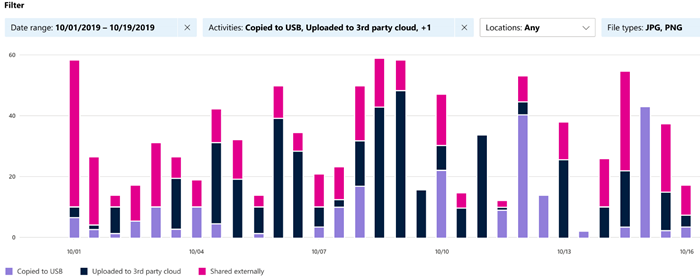

# Aan de slag met de activiteitenverkenner

Het [overzicht van de gegevensclassificatie](data-classification-overview.md) [en](data-classification-content-explorer.md) de tabbladen van de inhoudsverkenner geven u inzicht in welke inhoud is gevonden en gelabeld en waar die inhoud zich vindt. Activiteitsverkenner rondt deze suite met functionaliteit af door u te laten controleren wat er met uw gelabelde inhoud wordt gedaan. Activiteitsverkenner biedt een historische weergave van activiteiten op uw gelabelde inhoud. De activiteitsgegevens worden verzameld uit Microsoft 365 geïntegreerde auditlogboeken, getransformeerd en beschikbaar gesteld in de gebruikersinterface van Activity Explorer. 

Er zijn meer dan 30 verschillende filters beschikbaar voor gebruik, sommige zijn:

- datumbereik
- activiteitstype
- locatie
- gebruiker
- gevoeligheidslabel
- bewaarlabel
- bestandspad
- DLP-beleid

## Vereisten

Aan elk account dat toegang krijgt tot en gebruikmaakt van gegevensclassificatie moet een licentie zijn toegewezen vanuit een van deze abonnementen:

- Microsoft 365 E5
- Office 365 E5
- Geavanceerde hulpprogramma's voor compliance (E5) invoegtoepassing
- Geavanceerde bedreigingsinformatie (E5) invoegtoepassing
- Microsoft 365 E5/A5 Info Protection & Governance
- Microsoft 365 E5/A5 Compliance

### Machtigingen

 Als u toegang wilt krijgen tot het tabblad Activiteitsverkenner, moet aan een account expliciet lidmaatschap zijn toegewezen aan een van deze rollengroepen of expliciet aan de rol zijn toegewezen.

<!--
> [!IMPORTANT]
> Access to Activity explorer via the Security reader or Device Management role groups or other has been removed-->

**Microsoft 365-rollengroepen**

- Globale beheerder
- Beheerder voor naleving
- Beveiligingsbeheerder
- Beheerder van nalevingsgegevens

**Microsoft 365 rollen**

- Beheerder voor naleving
- Beveiligingsbeheerder

## Activiteitstypen

Activiteitsverkenner verzamelt activiteitsgegevens uit de auditlogboeken op meerdere bronnen van activiteiten. Zie [Labeling events available in Activity explorer (Labeling events available in Activity explorer)](data-classification-activity-explorer-available-events.md)voor meer informatie over de labelactiviteit die activiteit maakt voor Activiteitsverkenner.

**Activiteiten voor** gevoeligheidslabels en activiteiten voor het bewaren van etiketten van Office native toepassingen, azure information protection-invoegtoepassingen, SharePoint Online, Exchange Online (alleen gevoeligheidslabels) en OneDrive.  Enkele voorbeelden zijn:

- label toegepast
- label gewijzigd (bijgewerkt, gedegradeerd of verwijderd)
- automatische labelingsimulatie
- bestand gelezen 

**AIP-scanner (Azure Information Protection) en AIP-clients**

- toegepaste beveiliging
- beveiliging gewijzigd
- beveiliging verwijderd
- bestanden die zijn gevonden 

Activiteitenverkenner  verzamelt ook DLP-beleidsgebeurtenissen uit Exchange Online, SharePoint Online, OneDrive, Teams Chat en Kanaal (preview), on-premises SharePoint-mappen en -bibliotheken, on-premises bestandsaandelen en Windows 10-apparaten via **Endpoint Data Loss Prevention (DLP).** Enkele voorbeelden van gebeurtenissen Windows 10 apparaten zijn bestand:

- verwijderingen
- creaties
- gekopieerd naar klembord
- gewijzigd
- gelezen
- afgedrukt
- naam gewijzigd
- gekopieerd naar netwerk delen
- toegankelijk via niet-toegestaan app 

De waarde van het begrijpen van de acties die worden ondernomen met uw gevoelige inhoud met  het label is dat u kunt zien of de besturingselementen die u al hebt gebruikt, zoals preventie van gegevensverlies, effectief zijn of niet. Zo niet, of als u iets onverwachts ontdekt, zoals een groot aantal items met een label en een downgrade, kunt u uw verschillende beleidsregels beheren en nieuwe acties ondernemen om ongewenst gedrag te `highly confidential` `general` beperken.

> [!NOTE]
> Activiteitsverkenner controleert momenteel geen bewaaractiviteiten voor Exchange Online.

## Zie ook

- [Meer informatie over vertrouwelijkheidslabels](sensitivity-labels.md)
- [Meer informatie over bewaarbeleid en retentielabels](retention.md)
- [Meer informatie over typen gevoelige informatie](sensitive-information-type-learn-about.md)
- [Meer informatie over gegevensclassificatie](data-classification-overview.md)
