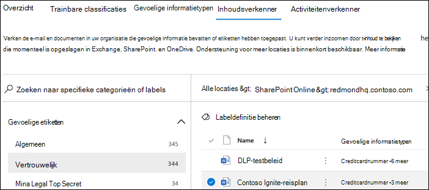

# Aan de slag met de inhoudsverkennerGet started with content explorer

Met de gegevensclassificatie-inhoudsverkenner kunt u de items die op de overzichtspagina zijn samengevat, standaard bekijken.The data classification content explorer allows you to natively view the items that were summarized on the overview page.

## VereistenPrerequisites

Aan elk account dat toegang krijgt tot en gebruikmaakt van gegevensclassificatie moet een licentie zijn toegewezen vanuit een van deze abonnementen:Every account that accesses and uses data classification must have a license assigned to it from one of these subscriptions:

- Microsoft 365 E5Microsoft 365 (E5)
- Office 365 E5Office 365 (E5)
- Geavanceerde hulpprogramma's voor compliance (E5) invoegtoepassingAdvanced Compliance (E5) add-on
- Geavanceerde bedreigingsinformatie (E5) invoegtoepassingAdvanced Threat Intelligence (E5) add-on
- Microsoft 365 E5/A5 Info Protection & GovernanceMicrosoft 365 E5/A5 Info Protection & Governance
- Microsoft 365 E5/A5 ComplianceMicrosoft 365 E5/A5 Compliance

### MachtigingenPermissions

Als u toegang wilt krijgen tot het tabblad Inhoudsverkenner, moet aan een account een lidmaatschap zijn toegewezen voor een van deze rollen of rollengroepen.In order to get access to the content explorer tab, an account must be assigned membership in any one of these roles or role groups. 

**Microsoft 365-rollengroepen****Microsoft 365 role groups**

- Globale beheerderGlobal administrator
- Beheerder voor nalevingCompliance administrator
- BeveiligingsbeheerderSecurity administrator
- Beheerder van nalevingsgegevensCompliance data administrator

> [!IMPORTANT]
> Lidmaatschap van deze rollengroepen betekent niet dat u de lijst met items in Inhoudsverkenner of de inhoud van de items in Inhoudsverkenner kunt bekijken.Membership in these role groups does not allow you to view the list of items in content explorer or to view the contents of the items in content explorer.

### Vereiste machtigingen voor toegang tot items in InhoudsverkennerRequired permissions to access items in content explorer

Toegang tot Inhoudsverkenner wordt sterk beperkt omdat u hiermee de inhoud van gescande bestanden kunt lezen.Access to content explorer is highly restricted because it lets you read the contents of scanned files.

> [!IMPORTANT]
> Deze machtigingen bevatten machtigingen die lokaal zijn toegewezen aan de items, zodat de inhoud kan worden bekeken.These permissions supercede permissions that are locally assigned to the items, which allows viewing of the content. 

Er zijn twee rollen die toegang verlenen tot Inhoudsverkenner. Deze rollen wordt toegekend via het [Beveiligings- en compliancecentrum van Microsoft](https://protection.office.com/permissions):There are two roles that grant access to content explorer and it is granted using the [Microsoft Security & Compliance Center](https://protection.office.com/permissions):

- **Inhoudsverkenner lijstweergave**: met lidmaatschap van deze rollengroep kunt u elk item en de locatie in de lijstweergave bekijken.**Content Explorer List viewer**: Membership in this role group allows you to see each item and its location in list view. De `data classification list viewer`-rol is vooraf toegewezen aan deze rollengroep.The `data classification list viewer` role has been pre-assigned to this role group.

- **Inhoudsverkenner inhoudsweergave**: met lidmaatschap van deze rollengroep kunt u de inhoud van elk item in de lijst bekijken.**Content Explorer Content viewer**: Membership in this role group allows you to view the contents of each item in the list. De `data classification content viewer`-rol is vooraf toegewezen aan deze rollengroep.The `data classification content viewer` role has been pre-assigned to this role group.

Het account dat u gebruikt voor toegang tot Inhoudsverkenner, moet zich in een van de rollengroepen of in beide rollengroepen bevinden.The account you use to access content explorer must be in one or both of the role groups. Dit zijn onafhankelijke rollengroepen en zijn niet cumulatief.These are independent role groups and are not cumulative. Als u bijvoorbeeld een account de mogelijkheid wilt bieden om de items en hun locaties alleen te bekijken, verleent u de viewerrechten voor de Inhoudsverkenner-lijst.For example, if you want to grant an account the ability to view the items and their locations only, grant Content Explorer List viewer rights. Als u wilt dat dit account ook de inhoud van de items in de lijst kan bekijken, verleent u inhoudsviewerrechten voor Inhoudsverkenner.If you want that same account to also be able to view the contents of the items in the list, grant Content Explorer Content viewer rights as well.

U kunt een van beide rollen of beide toewijzen aan een aangepaste rollengroep om de toegang tot Inhoudsverkenner aan te passen.You can also assign either or both of the roles to a custom role group to tailor access to content explorer.

Een globale beheerder, compliancebeheerder of gegevensbeheerder kan het benodigde lidmaatschap van de Inhoudsverkenner-lijstviewer en inhoudsverkenner voor inhoudsviewer toewijzen.A Global admin, Compliance admin, or Data admin can assign the necessary Content Explorer List Viewer, and Content Explorer Content Viewer role group membership.

## InhoudsverkennerContent explorer

Inhoudsverkenner toont een huidige weergave van de items met een vertrouwelijkheidslabel of retentielabel, en items die binnen uw organisatie zijn geclassificeerd als een type gevoelige informatie.Content explorer shows a current snapshot of the items that have a sensitivity label, a retention label or have been classified as a sensitive information type in your organization.

### Typen gevoelige informatieSensitive information types

Met een [DLP-beleid](dlp-learn-about-dlp.md) wordt gevoelige informatie beschermd, die is gedefinieerd als een **type gevoelige informatie**.A [DLP policy](dlp-learn-about-dlp.md) can help protect sensitive information, which is defined as a **sensitive information type**. Microsoft 365 bevat [definities voor veelvoorkomende typen gevoelige informatie die](sensitive-information-type-entity-definitions.md) uit veel verschillende regio's die u direct kunt gebruiken.Microsoft 365 includes [definitions for many common sensitive information types](sensitive-information-type-entity-definitions.md) from across many different regions that are ready for you to use. Bijvoorbeeld een creditcardnummer, bankrekeningnummers, nationale identiteitsnummers en Windows Live ID-servicenummers.For example, a credit card number, bank account numbers, national ID numbers, and Windows Live ID service numbers.

> [!NOTE]
> Inhoudsverkenner scant momenteel niet op typen vertrouwelijke informatie in Exchange Online.Content explorer doesn't currently scan for sensitive information types in Exchange Online.

### VertrouwelijkheidslabelsSensitivity labels

Een [vertrouwelijkheidslabel](sensitivity-labels.md) is gewoon een label dat de waarde van het item voor uw organisatie aangeeft.A [sensitivity label](sensitivity-labels.md) is simply a tag that indicates the value of the item to your organization. Dit kan handmatig of automatisch worden toegepast.It can be applied manually, or automatically. Nadat het is toegepast, wordt dit ingesloten in het document en wordt het overal toegepast.Once applied it gets embedded in the document and will follow it everywhere it goes. Een vertrouwelijkheidslabel biedt diverse beschermingskenmerken, zoals verplicht watermerk of versleuteling.A sensitivity label enables various protective behaviors, such as mandatory watermarking or encryption.

Vertrouwelijkheidslabels moeten zijn ingeschakeld voor bestanden in SharePoint en OneDrive, zodat de overeenkomende gegevens op de pagina met de gegevensclassificatie worden weergegeven.Sensitivity labels must be enabled for files that are in SharePoint and OneDrive in order for the corresponding data to surface in the data classification page. Zie [Vertrouwelijkheidslabels inschakelen voor Office-bestanden in SharePoint en OneDrive](sensitivity-labels-sharepoint-onedrive-files.md) voor meer informatie.For more information, see [Enable sensitivity labels for Office files in SharePoint and OneDrive](sensitivity-labels-sharepoint-onedrive-files.md).

### BewaarlabelsRetention labels

Met [bewaarlabel](retention.md) kunt u definiëren hoelang een gelabeld item wordt bewaard en kunt u de stappen definiëren voordat u het verwijderd.A [retention label](retention.md) allows you to define how long a labeled item is kept and the steps to be taken prior to deleting it. Ze kunnen handmatig of automatisch worden toegepast via beleid.They are applied manually or automatically via policies. Ze kunnen een rol spelen bij het voldoen aan wettelijke en wettelijke vereisten van uw organisatie.They can play a role in helping your organization stay in compliance with legal and regulatory requirements.

### Inhoudsverkenner gebruikenHow to use content explorer

1. Open **Microsoft 365-compliancecentrum**  > **Gegevensclassificatie** > **Inhoudsverkenner**.Open **Microsoft 365 compliance center**  > **Data classification** > **Content explorer**.
2. Als u de naam van het label of het type gevoelige informatie weet, kunt u dit typen in het filtervak.If you know the name of the label, or the sensitive information type, you can type that into the filter box.
3. U kunt ook naar het item bladeren door het labeltype uit te breiden en het label in de lijst te selecteren.Alternately, you can browse for the item by expanding the label type and selecting the label from the list.
4. Selecteer een locatie onder **Alle locaties** en zoom in op de mapstructuur van het item.Select a location under **All locations** and drill down the folder structure to the item.
5. Dubbelklik om het item te openen in Inhoudsverkenner.Double-click to open the item natively in content explorer.

### ExporterenExport
Met het besturingselement voor **exporteren** wordt een CSV-bestand met een lijst weergegeven van wat wordt weergegeven in het deelvenster **Alle locaties** openen.The **export** control will create a .csv file that contains a listing of whatever is showing in the **All locations** pane.

### ZoekenSearch

Wanneer u inzoomt op een locatie, zoals een Exchange-map, of een SharePoint- of OneDrive-site, wordt het hulpprogramma **zoeken** weergegeven.When you drill down into a location, such as an Exchange folder, or a SharePoint or OneDrive site, the **search** tool appears.

Het bereik van de zoektool is wat wordt weergegeven in het deelvenster **Alle locaties** en waar u op kunt zoeken varieert afhankelijk van de geselecteerde locatie.The scope of the search tool is what is displaying in the **All locations** pane and what you can search on varies depending on the selected location. 

Wanneer **Exchange** de geselecteerde locatie is, kunt u zoeken op het volledige e-mailadres van het postvak, bijvoorbeeld `user@domainname.com`.When **Exchange** is the selected location, you can search on the full email address of the mailbox, for example `user@domainname.com`.

Wanneer **SharePoint** of **OneDrive** zijn geselecteerd, wordt de zoektool weergegeven wanneer u inzoomt op sitenamen, mappen en bestanden.When either **SharePoint** or **OneDrive** are selected location, the search tool will appear when you drill down to site names, folders and files. 

> [!NOTE]
> **OneDrive** Tijdens ons preview-programma hebben we geluisterd naar uw waardevolle feedback over de integratie met OneDrive.**OneDrive** We have listened to your valuable feedback on OneDrive integration during our preview program. Op basis van deze feedback blijft de OneDrive-functionaliteit in preview totdat alle problemen zijn opgelost.Based on that feedback, the OneDrive functionality will remain in preview till all fixes are in place. Afhankelijk van uw tenant zien sommige klanten OneDrive mogelijk niet als locatie.Depending on your tenant, some customers may not see OneDrive as a location. Wij waarderen uw ondersteuning hierbij.We appreciate your continued support on this.

U kunt zoeken op:You can search on:

|waardevalue|Voorbeeld:example  |
|---------|---------|
|volledige sitenaamfull site name    |`https://contoso.onmicrosoft.com/sites/sitename`    |
|naam van hoofdmap - alle submappen worden opgeslagenroot folder name - gets all subfolders    | `/sites`        |
|Bestandsnaamfile name    |    `RES_Resume_1234.txt`     |
|tekst aan het begin van bestandsnaamtext at the beginning of file name| `RES`|
|Tekst na een onderstrepingsteken (_) in bestandsnaamtext after an underscore character ( _ ) in file name|`Resume` of `1234``Resume` or `1234`| 
|bestandsextensiefile extension|`txt`|

## Zie ookSee also

- [Meer informatie over vertrouwelijkheidslabelsLearn about sensitivity labels](sensitivity-labels.md)
- [Meer informatie over bewaarbeleid en retentielabelsLearn about retention policies and retention labels](retention.md)
- [Definities van entiteiten van het type vertrouwelijke gegevens.mdSensitive information type entity definitions.md](sensitive-information-type-entity-definitions.md)
- [Meer informatie over preventie van gegevensverliesLearn about data loss prevention](dlp-learn-about-dlp.md)