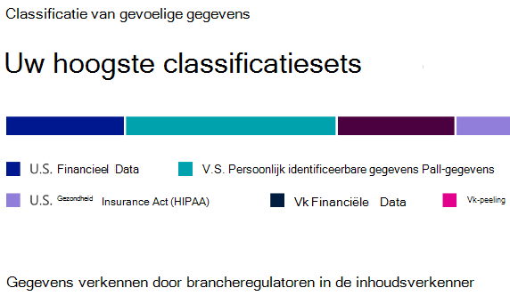
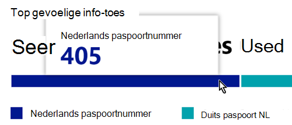
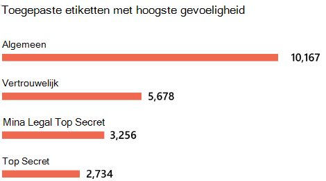
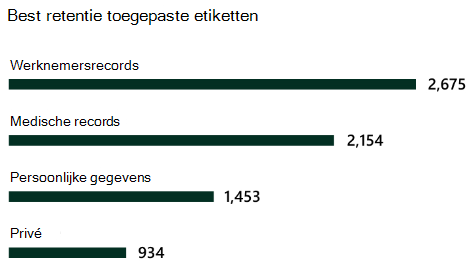

# Meer informatie over gegevensclassificatie

Als beheerder of compliancebeheerder van Microsoft 365 kunt u inhoud in uw organisatie evalueren en labelen om te bepalen waar deze zich dient te bevinden, te beveiligen op elke locatie en ervoor te zorgen dat deze wordt bewaard en verwijderd op basis van de behoeften van uw organisatie. U doet dit via de toepassing van [vertrouwelijkheidslabels](sensitivity-labels.md), [retentielabels](retention.md#retention-labels) en classificatie het vertrouwelijkheidsniveau van informatie. Er zijn verschillende manieren om de detectie, evaluatie en labeling uit te voeren, maar het resultaat is dat u mogelijk een zeer groot aantal documenten en e-mailberichten hebt die zijn gelabeld en geclassificeerd met een of beide labels. Nadat u uw retentielabels en vertrouwelijkheidslabels hebt toegepast, wilt u zien hoe de labels worden gebruikt in uw tenant en wat er met deze items wordt gedaan. De pagina voor gegevensclassificatie geeft inzicht in de inhoud, met name:

- het aantal items die zijn geclassificeerd als vertrouwelijke informatie en wat die classificaties zijn
- de voornaamste toegepaste vertrouwelijkheidslabels in Microsoft 365 en Azure Information Protection
- de meest toegepaste labels voor bewaarbeleid
- een overzicht van activiteiten die gebruikers met uw gevoelige inhoud uitvoeren
- de locaties van uw vertrouwelijke en bewaarde gegevens

U beheert ook deze functies op de pagina met gegevensclassificatie:

- [Trainbare classificaties](classifier-learn-about.md)
- [Typen gevoelige informatie](sensitive-information-type-learn-about.md)
- [Exacte gegevensovereenkomsten](create-custom-sensitive-information-types-with-exact-data-match-based-classification.md)
- [inhoudsverkenner](data-classification-content-explorer.md)
- [activiteitsverkenner](data-classification-activity-explorer.md)

U vindt de classificatie van gegevens in het **Microsoft 365-compliancecentrum** of **het Microsoft 365-beveiligingscentrum** > **Classificatie** > **Gegevensclassificatie**.

Volg een videorondleiding door functies voor gegevensclassificatie.

> [!VIDEO https://www.microsoft.com/videoplayer/embed/RE4vx8x]

Met de classificatie van gegevens wordt uw gevoelige inhoud en gelabelde inhoud gescand voordat u beleidsregels opstelt. Dit wordt **zero change management genoemd**. Hiermee kunt u de invloed zien van alle labels voor bewaring en vertrouwelijkheid in uw omgeving en kunt u uw behoeften op het gebied van beveiliging en beheerbeleid beoordelen.

## Vereisten

Een aantal verschillende abonnementen ondersteunen Endpoint DLP. Zie [Information Protection-licenties voor informatiebeveiliging voor meer informatie](/office365/servicedescriptions/microsoft-365-service-descriptions/microsoft-365-tenantlevel-services-licensing-guidance/microsoft-365-security-compliance-licensing-guidance#information-protection). 

### Machtigingen

 Als u toegang wilt krijgen tot de pagina gegevensclassificatie moet aan een account een lidmaatschap zijn toegewezen voor een van deze rollen of rollengroepen.

**Microsoft 365-rollengroepen**

- Globale beheerder
- Beheerder voor naleving
- Beveiligingsbeheerder
- Beheerder van nalevingsgegevens

> [!NOTE]
> Gebruik als aanbevolen procedure altijd de rol met de minste bevoegdheid om toegang te verlenen tot Microsoft 365-gegevensclassificatie.

## Typen vertrouwelijke informatie die het meest worden gebruikt in uw inhoud

Microsoft 365 wordt geleverd met een groot aantal definities van typen gevoelige informatie, zoals een item met een beveiligingsnummer of een creditcardnummer. Zie [Entiteitsdefinities van typen gevoelige informatie](sensitive-information-type-entity-definitions.md) voor meer informatie over de typen gevoelige informatie.

Op de kaart met het type gevoelige informatie worden de belangrijkste typen gevoelige informatie vermeld die in uw organisatie zijn gevonden en gelabeld.

Als u wilt weten hoeveel items zich in een bepaalde classificatiecategorie bevinden, beweegt u de muisaanwijzer over de balk voor de categorie.

> [!NOTE]
> Als op de kaart het bericht 'Geen gegevens gevonden met vertrouwelijke informatie' wordt weergegeven. Dit betekent dat er in uw organisatie geen items zijn geclassificeerd als een type gevoelige informatie of dat er geen items zijn verkend. Om aan de slag te gaan met labels, zie:
>- [Aan de slag met vertrouwelijkheidslabels](get-started-with-sensitivity-labels.md)
>- [Aan de slag met bewaarbeleid en retentielabels](get-started-with-retention.md)
>- [Definities van entiteiten van het type vertrouwelijke gegevens](sensitive-information-type-entity-definitions.md)

## Voornaamste vertrouwelijkheidslabels toegepast op inhoud

Wanneer u een gevoeligheidslabel op een item via Microsoft 365 of Azure Information Protection (AIP) toe passen, gebeuren er twee dingen:

- een tag die aangeeft dat het item in uw organisatie de waarde van het item bevat, is ingesloten in het document en dat overal wordt gebruikt
- Een vertrouwelijkheidslabel biedt diverse beschermingskenmerken, zoals verplicht watermerk of versleuteling. Als u eindpuntbeveiliging hebt ingeschakeld, kunt u zelfs voorkomen dat een item uw organisatiebeheer verlaat.

Zie voor meer informatie over gevoeligheidslabels: [Meer informatie over gevoeligheidslabels](sensitivity-labels.md)

Vertrouwelijkheidslabels moeten zijn ingeschakeld voor bestanden in SharePoint en OneDrive, zodat de overeenkomende gegevens op de pagina met de gegevensclassificatie worden weergegeven. Zie [Vertrouwelijkheidslabels inschakelen voor Office-bestanden in SharePoint en OneDrive](sensitivity-labels-sharepoint-onedrive-files.md) voor meer informatie.

Op de kaart voor vertrouwelijkheidslabels wordt het aantal items (e-mails of documenten) op gevoeligheidsniveau vermeld.

> [!NOTE]
> Als er geen gevoeligheidslabels zijn gemaakt of gepubliceerd of als er geen gevoeligheidslabel is toegepast op de inhoud, wordt op deze kaart het bericht 'Er zijn geen gevoeligheidslabels gedetecteerd' weergegeven. Om aan de slag te gaan met vertrouwelijkheidslabels, gaat u naar:
>- [Aan de slag met vertrouwelijkheidslabels](get-started-with-sensitivity-labels.md) of voor AIP [Het Azure-gegevensbeveiligingsbeleid configureren](/azure/information-protection/configure-policy)

## Voornaamste retentielabels toegepast op inhoud

Labels voor retentie worden gebruikt voor het beheer van de bewaring en verwijdering van inhoud in uw organisatie. Wanneer ze worden toegepast, kunnen ze worden gebruikt om te bepalen hoe een item wordt bewaard vóór verwijdering, of het moet worden gecontroleerd vóór verwijdering, wanneer de bewaarperiode verloopt en of het moet worden gemarkeerd als een record. Zie [Meer informatie over retentiebeleid en retentielabels](retention.md) voor meer informatie.

Op de kaart met de meest toegepaste bewaarlabels ziet u hoeveel items een bepaald bewaarlabel hebben.

> [!NOTE]
> Als er geen gevoeligheidslabels zijn gemaakt of gepubliceerd of als er geen gevoeligheidslabel is toegepast op de inhoud, wordt op deze kaart het bericht 'Er zijn geen gevoeligheidslabels gedetecteerd' weergegeven. Om aan de slag te gaan met retentie, zie:
>- [Aan de slag met bewaarbeleid en retentielabels](get-started-with-retention.md)

## Voornaamste activiteiten gevonden

Deze kaart bevat een beknopt overzicht van de meest voorkomende acties die gebruikers uitvoeren op de items met het gevoeligheidslabel. Met de [Activity Explorer](data-classification-activity-explorer.md) kunt u inzoomen op de verschillende activiteiten die Microsoft 365 bij houdt op gelabelde inhoud en inhoud die zich op Windows 10-eindpunten bevindt.

> [!NOTE]
> Als op deze kaart het bericht 'Geen activiteit gedetecteerd' wordt weergegeven, betekent dit dat er geen activiteit is uitgevoerd op de bestanden of dat de controle door gebruikers en beheerders niet is ingeschakeld. Als u de auditlogboeken wilt inschakelen, gaat u naar:
>- [Zoek in het auditlogboek in het beveiligings- en compliancecentrum](search-the-audit-log-in-security-and-compliance.md)

## Vertrouwelijkheids- en bewaarbeleid met labelgegevens per locatie

Het doel van de rapportage van de gegevensclassificatie is om inzicht te verstrekken in het aantal items met een bepaald label en hun locatie. Deze kaarten laten u weten hoeveel gelabelde items er zijn in Exchange, SharePoint en OneDrive, enzovoort.

> [!NOTE]
> Als er geen gevoeligheidslabels zijn gemaakt of gepubliceerd of als er geen retentielabel is toegepast op de inhoud, wordt op deze kaart het bericht 'Er zijn geen locaties gedetecteerd' weergegeven. Om aan de slag te gaan met vertrouwelijkheidslabels, gaat u naar:
>- [Gevoeligheidslabels](sensitivity-labels.md)

## Zie ook

- [Labelactiviteit weergevenen](data-classification-activity-explorer.md)
- [Gelabelde inhoud weergeven](data-classification-content-explorer.md)
- [Meer informatie over vertrouwelijkheidslabels](sensitivity-labels.md)
- [Meer informatie over bewaarbeleid en retentielabels](retention.md)
- [Meer informatie over typen gevoelige informatie](sensitive-information-type-learn-about.md)
- [Definities van entiteiten van het type vertrouwelijke gegevens](sensitive-information-type-entity-definitions.md)
- [Meer informatie over trainbare classificaties (preview)](classifier-learn-about.md)

Zie [Informatiebescherming implementeren voor gegevensprivacyvoorschriften met Microsoft 365](../solutions/information-protection-deploy.md)  (aka.ms/m365dataprivacy) voor informatie over hoe u gegevensclassificatie kunt gebruiken om aan de privacyvoorschriften voor gegevens te voldoen.