# Verwijzing naar preventie van gegevensverlies

> [!IMPORTANT]
> Dit onderwerp is niet langer de belangrijkste bron voor het voorkomen Microsoft 365 gegevensverlies (DLP). De DLP-inhoudsset wordt bijgewerkt en geherstructureerd. De onderwerpen die in dit artikel worden besproken, worden verplaatst naar nieuwe, bijgewerkte artikelen. Zie Meer informatie over preventie van [gegevensverlies](dlp-learn-about-dlp.md)voor meer informatie over DLP.

<!-- this topic needs to be split into smaller, more coherent ones. It is confusing as it is. -->
<!-- move this note to a more appropriate place, no topic should start with a note -->
> [!NOTE]
> Mogelijkheden voor preventie van gegevensverlies zijn onlangs toegevoegd aan Microsoft Teams chat- en kanaalberichten voor gebruikers met een licentie voor Office 365 Advanced Compliance, die beschikbaar is als zelfstandige optie en is opgenomen in Office 365 E5 en Microsoft 365 E5 Compliance. Zie voor meer informatie over licentievereisten [Microsoft 365 Tenant-Level Services Licensing Guidance](/office365/servicedescriptions/microsoft-365-service-descriptions/microsoft-365-tenantlevel-services-licensing-guidance).

<!-- MOVED TO LEARN ABOUT To comply with business standards and industry regulations, organizations must protect sensitive information and prevent its inadvertent disclosure. Sensitive information can include financial data or personally identifiable information (PII) such as credit card numbers, social security numbers, or health records. With a data loss prevention (DLP) policy in the Office 365 Security &amp; Compliance Center, you can identify, monitor, and automatically protect sensitive information across Office 365.

With a DLP policy, you can:

- **Identify sensitive information across many locations, such as Exchange Online, SharePoint Online, OneDrive for Business, and Microsoft Teams.**

    For example, you can identify any document containing a credit card number that's stored in any OneDrive for Business site, or you can monitor just the OneDrive sites of specific people.

- **Prevent the accidental sharing of sensitive information**.

    For example, you can identify any document or email containing a health record that's shared with people outside your organization, and then automatically block access to that document or block the email from being sent.

- **Monitor and protect sensitive information in the desktop versions of Excel, PowerPoint, and Word.**

    Just like in Exchange Online, SharePoint Online, and OneDrive for Business, these Office desktop programs include the same capabilities to identify sensitive information and apply DLP policies. DLP provides continuous monitoring when people share content in these Office programs.

- **Help users learn how to stay compliant without interrupting their workflow.**

    You can educate your users about DLP policies and help them remain compliant without blocking their work. For example, if a user tries to share a document containing sensitive information, a DLP policy can both send them an email notification and show them a policy tip in the context of the document library that allows them to override the policy if they have a business justification. The same policy tips also appear in Outlook on the web, Outlook, Excel, PowerPoint, and Word.

- **View DLP alerts and reports showing content that matches your organization’s DLP policies.**

    To view alerts and metadata related to your DLP policies you can use the [DLP Alerts Management Dashboard](dlp-configure-view-alerts-policies.md). You can also view policy match reports to assess how your organization is complying with a DLP policy. If a DLP policy allows users to override a policy tip and report a false positive, you can also view what users have reported

-->
## DLP-beleid maken en beheren

U maakt en beheert DLP-beleid op de pagina Preventie van gegevensverlies in het Microsoft 365 Compliancecentrum.

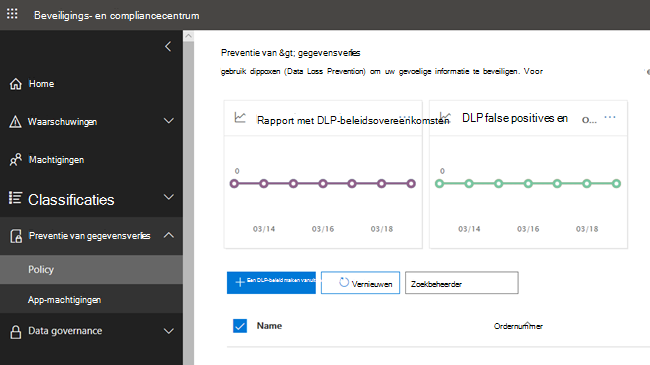

<!-- MOVED TO LEARN ABOUT ## What a DLP policy contains

A DLP policy contains a few basic things:

- Where to protect the content: **locations** such as Exchange Online, SharePoint Online, and OneDrive for Business sites, as well as Microsoft Teams chat and channel messages.

- When and how to protect the content by enforcing **rules** comprised of:

  - **Conditions** the content must match before the rule is enforced. For example, a rule might be configured to look only for content containing Social Security numbers that's been shared with people outside your organization.

  - **Actions** that you want the rule to take automatically when content matching the conditions is found. For example, a rule might be configured to block access to a document and send both the user and compliance officer an email notification. -->

U kunt een regel gebruiken om aan een specifieke beveiligingsvereiste te voldoen en vervolgens een DLP-beleid gebruiken om gemeenschappelijke beveiligingsvereisten samen te stellen, zoals alle regels die nodig zijn om te voldoen aan een specifieke verordening.

U hebt bijvoorbeeld een DLP-beleid waarmee u de aanwezigheid kunt detecteren van informatie die is onderworpen aan de Health Insurance Portability and Accountability Act (HIPAA). Dit DLP-beleid kan helpen bij het beveiligen van HIPAA-gegevens (het wat) op alle SharePoint Online-sites en alle OneDrive voor Bedrijven-sites (waar) door te zoeken naar een document met deze gevoelige informatie dat wordt gedeeld met personen buiten uw organisatie (de voorwaarden) en vervolgens de toegang tot het document te blokkeren en een melding te verzenden (de acties). Deze vereisten worden opgeslagen als afzonderlijke regels en gegroepeerd als een DLP-beleid om beheer en rapportage te vereenvoudigen.

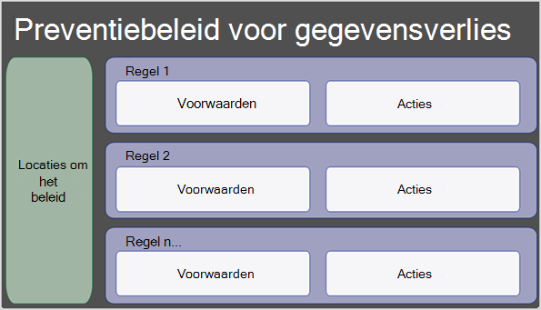

<!-- MOVED TO LEARN ABOUT ### Locations

DLP policies are applied to sensitive items across Microsoft 365 locations and can be further scoped as detailed in this table.

|Location | Include/exclude by|
|---------|---------|
|Exchange email| distribution groups|
|SharePoint sites |sites |
|OneDrive accounts |accounts |
|Teams chat and channel messages |accounts |
|Windows 10 devices |user or group |
|Microsoft Cloud App Security |instance |
 -->

Als u ervoor kiest om specifieke distributiegroepen op te nemen in Exchange, is het DLP-beleid alleen van toepassing op de leden van die groep. Als u een distributiegroep uitsluit, worden alle leden van die distributiegroep uitgesloten van beleidsevaluatie. U kunt ervoor kiezen om een beleid uit te breiden naar de leden van distributielijsten, dynamische distributiegroepen en beveiligingsgroepen. Een DLP-beleid mag niet meer dan 50 dergelijke insluitsels en uitsluitingen bevatten.

Als u ervoor kiest om specifieke sites op te nemen SharePoint uit te sluiten, kan een DLP-beleid niet meer dan 100 dergelijke insluitingen en uitsluitingen bevatten. Hoewel deze limiet bestaat, kunt u deze limiet overschrijden door een beleid voor de hele organisatie toe te passen of een beleid dat van toepassing is op hele locaties.

Als u ervoor kiest om specifieke OneDrive accounts of groepen op te nemen of uit te sluiten, kan een DLP-beleid niet meer dan 100 gebruikersaccounts of 50 groepen bevatten als opname of uitsluiting.

### Regels

> [!NOTE]
> Het standaardgedrag van een DLP-beleid, wanneer er geen waarschuwing is geconfigureerd, is niet om te waarschuwen of te activeren. Dit geldt alleen voor standaardinformatietypen. Voor aangepaste informatietypen wordt het systeem gewaarschuwd, zelfs als er geen actie is gedefinieerd in het beleid.

Regels dwingen uw zakelijke vereisten af op de inhoud van uw organisatie. Een beleid bevat een of meer regels en elke regel bestaat uit voorwaarden en acties. Voor elke regel worden de acties automatisch ondernomen wanneer aan de voorwaarden wordt voldaan. Regels worden opeenvolgend uitgevoerd, te beginnen met de regel met de hoogste prioriteit in elk beleid.

Een regel bevat ook opties om gebruikers (met beleidstips en e-mailmeldingen) en beheerders (met e-mailincidentrapporten) te laten weten dat inhoud aan de regel is afgestemd.

Hier vindt u de onderdelen van een regel, die hieronder worden uitgelegd.

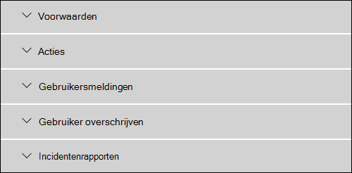

#### Voorwaarden

Voorwaarden zijn belangrijk omdat ze bepalen welke soorten gegevens u zoekt en wanneer u een actie moet ondernemen. U kunt er bijvoorbeeld voor kiezen om inhoud met paspoortnummers te negeren, tenzij de inhoud meer dan 10 dergelijke getallen bevat en wordt gedeeld met personen buiten uw organisatie.

Voorwaarden zijn gericht op **de inhoud,** zoals welke typen gevoelige informatie u zoekt, en ook op de **context,** zoals met wie het document wordt gedeeld. U kunt voorwaarden gebruiken om verschillende acties toe te wijzen aan verschillende risiconiveaus. Gevoelige inhoud die intern wordt gedeeld, kan bijvoorbeeld een lager risico hebben en minder acties vereisen dan gevoelige inhoud die wordt gedeeld met personen buiten de organisatie.

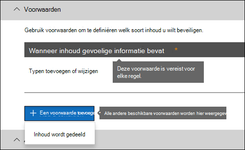

De voorwaarden die nu beschikbaar zijn, kunnen bepalen of:

- Inhoud bevat een type gevoelige informatie.

- Inhoud bevat een label. Zie de onderstaande sectie Een bewaarlabel gebruiken als voorwaarde [in een DLP-beleid](#using-a-retention-label-as-a-condition-in-a-dlp-policy)voor meer informatie.

- Inhoud wordt gedeeld met personen buiten of binnen uw organisatie.

  > [!NOTE]
  > Gebruikers die niet-gastaccounts hebben in de Active Directory- of Azure Active Directory tenant van een hostorganisatie, worden beschouwd als personen binnen de organisatie.

#### Typen gevoelige informatie

Met een DLP-beleid wordt gevoelige informatie beschermd, die is gedefinieerd als een **type gevoelige informatie**. Microsoft 365 bevat definities voor veelvoorkomende typen gevoelige informatie in veel verschillende regio's die u kunt gebruiken, zoals een creditcardnummer, bankrekeningnummers, nationale id-nummers en paspoortnummers.

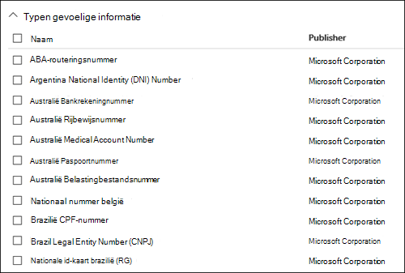

Wanneer in een DLP-beleid wordt op zoek naar een type gevoelige informatie, zoals een creditcardnummer, wordt er niet alleen naar een 16-cijferig getal op zoek. Elk type gevoelige informatie wordt gedefinieerd en gedetecteerd met behulp van een combinatie van:

- Trefwoorden.

- Interne functies om checksums of samenstelling te valideren.

- Evaluatie van reguliere expressies om patronen te zoeken.

- Ander inhoudsonderzoek.

Dit helpt DLP-detectie om een hoge mate van nauwkeurigheid te bereiken en tegelijkertijd het aantal fout-positieven te verminderen dat het werk van personen kan onderbreken.

#### Acties

Wanneer inhoud overeenkomt met een voorwaarde in een regel, kunt u acties toepassen om de inhoud automatisch te beveiligen.

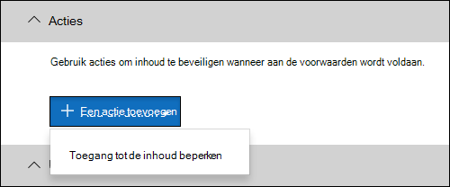

Met de acties die nu beschikbaar zijn, kunt u het volgende doen:

- **Toegang tot de inhoud beperken** Afhankelijk van uw behoefte kunt u de toegang tot inhoud op drie manieren beperken:

  1. Toegang tot inhoud beperken voor iedereen.
  2. De toegang tot inhoud beperken voor personen buiten de organisatie.
  3. De toegang beperken tot 'Iedereen met de koppeling'.

  Voor site-inhoud betekent dit dat machtigingen voor het document voor iedereen zijn beperkt, behalve de beheerder van de primaire siteverzameling, de eigenaar van het document en de persoon die het document het laatst heeft gewijzigd. Deze personen kunnen de gevoelige informatie uit het document verwijderen of andere herstelactie ondernemen. Wanneer het document voldoet, worden de oorspronkelijke machtigingen automatisch hersteld. Wanneer de toegang tot een document wordt geblokkeerd, wordt het document weergegeven met een speciaal beleidstippictogram in de bibliotheek op de site.

  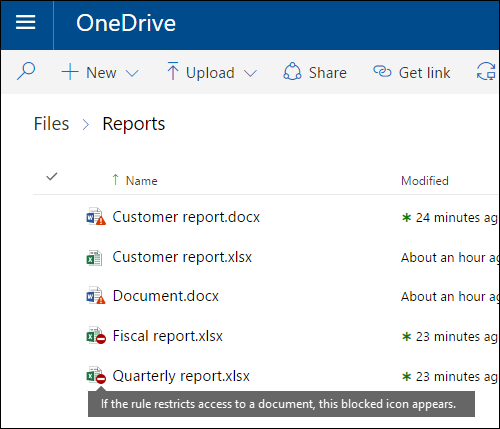

  Voor e-mailinhoud wordt met deze actie het bericht niet verzonden. Afhankelijk van hoe de DLP-regel is geconfigureerd, ziet de afzender een NDR of (als de regel een melding gebruikt) een beleidstip en/of e-mailmelding.

  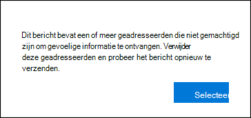

#### Gebruikersmeldingen en gebruikers overschrijven

U kunt meldingen en overschrijven gebruiken om uw gebruikers te informeren over DLP-beleid en hen te helpen compatibel te blijven zonder hun werk te blokkeren. Als een gebruiker bijvoorbeeld een document met gevoelige informatie probeert te delen, kan een DLP-beleid hen zowel een e-mailmelding sturen als een beleidstip laten zien in de context van de documentbibliotheek, zodat ze het beleid kunnen overschrijven als ze een zakelijke rechtvaardiging hebben.

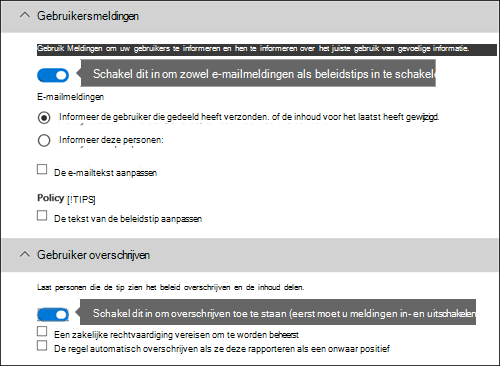

De e-mail kan de persoon op de hoogte stellen die de inhoud heeft verzonden, gedeeld of voor het laatst heeft gewijzigd en, voor site-inhoud, de primaire beheerder van de siteverzameling en de eigenaar van het document. Daarnaast kunt u wie u ook kiest uit de e-mailmelding toevoegen of verwijderen.

Naast het verzenden van een e-mailmelding, wordt in een gebruikersmelding ook een beleidstip weergegeven:

- In Outlook en webversie van Outlook.

- Voor het document op een SharePoint Online of OneDrive voor Bedrijven site.

- In Excel, PowerPoint en Word, wanneer het document is opgeslagen op een site die is opgenomen in een DLP-beleid.

In de e-mailmelding en beleidstip wordt uitgelegd waarom inhoud in strijd is met een DLP-beleid. Als u kiest, kunnen gebruikers met de e-mailmelding en beleidstip een regel overschrijven door een fout-positief te melden of een zakelijke rechtvaardiging te geven. Hiermee kunt u gebruikers informeren over uw DLP-beleid en afdwingen zonder dat mensen hun werk kunnen doen. Informatie over overschrijven en fout-positieven wordt ook geregistreerd voor rapportage (zie hieronder over de DLP-rapporten) en opgenomen in de incidentenrapporten (volgende sectie), zodat de compliance officer deze informatie regelmatig kan controleren.

Zo ziet een beleidstip eruit in een OneDrive voor Bedrijven account.

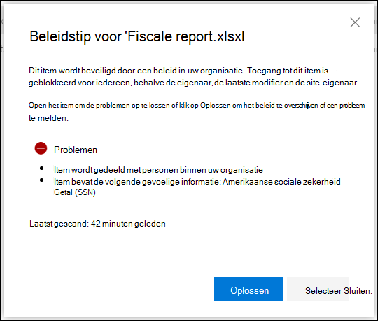

 Zie Meldingen en beleidstips gebruiken voor meer informatie over gebruikersmeldingen en beleidstips in [DLP-beleid.](use-notifications-and-policy-tips.md)

#### Meldingen en incidentenrapporten

Wanneer een regel is afgestemd, kunt u een waarschuwings-e-mail verzenden naar uw compliance officer (of een persoon(s) die u kiest) met details van de waarschuwing. In dit waarschuwings-e-mailbericht wordt een koppeling van het [DLP Alerts Management Dashboard](dlp-configure-view-alerts-policies.md) geplaatst, waar de compliance officer naar kan gaan om de details van waarschuwingen en gebeurtenissen te bekijken. Het dashboard bevat details van de gebeurtenis die de waarschuwing heeft geactiveerd, samen met de details van het overeenkomende DLP-beleid en de gevoelige inhoud die is gedetecteerd.

Daarnaast kunt u ook een incidentrapport verzenden met details van de gebeurtenis. Dit rapport bevat informatie over het item dat is aangepast, de werkelijke inhoud die aan de regel is aangepast en de naam van de persoon die de inhoud het laatst heeft gewijzigd. Voor e-mailberichten bevat het rapport ook als bijlage het oorspronkelijke bericht dat overeenkomt met een DLP-beleid.

> [!div class="mx-imgBorder"]
> 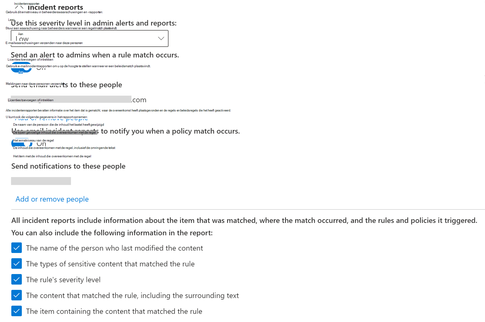

DLP scant e-mail anders dan items in SharePoint Online of OneDrive voor Bedrijven. In SharePoint Online en OneDrive voor Bedrijven, scant DLP bestaande items en nieuwe items en genereert een waarschuwings- en incidentrapport wanneer er een overeenkomst wordt gevonden. In Exchange Online DLP alleen nieuwe e-mailberichten scannen en een rapport genereren als er een beleidsmatch is. DLP ***scant of*** komt niet overeen met eerder bestaande e-mailitems die zijn opgeslagen in een postvak of archief.

## Groeperings- en logische operatoren

Vaak heeft uw DLP-beleid een eenvoudige vereiste, zoals het identificeren van alle inhoud die een Amerikaans sociaal-beveiligingsnummer bevat. In andere scenario's moet uw DLP-beleid mogelijk meer los gedefinieerde gegevens identificeren.

Als u bijvoorbeeld inhoud wilt identificeren die is onderworpen aan de Amerikaanse Health Insurance Act (HIPAA), moet u zoeken naar:

- Inhoud die specifieke typen gevoelige informatie bevat, zoals een Amerikaans nummer voor sociale zekerheid of een DEA-nummer (Drug Enforcement Agency).

    EN

- Inhoud die moeilijker te identificeren is, zoals communicatie over de zorg van een patiënt of beschrijvingen van verstrekte medische services. Het identificeren van deze inhoud vereist overeenkomende trefwoorden uit zeer grote trefwoordenlijsten, zoals de Internationale classificatie van ziektes (ICD-9-CM of ICD-10-CM).

U kunt dergelijke losjes gedefinieerde gegevens eenvoudig identificeren met behulp van groeperings- en logische operatoren (AND, OF). Wanneer u een DLP-beleid maakt, kunt u het volgende doen:

- Groep gevoelige informatietypen.

- Kies de logische operator tussen de typen gevoelige informatie binnen een groep en tussen de groepen zelf.

### De operator in een groep kiezen

In een groep kunt u kiezen of aan alle voorwaarden in die groep moet worden voldaan om de inhoud aan de regel te laten voldoen.

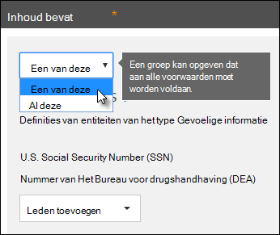

### Een groep toevoegen

U kunt snel een groep toevoegen, die zijn eigen voorwaarden en operator binnen die groep kan hebben.

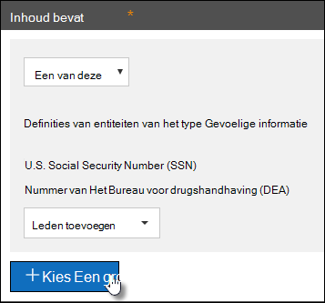

### De operator kiezen tussen groepen

Tussen groepen kunt u kiezen of aan de voorwaarden in slechts één groep of aan alle groepen moet worden voldaan om de inhoud aan de regel te laten voldoen.

Het ingebouwde AMERIKAANSE **HIPAA-beleid** heeft bijvoorbeeld een regel waarin een **AND-operator** tussen de groepen wordt gebruikt, zodat inhoud wordt geïdentificeerd die het volgende bevat:

- van de **groep PII-id's** (ten minste één SSN-getal **OF DEA-getal)**

    **EN**

- uit de groep **Medische voorwaarden** (ten minste één Trefwoord ICD-9-CM **OF** ICD-10-CM trefwoord)

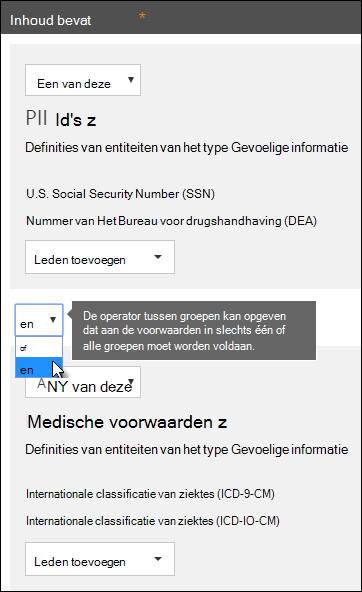

## De prioriteit waarmee regels worden verwerkt

Wanneer u regels maakt in een beleid, krijgt elke regel een prioriteit toegewezen in de volgorde waarin deze is gemaakt, wat betekent dat de regel die eerst is gemaakt, de eerste prioriteit heeft, de regel die als tweede wordt gemaakt, een tweede prioriteit heeft, en ga zo maar door.

> [!div class="mx-imgBorder"]
> 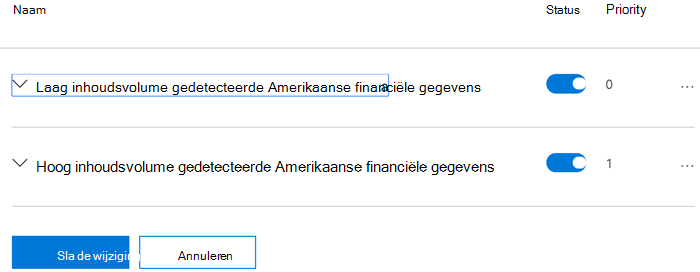

Nadat u meer dan één DLP-beleid hebt ingesteld, kunt u de prioriteit van een of meer beleidsregels wijzigen. Als u dat wilt doen, selecteert u een beleid, kiest u **Beleid bewerken** en gebruikt u de lijst **Prioriteit** om de prioriteit op te geven.

> [!div class="mx-imgBorder"]
> 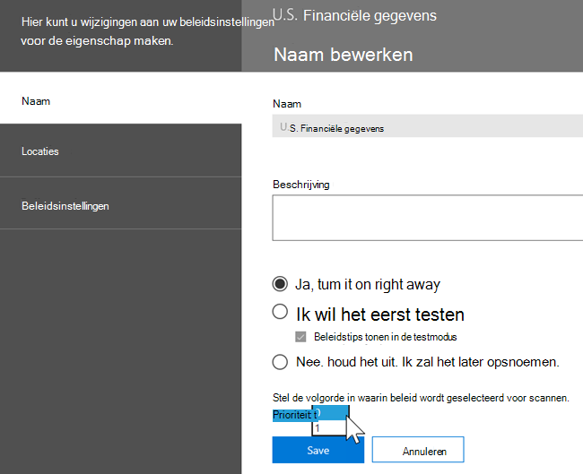

Wanneer inhoud wordt geëvalueerd op basis van regels, worden de regels in prioriteitsorder verwerkt. Als inhoud overeenkomt met meerdere regels, worden de regels in prioriteitsorder verwerkt en wordt de meest beperkende actie afgedwongen. Als inhoud bijvoorbeeld overeenkomt met alle volgende regels, wordt regel 3 afgedwongen omdat deze de hoogste prioriteit heeft, de meest beperkende regel:

- Regel 1: geeft alleen een bericht aan gebruikers

- Regel 2: geeft gebruikers een bericht, beperkt de toegang en staat gebruikers overschrijven toe

- Regel 3: geeft gebruikers een bericht, beperkt de toegang en staat niet toe dat gebruikers worden overschrijven

- Regel 4: geeft alleen een bericht aan gebruikers

- Regel 5: beperkt de toegang

- Regel 6: geeft gebruikers een bericht, beperkt de toegang en staat niet toe dat gebruikers worden overschrijven

Houd er in dit voorbeeld rekening mee dat overeenkomsten voor alle regels worden opgenomen in de auditlogboeken en worden weergegeven in de DLP-rapporten, ook al wordt alleen de meest beperkende regel afgedwongen.

Wat beleidstips betreft, moet u er rekening mee dat:

- Alleen de beleidstip van de hoogste prioriteit, de meest beperkende regel, wordt weergegeven. Een beleidstip van een regel die toegang tot inhoud blokkeert, wordt bijvoorbeeld weergegeven via een beleidstip van een regel die alleen een melding verzendt. Dit voorkomt dat personen een trapsgepunt met beleidstips zien.

- Als de beleidstips in de meest beperkende regel toestaan dat personen de regel overschrijven, worden ook andere regels overgenomen die overeenkomen met de inhoud door deze regel te vervangen.

## Regels afstemmen om ze gemakkelijker of moeilijker te matchen

Nadat personen hun DLP-beleid hebben aan- en in- of uit te voeren, lopen ze soms tegen de volgende problemen aan:

- Te veel inhoud die **geen gevoelige informatie is,** komt overeen met de regels, met andere woorden te veel fout-positieven.

- Te weinig inhoud die **gevoelige informatie is, komt** overeen met de regels. Met andere woorden, de beschermende acties worden niet afgedwongen op de gevoelige informatie.

Als u deze problemen wilt oplossen, kunt u uw regels afstemmen door het aantal exemplaren en de nauwkeurigheid van de exemplaren aan te passen, zodat inhoud moeilijker of gemakkelijker aan de regels kan voldoen. Elk type gevoelige informatie dat in een regel wordt gebruikt, heeft zowel een aantal exemplaren als een overeenkomende nauwkeurigheid.

### Aantal exemplaren

Aantal exemplaren betekent gewoon hoeveel exemplaren van een specifiek type gevoelige informatie aanwezig moeten zijn om inhoud aan de regel te kunnen laten overeenkomen. Inhoud komt bijvoorbeeld overeen met de regel die hieronder wordt weergegeven als tussen 1 en 9 unieke V.S. of Vk. paspoortnummers worden geïdentificeerd.

> [!NOTE]
> Het aantal exemplaren bevat alleen **unieke** overeenkomsten voor gevoelige informatietypen en trefwoorden. Als een e-mailbericht bijvoorbeeld 10 exemplaren van hetzelfde creditcardnummer bevat, tellen die tien exemplaren als één exemplaar van een creditcardnummer.

Als u het aantal exemplaren wilt gebruiken om regels af te stemmen, is de richtlijn eenvoudig:

- Als u de regel gemakkelijker wilt matchen, verlaagt u het **aantal minuten** en/of verhoogt u het **maximum** aantal. U kunt ook **max instellen** op **elke** waarde door de numerieke waarde te verwijderen.

- Als u de regel moeilijker wilt matchen, verhoogt u het **aantal minuten.**

Meestal gebruikt u minder beperkende acties, zoals het verzenden van gebruikersmeldingen, in een regel met een lager aantal exemplaren (bijvoorbeeld 1-9). En u gebruikt meer beperkende acties, zoals het beperken van de toegang tot inhoud zonder dat gebruikers overschrijven toestaan, in een regel met een hoger aantal exemplaren (bijvoorbeeld 10-any).

### Nauwkeurigheid overeenkomen

Zoals hierboven beschreven, wordt een type gevoelige informatie gedefinieerd en gedetecteerd met behulp van een combinatie van verschillende typen bewijs. Meestal wordt een type gevoelige informatie gedefinieerd door meerdere dergelijke combinaties, patronen genoemd. Een patroon dat minder bewijs vereist, heeft een lagere nauwkeurigheid (of betrouwbaarheidsniveau), terwijl een patroon dat meer bewijs vereist, een hogere nauwkeurigheid (of betrouwbaarheidsniveau) heeft. Zie Entiteitsdefinities van het type Gevoelige informatie voor meer informatie over de werkelijke patronen en betrouwbaarheidsniveaus die door elk type gevoelige [informatie worden gebruikt.](sensitive-information-type-entity-definitions.md)

Het type gevoelige informatie met de naam Creditcardnummer wordt bijvoorbeeld gedefinieerd door twee patronen:

- Een patroon met 65% vertrouwen dat vereist is:

  - Een getal in de notatie van een creditcardnummer.

  - Een getal dat de checksum passeert.

- Een patroon met 85% vertrouwen dat vereist is:

  - Een getal in de notatie van een creditcardnummer.

  - Een getal dat de checksum passeert.

  - Een trefwoord of een vervaldatum in de juiste notatie.

U kunt deze betrouwbaarheidsniveaus (of overeenkomende nauwkeurigheid) gebruiken in uw regels. Meestal gebruikt u minder beperkende acties, zoals het verzenden van gebruikersmeldingen, in een regel met een lagere nauwkeurigheid. En u gebruikt meer beperkende acties, zoals het beperken van de toegang tot inhoud zonder dat gebruikers overschrijven toestaan, in een regel met een hogere nauwkeurigheid.

Het is belangrijk om te begrijpen dat wanneer een specifiek type gevoelige informatie, zoals een creditcardnummer, in inhoud wordt geïdentificeerd, slechts één betrouwbaarheidsniveau wordt geretourneerd:

- Als alle overeenkomsten één patroon hebben, wordt het betrouwbaarheidsniveau voor dat patroon geretourneerd.

- Als er overeenkomsten zijn voor meer dan één patroon (dat wil zeggen dat er overeenkomsten zijn met twee verschillende betrouwbaarheidsniveaus), wordt een betrouwbaarheidsniveau hoger dan een van de afzonderlijke patronen alleen geretourneerd. Dit is het lastige gedeelte. Als voor een creditcard bijvoorbeeld zowel de patronen van 65% als 85% overeenkomen, is het betrouwbaarheidsniveau dat voor dat gevoelige informatietype wordt geretourneerd, groter dan 90%, omdat meer bewijs meer vertrouwen betekent.

Als u dus twee regels wilt maken die elkaar uitsluiten voor creditcards, een voor de nauwkeurigheid van 65% en een voor de 85% overeenkomstnauwkeurigheid, ziet het bereik voor overeenkomende nauwkeurigheid er zo uit. De eerste regel haalt alleen overeenkomsten op van het 65%-patroon. De tweede regel haalt overeenkomsten op met ten minste  **één** overeenkomst van 85% en kan mogelijk andere overeenkomsten met een lager vertrouwen hebben.

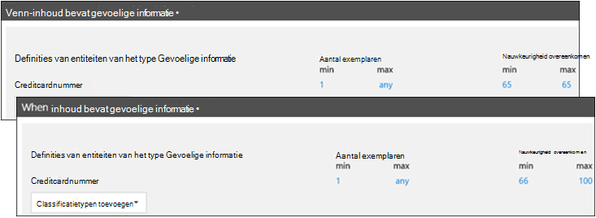

Om deze redenen is de richtlijn voor het maken van regels met verschillende overeenkomstnauwkeurigheid:

- Het laagste betrouwbaarheidsniveau gebruikt meestal dezelfde waarde voor **min** en **max** (geen bereik).

- Het hoogste betrouwbaarheidsniveau is meestal een bereik van net boven het lagere betrouwbaarheidsniveau tot 100.

- Alle tussen betrouwbaarheidsniveaus variëren meestal van net boven het lagere betrouwbaarheidsniveau tot net onder het hogere betrouwbaarheidsniveau.

## Een retentielabel gebruiken als voorwaarde in een DLP-beleid

Wanneer u een eerder  gemaakt en gepubliceerd bewaarlabel gebruikt als voorwaarde in een DLP-beleid, zijn er enkele dingen waar u rekening mee moet houden:

- Het bewaarlabel moet worden gemaakt en gepubliceerd voordat u het probeert te gebruiken als voorwaarde in een DLP-beleid.
- Het kan één tot zeven dagen duren voordat gepubliceerde bewaarlabels worden gesynchroniseerd. Zie Wanneer bewaarlabels beschikbaar zijn om bewaarlabels toe te  passen die zijn gepubliceerd in een bewaarbeleid, en Hoe lang het duurt voordat bewaarlabels van kracht worden voor bewaarlabels die automatisch worden gepubliceerd. 
- Het gebruik van een bewaarlabel in een beleid **wordt alleen ondersteund voor items in SharePoint en OneDrive**.

  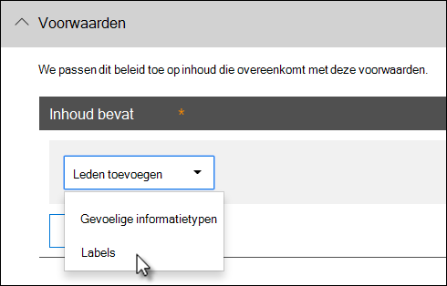

  Mogelijk wilt u een bewaarlabel gebruiken in een DLP-beleid als u items hebt die onder bewaring en dispositie staan en u ook andere besturingselementen op deze items wilt toepassen, bijvoorbeeld:

  - U hebt een bewaarlabel met de naam belastingjaar **2018** gepubliceerd, dat na toepassing op belastingdocumenten uit 2018 die zijn opgeslagen in SharePoint deze 10 jaar behoudt en vervolgens wordt verwijderd. U wilt ook niet dat deze items buiten uw organisatie worden gedeeld, wat u kunt doen met een DLP-beleid.

  > [!IMPORTANT]
  > Deze fout wordt weergegeven als u een bewaarlabel opgeeft als voorwaarde in een DLP-beleid en u ook Exchange en/of Teams opgeeft als locatie: 'Het beveiligen van gelabelde inhoud in e-mail- en teamsberichten wordt niet **ondersteund. Verwijder het label hieronder of schakel Exchange en Teams als locatie uit.'** Dit komt omdat Exchange tijdens het verzenden en bezorgen van berichten de metagegevens van het label niet evalueert.

### Een gevoeligheidslabel gebruiken als voorwaarde in een DLP-beleid

[Meer informatie over](./dlp-sensitivity-label-as-condition.md) het gebruik van gevoeligheidslabels als voorwaarde in DLP-beleid.

### Hoe deze functie zich verhoudt tot andere functies

Er kunnen verschillende functies worden toegepast op inhoud die gevoelige informatie bevat:

- Een [bewaarlabel en een bewaarbeleid kunnen](retention.md) beide **bewaaracties** voor deze inhoud afdwingen.

- Met een DLP-beleid kunnen **beveiligingsacties voor** deze inhoud worden afgedwongen. En voordat u deze acties afdwingt, kan een DLP-beleid vereisen dat aan andere voorwaarden moet worden voldaan, naast de inhoud die een label bevat.

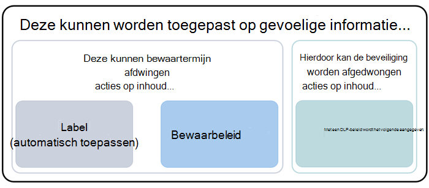

Houd er rekening mee dat een DLP-beleid een uitgebreidere detectiemogelijkheid heeft dan een label- of bewaarbeleid dat is toegepast op gevoelige informatie. Een DLP-beleid kan beschermende acties afdwingen voor inhoud die gevoelige informatie bevat. Als de gevoelige informatie uit de inhoud wordt verwijderd, worden deze beschermende acties ongedaan gemaakt wanneer de inhoud de volgende keer wordt gescand. Maar als een bewaarbeleid of label wordt toegepast op inhoud die gevoelige informatie bevat, is dat een een-time actie die niet ongedaan wordt gemaakt, zelfs niet als de gevoelige informatie wordt verwijderd.

Door een label te gebruiken als voorwaarde in een DLP-beleid, kunt u zowel bewaaracties als beschermingsacties afdwingen op inhoud met dat label. U kunt denken aan inhoud die een label bevat, precies zoals inhoud die gevoelige informatie bevat. Zowel een label als een type gevoelige informatie zijn eigenschappen die worden gebruikt om inhoud te classificeren, zodat u acties op die inhoud kunt afdwingen.

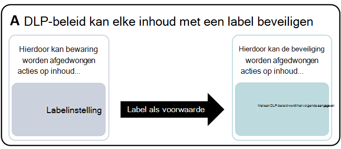

## Eenvoudige instellingen versus geavanceerde instellingen

Wanneer u een DLP-beleid maakt, kiest u tussen eenvoudige of geavanceerde instellingen:

- **Met eenvoudige** instellingen kunt u eenvoudig het meest voorkomende type DLP-beleid maken zonder de regeleditor te gebruiken om regels te maken of te wijzigen.

- **Geavanceerde instellingen** gebruiken de regeleditor om u volledige controle te geven over elke instelling voor uw DLP-beleid.

Maak u geen zorgen, onder de omslagen werken eenvoudige instellingen en geavanceerde instellingen precies hetzelfde door regels te afdwingen die bestaan uit voorwaarden en acties. Alleen met eenvoudige instellingen ziet u de regeleditor niet. Dit is een snelle manier om een DLP-beleid te maken.

### Eenvoudige instellingen

Het meest voorkomende DLP-scenario is het maken van een beleid om te helpen voorkomen dat inhoud met gevoelige informatie wordt gedeeld met personen buiten uw organisatie, en een automatische herstelactie uit te voeren, zoals het beperken van wie toegang heeft tot de inhoud, het verzenden van meldingen van eindgebruikers of beheerders en het controleren van de gebeurtenis voor later onderzoek. Personen gebruiken DLP om onbedoelde openbaarmaking van gevoelige informatie te voorkomen.

Als u het bereiken van dit doel wilt vereenvoudigen, kunt u bij het maken van een DLP-beleid eenvoudige **instellingen gebruiken kiezen.** Deze instellingen bieden alles wat u nodig hebt om het meest voorkomende DLP-beleid te implementeren, zonder dat u naar de regeleditor hoeft te gaan.

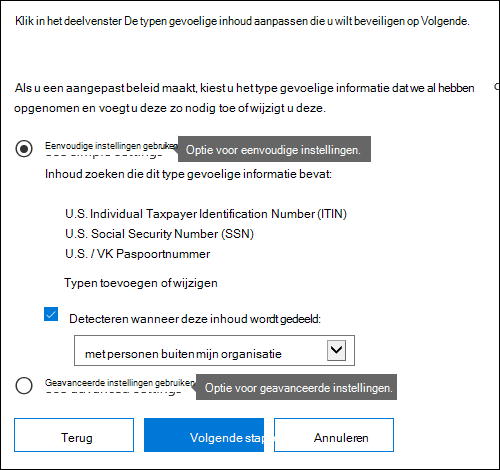

### Geavanceerde instellingen

Als u meer aangepaste DLP-beleidsregels wilt maken, kunt u **Geavanceerde instellingen gebruiken kiezen.**

De geavanceerde instellingen presenteren u met de regeleditor, waar u volledige controle hebt over alle mogelijke opties, inclusief het aantal exemplaren en de nauwkeurigheid (betrouwbaarheidsniveau) voor elke regel.

Als u snel naar een sectie wilt gaan, klikt u op een item in de bovenste navigatie van de regeleditor om naar die sectie hieronder te gaan.

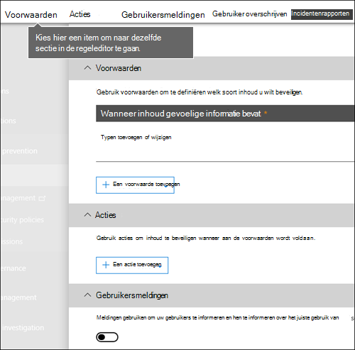

## DLP-beleidsjablonen

De eerste stap bij het maken van een DLP-beleid is het kiezen van welke informatie u wilt beveiligen. Door te beginnen met een DLP-sjabloon, kunt u het werk van het maken van een nieuwe set regels vanaf het begin opslaan en uitzoeken welke typen gegevens standaard moeten worden opgenomen. Vervolgens kunt u deze vereisten toevoegen aan of wijzigen om de regel aan te passen aan de specifieke vereisten van uw organisatie.

Een vooraf geconfigureerde DLP-beleidssjabloon kan u helpen specifieke typen gevoelige informatie te detecteren, zoals HIPAA-gegevens, PCI-DSS-gegevens, Gramm-Leach-Bliley Act-gegevens of zelfs locale-specifieke persoonsgegevens (P.I.). Om het u gemakkelijk te maken om veelvoorkomende typen gevoelige informatie te vinden en te beveiligen, bevatten de beleidssjablonen in Microsoft 365 al de meest voorkomende typen gevoelige informatie die nodig zijn om aan de slag te gaan.

Uw organisatie heeft mogelijk ook eigen specifieke vereisten, in dat geval kunt u een volledig DLP-beleid maken door de optie Aangepast **beleid te** kiezen. Een aangepast beleid is leeg en bevat geen vooraf gemaakte regels.

<!-- ## Roll out DLP policies gradually with test mode

rehomed to Plan for DLP

When you create your DLP policies, you should consider rolling them out gradually to assess their impact and test their effectiveness before fully enforcing them. For example, you don't want a new DLP policy to unintentionally block access to thousands of documents that people require access to in order to get their work done.

If you're creating DLP policies with a large potential impact, we recommend following this sequence:

1. **Start in test mode without Policy Tips** and then use the DLP reports and any incident reports to assess the impact. You can use DLP reports to view the number, location, type, and severity of policy matches. Based on the results, you can fine tune the rules as needed. In test mode, DLP policies will not impact the productivity of people working in your organization.

2. **Move to Test mode with notifications and Policy Tips** so that you can begin to teach users about your compliance policies and prepare them for the rules that are going to be applied. At this stage, you can also ask users to report false positives so that you can further refine the rules.

3. **Start full enforcement on the policies** so that the actions in the rules are applied and the content's protected. Continue to monitor the DLP reports and any incident reports or notifications to make sure that the results are what you intend.

    

    You can turn off a DLP policy at any time, which affects all rules in the policy. However, each rule can also be turned off individually by toggling its status in the rule editor.

    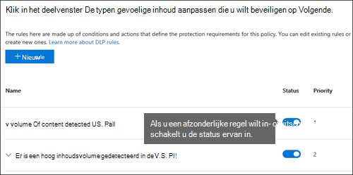

    You can also change the priority of multiple rules in a policy. To do that, open a policy for editing. In a row for a rule, choose the ellipses (**...**), and then choose an option, such as **Move down** or **Bring to last**.

    > [!div class="mx-imgBorder"]
    > -->

## DLP-rapporten

Nadat u uw DLP-beleid hebt gemaakt en in- of uit gebruik hebt gemaakt, wilt u controleren of ze werken zoals u had bedoeld en u helpen om aan de vereisten te voldoen. Met DLP-rapporten kunt u snel het aantal DLP-beleid- en regelwedstrijden in de tijd bekijken en het aantal onwaar-positieven en overschrijven. Voor elk rapport kunt u deze overeenkomsten filteren op locatie, tijdskader en zelfs beperken tot een specifiek beleid, regel of actie.

Met de DLP-rapporten kunt u bedrijfsinzichten krijgen en:

- Focus op specifieke tijdsperiodes en begrijp de redenen voor pieken en trends.

- Ontdek bedrijfsprocessen die in strijd zijn met het compliancebeleid van uw organisatie.

- Begrijp de zakelijke impact van het DLP-beleid.

Daarnaast kunt u de DLP-rapporten gebruiken om uw DLP-beleid aan te passen terwijl u ze uit runt.

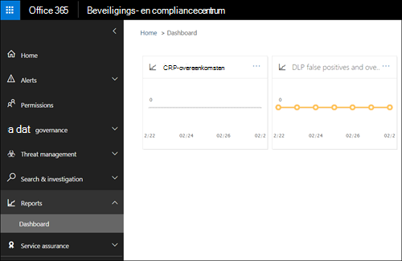

## Hoe DLP-beleid werkt

DLP detecteert gevoelige informatie met behulp van diepe inhoudsanalyse (niet alleen een eenvoudige tekstscan). In deze uitgebreide inhoudsanalyse worden trefwoorden, woordenlijsten, de evaluatie van reguliere expressies, interne functies en andere methoden gebruikt om inhoud te detecteren die overeenkomt met uw DLP-beleid. Mogelijk wordt slechts een klein percentage van uw gegevens als gevoelig beschouwd. Een DLP-beleid kan alleen die gegevens identificeren, controleren en automatisch beveiligen, zonder dat dit gevolgen heeft voor personen die met de rest van uw inhoud werken.

### Beleidsregels worden gesynchroniseerd

Nadat u een DLP-beleid hebt in het Beveiligings compliancecentrum, wordt het opgeslagen in een centrale beleidsopslag en vervolgens gesynchroniseerd met de verschillende &amp; inhoudsbronnen, waaronder:

- Exchange Online en van daar naar webversie van Outlook en Outlook.

- OneDrive voor Bedrijven sites.

- SharePoint Onlinesites.

- Office bureaubladprogramma's (Excel, PowerPoint en Word).

- Microsoft Teams kanalen en chatberichten.

Nadat het beleid is gesynchroniseerd met de juiste locaties, wordt gestart met het evalueren van inhoud en het afdwingen van acties.
<!-- what is the time delay for first deployment of a policy and what is the sync schedule? -->

### Beleidsevaluatie op OneDrive voor Bedrijven en SharePoint onlinesites

Op al uw SharePoint Online-sites en OneDrive voor Bedrijven-sites veranderen documenten voortdurend. Ze worden voortdurend gemaakt, bewerkt, gedeeld, en ga zo maar door. Dit betekent dat documenten op elk moment kunnen conflicteren met een DLP-beleid of in overeenstemming kunnen zijn met een DLP-beleid. Een persoon kan bijvoorbeeld een document uploaden dat geen gevoelige informatie bevat naar zijn of haar teamsite, maar later kan een andere persoon hetzelfde document bewerken en er gevoelige informatie aan toevoegen.

Daarom controleren DLP-beleidsregels documenten regelmatig op beleidswedstrijden op de achtergrond. U kunt dit zien als een asynchrone beleidsevaluatie.
<!-- what is the frequency? looks like it is tied to the search crawl schedule -->

#### Hoe het werkt

Wanneer personen documenten op hun sites toevoegen of wijzigen, scant de zoekmachine de inhoud, zodat u er later naar kunt zoeken. Terwijl dit gebeurt, wordt de inhoud ook gescand op gevoelige informatie en wordt gecontroleerd of deze wordt gedeeld. Alle gevoelige informatie die wordt gevonden, wordt veilig opgeslagen in de zoekindex, zodat alleen het complianceteam er toegang toe heeft, maar geen gewone gebruikers. Elk DLP-beleid dat u hebt ingeschakeld, wordt uitgevoerd op de achtergrond (asynchroon), vaak zoeken naar inhoud die overeenkomt met een beleid en acties toepassen om het te beschermen tegen onbedoelde lekken.

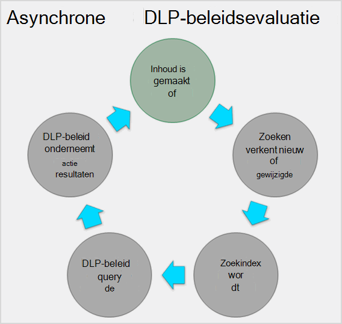

<!-- conflict with a DLP policy is bad wording -->
Ten slotte kunnen documenten conflicteren met een DLP-beleid, maar ze kunnen ook voldoen aan een DLP-beleid. Als een persoon bijvoorbeeld creditcardnummers toevoegt aan een document, kan een DLP-beleid ervoor zorgen dat de toegang tot het document automatisch wordt geblokkeerd. Maar als de persoon de gevoelige informatie later verwijdert, wordt de actie (in dit geval blokkeren) automatisch ongedaan gemaakt wanneer het document de volgende keer wordt geëvalueerd op basis van het beleid.

DLP evalueert alle inhoud die kan worden geïndexeerd. Zie Standaard verkende [bestandsextensies en geparseerde bestandstypen in SharePoint Server voor meer informatie over welke bestandstypen standaard worden verkend.](/SharePoint/technical-reference/default-crawled-file-name-extensions-and-parsed-file-types)

> [!NOTE]
> Als u wilt voorkomen dat documenten worden gedeeld voordat DLP-beleid de mogelijkheid had om ze te analyseren, kan het delen van nieuwe bestanden in SharePoint worden geblokkeerd totdat de inhoud is geïndexeerd. Zie Nieuwe [bestanden standaard markeren als gevoelig voor](/sharepoint/sensitive-by-default) gedetailleerde informatie.

### Beleidsevaluatie in Exchange Online, Outlook en webversie van Outlook

Wanneer u een DLP-beleid maakt dat Exchange Online als locatie bevat, wordt het beleid gesynchroniseerd van het Office 365 Security Compliance Center naar Exchange Online en vervolgens van Exchange Online naar webversie van Outlook en &amp; Outlook.

Wanneer een bericht wordt samengesteld in Outlook, kan de gebruiker beleidstips zien terwijl de inhoud die wordt gemaakt, wordt geëvalueerd op basis van DLP-beleid. Nadat een bericht is verzonden, wordt dit geëvalueerd op basis van DLP-beleid als een normaal onderdeel van de e-mailstroom, samen met Exchange regels voor e-mailstroom (ook wel transportregels genoemd) en DLP-beleid dat is gemaakt in het Exchange-beheercentrum. DLP-beleid scant zowel het bericht als eventuele bijlagen.

### Beleidsevaluatie in de Office bureaubladprogramma's

<!-- same capability to identify sensitive information line conflates sensitive information types and such -->
Excel, PowerPoint en Word bevatten dezelfde mogelijkheid om gevoelige informatie te identificeren en DLP-beleid toe te passen als SharePoint Online en OneDrive voor Bedrijven. Deze Office programma's synchroniseren hun DLP-beleid rechtstreeks vanuit de centrale beleidsopslag en evalueren vervolgens continu de inhoud tegen het DLP-beleid wanneer personen werken met documenten die zijn geopend vanaf een site die is opgenomen in een DLP-beleid.

DLP-beleidsevaluatie in Office is ontworpen om de prestaties van de programma's of de productiviteit van personen die aan inhoud werken, niet te beïnvloeden. Als ze aan een groot document werken of de computer van de gebruiker bezet is, kan het enkele seconden duren voordat een beleidstip wordt weergegeven.

### Beleidsevaluatie in Microsoft Teams
 <!--what do you mean that it's synched to user accounts?  I thought DLP policies were applied to locations not users like sensitivity labels are  -->

Wanneer u een DLP-beleid maakt dat Microsoft Teams als locatie bevat, wordt het beleid gesynchroniseerd vanuit het Office 365 Security Compliance Center naar gebruikersaccounts en Microsoft Teams kanalen en &amp; chatberichten. Afhankelijk van hoe DLP-beleid is geconfigureerd, kan het bericht worden geblokkeerd of ingetrokken wanneer iemand gevoelige informatie probeert te delen in een Microsoft Teams chat- of kanaalbericht. En documenten die gevoelige informatie bevatten en die worden gedeeld met gasten (externe gebruikers) worden niet geopend voor deze gebruikers. Zie Preventie en preventie van [gegevensverlies](dlp-microsoft-teams.md)Microsoft Teams.

## Machtigingen

Globale beheerders, beveiligingsbeheerders en compliancebeheerders hebben standaard toegang tot het maken en toepassen van een DLP-beleid. Andere leden van uw complianceteam die DLP-beleidsregels maken, hebben machtigingen nodig voor het Beveiligings &amp; compliancecentrum. Uw tenantbeheerder heeft standaard toegang tot deze locatie en kan compliancemedewerkers en andere personen toegang geven tot het Beveiligings compliancecentrum, zonder dat ze alle machtigingen van een &amp; tenantbeheerder hebben. U wordt aangeraden het volgende te doen:

1. Maak een groep in Microsoft 365 en voeg compliance officers toe aan deze groep.

2. Maak een rollengroep op de **pagina Machtigingen** van het Beveiligings &amp; compliancecentrum.

3. Terwijl u de rollengroep maakt, gebruikt u **de** sectie Rollen kiezen om de volgende rol toe te voegen aan de rollengroep: **DLP Compliance Management.**

4. Gebruik de **sectie Leden kiezen** om de groep Microsoft 365 die u eerder hebt gemaakt, toe te voegen aan de rollengroep.

U kunt ook een rollengroep maken met alleen-weergeven-bevoegdheden voor het DLP-beleid en DLP-rapporten door de functie **Alleen-weergeven DLP-compliancebeheer toe te** staan.

Zie Gebruikers toegang geven tot het Office 365 [Compliance Center voor meer informatie.](../security/office-365-security/grant-access-to-the-security-and-compliance-center.md)

Deze machtigingen zijn alleen vereist om een DLP-beleid te maken en toe te passen. Beleidshandhaving vereist geen toegang tot de inhoud.

## De DLP-cmdlets zoeken

Als u de meeste cmdlets wilt gebruiken voor het Beveiligings &amp; compliancecentrum, moet u het volgende doen:

1. [Verbinding maken naar de Office 365 Beveiliging &amp; Compliancecentrum met behulp van externe PowerShell.](/powershell/exchange/connect-to-scc-powershell)

2. Gebruik een van deze [policy-and-compliance-dlp-cmdlets](/powershell/module/exchange/export-dlppolicycollection).

In DLP-rapporten moeten echter gegevens uit verschillende Microsoft 365 worden verzameld, inclusief Exchange Online. Daarom zijn de **cmdlets voor de DLP-rapporten beschikbaar in Exchange Online Powershell, niet in Security &amp; Compliance Center Powershell.** Als u de cmdlets voor de DLP-rapporten wilt gebruiken, moet u het volgende doen:

1. [Maak verbinding met Exchange Online via externe PowerShell](/powershell/exchange/connect-to-exchange-online-powershell).

2. Gebruik een van deze cmdlets voor de DLP-rapporten:

    - [Get-DlpDetectionsReport](/powershell/module/exchange/Get-DlpDetectionsReport)

    - [Get-DlpDetailReport](/powershell/module/exchange/Get-DlpDetailReport)

## Meer informatie

- [Een DLP-beleid maken vanuit een sjabloon](create-a-dlp-policy-from-a-template.md)

- [Meldingen verzenden en beleidstips voor DLP-beleid tonen](use-notifications-and-policy-tips.md)

- [Een DLP-beleid maken om documenten te beveiligen met FCI of andere eigenschappen](protect-documents-that-have-fci-or-other-properties.md)

- [Wat zijn de DLP-beleidssjablonen?](what-the-dlp-policy-templates-include.md)

- [Definities van entiteiten van het type vertrouwelijke gegevens](sensitive-information-type-entity-definitions.md)

- [Doel van de DLP-functies](what-the-dlp-functions-look-for.md)

- [Een aangepast type gevoelige informatie maken](create-a-custom-sensitive-information-type.md)
