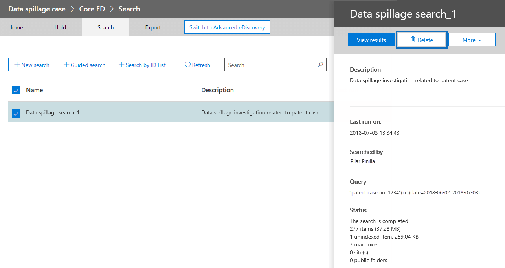

# eDiscovery-oplossingsreeks: scenario voor gegevensoverloop - Zoeken en verwijderen

 **Wat is gegevensmortage en wat maakt het u uit?** Data spillage is wanneer een vertrouwelijk document wordt uitgebracht in een niet-vertrouwde omgeving. Wanneer een incident met gegevensmortage wordt gedetecteerd, is het belangrijk om snel de grootte en locaties van het overloop te beoordelen, de activiteiten van gebruikers eromheen te bekijken en vervolgens de gemorste gegevens permanent uit het systeem te verwijderen. 
  
## Scenario voor gegevensmortage

U bent een hoofdinformatiebeveiligingsmedewerker bij Contoso. U bent op de hoogte van een situatie waarin een werknemer een document met meerdere personen per e-mail zonder medeweten heeft gedeeld. U wilt snel beoordelen wie dit document intern en extern heeft ontvangen. Nadat u de gegevens hebt geïdentificeerd, wilt u de bevindingen van de zaak delen met andere onderzoeker die u wilt controleren en de gegevens vervolgens definitief uit de Office 365. Nadat het onderzoek is voltooid, wilt u een rapport genereren met het bewijs van permanente verwijdering en andere details van de zaak voor een toekomstige verwijzing.
  
### Bereik van dit artikel

Dit document bevat een lijst met instructies voor het permanent verwijderen van een bericht uit Microsoft 365 zodat het niet toegankelijk of herstelbaar is. Zie E-mailberichten zoeken en verwijderen in uw organisatie als u een bericht wilt verwijderen en herstellen totdat de bewaarperiode van het verwijderde item [is verlopen.](search-for-and-delete-messages-in-your-organization.md)
  
## Werkstroom voor het beheren van incidenten met gegevensmortage

Ga als volgende te werk om een incident met gegevensmortage te beheren:

  
[(Optioneel) Stap 1: beheren wie toegang heeft tot de zaak en nalevingsgrenzen instellen](#optional-step-1-manage-who-can-access-the-case-and-set-compliance-boundaries) 
[Stap 2: een eDiscovery-zaak maken](#step-2-create-an-ediscovery-case) 
[Stap 3: Zoeken naar de gemorste gegevens](#step-3-search-for-the-spilled-data) 
[Stap 4: Case findings controleren en valideren](#step-4-review-and-validate-case-findings) 
[Stap 5: Berichten traceren gebruiken om te controleren hoe gemorste gegevens zijn gedeeld](#step-5-use-message-trace-log-to-check-how-spilled-data-was-shared) 
[Stap 6: De postvakken voorbereiden](#step-6-prepare-the-mailboxes) 
[Stap 7: De gemorste gegevens definitief verwijderen](#step-7-permanently-delete-the-spilled-data) 
[Stap 8: Verifiëren, een bewijs van verwijdering en controle leveren](#step-8-verify-provide-a-proof-of-deletion-and-audit) 

## Dingen die u moet weten voordat u begint

- Wanneer een postvak in bewaring staat, blijft een verwijderd bericht in de map Herstelbare items staan totdat de bewaarperiode verloopt of de bewaring wordt vrijgegeven. [In stap 6](#step-6-prepare-the-mailboxes) wordt beschreven hoe u de wacht in de postvakken verwijdert. Neem contact op met uw recordsbeheer of juridische afdelingen voordat u de wacht houdt. Uw organisatie heeft mogelijk een beleid dat bepaalt of een postvak in de wacht staat of dat een incident met gegevensmortage prioriteit heeft. 
    
- Als u wilt bepalen welke gebruikerspostvakken een data spillage-onderzoeker kan zoeken en beheren wie toegang heeft tot de zaak, kunt u compliancegrenzen instellen en een aangepaste rollengroep maken, die wordt beschreven in [stap 1.](#optional-step-1-manage-who-can-access-the-case-and-set-compliance-boundaries) Hiervoor moet u lid zijn van de rollengroep Organisatiebeheer of de rol voor rollenbeheer krijgen toegewezen. Als u of de beheerder in uw organisatie al compliancegrenzen heeft ingesteld, kunt u stap 1 overslaan.
    
- Als u een zaak wilt maken, moet u lid zijn van de rollengroep eDiscovery Manager of lid zijn van een aangepaste rollengroep die de rol Case Management heeft toegewezen. Als u geen lid bent, vraagt u een beheerder Microsoft 365 u toe te voegen aan de [rollengroep eDiscovery Manager.](assign-ediscovery-permissions.md)
    
- Om inhoud te zoeken, moet u lid zijn van de rollengroep eDiscovery-beheerder of aan de beheerdersrol Compliance zoeken zijn toegewezen. Om berichten te verwijderen, moet u lid zijn van de rollengroep Organisatiebeheer of aan de rol Zoeken en opschonen zijn toegewezen. Zie [eDiscovery-machtigingen toewijzen in het Beveiligings- en compliancecentrum](./assign-ediscovery-permissions.md) voor informatie over het toevoegen van gebruikers aan een rollengroep.
    
- Als u in stap 8 in het auditlogboek eDiscovery-activiteiten wilt zoeken, moet auditing zijn ingeschakeld voor uw organisatie. U kunt zoeken naar activiteiten die in de afgelopen 90 dagen zijn uitgevoerd. Voor meer informatie over het inschakelen en  gebruiken van auditing, gaat u naar de sectie Controle van het onderzoeksproces voor gegevensmortage in stap 8. 
    
## (Optioneel) Stap 1: beheren wie toegang heeft tot de zaak en nalevingsgrenzen instellen

Afhankelijk van uw organisatiepraktijk, moet u bepalen wie toegang heeft tot de eDiscovery-zaak die wordt gebruikt om een incident met gegevensoverloop te onderzoeken en compliancegrenzen in te stellen. De eenvoudigste manier om dit te doen, is door onderzoekers toe te voegen als lid van een bestaande rollengroep in het beveiligings- & compliancecentrum en vervolgens de rollengroep toe te voegen als lid van de eDiscovery-zaak. Zie eDiscovery-machtigingen toewijzen voor informatie over de ingebouwde eDiscovery-rollengroepen en over het toevoegen van leden aan een [eDiscovery-zaak.](assign-ediscovery-permissions.md)
  
U kunt ook een nieuwe rollengroep maken die is afgestemd op de behoeften van uw organisatie. U wilt bijvoorbeeld dat een groep gegevensmortageonderzoekers in de organisatie toegang krijgt tot en samenwerkt aan alle gevallen van gegevensmortage. U kunt dit doen door een rollengroep 'Data Spillage Investigator' te maken, de juiste rollen toe te wijzen (Exporteren, RMS Decrypt, Controleren, Preview, Compliance search en Case Management), de gegevensmortageonderzoekers toe te voegen aan de rollengroep en vervolgens de rollengroep toe te voegen als lid van het eDiscovery-geval voor gegevensoverloop. Zie [Nalevingsgrenzen instellen voor eDiscovery-onderzoeken in](tagging-and-assessment-in-advanced-ediscovery.md) Office 365 voor gedetailleerde instructies over hoe u dit doet. 
  
## Stap 2: een eDiscovery-zaak maken

Een eDiscovery-zaak biedt een effectieve manier om uw onderzoek naar gegevensmortage te beheren. U kunt leden toevoegen aan de rollengroep die u hebt gemaakt in stap 1, de rollengroep toevoegen als lid van een nieuw eDiscovery-geval, iteratieve zoekopdrachten uitvoeren om de gemorste gegevens te vinden, een rapport exporteren om te delen, de status van de zaak bijhouden en zo nodig teruggaan naar de details van de zaak. Overweeg een naamgevingsconventie op te stellen voor eDiscovery-gevallen die worden gebruikt voor incidenten met gegevensoverloop en geef zo veel mogelijk informatie op in de naam en beschrijving van de zaak, zodat u in de toekomst zo nodig kunt zoeken en verwijzen.
  
Als u een nieuwe zaak wilt maken, kunt u eDiscovery gebruiken in het beveiligings- en compliancecentrum. Zie 'Een nieuwe zaak maken' in [Aan de slag met Core eDiscovery.](get-started-core-ediscovery.md#step-3-create-a-core-ediscovery-case)
  
## Stap 3: Zoeken naar de gemorste gegevens

Nu u een case en beheerde toegang hebt gemaakt, kunt u de case gebruiken om de gemorste gegevens te zoeken en de postvakken te identificeren die de gemorste gegevens bevatten. U gebruikt dezelfde zoekquery die u hebt gebruikt om de e-mailberichten te vinden om dezelfde berichten te verwijderen in [stap 7.](#step-7-permanently-delete-the-spilled-data)
  
Zie Zoeken naar inhoud in een [hoofd-eDiscovery-zaak](search-for-content-in-core-ediscovery.md)als u een inhoudszoekactie wilt maken die is gekoppeld aan een eDiscovery-zaak.
  
> [!IMPORTANT]
> De trefwoorden die u in de zoekquery gebruikt, bevatten mogelijk de werkelijke gemorste gegevens die u zoekt. Als u bijvoorbeeld zoekt naar documenten met een sociaal-zekerheidsnummer en u het als zoekwoord gebruikt, moet u de query daarna verwijderen om verdere overloop te voorkomen. Zie [De zoekquery verwijderen](#deleting-the-search-query) in stap 8.
  
## Stap 4: Case findings controleren en valideren

Nadat u een inhoudszoekactie hebt gestart, moet u controleren en valideren of de zoekresultaten bestaan en controleren of deze alleen bestaan uit de e-mailberichten die moeten worden verwijderd. In een inhoudszoekactie kunt u een voorbeeld bekijken van een willekeurige steekproef van 1000 e-mailberichten zonder de zoekresultaten te exporteren om verdere gegevensmortage te voorkomen. U kunt meer lezen over de preview-beperkingen bij [Limieten voor zoeken naar inhoud.](limits-for-content-search.md)
  
Als u meer dan 1.000 postvakken of meer dan 100 e-mailberichten per postvak wilt controleren, kunt u de eerste zoekopdracht in meerdere zoekopdrachten verdelen met behulp van aanvullende trefwoorden of voorwaarden, zoals datumbereik of afzender/geadresseerde, en de resultaten van elke zoekopdracht afzonderlijk bekijken. Noteer alle zoekquery's die u wilt gebruiken wanneer u berichten verwijdert in [stap 7.](#step-7-permanently-delete-the-spilled-data)

Als aan een bewaarder of eindgebruiker een Office 365 E5-licentie is toegewezen, kunt u maximaal 10.000 zoekresultaten tegelijk bekijken met Advanced eDiscovery. Als er meer dan 10.000 e-mailberichten moeten worden beoordeeld, kunt u de zoekquery delen op datumbereik en elk resultaat afzonderlijk controleren terwijl de zoekresultaten worden gesorteerd op datum. In Advanced eDiscovery kunt u zoekresultaten taggen met de functie **Label** als functie in het voorbeeldvenster en het zoekresultaat filteren op de tag die u hebt gelabeld. Dit is handig als u samenwerkt met een secundaire revisor. Met behulp van extra analysehulpmiddelen in Advanced eDiscovery, zoals optische tekenherkenning, e-mailthreading en voorspellende codering, kunt u snel duizenden berichten verwerken en controleren en deze taggen voor verder onderzoek. Zie [Snelle installatie voor Advanced eDiscovery.](./get-started-with-advanced-ediscovery.md)

Wanneer u een e-mailbericht met gemorste gegevens vindt, controleert u de geadresseerden van het bericht om te bepalen of het extern is gedeeld. Als u een bericht verder wilt traceren, kunt u afzendergegevens en datumbereiken verzamelen, zodat u de logboeken voor berichtsporen kunt gebruiken. Dit proces wordt beschreven in [stap 5.](#step-5-use-message-trace-log-to-check-how-spilled-data-was-shared)

Nadat u de zoekresultaten hebt geverifieerd, kunt u uw bevindingen met anderen delen voor een secundaire controle. Personen die u in stap 1 aan de zaak hebt toegewezen, kunnen de inhoud van de zaak bekijken in zowel eDiscovery als Advanced eDiscovery en het goedkeuren van case-bevindingen. U kunt ook een rapport genereren zonder de werkelijke inhoud te exporteren. U kunt ditzelfde rapport ook gebruiken als een bewijs van verwijdering, dat wordt beschreven in [stap 8.](#step-8-verify-provide-a-proof-of-deletion-and-audit)
  
 **Een statistisch rapport genereren:**
  
1. Ga naar **de pagina Zoeken** in het eDiscovery-geval en klik op de zoekopdracht waar u een rapport voor wilt genereren. 
    
2. Klik op de flyoutpagina op **Meer > Rapport exporteren.**
 
      De pagina Rapport exporteren wordt weergegeven.

    
    
3. Selecteer Alle items, inclusief items met een **niet-herkende notatie,** zijn versleuteld of zijn om andere redenen niet geïndexeerd en klik vervolgens op **Rapport genereren.**

4. Klik in het eDiscovery-geval op **Exporteren om** de lijst met exporttaken weer te geven. Mogelijk moet u op Vernieuwen klikken **om** de lijst bij te werken om de exportklus weer te geven die u hebt gemaakt.

5. Klik op de exportklus en klik vervolgens **op Rapport** downloaden op de flyoutpagina.
 
    

Het **rapport Overzicht exporteren** bevat het aantal gevonden locaties met resultaten en de grootte van de zoekresultaten. U kunt dit gebruiken om te vergelijken met het rapport dat is gegenereerd na verwijdering en als een bewijs van verwijdering op te geven. Het **rapport** Resultaten bevat een gedetailleerdere samenvatting van de zoekresultaten, inclusief het onderwerp, de afzender, de geadresseerden, als het e-mailbericht is gelezen, datums en grootte van elk bericht. Als een van de details in dit rapport gegevens bevat die daadwerkelijk zijn overgeslagen, moet u het Results.csv definitief verwijderen wanneer het onderzoek is voltooid.

Zie Een inhoudszoekrapport exporteren voor meer informatie over het exporteren [van rapporten.](export-a-content-search-report.md)
    
## Stap 5: Berichten traceren gebruiken om te controleren hoe gemorste gegevens zijn gedeeld

Als u verder wilt onderzoeken of e-mail met gemorste gegevens is gedeeld, kunt u desgewenst de berichten traceren met de afzendergegevens en de datumbereikgegevens die u hebt verzameld in stap 4. De bewaarperiode voor berichtspoor is 30 dagen voor realtimegegevens en 90 dagen voor historische gegevens.
  
U kunt Bericht traceren gebruiken in het beveiligings- en compliancecentrum of de bijbehorende cmdlets gebruiken in Exchange Online PowerShell. Het is belangrijk om te weten dat berichttracing geen volledige garanties biedt voor de volledigheid van de geretourneerde gegevens. Zie voor meer informatie over het gebruik van Bericht traceren: 
  
- [Bericht traceren in het beveiligings- & compliancecentrum](../security/office-365-security/message-trace-scc.md)
    
- [Nieuwe berichten traceren in & compliancecentrum](https://blogs.technet.microsoft.com/exchange/2018/05/02/new-message-trace-in-office-365-security-compliance-center/)
    
## Stap 6: De postvakken voorbereiden

Nadat u hebt beoordeeld en gevalideerd dat de zoekresultaten alleen de berichten bevatten die moeten worden verwijderd, moet u een lijst verzamelen met de e-mailadressen van de beïnvloede postvakken die u in stap 7 kunt gebruiken wanneer u de gemorste gegevens verwijdert. Mogelijk moet u de postvakken ook voorbereiden voordat u e-mailberichten definitief kunt verwijderen, afhankelijk van of herstel van één item is ingeschakeld op de postvakken met de gemorste gegevens of als een van deze postvakken in de wacht staat.
  
### Een lijst met adressen van postvakken met gemorste gegevens krijgen

Er zijn twee manieren om een lijst met e-mailadressen van postvakken met gemorste gegevens te verzamelen.

**Optie 1: Een lijst met adressen van postvakken met gemorste gegevens krijgen**

1. Open de eDiscovery-zaak, ga naar de pagina **Zoeken** en selecteer de juiste inhoudszoekactie. 
    
2. Klik op de flyoutpagina op **Resultaten weergeven.**
    
3. Klik in **de vervolgkeuzelijst** Afzonderlijke resultaten op **Zoekstatistieken.**
    
4. Klik in **de** vervolgkeuzelijst Type op **Toplocaties.**
    
    

    Er wordt een lijst met postvakken met zoekresultaten weergegeven. Het aantal items in elk postvak dat overeenkomen met de zoekquery, wordt ook weergegeven.
    
5. Kopieer de gegevens in de lijst en sla deze op in een bestand of klik op **Downloaden** om de gegevens naar een CSV-bestand te downloaden. 
    
**Optie 2: Postvaklocaties halen uit het exportrapport**

Open het rapport Overzicht exporteren dat u hebt gedownload in [stap 4.](#step-4-review-and-validate-case-findings) In de eerste kolom in het rapport wordt het e-mailadres van elk postvak weergegeven onder **Locaties.**
  
### Bereid de postvakken voor, zodat u de gemorste gegevens kunt verwijderen

Als herstel van één item is ingeschakeld of als een postvak in de wacht wordt geplaatst, wordt een definitief verwijderd bericht (verwijderd) bewaard in de map Herstelbare items. Dus voordat u gemorste gegevens kunt verwijderen, moet u de bestaande postvakconfiguraties controleren en herstel van één item uitschakelen en bewaarbeleid verwijderen. Houd er rekening mee dat u één postvak tegelijk kunt voorbereiden en vervolgens dezelfde opdracht op verschillende postvakken kunt uitvoeren of een PowerShell-script kunt maken om meerdere postvakken tegelijk voor te bereiden.

- Zie 'Stap 1: Gegevens over het postvak verzamelen' in Items verwijderen in de map Herstelbare items met [postvakken](delete-items-in-the-recoverable-items-folder-of-mailboxes-on-hold.md#step-1-collect-information-about-the-mailbox) in de cloud in bewaring voor instructies over het controleren of herstel van één item is ingeschakeld of of het postvak in bewaring is geplaatst of dat het is toegewezen aan een bewaarbeleid. 

- Zie 'Stap 2: Het postvak voorbereiden' in Items verwijderen in de map Herstelbare items met [postvakken in](delete-items-in-the-recoverable-items-folder-of-mailboxes-on-hold.md#step-2-prepare-the-mailbox) de cloud in de wacht voor instructies over het uitschakelen van herstel van één item. 

- Zie 'Stap 3: Alle bewaringen uit het postvak verwijderen' in Items verwijderen in de map Herstelbare items met [postvakken](delete-items-in-the-recoverable-items-folder-of-mailboxes-on-hold.md#step-3-remove-all-holds-from-the-mailbox) in de cloud in bewaring voor instructies over het verwijderen van een bewaringsbeleid of bewaarbeleid uit een postvak. 

- Zie 'Stap 4: De vertragingsopslag uit het postvak verwijderen' in Items verwijderen in de map Herstelbare items met [postvakken](delete-items-in-the-recoverable-items-folder-of-mailboxes-on-hold.md#step-4-remove-the-delay-hold-from-the-mailbox) in de cloud in de wachtstand voor instructies over het verwijderen van de vertragingsopslag die in het postvak wordt geplaatst nadat een type wachtstand is verwijderd.

> [!IMPORTANT]
> Neem contact op met uw recordsbeheer of juridische afdelingen voordat u een bewarings- of bewaarbeleid verwijdert. Uw organisatie heeft mogelijk een beleid dat bepaalt of een postvak in de wacht staat of dat een incident met gegevensmortage prioriteit heeft. 
  
Zorg ervoor dat u het postvak terugdraait naar eerdere configuraties nadat u hebt gecontroleerd of de gemorste gegevens permanent zijn verwijderd. Zie de details in [stap 7.](#step-7-permanently-delete-the-spilled-data)

## Stap 7: De gemorste gegevens definitief verwijderen

Met behulp van de postvaklocaties die u hebt verzameld en voorbereid in stap 6 en de zoekquery die is gemaakt en verfijnd in stap 3 om e-mailberichten te zoeken die de gemorste gegevens bevatten, kunt u de gemorste gegevens nu definitief verwijderen.  Als u berichten wilt verwijderen, moet u, zoals eerder is uitgelegd, lid zijn van de rollengroep Organisatiebeheer of de functie Zoeken en verwijderen krijgen toegewezen. Zie [eDiscovery-machtigingen toewijzen in het Beveiligings- en compliancecentrum](./assign-ediscovery-permissions.md) voor informatie over het toevoegen van gebruikers aan een rollengroep.

Zie E-mailberichten zoeken en verwijderen om de gemorste berichten [te verwijderen.](search-for-and-delete-messages-in-your-organization.md)

Houd rekening met de volgende limieten bij het verwijderen van gemorste gegevens:

- Het maximum aantal postvakken in een zoekopdracht dat u kunt gebruiken om items te verwijderen door een zoek- en verwijderactie uit te voeren, is 50.000. Als met de zoekopdracht die u in stap 3 maakt, meer dan 50.000 postvakken worden doorzocht, mislukt de actie voor het verwijderen. Er kan meestal worden gezocht naar meer dan 50.000 postvakken in één zoekopdracht wanneer u de zoekopdracht zo configureert dat alle postvakken in uw organisatie worden gebruikt. Deze beperking geldt ook wanneer minder dan 50.000 postvakken items bevatten die overeenkomen met de zoekopdracht.

- U kunt per keer maximaal 10 items per postvak verwijderen. Omdat de mogelijkheid om berichten te zoeken en te verwijderen is bedoeld als een hulpprogramma voor incidentele reactie, zorgt deze limiet ervoor dat berichten snel uit postvakken worden verwijderd. Deze functie is niet bedoeld om postvakken van gebruikers op te schonen.

> [!IMPORTANT]
> E-mailitems in een revisieset in een Advanced eDiscovery-zaak kunnen niet worden verwijderd met behulp van de procedures in dit artikel. Dit komt omdat items in een revisieset kopieën zijn van items in de liveservice die worden gekopieerd en opgeslagen op een Azure Storage locatie. Dit betekent dat ze niet worden geretourneerd door een inhoudszoekactie die u maakt in stap 3. Als u items in een revisieset wilt verwijderen, moet u de Advanced eDiscovery-zaak met de revisieset verwijderen. Zie [Advanced eDiscovery-zaak sluiten of verwijderen](close-or-delete-case.md) voor meer informatie.
  
## Stap 8: Verifiëren, een bewijs van verwijdering en controle leveren

De laatste stap in de werkstroom voor het beheren van een incident met gegevensoverloop is om te controleren of de gemorste gegevens definitief uit het postvak zijn verwijderd door naar de eDiscovery-zaak te gaan en dezelfde zoekquery opnieuw uit te voeren die is gebruikt om die gegevens te verwijderen om te bevestigen dat er geen resultaten worden geretourneerd. Nadat u hebt bevestigd dat de gemorste gegevens definitief zijn verwijderd, kunt u een rapport exporteren en dit (samen met het oorspronkelijke rapport) opnemen als een bewijs van verwijdering. Vervolgens kunt u [de zaak sluiten,](close-reopen-delete-core-ediscovery-cases.md) zodat u deze opnieuw kunt openen als u er in de toekomst naar moet verwijzen. Daarnaast kunt u postvakken ook terugdraaien naar de vorige status, de zoekquery verwijderen die wordt gebruikt om de gemorste gegevens te vinden en te zoeken naar controlerecords van taken die zijn uitgevoerd bij het beheren van het incident met gegevensmortage.
  
### De postvakken terugdraaien naar de vorige status

Als u de configuratie van een postvak in stap 6 hebt gewijzigd om de postvakken voor te bereiden voordat de gemorste gegevens zijn verwijderd, moet u deze terugdraaien naar de vorige status. Zie 'Stap 6: Het postvak herstellen naar de vorige status' in Items verwijderen in de map Herstelbare items met postvakken in de cloud in [de wacht.](delete-items-in-the-recoverable-items-folder-of-mailboxes-on-hold.md#step-6-revert-the-mailbox-to-its-previous-state)
  
### De zoekquery verwijderen

Als de trefwoorden in de zoekquery die u in stap 3 hebt gemaakt en gebruikt, enkele van alle werkelijke gemorste gegevens bevatten, moet u de zoekquery verwijderen om verdere gegevensmortage te voorkomen.
  
1. Open het eDiscovery-geval in het beveiligings-  en compliancecentrum, ga naar de pagina Zoeken en selecteer de juiste inhoudszoekactie.

2. Klik op de flyoutpagina op **Verwijderen.**

    

### Controle van het onderzoek naar gegevensmortage

U kunt in het auditlogboek zoeken naar de eDiscovery-activiteiten die tijdens het onderzoek zijn uitgevoerd. U kunt ook zoeken in het auditlogboek om de auditrecords te retourneren voor de opdracht **New-ComplianceSearchAction -Purge** die u in stap 7 hebt uitgevoerd om de gemorste gegevens te verwijderen. Zie voor meer informatie:

- [Zoeken in het auditlogboek](search-the-audit-log-in-security-and-compliance.md)

- [Zoeken naar eDiscovery-activiteiten in het auditlogboek](search-for-ediscovery-activities-in-the-audit-log.md)
