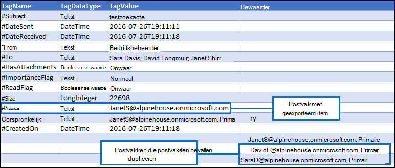

# De-duplicatie in de zoekresultaten van eDiscoveryDe-duplication in eDiscovery search results

In dit artikel wordt beschreven hoe het de-dupliceren van eDiscovery-zoekresultaten werkt en worden de beperkingen van het algoritme voor de duplicatie beschreven.This article describes how de-duplication of eDiscovery search results works and explains the limitations of the de-duplication algorithm.
  
Wanneer u eDiscovery-hulpprogramma's gebruikt om de resultaten van een eDiscovery-zoekopdracht te exporteren, hebt u de optie om de geëxporteerde resultaten te de-dupliceren.When using eDiscovery tools to export the results of an eDiscovery search, you have the option to de-duplicate the results that are exported. Wat betekent dit?What does this mean? Wanneer u de-duplicatie inschakelen (standaard is de-duplicatie niet ingeschakeld), wordt slechts één kopie van een e-mailbericht geëxporteerd, ook al zijn er mogelijk meerdere exemplaren van hetzelfde bericht gevonden in de postvakken die zijn doorzocht.When you enable de-duplication (by default, de-duplication isn't enabled), only one copy of an email message is exported even though multiple instances of the same message might have been found in the mailboxes that were searched. De-duplicatie helpt u tijd te besparen door het aantal items te verminderen dat u moet controleren en analyseren nadat de zoekresultaten zijn geëxporteerd.De-duplication helps you save time by reducing the number of items that you have to review and analyze after the search results are exported. Maar het is belangrijk om te begrijpen hoe de-duplicatie werkt en er rekening mee te houden dat er beperkingen zijn aan het algoritme, zodat een uniek item tijdens het exportproces als een duplicaat kan worden gemarkeerd.But it's important to understand how de-duplication works and be aware that there are limitations to the algorithm that might cause a unique item to be marked as a duplicate during the export process.
  
## Hoe dubbele berichten worden geïdentificeerdHow duplicate messages are identified

eDiscovery-hulpprogramma's gebruiken een combinatie van de volgende e-maileigenschappen om te bepalen of een bericht een duplicaat is:eDiscovery tools use a combination of the following email properties to determine whether a message is a duplicate:
  
- **InternetMessageId:** met deze eigenschap wordt de internetberichtaanduiding van een e-mailbericht opgegeven, een globaal unieke id die verwijst naar een specifieke versie van een specifiek bericht.**InternetMessageId** - This property specifies the Internet message identifier of an email message, which is a globally unique identifier that refers to a specific version of a specific message. Deze id wordt gegenereerd door het e-mailclientprogramma van de afzender of het host-e-mailsysteem dat het bericht verzendt.This ID is generated by the sender's email client program or host email system that sends the message. Als een persoon een bericht naar meer dan één geadresseerde verzendt, is de internetbericht-id hetzelfde voor elk exemplaar van het bericht.If a person sends a message to more than one recipient, the Internet message ID will be the same for each instance of the message. Volgende revisies van het oorspronkelijke bericht ontvangen een andere berichtaanduiding.Subsequent revisions to the original message will receive a different message identifier. 

- **ConversationTopic** - Met deze eigenschap wordt het onderwerp opgegeven van de gespreksthread van een bericht.**ConversationTopic** - This property specifies the subject of the conversation thread of a message. De waarde van de **eigenschap ConversationTopic** is de tekenreeks die het algemene onderwerp van het gesprek beschrijft.The value of the **ConversationTopic** property is the string that describes the overall topic of the conversation. Een bewaring bestaat uit een eerste bericht en alle berichten die worden verzonden als antwoord op het eerste bericht.A conservation consists of an initial message and all messages sent in reply to the initial message. Berichten in hetzelfde gesprek hebben dezelfde waarde voor de **eigenschap ConversationTopic.**Messages within the same conversation have the same value for the **ConversationTopic** property. De waarde van deze eigenschap is meestal de onderwerpregel van het eerste bericht dat het gesprek heeft voortgebracht.The value of this property is typically the Subject line from the initial message that spawned the conversation. 

- **BodyTagInfo** - Dit is een interne Exchange store-eigenschap.**BodyTagInfo** - This is an internal Exchange store property. De waarde van deze eigenschap wordt berekend door verschillende kenmerken in de body van het bericht te controleren.The value of this property is calculated by checking various attributes in the body of the message. Deze eigenschap wordt gebruikt om verschillen in de tekst van berichten te identificeren.This property is used to identify differences in the body of messages. 

Tijdens het eDiscovery-exportproces worden deze drie eigenschappen vergeleken voor elk bericht dat voldoet aan de zoekcriteria.During the eDiscovery export process, these three properties are compared for every message that matches the search criteria. Als deze eigenschappen identiek zijn voor twee (of meer) berichten, worden deze berichten als duplicaten bepaald en is het resultaat dat slechts één kopie van het bericht wordt geëxporteerd als de duplicatie is ingeschakeld.If these properties are identical for two (or more) messages, those messages are determined to be duplicates and the result is that only one copy of the message will be exported if de-duplication is enabled. Het bericht dat wordt geëxporteerd, wordt het 'bronitem' genoemd.The message that is exported is known as the "source item". Informatie over dubbele berichten wordt opgenomen in de **Results.csv** en **Manifest.xml** rapporten die zijn opgenomen in de geëxporteerde zoekresultaten.Information about duplicate messages is included in the **Results.csv** and **Manifest.xml** reports that are included with the exported search results. In het **Results.csv** wordt een duplicaatbericht geïdentificeerd met een waarde in de kolom **Dupliceren naar** item.In the **Results.csv** file, a duplicate message is identified by having a value in the **Duplicate to Item** column. De waarde in deze kolom komt overeen met de waarde in de **kolom Itemidentiteit** voor het bericht dat is geëxporteerd.The value in this column matches the value in the **Item Identity** column for the message that was exported. 
  
In de volgende afbeeldingen wordt weergegeven  hoe dubbele berichten worden weergegeven in deResults.csven **Manifest.xml** die met de zoekresultaten worden geëxporteerd.The following graphics show how duplicate messages are displayed in the **Results.csv** and **Manifest.xml** reports that are exported with the search results. Deze rapporten bevatten niet de e-maileigenschappen die eerder zijn beschreven, die worden gebruikt in het algoritme voor de duplicatie.These reports don't include the email properties previously described, which are used in the de-duplication algorithm. In plaats daarvan bevatten de rapporten de **eigenschap Itemidentiteit** die is toegewezen aan items door de Exchange store.Instead, the reports include the **Item Identity** property that is assigned to items by the Exchange store. 
  
 ### Results.csv rapport (bekeken in Excel)Results.csv report (viewed in Excel)
  

  
 ### Manifest.xml rapport (bekeken in Excel)Manifest.xml report (viewed in Excel)
  

  
Daarnaast worden andere eigenschappen van dubbele berichten opgenomen in de exportrapporten.Additionally, other properties from duplicate messages are included in the export reports. Dit geldt ook voor het postvak waarin het dubbele bericht zich bevindt, of het bericht is verzonden naar een distributiegroep en of het bericht CC'd of BCC'd was naar een andere gebruiker.This includes the mailbox the duplicate message is located in, whether the message was sent to a distribution group, and whether the message was Cc'd or Bcc'd to another user.
  
## Beperkingen van het algoritme voor de duplicatieLimitations of the de-duplication algorithm

Er zijn enkele bekende beperkingen van het algoritme voor de duplicatie, zodat unieke items als duplicaten kunnen worden gemarkeerd.There are some known limitations of the de-duplication algorithm that might cause unique items to get marked as duplicates. Het is belangrijk om deze beperkingen te begrijpen, zodat u kunt bepalen of u de optionele deplicatiefunctie al dan niet wilt gebruiken.It's important to understand these limitations so you can decide whether or not to use the optional de-duplication feature.
  
Er is één situatie waarbij de functie voor de duplicatie een bericht mogelijk per ongeluk als een duplicaat identificeert en niet exporteert (maar het bericht nog steeds als een duplicaat in de exportrapporten noemt).There's one situation where the de-duplication feature might mistakenly identify a message as a duplicate and not export it (but still cite it as a duplicate in the export reports). Dit zijn berichten die een gebruiker bewerkt, maar niet verzendt.These are messages that a user edits but doesn't send. Stel dat een gebruiker een bericht in Outlook selecteert, de inhoud van het bericht kopieert en het vervolgens in een nieuw bericht plakt.For example, let's say a user selects a message in Outlook, copies the contents of the message, and then pastes it in a new message. Vervolgens wijzigt de gebruiker een van de kopieën door een bijlage te verwijderen of toe te voegen, of door de onderwerpregel of de body zelf te wijzigen.Then the user changes one of the copies by removing or adding an attachment, or changing the subject line or the body itself. Als deze twee berichten overeenkomen met de query van een eDiscovery-zoekopdracht, wordt slechts één van de berichten geëxporteerd als de duplicatie is ingeschakeld wanneer de zoekresultaten worden geëxporteerd.If these two messages match the query of an eDiscovery search, only one of the messages will be exported if de-duplication is enabled when the search results are exported. Dus hoewel het oorspronkelijke bericht of het gekopieerde bericht is gewijzigd, zijn geen van de gewijzigde berichten verzonden en zijn daarom de waarden van de eigenschappen **InternetMessageId,** **ConversationTopic** en **BodyTagInfo** niet bijgewerkt.So even though the original message or the copied message was changed, neither of the revised messages were sent and therefore the values of **InternetMessageId**, **ConversationTopic** and **BodyTagInfo** properties weren't updated. Maar zoals eerder is uitgelegd, worden beide berichten weergegeven in de exportrapportenBut as previously explained, both messages will be listed in the export reports 
  
Unieke berichten kunnen ook worden gemarkeerd als duplicaten wanneer de functie Paginabeveiliging kopiëren-op-schrijven is ingeschakeld, zoals in het geval van een postvak dat in de wacht- of In-Place staat.Unique messages can also be marked as duplicates when the Copy-on-Write page protection feature is enabled, as in the case of a mailbox being on Litigation Hold or In-Place Hold. De functie Kopiëren op schrijven kopieert het oorspronkelijke bericht (en slaat het op in de map Versies van de map Herstelbare items van de gebruiker) voordat de revisie naar het oorspronkelijke item wordt opgeslagen.The Copy-on-Write feature copies the original message (and saves it in the Versions folder of the user's Recoverable Items folder) before the revision to original item is saved. In dit geval kunnen de gewijzigde kopie en het oorspronkelijke bericht (in de map Herstelbare items) worden beschouwd als dubbele berichten, waardoor slechts één van deze berichten wordt geëxporteerd.In this case, the revised copy and the original message (in the Recoverable Items folder) might be considered as duplicate messages and therefore only one of them would be exported.
  
> [!IMPORTANT]
> Als de beperkingen van het algoritme voor de duplicatie van invloed kunnen zijn op de kwaliteit van uw zoekresultaten, moet u de-duplicatie niet inschakelen wanneer u items exporteert.If the limitations of the de-duplication algorithm might impact the quality of your search results, then you shouldn't enable de-duplication when you export items. Als de situaties die in deze sectie worden beschreven, waarschijnlijk geen factor in uw zoekresultaten zijn en u het aantal items dat het waarschijnlijkst duplicaten zal zijn, wilt verminderen, moet u overwegen de duplicatie in te stellen.If the situations described in this section are unlikely to be a factor in your search results, and you want to reduce the number of items most likely to be duplicates, then you should consider enabling de-duplication. 
  
## Meer informatieMore information

- De informatie in dit artikel is van toepassing bij het exporteren van zoekresultaten met behulp van een van de volgende eDiscovery-hulpprogramma's:The information in this article is applicable when exporting search results using one of the following eDiscovery tools:

  - Zoeken naar inhoud in compliancecentrum in Office 365Content search in compliance center in Office 365

  - In-Place eDiscovery in Exchange OnlineIn-Place eDiscovery in Exchange Online

  - Het eDiscovery-centrum in SharePoint OnlineThe eDiscovery Center in SharePoint Online

- Zie voor meer informatie over het exporteren van zoekresultaten:For more information about exporting search results, see:

  - [Inhoud zoeken exporterenExport Content Search](export-search-results.md)

  - [Een inhoudszoekrapport exporterenExport a Content Search report](export-a-content-search-report.md)

  - [De In-Place eDiscovery exporteren naar een PST-bestandExport In-Place eDiscovery search results to a PST file](/exchange/security-and-compliance/in-place-ediscovery/export-search-results)

  - [Inhoud exporteren en rapporten maken in het eDiscovery-centrumExport content and create reports in the eDiscovery Center](/SharePoint/governance/export-content-and-create-reports-in-the-ediscovery-center)