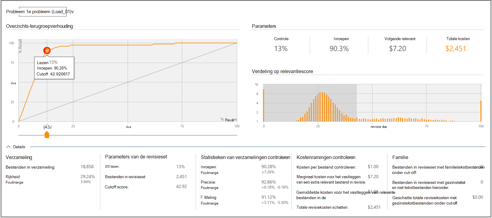

# Beslissingen op basis van relevantieresultaten in Advanced eDiscovery
  
In de module Relevantie in Advanced eDiscovery bevat het tabblad Beslissen aanvullende informatie voor het weergeven en gebruiken van statistieken voor beslissingsondersteuning voor het bepalen van de grootte van de revisieset met hoofddossiers.
  
## Het tabblad Beslissen gebruiken

  
Dit tabblad bevat de volgende onderdelen:
  
- **Probleem:** Hier kunt u het probleem van belang selecteren in de lijst.

- **Review-recall ratio:** Vergelijkingen van Advanced eDiscovery beoordeling op basis van relevantiescores. Het cutoff-punt in de grafiek vertegenwoordigt het percentage bestanden dat moet worden beoordeeld, dat is toegesneden op een relevantiescore. Dit wordt gebruikt in de fase Relevantietest en als exportdrempel voor ruiming. Het standaardbezuiningspunt voor het aantal bestanden dat moet worden beoordeeld, ligt op het punt waarop de balans tussen Inroepen en Precisie optimaal is. Het werkelijke snijpunt moet door de gebruiker worden bepaald, afhankelijk van de doelstellingen en de kostenruil (%beoordeling) en het risico (%recall). Met de schuifregelaar kunt u het snijpunt aanpassen en het effect op de grafiek en parameters zien, bij het aanpassen van het percentage relevante bestanden dat moet worden opgehaald en voordat u een beslissing valideert.

- **Parameters**: Controleren, Inroepen, Volgende relevante en totale kostenparameters zijn cumulatieve berekende statistieken met betrekking tot de revisieset ten opzichte van de verzameling voor het hele geval. Definities voor deze parameters zijn als volgt:

  - **Controleren:** Percentage bestanden dat u wilt controleren op basis van deze cutoff.

  - **Inroepen:** Percentage relevante bestanden in de revisieset.

  - **Volgende relevant:** Kosten voor het controleren en identificeren van een ander relevant bestand dat momenteel niet in de revisieset staat.

  - **Totale kosten:** Kosten voor het controleren van dit percentage van de casebestanden. Instellingen voor kostenparameters kunnen worden ingesteld door Case manager.

  - **Verdeling op relevantiescore:** Bestanden in de donkergrijse weergave aan de linkerkant staan onder de cutoffscore. Met een knoptip worden de relevantiescore en het gerelateerde percentage bestanden weergegeven in het revisiebestand dat is ingesteld ten opzichte van het totale aantal bestanden.

In het deelvenster **Uitgebreide details** worden meer details weergegeven. Bestanden in verzamelingscijfers bevatten geen lege of nevelige bestanden. Gezinsbestanden zijn bestanden die niet zijn geladen in Relevantie, maar nog steeds worden meegetelde als onderdeel van het gezin.
