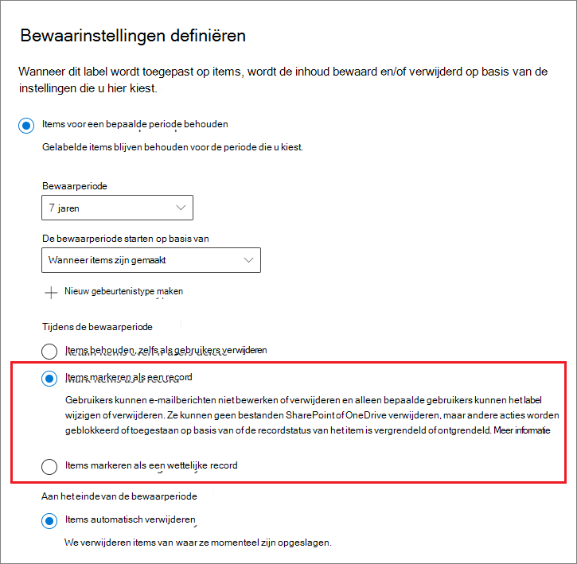
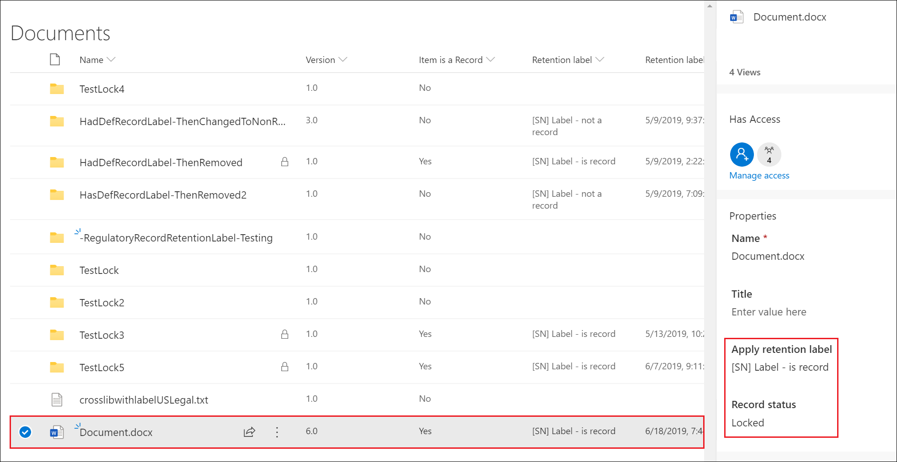

# <a name="declare-records-by-using-retention-labels"></a><span data-ttu-id="2ac6d-103">Records declareren met behulp van retentielabels</span><span class="sxs-lookup"><span data-stu-id="2ac6d-103">Declare records by using retention labels</span></span>

><span data-ttu-id="2ac6d-104">*[Richtlijnen voor Microsoft 365-licenties voor beveiliging en compliance](/office365/servicedescriptions/microsoft-365-service-descriptions/microsoft-365-tenantlevel-services-licensing-guidance/microsoft-365-security-compliance-licensing-guidance).*</span><span class="sxs-lookup"><span data-stu-id="2ac6d-104">*[Microsoft 365 licensing guidance for security & compliance](/office365/servicedescriptions/microsoft-365-service-descriptions/microsoft-365-tenantlevel-services-licensing-guidance/microsoft-365-security-compliance-licensing-guidance).*</span></span>

<span data-ttu-id="2ac6d-105">Als u documenten en e-mailberichten wilt declareren als [records](records-management.md#records), gebruikt u [retentielabels](retention.md#retention-labels) die de inhoud markeren als een **record** of een **regelgevingsrecord**.</span><span class="sxs-lookup"><span data-stu-id="2ac6d-105">To declare documents and emails as [records](records-management.md#records), you use [retention labels](retention.md#retention-labels) that mark the content as a **record** or a **regulatory record**.</span></span>

<span data-ttu-id="2ac6d-106">Zie [Beperkingen vergelijken voor welke acties zijn toegestaan of geblokkeerd](records-management.md#compare-restrictions-for-what-actions-are-allowed-or-blocked) als u niet zeker weet of u een record of een regelgevingsrecord moet gebruiken.</span><span class="sxs-lookup"><span data-stu-id="2ac6d-106">If you're not sure whether to use a record or a regulatory record, see [Compare restrictions for what actions are allowed or blocked](records-management.md#compare-restrictions-for-what-actions-are-allowed-or-blocked).</span></span> <span data-ttu-id="2ac6d-107">Als u regelgevingsrecords wilt gebruiken, moet u eerst een PowerShell-opdracht uitvoeren, zoals beschreven in de volgende sectie.</span><span class="sxs-lookup"><span data-stu-id="2ac6d-107">If you need to use regulatory records, you must first run a PowerShell command, as described in the next section.</span></span>

<span data-ttu-id="2ac6d-108">Vervolgens kunt u deze labels publiceren in een beleid voor retentielabels, zodat gebruikers en beheerders deze kunnen toepassen op inhoud, of voor labels die items markeren als records (maar niet al regelgevingsrecords), deze labels automatisch toepassen op inhoud die u als record wilt declareren.</span><span class="sxs-lookup"><span data-stu-id="2ac6d-108">You can then either publish those labels in a retention label policy so that users and administrators can apply them to content, or for labels that mark items as records (but not regulatory records), auto-apply those labels to content that you want to declare a record.</span></span>

## <a name="how-to-display-the-option-to-mark-content-as-a-regulatory-record"></a><span data-ttu-id="2ac6d-109">De optie voor het markeren van inhoud als regelgevingsrecord weergeven</span><span class="sxs-lookup"><span data-stu-id="2ac6d-109">How to display the option to mark content as a regulatory record</span></span>

>[!NOTE] 
> <span data-ttu-id="2ac6d-110">De volgende procedure is een controleerbare actie, waarbij **De optie regelgevend record voor bewaarlabels is ingeschakeld** wordt geregistreerd in de sectie [Activiteiten met bewaarbeleid en bewaarlabels](search-the-audit-log-in-security-and-compliance.md#retention-policy-and-retention-label-activities) van het auditlogboek.</span><span class="sxs-lookup"><span data-stu-id="2ac6d-110">The following procedure is an auditable action, logging **Enabled regulatory record option for retention labels** in the [Retention policy and retention label activities](search-the-audit-log-in-security-and-compliance.md#retention-policy-and-retention-label-activities) section of the audit log.</span></span>

<span data-ttu-id="2ac6d-111">Standaard wordt de optie voor bewaarlabels om inhoud te markeren als een regelgevingsrecord niet weergegeven in de wizard voor retentielabels.</span><span class="sxs-lookup"><span data-stu-id="2ac6d-111">By default, the retention label option to mark content as a regulatory record isn't displayed in the retention label wizard.</span></span> <span data-ttu-id="2ac6d-112">Als u deze optie wilt weergeven, moet u eerst een PowerShell-opdracht uitvoeren:</span><span class="sxs-lookup"><span data-stu-id="2ac6d-112">To display this option, you must first run a PowerShell command:</span></span>

1. <span data-ttu-id="2ac6d-113">[Maak verbinding met het Office 365-beveiligings- en compliancecentrum PowerShell](/powershell/exchange/office-365-scc/connect-to-scc-powershell/connect-to-scc-powershell).</span><span class="sxs-lookup"><span data-stu-id="2ac6d-113">[Connect to the Office 365 Security & Compliance Center PowerShell](/powershell/exchange/office-365-scc/connect-to-scc-powershell/connect-to-scc-powershell).</span></span>

2. <span data-ttu-id="2ac6d-114">Voer de volgende cmdlet uit:</span><span class="sxs-lookup"><span data-stu-id="2ac6d-114">Run the following cmdlet:</span></span>
    
    ```powershell
    Set-RegulatoryComplianceUI -Enabled $true
    ````
    <span data-ttu-id="2ac6d-115">Er wordt niet gevraagd om te bevestigen en de instelling wordt onmiddellijk van kracht.</span><span class="sxs-lookup"><span data-stu-id="2ac6d-115">There is no prompt to confirm and the setting takes effect immediately.</span></span>

<span data-ttu-id="2ac6d-116">Als u van gedachten verandert over de weergave van deze optie in de wizard voor retentielabels, dan kunt u deze weer verbergen door dezelfde cmdlet met de waarde **false** uit te voeren: `Set-RegulatoryComplianceUI -Enabled $false`</span><span class="sxs-lookup"><span data-stu-id="2ac6d-116">If you change your mind about seeing this option in the retention label wizard, you can hide it again by running the same cmdlet with the **false** value: `Set-RegulatoryComplianceUI -Enabled $false`</span></span> 

## <a name="configuring-retention-labels-to-declare-records"></a><span data-ttu-id="2ac6d-117">Retentielabels configureren om records te declareren</span><span class="sxs-lookup"><span data-stu-id="2ac6d-117">Configuring retention labels to declare records</span></span>

<span data-ttu-id="2ac6d-118">Wanneer u een retentielabel maakt vanuit de **Record Management**-oplossing in het Microsoft 365-compliancecentrum, kunt u items markeren als record.</span><span class="sxs-lookup"><span data-stu-id="2ac6d-118">When you create a retention label from the **Records Management** solution in the Microsoft 365 compliance center, you have the option to mark items as a record.</span></span> <span data-ttu-id="2ac6d-119">Als u de PowerShell-opdracht heeft uitgevoerd in de vorige sectie, dan kunt u items ook markeren als regelgevingsrecord.</span><span class="sxs-lookup"><span data-stu-id="2ac6d-119">If you ran the PowerShell command from the previous section, you can alternatively mark items as a regulatory record.</span></span>

<span data-ttu-id="2ac6d-120">Bijvoorbeeld:</span><span class="sxs-lookup"><span data-stu-id="2ac6d-120">For example:</span></span>



<span data-ttu-id="2ac6d-122">Wanneer u dit retentielabel gebruikt, kunt u dit voortaan toepassen op documenten in SharePoint of OneDrive en e-mails in Exchange indien nodig.</span><span class="sxs-lookup"><span data-stu-id="2ac6d-122">Using this retention label, you can now apply it to SharePoint or OneDrive documents and Exchange emails, as needed.</span></span> 

<span data-ttu-id="2ac6d-123">Voor volledige instructies:</span><span class="sxs-lookup"><span data-stu-id="2ac6d-123">For full instructions:</span></span>

- [<span data-ttu-id="2ac6d-124">Retentielabels maken en deze toepassen in apps</span><span class="sxs-lookup"><span data-stu-id="2ac6d-124">Create retention labels and apply them in apps</span></span>](create-apply-retention-labels.md)

- <span data-ttu-id="2ac6d-125">[Een retentielabel automatisch toepassen op inhoud](apply-retention-labels-automatically.md) (wordt niet ondersteund voor regelgevingsrecords)</span><span class="sxs-lookup"><span data-stu-id="2ac6d-125">[Apply a retention label to content automatically](apply-retention-labels-automatically.md) (not supported for regulatory records)</span></span>


## <a name="applying-the-configured-retention-label-to-content"></a><span data-ttu-id="2ac6d-126">Het geconfigureerde retentielabel toepassen op inhoud</span><span class="sxs-lookup"><span data-stu-id="2ac6d-126">Applying the configured retention label to content</span></span>

<span data-ttu-id="2ac6d-127">Wanneer retentielabels die items markeren als een record of regelgevingsrecord, beschikbaar worden gemaakt zodat gebruikers deze kunnen toepassen in apps:</span><span class="sxs-lookup"><span data-stu-id="2ac6d-127">When retention labels that mark items as a record or regulatory record are made available for users to apply them in apps:</span></span>

- <span data-ttu-id="2ac6d-128">Voor Exchange kan elke gebruiker met schrijftoegang tot het postvak deze labels toepassen.</span><span class="sxs-lookup"><span data-stu-id="2ac6d-128">For Exchange, any user with write-access to the mailbox can apply these labels.</span></span> 
- <span data-ttu-id="2ac6d-129">Voor SharePoint en OneDrive kan elke gebruiker in de standaardgroep Leden (het machtigingsniveau Bijdragen) deze labels toepassen.</span><span class="sxs-lookup"><span data-stu-id="2ac6d-129">For SharePoint and OneDrive, any user in the default Members group (the Contribute permission level) can apply these labels.</span></span>

<span data-ttu-id="2ac6d-130">Voorbeeld van een document dat als record is gemarkeerd met een retentielabel:</span><span class="sxs-lookup"><span data-stu-id="2ac6d-130">Example of a document marked as record by using a retention label:</span></span>



## <a name="searching-the-audit-log-for-labeled-items-that-were-declared-records"></a><span data-ttu-id="2ac6d-132">Zoeken in het auditlogboek naar gelabelde items die als record zijn gedeclareerd</span><span class="sxs-lookup"><span data-stu-id="2ac6d-132">Searching the audit log for labeled items that were declared records</span></span>

<span data-ttu-id="2ac6d-133">De acties voor het toevoegen van labels om items als records te declareren worden geregistreerd in het auditlogboek.</span><span class="sxs-lookup"><span data-stu-id="2ac6d-133">The actions of labeling to declare items as records are logged in the audit log.</span></span>

<span data-ttu-id="2ac6d-134">Voor SharePoint-items:</span><span class="sxs-lookup"><span data-stu-id="2ac6d-134">For SharePoint items:</span></span> 
- <span data-ttu-id="2ac6d-135">Selecteer onder **Bestands- en pagina-activiteiten** de optie **Gewijzigd retentielabel voor een bestand**.</span><span class="sxs-lookup"><span data-stu-id="2ac6d-135">From **File and page activities**, select **Changed retention label for a file**.</span></span> <span data-ttu-id="2ac6d-136">Deze controlegebeurtenis is voor standaardretentielabels of voor retentielabels die worden gebruikt om items te markeren als records of wettelijke records.</span><span class="sxs-lookup"><span data-stu-id="2ac6d-136">This audit event is for retention labels that mark items as records, regulatory records, or that are standard retention labels.</span></span>

<span data-ttu-id="2ac6d-137">Voor Exchange-items:</span><span class="sxs-lookup"><span data-stu-id="2ac6d-137">For Exchange items:</span></span>
- <span data-ttu-id="2ac6d-138">Selecteer vanuit **Activiteiten in Exchange-postvakken** de optie **Bericht gelabeld als record**.</span><span class="sxs-lookup"><span data-stu-id="2ac6d-138">From **Exchange mailbox activities**, select **Labeled message as a record**.</span></span> <span data-ttu-id="2ac6d-139">Deze controlegebeurtenis is voor retentielabels die worden gebruikt om items te markeren als records of wettelijke records.</span><span class="sxs-lookup"><span data-stu-id="2ac6d-139">This audit event is for retention labels that mark items as records or regulatory records.</span></span>

<span data-ttu-id="2ac6d-140">Zie [Het auditlogboek doorzoeken in het beveiligings- en compliancecentrum](search-the-audit-log-in-security-and-compliance.md#file-and-page-activities) voor meer informatie over het zoeken naar deze gebeurtenissen.</span><span class="sxs-lookup"><span data-stu-id="2ac6d-140">For more information about searching for these events, see [Search the audit log in the Security & Compliance Center](search-the-audit-log-in-security-and-compliance.md#file-and-page-activities).</span></span>

## <a name="next-steps"></a><span data-ttu-id="2ac6d-141">Volgende stappen</span><span class="sxs-lookup"><span data-stu-id="2ac6d-141">Next steps</span></span>

<span data-ttu-id="2ac6d-142">Zie [Veelvoorkomende scenario's voor recordbeheer](get-started-with-records-management.md#common-scenarios-for-records-management) voor een lijst met scenario's die worden ondersteund door recordbeheer.</span><span class="sxs-lookup"><span data-stu-id="2ac6d-142">For a list of scenarios supported by records management, see [Common scenarios for records management](get-started-with-records-management.md#common-scenarios-for-records-management).</span></span>
