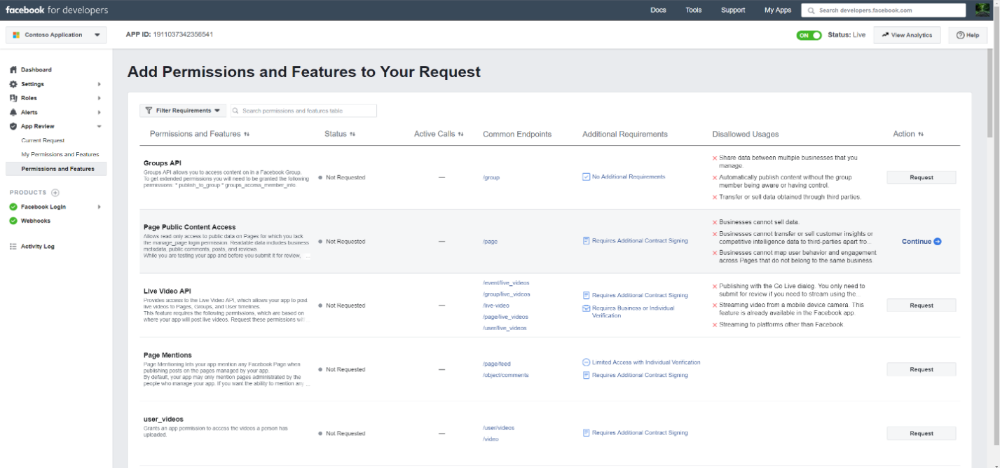

# Een connector implementeren om gegevens van Facebook Business-pagina's te archiveren

Dit artikel bevat het stapsgewijs proces voor het implementeren van een verbindingslijn die gebruikmaakt van de Office 365 Service importeren om gegevens te importeren van Facebook Business-pagina's naar Microsoft 365. Zie Een verbindingslijn instellen voor het archiveren van [Facebook-gegevens](archive-facebook-data-with-sample-connector.md)voor een overzicht op hoog niveau van dit proces en een lijst met vereisten die nodig zijn voor het implementeren van een Facebook-connector.

## Stap 1: Een app maken in Azure Active Directory

1. Ga naar <https://portal.azure.com> en meld u aan met de referenties van een globale beheerdersaccount.

    

2. Klik in het linkernavigatiedeelvenster op **Azure Active Directory**.

    

3. Klik in het linkernavigatiedeelvenster op **App-registraties (Voorbeeld)** en klik vervolgens op **Nieuwe registratie.**

    

4. Registreer de toepassing. Selecteer onder Redirect URI de optie Web in de vervolgkeuzelijst toepassingstype en typ <https://portal.azure.com> vervolgens het vak voor de URI.

   

5. Kopieer de **toepassings-id en** **adreslijst-id (tenant)** en sla deze op in een tekstbestand of een andere veilige locatie. U gebruikt deze ID's in latere stappen.

   

6. Ga naar **Certificaten & voor de nieuwe app.**

   

7. Klik **op Nieuw clientgeheim**

   

8. Maak een nieuw geheim. Typ het geheim in het vak Beschrijving en kies vervolgens een verloopperiode.

    

9. Kopieer de waarde van het geheim en sla deze op in een tekstbestand of een andere opslaglocatie. Dit is het AAD-toepassingsgeheim dat u in latere stappen gebruikt.

   

## Stap 2: De connectorwebservice implementeren van GitHub naar uw Azure-account

1. Ga naar [deze GitHub en](https://github.com/microsoft/m365-sample-connector-csharp-aspnet) klik op Implementeren naar **Azure**.

    

2. Nadat u op **Implementeren naar Azure hebt** geklikt, wordt u omgeleid naar een Azure-portal met een aangepaste sjabloonpagina. Vul de **basisbeginselen** **en Instellingen** en klik vervolgens op **Kopen.**

   - **Abonnement:** Selecteer uw Azure-abonnement waar u de connectorwebservice voor Facebook Business-pagina's wilt implementeren.

   - **Resourcegroep:** Kies of maak een nieuwe resourcegroep. Een resourcegroep is een container met gerelateerde resources voor een Azure-oplossing.

   - **Locatie:** Kies een locatie.

   - **Web App-naam:** Geef een unieke naam op voor de connectorweb-app. De naam moet tussen 3 en 18 tekens lang zijn. Deze naam wordt gebruikt om de URL van de Azure-appservice te maken. als u bijvoorbeeld de naam van de web-app van **fbconnector** op geeft, wordt de URL van de Azure-appservice **fbconnector.azurewebsites.net.**

   - **tenantId:** De tenant-id van uw Microsoft 365 organisatie die u hebt gekopieerd na het maken van de Facebook-connector-app in Azure Active Directory stap 1.

   - **APISecretKey:** U kunt elke waarde als het geheim typen. Dit wordt gebruikt om toegang te krijgen tot de connectorweb-app in stap 5.

     

3. Nadat de implementatie is gelukt, ziet de pagina er ongeveer hetzelfde uit als de volgende schermafbeelding:

   

## Stap 3: De Facebook-app registreren

1. Ga naar , meld u aan met de referenties voor het account voor de Facebook Business-pagina's van uw organisatie <https://developers.facebook.com> en klik vervolgens op Nieuwe app **toevoegen.**

   

2. Een nieuwe app-id maken.

   

3. Klik in het linkernavigatiedeelvenster op **Producten toevoegen** en klik **vervolgens op Instellen** in de **tegel Facebook-aanmelding.**

   

4. Klik op de pagina Facebook-aanmelding integreren op **Web**.

   

5. Voeg de URL van de Azure-appservice toe; bijvoorbeeld `https://fbconnector.azurewebsites.net` .

   

6. Voltooi de sectie Snelstart van de facebook-aanmeldingsinstallatie.

   

7. Klik in het linkernavigatiedeelvenster onder **Facebook Login** op Instellingen **en** voeg de OAuth redirect URI toe in het vak Valid **OAuth Redirect URIs.** Gebruik de indeling **\<connectorserviceuri> /Weergaven/FacebookOAuth,** waarbij de waarde voor connectorserviceuri de URL van de Azure-app-service voor uw organisatie is, `https://fbconnector.azurewebsites.net` bijvoorbeeld.

   

8. Klik in het linkernavigatiedeelvenster op **Producten toevoegen** en klik vervolgens op **Webhooks.** Klik in **het** snelmenu Pagina op **Pagina.**

   

9. Voeg Webhooks Callback-URL toe en voeg een verificatie-token toe. Gebruik de indeling van de terugroep-URL met de notatie **<connectorserviceuri> /api/FbPageWebhook,** waarbij de waarde voor connectorserviceuri de URL van de Azure-app-service voor uw organisatie is, bijvoorbeeld `https://fbconnector.azurewebsites.net` .

   Het verificatie-token lijkt op een sterk wachtwoord. Kopieer het verificatie-token naar een tekstbestand of een andere opslaglocatie.

   

10. Test en abonneer u op het eindpunt voor feed.

    

11. Voeg een privacy-URL, app-pictogram en zakelijk gebruik toe. Kopieer ook de app-id en het app-geheim naar een tekstbestand of een andere opslaglocatie.

    

12. Maak de app openbaar.

    

13. Gebruiker toevoegen aan de rol beheerder of tester.

    

14. Voeg de **machtiging Openbare inhoudstoegang voor pagina** toe.

    

15. Machtiging Pagina's beheren toevoegen.

    

16. Laat de toepassing beoordeeld worden door Facebook.

    

## Stap 4: De connectorweb-app configureren

1. Ga naar (waarbij AzureAppResourceName de naam is van uw `https://<AzureAppResourceName>.azurewebsites.net` Azure-app-resource die u hebt benoemd in stap 4). Als de naam bijvoorbeeld **fbconnector** is, gaat u naar `https://fbconnector.azurewebsites.net` . De startpagina van de app ziet eruit als de volgende schermafbeelding:

   

2. Klik **op Configureren** om een aanmeldingspagina weer te geven.

   

3. Typ of plak uw tenant-id in het vak Tenant-id (die u hebt verkregen in stap 2). Typ of plak in het wachtwoordvak de APISecretKey (die u hebt verkregen in stap 2) en klik vervolgens op **Configuratie-Instellingen** instellen om de pagina met configuratiegegevens weer te geven.

    

4. Voer de volgende configuratie-instellingen in

   - **Facebook-toepassing-id:** De app-id voor de Facebook-toepassing die u hebt verkregen in stap 3.

   - **Facebook-toepassingsgeheim:** Het app-geheim voor de Facebook-toepassing die u hebt verkregen in stap 3.

   - **Facebook-webhaken verifiëren token:** Het token verifiëren dat u hebt gemaakt in stap 3.

   - **AAD-toepassings-id:** De toepassings-id voor de Azure Active Directory app die u hebt gemaakt in stap 1.

   - **AAD-toepassingsgeheim:** De waarde voor het APISecretKey-geheim dat u hebt gemaakt in stap 1.

5. Klik **op Opslaan** om de connectorinstellingen op te slaan.

## Stap 5: Een Facebook-connector instellen in het Microsoft 365 compliancecentrum

1. Ga naar [https://compliance.microsoft.com](https://compliance.microsoft.com) en klik vervolgens op **Gegevensconnectoren** in het linkernavigatievenster.

2. Klik op **de pagina Gegevensconnectors** onder **Facebook Business-pagina's** op **Weergeven.**

3. Klik op de pagina Zakelijke Facebook-pagina's op **Verbindingslijn toevoegen.** 

4. Klik op **de pagina Servicevoorwaarden** op **Accepteren.**

5. Voer op **de pagina Referenties toevoegen voor de connector-app** de volgende gegevens in en klik vervolgens op Verbinding **valideren.**

   

   - Typ in **het** vak Naam een naam voor de verbindingslijn, zoals **facebook-nieuwspagina.**

   - Typ of plak de URL van de Azure-appservice in het vak **Verbindings-URL.** bijvoorbeeld `https://fbconnector.azurewebsites.net` .

   - Typ of plak **in het** vak Wachtwoord de waarde van de APISecretKey die u hebt toegevoegd in stap 2.

   - Typ of plak in het vak **Azure App-id** de waarde van de toepassings-id (client-id) die u in stap 1 hebt gemaakt, ook wel AAD-toepassings-id genoemd.

6. Nadat de verbinding is gevalideerd, klikt u op **Volgende.**

7. Typ of plak de APISecretKey **op Microsoft 365** pagina Gegevens importeren en klik vervolgens op **Aanmeldingsweb-app.**

8. Klik op **de pagina Facebook Connector-app** configureren op Aanmelden met **Facebook** en meld u aan met de referenties voor het account voor de Facebook Business-pagina's van uw organisatie. Zorg ervoor dat aan het Facebook-account bij wie u zich hebt aangemeld, de beheerdersrol is toegewezen voor de Facebook Business-pagina's van uw organisatie.

   

9. Er wordt een lijst weergegeven met de zakelijke pagina's die worden beheerd door het Facebook-account waarin u zich hebt aangemeld. Selecteer de pagina die u wilt archiveren en klik vervolgens op **Volgende.**

   

10. Klik **op Doorgaan** om de installatie van de connectorservice-app af te sluiten.

11. Op de **pagina Filters instellen** kunt u een filter toepassen om items van een bepaalde leeftijd in eerste instantie te importeren. Selecteer een leeftijd en klik vervolgens op **Volgende.**

12. Typ op **de pagina** Opslaglocatie kiezen het e-mailadres van Microsoft 365 postvak waarin de Facebook-items worden geïmporteerd en klik vervolgens op **Volgende.**

13. Klik **op Volgende** om de connectorinstellingen te bekijken en klik vervolgens op **Voltooien** om de connectorconfiguratie te voltooien.

14. Ga in het compliancecentrum naar de pagina **Gegevensconnectors** en klik op het tabblad **Verbindingslijnen** om de voortgang van het importproces te zien.
