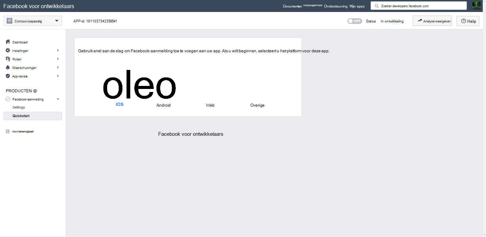
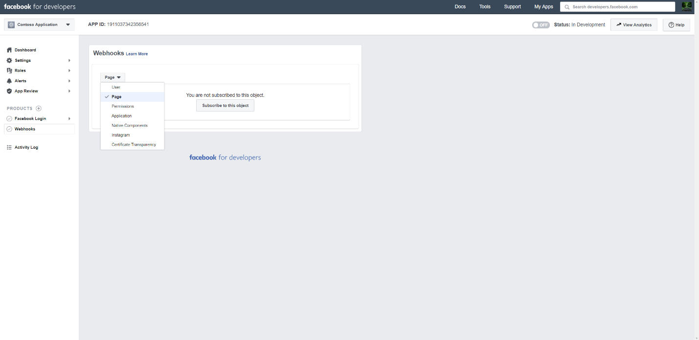
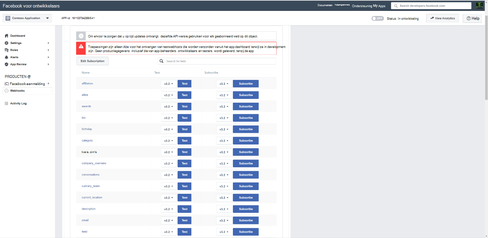
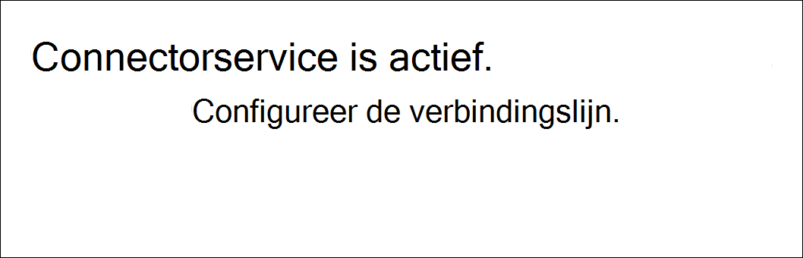
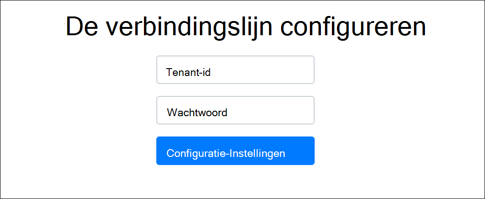
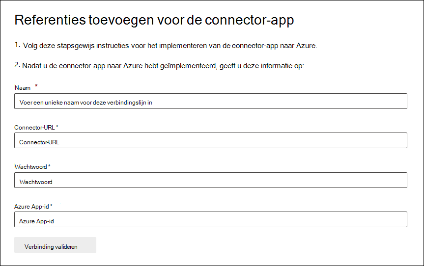

# Een connector implementeren om gegevens van Facebook Business-pagina's te archiverenDeploy a connector to archive Facebook Business pages data

Dit artikel bevat het stapsgewijs proces voor het implementeren van een verbindingslijn die gebruikmaakt van de Office 365 Service importeren om gegevens te importeren van Facebook Business-pagina's naar Microsoft 365.This article contains the step-by-step process to deploy a connector that uses the Office 365 Import service to import data from Facebook Business pages to Microsoft 365. Zie Een verbindingslijn instellen voor het archiveren van [Facebook-gegevens](archive-facebook-data-with-sample-connector.md)voor een overzicht op hoog niveau van dit proces en een lijst met vereisten die nodig zijn voor het implementeren van een Facebook-connector.For a high-level overview of this process and a list of prerequisites required to deploy a Facebook connector, see [Set up a connector to archive Facebook data](archive-facebook-data-with-sample-connector.md).

## Stap 1: Een app maken in Azure Active DirectoryStep 1: Create an app in Azure Active Directory

1. Ga naar <https://portal.azure.com> en meld u aan met de referenties van een globale beheerdersaccount.Go to <https://portal.azure.com> and sign in using the credentials of a global admin account.

    

2. Klik in het linkernavigatiedeelvenster op **Azure Active Directory**.In the left navigation pane, click **Azure Active Directory**.

    

3. Klik in het linkernavigatiedeelvenster op **App-registraties (Voorbeeld)** en klik vervolgens op **Nieuwe registratie.**In the left navigation pane, click **App registrations (Preview)** and then click **New registration**.

    

4. Registreer de toepassing.Register the application. Selecteer onder Redirect URI de optie Web in de vervolgkeuzelijst toepassingstype en typ <https://portal.azure.com> vervolgens het vak voor de URI.Under Redirect URI, select Web in the application type dropdown list and then type <https://portal.azure.com> in the box for the URI.

   

5. Kopieer de **toepassings-id en** **adreslijst-id (tenant)** en sla deze op in een tekstbestand of een andere veilige locatie.Copy the **Application (client) ID** and **Directory (tenant) ID** and save them to a text file or other safe location. U gebruikt deze ID's in latere stappen.You use these IDs in later steps.

   

6. Ga naar **Certificaten & voor de nieuwe app.**Go to **Certificates & secrets for the new app.**

   

7. Klik **op Nieuw clientgeheim**Click **New client secret**

   

8. Maak een nieuw geheim.Create a new secret. Typ het geheim in het vak Beschrijving en kies vervolgens een verloopperiode.In the description box, type the secret and then choose an expiration period.

    

9. Kopieer de waarde van het geheim en sla deze op in een tekstbestand of een andere opslaglocatie.Copy the value of the secret and save it to a text file or other storage location. Dit is het AAD-toepassingsgeheim dat u in latere stappen gebruikt.This is the AAD application secret that you use in later steps.

   

## Stap 2: De connectorwebservice implementeren van GitHub naar uw Azure-accountStep 2: Deploy the connector web service from GitHub to your Azure account

1. Ga naar [deze GitHub en](https://github.com/microsoft/m365-sample-connector-csharp-aspnet) klik op Implementeren naar **Azure**.Go to [this GitHub site](https://github.com/microsoft/m365-sample-connector-csharp-aspnet) and click **Deploy to Azure**.

    

2. Nadat u op **Implementeren naar Azure hebt** geklikt, wordt u omgeleid naar een Azure-portal met een aangepaste sjabloonpagina.After you click **Deploy to Azure**, you will be redirected to an Azure portal with a custom template page. Vul de **basisbeginselen** **en Instellingen** en klik vervolgens op **Kopen.**Fill in the **Basics** and **Settings** details and then click **Purchase**.

   - **Abonnement:** Selecteer uw Azure-abonnement waar u de connectorwebservice voor Facebook Business-pagina's wilt implementeren.**Subscription:** Select your Azure subscription that you want to deploy the Facebook Business pages connector web service to.

   - **Resourcegroep:** Kies of maak een nieuwe resourcegroep.**Resource group:** Choose or create a new resource group. Een resourcegroep is een container met gerelateerde resources voor een Azure-oplossing.A resource group is a container that holds related resources for an Azure solution.

   - **Locatie:** Kies een locatie.**Location:** Choose a location.

   - **Web App-naam:** Geef een unieke naam op voor de connectorweb-app.**Web App Name:** Provide a unique name for the connector web app. De naam moet tussen 3 en 18 tekens lang zijn.Th name must be between 3 and 18 characters in length. Deze naam wordt gebruikt om de URL van de Azure-appservice te maken. als u bijvoorbeeld de naam van de web-app van **fbconnector** op geeft, wordt de URL van de Azure-appservice **fbconnector.azurewebsites.net.**This name is used to create the Azure app service URL; for example, if you provide the Web app name of **fbconnector** then the Azure app service URL  will be **fbconnector.azurewebsites.net**.

   - **tenantId:** De tenant-id van uw Microsoft 365 organisatie die u hebt gekopieerd na het maken van de Facebook-connector-app in Azure Active Directory stap 1.**tenantId:** The tenant ID of your Microsoft 365 organization that you copied after creating the Facebook connector app in Azure Active Directory in Step 1.

   - **APISecretKey:** U kunt elke waarde als het geheim typen.**APISecretKey:** You can type any value as the secret. Dit wordt gebruikt om toegang te krijgen tot de connectorweb-app in stap 5.This is used to access the connector web app in Step 5.

     

3. Nadat de implementatie is gelukt, ziet de pagina er ongeveer hetzelfde uit als de volgende schermafbeelding:After the deployment is successful, the page will look similar to the following screenshot:

   

## Stap 3: De Facebook-app registrerenStep 3: Register the Facebook app

1. Ga naar , meld u aan met de referenties voor het account voor de Facebook Business-pagina's van uw organisatie <https://developers.facebook.com> en klik vervolgens op Nieuwe app **toevoegen.**Go to <https://developers.facebook.com>, log in using the credentials for the account for your organization's Facebook Business pages, and then click **Add New App**.

   

2. Een nieuwe app-id maken.Create a new app ID.

   

3. Klik in het linkernavigatiedeelvenster op **Producten toevoegen** en klik **vervolgens op Instellen** in de **tegel Facebook-aanmelding.**In the left navigation pane, click **Add Products** and then click **Set Up** in the **Facebook Login** tile.

   

4. Klik op de pagina Facebook-aanmelding integreren op **Web**.On the Integrate Facebook Login page, click **Web**.

   

5. Voeg de URL van de Azure-appservice toe; bijvoorbeeld `https://fbconnector.azurewebsites.net` .Add the Azure app service URL; for example `https://fbconnector.azurewebsites.net`.

   

6. Voltooi de sectie Snelstart van de facebook-aanmeldingsinstallatie.Complete the QuickStart section of the Facebook Login setup.

   

7. Klik in het linkernavigatiedeelvenster onder **Facebook Login** op Instellingen **en** voeg de OAuth redirect URI toe in het vak Valid **OAuth Redirect URIs.**In the left navigation pane under **Facebook Login**, click **Settings**, and add the OAuth redirect URI in the **Valid OAuth Redirect URIs** box. Gebruik de indeling **\<connectorserviceuri> /Weergaven/FacebookOAuth,** waarbij de waarde voor connectorserviceuri de URL van de Azure-app-service voor uw organisatie is, `https://fbconnector.azurewebsites.net` bijvoorbeeld.Use the format **\<connectorserviceuri>/Views/FacebookOAuth**, where the value for connectorserviceuri is the Azure app service URL for your organization; for example, `https://fbconnector.azurewebsites.net`.

   

8. Klik in het linkernavigatiedeelvenster op **Producten toevoegen** en klik vervolgens op **Webhooks.**In the left navigation pane, click **Add Products** and then click **Webhooks.** Klik in **het** snelmenu Pagina op **Pagina.**In the **Page** pull-down menu, click **Page**.

   

9. Voeg Webhooks Callback-URL toe en voeg een verificatie-token toe.Add Webhooks Callback URL and add a verify token. Gebruik de indeling van de terugroep-URL met de notatie **<connectorserviceuri> /api/FbPageWebhook,** waarbij de waarde voor connectorserviceuri de URL van de Azure-app-service voor uw organisatie is, bijvoorbeeld `https://fbconnector.azurewebsites.net` .The format of the callback URL, use the format **<connectorserviceuri>/api/FbPageWebhook**, where the value for connectorserviceuri is the Azure app service URL for your organization; for example `https://fbconnector.azurewebsites.net`.

   Het verificatie-token lijkt op een sterk wachtwoord.The verify token should similar to a strong password. Kopieer het verificatie-token naar een tekstbestand of een andere opslaglocatie.Copy the verify token to a text file or other storage location.

   

10. Test en abonneer u op het eindpunt voor feed.Test and subscribe to the endpoint for feed.

    

11. Voeg een privacy-URL, app-pictogram en zakelijk gebruik toe.Add a privacy URL, app icon, and business use. Kopieer ook de app-id en het app-geheim naar een tekstbestand of een andere opslaglocatie.Also, copy the app ID and app secret to a text file or other storage location.

    

12. Maak de app openbaar.Make the app public.

    

13. Gebruiker toevoegen aan de rol beheerder of tester.Add user to the admin or tester role.

    

14. Voeg de **machtiging Openbare inhoudstoegang voor pagina** toe.Add the **Page Public Content Access** permission.

    

15. Machtiging Pagina's beheren toevoegen.Add Manage Pages permission.

    

16. Laat de toepassing beoordeeld worden door Facebook.Get the application reviewed by Facebook.

    

## Stap 4: De connectorweb-app configurerenStep 4: Configure the connector web app

1. Ga naar (waarbij AzureAppResourceName de naam is van uw `https://<AzureAppResourceName>.azurewebsites.net` Azure-app-resource die u hebt benoemd in stap 4).Go to `https://<AzureAppResourceName>.azurewebsites.net` (where AzureAppResourceName is the name of your Azure app resource that you named in Step 4). Als de naam bijvoorbeeld **fbconnector** is, gaat u naar `https://fbconnector.azurewebsites.net` .For example, if the name is **fbconnector**, go to `https://fbconnector.azurewebsites.net`. De startpagina van de app ziet eruit als de volgende schermafbeelding:The home page of the app will look like the following screenshot:

   

2. Klik **op Configureren** om een aanmeldingspagina weer te geven.Click **Configure** to display a sign in page.

   

3. Typ of plak uw tenant-id in het vak Tenant-id (die u hebt verkregen in stap 2).In the Tenant Id box, type or paste your tenant Id (that you obtained in Step 2). Typ of plak in het wachtwoordvak de APISecretKey (die u hebt verkregen in stap 2) en klik vervolgens op **Configuratie-Instellingen** instellen om de pagina met configuratiegegevens weer te geven.In the password box, type or paste the APISecretKey (that you obtained in Step 2), and then click **Set Configuration Settings** to display the configuration details page.

    

4. Voer de volgende configuratie-instellingen inEnter the following configuration settings

   - **Facebook-toepassing-id:** De app-id voor de Facebook-toepassing die u hebt verkregen in stap 3.**Facebook application ID:** The app ID for the Facebook application that you obtained in Step 3.

   - **Facebook-toepassingsgeheim:** Het app-geheim voor de Facebook-toepassing die u hebt verkregen in stap 3.**Facebook application secret:** The app secret for the Facebook application that you obtained in Step 3.

   - **Facebook-webhaken verifiëren token:** Het token verifiëren dat u hebt gemaakt in stap 3.**Facebook webhooks verify token:** The verify token that you created in Step 3.

   - **AAD-toepassings-id:** De toepassings-id voor de Azure Active Directory app die u hebt gemaakt in stap 1.**AAD application ID:** The application ID for the Azure Active Directory app that you created in Step 1.

   - **AAD-toepassingsgeheim:** De waarde voor het APISecretKey-geheim dat u hebt gemaakt in stap 1.**AAD application secret:** The value for the APISecretKey secret that you created in Step 1.

5. Klik **op Opslaan** om de connectorinstellingen op te slaan.Click **Save** to save the connector settings.

## Stap 5: Een Facebook-connector instellen in het Microsoft 365 compliancecentrumStep 5: Set up a Facebook connector in the Microsoft 365 compliance center

1. Ga naar [https://compliance.microsoft.com](https://compliance.microsoft.com) en klik vervolgens op **Gegevensconnectoren** in het linkernavigatievenster.Go to [https://compliance.microsoft.com](https://compliance.microsoft.com) and then click **Data connectors** in the left nav.

2. Klik op **de pagina Gegevensconnectors** onder **Facebook Business-pagina's** op **Weergeven.**On the **Data connectors** page under **Facebook Business pages**, click **View**.

3. Klik op de pagina Zakelijke Facebook-pagina's op **Verbindingslijn toevoegen.** On the **Facebook business pages** page, click **Add connector**.

4. Klik op **de pagina Servicevoorwaarden** op **Accepteren.**On the **Terms of service** page, click **Accept**.

5. Voer op **de pagina Referenties toevoegen voor de connector-app** de volgende gegevens in en klik vervolgens op Verbinding **valideren.**On the **Add credentials for your connector app** page, enter the following information and then click **Validate connection**.

   

   - Typ in **het** vak Naam een naam voor de verbindingslijn, zoals **facebook-nieuwspagina.**In the **Name** box, type a name for the connector, such as **Facebook news page**.

   - Typ of plak de URL van de Azure-appservice in het vak **Verbindings-URL.** bijvoorbeeld `https://fbconnector.azurewebsites.net` .In the **Connection URL** box, type or paste the Azure app service URL; for example `https://fbconnector.azurewebsites.net`.

   - Typ of plak **in het** vak Wachtwoord de waarde van de APISecretKey die u hebt toegevoegd in stap 2.In the **Password** box, type or paste the value of the APISecretKey that you added in Step 2.

   - Typ of plak in het vak **Azure App-id** de waarde van de toepassings-id (client-id) die u in stap 1 hebt gemaakt, ook wel AAD-toepassings-id genoemd.In the **Azure App ID** box, type or paste the value of the Application (client) ID also called as AAD Application ID that you created in Step 1.

6. Nadat de verbinding is gevalideerd, klikt u op **Volgende.**After the connection is successfully validated, click **Next**.

7. Typ of plak de APISecretKey **op Microsoft 365** pagina Gegevens importeren en klik vervolgens op **Aanmeldingsweb-app.**On the **Authorize Microsoft 365 to import data** page, type or paste the APISecretKey again and then click **Login web app**.

8. Klik op **de pagina Facebook Connector-app** configureren op Aanmelden met **Facebook** en meld u aan met de referenties voor het account voor de Facebook Business-pagina's van uw organisatie.On the **Configure Facebook connector app** page, click **Login with Facebook** and log in using the credentials for the account for your organization's Facebook Business pages. Zorg ervoor dat aan het Facebook-account bij wie u zich hebt aangemeld, de beheerdersrol is toegewezen voor de Facebook Business-pagina's van uw organisatie.Make sure the Facebook account that you logged in to is assigned the admin role for your organization's Facebook Business pages.

   

9. Er wordt een lijst weergegeven met de zakelijke pagina's die worden beheerd door het Facebook-account waarin u zich hebt aangemeld.A list of the business pages managed by the Facebook account that you logged in to is displayed. Selecteer de pagina die u wilt archiveren en klik vervolgens op **Volgende.**Select the page to archive and then click **Next**.

   

10. Klik **op Doorgaan** om de installatie van de connectorservice-app af te sluiten.Click **Continue** to exit the setup of the connector service app.

11. Op de **pagina Filters instellen** kunt u een filter toepassen om items van een bepaalde leeftijd in eerste instantie te importeren.On the **Set filters** page, you can apply a filter to initially import items that are a certain age. Selecteer een leeftijd en klik vervolgens op **Volgende.**Select an age, and then click **Next**.

12. Typ op **de pagina** Opslaglocatie kiezen het e-mailadres van Microsoft 365 postvak waarin de Facebook-items worden geïmporteerd en klik vervolgens op **Volgende.**On the **Choose storage location** page, type the email address of Microsoft 365 mailbox that the Facebook items will be imported to, and then click **Next**.

13. Klik **op Volgende** om de connectorinstellingen te bekijken en klik vervolgens op **Voltooien** om de connectorconfiguratie te voltooien.Click **Next** to review the connector settings and then click **Finish** to complete the connector setup.

14. Ga in het compliancecentrum naar de pagina **Gegevensconnectors** en klik op het tabblad **Verbindingslijnen** om de voortgang van het importproces te zien.In the compliance center, go to the **Data connectors** page, and click the **Connectors** tab to see the progress of the import process.
