# Een connector implementeren om Twitter-gegevens te archiveren

Dit artikel bevat het stapsgewijs proces voor het implementeren van een verbindingslijn die de Office 365 Import-service gebruikt om gegevens uit het Twitter-account van uw organisatie te importeren in Microsoft 365. Zie Een verbindingslijn instellen om Twitter-gegevens te archiveren voor een overzicht op hoog niveau van dit proces en een lijst met vereisten voor het implementeren van [een Twitter-connector. ](archive-twitter-data-with-sample-connector.md) 

## Stap 1: Een app maken in Azure Active Directory

1. Ga naar <https://portal.azure.com> en meld u aan met de referenties van een globale beheerdersaccount.

   

2. Klik in het linkernavigatiedeelvenster op **Azure Active Directory**.

   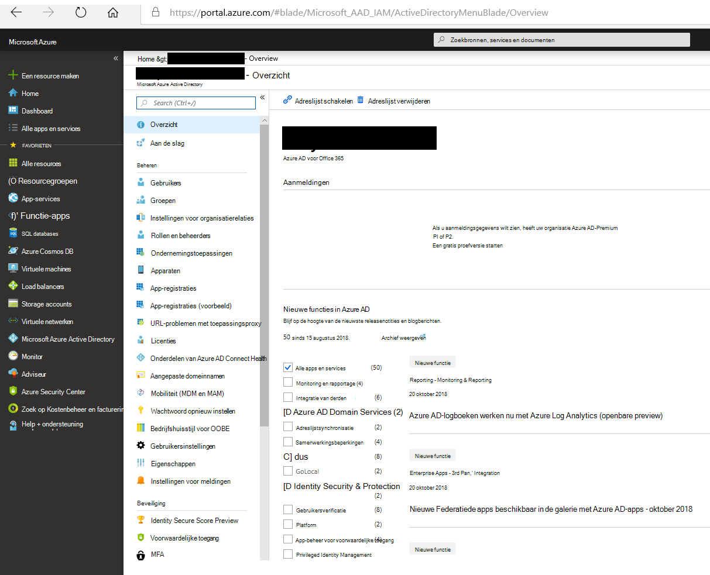

3. Klik in het linkernavigatiedeelvenster op **App-registraties (Voorbeeld)** en klik vervolgens op **Nieuwe registratie.**

   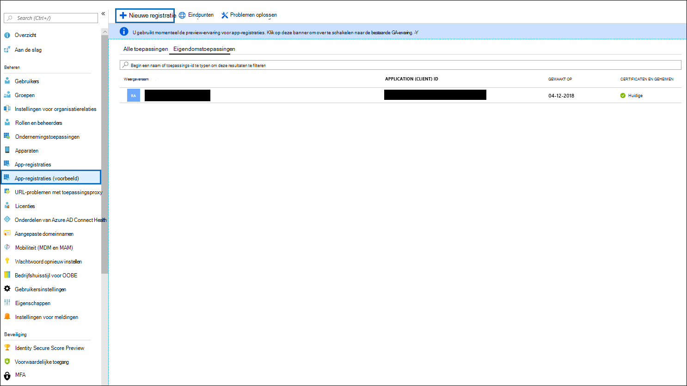

4. Registreer de toepassing. Selecteer **onder Redirect URI (optioneel)** de optie **Web** in de vervolgkeuzelijst toepassingstype en typ vervolgens in het vak voor `https://portal.azure.com` de URI.

   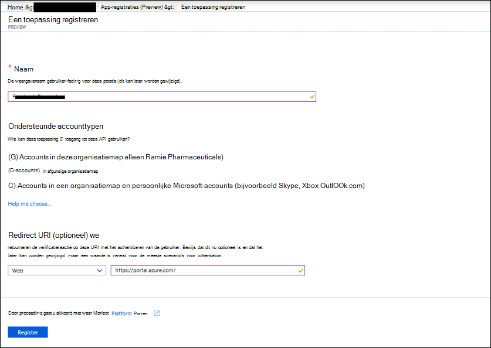

5. Kopieer de **toepassings-id en** **adreslijst-id (tenant)** en sla deze op in een tekstbestand of een andere veilige locatie. U gebruikt deze ID's in latere stappen.

    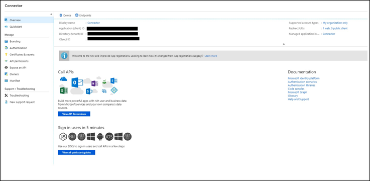

6. Ga naar **Certificaten & voor de nieuwe app** en klik onder **Clientgeheimen** op **Nieuwe clientgeheim.**

   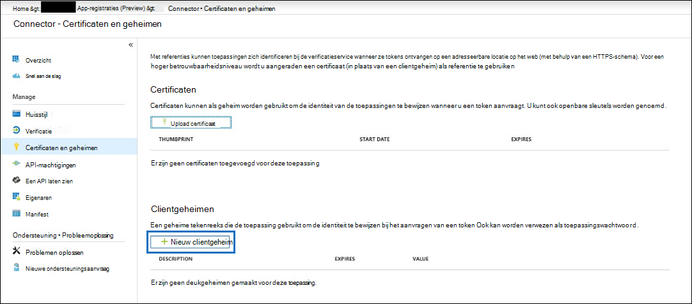

7. Maak een nieuw geheim. Typ het geheim in het vak Beschrijving en kies vervolgens een verloopperiode. 

   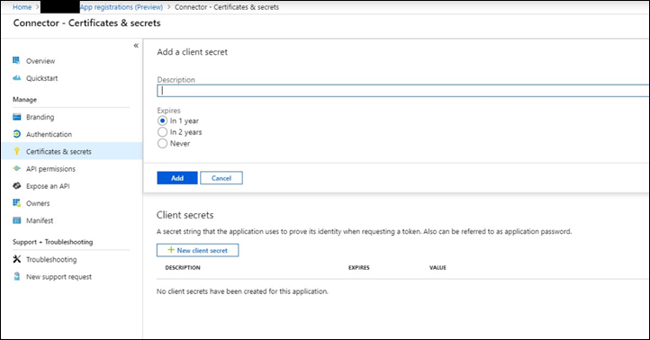

8. Kopieer de waarde van het geheim en sla deze op in een tekstbestand of een andere opslaglocatie. Dit is het AAD-toepassingsgeheim dat u in latere stappen gebruikt.

   

## Stap 2: De connectorwebservice implementeren van GitHub naar uw Azure-account

1. Ga naar [deze GitHub en](https://github.com/microsoft/m365-sample-twitter-connector-csharp-aspnet) klik op Implementeren naar **Azure**.

    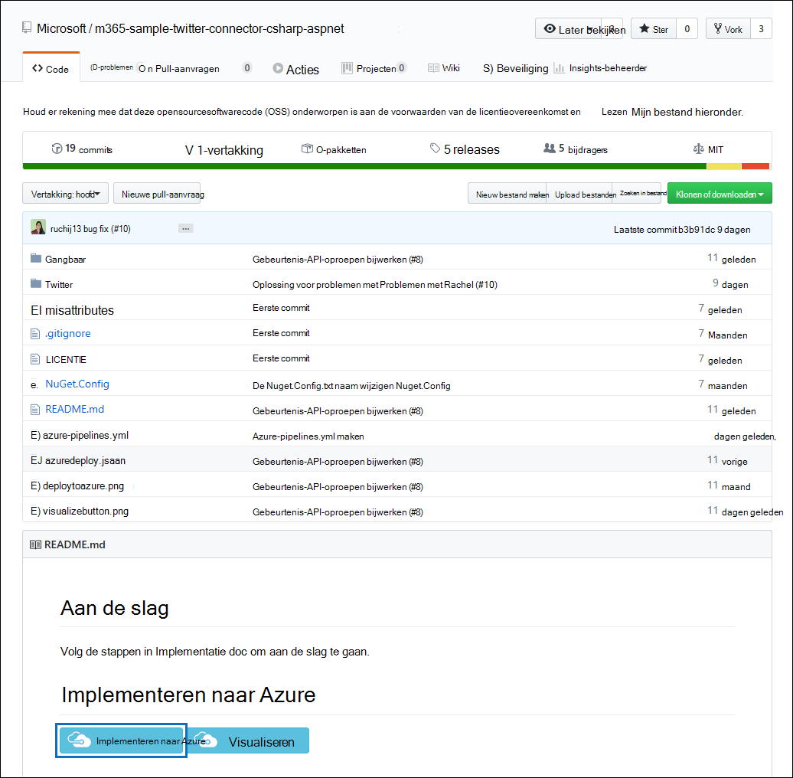

2. Nadat u op **Implementeren naar Azure hebt** geklikt, wordt u omgeleid naar een Azure-portal met een aangepaste sjabloonpagina. Vul de **basisbeginselen** **en Instellingen** en klik vervolgens op **Kopen.**

   

    - **Abonnement:** Selecteer uw Azure-abonnement waarin u de twitter-connectorwebservice wilt implementeren.
    
    - **Resourcegroep:** Kies of maak een nieuwe resourcegroep. Een resourcegroep is een container met gerelateerde resources voor een Azure-oplossing.

    - **Locatie:** Kies een locatie.

    - **Web App-naam:** Geef een unieke naam op voor de connectorweb-app. De naam moet tussen 3 en 18 tekens lang zijn. Deze naam wordt gebruikt om de URL van de Azure-appservice te maken. als u bijvoorbeeld de naam van de web-app van **twitterconnector** op geeft, wordt de URL van de Azure-app-service **twitterconnector.azurewebsites.net.**
    
    - **tenantId:** De tenant-id van uw Microsoft 365 organisatie die u hebt gekopieerd na het maken van de Facebook-connector-app in Azure Active Directory in stap 1.
    
   - **APISecretKey:** U kunt elke waarde als het geheim typen. Dit wordt gebruikt om toegang te krijgen tot de connectorweb-app in stap 5.

3. Nadat de implementatie is gelukt, ziet de pagina er ongeveer hetzelfde uit als de volgende schermafbeelding:

    

## Stap 3: De Twitter-app maken

1. Ga naar , meld u aan met de referenties voor het https://developer.twitter.com ontwikkelaarsaccount voor uw organisatie en klik vervolgens op **Apps.**

   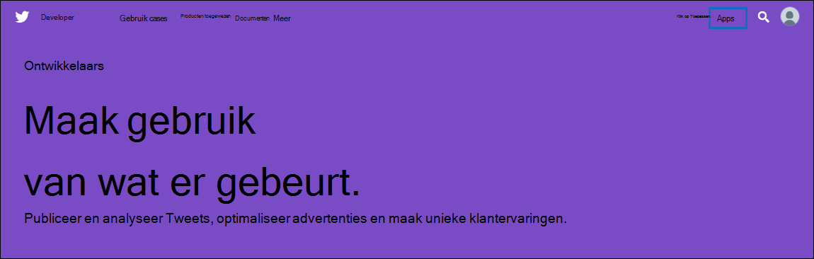
2. Klik **op Een app maken.**
   
   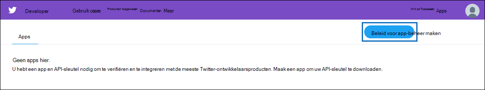

3. Voeg **onder App-details** informatie over de toepassing toe.

   

4. Selecteer in het twitter-ontwikkelaarsdashboard de app die u zojuist hebt gemaakt en klik vervolgens op **Details.**
   
   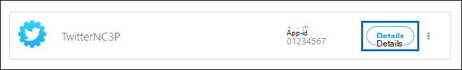

5. Kopieer op **het tabblad** Sleutels en tokens onder **Consumenten-API-sleutels** zowel de API-sleutel als de api-geheime sleutel en sla deze op in een tekstbestand of een andere opslaglocatie. Klik vervolgens **op Maken** om een toegangs token en toegangs tokengeheim te genereren en kopieer deze naar een tekstbestand of een andere opslaglocatie.
   
   

   Klik vervolgens **op Maken** om een toegangs-token en een toegangs tokengeheim te genereren en kopieer deze naar een tekstbestand of een andere opslaglocatie.

6. Klik op **het tabblad Machtigingen** en configureer de machtigingen zoals wordt weergegeven in de volgende schermafbeelding:

   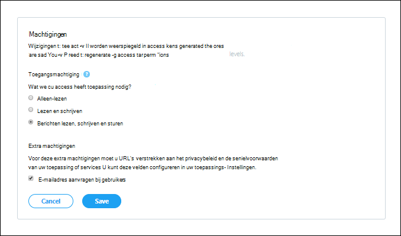

7. Nadat u de machtigingsinstellingen hebt op slaan, klikt u op het **tabblad App-details** en klikt u vervolgens op **Bewerken > Details bewerken.**

   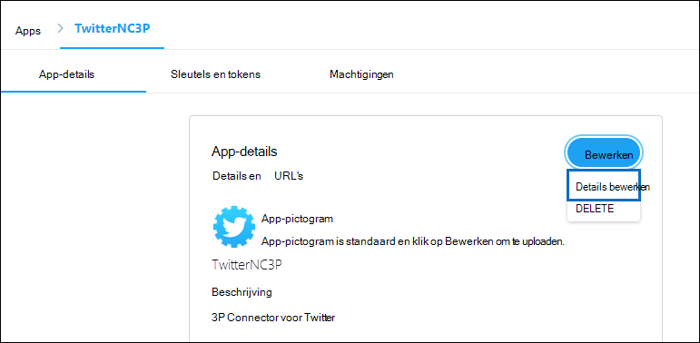

8. Ga als volgt te werk:

   - Schakel het selectievakje in om de connector-app toe te staan zich aan te melden bij Twitter.
   
   - Voeg de OAuth redirect Uri toe met de volgende indeling: **\<connectorserviceuri> /Weergaven/TwitterOAuth**, waarbij de waarde van *connectorserviceuri* de URL van de Azure-app-service voor uw organisatie is, bijvoorbeeld https://twitterconnector.azurewebsites.net/Views/TwitterOAuth .

    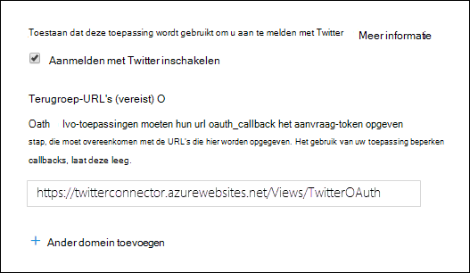

De twitter-ontwikkelaars-app is nu klaar voor gebruik.

## Stap 4: De connectorweb-app configureren 

1. Ga naar https:// \<AzureAppResourceName> .azurewebsites.net (waarbij **AzureAppResourceName** de naam is van uw Azure-app-resource die u hebt benoemd in stap 4). Als de naam bijvoorbeeld **twitterconnector** is, gaat u naar https://twitterconnector.azurewebsites.net . De startpagina van de app ziet eruit als de volgende schermafbeelding:

   

2. Klik **op Configureren** om een aanmeldingspagina weer te geven.

   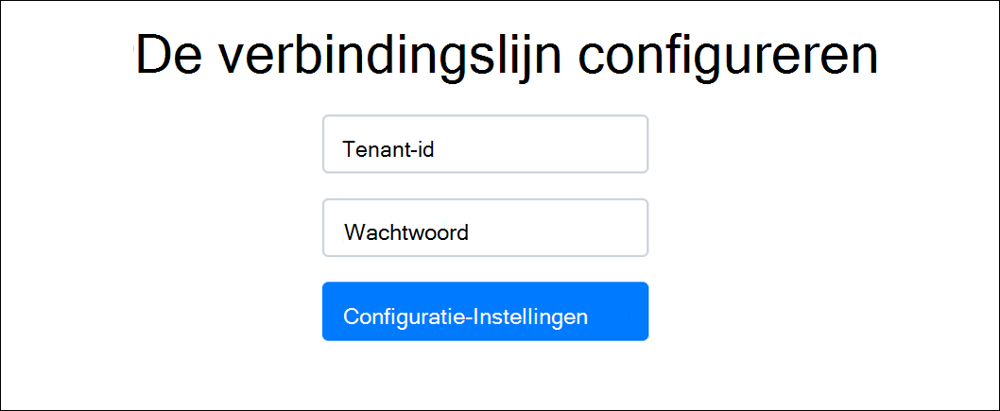

3. Typ of plak uw tenant-id in het vak Tenant-id (die u hebt verkregen in stap 2). Typ of plak in het wachtwoordvak de APISecretKey (die u hebt verkregen in stap 2) en klik vervolgens op **Configuratie-Instellingen** instellen om de pagina met configuratiegegevens weer te geven.

   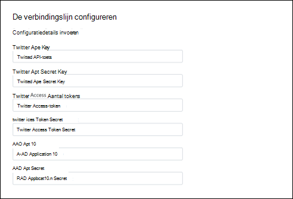

4. Voer de volgende configuratie-instellingen in 

   - **Twitter Api-toets:** De API-sleutel voor de Twitter-toepassing die u in stap 3 hebt gemaakt.
   
   - **Twitter Api Secret Key:** De API-geheime sleutel voor de Twitter-toepassing die u in stap 3 hebt gemaakt.
   
   - **Twitter Access-token:** Het access-token dat u hebt gemaakt in stap 3.
   
   - **Twitter Access Token Secret:** Het toegangs tokengeheim dat u hebt gemaakt in stap 3.
   
   - **AAD-toepassings-id:** De toepassings-id voor de Azure Active Directory app die u hebt gemaakt in stap 1
   
   - **AAD Application Secret:** De waarde voor het APISecretKey-geheim dat u hebt gemaakt in stap 1.

5. Klik **op Opslaan** om de connectorinstellingen op te slaan.

## Stap 5: Een Twitter-connector instellen in het Microsoft 365 compliancecentrum

1. Ga naar [https://compliance.microsoft.com](https://compliance.microsoft.com) en klik vervolgens op **Gegevensconnectoren** in het linkernavigatievenster.

2. Klik op **de pagina Gegevensconnectors** onder **Twitter** op **Weergeven.**

3. Klik op **de pagina Twitter** op **Verbindingslijn toevoegen.**

4. Klik op **de pagina Servicevoorwaarden** op **Accepteren.**

5. Voer op **de pagina Referenties toevoegen voor de connector-app** de volgende gegevens in en klik vervolgens op Verbinding **valideren.**

   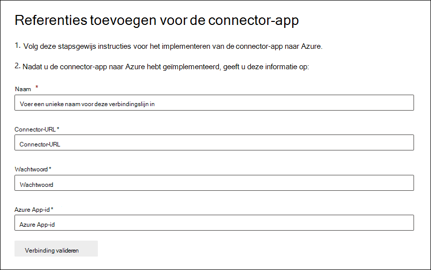

    - Typ in **het** vak Naam een naam voor de verbindingslijn, zoals **De Help-greep van Twitter.**
    
    - Typ of plak de URL van de Azure-appservice in het **vak Connector-URL.** bijvoorbeeld `https://twitterconnector.azurewebsites.net` .
    
    - Typ of plak **in** het vak Wachtwoord de waarde van de APISecretKey die u in stap 2 hebt gemaakt.
    
    - Typ of plak in het vak **Azure App ID** de waarde van de Azure Application App Id (ook wel de *client-id* genoemd) die u hebt verkregen in stap 1.

6. Nadat de verbinding is gevalideerd, klikt u op **Volgende.**

7. Typ of plak de APISecretKey **op Microsoft 365** pagina Gegevens importeren en klik vervolgens op **Aanmeldingsweb-app.**

8. Klik **op Aanmelden met Twitter.**

9. Meld u op de twitter-aanmeldingspagina aan met de referenties voor het Twitter-account van uw organisatie.

   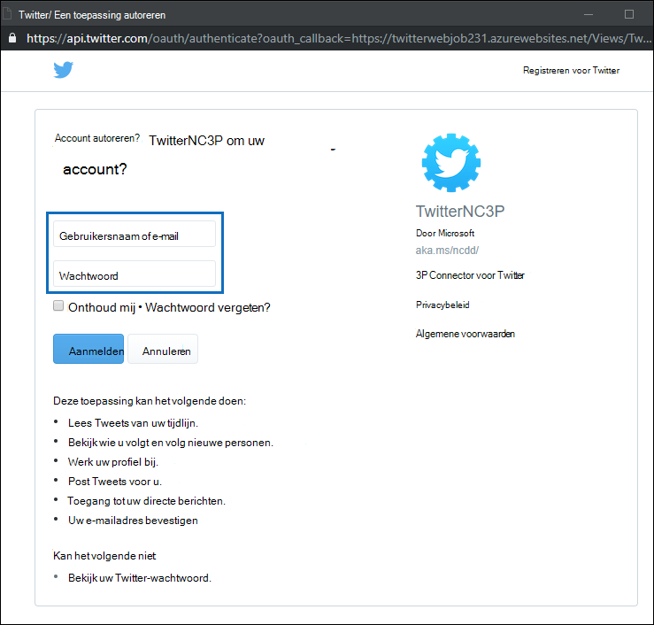

   Nadat u zich hebt aanmelden, wordt op de Twitter-pagina het volgende bericht weergegeven: 'Twitter Connector Job Successfully set up'.

10. Klik **op Doorgaan** om het instellen van de Twitter-connector te voltooien.

11. Op de **pagina Filters instellen** kunt u een filter toepassen om items van een bepaalde leeftijd in eerste instantie te importeren. Selecteer een leeftijd en klik vervolgens op **Volgende.**

12. Typ op **de pagina** Opslaglocatie kiezen het e-mailadres van Microsoft 365 postvak waarin de Twitter-items worden geïmporteerd en klik vervolgens op **Volgende.**

13. Klik **op Volgende** om de connectorinstellingen te bekijken en klik vervolgens op **Voltooien** om de connectorconfiguratie te voltooien.

14. Ga in het compliancecentrum naar de pagina **Gegevensconnectors** en klik op het tabblad **Verbindingslijnen** om de voortgang van het importproces te zien.
