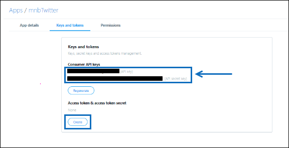

# Een connector implementeren om Twitter-gegevens te archiverenDeploy a connector to archive Twitter data

Dit artikel bevat het stapsgewijs proces voor het implementeren van een verbindingslijn die de Office 365 Import-service gebruikt om gegevens uit het Twitter-account van uw organisatie te importeren in Microsoft 365.This article contains the step-by-step process to deploy a connector that uses the Office 365 Import service to import data from your organization's Twitter account to Microsoft 365. Zie Een verbindingslijn instellen om Twitter-gegevens te archiveren voor een overzicht op hoog niveau van dit proces en een lijst met vereisten voor het implementeren van [een Twitter-connector. ](archive-twitter-data-with-sample-connector.md)For a high-level overview of this process and a list of prerequisites required to deploy a Twitter connector, see [Set up a connector to archive Twitter data ](archive-twitter-data-with-sample-connector.md). 

## Stap 1: Een app maken in Azure Active DirectoryStep 1: Create an app in Azure Active Directory

1. Ga naar <https://portal.azure.com> en meld u aan met de referenties van een globale beheerdersaccount.Go to <https://portal.azure.com> and sign in using the credentials of a global admin account.

   

2. Klik in het linkernavigatiedeelvenster op **Azure Active Directory**.In the left navigation pane, click **Azure Active Directory**.

   

3. Klik in het linkernavigatiedeelvenster op **App-registraties (Voorbeeld)** en klik vervolgens op **Nieuwe registratie.**In the left navigation pane, click **App registrations (Preview)** and then click **New registration**.

   

4. Registreer de toepassing.Register the application. Selecteer **onder Redirect URI (optioneel)** de optie **Web** in de vervolgkeuzelijst toepassingstype en typ vervolgens in het vak voor `https://portal.azure.com` de URI.Under **Redirect URI (optional)**, select **Web** in the application type dropdown list and then type `https://portal.azure.com` in the box for the URI.

   

5. Kopieer de **toepassings-id en** **adreslijst-id (tenant)** en sla deze op in een tekstbestand of een andere veilige locatie.Copy the **Application (client) ID** and **Directory (tenant) ID** and save them to a text file or other safe location. U gebruikt deze ID's in latere stappen.You use these IDs in later steps.

    

6. Ga naar **Certificaten & voor de nieuwe app** en klik onder **Clientgeheimen** op **Nieuwe clientgeheim.**Go to **Certificates & secrets for the new app** and under **Client secrets** click **New client secret**.

   

7. Maak een nieuw geheim.Create a new secret. Typ het geheim in het vak Beschrijving en kies vervolgens een verloopperiode.In the description box, type the secret and then choose an expiration period. 

   

8. Kopieer de waarde van het geheim en sla deze op in een tekstbestand of een andere opslaglocatie.Copy the value of the secret and save it to a text file or other storage location. Dit is het AAD-toepassingsgeheim dat u in latere stappen gebruikt.This is the AAD application secret that you use in later steps.

   

## Stap 2: De connectorwebservice implementeren van GitHub naar uw Azure-accountStep 2: Deploy the connector web service from GitHub to your Azure account

1. Ga naar [deze GitHub en](https://github.com/microsoft/m365-sample-twitter-connector-csharp-aspnet) klik op Implementeren naar **Azure**.Go to [this GitHub site](https://github.com/microsoft/m365-sample-twitter-connector-csharp-aspnet) and click **Deploy to Azure**.

    

2. Nadat u op **Implementeren naar Azure hebt** geklikt, wordt u omgeleid naar een Azure-portal met een aangepaste sjabloonpagina.After you click **Deploy to Azure**, you will be redirected to an Azure portal with a custom template page. Vul de **basisbeginselen** **en Instellingen** en klik vervolgens op **Kopen.**Fill in the **Basics** and **Settings** details and then click **Purchase**.

   

    - **Abonnement:** Selecteer uw Azure-abonnement waarin u de twitter-connectorwebservice wilt implementeren.**Subscription:** Select your Azure subscription that you want to deploy the Twitter connector web service to.
    
    - **Resourcegroep:** Kies of maak een nieuwe resourcegroep.**Resource group:** Choose or create a new resource group. Een resourcegroep is een container met gerelateerde resources voor een Azure-oplossing.A resource group is a container that holds related resources for an Azure solution.

    - **Locatie:** Kies een locatie.**Location:** Choose a location.

    - **Web App-naam:** Geef een unieke naam op voor de connectorweb-app.**Web App Name:** Provide a unique name for the connector web app. De naam moet tussen 3 en 18 tekens lang zijn.Th name must be between 3 and 18 characters in length. Deze naam wordt gebruikt om de URL van de Azure-appservice te maken. als u bijvoorbeeld de naam van de web-app van **twitterconnector** op geeft, wordt de URL van de Azure-app-service **twitterconnector.azurewebsites.net.**This name is used to create the Azure app service URL; for example, if you provide the Web app name of **twitterconnector** then the Azure app service URL  will be **twitterconnector.azurewebsites.net**.
    
    - **tenantId:** De tenant-id van uw Microsoft 365 organisatie die u hebt gekopieerd na het maken van de Facebook-connector-app in Azure Active Directory in stap 1.**tenantId:** The tenant ID of your Microsoft 365 organization that you copied after creating the Facebook connector app in Azure       Active Directory in Step 1.
    
   - **APISecretKey:** U kunt elke waarde als het geheim typen.**APISecretKey:** You can type any value as the secret. Dit wordt gebruikt om toegang te krijgen tot de connectorweb-app in stap 5.This is used to access the connector web app in Step 5.

3. Nadat de implementatie is gelukt, ziet de pagina er ongeveer hetzelfde uit als de volgende schermafbeelding:After the deployment is successful, the page will look similar to the following screenshot:

    

## Stap 3: De Twitter-app makenStep 3: Create the Twitter app

1. Ga naar , meld u aan met de referenties voor het https://developer.twitter.com ontwikkelaarsaccount voor uw organisatie en klik vervolgens op **Apps.**Go to https://developer.twitter.com, log in using the credentials for the developer account for your organization, and then click **Apps**.

   
2. Klik **op Een app maken.**Click **Create an app**.
   
   

3. Voeg **onder App-details** informatie over de toepassing toe.Under **App details**, add information about the application.

   

4. Selecteer in het twitter-ontwikkelaarsdashboard de app die u zojuist hebt gemaakt en klik vervolgens op **Details.**On the Twitter developer dashboard, select the app that you just created and then click **Details**.
   
   

5. Kopieer op **het tabblad** Sleutels en tokens onder **Consumenten-API-sleutels** zowel de API-sleutel als de api-geheime sleutel en sla deze op in een tekstbestand of een andere opslaglocatie.On the **Keys and tokens** tab, under **Consumer API keys** copy both the API Key and the API secret key and save them to a text file or other storage location. Klik vervolgens **op Maken** om een toegangs token en toegangs tokengeheim te genereren en kopieer deze naar een tekstbestand of een andere opslaglocatie.Then click **Create** to generate an access token and access token secret and copy these to a text file or other storage location.
   
   

   Klik vervolgens **op Maken** om een toegangs-token en een toegangs tokengeheim te genereren en kopieer deze naar een tekstbestand of een andere opslaglocatie.Then click **Create** to generate an access token and an access token secret, and copy these to a text file or other storage location.

6. Klik op **het tabblad Machtigingen** en configureer de machtigingen zoals wordt weergegeven in de volgende schermafbeelding:Click the **Permissions** tab and configure the permissions as shown in the following screenshot:

   

7. Nadat u de machtigingsinstellingen hebt op slaan, klikt u op het **tabblad App-details** en klikt u vervolgens op **Bewerken > Details bewerken.**After you save the permission settings, click the **App details** tab, and then click **Edit > Edit details**.

   

8. Ga als volgt te werk:Do the following tasks:

   - Schakel het selectievakje in om de connector-app toe te staan zich aan te melden bij Twitter.Select the checkbox to allow the connector app to sign in to Twitter.
   
   - Voeg de OAuth redirect Uri toe met de volgende indeling: **\<connectorserviceuri> /Weergaven/TwitterOAuth**, waarbij de waarde van *connectorserviceuri* de URL van de Azure-app-service voor uw organisatie is, bijvoorbeeld https://twitterconnector.azurewebsites.net/Views/TwitterOAuth .Add the OAuth redirect Uri using the following format: **\<connectorserviceuri>/Views/TwitterOAuth**, where the value of *connectorserviceuri* is the Azure app service URL for your organization; for example, https://twitterconnector.azurewebsites.net/Views/TwitterOAuth.

    

De twitter-ontwikkelaars-app is nu klaar voor gebruik.The Twitter developer app is now ready to use.

## Stap 4: De connectorweb-app configurerenStep 4: Configure the connector web app 

1. Ga naar https:// \<AzureAppResourceName> .azurewebsites.net (waarbij **AzureAppResourceName** de naam is van uw Azure-app-resource die u hebt benoemd in stap 4).Go to https://\<AzureAppResourceName>.azurewebsites.net (where **AzureAppResourceName** is the name of your Azure app resource that you named in Step 4). Als de naam bijvoorbeeld **twitterconnector** is, gaat u naar https://twitterconnector.azurewebsites.net .For example, if the name is **twitterconnector**, go to https://twitterconnector.azurewebsites.net. De startpagina van de app ziet eruit als de volgende schermafbeelding:The home page of the app looks like the following screenshot:

   

2. Klik **op Configureren** om een aanmeldingspagina weer te geven.Click **Configure** to display a sign in page.

   

3. Typ of plak uw tenant-id in het vak Tenant-id (die u hebt verkregen in stap 2).In the Tenant Id box, type or paste your tenant Id (that you obtained in Step 2). Typ of plak in het wachtwoordvak de APISecretKey (die u hebt verkregen in stap 2) en klik vervolgens op **Configuratie-Instellingen** instellen om de pagina met configuratiegegevens weer te geven.In the password box, type or paste the APISecretKey (that you obtained in Step 2), and then click **Set Configuration Settings** to display the configuration details page.

   

4. Voer de volgende configuratie-instellingen inEnter the following configuration settings 

   - **Twitter Api-toets:** De API-sleutel voor de Twitter-toepassing die u in stap 3 hebt gemaakt.**Twitter Api Key:** The API key for the Twitter application that you created in Step 3.
   
   - **Twitter Api Secret Key:** De API-geheime sleutel voor de Twitter-toepassing die u in stap 3 hebt gemaakt.**Twitter Api Secret Key:** The API secret key for the Twitter application that you created in Step 3.
   
   - **Twitter Access-token:** Het access-token dat u hebt gemaakt in stap 3.**Twitter Access Token:** The access token that you created in Step 3.
   
   - **Twitter Access Token Secret:** Het toegangs tokengeheim dat u hebt gemaakt in stap 3.**Twitter Access Token Secret:** The access token secret that you created in Step 3.
   
   - **AAD-toepassings-id:** De toepassings-id voor de Azure Active Directory app die u hebt gemaakt in stap 1**AAD Application ID:** The application ID for the Azure Active Directory app that you created in Step 1
   
   - **AAD Application Secret:** De waarde voor het APISecretKey-geheim dat u hebt gemaakt in stap 1.**AAD Application Secret:** The value for the APISecretKey secret that you created in Step 1.

5. Klik **op Opslaan** om de connectorinstellingen op te slaan.Click **Save** to save the connector settings.

## Stap 5: Een Twitter-connector instellen in het Microsoft 365 compliancecentrumStep 5: Set up a Twitter connector in the Microsoft 365 compliance center

1. Ga naar [https://compliance.microsoft.com](https://compliance.microsoft.com) en klik vervolgens op **Gegevensconnectoren** in het linkernavigatievenster.Go to [https://compliance.microsoft.com](https://compliance.microsoft.com) and then click **Data connectors** in the left nav.

2. Klik op **de pagina Gegevensconnectors** onder **Twitter** op **Weergeven.**On the **Data connectors** page under **Twitter**, click **View**.

3. Klik op **de pagina Twitter** op **Verbindingslijn toevoegen.**On the **Twitter** page, click **Add connector**.

4. Klik op **de pagina Servicevoorwaarden** op **Accepteren.**On the **Terms of service** page, click **Accept**.

5. Voer op **de pagina Referenties toevoegen voor de connector-app** de volgende gegevens in en klik vervolgens op Verbinding **valideren.**On the **Add credentials for your connector app** page, enter the following information and then click **Validate connection**.

   

    - Typ in **het** vak Naam een naam voor de verbindingslijn, zoals **De Help-greep van Twitter.**In the **Name** box, type a name for the connector, such as **Twitter help handle**.
    
    - Typ of plak de URL van de Azure-appservice in het **vak Connector-URL.** bijvoorbeeld `https://twitterconnector.azurewebsites.net` .In the **Connector URL** box, type or paste the Azure app service URL; for example `https://twitterconnector.azurewebsites.net`.
    
    - Typ of plak **in** het vak Wachtwoord de waarde van de APISecretKey die u in stap 2 hebt gemaakt.In the **Password** box, type or paste the value of the APISecretKey that you created in Step 2.
    
    - Typ of plak in het vak **Azure App ID** de waarde van de Azure Application App Id (ook wel de *client-id* genoemd) die u hebt verkregen in stap 1.In the **Azure App ID** box, type or paste the value of the Azure Application App Id (also called the *client ID*) that you obtained in Step 1.

6. Nadat de verbinding is gevalideerd, klikt u op **Volgende.**After the connection is successfully validated, click **Next**.

7. Typ of plak de APISecretKey **op Microsoft 365** pagina Gegevens importeren en klik vervolgens op **Aanmeldingsweb-app.**On the **Authorize Microsoft 365 to import data** page, type or paste the APISecretKey again and then click  **Login web app**.

8. Klik **op Aanmelden met Twitter.**Click **Login with Twitter**.

9. Meld u op de twitter-aanmeldingspagina aan met de referenties voor het Twitter-account van uw organisatie.On the Twitter sign in page, sign in using the credentials for your organization's Twitter account.

   

   Nadat u zich hebt aanmelden, wordt op de Twitter-pagina het volgende bericht weergegeven: 'Twitter Connector Job Successfully set up'.After you sign in, the Twitter page will display the following message, "Twitter Connector Job Successfully set up."

10. Klik **op Doorgaan** om het instellen van de Twitter-connector te voltooien.Click **Continue** to complete setting up the Twitter connector.

11. Op de **pagina Filters instellen** kunt u een filter toepassen om items van een bepaalde leeftijd in eerste instantie te importeren.On the **Set filters** page, you can apply a filter to initially import items that are a certain age. Selecteer een leeftijd en klik vervolgens op **Volgende.**Select an age, and then click **Next**.

12. Typ op **de pagina** Opslaglocatie kiezen het e-mailadres van Microsoft 365 postvak waarin de Twitter-items worden geïmporteerd en klik vervolgens op **Volgende.**On the **Choose storage location** page, type the email address of Microsoft 365 mailbox that the Twitter items will be imported to, and then click **Next**.

13. Klik **op Volgende** om de connectorinstellingen te bekijken en klik vervolgens op **Voltooien** om de connectorconfiguratie te voltooien.Click **Next** to review the connector settings and then click **Finish** to complete the connector setup.

14. Ga in het compliancecentrum naar de pagina **Gegevensconnectors** en klik op het tabblad **Verbindingslijnen** om de voortgang van het importproces te zien.In the compliance center, go to the **Data connectors** page, and click the **Connectors** tab to see the progress of the import process.
