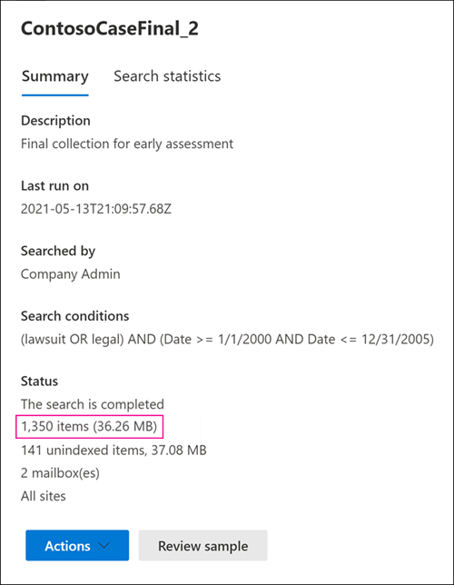

# Verschillen tussen geschatte en werkelijke eDiscovery-zoekresultatenDifferences between estimated and actual eDiscovery search results

Dit onderwerp is van toepassing op zoekopdrachten die u kunt uitvoeren met een van de volgende Microsoft 365 eDiscovery-hulpprogramma's:This topic applies to searches that you can run using one of the following Microsoft 365 eDiscovery tools: 

- Inhoud zoekenContent search
- Core eDiscoveryCore eDiscovery

Wanneer u een eDiscovery-zoekopdracht uit te voeren, geeft het hulpprogramma dat u gebruikt een schatting van het aantal items (en de totale grootte) dat aan de zoekcriteria voldoet.When you run an eDiscovery search, the tool you're using will return an estimate of the number of items (and their total size) that match the search criteria. Wanneer u bijvoorbeeld een zoekopdracht in het Microsoft 365 compliancecentrum, worden de geschatte zoekresultaten weergegeven op de flyoutpagina voor de geselecteerde zoekopdracht.For example, when you run a search in the Microsoft 365 compliance center, the estimated search results are displayed on the flyout page for the selected search.
  

  
Dit is dezelfde schatting van de totale grootte en het aantal items dat wordt weergegeven in het eDiscovery-exportprogramma wanneer u resultaten exporteert naar een lokale computer en in het rapport Overzicht exporteren dat wordt gedownload met de zoekresultaten.This is the same estimate of total size and number of items that is displayed in the eDiscovery Export Tool when you export results to a local computer and in the Export Summary report that's downloaded with the search results.
  
**Geschatte resultaten in het hulpprogramma eDiscovery-export****Estimated results in the eDiscovery Export tool**

  
**Geschatte resultaten in rapport Overzicht exporteren****Estimated results in Export Summary report**

  
Zoals u echter ziet in de vorige schermafbeelding van het rapport Overzicht exporteren, zijn de grootte en het aantal werkelijke zoekresultaten dat wordt gedownload, anders dan de grootte en het aantal geschatte zoekresultaten.However, as you'll notice in the previous screenshot of the Export Summary report, the size and number of actual search results that are downloaded are different than the size and number of estimated search results.
  

  
Hier zijn enkele redenen voor deze verschillen:Here are some reasons for these differences:
  
- **De manier waarop resultaten worden geschat.****The way results are estimated**. Een schatting van de zoekresultaten is alleen dat, een schatting (en niet een werkelijke telling) van de items die voldoen aan de zoekquerycriteria.An estimate of the search results is just that, an estimate (and not an actual count) of the items that meet the search query criteria. Als u de schatting van Exchange items wilt compileren, wordt een lijst met de bericht-ed's die voldoen aan de zoekcriteria, aangevraagd in de Exchange-database met het eDiscovery-hulpprogramma dat u gebruikt.To compile the estimate of Exchange items, a list of the message IDs that meet the search criteria is requested from the Exchange database by the eDiscovery tool you're using. Maar wanneer u de zoekresultaten exporteert, wordt de zoekopdracht opnieuw uitgevoerd en worden de werkelijke berichten opgehaald uit de Exchange database.But when you export the search results, the search is rerun and the actual messages are retrieved from the Exchange database. Deze verschillen kunnen dus het gevolg zijn van de manier waarop het geschatte aantal items en het werkelijke aantal items worden bepaald.So these differences might result because of how the estimated number of items and the actual number of items are determined.

- **Wijzigingen die plaatsvinden tussen de tijd bij het schatten** en exporteren van zoekresultaten.**Changes that happen between the time when estimating and exporting search results**. Wanneer u zoekresultaten exporteert, wordt de zoekopdracht opnieuw gestart om de meest recente items in de zoekindex te verzamelen die voldoen aan de zoekcriteria.When you export search results, the search is restarted to collect that most recent items in the search index that meet the search criteria. Het is mogelijk dat er extra items zijn gemaakt, verzonden of ontvangen die voldoen aan de zoekcriteria in de periode tussen het moment waarop de geschatte zoekresultaten zijn verzameld en wanneer de zoekresultaten zijn geëxporteerd.It's possible there are additional items were created, sent, or received that meet the search criteria in the time between when the estimated search results were collected and when the search results were exported. Het is ook mogelijk dat items die in de zoekindex stonden toen de zoekresultaten werden geschat, niet meer beschikbaar zijn omdat ze van de inhoudslocatie zijn verwijderd voordat de zoekresultaten worden geëxporteerd.It's also possible that items that were in the search index when the search results were estimated are no longer there because they were purged from the content location before the search results are exported. U kunt dit probleem onder andere beperken door een datumbereik op te geven voor een eDiscovery-zoekopdracht.One way to mitigate this issue is to specify a date range for an eDiscovery search. Een andere manier is om inhoudslocaties in de wacht te zetten, zodat items behouden blijven en niet kunnen worden verwijderd.Another way is to place a hold on content locations so that items are preserved and can't be purged. 

   Hoewel dit zelden het geval is, kan het onderhoud van ingebouwde agenda-items (die niet door de gebruiker kunnen worden bewerkt, maar wel in veel zoekresultaten worden opgenomen) van tijd tot tijd worden verwijderd.Although rare, even in the case when a hold is applied, maintenance of built-in calendar items (which aren't editable by the user, but are included in many search results) may be removed from time to time. Deze periodieke verwijdering van agenda-items resulteert in minder items die worden geëxporteerd.This periodic removal of calendar items will result in fewer items that are exported.

- **Niet-geïndexeerde items**.**Unindexed items**. Items die niet zijn geïndexeerd voor zoeken, kunnen verschillen veroorzaken tussen geschatte en werkelijke zoekresultaten.Items that are unindexed for search can cause differences between estimated and actual search results. U kunt niet-geïndexeerde items opnemen wanneer u de zoekresultaten exporteert.You can include unindexed items when you export the search results. Als u niet-geïndexeerde items opgeeft bij het exporteren van zoekresultaten, zijn er mogelijk meer items die worden geëxporteerd.If you include unindexed items when exporting search results, there might be more items that are exported. Dit veroorzaakt een verschil tussen de geschatte en geëxporteerde zoekresultaten.This will cause a difference between the estimated and exported search results.

    Wanneer u het zoekprogramma Inhoud gebruikt, hebt u de optie om niet-geïndexeerde items op te nemen wanneer u zoekresultaten exporteert.When using the Content search tool, you have the option to include unindexed items when you export search results. Het aantal niet-geïndexeerde items dat door de zoekopdracht wordt geretourneerd, wordt weergegeven op de flyoutpagina samen met de andere geschatte zoekresultaten.The number of unindexed items returned by the search is listed on the flyout page together with the other estimated search results. Niet-geïndexeerde items worden ook opgenomen in de totale grootte van de geschatte zoekresultaten.Any unindexed items would also be included in the total size of the estimated search results. Wanneer u zoekresultaten exporteert, kunt u niet-geïndexeerde items wel of niet opnemen.When you export search results, you have the option to include or not include unindexed items. Hoe u deze opties configureert, kan leiden tot verschillen tussen de geschatte en de werkelijke zoekresultaten die worden gedownload.How you configure these options might result in differences between estimated and the actual search results that are downloaded.

- **De resultaten van een inhoudszoekactie exporteren die alle inhoudslocaties bevat.****Exporting the results of a Content search that includes all content locations**. Als de zoekopdracht waaruit u resultaten exporteert, een zoekopdracht was van alle inhoudslocaties in uw organisatie, worden alleen de niet-geïndexeerde items van inhoudslocaties die items bevatten die voldoen aan de zoekcriteria, geëxporteerd.If the search that you're exporting results from was a search of all content locations in your organization, then only the unindexed items from content locations that contain items that match the search criteria will be exported. Met andere woorden: als er geen zoekresultaten worden gevonden in een postvak of site, worden niet-geïndexeerde items in dat postvak of de site niet geëxporteerd.In other words, if no search results are found in a mailbox or site, then any unindexed items in that mailbox or site won't be exported. Niet-geïndexeerde items van alle inhoudslocaties (zelfs items die niet overeenkomen met de zoekquery) worden echter opgenomen in de geschatte zoekresultaten.However, unindexed items from all content locations (even those that don't contain items that match the search query) will be included in the estimated search results.

    Als de zoekopdracht die u exporteert resultaten van opgenomen specifieke inhoudslocaties bevat, worden niet-geïndexeerde items (die niet worden uitgesloten door de zoekcriteria) van alle inhoudslocaties die in de zoekopdracht zijn opgegeven, ook geëxporteerd.Alternatively, if the search that you're exporting results from included specific content locations, then unindexed items (that aren't excluded by the search criteria) from all the content locations specified in the search will be exported. In dit geval moeten het geschatte aantal niet-geïndexeerde items en het aantal niet-geïndexeerde items dat wordt geëxporteerd hetzelfde zijn.In this case, the estimated number of unindexed items and the number of unindexed items that are exported should be the same.

    De reden voor het niet exporteren van niet-geïndexeerde items vanaf elke locatie in de organisatie is omdat hierdoor de kans op exportfouten wordt vergroot en de tijd die nodig is om de zoekresultaten te exporteren en te downloaden, kan toenemen.The reason for not exporting unindexed items from every location in the organization is because it might increase the likelihood of export errors and increase the time it takes to export and download the search results.

- **Niet-geïndexeerde items in SharePoint en OneDrive niet opgenomen in de zoekschattingen**.**Unindexed items in SharePoint and OneDrive not included in the search estimates**. Niet-geïndexeerde items SharePoint sites en OneDrive voor Bedrijven accounts worden niet opgenomen in de geschatte zoekresultaten.Unindexed items from SharePoint sites and OneDrive for Business accounts aren't included in the estimated search results. Dit komt omdat de SharePoint geen gegevens bevat voor niet-geïndexeerde items.This is because the SharePoint index doesn't contain data for unindexed items. Alleen niet-geïndexeerde items uit postvakken worden opgenomen in de zoekschattingen.Only unindexed items from mailboxes are included in the search estimates. Als u echter niet-geïndexeerde items opneemt bij het exporteren van zoekresultaten, worden niet-geïndexeerde items in SharePoint en OneDrive opgenomen, waardoor het aantal items dat daadwerkelijk wordt geëxporteerd, wordt vergroot.However, if you include unindexed items when exporting search results, unindexed items in SharePoint and OneDrive are included, which will increase the number of items that are actually exported. Dit resulteert in verschillen tussen de geschatte resultaten (die geen niet-geïndexeerde items bevatten in SharePoint en OneDrive sites) en de werkelijke items die worden gedownload.This will result in differences between the estimated results (which don't include unindexed items in SharePoint and OneDrive sites) and the actual items that are downloaded. De regel over het exporteren van niet-geïndexeerde items alleen van inhoudslocaties die items bevatten die voldoen aan de zoekcriteria, is in deze situatie nog steeds van toepassing.The rule about exporting unindexed items only from content locations that contain items that match the search criteria still applies in this situation.

- **Documentversies in SharePoint en OneDrive.****Document versions in SharePoint and OneDrive**. Wanneer u SharePoint sites en OneDrive accounts, worden meerdere versies van een document niet opgenomen in het aantal geschatte zoekresultaten.When searching SharePoint sites and OneDrive accounts, multiple versions of a document aren't included in the count of estimated search results. U hebt echter de optie om alle documentversies op te nemen wanneer u de zoekresultaten exporteert.But you have the option to include all document versions when you export the search results. Als u documentversies op neemt bij het exporteren van zoekresultaten, wordt het werkelijke aantal (en de totale grootte) van de geëxporteerde items verhoogd.If you include document versions when exporting search results, the actual number (and total size) of the exported items will be increased.

- **SharePoint mappen**.**SharePoint folders**. Als de naam van mappen in SharePoint overeenkomt met een zoekquery, bevat de zoekschatting een aantal van deze mappen (maar niet de items in die mappen).If the name of folders in SharePoint matches a search query, the search estimate will include a count of those folders (but not the items in those folders). Wanneer u de zoekresultaten exporteert, worden de items in de map geëxporteerd, maar wordt de werkelijke map niet geëxporteerd.When you export the search results, the items in folder are exported but the actual folder in not exported. Het resultaat is dat het aantal geëxporteerde items dat wordt geëxporteerd, groter is dan het aantal geschatte zoekresultaten.The result is that the number of exported items export will more than the number of estimated search results. Als een map leeg is, wordt het aantal werkelijke geëxporteerde zoekresultaten verminderd met één item, omdat de werkelijke map niet wordt geëxporteerd.If a folder is empty, then the number of actual search results exported will be reduced by one item, because the actual folder isn't exported.

- **SharePoint lijsten**.**SharePoint lists**. Als de naam van een SharePoint overeenkomt met een zoekquery, bevat de zoekschatting een aantal items in de lijst.If the name of a SharePoint list matches a search query, the search estimate will include a count of all the items in the list. Wanneer u de zoekresultaten exporteert, worden de lijst (en de lijstitems) geëxporteerd als één CSV-bestand.When you export the search results, the list (and the list items) is exported as a single CSV file. Hierdoor wordt het werkelijke aantal werkelijk geëxporteerde items beperkt.This will reduce the actual number of items actually exported. Als de lijst bijlagen bevat, worden de bijlagen geëxporteerd als afzonderlijke documenten, waardoor ook het aantal geëxporteerde items wordt vergroot.If the list contains attachments, the attachments will be exported as separate documents, which will also increase the number of items exported.

- **Onbewerkte bestandsindelingen versus geëxporteerde bestandsindelingen.****Raw file formats versus exported file formats**. Voor Exchange items wordt de geschatte grootte van de zoekresultaten berekend met de onbewerkte Exchange berichtgrootten.For Exchange items, the estimated size of the search results is calculated by using the raw Exchange message sizes. E-mailberichten worden echter geëxporteerd in een PST-bestand of als afzonderlijke berichten (die zijn opgemaakt als EML-bestanden).However, email messages are exported in a PST file or as individual messages (which are formatted as EML files). Beide exportopties gebruiken een andere bestandsindeling dan onbewerkte Exchange, waardoor de totale geëxporteerde bestandsgrootte anders is dan de geschatte bestandsgrootte.Both of these export options use a different file format than raw Exchange messages, which results in the total exported file size being different than the estimated file size.

- **De-duplicatie van Exchange items tijdens het exporteren**.**De-duplication of Exchange items during export**. Voor Exchange items vermindert de-duplicatie het aantal items dat wordt geëxporteerd.For Exchange items, de-duplication reduces the number of items that are exported. U hebt de optie om de zoekresultaten te de-dupliceren wanneer u ze exporteert.You have the option to de-duplicate the search results when you export them. Voor Exchange betekent dit dat slechts één exemplaar van een bericht wordt geëxporteerd, ook al kan dat bericht in meerdere postvakken worden gevonden.For Exchange messages, this means that only a single instance of a message is exported, even though that message might be found in multiple mailboxes. De geschatte zoekresultaten bevatten elk exemplaar van een bericht.The estimated search results include every instance of a message. Als u dus kiest voor de optie duplicatie bij het exporteren van zoekresultaten, kan het werkelijke aantal geëxporteerde items aanzienlijk lager zijn dan het geschatte aantal items.So if you choose the de-duplication option when exporting search results, the actual number of items that are exported might be considerably less than the estimated number of items.

    Als u de optie duplicatie kiest, moet u er ook rekening mee houden dat alle Exchange-items worden geëxporteerd in één PST-bestand en dat de mapstructuur uit de bronpostvakken niet behouden blijft.Another thing to keep in mind if you choose the de-duplication option is that all Exchange items are exported in a single PST file and the folder structure from the source mailboxes isn't preserved. Het geëxporteerde PST-bestand bevat alleen de e-mailitems.The exported PST file just contains the email items. Een rapport met zoekresultaten bevat echter een vermelding voor elk geëxporteerd bericht waarin het bronpostvak wordt aangegeven waar het bericht zich bevindt.However, a search results report contains an entry for each exported message that identifies the source mailbox where the message is located. Hiermee kunt u alle postvakken identificeren die een duplicaatbericht bevatten.This helps you identify all mailboxes that contain a duplicate message. Als u de-duplicatie niet inschakelen, wordt een afzonderlijk PST-bestand geëxporteerd voor elk postvak dat in de zoekopdracht is opgenomen.If you don't enable de-duplication, a separate PST file is exported for each mailbox included in the search.

> [!NOTE]
> Als u de optie Items opnemen die zijn versleuteld of die een **niet-herkende** notatie hebben niet selecteert wanneer u zoekresultaten exporteert of alleen de rapporten downloadt, worden de indexfoutrapporten gedownload, maar hebben ze geen vermeldingen.If you don't select the **Include items that are encrypted or have an unrecognized format** option when you export search results or just download the reports, the index error reports are downloaded but they don't have any entries. Dit betekent niet dat er geen indexeringsfouten zijn.This doesn't mean there aren't any indexing errors. Dit betekent alleen dat niet-geïndexeerde items niet zijn opgenomen in de export.It just means that unindexed items weren't included in the export.
