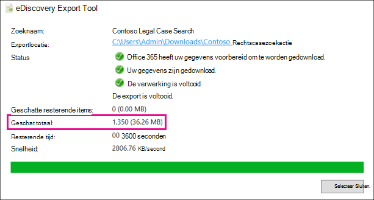
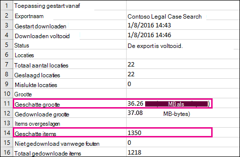
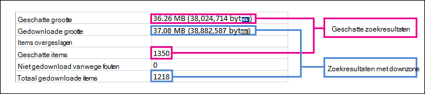

# Verschillen tussen geschatte en werkelijke eDiscovery-zoekresultaten

Dit onderwerp is van toepassing op zoekopdrachten die u kunt uitvoeren met een van de volgende Microsoft 365 eDiscovery-hulpprogramma's: 

- Inhoud zoeken
- Core eDiscovery

Wanneer u een eDiscovery-zoekopdracht uit te voeren, geeft het hulpprogramma dat u gebruikt een schatting van het aantal items (en de totale grootte) dat voldoet aan de zoekcriteria. Wanneer u bijvoorbeeld een zoekopdracht in het Microsoft 365 compliancecentrum, worden de geschatte zoekresultaten weergegeven op de flyoutpagina voor de geselecteerde zoekopdracht.
  

  
Dit is dezelfde schatting van de totale grootte en het aantal items dat wordt weergegeven in het eDiscovery-exportprogramma wanneer u resultaten exporteert naar een lokale computer en in het rapport Overzicht exporteren dat wordt gedownload met de zoekresultaten.
  
**Geschatte resultaten in het hulpprogramma eDiscovery-export**

  
**Geschatte resultaten in rapport Overzicht exporteren**

  
Zoals u echter ziet in de vorige schermafbeelding van het rapport Overzicht exporteren, zijn de grootte en het aantal werkelijke zoekresultaten dat wordt gedownload, anders dan de grootte en het aantal geschatte zoekresultaten.
  

  
Hier zijn enkele redenen voor deze verschillen:
  
- **De manier waarop resultaten worden geschat.** Een schatting van de zoekresultaten is alleen dat, een schatting (en niet een werkelijke telling) van de items die voldoen aan de zoekquerycriteria. Als u de schatting van Exchange items wilt compileren, wordt een lijst met de bericht-ed's die voldoen aan de zoekcriteria, aangevraagd in de Exchange-database met het eDiscovery-hulpprogramma dat u gebruikt. Maar wanneer u de zoekresultaten exporteert, wordt de zoekopdracht opnieuw uitgevoerd en worden de werkelijke berichten opgehaald uit de Exchange database. Deze verschillen kunnen dus het gevolg zijn van de manier waarop het geschatte aantal items en het werkelijke aantal items worden bepaald.

- **Wijzigingen die plaatsvinden tussen de tijd bij het schatten** en exporteren van zoekresultaten. Wanneer u zoekresultaten exporteert, wordt de zoekopdracht opnieuw gestart om de meest recente items in de zoekindex te verzamelen die voldoen aan de zoekcriteria. Het is mogelijk dat er extra items zijn gemaakt, verzonden of ontvangen die voldoen aan de zoekcriteria in de periode tussen het moment waarop de geschatte zoekresultaten zijn verzameld en wanneer de zoekresultaten zijn geëxporteerd. Het is ook mogelijk dat items die in de zoekindex stonden toen de zoekresultaten werden geschat, niet meer beschikbaar zijn omdat ze van de inhoudslocatie zijn verwijderd voordat de zoekresultaten worden geëxporteerd. U kunt dit probleem onder andere beperken door een datumbereik op te geven voor een eDiscovery-zoekopdracht. Een andere manier is om inhoudslocaties in de wacht te zetten, zodat items behouden blijven en niet kunnen worden verwijderd. 

   Hoewel dit zelden het geval is, kan het onderhoud van ingebouwde agenda-items (die niet door de gebruiker kunnen worden bewerkt, maar wel in veel zoekresultaten worden opgenomen) van tijd tot tijd worden verwijderd. Deze periodieke verwijdering van agenda-items resulteert in minder items die worden geëxporteerd.

- **Niet-geïndexeerde items**. Items die niet zijn geïndexeerd voor zoeken, kunnen verschillen veroorzaken tussen geschatte en werkelijke zoekresultaten. U kunt niet-geïndexeerde items opnemen wanneer u de zoekresultaten exporteert. Als u niet-geïndexeerde items opgeeft bij het exporteren van zoekresultaten, zijn er mogelijk meer items die worden geëxporteerd. Dit veroorzaakt een verschil tussen de geschatte en geëxporteerde zoekresultaten.

    Wanneer u het zoekhulpmiddel Inhoud gebruikt, hebt u de optie om niet-geïndexeerde items op te nemen in de zoekschatting. Het aantal niet-geïndexeerde items dat door de zoekopdracht wordt geretourneerd, wordt weergegeven op de flyoutpagina samen met de andere geschatte zoekresultaten. Niet-geïndexeerde items worden ook opgenomen in de totale grootte van de geschatte zoekresultaten. Wanneer u zoekresultaten exporteert, kunt u niet-geïndexeerde items wel of niet opnemen. Hoe u deze opties configureert, kan leiden tot verschillen tussen de geschatte en de werkelijke zoekresultaten die worden gedownload.

- **De resultaten van een inhoudszoekactie exporteren die alle inhoudslocaties bevat.** Als de zoekopdracht waaruit u resultaten exporteert, een zoekopdracht was van alle inhoudslocaties in uw organisatie, worden alleen de niet-geïndexeerde items van inhoudslocaties die items bevatten die voldoen aan de zoekcriteria, geëxporteerd. Met andere woorden: als er geen zoekresultaten worden gevonden in een postvak of site, worden niet-geïndexeerde items in dat postvak of de site niet geëxporteerd. Niet-geïndexeerde items van alle inhoudslocaties (zelfs items die niet overeenkomen met de zoekquery) worden echter opgenomen in de geschatte zoekresultaten.

    Als de zoekopdracht die u exporteert resultaten van opgenomen specifieke inhoudslocaties bevat, worden niet-geïndexeerde items (die niet worden uitgesloten door de zoekcriteria) van alle inhoudslocaties die in de zoekopdracht zijn opgegeven, ook geëxporteerd. In dit geval moeten het geschatte aantal niet-geïndexeerde items en het aantal niet-geïndexeerde items dat wordt geëxporteerd hetzelfde zijn.

    De reden voor het niet exporteren van niet-geïndexeerde items vanaf elke locatie in de organisatie is omdat hierdoor de kans op exportfouten wordt vergroot en de tijd die nodig is om de zoekresultaten te exporteren en te downloaden, kan toenemen.

- **Niet-geïndexeerde items in SharePoint en OneDrive niet opgenomen in zoekschattingen**. Niet-geïndexeerde items SharePoint sites en OneDrive voor Bedrijven accounts worden niet opgenomen in de geschatte zoekresultaten. Dit komt omdat de SharePoint geen gegevens bevat voor niet-geïndexeerde items. Alleen niet-geïndexeerde items uit postvakken worden opgenomen in de zoekschattingen. Als u echter niet-geïndexeerde items opgeeft bij het exporteren van zoekresultaten, worden niet-geïndexeerde items in SharePoint en OneDrive opgenomen. Dit kan leiden tot verschillen tussen de geschatte resultaten (die geen niet-geïndexeerde items bevatten in SharePoint en OneDrive sites) en de werkelijke items die worden gedownload. De regel over het exporteren van niet-geïndexeerde items alleen van inhoudslocaties die items bevatten die voldoen aan de zoekcriteria, is in deze situatie nog steeds van toepassing.

- **Onbewerkte bestandsindelingen versus geëxporteerde bestandsindelingen.** Voor Exchange items wordt de geschatte grootte van de zoekresultaten berekend met de onbewerkte Exchange berichtgrootten. E-mailberichten worden echter geëxporteerd in een PST-bestand of als afzonderlijke berichten (die zijn opgemaakt als EML-bestanden). Beide exportopties gebruiken een andere bestandsindeling dan onbewerkte Exchange, waardoor de totale geëxporteerde bestandsgrootte anders is dan de geschatte bestandsgrootte.

- **Documentversies**. Voor SharePoint documenten worden meerdere versies van een document niet opgenomen in de geschatte zoekresultaten. U hebt echter de optie om alle documentversies op te nemen wanneer u de zoekresultaten exporteert, waardoor het werkelijke aantal (en de totale grootte) van de geëxporteerde documenten wordt vergroot. 

- **De-duplicatie**. Voor Exchange items vermindert de-duplicatie het aantal items dat wordt geëxporteerd. U hebt de optie om de zoekresultaten te de-dupliceren wanneer u ze exporteert. Voor Exchange betekent dit dat slechts één exemplaar van een bericht wordt geëxporteerd, ook al kan dat bericht in meerdere postvakken worden gevonden. De geschatte zoekresultaten bevatten elk exemplaar van een bericht. Als u dus kiest voor de optie duplicatie bij het exporteren van zoekresultaten, kan het werkelijke aantal geëxporteerde items aanzienlijk lager zijn dan het geschatte aantal items.

    Als u de optie duplicatie kiest, moet u er ook rekening mee houden dat alle Exchange-items worden geëxporteerd in één PST-bestand en dat de mapstructuur uit de bronpostvakken niet behouden blijft. Het geëxporteerde PST-bestand bevat alleen de e-mailitems. Een rapport met zoekresultaten bevat echter een vermelding voor elk geëxporteerd bericht waarin het bronpostvak wordt aangegeven waar het bericht zich bevindt. Hiermee kunt u alle postvakken identificeren die een duplicaatbericht bevatten. Als u de-duplicatie niet inschakelen, wordt een afzonderlijk PST-bestand geëxporteerd voor elk postvak dat in de zoekopdracht is opgenomen. 

> [!NOTE]
> Als u de optie Items opnemen die zijn versleuteld of die een **niet-herkende** notatie hebben niet selecteert wanneer u zoekresultaten exporteert of alleen de rapporten downloadt, worden de indexfoutrapporten gedownload, maar hebben ze geen vermeldingen. Dit betekent niet dat er geen indexeringsfouten zijn. Dit betekent alleen dat niet-geïndexeerde items niet zijn opgenomen in de export. 
