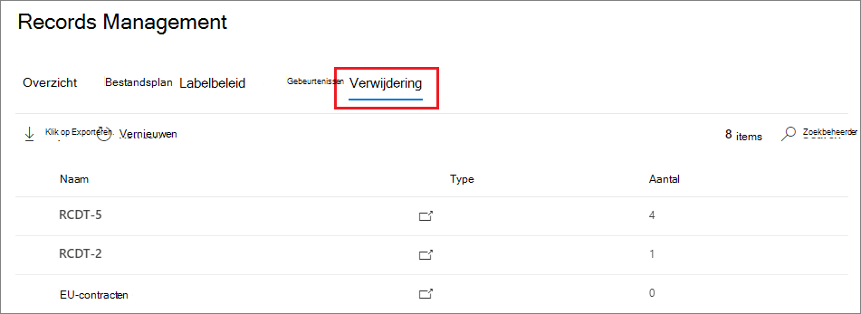
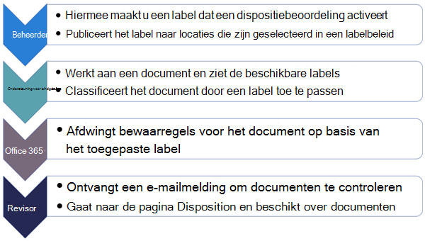
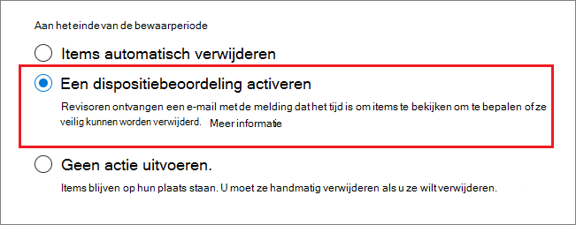
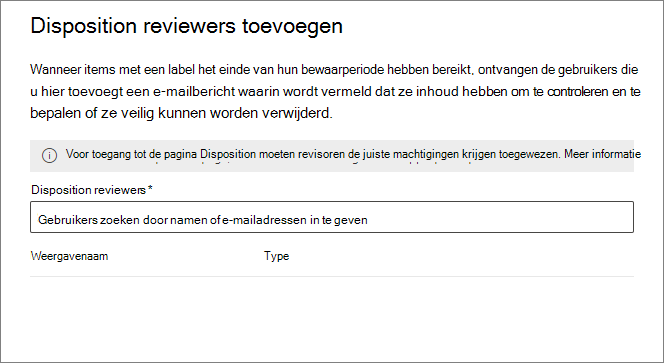
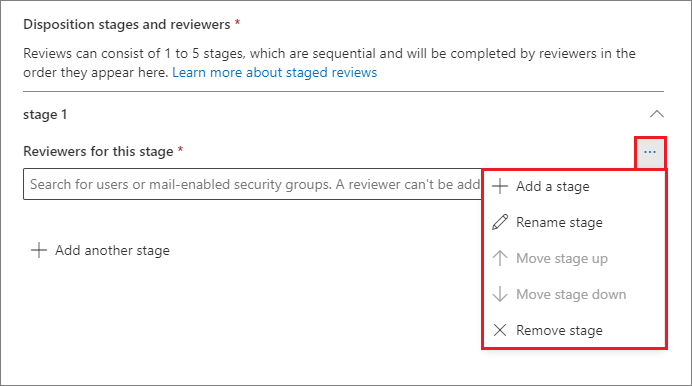
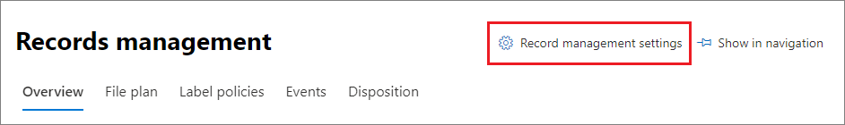
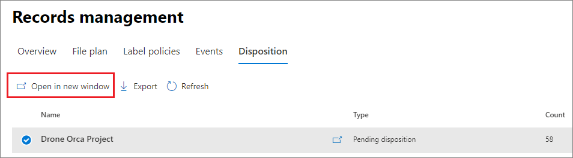
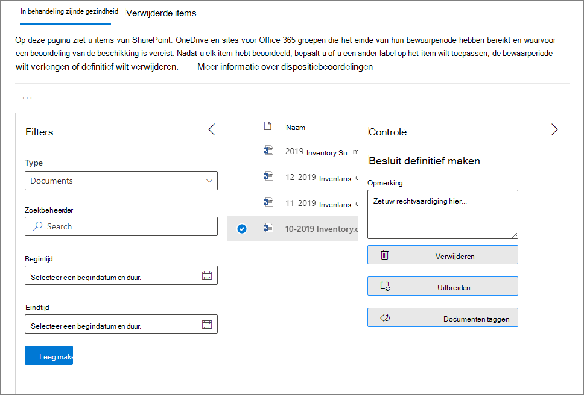
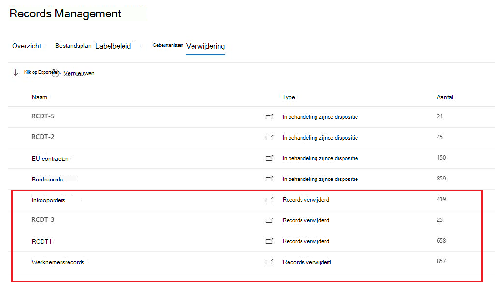

# <a name="disposition-of-content"></a>Verwijdering van inhoud

>*[Richtlijnen voor Microsoft 365-licenties voor beveiliging en compliance](/office365/servicedescriptions/microsoft-365-service-descriptions/microsoft-365-tenantlevel-services-licensing-guidance/microsoft-365-security-compliance-licensing-guidance).*

Gebruik de pagina **Verwijdering** van **Recordbeheer** in het Microsoft 365-compliancecentrum om verwijderingscontroles te beheren en metagegevens weer te geven van [records](records-management.md#records) die automatisch zijn verwijderd aan het einde van de bewaarperiode.

> [!NOTE]
> Wordt uitgevoerd in preview: **verwijderingsbeoordeling met meerdere fasen**
> 
> Een beheerder kan nu maximaal vijf opeenvolgende fasen voor verwijderingsbeoordeling toevoegen aan een bewaarlabel en revisoren kunnen andere gebruikers toevoegen aan de fase voor de verwijderingsbeoordeling. U kunt ook de e-mailmeldingen en herinneringen aanpassen. De volgende secties bevatten meer informatie over de wijzigingen in deze preview.

## <a name="prerequisites-for-viewing-content-dispositions"></a>Vereisten voor het weergeven van inhoudsverwijderingen

Als u beoordelingen voor dispositioneringen wilt beheren en wilt controleren of de records zijn verwijderd, moet u over voldoende machtigingen te weten komen en moet de controle zijn ingeschakeld.

### <a name="permissions-for-disposition"></a>Machtigingen voor verwijdering

Als u het tabblad **Verwijdering** in het Microsoft 365-compliancecentrum wilt openen, moeten gebruikers de beheerdersrol **Verwijderingsbeheer** hebben. Vanaf december 2020 is deze rol nu opgenomen in de **Recordbeheer**-standaardrolgroep.

> [!NOTE]
> Standaard krijgt een globale beheerder niet de rol **Verwijderingsbeheer** toegewezen. 

Als u gebruikers alleen de machtigingen wilt verlenen die ze nodig hebben voor verwijderingsbeoordelingen zonder hen machtigingen te verlenen voor het weergeven en configureren van andere functies voor het bewaren en recordbeheer, maakt u een aangepaste rollengroep (bijvoorbeeld 'Revisoren voor verwijdering') en verleent u deze groep de rol **Verwijderingsbeheer**.

Zie voor instructies voor de configuratie van deze machtigingen [Gebruikers toegang geven tot het Office 365-beveiligings- en compliancecentrum](../security/office-365-security/grant-access-to-the-security-and-compliance-center.md).

Verder geldt:

- Als u de inhoud van items wilt bekijken tijdens het verwijderen, voegt u gebruikers toe aan de rollengroep: **Content Explorer Content Viewer**. Als gebruikers niet over de machtigingen van deze rollengroepen hebben, kunnen ze nog steeds een actie voor verwijderingsbeoordeling selecteren om de verwijderingsbeoordeling te voltooien. Ze moeten dit wel kunnen doen zonder de inhoud van het item uit het mini-preview-paneel te bekijken vanuit het compliancecentrum.

- In preview: standaard ziet elke persoon die toegang heeft tot de pagina **Verwijdering** alleen items waarvoor ze zijn toegewezen om te beoordelen. Om een recordbeheerder alle items te laten zien die zijn toegewezen aan alle gebruikers, en alle retentielabels die zijn geconfigureerd voor verwijderingsbeoordeling: Navigeer naar **instellingen Recordbeheer** > **Algemeen** > **Beveiligingsgroep voor recordbeheerder** om een beveiligingsgroep voor e-mail te selecteren en vervolgens in te schakelen die de beheerdersaccounts bevat.
    
    Microsoft 365-groepen en beveiligingsgroepen die geen e-mail hebben, zullen deze functie niet ondersteunen en worden niet weergegeven in de lijst om deze te selecteren. Als u een nieuwe beveiligingsgroep met e-mail wilt maken, gebruikt u de koppeling naar het Microsoft 365-beheercentrum om de nieuwe groep te maken. 
    
    > [!IMPORTANT]
    > Nadat u de groep hebt ingeschakeld, kunt u deze niet wijzigen in het compliancecentrum. Zie de volgende sectie voor het inschakelen van een andere groep met behulp van PowerShell.

- In preview: de **Instellingen voor recordbeheer** zijn alleen zichtbaar voor recordbeheerders. 

#### <a name="enabling-another-security-group-for-disposition"></a>Een andere beveiligingsgroep voor verwijdering inschakelen

Nadat u een beveiligingsgroep hebt ingeschakeld voor verwijdering in de **Instellingen voor recordbeheer** in het Microsoft 365-compliancecentrum, kunt u deze machtiging uitschakelen voor de groep of de geselecteerde groep vervangen in het compliancecentrum. U kunt echter een andere beveiligingsgroep met e-mail inschakelen via cmdlet [Enable-ComplianceTagStorage](/powershell/module/exchange/enable-compliancetagstorage).

Bijvoorbeeld: 

```PowerShell
Enable-ComplianceTagStorage -RecordsManagementSecurityGroupEmail dispositionreviewers@contosoi.com
````

### <a name="enable-auditing"></a>De controlefunctie inschakelen

Zorg ervoor dat de controle minimaal één dag vóór de eerste verdingsactie is ingeschakeld. Zie [Het controlelogboek in het Office 365-beveiligings- &amp; en compliancecentrum ](search-the-audit-log-in-security-and-compliance.md) doorzoeken voor meer informatie. 

## <a name="disposition-reviews"></a>Verwijderingsbeoordelingen

Wanneer het einde van de retentieperiode voor inhoud is bereikt, zijn er verschillende redenen om die inhoud te bekijken en te controleren of deze definitief kan worden verwijderd ('verwijderd'). Bijvoorbeeld, in plaats van de inhoud te verwijderen, moet u misschien:
  
- Schort het verwijderen van relevante inhoud op in geval van juridische procedures of een audit.

- Wijs een andere bewaarperiode toe aan de inhoud, bijvoorbeeld omdat de oorspronkelijke bewaarinstellingen een tijdelijke of tijdelijke oplossing waren.

- Verplaats de inhoud van de bestaande locatie naar een archieflocatie, bijvoorbeeld als deze inhoud onderzoek of historische waarde heeft.

Wanneer een beoordeling van een verwijdering wordt geactiveerd aan het einde van de bewaarperiode:
  
- De revisoren die u kiest, ontvangen per e-mail een melding dat ze inhoud moeten beoordelen. Deze revisoren kunnen afzonderlijke gebruikers of beveiligingsgroepen met e-mail zijn. Nieuw in preview:
   - U kunt e-mail die zei ontvangen aanpassen, inclusief instructies in verschillende talen. Voor ondersteuning in meerdere talen moet u zelf de vertalingen opgeven. Deze aangepaste tekst wordt weergegeven voor alle revisoren, ongeacht hun locatie.
   - Gebruikers ontvangen een eerste e-mailmelding per label aan het einde van de bewaarperiode van het item, met één keer per week een herinnering per label, voor alle aan hen toegewezen verwijderingsbeoordelingen. Ze kunnen op de koppeling in de e-mailmelding en herinnering klikken om naar de pagina **Verwijdering** in het Microsoft 365-compliancecentrum te gaan en de inhoud te bekijken en een actie uit te voeren. De revisoren kunnen ook rechtstreeks naar de pagina **Verwijdering** in het compliancecentrum gaan.
   - Revisoren zien alleen de aan hen toegewezen verwijderingsbeoordelingen, terwijl beheerders die zijn toegevoegd aan de geselecteerde beveiligingsgroep voor recordbeheer alle beoordelingen zien.
   - Revisoren kunnen nieuwe gebruikers toevoegen aan dezelfde verwijderingsbeoordeling. Deze actie verleent deze toegevoegde gebruikers op dit moment niet automatisch de [vereiste machtigingen ](#permissions-for-disposition).
   - Voor proces van de verwijderingsbeoordeling wordt in een mini-revisievenster voor elk item een voorbeeld van de inhoud weergegeven als ze machtigingen hebben, zodat ze deze kunnen bekijken. Als ze geen machtigingen hebben, kunnen ze de inhoudskoppeling selecteren en machtigingen aanvragen. Dit mini-revisievenster bevat ook tabbladen voor meer informatie over de inhoud:
       - **Details** om geïndexeerde eigenschappen weer te geven, waar deze zich bevinden, wie de eigenschap heeft gemaakt en wanneer, en wie deze het laatst heeft gewijzigd en wanneer.
       - **Geschiedenis** dit laat de geschiedenis van acties voor een verwijderingsbeoordeling tot op heden zien, met opmerkingen van revisoren, indien beschikbaar.

Een verwijderingsbeoordeling kan inhoud bevatten in Exchange-postvakken, SharePoint-sites en OneDrive-accounts. Inhoud die wacht op een verwijderingsbeoordeling op deze locaties, wordt pas permanent verwijderd als een revisor ervoor heeft gekozen de inhoud definitief te verwijderen.

> [!NOTE]
> Een postvak moet ten minste 10 MB gegevens bevatten ter ondersteuning van de verwijderingsbeoordelingen.

Beheerders kunnen in het tabblad **Overzicht** een overzicht zien van alle verwijderingen die in behandeling zijn. Revisoren zien alleen hun toegewezen verwijderingen die nog openstaan. Bijvoorbeeld:


Wanneer u het selectievakje **Alle verwijderingen in behandeling weergeven** selecteert, gaat u naar de pagina **Verwijdering**. Bijvoorbeeld:




### <a name="workflow-for-a-disposition-review"></a>Een verwijderingsbeoordelingsworkflow

In het volgende diagram ziet u de basiswerkstroom voor een beoordeling van een verwijdering wanneer een bewaarlabel wordt gepubliceerd en vervolgens handmatig door een gebruiker wordt toegepast. Een bewaarlabel dat is geconfigureerd voor een verwijderingsbeoordeling kan ook automatisch worden toegepast op inhoud.
  


### <a name="how-to-configure-a-retention-label-for-disposition-review"></a>Een bewaarlabel configureren voor een verwijderingsbeoordeling

Het activeren van een verwijderingsbeoordeling aan het einde van de bewaarperiode is een configuratieoptie die alleen beschikbaar is met een bewaarlabel. Verwijderingsbeoordeling is niet beschikbaar voor een bewaarbeleid.  Zie [Meer informatie over retentiebeleid en retentielabels](retention.md) voor meer informatie over de twee oplossingen.

Op de pagina **Bewaarinstellingen definiëren** een bewaarlabel:


 
Nadat u deze optie **Een verwijderingsbeoordeling activeren** hebt geselecteerd, geeft u op de volgende pagina van de wizard op hoeveel opeenvolgende fasen van de verwijdering u wilt instellen en hoeveel revisoren u wilt voor elk stadium:

 

Selecteer **Een fase toevoegen** en geef uw fase een naam voor identificatie doeleinden. Geef vervolgens de revisoren voor die fase op.

Voor de revisoren geeft u een gebruiker of beveiligingsgroep met e-mail op. Microsoft 365-groepen ([voorheen Office 365-groepen](https://techcommunity.microsoft.com/t5/microsoft-365-blog/office-365-groups-will-become-microsoft-365-groups/ba-p/1303601)) worden niet ondersteund voor deze optie.

Als u meer dan één persoon nodig hebt om een item aan het einde van de bewaarperiode te controleren, selecteert u opnieuw **Een fase toevoegen** en herhaalt u het configuratieproces voor het aantal fasen dat u nodig hebt, met een maximum van vijf fasen. 

Binnen elke afzonderlijke fase van de verwijdering zijn alle gebruikers die u voor die fase opgeeft gemachtigd om de volgende actie uit te voeren voor het item aan het einde van de bewaarperiode. Deze gebruikers kunnen ook andere gebruikers toevoegen aan hun fase van de verwijderingsbeoordeling.

> [!NOTE]
> Bestaande bewaarlabels die zijn geconfigureerd voor een verwijderingsbeoordeling, kunnen worden geüpgraded naar beoordeling met meerdere fasen door het label te configureren. Selecteer in de wizard **Een fase toevoegen** of bewerk de bestaande revisoren of voeg nieuwe revisoren toe.

Tijdens de configuratiefase kunt u voor elke opgegeven fase de naam wijzigen, de volgorde ervan wijzigen of de fase verwijderen door de optie Fase-acties te selecteren (**...**): 



U kunt een fase echter niet opnieuw ordenen of verwijderen nadat u het bewaarlabel hebt gemaakt.

Nadat u de revisoren hebt opgegeven, moet u ze de machtiging voor **Verwijderingsbeheer** toewijzen. Zie de sectie [Machtigingen voor verwijdering](#permissions-for-disposition) op deze pagina voor meer informatie.

### <a name="how-to-customize-email-messages-for-disposition-review"></a>E-mailberichten aanpassen voor verwijderingsbeoordeling

Voorbeeld van een standaard-e-mailmelding die naar een revisor is verzonden:


In het voorbeeld kunt u ook de e-mailberichten aanpassen die voor de eerste melding naar revisoren worden verzonden en vervolgens herinneringen ontvangen.

Selecteer op een van de verwijderingspagina's in het compliancecentrum de **Instellingen voor recordbeheer**:  



Selecteer vervolgens het tabblad **Verwijderingsmeldingen** en geef op of u alleen het standaard-e-mailbericht wilt gebruiken of uw eigen tekst wilt toevoegen aan het standaardbericht. Uw aangepaste tekst wordt toegevoegd aan de e-mailinstructies na de informatie over het bewaarlabel en vóór de instructies voor de volgende stappen.

Tekst voor alle talen kan worden toegevoegd, maar opmaak en afbeeldingen worden momenteel niet ondersteund. URL's en e-mailadressen kunnen als tekst worden ingevoerd en, afhankelijk van de e-mailclient, weergave als hyperlinks of niet-opgemaakte tekst weergeven in de aangepaste e-mail.

Voorbeeldtekst die moet worden toegevoegd:

```console
If you need additional information, visit the helpdesk website (https://support.contoso.com) or send them an email (helpdesk@contoso.com).
```

Selecteer **Opslaan** om de wijzigingen op te slaan.

### <a name="viewing-and-disposing-of-content"></a>Inhoud weergeven en verwijderen

Wanneer een revisor per e-mail wordt gewaarschuwd dat de inhoud kan worden bekeken, kan hij/zij klikken op een koppeling in de e-mail die rechtstreeks leidt naar de pagina **Verwijdering** in **Recordbeheer** in het Microsoft 365-compliancecentrum. De revisoren kunnen zien hoeveel items voor elk retentielabel wachten op verwijdering door te kijken naar het **Type** dat zegt **Verwijdering in behandeling**. Vervolgens selecteren ze een bewaarlabel en **Openen in nieuw venster** om alle inhoud met dat label weer te geven:



Op de pagina **Verwijdering n behandeling voor** worden alle hangende voorzetsels voor dat label weergegeven. Wanneer een of meer items zijn geselecteerd, kunnen ze het mini-voorbeeldvenster en het tabblad **Bron**, **Details** en het tabblad **Geschiedenis** gebruiken om de inhoud te controleren voordat u actie onderneemt:



Als u de horizontale schuifbalk gebruikt of het mini-revisievenster sluit, ziet u meer kolommen met de vervaldatum en de naam van het revisievenster voor verwijderen.

Zoals u in de afbeelding kunt zien, worden de volgende acties ondersteund: 
  
- **Verwijdering goedkeuren**:
    - Wanneer deze actie is geselecteerd voor een tussentijdse fase van een verwijderingsbeoordeling (u hebt meerdere fasen geconfigureerd): Het item wordt naar de volgende verwijderingsfase verplaatst.
    - Wanneer deze actie is geselecteerd voor de laatste verwijderingsfase of als er slechts één verwijderingsfase is: Het item is gemarkeerd als in aanmerking komend voor permanente verwijdering. De exacte timing voor de verwijdering is afhankelijk van de werkbelasting. Zie voor meer informatie [Hoe bewaarinstellingen werken met inhoud op plaats](retention.md#how-retention-settings-work-with-content-in-place).
- **Label opnieuw**:
    - Als deze actie is geselecteerd, wordt het proces voor de verwijderingsbeoordeling voor het oorspronkelijke item afgesloten. Het item is vervolgens onderworpen aan de bewaarinstellingen van het zojuist geselecteerde bewaarlabel.
- **Verlengen**:
    - Als deze actie is geselecteerd, wordt verwijderingsbeoordeling effectief opgeschort tot het einde van de uitgebreide periode. Vervolgens wordt de verwijderingsbeoordeling opnieuw geactiveerd vanaf de eerste fase.
- **Revisoren toevoegen**:
    - Wanneer deze actie is geselecteerd, wordt de gebruiker gevraagd om andere gebruikers op te geven en toe te voegen voor revisie.
    
    > [!NOTE]
    > Deze actie verleent deze toegevoegde gebruikers niet automatisch de [vereiste machtigingen](#permissions-for-disposition). Als ze deze machtigingen niet hebben, kunnen ze niet deelnemen aan de verwijderingsbeoordeling.

Elke uitgevoerd actie wordt opgeslagen, hoewel u er nog niet naar kunt zoeken in het auditlogboek.

Tijdens een verwijderingsbeoordeling wordt de inhoud nooit verplaatst van de oorspronkelijke locatie en wordt deze niet gemarkeerd voor permanente verwijdering totdat deze actie is geselecteerd door een revisor voor de uiteindelijke of enige verwijderingsfase.

## <a name="disposition-of-records"></a>Verwijdering van records

Gebruik het tabblad **Verwijdering** op de pagina **Recordbeheer** ter identificatie van:

- Items die zijn verwijderd als gevolg van een beoordeling van de verwijdering.
- Items die zijn gemarkeerd als een record of regelgevingsrecord, die aan het einde van de bewaarperiode automatisch zijn verwijderd.

Deze items worden als **Records verwijderd** in de kolom **Type** weergegeven. Bijvoorbeeld:



Items die worden weergegeven op het tabblad **Verwijderde items** worden tot zeven jaar bewaard nadat het item is verwijderd, met een limiet van één miljoen items per record voor die periode. Als het getal voor het **Aantal** bijna een miljoen heeft bereikt en u een bewijs van verwijdering nodig hebt voor uw administratie, neemt u contact op met [Microsoft Support](../business-video/get-help-support.md).

> [!NOTE]
> Deze functionaliteit maakt gebruik van gegevens uit de [unified audit log](search-the-audit-log-in-security-and-compliance.md) en daarom moet controle [ingeschakeld en doorzoekbaar](turn-audit-log-search-on-or-off.md) zodat de bijbehorende gebeurtenissen worden vastgelegd.

Voor controle van verwijderde items die zijn gemarkeerd als records of regelgeving, zoekt u in de categorie **Bestand en paginaactiviteiten** naar **een** verwijderd bestand dat  is gemarkeerd als een record. Deze controlegebeurtenis is van toepassing op documenten en e-mailberichten.

## <a name="filter-and-export-the-views"></a>De weergaven filteren en exporteren

Wanneer u een bewaarlabel selecteert op de pagina **Verwijdering** , kunt u met het tabblad **In behandeling voor verwijdering** (indien van toepassing) en het tabblad **Verwijderde items** de weergaven filteren, om items beter te kunnen vinden.

Voor verwijderingen in behandeling is het tijdsbereik gebaseerd op de vervaldatum. Voor verwijderde items is het tijdsbereik gebaseerd op de verwijderingsdatum.
  
U kunt informatie over de items in beide weergaven exporteren als een CSV-bestand dat u vervolgens kunt sorteren en beheren met behulp van Excel.
