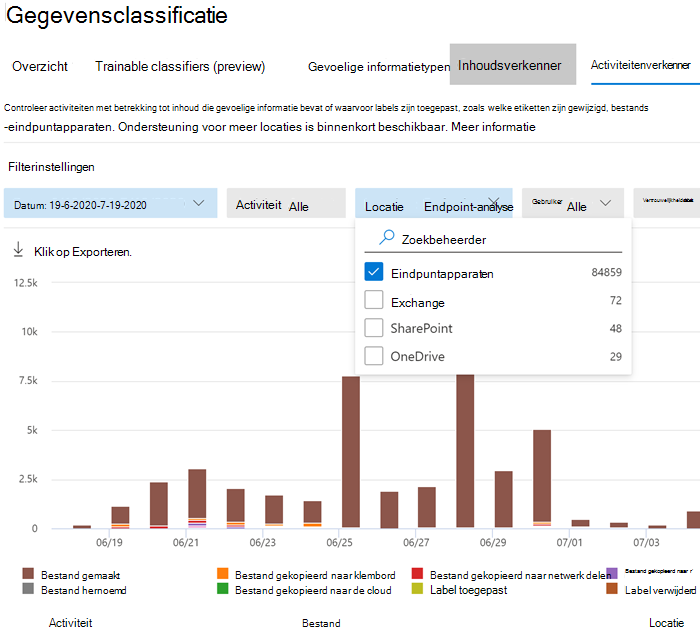

# <a name="get-started-with-microsoft-compliance-extension"></a><span data-ttu-id="1f55e-103">Aan de slag met de Microsoft compliance-extensie</span><span class="sxs-lookup"><span data-stu-id="1f55e-103">Get started with Microsoft Compliance Extension</span></span>

<span data-ttu-id="1f55e-104">Gebruik deze procedures om de Compliance-extensie van Microsoft uit te rollen.</span><span class="sxs-lookup"><span data-stu-id="1f55e-104">Use these procedures to roll out the Microsoft Compliance Extension.</span></span>

## <a name="before-you-begin"></a><span data-ttu-id="1f55e-105">Voordat u begint</span><span class="sxs-lookup"><span data-stu-id="1f55e-105">Before you begin</span></span>

<span data-ttu-id="1f55e-106">Als u de Compliance-extensie van Microsoft wilt gebruiken, moet het apparaat onboarded zijn in Endpoint DLP.</span><span class="sxs-lookup"><span data-stu-id="1f55e-106">To use Microsoft Compliance Extension, the device must be onboarded into endpoint DLP.</span></span> <span data-ttu-id="1f55e-107">Bekijk deze artikelen als u nog niet zo vertrouwd bent met DLP of Endpoint DLP</span><span class="sxs-lookup"><span data-stu-id="1f55e-107">Review these articles if you are new to DLP or endpoint DLP</span></span>

- [<span data-ttu-id="1f55e-108">Meer informatie over de Copliance-extensie van Microsoft</span><span class="sxs-lookup"><span data-stu-id="1f55e-108">Learn about Microsoft Compliance Extension</span></span>](dlp-chrome-learn-about.md)
- [<span data-ttu-id="1f55e-109">Meer informatie over preventie van gegevensverlies</span><span class="sxs-lookup"><span data-stu-id="1f55e-109">Learn about data loss prevention</span></span>](dlp-learn-about-dlp.md)
- [<span data-ttu-id="1f55e-110">Een DLP-beleid maken, testen en afstemmen</span><span class="sxs-lookup"><span data-stu-id="1f55e-110">Create, test, and tune a DLP policy</span></span>](create-test-tune-dlp-policy.md)
- [<span data-ttu-id="1f55e-111">Een DLP-beleid maken vanuit een sjabloon</span><span class="sxs-lookup"><span data-stu-id="1f55e-111">Create a DLP policy from a template</span></span>](create-a-dlp-policy-from-a-template.md)
- [<span data-ttu-id="1f55e-112">Meer informatie over preventie van gegevensverlies van eindpunten</span><span class="sxs-lookup"><span data-stu-id="1f55e-112">Learn about endpoint data loss prevention</span></span>](endpoint-dlp-learn-about.md)
- [<span data-ttu-id="1f55e-113">Aan de slag met preventie van gegevensverlies van eindpunten</span><span class="sxs-lookup"><span data-stu-id="1f55e-113">Get started with Endpoint data loss prevention</span></span>](endpoint-dlp-getting-started.md)
- [<span data-ttu-id="1f55e-114">Hulpprogramma’s en methoden voor onboarding voor Windows 10-apparaten</span><span class="sxs-lookup"><span data-stu-id="1f55e-114">Onboarding tools and methods for Windows 10 devices</span></span>](dlp-configure-endpoints.md)
- [<span data-ttu-id="1f55e-115">Apparaat-proxy en instellingen voor internetverbinding voor Endpoint DLP configureren.</span><span class="sxs-lookup"><span data-stu-id="1f55e-115">Configure device proxy and internet connection settings for Endpoint DLP</span></span>](endpoint-dlp-configure-proxy.md)
- [<span data-ttu-id="1f55e-116">Preventie van gegevensverlies van eindpunten gebruiken</span><span class="sxs-lookup"><span data-stu-id="1f55e-116">Using Endpoint data loss prevention</span></span>](endpoint-dlp-using.md)

### <a name="skusubscriptions-licensing"></a><span data-ttu-id="1f55e-117">SKU/abonnementenlicenties</span><span class="sxs-lookup"><span data-stu-id="1f55e-117">SKU/subscriptions licensing</span></span>

<span data-ttu-id="1f55e-118">Voordat u aan de slag gaat, moet u uw [abonnement op Microsoft 365](https://www.microsoft.com/microsoft-365/compare-microsoft-365-enterprise-plans?rtc=1) en eventuele invoegtoepassingen bevestigen.</span><span class="sxs-lookup"><span data-stu-id="1f55e-118">Before you get started, you should confirm your [Microsoft 365 subscription](https://www.microsoft.com/microsoft-365/compare-microsoft-365-enterprise-plans?rtc=1) and any add-ons.</span></span> <span data-ttu-id="1f55e-119">Als u DLP-functionaliteit voor eindpunten wilt openen en gebruiken, moet u een van deze abonnementen of invoegtoepassingen hebben.</span><span class="sxs-lookup"><span data-stu-id="1f55e-119">To access and use Endpoint DLP functionality, you must have one of these subscriptions or add-ons.</span></span>

- <span data-ttu-id="1f55e-120">Microsoft 365 E5</span><span class="sxs-lookup"><span data-stu-id="1f55e-120">Microsoft 365 E5</span></span>
- <span data-ttu-id="1f55e-121">Microsoft 365 A5 (EDU)</span><span class="sxs-lookup"><span data-stu-id="1f55e-121">Microsoft 365 A5 (EDU)</span></span>
- <span data-ttu-id="1f55e-122">Microsoft 365 E5 Compliance</span><span class="sxs-lookup"><span data-stu-id="1f55e-122">Microsoft 365 E5 compliance</span></span>
- <span data-ttu-id="1f55e-123">Microsoft 365 A5 Compliance</span><span class="sxs-lookup"><span data-stu-id="1f55e-123">Microsoft 365 A5 compliance</span></span>
- <span data-ttu-id="1f55e-124">Microsoft 365 E5 Information Protection en governance</span><span class="sxs-lookup"><span data-stu-id="1f55e-124">Microsoft 365 E5 information protection and governance</span></span>
- <span data-ttu-id="1f55e-125">Microsoft 365 A5 Information Protection en governance</span><span class="sxs-lookup"><span data-stu-id="1f55e-125">Microsoft 365 A5 information protection and governance</span></span>

<span data-ttu-id="1f55e-126">Zie voor gedetailleerde licentie-richtlijnen [Microsoft 365-licentie guidance for security & compliance](/office365/servicedescriptions/microsoft-365-service-descriptions/microsoft-365-tenantlevel-services-licensing-guidance/microsoft-365-security-compliance-licensing-guidance#information-protection).</span><span class="sxs-lookup"><span data-stu-id="1f55e-126">For detailed licensing guidance, see [Microsoft 365 licensing guidance for security & compliance](/office365/servicedescriptions/microsoft-365-service-descriptions/microsoft-365-tenantlevel-services-licensing-guidance/microsoft-365-security-compliance-licensing-guidance#information-protection).</span></span>

- <span data-ttu-id="1f55e-127">Uw organisatie moet een licentie hebben voor Eindpunt-DLP</span><span class="sxs-lookup"><span data-stu-id="1f55e-127">Your org must be licensed for Endpoint DLP</span></span>
- <span data-ttu-id="1f55e-128">Uw apparaten moeten Windows 10 x64 build 1809 of hoger hebben.</span><span class="sxs-lookup"><span data-stu-id="1f55e-128">Your devices must be running Windows 10 x64 build 1809 or later.</span></span>
- <span data-ttu-id="1f55e-129">Het apparaat moet de Antimalware-clientversie 4.18.2101.9 of hoger hebben.</span><span class="sxs-lookup"><span data-stu-id="1f55e-129">The device must have Antimalware Client Version is 4.18.2101.9 or later.</span></span> <span data-ttu-id="1f55e-130">Controleer uw huidige versie door de **Windows-beveiligingsapp** te openen, selecteer het pictogram **Instellingen** en selecteer vervolgens **Info**.</span><span class="sxs-lookup"><span data-stu-id="1f55e-130">Check your current version by opening **Windows Security** app, select the **Settings** icon, and then select **About**.</span></span>


### <a name="permissions"></a><span data-ttu-id="1f55e-131">Machtigingen</span><span class="sxs-lookup"><span data-stu-id="1f55e-131">Permissions</span></span>

<span data-ttu-id="1f55e-132">Gegevens uit DLP voor eindpunten kunnen worden weergegeven in [Activiteitenverkenner](data-classification-activity-explorer.md).</span><span class="sxs-lookup"><span data-stu-id="1f55e-132">Data from Endpoint DLP can be viewed in [Activity explorer](data-classification-activity-explorer.md).</span></span> <span data-ttu-id="1f55e-133">Er zijn zeven rollen die machtigingen verlenen aan Activiteitenverkenner. Het account dat u gebruikt voor het openen van de gegevens, moet lid zijn van een van deze rollen.</span><span class="sxs-lookup"><span data-stu-id="1f55e-133">There are seven roles that grant permission to activity explorer, the account you use for accessing the data must be a member of any one of them.</span></span>

- <span data-ttu-id="1f55e-134">Algemeen beheerder</span><span class="sxs-lookup"><span data-stu-id="1f55e-134">Global admin</span></span>
- <span data-ttu-id="1f55e-135">Beheerder voor naleving</span><span class="sxs-lookup"><span data-stu-id="1f55e-135">Compliance admin</span></span>
- <span data-ttu-id="1f55e-136">Beveiligingsbeheerder</span><span class="sxs-lookup"><span data-stu-id="1f55e-136">Security admin</span></span>
- <span data-ttu-id="1f55e-137">Gegevensbeheerder voor naleving</span><span class="sxs-lookup"><span data-stu-id="1f55e-137">Compliance data admin</span></span>
- <span data-ttu-id="1f55e-138">Globale lezer</span><span class="sxs-lookup"><span data-stu-id="1f55e-138">Global reader</span></span>
- <span data-ttu-id="1f55e-139">Beveiligingslezer</span><span class="sxs-lookup"><span data-stu-id="1f55e-139">Security reader</span></span>
- <span data-ttu-id="1f55e-140">Rapportenlezer</span><span class="sxs-lookup"><span data-stu-id="1f55e-140">Reports reader</span></span>

### <a name="overall-installation-workflow"></a><span data-ttu-id="1f55e-141">Algemene installatiewerkstroom</span><span class="sxs-lookup"><span data-stu-id="1f55e-141">Overall installation workflow</span></span>

<span data-ttu-id="1f55e-p105">Het implementeren van de Microsoft compliance-extension is een proces dat uit meerdere fasen bestaat. U kunt ervoor kiezen om op één computer tegelijk te installeren of gebruik Microsoft Endpoint Manager of groepsbeleid voor implementaties binnen de hele organisatie.</span><span class="sxs-lookup"><span data-stu-id="1f55e-p105">Deploying Microsoft Compliance Extension is a multi-phase process. You can choose to install on one machine at a time, or use Microsoft Endpoint Manager or Group Policy for organization-wide deployments.</span></span>

1. <span data-ttu-id="1f55e-144">[Bereid uw apparaten voor](#prepare-your-devices).</span><span class="sxs-lookup"><span data-stu-id="1f55e-144">[Prepare your devices](#prepare-your-devices).</span></span>
2. [<span data-ttu-id="1f55e-145">Basic Setup Single Machine Selfhost</span><span class="sxs-lookup"><span data-stu-id="1f55e-145">Basic Setup Single Machine Selfhost</span></span>](#basic-setup-single-machine-selfhost)
3. [<span data-ttu-id="1f55e-146">Implementatie met behulp van Microsoft Endpoint Manager</span><span class="sxs-lookup"><span data-stu-id="1f55e-146">Deploy using Microsoft Endpoint Manager</span></span>](#deploy-using-microsoft-endpoint-manager)
4. [<span data-ttu-id="1f55e-147">Implementeren met behulp van groepsbeleid</span><span class="sxs-lookup"><span data-stu-id="1f55e-147">Deploy using Group Policy</span></span>](#deploy-using-group-policy)
5. [<span data-ttu-id="1f55e-148">De extensie uitproberen</span><span class="sxs-lookup"><span data-stu-id="1f55e-148">Test the Extension</span></span>](#test-the-extension)
6. [<span data-ttu-id="1f55e-149">Het dashboard Waarschuwingenbeheer gebruiken om DLP-waarschuwingen in Chrome weer te geven</span><span class="sxs-lookup"><span data-stu-id="1f55e-149">Use the Alerts Management Dashboard to viewing Chrome DLP alerts</span></span>](#use-the-alerts-management-dashboard-to-viewing-chrome-dlp-alerts)
7. [<span data-ttu-id="1f55e-150">Chrome DLP-gegevens weergeven in Activiteitenverkenner</span><span class="sxs-lookup"><span data-stu-id="1f55e-150">Viewing Chrome DLP data in activity explorer</span></span>](#viewing-chrome-dlp-data-in-activity-explorer)

### <a name="prepare-infrastructure"></a><span data-ttu-id="1f55e-151">Infrastructuur voorbereiden</span><span class="sxs-lookup"><span data-stu-id="1f55e-151">Prepare infrastructure</span></span>

<span data-ttu-id="1f55e-152">Als u de Microsoft-nalevingsextensie uitrolt naar al uw bewaakte Windows 10-apparaten, moet u Google Chrome verwijderen uit de lijst met niet-verschuldigde apps en niet-verschuldigde browsers.</span><span class="sxs-lookup"><span data-stu-id="1f55e-152">If you are rolling out the Microsoft Compliance Extension to all your monitored Windows 10 devices, you should remove Google Chrome from the unallowed app and unallowed browser lists.</span></span> <span data-ttu-id="1f55e-153">Zie voor meer informatie [Niet-verschuldigde browsers](endpoint-dlp-using.md#unallowed-browsers).</span><span class="sxs-lookup"><span data-stu-id="1f55e-153">For more information, see [Unallowed browsers](endpoint-dlp-using.md#unallowed-browsers).</span></span> <span data-ttu-id="1f55e-154">Als u de toepassing slechts op enkele apparaten uitrolt, kunt u Chrome op de lijst met niet-verschuldigde browsers of niet-verschuldigde apps laten staan.</span><span class="sxs-lookup"><span data-stu-id="1f55e-154">If you are only rolling it out to a few devices, you can leave Chrome on the unallowed browser or unallowed app lists.</span></span> <span data-ttu-id="1f55e-155">De Nalevingsextensie van Microsoft slaat de beperkingen over van beide lijsten voor de computers waarop de lijst is geïnstalleerd.</span><span class="sxs-lookup"><span data-stu-id="1f55e-155">The Microsoft Compliance Extension will bypass the restrictions of both lists for those computers where it is installed.</span></span>

### <a name="prepare-your-devices"></a><span data-ttu-id="1f55e-156">Uw apparaten voorbereiden</span><span class="sxs-lookup"><span data-stu-id="1f55e-156">Prepare your devices</span></span>

1. <span data-ttu-id="1f55e-157">Gebruik de procedures in deze onderwerpen om uw apparaten in te werken:</span><span class="sxs-lookup"><span data-stu-id="1f55e-157">Use the procedures in these topics to onboard your devices:</span></span>
    1. [<span data-ttu-id="1f55e-158">Aan de slag met preventie van gegevensverlies van eindpunten</span><span class="sxs-lookup"><span data-stu-id="1f55e-158">Get started with Endpoint data loss prevention</span></span>](endpoint-dlp-getting-started.md)
    1. [<span data-ttu-id="1f55e-159">Hulpprogramma’s en methoden voor onboarding voor Windows 10-apparaten</span><span class="sxs-lookup"><span data-stu-id="1f55e-159">Onboarding tools and methods for Windows 10 devices</span></span>](dlp-configure-endpoints.md)
    1. [<span data-ttu-id="1f55e-160">Apparaat-proxy en instellingen voor internetverbinding voor Endpoint DLP configureren.</span><span class="sxs-lookup"><span data-stu-id="1f55e-160">Configure device proxy and internet connection settings for Endpoint DLP</span></span>](endpoint-dlp-configure-proxy.md)

### <a name="basic-setup-single-machine-selfhost"></a><span data-ttu-id="1f55e-161">Basic Setup Single Machine Selfhost</span><span class="sxs-lookup"><span data-stu-id="1f55e-161">Basic Setup Single Machine Selfhost</span></span>

<span data-ttu-id="1f55e-162">Dit is de aanbevolen methode.</span><span class="sxs-lookup"><span data-stu-id="1f55e-162">This is the recommended method.</span></span>

1. <span data-ttu-id="1f55e-163">Meld u aan bij de Windows 10-computer waarop u de Microsoft Compliance-extensie wilt installeren en voer dit PowerShell-script als beheerder uit.</span><span class="sxs-lookup"><span data-stu-id="1f55e-163">Sign in to the Windows 10 computer on which you want to install the Microsoft Compliance Extension on, and run this PowerShell script as an administrator.</span></span>

   ```powershell
   Get-Item -path "HKLM:\SOFTWARE\Microsoft\Windows Defender\Miscellaneous Configuration" | New-ItemProperty -Name DlpDisableBrowserCache -Value 0 -Force
   ```

2. <span data-ttu-id="1f55e-164">Ga naar [Microsoft Compliance-extensie - Chrome Web Store (google.com)](https://chrome.google.com/webstore/detail/microsoft-compliance-exte/echcggldkblhodogklpincgchnpgcdco).</span><span class="sxs-lookup"><span data-stu-id="1f55e-164">Navigate to [Microsoft Compliance Extension - Chrome Web Store (google.com)](https://chrome.google.com/webstore/detail/microsoft-compliance-exte/echcggldkblhodogklpincgchnpgcdco).</span></span>

3. <span data-ttu-id="1f55e-165">Installeer de extensie aan de hand van de instructies op de pagina Chrome Web Store.</span><span class="sxs-lookup"><span data-stu-id="1f55e-165">Install the extension using the instructions on the Chrome Web Store page.</span></span>

### <a name="deploy-using-microsoft-endpoint-manager"></a><span data-ttu-id="1f55e-166">Implementeren met behulp van Microsoft Endpoint Manager</span><span class="sxs-lookup"><span data-stu-id="1f55e-166">Deploy using Microsoft Endpoint Manager</span></span>

<span data-ttu-id="1f55e-167">Gebruik deze instellingsmethode voor implementaties voor de hele organisatie.</span><span class="sxs-lookup"><span data-stu-id="1f55e-167">Use this setup method for organization-wide deployments.</span></span>

##### <a name="enabling-required-registry-key-via-microsoft-endpoint-manager"></a><span data-ttu-id="1f55e-168">Vereiste registersleutel inschakelen via Microsoft Endpoint Manager</span><span class="sxs-lookup"><span data-stu-id="1f55e-168">Enabling Required Registry Key via Microsoft Endpoint Manager</span></span>

1. <span data-ttu-id="1f55e-169">Maak een PowerShell-script met de volgende inhoud:</span><span class="sxs-lookup"><span data-stu-id="1f55e-169">Create a PowerShell script with the following contents:</span></span>

    ```powershell
    Get-Item -path "HKLM:\SOFTWARE\Microsoft\Windows Defender\Miscellaneous Configuration" | New-ItemProperty -Name DlpDisableBrowserCache -Value 0 -Force
    ```

2. <span data-ttu-id="1f55e-170">Meld u aan bij het [beheercentrum voor Microsoft Eindpuntbeheer](https://endpoint.microsoft.com).</span><span class="sxs-lookup"><span data-stu-id="1f55e-170">Sign in to the [Microsoft Endpoint Manager Admin Center](https://endpoint.microsoft.com).</span></span>

3. <span data-ttu-id="1f55e-171">Ga naar **Apparaten** > **Scripts** en selecteer **Toevoegen**.</span><span class="sxs-lookup"><span data-stu-id="1f55e-171">Navigate to **Devices** > **Scripts** and select **Add**.</span></span>

4. <span data-ttu-id="1f55e-172">Blader naar de locatie van het script dat is gemaakt wanneer hier om wordt gevraagd.</span><span class="sxs-lookup"><span data-stu-id="1f55e-172">Browse to the location of the script created when prompted.</span></span>

5. <span data-ttu-id="1f55e-173">Selecteer de volgende instellingen:</span><span class="sxs-lookup"><span data-stu-id="1f55e-173">Select the following settings:</span></span>
    1. <span data-ttu-id="1f55e-174">Voer dit script uit met de aanmeldingsreferenties: JA</span><span class="sxs-lookup"><span data-stu-id="1f55e-174">Run this script using the logged-on credentials: YES</span></span>
    1. <span data-ttu-id="1f55e-175">Controle van scripthandtekening afdwingen: NEE</span><span class="sxs-lookup"><span data-stu-id="1f55e-175">Enforce script signature check: NO</span></span>
    1. <span data-ttu-id="1f55e-176">Voer het script uit in de 64-bits PowerShell-host: JA</span><span class="sxs-lookup"><span data-stu-id="1f55e-176">Run script in 64-bit PowerShell Host: YES</span></span>

6. <span data-ttu-id="1f55e-177">Selecteer de juiste apparaatgroepen en pas het beleid toe.</span><span class="sxs-lookup"><span data-stu-id="1f55e-177">Select the proper device groups and apply the policy.</span></span>

#### <a name="microsoft-endpoint-manager-force-install-steps"></a><span data-ttu-id="1f55e-178">Installatiestappen voor Microsoft Endpoint Manager Force</span><span class="sxs-lookup"><span data-stu-id="1f55e-178">Microsoft Endpoint Manager Force Install Steps</span></span>

<span data-ttu-id="1f55e-179">Voordat u de Microsoft Compliance-extensie toevoegt aan de lijst met geforceer geïnstalleerde extensies, is het belangrijk om de Chrome ADMX op te nemen.</span><span class="sxs-lookup"><span data-stu-id="1f55e-179">Before adding the Microsoft Compliance Extension to the list of force-installed extensions, it is important to ingest the Chrome ADMX.</span></span> <span data-ttu-id="1f55e-180">Stappen voor dit proces in Microsoft Eindpuntbeheer worden beschreven door Google: [Chrome-browser beheren met Microsoft Intune - Help voor Google Chrome Enterprise](https://support.google.com/chrome/a/answer/9102677?hl=en#zippy=%2Cstep-ingest-the-chrome-admx-file-into-intune).</span><span class="sxs-lookup"><span data-stu-id="1f55e-180">Steps for this process in Microsoft Endpoint Manager are documented by Google: [Manage Chrome Browser with Microsoft Intune - Google Chrome Enterprise Help](https://support.google.com/chrome/a/answer/9102677?hl=en#zippy=%2Cstep-ingest-the-chrome-admx-file-into-intune).</span></span>

 <span data-ttu-id="1f55e-181">Nadat u het ADMX-account hebt gebruikt, kunt u de onderstaande stappen volgen om een configuratieprofiel voor deze extensie te maken.</span><span class="sxs-lookup"><span data-stu-id="1f55e-181">After ingesting the ADMX, the steps below can be followed to create a configuration profile for this extension.</span></span>

1. <span data-ttu-id="1f55e-182">Meld u aan bij het Beheercentrum van Microsoft Endpoint Manager (https://endpoint.microsoft.com).</span><span class="sxs-lookup"><span data-stu-id="1f55e-182">Sign in to the Microsoft Endpoint Manager Admin Center (https://endpoint.microsoft.com).</span></span>

2. <span data-ttu-id="1f55e-183">Ga naar Configuratieprofielen.</span><span class="sxs-lookup"><span data-stu-id="1f55e-183">Navigate to Configuration Profiles.</span></span>

3. <span data-ttu-id="1f55e-184">Selecteer **Profiel maken**.</span><span class="sxs-lookup"><span data-stu-id="1f55e-184">Select **Create Profile**.</span></span>

4. <span data-ttu-id="1f55e-185">Selecteer **Windows 10** als platform.</span><span class="sxs-lookup"><span data-stu-id="1f55e-185">Select **Windows 10** as the platform.</span></span>

5. <span data-ttu-id="1f55e-186">Selecteer **Aangepast** als profieltype.</span><span class="sxs-lookup"><span data-stu-id="1f55e-186">Select **Custom** as profile type.</span></span>

6. <span data-ttu-id="1f55e-187">Selecteer het tabblad **Instellingen**.</span><span class="sxs-lookup"><span data-stu-id="1f55e-187">Select the **Settings** tab.</span></span>

7. <span data-ttu-id="1f55e-188">Kies **Toevoegen**.</span><span class="sxs-lookup"><span data-stu-id="1f55e-188">Select **Add**.</span></span>

8. <span data-ttu-id="1f55e-189">Geef de volgende gegevens op.</span><span class="sxs-lookup"><span data-stu-id="1f55e-189">Enter the following policy information.</span></span>

    <span data-ttu-id="1f55e-190">OMA-URI: `./Device/Vendor/MSFT/Policy/Config/Chrome~Policy~googlechrome~Extensions/ExtensionInstallForcelist`</span><span class="sxs-lookup"><span data-stu-id="1f55e-190">OMA-URI: `./Device/Vendor/MSFT/Policy/Config/Chrome~Policy~googlechrome~Extensions/ExtensionInstallForcelist`</span></span><br/>
    <span data-ttu-id="1f55e-191">Gegevenstype: `String`</span><span class="sxs-lookup"><span data-stu-id="1f55e-191">Data type: `String`</span></span><br/>
    <span data-ttu-id="1f55e-192">Waarde: `<enabled/><data id="ExtensionInstallForcelistDesc" value="1&#xF000; echcggldkblhodogklpincgchnpgcdco;https://clients2.google.com/service/update2/crx"/>`</span><span class="sxs-lookup"><span data-stu-id="1f55e-192">Value: `<enabled/><data id="ExtensionInstallForcelistDesc" value="1&#xF000; echcggldkblhodogklpincgchnpgcdco;https://clients2.google.com/service/update2/crx"/>`</span></span>

9. <span data-ttu-id="1f55e-193">Klik op maken.</span><span class="sxs-lookup"><span data-stu-id="1f55e-193">Click create.</span></span>

### <a name="deploy-using-group-policy"></a><span data-ttu-id="1f55e-194">Implementeren met behulp van groepsbeleid</span><span class="sxs-lookup"><span data-stu-id="1f55e-194">Deploy using Group Policy</span></span>

<span data-ttu-id="1f55e-195">Als u Microsoft Endpoint Manager niet wilt gebruiken, kunt u groepsbeleid gebruiken om de Microsoft-nalevingsextensie in uw organisatie te implementeren</span><span class="sxs-lookup"><span data-stu-id="1f55e-195">If you don't want to use Microsoft Endpoint Manager, you can use group policies to deploy the Microsoft Compliance Extension across your organization</span></span>

1. <span data-ttu-id="1f55e-196">Uw apparaten moeten kunnen worden beheerbaar via groepsbeleid en u moet alle Chrome ADMX's importeren in de centrale opslag voor groepsbeleid.</span><span class="sxs-lookup"><span data-stu-id="1f55e-196">Your devices must be manageable via Group Policy, and you need to import all Chrome ADMXs into the Group Policy Central Store.</span></span> <span data-ttu-id="1f55e-197">Zie voor meer informatie [het Centraal beheerbeleid in Windows](/troubleshoot/windows-client/group-policy/create-and-manage-central-store).</span><span class="sxs-lookup"><span data-stu-id="1f55e-197">For more information, see [How to create and manage the Central Store for Group Policy Administrative Templates in Windows](/troubleshoot/windows-client/group-policy/create-and-manage-central-store).</span></span>

2. <span data-ttu-id="1f55e-198">Maak een PowerShell-script met deze PowerShell-opdracht:</span><span class="sxs-lookup"><span data-stu-id="1f55e-198">Create a PowerShell script using this PowerShell command:</span></span>

    ```powershell
    Get-Item -path "HKLM:\SOFTWARE\Microsoft\Windows Defender\Miscellaneous Configuration" | New-ItemProperty -Name DlpDisableBrowserCache -Value 0 -Force
    ```

3. <span data-ttu-id="1f55e-199">Open de **console voor groepsbeleidsbeheer** naar uw organisatie-eenheid (OU).</span><span class="sxs-lookup"><span data-stu-id="1f55e-199">Open the **Group Policy Management Console** and navigate to your organizational unit (OU).</span></span>

4. <span data-ttu-id="1f55e-200">Klik met de rechtermuisknop en selecteer **GPO in dit domein maken en koppel deze hier**.</span><span class="sxs-lookup"><span data-stu-id="1f55e-200">Right-click and select **Create a GPO in this domain and Link it here**.</span></span> <span data-ttu-id="1f55e-201">Wanneer hier om wordt gevraagd, wijst u een beschrijvende naam toe aan dit groepsbeleidsobject en maakt u het maken van het object af.</span><span class="sxs-lookup"><span data-stu-id="1f55e-201">When prompted, assign a descriptive name to this group policy object (GPO) and finish creating it.</span></span>

5. <span data-ttu-id="1f55e-202">Klik met de rechtermuisknop op de GPO en selecteer **Bewerken**.</span><span class="sxs-lookup"><span data-stu-id="1f55e-202">Right-click the GPO and select **Edit**.</span></span>

6. <span data-ttu-id="1f55e-203">Ga naar **Configuratie van computer** > **Voorkeuren** > **Instellingen van het Configuratiescherm** > **Geplande taken**.</span><span class="sxs-lookup"><span data-stu-id="1f55e-203">Go to **Computer Configuration** > **Preferences** > **Control Panel Settings** > **Scheduled Tasks**.</span></span>

7. <span data-ttu-id="1f55e-204">Maak een nieuwe directe taak door met de rechtermuisknop te klikken en **Nieuwe taak** > **(ten minste Windows 7)**.</span><span class="sxs-lookup"><span data-stu-id="1f55e-204">Create a new immediate task by selecting right-clicking and selecting **New** > **Immediate Task (At least Windows 7)**.</span></span>

8. <span data-ttu-id="1f55e-205">Geef een naam en beschrijving op voor de taak.</span><span class="sxs-lookup"><span data-stu-id="1f55e-205">Give the task a name & description.</span></span>

9. <span data-ttu-id="1f55e-206">Kies het bijbehorende account om de directe taak uit te voeren, bijvoorbeeld NT Authority</span><span class="sxs-lookup"><span data-stu-id="1f55e-206">Choose the corresponding account to run the immediate task, for example NT Authority</span></span>

10. <span data-ttu-id="1f55e-207">Selecteer **Uitvoeren met de hoogste bevoegdheden**.</span><span class="sxs-lookup"><span data-stu-id="1f55e-207">Select **Run with highest privileges**.</span></span>

11. <span data-ttu-id="1f55e-208">Configureer het beleid voor Windows 10.</span><span class="sxs-lookup"><span data-stu-id="1f55e-208">Configure the policy for Windows 10.</span></span>

12. <span data-ttu-id="1f55e-209">Selecteer op het tabblad **Acties** de actie **Een programma starten**.</span><span class="sxs-lookup"><span data-stu-id="1f55e-209">In the **Actions** tab, select the action **Start a program**.</span></span>

13. <span data-ttu-id="1f55e-210">Voer het pad in naar het programma/script dat is gemaakt in stap 1.</span><span class="sxs-lookup"><span data-stu-id="1f55e-210">Enter the path to the Program/Script created in Step 1.</span></span>

14. <span data-ttu-id="1f55e-211">Selecteer **Toepassen**.</span><span class="sxs-lookup"><span data-stu-id="1f55e-211">Select **Apply**.</span></span>

#### <a name="adding-the-chrome-extension-to-the-forceinstall-list"></a><span data-ttu-id="1f55e-212">De Chrome-extensie toevoegen aan de lijst Geforceerd installeren</span><span class="sxs-lookup"><span data-stu-id="1f55e-212">Adding the Chrome Extension to the ForceInstall List</span></span>

1. <span data-ttu-id="1f55e-213">Ga in de groepsbeleidsbeheereditor naar uw OU.</span><span class="sxs-lookup"><span data-stu-id="1f55e-213">In the Group Policy Management Editor, navigate to your OU.</span></span>

2. <span data-ttu-id="1f55e-214">Vouw het volgende pad uit: **Configuratie van computer/gebruiker** > **Beleid** > **Beheersjablonen** > **Klassieke beheersjablonen** > **Google** > **Google Chrome** > **Extensies**.</span><span class="sxs-lookup"><span data-stu-id="1f55e-214">Expand the following path **Computer/User configuration** > **Policies** > **Administrative templates** > **Classic administrative templates** > **Google** > **Google Chrome** > **Extensions**.</span></span> <span data-ttu-id="1f55e-215">Dit pad kan variëren, afhankelijk van uw configuratie.</span><span class="sxs-lookup"><span data-stu-id="1f55e-215">This path may vary depending on your configuration.</span></span>

3. <span data-ttu-id="1f55e-216">Selecteer **De lijst met geforceerde geïnstalleerde extensies**.</span><span class="sxs-lookup"><span data-stu-id="1f55e-216">Select **Configure the list of force-installed extensions**.</span></span>

4. <span data-ttu-id="1f55e-217">Klik met de rechtermuisknop en **Bewerken**.</span><span class="sxs-lookup"><span data-stu-id="1f55e-217">Right click and select **Edit**.</span></span>

5. <span data-ttu-id="1f55e-218">Selecteer **Ingeschakeld**.</span><span class="sxs-lookup"><span data-stu-id="1f55e-218">Select **Enabled**.</span></span>

6. <span data-ttu-id="1f55e-219">Selecteer **Weergeven**.</span><span class="sxs-lookup"><span data-stu-id="1f55e-219">Select **Show**.</span></span>

7. <span data-ttu-id="1f55e-220">Voeg bij **Waarde** de volgende vermelding toe: `echcggldkblhodogklpincgchnpgcdco;https://clients2.google.com/service/update2/crx`</span><span class="sxs-lookup"><span data-stu-id="1f55e-220">Under **Value**, add the following entry: `echcggldkblhodogklpincgchnpgcdco;https://clients2.google.com/service/update2/crx`</span></span>

8. <span data-ttu-id="1f55e-221">Selecteer **OK** klik vervolgens **Toepassen**.</span><span class="sxs-lookup"><span data-stu-id="1f55e-221">Select **OK** and then **Apply**.</span></span>

### <a name="test-the-extension"></a><span data-ttu-id="1f55e-222">De extensie testen</span><span class="sxs-lookup"><span data-stu-id="1f55e-222">Test the Extension</span></span>

#### <a name="upload-to-cloud-service-or-access-by-unallowed-browsers-cloud-egress"></a><span data-ttu-id="1f55e-223">Naar cloudservice uploaden of openen via niet-toegestane browsers</span><span class="sxs-lookup"><span data-stu-id="1f55e-223">Upload to cloud service, or access by unallowed browsers Cloud Egress</span></span>

1. <span data-ttu-id="1f55e-224">Maak of haal een gevoelig item op en probeer een bestand te uploaden naar een van de beperkte servicedomeinen van uw organisatie.</span><span class="sxs-lookup"><span data-stu-id="1f55e-224">Create or get a sensitive item and, try to upload a file to one of your organization’s restricted service domains.</span></span> <span data-ttu-id="1f55e-225">De gevoelige gegevens moeten overeenkomen met een van onze ingebouwde [Gevoelige informatietypen](sensitive-information-type-entity-definitions.md), of een van de typen gevoelige informatie van uw organisatie.</span><span class="sxs-lookup"><span data-stu-id="1f55e-225">The sensitive data must match one of our built-in [Sensitive Info Types](sensitive-information-type-entity-definitions.md), or one of your organization’s sensitive information types.</span></span> <span data-ttu-id="1f55e-226">U ontvangt een DLP-pop-upmelding op het apparaat van waaruit u test dat deze actie niet is toegestaan wanneer het bestand is geopend.</span><span class="sxs-lookup"><span data-stu-id="1f55e-226">You should get a DLP toast notification on the device you are testing from that shows that this action is not allowed when the file is open.</span></span>

#### <a name="testing-other-dlp-scenarios-in-chrome"></a><span data-ttu-id="1f55e-227">Andere DLP-scenario's testen in Chrome</span><span class="sxs-lookup"><span data-stu-id="1f55e-227">Testing other DLP scenarios in Chrome</span></span>

<span data-ttu-id="1f55e-228">Nu u Chrome hebt verwijderd uit de lijst met niet-toegeziene browsers/apps, kunt u de onderstaande scenario's testen om te controleren of het gedrag voldoet aan de vereisten van uw organisatie:</span><span class="sxs-lookup"><span data-stu-id="1f55e-228">Now that you’ve removed Chrome from the disallowed browsers/apps list, you can test the scenarios below to confirm the behavior meets your organization’s requirements:</span></span>

- <span data-ttu-id="1f55e-229">Gegevens van een gevoelig item naar een ander document kopiëren met het Klembord</span><span class="sxs-lookup"><span data-stu-id="1f55e-229">Copy data from a sensitive item to another document using the Clipboard</span></span>
  - <span data-ttu-id="1f55e-230">Als u wilt testen, opent u in de Chrome-browser een bestand dat is beveiligd tegen kopiëren naar het Klembord en probeert u gegevens uit het bestand te kopiëren.</span><span class="sxs-lookup"><span data-stu-id="1f55e-230">To test, open a file that is protected against copy to clipboard actions in the Chrome browser and attempt to copy data from the file.</span></span>
  - <span data-ttu-id="1f55e-231">Verwacht resultaat: een DLP-pop-upmelding waarin wordt getoond dat deze actie niet is toegestaan wanneer het bestand is geopend.</span><span class="sxs-lookup"><span data-stu-id="1f55e-231">Expected Result: A DLP toast notification showing that this action is not allowed when the file is open.</span></span>
- <span data-ttu-id="1f55e-232">Een document afdrukken</span><span class="sxs-lookup"><span data-stu-id="1f55e-232">Print a document</span></span>
  - <span data-ttu-id="1f55e-233">Als u wilt testen, opent u een bestand dat is beveiligd tegen afdrukacties in de Chrome-browser en probeert u het bestand af te drukken.</span><span class="sxs-lookup"><span data-stu-id="1f55e-233">To test, open a file that is protected against print actions in the Chrome browser and attempt to print the file.</span></span>
  - <span data-ttu-id="1f55e-234">Verwacht resultaat: een DLP-pop-upmelding waarin wordt getoond dat deze actie niet is toegestaan wanneer het bestand is geopend.</span><span class="sxs-lookup"><span data-stu-id="1f55e-234">Expected Result: A DLP toast notification showing that this action is not allowed when the file is open.</span></span>
- <span data-ttu-id="1f55e-235">Kopiëren naar verwijderbare USB-media</span><span class="sxs-lookup"><span data-stu-id="1f55e-235">Copy to USB Removeable Media</span></span>
  - <span data-ttu-id="1f55e-236">Test het bestand door het bestand op te slaan in een verwijderbare mediaopslag.</span><span class="sxs-lookup"><span data-stu-id="1f55e-236">To test, try to save the file to a removeable media storage.</span></span>
  - <span data-ttu-id="1f55e-237">Verwacht resultaat: een DLP-pop-upmelding waarin wordt getoond dat deze actie niet is toegestaan wanneer het bestand is geopend.</span><span class="sxs-lookup"><span data-stu-id="1f55e-237">Expected Result: A DLP toast notification showing that this action is not allowed when the file is open.</span></span>
- <span data-ttu-id="1f55e-238">Kopiëren naar netwerkshare</span><span class="sxs-lookup"><span data-stu-id="1f55e-238">Copy to Network Share</span></span>
  - <span data-ttu-id="1f55e-239">Test het bestand door het bestand op te slaan in een netwerkshare.</span><span class="sxs-lookup"><span data-stu-id="1f55e-239">To test, try to save the file to a network share.</span></span>
  - <span data-ttu-id="1f55e-240">Verwacht resultaat: een DLP-pop-upmelding waarin wordt getoond dat deze actie niet is toegestaan wanneer het bestand is geopend.</span><span class="sxs-lookup"><span data-stu-id="1f55e-240">Expected Result: A DLP toast notification showing that this action is not allowed when the file is open.</span></span>

### <a name="use-the-alerts-management-dashboard-to-viewing-chrome-dlp-alerts"></a><span data-ttu-id="1f55e-241">Het dashboard Waarschuwingenbeheer gebruiken om DLP-waarschuwingen in Chrome weer te geven</span><span class="sxs-lookup"><span data-stu-id="1f55e-241">Use the Alerts Management Dashboard to viewing Chrome DLP alerts</span></span>

1. <span data-ttu-id="1f55e-242">Ga in het [Microsoft 365-compliancecentrum](https://compliance.microsoft.com)naar de **pagina Preventie van gegevensverlies** en kies **Waarschuwingen**.</span><span class="sxs-lookup"><span data-stu-id="1f55e-242">Open the **Data loss prevention** page in the [Microsoft 365 Compliance center](https://compliance.microsoft.com) and select **Alerts**.</span></span>

2. <span data-ttu-id="1f55e-243">Raadpleeg de procedures in [Informatie over het configureren en weergeven van waarschuwingen voor uw DLP-beleid](dlp-configure-view-alerts-policies.md) om waarschuwingen voor uw DLP-beleid voor eindpunten weer te geven.</span><span class="sxs-lookup"><span data-stu-id="1f55e-243">Refer to the procedures in [How to configure and view alerts for your DLP policies](dlp-configure-view-alerts-policies.md) to view alerts for your Endpoint DLP policies.</span></span>

### <a name="viewing-chrome-dlp-data-in-activity-explorer"></a><span data-ttu-id="1f55e-244">Chrome DLP-gegevens weergeven in Activiteitenverkenner</span><span class="sxs-lookup"><span data-stu-id="1f55e-244">Viewing Chrome DLP data in activity explorer</span></span>

1. <span data-ttu-id="1f55e-245">Open de [pagina Gegevensclassificatie voor](https://compliance.microsoft.com/dataclassification?viewid=overview) uw domein in het Microsoft 365-compliancecentrum en kies **Activiteitenverkenner**.</span><span class="sxs-lookup"><span data-stu-id="1f55e-245">Open the [Data classification page](https://compliance.microsoft.com/dataclassification?viewid=overview) for your domain in the Microsoft 365 Compliance center and choose **Activity explorer**.</span></span>

2. <span data-ttu-id="1f55e-246">Raadpleeg de procedures in [Aan de slag met Activiteitenverkenner](data-classification-activity-explorer.md) om alle gegevens voor uw eindpuntapparaten weer te geven en te filteren.</span><span class="sxs-lookup"><span data-stu-id="1f55e-246">Refer to the procedures in [Get started with Activity explorer](data-classification-activity-explorer.md) to access and filter all the data for your Endpoint devices.</span></span>

   > [!div class="mx-imgBorder"]
   > <span data-ttu-id="1f55e-247"></span><span class="sxs-lookup"><span data-stu-id="1f55e-247"></span></span>

### <a name="known-issues-and-limitations"></a><span data-ttu-id="1f55e-248">Bekende problemen en beperkingen</span><span class="sxs-lookup"><span data-stu-id="1f55e-248">Known Issues and Limitations</span></span>

1. <span data-ttu-id="1f55e-249">Afdwingen van overschrijven blokkeren voor cloud-uitgang wordt niet ondersteund.</span><span class="sxs-lookup"><span data-stu-id="1f55e-249">Block Override enforcement for cloud egress is not supported.</span></span>
2. <span data-ttu-id="1f55e-250">De incognitomodus wordt niet ondersteund en moet worden uitgeschakeld.</span><span class="sxs-lookup"><span data-stu-id="1f55e-250">Incognito mode is not supported and must be disabled.</span></span>

## <a name="next-steps"></a><span data-ttu-id="1f55e-251">Volgende stappen</span><span class="sxs-lookup"><span data-stu-id="1f55e-251">Next steps</span></span>

<span data-ttu-id="1f55e-252">Nu u onboarded-apparaten hebt en de activiteitsgegevens kunt bekijken in Activiteitenverkenner, kunt u verder gaan met de volgende stap, waarin u DLP-beleid maakt voor het beveiligen van uw gevoelige items.</span><span class="sxs-lookup"><span data-stu-id="1f55e-252">Now that you have onboarded devices and can view the activity data in Activity explorer, you are ready to move on to your next step where you create DLP policies that protect your sensitive items.</span></span>

- [<span data-ttu-id="1f55e-253">Preventie van gegevensverlies voor eindpunten gebruiken</span><span class="sxs-lookup"><span data-stu-id="1f55e-253">Using Endpoint data loss prevention</span></span>](endpoint-dlp-using.md)

## <a name="see-also"></a><span data-ttu-id="1f55e-254">Zie ook</span><span class="sxs-lookup"><span data-stu-id="1f55e-254">See also</span></span>

- [<span data-ttu-id="1f55e-255">Meer informatie over preventie van gegevensverlies van eindpunten</span><span class="sxs-lookup"><span data-stu-id="1f55e-255">Learn about Endpoint data loss prevention</span></span>](endpoint-dlp-learn-about.md)
- [<span data-ttu-id="1f55e-256">Preventie van gegevensverlies voor eindpunten gebruiken</span><span class="sxs-lookup"><span data-stu-id="1f55e-256">Using Endpoint data loss prevention</span></span>](endpoint-dlp-using.md)
- [<span data-ttu-id="1f55e-257">Meer informatie over preventie van gegevensverlies</span><span class="sxs-lookup"><span data-stu-id="1f55e-257">Learn about data loss prevention</span></span>](dlp-learn-about-dlp.md)
- [<span data-ttu-id="1f55e-258">Een DLP-beleid maken, testen en afstemmen</span><span class="sxs-lookup"><span data-stu-id="1f55e-258">Create, test, and tune a DLP policy</span></span>](create-test-tune-dlp-policy.md)
- [<span data-ttu-id="1f55e-259">Aan de slag met Activity Explorer</span><span class="sxs-lookup"><span data-stu-id="1f55e-259">Get started with Activity explorer</span></span>](data-classification-activity-explorer.md)
- [<span data-ttu-id="1f55e-260">Microsoft Defender voor Eindpunt</span><span class="sxs-lookup"><span data-stu-id="1f55e-260">Microsoft Defender for Endpoint</span></span>](/windows/security/threat-protection/)
- [<span data-ttu-id="1f55e-261">Hulpmiddelen en methoden onboarden voor Windows 10-apparaten</span><span class="sxs-lookup"><span data-stu-id="1f55e-261">Onboarding tools and methods for Windows 10 machines</span></span>](/windows/security/threat-protection/microsoft-defender-atp/configure-endpoints)
- [<span data-ttu-id="1f55e-262">Microsoft 365-abonnement</span><span class="sxs-lookup"><span data-stu-id="1f55e-262">Microsoft 365 subscription</span></span>](https://www.microsoft.com/microsoft-365/compare-microsoft-365-enterprise-plans?rtc=1)
- [<span data-ttu-id="1f55e-263">Azure AD-gekoppelde apparaten</span><span class="sxs-lookup"><span data-stu-id="1f55e-263">Azure AD joined devices</span></span>](/azure/active-directory/devices/concept-azure-ad-join)
- [<span data-ttu-id="1f55e-264">De nieuwe Microsoft Edge op basis van Chromium downloaden</span><span class="sxs-lookup"><span data-stu-id="1f55e-264">Download the new Microsoft Edge based on Chromium</span></span>](https://support.microsoft.com/help/4501095/download-the-new-microsoft-edge-based-on-chromium)
