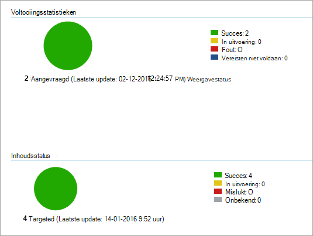

# <a name="onboard-windows-10-devices-using-configuration-manager"></a>Onboarden Windows 10-updates met Configuration Manager

**Van toepassing op:**

- [Microsoft 365 Preventie van gegevensverlies in eindpunten (DLP)](./endpoint-dlp-learn-about.md)
- System Center 2012 R2 Configuration Manager

### <a name="onboard-devices-using-system-center-configuration-manager"></a>Onboard-apparaten met System Center Configuration Manager

1. Open het configuratiepakket Configuratiebeheer .zip bestand *(DeviceComplianceOnboardingPackage.zip)* dat u hebt gedownload uit de wizard Service onboarding. U kunt het pakket ook kopen in [het Microsoft Compliance Center.](https://compliance.microsoft.com/)

2. Selecteer in het navigatiedeelvenster **Instellingen**  >  **Onboarding van apparaat.**  >  

3. Selecteer in **het veld** **Implementatiemethode Microsoft Endpoint Configuration Manager 2012/2012 R2/1511/1602**.

4. Selecteer **Pakket downloaden** en sla het .zip op.

5. Haal de inhoud van het .zip bestand op naar een gedeelde, alleen-lezen locatie die kan worden gebruikt door de netwerkbeheerders die het pakket zullen implementeren. U moet een bestand met de naam *DeviceComplianceOnboardingScript.cmd hebben.*

6. Implementeer het pakket door de stappen in het artikel Pakketten en programma's [in System Center 2012 R2 Configuration Manager te](/previous-versions/system-center/system-center-2012-R2/gg699369(v=technet.10)) volgen.

7. Kies een vooraf gedefinieerde apparaatverzameling om het pakket te implementeren.

> [!NOTE]
> Microsoft 365 Preventie van endpoint-gegevensverlies biedt geen ondersteuning voor onboarding tijdens de [OOBE-fase (Out-Of-Box Experience).](https://answers.microsoft.com/en-us/windows/wiki/windows_10/how-to-complete-the-windows-10-out-of-box/47e3f943-f000-45e3-8c5c-9d85a1a0cf87) Zorg ervoor dat gebruikers OOBE voltooien na het uitvoeren Windows installatie of upgrade.

> [!TIP]
> Nadat u het apparaat hebt onboarding, kunt u ervoor kiezen om een detectietest uit te voeren om te controleren of een apparaat correct is aan boord van de service. Zie Een detectietest uitvoeren op een nieuw ingebouwde [Microsoft Defender voor eindpuntapparaat](/windows/security/threat-protection/microsoft-defender-atp/run-detection-test)voor meer informatie.
>
> Houd er rekening mee dat het mogelijk is om een detectieregel te maken in een Configuration Manager-toepassing om continu te controleren of een apparaat is onboarded. Een toepassing is een ander type object dan een pakket en programma.
> Als een apparaat nog niet is onboarded (vanwege in behandeling zijnde OOBE-voltooiing of een andere reden), wordt configuratiebeheer opnieuw gebruikt om het apparaat aan te sluiten totdat de regel de statuswijziging detecteert.
>
> Dit gedrag kan worden bereikt door een detectieregel te maken die controleert of de registerwaarde 'OnboardingState' (van type REG_DWORD) = 1.
> Deze registerwaarde bevindt zich onder 'HKLM\SOFTWARE\Microsoft\Windows Advanced Threat Protection\Status'.
Zie Detectiemethoden configureren [in System Center 2012 R2 Configuration Manager voor meer informatie.](/previous-versions/system-center/system-center-2012-R2/gg682159(v=technet.10)#step-4-configure-detection-methods-to-indicate-the-presence-of-the-deployment-type)

### <a name="configure-sample-collection-settings"></a>Voorbeeldverzamelingsinstellingen configureren

Voor elk apparaat kunt u een configuratiewaarde instellen om aan te geven of steekproeven vanaf het apparaat kunnen worden verzameld wanneer een aanvraag wordt ingediend via Microsoft Defender-beveiligingscentrum om een bestand in te dienen voor uitgebreide analyse.

> [!NOTE]
> Deze configuratie-instellingen worden meestal uitgevoerd via Configuration Manager.

U kunt een complianceregel instellen voor configuratie-item in Configuration Manager om de instelling voor voorbeeld delen op een apparaat te wijzigen.

Deze regel moet een *configuratie-item* voor complianceregel zijn dat de waarde van een registersleutel op gerichte apparaten in stelt om ervoor te zorgen dat ze een klacht indienen.

De configuratie wordt ingesteld via de volgende registersleutelinvoer:

```
Path: “HKLM\SOFTWARE\Policies\Microsoft\Windows Advanced Threat Protection”
Name: "AllowSampleCollection"
Value: 0 or 1
```
Waarbij:<br>
Het type toets is een D-WORD. <br>
Mogelijke waarden zijn:
- 0 - is het delen van voorbeelden vanaf dit apparaat niet toegestaan
- 1 : hiermee kunt u alle bestandstypen vanaf dit apparaat delen

De standaardwaarde voor het geval de registersleutel niet bestaat, is 1.

Zie Inleiding tot nalevingsinstellingen in System Center Configuration Manager [2012 R2 Configuration Manager](/previous-versions/system-center/system-center-2012-R2/gg682139(v=technet.10))voor meer informatie over System Center compliance-instellingen.


## <a name="other-recommended-configuration-settings"></a>Andere aanbevolen configuratie-instellingen
Nadat u apparaten hebt toegevoegd aan de service, is het belangrijk om te profiteren van de meegeleverde mogelijkheden voor bedreigingsbeveiliging door ze in te stellen met de volgende aanbevolen configuratie-instellingen.

### <a name="device-collection-configuration"></a>Apparaatverzamelingsconfiguratie
Als u Endpoint Configuration Manager, versie 2002 of hoger, gebruikt, kunt u ervoor kiezen om de implementatie uit te lijnen met servers of down-level clients.


### <a name="next-generation-protection-configuration"></a>Beveiligingsconfiguratie van de volgende generatie

De volgende configuratie-instellingen worden aanbevolen:

**Scannen**

- Verwisselbare opslagapparaten scannen, zoals USB-stations: Ja

**Realtime beveiliging**

- Gedragscontrole inschakelen: Ja
- Beveiliging inschakelen tegen potentieel ongewenste toepassingen bij downloaden en vóór de installatie: Ja

**Cloudbeveiligingsservice**

- Lidmaatschapstype Cloud Protection Service: Geavanceerd lidmaatschap

**Surface-beperking voor aanvallen** Configureer alle beschikbare regels om te controleren.

> [!NOTE]
> Het blokkeren van deze activiteiten kan legitieme bedrijfsprocessen onderbreken. De beste methode is om alles in te stellen op controle, om te bepalen welke veilig zijn om in te zetten en vervolgens de instellingen in te stellen op eindpunten die geen fout-positieve detecties hebben.

**Netwerkbeveiliging**

Voordat u netwerkbeveiliging in de audit- of blokmodus inschakelen, moet u ervoor zorgen dat u de antimalware-platformupdate hebt geïnstalleerd, die kan worden verkregen via de [ondersteuningspagina.](https://support.microsoft.com/en-us/help/4560203/windows-defender-anti-malware-platform-binaries-are-missing)


**Beheerde maptoegang**

Schakel de functie in de auditmodus minimaal 30 dagen in. Na deze periode controleert u detecties en maakt u een lijst met toepassingen die mogen schrijven naar beveiligde directories.

Zie Beheerde maptoegang evalueren voor meer [informatie.](/windows/security/threat-protection/microsoft-defender-atp/evaluate-controlled-folder-access)


## <a name="offboard-devices-using-configuration-manager"></a>Offboard-apparaten met Configuration Manager

Om veiligheidsredenen verloopt het pakket dat wordt gebruikt voor Offboard-apparaten 30 dagen na de datum waarop het is gedownload. Verlopen offboarding-pakketten die naar een apparaat zijn verzonden, worden geweigerd. Wanneer u een offboarding-pakket downloadt, wordt u op de hoogte gesteld van de vervaldatum van de pakketten en wordt het ook opgenomen in de pakketnaam.

> [!NOTE]
> Onboarding- en offboarding-beleid mag niet tegelijkertijd op hetzelfde apparaat worden geïmplementeerd, anders veroorzaakt dit onvoorspelbare botsingen.

### <a name="offboard-devices-using-microsoft-endpoint-configuration-manager-current-branch"></a>Offboard-apparaten met Microsoft Endpoint Configuration Manager huidige vertakking

Zie Een [offboarding-configuratiebestand](/configmgr/protect/deploy-use/windows-defender-advanced-threat-protection#create-an-offboarding-configuration-file)maken als Microsoft Endpoint Configuration Manager huidige vertakking gebruikt.

### <a name="offboard-devices-using-system-center-2012-r2-configuration-manager"></a>Offboard-apparaten met System Center 2012 R2 Configuration Manager

1. Haal het offboarding-pakket op in [het Microsoft Compliance Center:](https://compliance.microsoft.com/)

2. Selecteer in het navigatiedeelvenster **Instellingen**  >   **Onboarding** >  **offboarding** voor apparaten.

3. Selecteer Windows 10 als het besturingssysteem.

4. Selecteer in **het veld** **Implementatiemethode Microsoft Endpoint Configuration Manager 2012/2012 R2/1511/1602**.

5. Selecteer **Pakket downloaden** en sla het .zip op.

6. Haal de inhoud van het .zip bestand op naar een gedeelde, alleen-lezen locatie die kan worden gebruikt door de netwerkbeheerders die het pakket zullen implementeren. U moet een bestand met de naam *DeviceComplianceOffboardingScript_valid_until_YYYY-MM-DD.cmd* hebben.

7. Implementeer het pakket door de stappen in het artikel Pakketten en programma's [in System Center 2012 R2 Configuration Manager te](/previous-versions/system-center/system-center-2012-R2/gg699369(v=technet.10)) volgen.

8. Kies een vooraf gedefinieerde apparaatverzameling om het pakket te implementeren.

> [!IMPORTANT]
> Offboarding zorgt ervoor dat het apparaat stopt met het verzenden van sensorgegevens naar de portal, maar gegevens van het apparaat, inclusief verwijzingen naar eventuele waarschuwingen die het heeft ontvangen, blijven maximaal 6 maanden bewaard.


## <a name="monitor-device-configuration"></a>Apparaatconfiguratie controleren

Als u de huidige Microsoft Endpoint Configuration Manager gebruikt, gebruikt u het ingebouwde Dashboard van Microsoft Defender voor eindpunt in de console Configuration Manager. Zie Microsoft [Defender Advanced Threat Protection - Monitor voor meer informatie.](/configmgr/protect/deploy-use/windows-defender-advanced-threat-protection#monitor)

Als u configuratiebeheer System Center 2012 R2 gebruikt, bestaat monitoring uit twee onderdelen:

1. Bevestigen dat het configuratiepakket correct is geïmplementeerd en wordt uitgevoerd (of is uitgevoerd) op de apparaten in uw netwerk.

2. Controleren of de apparaten voldoen aan de Microsoft 365 Endpoint-service voor preventie van gegevensverlies (dit zorgt ervoor dat het apparaat het onboardingproces kan voltooien en gegevens kan blijven rapporteren aan de service).

### <a name="confirm-the-configuration-package-has-been-correctly-deployed"></a>Controleren of het configuratiepakket correct is geïmplementeerd

1. Klik in de console Configuration Manager op **Controleren** onder aan het navigatiedeelvenster.

2. Selecteer **Overzicht** en vervolgens **Implementaties.**

3. Selecteer op de implementatie met de naam van het pakket.

4. Bekijk de statusindicatoren onder **Voltooiingsstatistieken** en **Inhoudsstatus**.

    Als er mislukte implementaties zijn (apparaten met **fout,** niet-voldaane vereisten of mislukte **statussen),** moet u mogelijk problemen met de apparaten oplossen. Zie Microsoft Defender [Advanced Threat Protection onboarding issues](/windows/security/threat-protection/microsoft-defender-atp/troubleshoot-onboarding)oplossen voor meer informatie.

    

### <a name="check-that-the-devices-are-compliant-with-the-microsoft-365-endpoint-data-loss-prevention-service"></a>Controleer of de apparaten voldoen aan de Microsoft 365 endpoint-service voor preventie van gegevensverlies

U kunt een complianceregel instellen voor configuratie-item in System Center 2012 R2 Configuration Manager om uw implementatie te controleren.

> [!NOTE]
> Deze procedure en registerinvoer zijn van toepassing op Endpoint DLP en Advanced Threat Protection.

Deze regel moet een *configuratieitem voor complianceregelen* zijn dat de waarde van een registersleutel op gerichte apparaten controleert.

De volgende registersleutelinvoer controleren:
```
Path: “HKLM\SOFTWARE\Microsoft\Windows Advanced Threat Protection\Status”
Name: “OnboardingState”
Value: “1”
```
Zie Inleiding tot compliance-instellingen [in System Center 2012 R2 Configuration Manager voor meer informatie.](/previous-versions/system-center/system-center-2012-R2/gg682139(v=technet.10))

## <a name="related-topics"></a>Gerelateerde onderwerpen
- [Onboard Windows 10 apparaten met groepsbeleid](dlp-configure-endpoints-gp.md)
- [Onboarden Windows 10-apparaten met hulpmiddelen voor Mobile Device Management](dlp-configure-endpoints-mdm.md)
- [Onboarden Windows 10-apparaten met een lokaal script](dlp-configure-endpoints-script.md)
- [Onboarden niet-permanente virtual desktop infrastructure (VDI)-apparaten](dlp-configure-endpoints-vdi.md)
- [Een detectietest uitvoeren op een nieuw ingebouwde Microsoft Defender voor eindpuntapparaat](/windows/security/threat-protection/microsoft-defender-atp/run-detection-test)
- [Problemen met de onboarding van Microsoft Defender Advanced Threat Protection oplossen](/windows/security/threat-protection/microsoft-defender-atp/troubleshoot-onboarding)