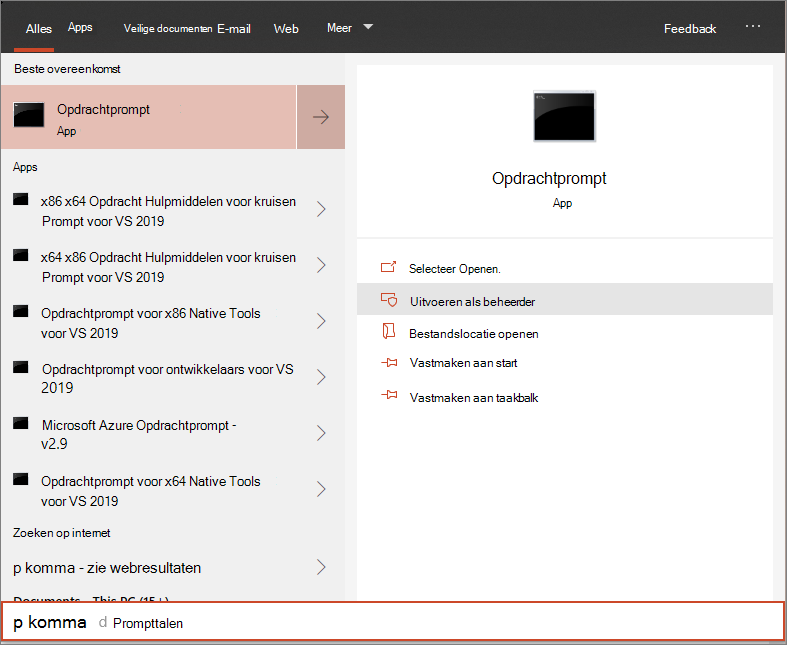

# Onboarden Windows 10-apparaten met een lokaal script

**Van toepassing op:**

- [Microsoft 365 Preventie van gegevensverlies in eindpunten (DLP)](./endpoint-dlp-learn-about.md)

U kunt ook afzonderlijke apparaten handmatig onboarden om Microsoft 365 voorkomen dat eindpunten verloren gaan. Mogelijk wilt u dit eerst doen bij het testen van de service voordat u alle apparaten in uw netwerk gaat onboarden.

> [!IMPORTANT]
> Dit script is geoptimaliseerd voor gebruik op maximaal 10 apparaten.
>
> Gebruik andere implementatieopties om op schaal [te implementeren.](dlp-configure-endpoints.md) U kunt bijvoorbeeld een onboarding-script implementeren op meer dan 10 apparaten in productie met het script dat beschikbaar is in Onboard [Windows 10 apparaten met groepsbeleid.](dlp-configure-endpoints-gp.md)

## Onboard-apparaten
 
1.  Open het GP-configuratiepakket .zip bestand *(DeviceComplianceOnboardingPackage.zip)* dat u hebt gedownload van de wizard Service onboarding. U kunt het pakket ook krijgen in [het Microsoft Compliance Center](https://compliance.microsoft.com)

2. Selecteer in het navigatiedeelvenster **Instellingen**  >  **Onboarding van apparaat.**

3. Selecteer **lokaal** script in het veld **Implementatiemethode.**

4. Klik **op Pakket downloaden** en sla het .zip op.
  
5. Haal de inhoud van het configuratiepakket op naar een locatie op het apparaat dat u wilt inpakken (bijvoorbeeld het bureaublad). U moet een bestand met de naam *DeviceOnboardingScript.cmd hebben.*

6.  Open een opdrachtregelprompt met verhoogde opdrachtregel op het apparaat en voer het script uit:

7.  Go to **Start** and type **cmd**.

8.  Klik met de rechtermuisknop op **Opdrachtprompt** en selecteer **Als beheerder uitvoeren**.

    

9.  Typ de locatie van het scriptbestand. Als u het bestand naar het bureaublad hebt gekopieerd, typt u: *%userprofile%\Desktop\WindowsDefenderATPOnboardingScript.cmd*

10.  Druk op **Enter** of klik op **OK.**

Zie Problemen met onboarding oplossen voor informatie over hoe u handmatig kunt valideren of het Microsoft Defender Advanced Threat Protection apparaat compatibel is en sensorgegevens correct [rapporteert.](/windows/security/threat-protection/microsoft-defender-atp/troubleshoot-onboarding)

## Offboard-apparaten met een lokaal script
Om veiligheidsredenen verloopt het pakket dat wordt gebruikt voor Offboard-apparaten 30 dagen na de datum waarop het is gedownload. Verlopen offboarding-pakketten die naar een apparaat zijn verzonden, worden geweigerd. Wanneer u een offboarding-pakket downloadt, wordt u op de hoogte gesteld van de vervaldatum van de pakketten en wordt het ook opgenomen in de pakketnaam.

> [!NOTE]
> Onboarding- en offboarding-beleid mag niet tegelijkertijd op hetzelfde apparaat worden geïmplementeerd, anders veroorzaakt dit onvoorspelbare botsingen.

1. Het offboarding-pakket kopen bij [Microsoft Compliance Center](https://compliance.microsoft.com)

2. Selecteer in het navigatiedeelvenster **Instellingen**  >  **Offboarding apparaat**.

3. Selecteer **lokaal** script in het veld **Implementatiemethode.**

4. Klik **op Pakket downloaden** en sla het .zip op.

5. Haal de inhoud van het .zip op naar een gedeelde, alleen-lezen locatie die toegankelijk is voor de apparaten. U moet een bestand met de naam *DeviceComplianceOffboardingScript_valid_until_YYYY-MM-DD.cmd* hebben.

6.  Open een opdrachtregelprompt met verhoogde opdrachtregel op het apparaat en voer het script uit:

7.  Go to **Start** and type **cmd**.

8.  Klik met de rechtermuisknop op **Opdrachtprompt** en selecteer **Als beheerder uitvoeren**.

    

9.  Typ de locatie van het scriptbestand. Als u het bestand naar het bureaublad hebt gekopieerd, typt u: *%userprofile%\Desktop\WindowsDefenderATPOffboardingScript_valid_until_YYYY-MM-DD.cmd*

10.  Druk op **Enter** of klik op **OK.**

> [!IMPORTANT]
> Offboarding zorgt ervoor dat het apparaat stopt met het verzenden van sensorgegevens naar de portal.

## Apparaatconfiguratie controleren
U kunt de verschillende verificatiestappen volgen in de [Problemen met onboarding oplossen](/windows/security/threat-protection/microsoft-defender-atp/troubleshoot-onboarding) om te controleren of het script is voltooid en of de agent actief is.

Controle kan ook rechtstreeks in de portal of met behulp van de verschillende implementatiehulpmiddelen worden uitgevoerd.

### Apparaten controleren met behulp van de portal
1. Ga naar [Microsoft 365 compliancecentrum.](https://compliance.microsoft.com)

2. Kies **Instellingen**  >  **Apparaat onboarding-apparaten**  >  .

3. Controleer of apparaten worden weergegeven.

## Verwante onderwerpen
- [Onboard Windows 10 apparaten met groepsbeleid](dlp-configure-endpoints-gp.md)
- [Onboard Windows 10 apparaten met Microsoft Endpoint Configuration Manager](dlp-configure-endpoints-sccm.md)
- [Onboarden Windows 10-apparaten met hulpmiddelen voor Mobile Device Management](dlp-configure-endpoints-mdm.md)
- [Onboarden niet-permanente virtual desktop infrastructure (VDI)-apparaten](dlp-configure-endpoints-vdi.md)
- [Een detectietest uitvoeren op een nieuw ingebouwde Microsoft Defender voor eindpuntapparaat](/windows/security/threat-protection/microsoft-defender-atp/run-detection-test)
- [Problemen met Microsoft Defender Advanced Threat Protection onboarding oplossen](/windows/security/threat-protection/microsoft-defender-atp/troubleshoot-onboarding)