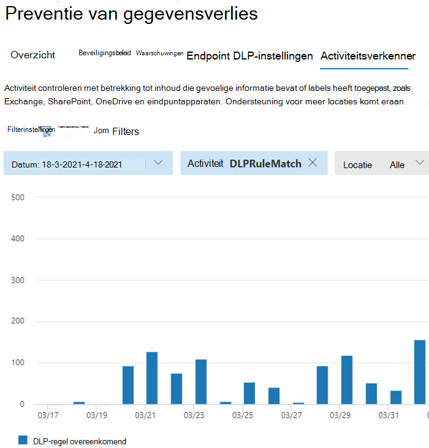

# Meer informatie over preventie van gegevensverliesLearn about data loss prevention

Organisaties hebben gevoelige informatie onder hun controle, zoals financiële gegevens, eigendomsgegevens, creditcardnummers, gezondheidsrecords of sociale-zekerheidsnummers.Organizations have sensitive information under their control such as financial data, proprietary data, credit card numbers, health records, or social security numbers. Om deze gevoelige gegevens te beschermen en risico's te beperken, hebben ze een manier nodig om te voorkomen dat hun gebruikers deze op ongepaste wijze delen met personen die deze gegevens niet mogen hebben.To help protect this sensitive data and reduce risk, they need a way to prevent their users from inappropriately sharing it with people who shouldn't have it. Deze praktijk heet preventie van gegevensverlies (DLP).This practice is called data loss prevention (DLP).

In Microsoft 365 implementeert u preventie van gegevensverlies door DLP-beleid te definiëren en toe te passen.In Microsoft 365, you implement data loss prevention by defining and applying DLP policies. Met een DLP-beleid kunt u gevoelige items op verschillende gebieden identificeren, controleren en automatisch beveiligen:With a DLP policy, you can identify, monitor, and automatically protect sensitive items across:

- Microsoft 365 services zoals Teams, Exchange, SharePoint en OneDriveMicrosoft 365 services such as Teams, Exchange, SharePoint, and OneDrive
- Office toepassingen zoals Word, Excel en PowerPointOffice applications such as Word, Excel, and PowerPoint
- Windows 10 eindpuntenWindows 10 endpoints
- niet-Microsoft-cloud-appsnon-Microsoft cloud apps
- on-premises bestandsaandelen en on-premises SharePoint.on-premises file shares and on-premises SharePoint.

Microsoft 365 detecteert gevoelige items met behulp van diepgaande inhoudsanalyse, niet alleen door een eenvoudige tekstscan.Microsoft 365 detects sensitive items by using deep content analysis, not by just a simple text scan. Inhoud wordt geanalyseerd op primaire gegevens die overeenkomen met trefwoorden, door de evaluatie van reguliere expressies, door interne functievalidatie en door secundaire gegevensmatchen die zich in de nabijheid van de primaire gegevensmatch bevinden.Content is analyzed for primary data matches to keywords, by the evaluation of regular expressions, by internal function validation, and by secondary data matches that are in proximity to the primary data match. Daarnaast gebruikt DLP ook algoritmen voor machine learning en andere methoden om inhoud te detecteren die overeenkomt met uw DLP-beleid.Beyond that DLP also uses machine learning algorithms and other methods to detect content that matches your DLP policies.
  
## DLP maakt deel uit van het grotere Microsoft 365 Compliance-aanbodDLP is part of the larger Microsoft 365 Compliance offering

Microsoft 365 DLP is slechts een van de Microsoft 365 compliancehulpmiddelen die u gebruikt om uw gevoelige items te beschermen, waar ze ook wonen of reizen.Microsoft 365 DLP is just one of the Microsoft 365 Compliance tools that you will use to help protect your sensitive items wherever they live or travel. U moet de andere hulpprogramma's in de Microsoft 365 compliancehulpprogramma's begrijpen, hoe ze met elkaar verwisseld zijn en beter samenwerken.You should understand the other tools in the Microsoft 365 Compliance tools set, how they interrelate, and work better together.  Zie de [Microsoft 365 voor meer](protect-information.md) informatie over het informatiebeveiligingsproces.See, [Microsoft 365 compliance tools](protect-information.md) to learn more about the information protection process.

## Beschermende acties van DLP-beleidProtective actions of DLP policies

Microsoft 365 DLP-beleid is hoe u de activiteiten controleert die gebruikers in rust uitvoeren op gevoelige items, gevoelige items die onderweg zijn of gevoelige items die worden gebruikt en beschermende acties ondernemen.Microsoft 365 DLP policies are how you monitor the activities that users take on sensitive items at rest, sensitive items in transit, or sensitive items in use and take protective actions. Als een gebruiker bijvoorbeeld probeert een verboden actie uit te voeren, zoals het kopiëren van een gevoelig item naar een niet-goedgekeurde locatie of het delen van medische informatie in een e-mail of andere voorwaarden die in een beleid zijn vastgelegd, kan DLP:For example, when a user attempts to take a prohibited action, like copying a sensitive item to an unapproved location or sharing medical information in an email or other conditions laid out in a policy, DLP can:

- een pop-upbeleidstip tonen aan de gebruiker die hem of haar waarschuwt dat hij of zij mogelijk een gevoelig item ongepast probeert te delenshow a pop-up policy tip to the user that warns them that they may be trying to share a sensitive item inappropriately
- het delen te blokkeren en via een beleidstip de gebruiker toe te staan het blok te overschrijven en de rechtvaardiging van de gebruikers vast te leggenblock the sharing and, via a policy tip, allow the user to override the block and capture the users' justification
- het delen blokkeren zonder de optie overschrijvenblock the sharing without the override option
- voor gegevens in rust kunnen gevoelige items worden vergrendeld en naar een veilige quarantainelocatie worden verplaatstfor data at rest, sensitive items can be locked and moved to a secure quarantine location
- voor Teams chat, worden de gevoelige gegevens niet weergegevenfor Teams chat, the sensitive information will not be displayed

Alle DLP-gecontroleerde activiteiten worden standaard opgenomen in [het Microsoft 365 auditlogboek](search-the-audit-log-in-security-and-compliance.md) en worden doorgeleid naar [Activiteitsverkenner.](data-classification-activity-explorer.md)All DLP monitored activities are recorded to the [Microsoft 365 Audit log](search-the-audit-log-in-security-and-compliance.md) by default and routed to [Activity explorer](data-classification-activity-explorer.md). Wanneer een gebruiker een actie uitvoert die voldoet aan de criteria van een DLP-beleid en u waarschuwingen hebt geconfigureerd, geeft DLP waarschuwingen in het [DLP-dashboard voor waarschuwingsbeheer.](dlp-configure-view-alerts-policies.md)When a user performs an action that meets the criteria of a DLP policy, and you have alerts configured, DLP provides alerts in the [DLP alert management dashboard](dlp-configure-view-alerts-policies.md).

## DLP-levenscyclusDLP lifecycle

Een DLP-implementatie volgt meestal deze belangrijke fasen.A DLP implementation typically follows these major phases.

- [Plan voor DLPPlan for DLP](#plan-for-dlp)
- [Voorbereiden op DLPPrepare for DLP](#prepare-for-dlp)
- [Uw beleid implementeren in productieDeploy your policies in production](#deploy-your-policies-in-production)

<!--ADD DIAGRAM OF THE DLP LIFECYCLE WORK ON WITH MAS-->

### Plan voor DLPPlan for DLP

Microsoft 365 DLP-monitoring en -beveiliging zijn inheems in de toepassingen die gebruikers elke dag gebruiken.Microsoft 365 DLP monitoring and protection are native to the applications that users use every day. Dit helpt om de gevoelige items van uw organisatie te beschermen tegen riskante activiteiten, zelfs als uw gebruikers niet zijn gewend aan preventie van gegevensverlies.This helps to protect your organizations' sensitive items from risky activities even if your users are unaccustomed to data loss prevention thinking and practices. Als uw organisatie en uw gebruikers nieuw zijn op het gebied van preventie van gegevensverlies, kan het nodig zijn om DLP aan te passen aan uw bedrijfsprocessen en is er een cultuurverschuiving voor uw gebruikers.If your organization and your users are new to data loss prevention practices, the adoption of DLP may require a change to your business processes and there will be a culture shift for your users. Maar met de juiste planning, testen en afstemmen beschermt uw DLP-beleid uw gevoelige items en minimaliseert u eventuele verstoringen van bedrijfsprocessen.But, with proper planning, testing and tuning, your DLP policies will protect your sensitive items while minimizing any potential business process disruptions.

**Technologieplanning voor DLP****Technology planning for DLP**

Houd er rekening mee dat DLP als technologie uw gegevens in rust kan bewaken en beveiligen, gegevens in gebruik en gegevens die in beweging zijn op Microsoft 365-services, Windows 10-apparaten, on-premises bestandsaandelen en on-premises SharePoint.Keep in mind that DLP as a technology can monitor and protect your data at rest, data in use and data in motion across Microsoft 365 services, Windows 10 devices, on-premises file shares, and on-premises SharePoint. Er zijn plannings implicaties voor de verschillende locaties, het type gegevens dat u wilt bewaken en beveiligen en de acties die moeten worden ondernomen wanneer een beleidsmatch plaatsvindt.There are planning implications for the different locations, the type of data you want to monitor and protect, and the actions to be taken when a policy match occurs.  

**Planning van bedrijfsprocessen voor DLP****Business processes planning for DLP**

DLP-beleid kan verboden activiteiten blokkeren, zoals ongepast delen van gevoelige informatie via e-mail.DLP policies can block prohibited activities, like inappropriate sharing of sensitive information via email. Terwijl u uw DLP-beleid plant, moet u de bedrijfsprocessen identificeren die uw gevoelige items raken.As you plan your DLP policies, you must identify the business processes that touch your sensitive items. De eigenaren van bedrijfsprocessen kunnen u helpen bij het identificeren van het juiste gebruikersgedrag dat moet worden toegestaan en ongepast gebruikersgedrag dat moet worden beschermd.The business process owners can help you identify appropriate user behaviors that should be allowed and inappropriate user behaviors that should be protected against. U moet uw beleid plannen en implementeren in de  testmodus, en eerst de impact ervan evalueren via activiteitsverkenner, voordat u ze in meer beperkende modi kunt toepassen.You should plan your policies and deploy them in test mode, and evaluate their impact via [activity explorer](data-classification-activity-explorer.md) first, before applying them in more restrictive modes.

**Organisatiecultuurplanning voor DLP****Organizational culture planning for DLP**

Een succesvolle DLP-implementatie is net zo afhankelijk van het trainen en wennen van uw gebruikers aan preventie van gegevensverlies als aan goed geplande en afgestemde beleidsregels.A successful DLP implementation is as much dependent on getting your users trained and acclimated to data loss prevention practices as it is on well planned and tuned policies. Aangezien uw gebruikers nauw betrokken zijn, moet u ook training voor hen plannen.Since your users are heavily involved, be sure to plan for training for them too. U kunt beleidstips strategisch gebruiken om uw gebruikers bewust te maken voordat u de beleidshandhaving verandert van testmodus in meer beperkende modi.You can strategically use policy tips to raise awareness with your users before changing the policy enforcement from test mode to more restrictive modes.

<!--For more information on planning for DLP, including suggestions for deployment based on your needs and resources, see [Planning for Microsoft 365 data loss prevention](dlp-plan-for-dlp.md).-->

### Voorbereiden op DLPPrepare for DLP

U kunt DLP-beleid toepassen op gegevens in rust, gegevens in gebruik en gegevens in beweging op locaties, zoals:You can apply DLP policies to data at rest, data in use, and data in motion in locations, such as:

- Exchange Online e-mailExchange Online email
- SharePoint OnlinesitesSharePoint Online sites
- OneDrive-accountsOneDrive accounts
- Teams chat- en kanaalberichtenTeams chat and channel messages
- Microsoft Cloud App SecurityMicrosoft Cloud App Security
- Windows 10-apparatenWindows 10 devices
- On-premises opslagplaatsenOn-premises repositories

Elk heeft verschillende vereisten.Each one has different pre-requisites. Gevoelige items op sommige locaties, zoals Exchange online, kunnen onder de paraplu van DLP worden gebracht door gewoon een beleid te configureren dat op hen van toepassing is.Sensitive items in some locations, like Exchange online, can be brought under the DLP umbrella by just configuring a policy that applies to them. Voor andere bestanden, zoals on-premises bestandsitories, is een implementatie van AIP-scanner (Azure Information Protection) vereist.Others, such as on-premises file repositories require a deployment of Azure Information Protection (AIP) scanner. U moet uw omgeving voorbereiden, conceptbeleid coderen en deze grondig testen voordat u eventuele blokkeringsacties activeert.You'll need to prepare your environment, code draft policies, and test them thoroughly before activating any blocking actions.

### Uw beleid implementeren in productieDeploy your policies in production

#### Uw beleid ontwerpenDesign your policies

Begin met het definiëren van uw beheerdoelstellingen en hoe deze van toepassing zijn op elke respectievelijke werkbelasting.Start by defining your control objectives, and how they apply across each respective workload. Een beleid opstellen dat uw doelstellingen belichaamt.Draft a policy that embodies your objectives. U kunt beginnen met één werkbelasting tegelijk of met alle werkbelastingen. Er is nog geen effect.Feel free to start with one workload at a time, or across all workloads - there's no impact yet.

#### Beleid implementeren in testmodusImplement policy in test mode

Evalueer de impact van de besturingselementen door deze te implementeren met een DLP-beleid in de testmodus.Evaluate the impact of the controls by implementing them with a DLP policy in test mode. Het is ok om het beleid toe te passen op alle werkbelastingen in de testmodus, zodat u de volledige breedte van de resultaten kunt krijgen, maar u kunt beginnen met één werkbelasting als dat nodig is.It's ok to apply the policy to all workloads in test mode, so that you can get the full breadth of results, but you can start with one workload if you need to.

#### Resultaten controleren en het beleid verder afstemmenMonitor outcomes and fine-tune the policy

Houd in de testmodus de resultaten van het beleid in de gaten en pas het aan zodat het voldoet aan uw beheerdoelstellingen, terwijl u ervoor zorgt dat u geen nadelige of onbedoelde invloed hebt op geldige gebruikerswerkstromen en productiviteit.While in test mode, monitor the outcomes of the policy and fine-tune it so that it meets your control objectives while ensuring you aren't adversely or inadvertently impacting valid user workflows and productivity. Hier zijn enkele voorbeelden van dingen die u kunt afstemmen:Here are some examples of things to fine-tune:

- het aanpassen van de locaties en personen/plaatsen die binnen of buiten het bereik vallenadjusting the locations and people/places that are in or out of scope
- de voorwaarden en uitzonderingen afstemmen die worden gebruikt om te bepalen of een item en wat er mee wordt gedaan, overeenkomt met het beleidtune the conditions and exceptions that are used to determine if an item and what is being done with it matches the policy
- de definitie van gevoelige informatie/sthe sensitive information definition/s
- de actiesthe actions
- het niveau van beperkingenthe level of restrictions
- nieuwe besturingselementen toevoegenadd new controls
- nieuwe personen toevoegenadd new people
- nieuwe, beperkte apps toevoegenadd new restricted apps
- nieuwe sites met beperkingen toevoegenadd new restricted sites

#### Het besturingselement inschakelen en uw beleid afstemmenEnable the control and tune your policies

Wanneer het beleid aan al uw doelstellingen voldoet, zet u het in.Once the policy meets all your objectives, turn it on. Blijf de resultaten van de beleidstoepassing controleren en zo nodig afstemmen.Continue to monitor the outcomes of the policy application and tune as needed. Over het algemeen worden beleidsregels ongeveer een uur na het in- en uitIn general, policies take effect about an hour after being turned on. 

<!--See, LINK TO topic for SLAs for location specific  details-->

## Overzicht van DLP-beleidsconfiguratieDLP policy configuration overview

U hebt flexibiliteit in de manier waarop u uw DLP-beleid maakt en configureert.You have flexibility in how you create and configure your DLP policies. U kunt beginnen met een vooraf gedefinieerde sjabloon en met slechts een paar klikken een beleid maken of u kunt uw eigen sjabloon van begin af aan ontwerpen.You can start from a predefined template and create a policy in just a few clicks or you can design your own from the ground up. Welke u ook kiest, voor alle DLP-beleidsregels is dezelfde informatie van u vereist.No matter which you choose, all DLP policies require the same information from you.

1. **Kies wat u wilt controleren:** Microsoft 365 bevat veel vooraf gedefinieerde beleidssjablonen om u te helpen aan de slag te gaan of u kunt een aangepast beleid maken.**Choose what you want to monitor** - Microsoft 365 comes with many predefined policy templates to help you get started or you can create a custom policy.
    - Een vooraf gedefinieerde beleidssjabloon: Financiële gegevens, medische en gezondheidsgegevens, Privacygegevens voor verschillende landen en regio's.A predefined policy template: Financial data, Medical and health data, Privacy data all for various countries and regions.
    - Een aangepast beleid dat gebruikmaakt van de beschikbare gevoelige informatietypen, bewaarlabels en gevoeligheidslabels.A custom policy that uses the available sensitive information types, retention labels, and sensitivity labels.
2. **Kies waar u wilt controleren:** u kiest een of meer locaties waarop U DLP wilt controleren voor gevoelige informatie.**Choose where you want to monitor** - You pick one or more locations that you want DLP to monitor for sensitive information. U kunt het volgende controleren:You can monitor:
    
locatielocation | opnemen/uitsluiten doorinclude/exclude by|
|---------|---------|
|Exchange-e-mailExchange email| distributiegroependistribution groups|
|SharePoint sitesSharePoint sites |sitessites |
|OneDrive-accountsOneDrive accounts |accounts of distributiegroepenaccounts or distribution groups |
|Teams chat- en kanaalberichtenTeams chat and channel messages |accountsaccounts |
|Windows 10-apparatenWindows 10 devices |gebruiker of groepuser or group |
|Microsoft Cloud App SecurityMicrosoft Cloud App Security |exemplaarinstance |
|On-premises opslagplaatsenOn-premises repositories| archiefbestandspadrepository file path|

3. **Kies de voorwaarden die moeten worden aangepast** om een beleid toe te passen op een item. U kunt vooraf geconfigureerde voorwaarden accepteren of aangepaste voorwaarden definiëren.**Choose the conditions that must be matched for a policy to be applied to an item** - you can accept pre-configured conditions or define custom conditions. Enkele voorbeelden zijn:Some examples are:

- item bevat een opgegeven soort gevoelige informatie die in een bepaalde context wordt gebruikt.item contains a specified kind of sensitive information that is being used in a certain context. Er worden bijvoorbeeld 95 sociale-zekerheidsnummers per e-mail verzonden naar geadresseerde buiten uw organisatie.For example, 95 social security numbers being emailed to recipient outside your org.
- item heeft een opgegeven gevoeligheidslabelitem has a specified sensitivity label
- item met gevoelige informatie wordt intern of extern gedeelditem with sensitive information is shared either internally or externally

4. **Kies de actie die moet worden ondernomen wanneer** aan de beleidsvoorwaarden wordt voldaan: de acties zijn afhankelijk van de locatie waar de activiteit wordt plaatsvinden.**Choose the action to take when the policy conditions are met** - The actions depend on the location where the activity is happening.  Enkele voorbeelden zijn:Some examples are:

- SharePoint/Exchange/OneDrive: Blokkeren dat personen buiten uw organisatie toegang hebben tot de inhoud.SharePoint/Exchange/OneDrive: Block people who are outside your organization form accessing the content. Laat de gebruiker een tip zien en stuur hem of haar een e-mailmelding dat hij of zij een actie onderneemt die is verboden door het DLP-beleid.Show the user a tip and send them an email notification that they are taking an action that is prohibited by the DLP policy.
- Teams Chatten en kanaal: blokkeren dat gevoelige informatie wordt gedeeld in de chat of het kanaalTeams Chat and Channel: Block sensitive information from being shared in the chat or channel
- Windows 10 Apparaten: Het kopiëren van een gevoelig item naar een verwijderbaar USB-apparaat controleren of beperkenWindows 10 Devices: Audit or restrict copying a sensitive item to a removeable USB device 
- Office Apps: Laat een pop-up zien waarin de gebruiker wordt op de hoogte gebracht dat hij of zij risicovol gedrag heeft en blokkeert of blokkeert, maar overschrijven toestaat.Office Apps: Show a popup notifying the user that they are engaging in a risky behavior and block or block but allow override.
- On-premises bestandsaandelen: verplaats het bestand van waar het is opgeslagen naar een quarantainemapOn-premises file shares: move the file from where it is stored to a quarantine folder

> [!NOTE]
> De voorwaarden en de acties die moeten worden ondernomen, worden gedefinieerd in een object dat een regel wordt genoemd.The conditions and the actions to take are defined in an object called a Rule.

<!--## Create a DLP policy

All DLP policies are created and maintained in the Microsoft 365 Compliance center. See, INSERT LINK TO ARTICLE THAT WILL START WALKING THEM THROUGH THE POLICY CREATION PROCEDURES for more information.-->

Nadat u een DLP-beleid hebt in het Compliancecentrum, wordt het opgeslagen in een centrale beleidsopslag en vervolgens gesynchroniseerd met de verschillende inhoudsbronnen, waaronder:After you create a DLP policy in the Compliance Center, it's stored in a central policy store, and then synced to the various content sources, including:
  
- Exchange Online en van daar naar webversie van Outlook en Outlook.Exchange Online, and from there to Outlook on the web and Outlook.
- OneDrive voor Bedrijven sites.OneDrive for Business sites.
- SharePoint Onlinesites.SharePoint Online sites.
- Office bureaubladprogramma's (Excel, PowerPoint en Word).Office desktop programs (Excel, PowerPoint, and Word).
- Microsoft Teams kanalen en chatberichten.Microsoft Teams channels and chat messages.
    
Nadat het beleid is gesynchroniseerd met de juiste locaties, wordt gestart met het evalueren van inhoud en het afdwingen van acties.After the policy's synced to the right locations, it starts to evaluate content and enforce actions.

## Resultaten van beleidstoepassing weergevenViewing policy application results

DLP rapporteert een grote hoeveelheid informatie in Microsoft 365 monitoring, beleidswedstrijden en acties en gebruikersactiviteiten.DLP reports a vast amount of information into Microsoft 365 from monitoring, policy matches and actions, and user activities. U moet deze informatie gebruiken en erop reageren om uw beleid af te stemmen en acties op gevoelige items af te stemmen.You'll need to consume and act on that information to tune your policies and triage actions taken on sensitive items. De telemetrie gaat eerst naar [het Microsoft 365 auditlogboeken](search-the-audit-log-in-security-and-compliance.md#search-the-audit-log-in-the-compliance-center) van het compliancecentrum, wordt verwerkt en maakt zijn weg naar verschillende rapportagehulpmiddelen.The telemetry goes into the [Microsoft 365 Compliance center Audit Logs](search-the-audit-log-in-security-and-compliance.md#search-the-audit-log-in-the-compliance-center) first, is processed, and makes its way to different reporting tools. Elk rapportagehulpmiddel heeft een ander doel.Each reporting tool has a different purpose.  

### DLP-waarschuwingendashboardDLP Alerts Dashboard

Wanneer DLP een actie onderneemt voor een gevoelig item, kunt u hiervan op de hoogte worden gesteld via een configureerbare waarschuwing.When DLP takes an action on a sensitive item, you can be notified of that action via a configurable alert. In plaats van dat deze waarschuwingen zich in een postvak opstapelen om door te sissen, stelt het Compliancecentrum deze beschikbaar in het [DLP Alerts Management Dashboard.](dlp-configure-view-alerts-policies.md)Rather than having these alerts pile up in a mailbox for you to sift through, the Compliance center makes them available in the [DLP Alerts Management Dashboard](dlp-configure-view-alerts-policies.md). Gebruik het DLP-waarschuwingendashboard om waarschuwingen te configureren, te controleren, te triagen en de resolutie van DLP-waarschuwingen bij te houden.Use the DLP Alerts dashboard to configure alerts, review them, triage them and track resolution of DLP Alerts. Hier volgen een voorbeeld van waarschuwingen die worden gegenereerd door beleidswedstrijden en activiteiten van Windows 10 apparaten.Here's an example of alerts generated by policy matches and activities from Windows 10 devices.

> [!div class="mx-imgBorder"]
> 

U kunt ook details van de bijbehorende gebeurtenis met uitgebreide metagegevens in hetzelfde dashboard bekijkenYou can also view details of the associated event with rich metadata in the same dashboard

> [!div class="mx-imgBorder"]
> 

### RapportenReports

De [DLP-rapporten](view-the-dlp-reports.md#view-the-reports-for-data-loss-prevention) laten algemene trends zien in de tijd en geven specifieke inzichten in:The [DLP reports](view-the-dlp-reports.md#view-the-reports-for-data-loss-prevention) show broad trends over time and give specific insights into:

- **DLP-beleid komt overeen** met de tijd en filtert op datumbereik, locatie, beleid of actie**DLP Policy Matches** over time and filter by date range, location, policy, or action
- **DLP-incident matches** toont ook overeenkomsten in de tijd, maar draait op de items in plaats van de beleidsregels.**DLP incident matches** also shows matches over time, but pivots on the items rather than the policy rules.
- **DLP false positives and overrides shows** the count of false positives and, if configured, user-overrides along with the user justification.**DLP false positives and overrides** shows the count of false positives and, if configured, user-overrides along with the user justification.

### DLP Activity ExplorerDLP Activity Explorer

Op het tabblad Activiteitsverkenner op de pagina DLP is het filter *Activiteit* vooraf ingesteld op *DLPRuleMatch.*The Activity explorer tab on the DLP page has the *Activity* filter preset to *DLPRuleMatch*. Gebruik dit hulpprogramma om activiteiten te bekijken die betrekking hebben op inhoud die gevoelige informatie bevat of waarvoor labels zijn toegepast, zoals welke etiketten zijn gewijzigd, bestanden zijn gewijzigd en overeenkomen met een regel.Use this tool to review activity related to content that contains sensitive info or has labels applied, such as what labels were changed, files were modified, and matched a rule.

Zie Aan de slag [met activiteitenverkenner](data-classification-activity-explorer.md) voor meer informatieFor more information, see [Get started with activity explorer](data-classification-activity-explorer.md)

Zie voor meer informatie Microsoft 365 DLP:To learn more about Microsoft 365 DLP, see:

- [Meer informatie over Microsoft 365 Eindpunt-DLPLearn about Microsoft 365 Endpoint data loss prevention](endpoint-dlp-learn-about.md)
- [Meer informatie over het standaard preventiebeleid voor gegevensverlies in Microsoft Teams (preview)Learn about the default data loss prevention policy in Microsoft Teams (preview)](dlp-teams-default-policy.md)
- [Meer informatie over de on-premises scanner voor Microsoft 365 preventie van gegevensverlies (preview)Learn about the Microsoft 365 data loss prevention on-premises scanner (preview)](dlp-on-premises-scanner-learn.md)
- [Meer informatie over Microsoft compliance-extensie (preview)Learn about the Microsoft Compliance Extension (preview)](dlp-chrome-learn-about.md)
- [Meer informatie over het Waarschuwingen-dashboard voor preventie van gegevensverliesLearn about the data loss prevention Alerts dashboard](dlp-alerts-dashboard-learn.md)

Zie Informatiebeveiliging implementeren voor privacyregels voor gegevens met  Microsoft 365 (aka.ms/m365dataprivacy).To learn how to use data loss prevention to comply with data privacy regulations, see [Deploy information protection for data privacy regulations with Microsoft 365](../solutions/information-protection-deploy.md)  (aka.ms/m365dataprivacy).