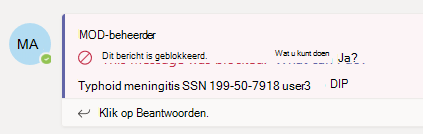
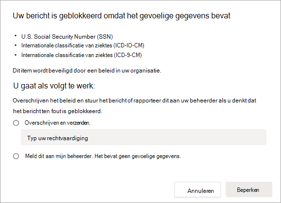
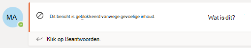
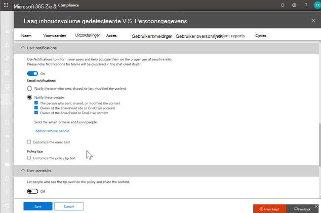
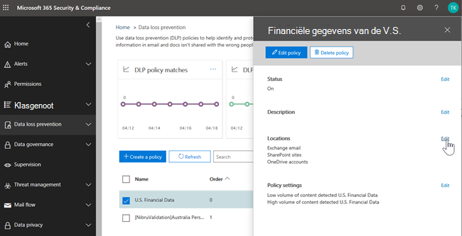
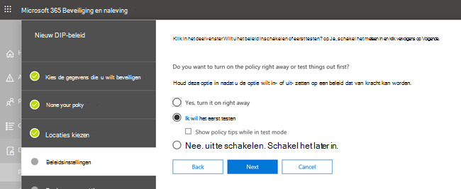
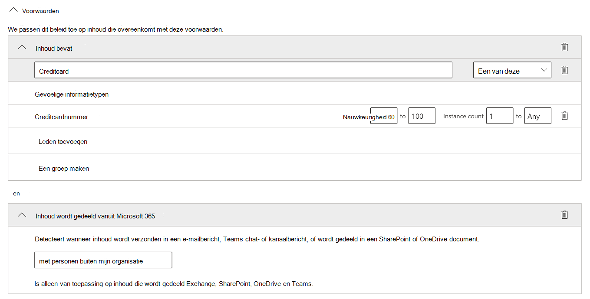
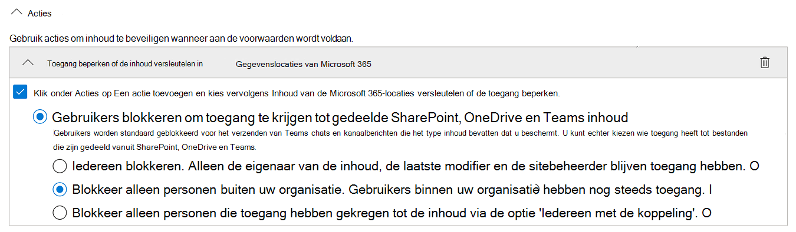
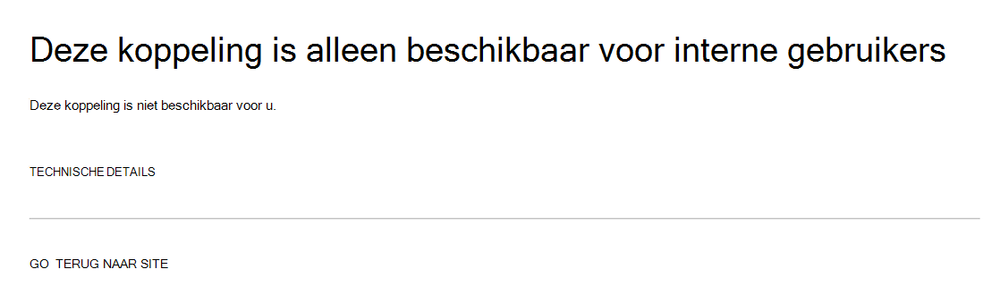

# Preventie en preventie van gegevensverlies Microsoft Teams

Als uw organisatie beschikt over preventie van gegevensverlies (DLP), kunt u beleidsregels definiëren om te voorkomen dat personen gevoelige informatie delen in een Microsoft Teams kanaal of chatsessie. Hier zijn enkele voorbeelden van hoe deze beveiliging werkt:

- **Voorbeeld 1: Gevoelige informatie in berichten beveiligen.** Stel dat iemand gevoelige informatie probeert te delen in een Teams of kanaal met gasten (externe gebruikers). Als u een DLP-beleid hebt gedefinieerd om dit te voorkomen, worden berichten met gevoelige informatie die naar externe gebruikers worden verzonden, verwijderd. Dit gebeurt automatisch en binnen enkele seconden, afhankelijk van hoe uw DLP-beleid is geconfigureerd.

    > [!NOTE]
    > DLP voor Microsoft Teams blokkeert gevoelige inhoud wanneer deze wordt gedeeld met Microsoft Teams gebruikers die: - [gasttoegang](/MicrosoftTeams/guest-access) in teams en kanalen; of - [externe toegang](/MicrosoftTeams/manage-external-access) in vergaderingen en chatsessies. 
DLP voor externe chatsessies werkt alleen als zowel de afzender als de ontvanger zich in de Teams Alleen-modus en Microsoft Teams [eigen federatie](/microsoftteams/manage-external-access). DLP voor Teams blokkeert geen berichten in [interop](/microsoftteams/teams-and-skypeforbusiness-coexistence-and-interoperability#interoperability-of-teams-and-skype-for-business) met Skype voor Bedrijven of niet-native federatief chatsessies.

- **Voorbeeld 2: Gevoelige informatie in documenten beveiligen.** Stel dat iemand een document probeert te delen met gasten in een Microsoft Teams of chat en dat het document gevoelige informatie bevat. Als u een DLP-beleid hebt gedefinieerd om dit te voorkomen, wordt het document niet geopend voor deze gebruikers. Uw DLP-beleid moet SharePoint en OneDrive om de beveiliging te kunnen garanderen. Dit is een voorbeeld van DLP voor SharePoint dat wordt vermeld in Microsoft Teams en daarom vereist dat gebruikers een licentie hebben voor Office 365 DLP (opgenomen in Office 365 E3), maar dat gebruikers geen licentie moeten hebben voor Office 365 Advanced Compliance.)

## DLP-licenties voor Microsoft Teams

[Mogelijkheden voor preventie van gegevensverlies](dlp-learn-about-dlp.md) zijn uitgebreid met Microsoft Teams chat- en kanaalberichten, inclusief **privékanaalberichten** voor:

- Office 365 E5/A5
- Microsoft 365 E5/A5
- Microsoft 365 Informatiebeveiliging en beheer
- Office 365 Advanced Compliance

Office 365 en Microsoft 365 E3 DLP-beveiliging voor SharePoint Online, OneDrive en Exchange Online. Dit geldt ook voor bestanden die worden gedeeld via Teams omdat Teams online SharePoint en OneDrive om bestanden te delen.

Ondersteuning voor DLP-beveiliging in Teams Chat vereist E5.

Zie voor meer informatie over licentievereisten [Microsoft 365 Tenant-Level Services Licensing Guidance](https://docs.microsoft.com/office365/servicedescriptions/microsoft-365-service-descriptions/microsoft-365-tenantlevel-services-licensing-guidance/microsoft-365-security-compliance-licensing-guidance).

> [!IMPORTANT]
> DLP is alleen van toepassing op de werkelijke berichten in de chat- of kanaalthread. Activiteitsmeldingen, die een kort voorbeeld van een bericht bevatten  en worden weergegeven op basis van de meldingsinstellingen van een gebruiker, worden niet opgenomen in Teams DLP. Alle gevoelige informatie die aanwezig is in het deel van het bericht dat in het voorbeeld wordt weergegeven, blijft zichtbaar in de melding, zelfs nadat het DLP-beleid is toegepast en gevoelige informatie het bericht zelf heeft verwijderd.

## Bereik van DLP-beveiliging

DLP-beveiliging wordt anders toegepast op Teams entiteiten.

|Gebruikersaccounts/groepen/lijst  |Teams Entiteit |DLP-beveiliging beschikbaar|
|---------|---------|---------|
|afzonderlijke gebruikersaccounts     |1:1/n chats         |ja         |
|     |algemene chats         |nee         |
|     |gedeelde kanalen         |nee         |
|     |privékanalen         |ja         |
|beveiligingsgroepen/distributielijsten  | 1:1/n chats         |ja         |
|     |algemene chats         |nee         |
|     |gedeelde kanalen         |nee      |
|     |privékanalen         |ja        |
|Microsoft 365 groep    |1:1/n chats          |nee         |
|     |algemene chats          |ja        |
|     |gedeelde kanalen|ja |
|     |privékanalen|nee| 

## Beleidstips helpen gebruikers op te leiden

Net zoals DLP werkt in [Exchange, Outlook, Outlook](data-loss-prevention-policies.md#policy-evaluation-in-exchange-online-outlook-and-outlook-on-the-web)op het web, [SharePoint Online, OneDrive voor Bedrijven-sites](data-loss-prevention-policies.md#policy-evaluation-in-onedrive-for-business-and-sharepoint-online-sites)en [Office-bureaubladcl clients,](data-loss-prevention-policies.md#policy-evaluation-in-the-office-desktop-programs)worden beleidstips weergegeven wanneer een actie wordt triggers met een DLP-beleid. Hier is een voorbeeld van een beleidstip:

Hier heeft de afzender geprobeerd een sociaal-zekerheidsnummer te delen in een Microsoft Teams kanaal. Met **de koppeling Wat kan ik doen?** wordt een dialoogvenster geopend met opties voor de afzender om het probleem op te lossen. De afzender kan ervoor kiezen om het beleid te overschrijven of een beheerder op de hoogte te stellen om het te controleren en op te lossen.

In uw organisatie kunt u ervoor kiezen om gebruikers toe te staan een DLP-beleid te overschrijven. Wanneer u uw DLP-beleid configureert, kunt u de standaardbeleidstips gebruiken of [beleidstips voor](#to-customize-policy-tips) uw organisatie aanpassen.

Als u teruggaat naar ons voorbeeld, waar een afzender een sociaal-zekerheidsnummer heeft gedeeld in een Teams kanaal, ziet de geadresseerde het volgende:

> [!div class="mx-imgBorder"]
> 

### Beleidstips aanpassen

Als u deze taak wilt uitvoeren, moet u een rol toegewezen krijgen die machtigingen heeft om DLP-beleid te bewerken. Zie Machtigingen [voor meer informatie.](data-loss-prevention-policies.md#permissions)

1. Ga naar het Compliancecentrum [https://compliance.microsoft.com](https://compliance.microsoft.com) () en meld u aan.

2. Kies **Beleid voor preventie van**  >  **gegevensverlies.**

3. Selecteer een beleid en kies naast **Beleidsinstellingen** de optie **Bewerken.**

4. Maak een nieuwe regel of bewerk een bestaande regel voor het beleid.

    > [!div class="mx-imgBorder"]
    > 

5. Selecteer op **het tabblad Gebruikersmeldingen** **de optie De e-mailtekst aanpassen** en/of De **tekstopties voor beleidstips** aanpassen.

    > [!div class="mx-imgBorder"]
    >    

6. Geef de tekst op die u wilt gebruiken voor e-mailmeldingen en/of beleidstips en kies **opslaan.**

7. Kies opslaan **op het tabblad** Beleidsinstellingen. 

Sta ongeveer één uur toe dat uw wijzigingen hun weg vinden in uw datacenter en worden gesynchroniseerd met gebruikersaccounts.
 <!-- why are these syncing to user accounts? -->

## Een Microsoft Teams als locatie toevoegen aan bestaand DLP-beleid

Als u deze taak wilt uitvoeren, moet u een rol toegewezen krijgen die machtigingen heeft om DLP-beleid te bewerken. Zie Machtigingen [voor meer informatie.](data-loss-prevention-policies.md#permissions)

1. Ga naar het Compliancecentrum [https://compliance.microsoft.com](https://compliance.microsoft.com) () en meld u aan.

2. Kies **Beleid voor preventie van**  >  **gegevensverlies.**

3. Selecteer een beleid en bekijk de waarden onder **Locaties.** Als u **chat- Teams en kanaalberichten** ziet, bent u klaar. Als u dit niet hebt, klikt u op **Bewerken.**

    > [!div class="mx-imgBorder"]
    > 

4. Schakel in **de** kolom Status het beleid in voor Teams **chat- en kanaalberichten.**

    > [!div class="mx-imgBorder"]
    > 

5. Houd op **het tabblad** Locaties kiezen de standaardinstelling van alle accounts of selecteer Laat me specifieke **locaties kiezen.** U kunt het volgende opgeven:

    1. maximaal 1000 afzonderlijke accounts om accounts op te nemen of uit te sluiten
    1. distributielijsten en beveiligingsgroepen die u wilt opnemen of uitsluiten. 
    <!-- 1. the shared mailbox of a shared channel. **This is a public preview feature.**--> 
    
6. Kies vervolgens **Volgende**.

7. Klik op **Opslaan**.

Sta ongeveer één uur toe dat uw wijzigingen hun weg vinden in uw datacenter en worden gesynchroniseerd met gebruikersaccounts.
<!-- again, why user accounts? -->

## Een nieuw DLP-beleid definiëren voor Microsoft Teams

Als u deze taak wilt uitvoeren, moet u een rol toegewezen krijgen die machtigingen heeft om DLP-beleid te bewerken. Zie Machtigingen [voor meer informatie.](data-loss-prevention-policies.md#permissions)

1. Ga naar het Compliancecentrum [https://compliance.microsoft.com](https://compliance.microsoft.com) () en meld u aan.

2. Kies **Beleid voor preventie van**  >    >  **gegevensverlies + Een beleid maken.**

3. Kies een [sjabloon](data-loss-prevention-policies.md#dlp-policy-templates)en kies vervolgens **Volgende.**

    In ons voorbeeld hebben we de sjabloon Voor persoonlijke gegevens in de VERENIGDE Staten gekozen.

    > [!div class="mx-imgBorder"]
    >  

4. Geef op **het tabblad Naam** uw beleid een naam en beschrijving op voor het beleid en kies **volgende**.

5. Houd op **het tabblad** Locaties kiezen de standaardinstelling van alle accounts of selecteer Laat me specifieke **locaties kiezen.** U kunt het volgende opgeven:

    1. maximaal 1000 afzonderlijke accounts om accounts op te nemen of uit te sluiten
    1. distributielijsten en beveiligingsgroepen die u wilt opnemen of uitsluiten. **Dit is een openbare preview-functie.**
    <!-- 1. the shared mailbox of a shared channel. **This is a public preview feature.**-->  

    

    > [!NOTE]
    > Als u wilt controleren of documenten met gevoelige informatie niet ongepast worden gedeeld in Teams, moet u ervoor zorgen dat **SharePoint-sites** en **OneDrive-accounts** zijn ingeschakeld, samen met **Teams chat-** en kanaalberichten.

6. Ga op **het tabblad Beleidsinstellingen** naar **Het type inhoud** aanpassen dat u wilt beveiligen, bewaar de standaard eenvoudige instellingen of kies Geavanceerde instellingen gebruiken **en** kies **volgende.** Als u geavanceerde instellingen kiest, kunt u regels voor uw beleid maken of bewerken. Zie Eenvoudige instellingen versus geavanceerde instellingen voor hulp [bij dit alles.](data-loss-prevention-policies.md#simple-settings-vs-advanced-settings)

7.  Bekijk op **het tabblad** Beleidsinstellingen onder Wat wilt u doen als we gevoelige **informatie detecteren?** de instellingen. Hier kunt u ervoor kiezen om standaardbeleidstips en e-mailmeldingen te bewaren of deze aan te passen.

    > [!div class="mx-imgBorder"]
    > 

    Wanneer u klaar bent met het controleren of bewerken van instellingen, kiest u **Volgende.**

8. Kies  op het tabblad Beleidsinstellingen onder Wilt u eerst het beleid in- of **testen?**, kies of u het beleid wilt in- of [uitschakelen,](dlp-overview-plan-for-dlp.md#policy-deployment)test het eerst of u het nu wilt uitschakelen en kies vervolgens **Volgende**.

    > [!div class="mx-imgBorder"]
    > 

9. Bekijk op **het tabblad** Uw instellingen controleren de instellingen voor uw nieuwe beleid. Kies **Bewerken om** wijzigingen aan te brengen. Wanneer u klaar bent, kiest u **Maken.**

Sta ongeveer één uur toe dat uw nieuwe beleid zijn weg door uw datacenter kan vinden en kan worden gesynchroniseerd met gebruikersaccounts.

## Externe toegang tot gevoelige documenten voorkomen

Als u wilt SharePoint documenten die gevoelige informatie bevatten, standaard niet kunnen worden gebruikt door externe gasten, SharePoint of Teams, selecteert u het volgende:

- U kunt ervoor zorgen dat documenten worden beveiligd totdat DLP ze scant en markeert als veilig om te delen door nieuwe bestanden standaard als [gevoelig te markeren.](/sharepoint/sensitive-by-default)

- Aanbevolen DLP-beleidsstructuur

    - **Voorwaarden**
        - Inhoud bevat een van deze gevoelige informatietypen: [Selecteer alles wat van toepassing is]
        
        - Inhoud wordt gedeeld vanuit Microsoft 365 met personen buiten mijn organisatie
        
          > [!div class="mx-imgBorder"]
          > 

    - **Acties**
        - Toegang tot de inhoud voor externe gebruikers beperken
        
        - Gebruikers op de hoogte stellen met e-mail- en beleidstips
        
        - Incidentrapporten verzenden naar de beheerder
        
        > [!div class="mx-imgBorder"]
        > 

DLP-beleid in actie bij het delen van een document in SharePoint met gevoelige informatie met een externe gast:

> [!div class="mx-imgBorder"]
> 

DLP-beleid in actie wanneer gast probeert een document te openen in Teams met extern blokkeren:

> [!div class="mx-imgBorder"]
> 

## Verwante artikelen

- [Een DLP-beleid maken, testen en afstemmen](create-test-tune-dlp-policy.md)
- [Send email notifications and show policy tips for DLP policies](use-notifications-and-policy-tips.md) (E-mailmeldingen verzenden en beleidstips tonen voor DLP-beleid)
