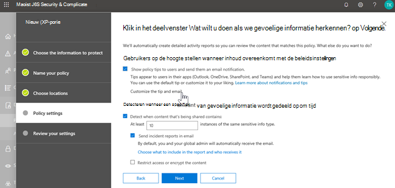

# Preventie en Microsoft Teams van gegevensverlies

> [!NOTE]
> Mogelijkheden voor het voorkomen van gegevensverlies zijn onlangs toegevoegd aan Microsoft Teams chat- en kanaalberichten voor gebruikers met een licentie voor Office 365 E5/A5, Microsoft 365 E5/A5, Microsoft 365 Information Protection and Governance of Office 365 Advanced Compliance. Office 365 en Microsoft 365 E3 omvatten DLP-bescherming voor SharePoint Online, OneDrive en Exchange Online. Dit omvat ook bestanden die via Teams worden gedeeld omdat Teams SharePoint Online gebruikt en OneDrive om bestanden te delen.
Ondersteuning voor DLP-beveiliging in Teams Chat vereist E5.
Zie [Microsoft 365 Tenant-Level Licensing Guidance](/office365/servicedescriptions/microsoft-365-service-descriptions/microsoft-365-tenantlevel-services-licensing-guidance)voor services voor meer informatie over licentievereisten.

## Overzicht van DLP voor Microsoft Teams

Onlangs zijn de mogelijkheden [voor het voorkomen van gegevensverlies](dlp-learn-about-dlp.md) uitgebreid met Microsoft Teams chat- en kanaalberichten, waaronder berichten op **privékanaal .** 

> [!IMPORTANT]
> DLP is momenteel alleen van toepassing op de werkelijke berichten in de chat- of kanaalthread. Activiteitsmeldingen - die een korte berichtvoorbeeld bevatten en worden weergegeven op basis van de meldingsinstellingen van een gebruiker - zijn op dit moment **niet** opgenomen in Teams DLP. Alle gevoelige informatie in het deel van het bericht dat in het voorbeeld wordt weergegeven, blijft zichtbaar in de melding, zelfs nadat het DLP-beleid is toegepast en gevoelige informatie is verwijderd.

Als uw organisatie DLP heeft, kunt u nu beleid definiëren waarmee wordt voorkomen dat mensen gevoelige informatie delen in een Microsoft Teams kanaal of chatsessie. Hier zijn enkele voorbeelden van hoe deze bescherming werkt:

- **Voorbeeld 1: Gevoelige informatie in berichten beveiligen**. Stel dat iemand probeert gevoelige informatie te delen in een Teams chat of kanaal met gasten (externe gebruikers). Als u een DLP-beleid hebt gedefinieerd om dit te voorkomen, worden berichten met gevoelige informatie die naar externe gebruikers worden verzonden, verwijderd. Dit gebeurt automatisch en binnen enkele seconden, afhankelijk van hoe uw DLP-beleid is geconfigureerd.

    > [!NOTE]
    > DLP voor Microsoft Teams blokkeert gevoelige inhoud wanneer deze wordt gedeeld met Microsoft Teams gebruikers die: - [gasttoegang](/MicrosoftTeams/guest-access) in teams en kanalen; of - [externe toegang](/MicrosoftTeams/manage-external-access) in vergaderingen en chatsessies. 
DLP voor externe chatsessies werkt alleen als zowel de afzender als de ontvanger zich in Teams only-modus bevinden en [Microsoft Teams native federatie](/microsoftteams/manage-external-access)gebruiken. DLP voor Teams blokkeert geen berichten in [interop](/microsoftteams/teams-and-skypeforbusiness-coexistence-and-interoperability#interoperability-of-teams-and-skype-for-business) met Skype voor Bedrijven of niet-native federatieve chatsessies.

- **Voorbeeld 2: Gevoelige informatie in documenten beschermen**. Stel dat iemand probeert een document te delen met gasten in een Microsoft Teams kanaal of chat, en het document gevoelige informatie bevat. Als u een DLP-beleid hebt gedefinieerd om dit te voorkomen, wordt het document niet geopend voor deze gebruikers. Houd er rekening mee dat uw DLP-beleid in dit geval SharePoint en OneDrive moet bevatten om bescherming te kunnen bieden. (Dit is een voorbeeld van DLP voor SharePoint dat in Microsoft Teams wordt weergegeven en vereist daarom dat gebruikers een licentie hebben voor Office 365 DLP (opgenomen in Office 365 E3), maar vereist niet dat gebruikers een licentie hebben voor Office 365 Advanced Compliance.)

## Beleidstips helpen gebruikers op te leiden

Net als bij hoe DLP werkt in [Exchange, Outlook, Outlook op het web,](data-loss-prevention-policies.md#policy-evaluation-in-exchange-online-outlook-and-outlook-on-the-web) [SharePoint Online, OneDrive voor Bedrijven sites](data-loss-prevention-policies.md#policy-evaluation-in-onedrive-for-business-and-sharepoint-online-sites)en Office [desktopclients,](data-loss-prevention-policies.md#policy-evaluation-in-the-office-desktop-programs)worden beleidstips weergegeven wanneer een actie conflicteert met een DLP-beleid. Hier is een voorbeeld van een beleidstip:

In dit geval probeerde de afzender een burgerservicenummer te delen in een Microsoft Teams kanaal. De koppeling **Wat kan ik doen?** opent een dialoogvenster met opties voor de afzender om het probleem op te lossen. In dit geval kan de afzender ervoor kiezen om het beleid te overschrijven of een beheerder op de hoogte te stellen om het te controleren en op te lossen.

In uw organisatie kunt u ervoor kiezen om gebruikers toe te staan een DLP-beleid te overschrijven. En wanneer u uw DLP-beleid configureert, kunt u de standaardbeleidstips gebruiken of [beleidstips](#to-customize-policy-tips) voor uw organisatie aanpassen.

Terugkomend op ons voorbeeld, waar een afzender een burgerservicenummer deelde in een Teams kanaal, is dit wat de ontvanger zag:

> [!div class="mx-imgBorder"]
> 

### Beleidstips aanpassen

Als u deze taak wilt uitvoeren, moet u een rol toegewezen krijgen met machtigingen om DLP-beleid te bewerken. Zie Machtigingen voor meer [informatie.](data-loss-prevention-policies.md#permissions)

1. Ga naar het Security & Compliance Center ( [https://protection.office.com](https://protection.office.com) ) en meld u aan.

2. Kies **Beleid ter voorkoming van**  >  **gegevensverlies**.

3. Selecteer een beleid en kies naast **Beleidsinstellingen** de optie **Bewerken**.

4. Maak een nieuwe regel of bewerk een bestaande regel voor het beleid.

    > [!div class="mx-imgBorder"]
    > 

5. Selecteer op het tabblad **Gebruikersmeldingen** de optie **De e-mailtekst aanpassen** en/of De **tekstopties voor beleidstips aanpassen.**

    > [!div class="mx-imgBorder"]
    >    

6. Geef de tekst op die u wilt gebruiken voor e-mailmeldingen en/of beleidstips en **kies** Opslaan .

7. **Kies** Opslaan op het tabblad **Beleidsinstellingen** .

Laat uw wijzigingen ongeveer een uur duren om zich een weg te banen door uw datacenter en te synchroniseren met gebruikersaccounts.
 <!-- why are these syncing to user accounts? -->

## Microsoft Teams als locatie toevoegen aan bestaand DLP-beleid

Als u deze taak wilt uitvoeren, moet u een rol toegewezen krijgen met machtigingen om DLP-beleid te bewerken. Zie Machtigingen voor meer [informatie.](data-loss-prevention-policies.md#permissions)

1. Ga naar het Security & Compliance Center ( [https://protection.office.com](https://protection.office.com) ) en meld u aan.

2. Kies **Beleid ter voorkoming van**  >  **gegevensverlies**.

3. Selecteer een beleid en bekijk de waarden onder **Locaties**. Als je **Teams chat- en kanaalberichten** ziet, ben je helemaal klaar. Als u dit niet doet, klikt u op **Bewerken**.

    > [!div class="mx-imgBorder"]
    > 

4. Schakel in de kolom **Status** het beleid in voor **Teams chat- en kanaalberichten**.

    > [!div class="mx-imgBorder"]
    > 

5. Houd **op** het tabblad Locaties kiezen de standaardinstelling van alle accounts bij of selecteer **Laat me specifieke locaties kiezen**. U kunt het volgende opgeven:

    1. maximaal 1000 afzonderlijke accounts om op te nemen of uit te sluiten
    1. distributielijsten en beveiligingsgroepen die moeten worden opgenomen of uitgesloten. 
    <!-- 1. the shared mailbox of a shared channel. **This is a public preview feature.**--> 
    
6. Kies vervolgens **Volgende**.

7. Klik op **Opslaan**.

Laat uw wijzigingen ongeveer een uur duren om zich een weg te banen door uw datacenter en te synchroniseren met gebruikersaccounts.
<!-- again, why user accounts? -->

## Een nieuw DLP-beleid voor Microsoft Teams definiëren

Als u deze taak wilt uitvoeren, moet u een rol toegewezen krijgen met machtigingen om DLP-beleid te bewerken. Zie Machtigingen voor meer [informatie.](data-loss-prevention-policies.md#permissions)

1. Ga naar het Security & Compliance Center ( [https://protection.office.com](https://protection.office.com) ) en meld u aan.

2. Kies **Beleid ter voorkoming van**  >  **gegevensverlies**  >  **+ Maak een beleid**.

3. Kies een [sjabloon](data-loss-prevention-policies.md#dlp-policy-templates)en kies **Volgende**.

    In ons voorbeeld hebben we de sjabloon voor persoonlijk identificeerbare informatiegegevens in de VS gekozen.

    > [!div class="mx-imgBorder"]
    >  

4. Geef op het tabblad **Naam van uw beleid** een naam en beschrijving op voor het beleid en kies **Volgende**.

5. Houd **op** het tabblad Locaties kiezen de standaardinstelling van alle accounts bij of selecteer **Laat me specifieke locaties kiezen**. U kunt het volgende opgeven:

    1. maximaal 1000 afzonderlijke accounts om op te nemen of uit te sluiten
    1. distributielijsten en beveiligingsgroepen die moeten worden opgenomen of uitgesloten. **Dit is een openbare preview-functie.**
    <!-- 1. the shared mailbox of a shared channel. **This is a public preview feature.**-->  

    

    > [!NOTE]
    > Als u ervoor wilt zorgen dat documenten met gevoelige informatie niet onjuist worden gedeeld in Teams, moet u ervoor zorgen dat **SharePoint sites** en **OneDrive accounts** zijn ingeschakeld, samen met **Teams chat- en kanaalberichten**.

6. Houd op het tabblad **Beleidsinstellingen** onder **Het type inhoud aanpassen dat u wilt beveiligen** de standaardinstellingen voor eenvoudig of kies Geavanceerde instellingen **gebruiken** en kies **Vervolgens Volgende**. Als u geavanceerde instellingen kiest, kunt u regels voor uw beleid maken of bewerken. (Zie [Eenvoudige instellingen versus geavanceerde instellingen](data-loss-prevention-policies.md#simple-settings-vs-advanced-settings)voor hulp hierbij.)

7.  Controleer op het tabblad **Beleidsinstellingen** onder **Wat wilt u doen als we gevoelige informatie detecteren?** de instellingen. (Hier kunt u ervoor kiezen om [standaardbeleidstips en e-mailmeldingen](use-notifications-and-policy-tips.md)te bewaren of aan te passen.)

    > [!div class="mx-imgBorder"]
    > 

    Wanneer u klaar bent met het controleren of bewerken van instellingen, kiest u **Volgende**.

8. Kies op het tabblad **Beleidsinstellingen** onder **Wilt u het beleid inschakelen of eerst dingen testen?**, kiest u of u het beleid wilt inschakelen, eerst wilt [testen](dlp-overview-plan-for-dlp.md#policy-deployment)of voorlopig wilt uitschakelen en kiest u vervolgens **Volgende**.

    > [!div class="mx-imgBorder"]
    > 

9. Controleer op het tabblad **Uw instellingen** controleren de instellingen voor uw nieuwe beleid. Kies **Bewerken** om wijzigingen aan te brengen. Wanneer u klaar bent, kiest u **Maken**.

Laat uw nieuwe beleid zich ongeveer een uur door uw datacenter werken en synchroniseren met gebruikersaccounts.

## Externe toegang tot gevoelige documenten voorkomen

Als u ervoor wilt zorgen dat SharePoint documenten die gevoelige informatie bevatten, niet standaard toegankelijk zijn voor externe gasten vanuit SharePoint of Teams, selecteert u het volgende:

- U kunt ervoor zorgen dat documenten worden beveiligd totdat DLP ze scant en markeert als veilig om te delen door [nieuwe bestanden standaard als gevoelig te markeren.](/sharepoint/sensitive-by-default)

- Aanbevolen DLP-beleidsstructuur

    - **Voorwaarden**
        - Inhoud bevat een van deze gevoelige informatietypen: [Selecteer alles wat van toepassing is]
        
        - Content wordt vanuit Microsoft 365 gedeeld met mensen buiten mijn organisatie
        
          > [!div class="mx-imgBorder"]
          > 

    - **Acties**
        - De toegang tot de inhoud beperken voor externe gebruikers
        
        - Gebruikers op de hoogte stellen met e-mail en beleidstips
        
        - Incidentrapporten verzenden naar de beheerder
        
        > [!div class="mx-imgBorder"]
        > 

DLP-beleid in actie wanneer u probeert een document te delen in SharePoint dat gevoelige informatie bevat met een externe gast:

> [!div class="mx-imgBorder"]
> 

DLP-beleid in actie wanneer gasten een document proberen te openen in Teams met extern blokkeren:

> [!div class="mx-imgBorder"]
> 

## Verwante artikelen

[Een DLP-beleid maken, testen en afstemmen](create-test-tune-dlp-policy.md)

[Send email notifications and show policy tips for DLP policies](use-notifications-and-policy-tips.md) (E-mailmeldingen verzenden en beleidstips tonen voor DLP-beleid)
