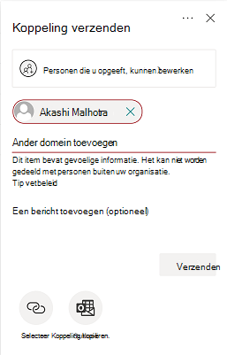

# Preventie en preventie van gegevensverlies Microsoft TeamsData loss prevention and Microsoft Teams

> [!NOTE]
> Mogelijkheden voor preventie van gegevensverlies zijn onlangs toegevoegd aan Microsoft Teams chat- en kanaalberichten voor gebruikers met een licentie voor Office 365 E5/A5, Microsoft 365 E5/A5, Microsoft 365 Information Protection en Governance of Office 365 Advanced Compliance.Data loss prevention capabilities were recently added to Microsoft Teams chat and channel messages for users licensed for Office 365 E5/A5, Microsoft 365 E5/A5, Microsoft 365 Information Protection and Governance or Office 365 Advanced Compliance. Office 365 en Microsoft 365 E3 DLP-beveiliging voor SharePoint Online, OneDrive en Exchange Online.Office 365 and Microsoft 365 E3 include DLP protection for SharePoint Online, OneDrive, and Exchange Online. Dit geldt ook voor bestanden die worden gedeeld via Teams omdat Teams online SharePoint en OneDrive om bestanden te delen.This also includes files that are shared through Teams because Teams uses SharePoint Online and OneDrive to share files.
Ondersteuning voor DLP-beveiliging in Teams Chat vereist E5.Support for DLP protection in Teams Chat requires E5.
Zie voor meer informatie over licentievereisten [Microsoft 365 Tenant-Level Services Licensing Guidance](/office365/servicedescriptions/microsoft-365-service-descriptions/microsoft-365-tenantlevel-services-licensing-guidance).To learn more about licensing requirements, see [Microsoft 365 Tenant-Level Services Licensing Guidance](/office365/servicedescriptions/microsoft-365-service-descriptions/microsoft-365-tenantlevel-services-licensing-guidance).

## Overzicht van DLP voor Microsoft TeamsOverview of DLP for Microsoft Teams

Onlangs zijn [de mogelijkheden voor preventie](dlp-learn-about-dlp.md) van gegevensverlies uitgebreid met Microsoft Teams chat- en kanaalberichten, inclusief **privékanaalberichten.**Recently, [data loss prevention](dlp-learn-about-dlp.md) capabilities were extended to include Microsoft Teams chat and channel messages, **including private channel messages**. 

> [!IMPORTANT]
> DLP is momenteel alleen van toepassing op de werkelijke berichten in de chat- of kanaalthread.DLP currently applies only to the actual messages in the chat or channel thread. Activiteitsmeldingen, die een kort voorbeeld van een bericht bevatten  en worden weergegeven op basis van de meldingsinstellingen van een gebruiker, worden op dit moment niet opgenomen in Teams DLP.Activity notifications -- which include a short message preview and appear based on a user's notification settings -- are **not** included in Teams DLP at this time. Alle gevoelige informatie die aanwezig is in het deel van het bericht dat in het voorbeeld wordt weergegeven, blijft zichtbaar in de melding, zelfs nadat het DLP-beleid is toegepast en gevoelige informatie het bericht zelf heeft verwijderd.Any sensitive information present in the part of the message that appears in the preview will remain visible in the notification even after the DLP policy has been applied and removed sensitive information the message itself.

Als uw organisatie DLP heeft, kunt u nu beleidsregels definiëren om te voorkomen dat personen gevoelige informatie delen in een Microsoft Teams kanaal of chatsessie.If your organization has DLP, you can now define policies that prevent people from sharing sensitive information in a Microsoft Teams channel or chat session. Hier zijn enkele voorbeelden van hoe deze beveiliging werkt:Here are some examples of how this protection works:

- **Voorbeeld 1: Gevoelige informatie in berichten beveiligen.****Example 1: Protecting sensitive information in messages**. Stel dat iemand gevoelige informatie probeert te delen in een Teams of kanaal met gasten (externe gebruikers).Suppose that someone attempts to share sensitive information in a Teams chat or channel with guests (external users). Als u een DLP-beleid hebt gedefinieerd om dit te voorkomen, worden berichten met gevoelige informatie die naar externe gebruikers worden verzonden, verwijderd.If you have a DLP policy defined to prevent this, messages with sensitive information that are sent to external users are deleted. Dit gebeurt automatisch en binnen enkele seconden, afhankelijk van hoe uw DLP-beleid is geconfigureerd.This happens automatically, and within seconds, according to how your DLP policy is configured.

    > [!NOTE]
    > DLP voor Microsoft Teams blokkeert gevoelige inhoud wanneer deze wordt gedeeld met Microsoft Teams gebruikers die:DLP for Microsoft Teams blocks sensitive content when shared with Microsoft Teams users who have: - [gasttoegang](/MicrosoftTeams/guest-access) in teams en kanalen; of- [guest access](/MicrosoftTeams/guest-access) in teams and channels; or - [externe toegang](/MicrosoftTeams/manage-external-access) in vergaderingen en chatsessies.- [external access](/MicrosoftTeams/manage-external-access) in meetings and chat sessions. 
DLP voor externe chatsessies werkt alleen als zowel de afzender als de ontvanger zich in de Teams Alleen-modus en Microsoft Teams [eigen federatie](/microsoftteams/manage-external-access).DLP for external chat sessions will only work if both the sender and the receiver are in Teams Only mode and using [Microsoft Teams native federation](/microsoftteams/manage-external-access). DLP voor Teams blokkeert geen berichten in [interop](/microsoftteams/teams-and-skypeforbusiness-coexistence-and-interoperability#interoperability-of-teams-and-skype-for-business) met Skype voor Bedrijven of niet-native federatief chatsessies.DLP for Teams does not block messages in [interop](/microsoftteams/teams-and-skypeforbusiness-coexistence-and-interoperability#interoperability-of-teams-and-skype-for-business) with Skype for Business or non-native federated chat sessions.

- **Voorbeeld 2: Gevoelige informatie in documenten beveiligen.****Example 2: Protecting sensitive information in documents**. Stel dat iemand een document probeert te delen met gasten in een Microsoft Teams of chat en dat het document gevoelige informatie bevat.Suppose that someone attempts to share a document with guests in a Microsoft Teams channel or chat, and the document contains sensitive information. Als u een DLP-beleid hebt gedefinieerd om dit te voorkomen, wordt het document niet geopend voor deze gebruikers.If you have a DLP policy defined to prevent this, the document won't open for those users. Houd er rekening mee dat in dit geval uw DLP-beleid SharePoint en OneDrive om de beveiliging te kunnen garanderen.Note that in this case, your DLP policy must include SharePoint and OneDrive in order for protection to be in place. (Dit is een voorbeeld van DLP voor SharePoint dat wordt vermeld in Microsoft Teams en daarom vereist dat gebruikers een licentie hebben voor Office 365 DLP (opgenomen in Office 365 E3), maar dat gebruikers geen licentie voor Office 365 Advanced Compliance hebben.)(This is an example of DLP for SharePoint that shows up in Microsoft Teams, and therefore requires that users are licensed for Office 365 DLP (included in Office 365 E3), but does not require users to be licensed for Office 365 Advanced Compliance.)

## Beleidstips helpen gebruikers op te leidenPolicy tips help educate users

Net als bij hoe DLP werkt in [Exchange Outlook, Outlook](data-loss-prevention-policies.md#policy-evaluation-in-exchange-online-outlook-and-outlook-on-the-web)op het web, [SharePoint Online, OneDrive voor Bedrijven-sites](data-loss-prevention-policies.md#policy-evaluation-in-onedrive-for-business-and-sharepoint-online-sites)en [Office-bureaubladcl clients,](data-loss-prevention-policies.md#policy-evaluation-in-the-office-desktop-programs)worden beleidstips weergegeven wanneer een actie in strijd is met een DLP-beleid.Similar to how DLP works in [Exchange, Outlook, Outlook on the web](data-loss-prevention-policies.md#policy-evaluation-in-exchange-online-outlook-and-outlook-on-the-web), [SharePoint Online, OneDrive for Business sites](data-loss-prevention-policies.md#policy-evaluation-in-onedrive-for-business-and-sharepoint-online-sites), and [Office desktop clients](data-loss-prevention-policies.md#policy-evaluation-in-the-office-desktop-programs), policy tips appear when an action conflicts with a DLP policy. Hier is een voorbeeld van een beleidstip:Here's an example of a policy tip:

In dit geval heeft de afzender geprobeerd een sociaal-zekerheidsnummer te delen in een Microsoft Teams kanaal.In this case, the sender attempted to share a social security number in a Microsoft Teams channel. Met **de koppeling Wat kan ik doen?** wordt een dialoogvenster geopend met opties voor de afzender om het probleem op te lossen.The **What can I do?** link opens a dialog box that provides options for the sender to resolve the issue. In dit geval kan de afzender ervoor kiezen om het beleid te overschrijven of een beheerder op de hoogte te stellen om het te controleren en op te lossen.Notice that in this case, the sender can opt to override the policy, or notify an admin to review and resolve it.

In uw organisatie kunt u ervoor kiezen om gebruikers toe te staan een DLP-beleid te overschrijven.In your organization, you can choose to allow users to override a DLP policy. En wanneer u uw DLP-beleid configureert, kunt u de standaardbeleidstips gebruiken of [beleidstips voor](#to-customize-policy-tips) uw organisatie aanpassen.And, when you configure your DLP policies, you can use the default policy tips, or [customize policy tips](#to-customize-policy-tips) for your organization.

Als u teruggaat naar ons voorbeeld, waar een afzender een sociaal-zekerheidsnummer heeft gedeeld in een Teams kanaal, ziet de geadresseerde het volgende:Returning to our example, where a sender shared a social security number in a Teams channel, here's what the recipient saw:

> [!div class="mx-imgBorder"]
> 

### Beleidstips aanpassenTo customize policy tips

Als u deze taak wilt uitvoeren, moet u een rol toegewezen krijgen die machtigingen heeft om DLP-beleid te bewerken.To perform this task, you must be assigned a role that has permissions to edit DLP policies. Zie Machtigingen [voor meer informatie.](data-loss-prevention-policies.md#permissions)To learn more, see [Permissions](data-loss-prevention-policies.md#permissions).

1. Ga naar het beveiligingscentrum & compliancecentrum [https://protection.office.com](https://protection.office.com) () en meld u aan.Go to the Security & Compliance Center ([https://protection.office.com](https://protection.office.com)) and sign in.

2. Kies **Beleid voor preventie van**  >  **gegevensverlies.**Choose **Data loss prevention** > **Policy**.

3. Selecteer een beleid en kies naast **Beleidsinstellingen** de optie **Bewerken.**Select a policy, and next to **Policy settings**, choose **Edit**.

4. Maak een nieuwe regel of bewerk een bestaande regel voor het beleid.Either create a new rule, or edit an existing rule for the policy.

    > [!div class="mx-imgBorder"]
    > 

5. Selecteer op **het tabblad Gebruikersmeldingen** **de optie De e-mailtekst aanpassen** en/of De **tekstopties voor beleidstips** aanpassen.On the **User notifications** tab, select **Customize the email text** and/or **Customize the policy tip text** options.

    > [!div class="mx-imgBorder"]
    >    

6. Geef de tekst op die u wilt gebruiken voor e-mailmeldingen en/of beleidstips en kies **opslaan.**Specify the text you want to use for email notifications and/or policy tips, and then choose **Save**.

7. Kies opslaan **op het tabblad** Beleidsinstellingen. On the **Policy settings** tab, choose **Save**.

Sta ongeveer één uur toe dat uw wijzigingen hun weg vinden in uw datacenter en worden gesynchroniseerd met gebruikersaccounts.Allow approximately one hour for your changes to work their way through your data center and sync to user accounts.
 <!-- why are these syncing to user accounts? -->

## Een Microsoft Teams als locatie toevoegen aan bestaand DLP-beleidAdd Microsoft Teams as a location to existing DLP policies

Als u deze taak wilt uitvoeren, moet u een rol toegewezen krijgen die machtigingen heeft om DLP-beleid te bewerken.To perform this task, you must be assigned a role that has permissions to edit DLP policies. Zie Machtigingen [voor meer informatie.](data-loss-prevention-policies.md#permissions)To learn more, see [Permissions](data-loss-prevention-policies.md#permissions).

1. Ga naar het beveiligingscentrum & compliancecentrum [https://protection.office.com](https://protection.office.com) () en meld u aan.Go to the Security & Compliance Center ([https://protection.office.com](https://protection.office.com)) and sign in.

2. Kies **Beleid voor preventie van**  >  **gegevensverlies.**Choose **Data loss prevention** > **Policy**.

3. Selecteer een beleid en bekijk de waarden onder **Locaties.**Select a policy, and look at the values under **Locations**. Als u **chat- Teams en kanaalberichten** ziet, bent u klaar.If you see **Teams chat and channel messages**, you're all set. Als u dit niet hebt, klikt u op **Bewerken.**If you don't, click **Edit**.

    > [!div class="mx-imgBorder"]
    > 

4. Schakel in **de** kolom Status het beleid in voor Teams **chat- en kanaalberichten.**In the **Status** column, turn the policy on for **Teams chat and channel messages**.

    > [!div class="mx-imgBorder"]
    > 

5. Houd op **het tabblad** Locaties kiezen de standaardinstelling van alle accounts of selecteer Laat me specifieke **locaties kiezen.**On the **Choose locations** tab, keep the default setting of all accounts, or select **Let me choose specific locations**. U kunt het volgende opgeven:You can specify:

    1. maximaal 1000 afzonderlijke accounts om accounts op te nemen of uit te sluitenup to 1000 individual accounts to include or exclude
    1. distributielijsten en beveiligingsgroepen die u wilt opnemen of uitsluiten.distribution lists and security groups to include or exclude. 
    <!-- 1. the shared mailbox of a shared channel. **This is a public preview feature.**--> 
    
6. Kies vervolgens **Volgende**.Then choose **Next**.

7. Klik op **Opslaan**.Click **Save**.

Sta ongeveer één uur toe dat uw wijzigingen hun weg vinden in uw datacenter en worden gesynchroniseerd met gebruikersaccounts.Allow approximately one hour for your changes to work their way through your data center and sync to user accounts.
<!-- again, why user accounts? -->

## Een nieuw DLP-beleid definiëren voor Microsoft TeamsDefine a new DLP policy for Microsoft Teams

Als u deze taak wilt uitvoeren, moet u een rol toegewezen krijgen die machtigingen heeft om DLP-beleid te bewerken.To perform this task, you must be assigned a role that has permissions to edit DLP policies. Zie Machtigingen [voor meer informatie.](data-loss-prevention-policies.md#permissions)To learn more, see [Permissions](data-loss-prevention-policies.md#permissions).

1. Ga naar het beveiligingscentrum & compliancecentrum [https://protection.office.com](https://protection.office.com) () en meld u aan.Go to the Security & Compliance Center ([https://protection.office.com](https://protection.office.com)) and sign in.

2. Kies **Beleid voor preventie van**  >    >  **gegevensverlies + Een beleid maken.**Choose **Data loss prevention** > **Policy** > **+ Create a policy**.

3. Kies een [sjabloon](data-loss-prevention-policies.md#dlp-policy-templates)en kies vervolgens **Volgende.**Choose a [template](data-loss-prevention-policies.md#dlp-policy-templates), and then choose **Next**.

    In ons voorbeeld hebben we de sjabloon Voor persoonlijke gegevens in de VERENIGDE Staten gekozen.In our example, we chose the U.S. Personally Identifiable Information Data template.

    > [!div class="mx-imgBorder"]
    >  

4. Geef op **het tabblad Naam** uw beleid een naam en beschrijving op voor het beleid en kies **volgende**.On the **Name your policy** tab, specify a name and description for the policy, and then choose **Next**.

5. Houd op **het tabblad** Locaties kiezen de standaardinstelling van alle accounts of selecteer Laat me specifieke **locaties kiezen.**On the **Choose locations** tab, keep the default setting of all accounts, or select **Let me choose specific locations**. U kunt het volgende opgeven:You can specify:

    1. maximaal 1000 afzonderlijke accounts om accounts op te nemen of uit te sluitenup to 1000 individual accounts to include or exclude
    1. distributielijsten en beveiligingsgroepen die u wilt opnemen of uitsluiten.distribution lists and security groups to include or exclude. **Dit is een openbare preview-functie.****This is a public preview feature.**
    <!-- 1. the shared mailbox of a shared channel. **This is a public preview feature.**-->  

    

    > [!NOTE]
    > Als u wilt controleren of documenten met gevoelige informatie niet ongepast worden gedeeld in Teams, moet u ervoor zorgen dat **SharePoint-sites** en **OneDrive-accounts** zijn ingeschakeld, samen met **Teams chat-** en kanaalberichten.If you want to make sure documents that contain sensitive information are not shared inappropriately in Teams, make sure **SharePoint sites** and **OneDrive accounts** are turned on, along with **Teams chat and channel messages**.

6. Ga op **het tabblad Beleidsinstellingen** naar **Het type inhoud** aanpassen dat u wilt beveiligen, bewaar de standaard eenvoudige instellingen of kies Geavanceerde instellingen gebruiken **en** kies **volgende.**On the **Policy settings** tab, under **Customize the type of content you want to protect**, keep the default simple settings, or choose **Use advanced settings**, and then choose **Next**. Als u geavanceerde instellingen kiest, kunt u regels voor uw beleid maken of bewerken.If you choose advanced settings, you can create or edit rules for your policy. (Zie Eenvoudige instellingen [versus](data-loss-prevention-policies.md#simple-settings-vs-advanced-settings)geavanceerde instellingen voor hulp bij dit alles.)(To get help with this, see [Simple settings vs. advanced settings](data-loss-prevention-policies.md#simple-settings-vs-advanced-settings).)

7.  Bekijk op **het tabblad** Beleidsinstellingen onder Wat wilt u doen als we gevoelige **informatie detecteren?** de instellingen.On the **Policy settings** tab, under **What do you want to do if we detect sensitive info?**, review the settings. (Hier kunt u ervoor kiezen om [standaardbeleidstips](use-notifications-and-policy-tips.md)en e-mailmeldingen te bewaren of deze aan te passen.)(Here's where you can choose to keep default [policy tips and email notifications](use-notifications-and-policy-tips.md), or customize them.)

    > [!div class="mx-imgBorder"]
    > 

    Wanneer u klaar bent met het controleren of bewerken van instellingen, kiest u **Volgende.**When you're finished reviewing or editing settings, choose **Next**.

8. Kies  op het tabblad Beleidsinstellingen onder Wilt u eerst het beleid in- of **testen?**, kies of u het beleid wilt in- of [uitschakelen,](data-loss-prevention-policies.md#roll-out-dlp-policies-gradually-with-test-mode)test het eerst of u het nu wilt uitschakelen en kies vervolgens **Volgende**.On the **Policy settings** tab, under **Do you want to turn on the policy or test things out first?**, choose whether to turn the policy on, [test it first](data-loss-prevention-policies.md#roll-out-dlp-policies-gradually-with-test-mode), or keep it turned off for now, and then choose **Next**.

    > [!div class="mx-imgBorder"]
    > 

9. Bekijk op **het tabblad** Uw instellingen controleren de instellingen voor uw nieuwe beleid.On the **Review your settings** tab, review the settings for your new policy. Kies **Bewerken om** wijzigingen aan te brengen.Choose **Edit** to make changes. Wanneer u klaar bent, kiest u **Maken.**When you're finished, choose **Create**.

Sta ongeveer één uur toe dat uw nieuwe beleid zijn weg door uw datacenter kan vinden en kan worden gesynchroniseerd met gebruikersaccounts.Allow approximately one hour for your new policy to work its way through your data center and sync to user accounts.

## Externe toegang tot gevoelige documenten voorkomenPrevent external access to sensitive documents

Als u wilt SharePoint documenten die gevoelige informatie bevatten, standaard niet kunnen worden gebruikt door externe gasten, SharePoint of Teams, selecteert u het volgende:To ensure that SharePoint documents that contain sensitive information cannot be accessed by external guests either from SharePoint or Teams by default, select the following:

- U kunt ervoor zorgen dat documenten worden beveiligd totdat DLP ze scant en markeert als veilig om te delen door nieuwe bestanden standaard als [gevoelig te markeren.](/sharepoint/sensitive-by-default)You can ensure that documents are protected until DLP scans and marks them as safe to share by [marking new files as sensitive by default](/sharepoint/sensitive-by-default).

- Aanbevolen DLP-beleidsstructuurRecommended DLP policy structure

    - **Voorwaarden****Conditions**
        - Inhoud bevat een van deze gevoelige informatietypen: [Selecteer alles wat van toepassing is]Content contains any of these sensitive information types: [Select all that applies]
        
        - Inhoud wordt gedeeld vanuit Microsoft 365 met personen buiten mijn organisatieContent is shared from Microsoft 365 with people outside my organization
        
          > [!div class="mx-imgBorder"]
          > 

    - **Acties****Actions**
        - Toegang tot de inhoud voor externe gebruikers beperkenRestrict access to the content for external users
        
        - Gebruikers op de hoogte stellen met e-mail- en beleidstipsNotify users with email and policy tips
        
        - Incidentrapporten verzenden naar de beheerderSend incident reports to the Administrator
        
        > [!div class="mx-imgBorder"]
        > 

DLP-beleid in actie bij het delen van een document in SharePoint met gevoelige informatie met een externe gast:DLP policy in action when attempting to share a document in SharePoint that contains sensitive information with an external guest:

> [!div class="mx-imgBorder"]
> 

DLP-beleid in actie wanneer gast probeert een document te openen in Teams met extern blokkeren:DLP policy in action when guest attempts to open a document in Teams with block external:

> [!div class="mx-imgBorder"]
> 

## Verwante artikelenRelated articles

[Een DLP-beleid maken, testen en afstemmenCreate, test, and tune a DLP policy](create-test-tune-dlp-policy.md)

[Send email notifications and show policy tips for DLP policies](use-notifications-and-policy-tips.md) (E-mailmeldingen verzenden en beleidstips tonen voor DLP-beleid)[Send email notifications and show policy tips for DLP policies](use-notifications-and-policy-tips.md)
