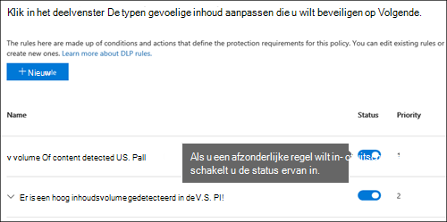

# Plan voor preventie van gegevensverlies (DLP)Plan for data loss prevention (DLP)

Elke organisatie zal de preventie van gegevensverlies (DLP) anders plannen en implementeren, omdat de zakelijke behoeften, doelstellingen, resources en situatie van elke organisatie uniek voor hen zijn.Every organization will plan for and implement data loss prevention (DLP) differently, because every organization's business needs, goals, resources, and situation are unique to them. Er zijn echter elementen die gebruikelijk zijn voor alle succesvolle DLP-implementaties.However, there are elements that are common to all successful DLP implementations. In dit artikel worden de best practices beschreven die worden gebruikt door organisaties in hun DLP-planning.This article presents the best practices that are used by organizations in their DLP planning.

## Meerdere beginpuntenMultiple starting points

Veel organisaties kiezen ervoor om DLP te implementeren om te voldoen aan diverse overheids- of branchevoorschriften.Many organizations choose to implement DLP to comply with various governmental or industry regulations. Bijvoorbeeld de Algemene verordening gegevensbescherming van de Europese Unie (AVG) of de Health Insurance Portability and Accountability Act (HIPAA) of de California Consumer Privacy Act (CTPA).For example, the European Union's General Data Protection Regulation (GDPR), or the Health Insurance Portability and Accountability Act (HIPAA), or the California Consumer Privacy Act (CCPA). Ze implementeren ook preventie van gegevensverlies om hun intellectuele eigendom te beschermen.They also implement data loss prevention to protect their intellectual property. Maar de beginplaats en uiteindelijke bestemming in de DLP-reis variëren.But the starting place and ultimate destination in the DLP journey vary. 

Organisaties kunnen hun DLP-reis starten:Organizations can start their DLP journey:

- vanuit een platformfocus, zoals informatie in chat- en kanaalberichten Teams of op Windows 10 apparatenfrom a platform focus, like wanting to protect information in Teams Chat and Channel messages or on Windows 10 devices
- weten welke gevoelige informatie ze prioriteit willen geven aan het beveiligen, zoals medische records, en rechtstreeks beleid definiëren om deze te beveiligenknowing what sensitive information they want to prioritize protecting, like health care records, and going straight to defining policies to protect it
- zonder te weten wat hun gevoelige informatie is, waar deze zich vindt en wie er mee bezig is, zodat ze beginnen met het ontdekken en categoriseren en een meer methodische benadering kiezenwithout knowing what their sensitive information is, where it is, and who is doing what with it so they start with discovery and categorization and take a more methodical approach
- zonder te weten wat hun gevoelige informatie is, waar ze zijn of wie er mee bezig is, maar ze gaan rechtstreeks naar het definiëren van beleid en deze resultaten gebruiken als uitgangspunt en vervolgens hun beleid van hieruit verfijnenwithout knowing what their sensitive information is, or where it is, or who is doing what with it, but they will move straight to defining policies and use those outcomes as a starting place and then refine their policies from there
- wetende dat ze de volledige Microsoft 365 information protection-stack moeten implementeren en dus een methodische benadering op langere termijn willen gebruikenknowing that they need to implement the full Microsoft 365 Information Protection stack and so intend to take a longer term, methodical approach

Dit zijn slechts enkele voorbeelden van hoe klanten DLP kunnen benaderen en het maakt niet uit waar u vandaan komt, Microsoft 365 DLP is flexibel genoeg om verschillende soorten informatiebeveiligingstrajecten van begin tot begin aan te passen aan een volledig gerealiseerde strategie voor preventie van gegevensverlies.These are just some examples of how customers can approach DLP and it doesn't matter where you start from, Microsoft 365 DLP is flexible enough to accommodate various types of information protection journeys from start to a fully realized data loss prevention strategy. 

## Overzicht van planningsprocesOverview of planning process

De [informatie over preventie van gegevensverlies](dlp-learn-about-dlp.md#learn-about-data-loss-prevention) introduceert de drie verschillende aspecten van het [DLP-planningsproces.](dlp-learn-about-dlp.md#plan-for-dlp)The [Learn about data loss prevention](dlp-learn-about-dlp.md#learn-about-data-loss-prevention) introduces the three different aspects of the [DLP planning process](dlp-learn-about-dlp.md#plan-for-dlp). We gaan hier verder in op de elementen die veel voorkomen in alle DLP-abonnementen.We'll go into more detail here on the elements that are common to all DLP plans.

### Belanghebbenden identificerenIdentify stakeholders

Wanneer dit wordt geïmplementeerd, kunnen DLP-beleidsregels worden toegepast in grote delen van uw organisatie.When implemented, DLP policies can be applied across large portions of your organization. IT kan niet zelf een breed plan ontwikkelen zonder negatieve gevolgen.IT can't develop a broad ranging plan on their own without negative consequences. U moet de belanghebbenden identificeren die het volgende kunnen doen:You need to identify the stakeholders who can:

- de regelgeving, wetten en industriestandaarden beschrijven aan uw organisatiedescribe the regulations, laws, and industry standards your organization is subject to
- de categorieën gevoelige items die moeten worden beveiligdthe categories of sensitive items to be protected
- de bedrijfsprocessen waarin ze worden gebruiktthe business processes they are used in
- het riskante gedrag dat moet worden beperktthe risky behavior that should be limited
- prioriteit geven aan welke gegevens eerst moeten worden beveiligd op basis van de gevoeligheid van de items en het risicoprioritize which data should be protected first based on the sensitivity of the items and risk involved
- overzicht van het proces voor het controleren en herstellen van het DLP-beleidoutline the DLP policy match event review and remediation process 
 
Over het algemeen zijn deze behoeften meestal 85% wettelijke bescherming en nalevingsbescherming en 15% bescherming van intellectuele eigendom.In general these needs tend to be 85% regulatory and compliance protection, and 15% intellectual property protection. Hier volgen enkele suggesties voor rollen die u wilt opnemen in uw planningsproces:Here are some suggestions on roles to include in your planning process:

- Regelgevende en compliancemedewerkersRegulatory and compliance officers
- HoofdrisicomedewerkerChief risk officer
- Juridische functionarissenLegal officers
- Beveiligings- en compliancemedewerkersSecurity and compliance officers
- Bedrijfseigenaren voor de gegevensitemsBusiness owners for the data items
- Zakelijke gebruikersBusiness users
- ITIT

### Beschrijf de categorieën gevoelige informatie die u wilt beveiligenDescribe the categories of sensitive information to protect

De belanghebbenden beschrijven vervolgens de categorieën gevoelige informatie die moeten worden beveiligd en het bedrijfsproces waarin ze worden gebruikt.The stakeholders then describe the categories of sensitive information to be protected and the business process that they're used in. DLP definieert Microsoft 365 categorieën bijvoorbeeld:For example, Microsoft 365 DLP defines these categories:

- FinancieelFinancial 
- Medische en gezondheidsinformatieMedical and health information
- PrivacyPrivacy
- AangepastCustom

De belanghebbenden kunnen de gevoelige informatie identificeren als 'We zijn een gegevensverwerker, dus we moeten privacybescherming implementeren voor gegevensonderwerpgegevens en financiële informatie'.The stakeholders might identify the sensitive information as "We are a data processor, so we have to implement privacy protections on data subject information and financial information".

 
  <!-- The business process is important as it informs the ‘data at rest’, ‘data in transit’, ‘data in use’ aspect of DLP planning and who should be sharing the items and who should not.-->

### Doelen en strategie instellenSet goals and strategy

Wanneer u uw belanghebbenden hebt geïdentificeerd en u weet welke gevoelige informatie bescherming nodig heeft en waar deze wordt gebruikt, kunnen de belanghebbenden hun beschermingsdoelstellingen instellen en kan IT een implementatieplan ontwikkelen.Once you have identified your stakeholders and you know which sensitive information needs protection and where it's used, the stakeholders can set their protection goals and IT can develop an implementation plan. 

 <!--
### Discovery
 for the locations (DLP workloads) of these types of items.  (mapping DLP locations and data at rest, data in transit, data in use)

### IT can start coding test policies
start small and always in test mode. Note that DLP policies can feed into insider risk.

### Business process owners help with tuning
 false positive/false negative results and fitting DLP into their business processes.

-->

### Implementatieplan instellenSet implementation plan

Uw implementatieplan moet het volgende omvatten:Your implementation plan should include:

- De begintoestand en de gewenste eindtoestand in kaart brengen en de stappen om van de ene naar de andere te gaanMapping out your starting state and desired end state and the steps to get from one to the other
- hoe u de detectie van gevoelige items wilt aanpakkenhow you will address discovery of sensitive items
- beleidsplanning en de volgorde van de implementatiepolicy planning and the order that they will be implemented
- hoe u aan alle vereisten gaathow you will address any prerequisites
- planning van de manier waarop beleid eerst wordt getest voordat u over gaat naar handhavingplanning on how policies will first be tested before moving to enforcement
- hoe u uw eindgebruikers gaat trainenhow you will train your end users
- hoe u uw beleid gaat testen en afstemmenhow you will test and tune your policies
- hoe u uw strategie voor preventie van gegevensverlies bekijkt en bijwerkt op basis van veranderende wettelijke, juridische, industriestandaard of intellectuele-eigendomsrechten en zakelijke behoeftenhow you will review and update your data loss prevention strategy based on changing regulatory, legal, industry standard or intellectual property protection and business needs

#### Pad van begin naar gewenste eindtoestand in kaart brengenMap out path from start to desired end state

Documenteren hoe uw organisatie van de begintoestand naar de gewenste eindtoestand gaat, is essentieel om te communiceren met uw belanghebbenden en het projectbereik in te stellen.Documenting how your organization is going to get from its starting state to the desired end state is essential to communicating with your stakeholders and setting the project scope. Hier volgen een reeks stappen die vaak worden gebruikt om DLP te implementeren.Here is a set of steps that are commonly used to deploy DLP. U wilt meer details dan dit, maar u kunt dit gebruiken om uw DLP-acceptatiepad te framen.You'll want more detail than this, but you can use this to frame your DLP adoption path.

#### Detectie van gevoelige itemsSensitive item discovery

Er zijn meerdere manieren om te ontdekken wat afzonderlijke gevoelige items zijn en waar ze zich bevinden.There are multiple ways to discover what individual sensitive items are and where they are located. Mogelijk hebt u al gevoeligheidslabels geïmplementeerd of hebt u besloten een breed DLP-beleid te implementeren op alle locaties waar alleen items worden gedetecteerd en gecontroleerd.You may have sensitivity labels already deployed or you may have decided to deploy a broad DLP policy to all locations that only discovers and audits items. Zie Uw gegevens [kennen voor meer informatie.](information-protection.md#know-your-data)To learn more, see [Know your data](information-protection.md#know-your-data).

#### BeleidsplanningPolicy planning

Wanneer u begint met de DLP-acceptatie, kunt u deze vragen gebruiken om uw beleidsontwerp en implementatie-inspanningen te richten.As you begin your DLP adoption, you can use these questions to focus your policy design and implementation efforts.

##### Aan welke wetten, voorschriften en industriestandaarden moet uw organisatie voldoen?What laws, regulations and industry standards must your organization comply with?

Omdat veel organisaties naar DLP komen met als doel naleving van regelgeving, is het beantwoorden van deze vraag een natuurlijke beginpunt voor het plannen van uw DLP-implementatie.Because many organizations come to DLP with the goal of regulatory compliance, answering this question is a natural starting place for planning your DLP implementation. Maar als IT-implementator bent u waarschijnlijk niet in de positie om deze te beantwoorden.But, as the IT implementer, you're probably not positioned to answer it. Het moet worden beantwoord door uw juridische team en bedrijfsmanagers.It needs to be answered by your legal team and business executives. 
 
**Voorbeeld** Uw organisatie is onderworpen aan Het Verenigd Koninkrijk.**Example** Your organization is subject to U.K. financiële regelgeving.financial regulations.

##### Welke gevoelige items heeft uw organisatie die moeten worden beveiligd tegen lekkage?What sensitive items does your organization have that must be protected from leakage?

Zodra uw organisatie weet waar deze staat in termen van nalevingsvereisten voor regelgeving, hebt u enig idee van welke gevoelige items moeten worden beschermd tegen lekkage en hoe u prioriteit wilt geven aan de beleidsuitvoering om ze te beschermen.Once your organization knows where it stands in terms of regulatory compliance needs, you'll have some idea of what sensitive items need to be protected from leakage and how you want to prioritize policy implementation to protect them. Op deze manier kunt u de meest geschikte DLP-beleidsjablonen kiezen.This will help you choose the most appropriate DLP policy templates. Microsoft 365 wordt geleverd met vooraf geconfigureerde DLP-sjablonen voor Financiële, Medische en gezondheidsinstellingen, Privacy en u kunt uw eigen DLP-sjablonen maken met de aangepaste sjabloon.Microsoft 365 comes with pre-configured DLP templates for Financial, Medical and health, Privacy, and you can build your own using the Custom template. Terwijl u uw werkelijke DLP-beleid ontwerpt en maakt, kunt u ook het juiste type gevoelige informatie kiezen als u het antwoord op deze vraag [weet.](sensitive-information-type-learn-about.md#learn-about-sensitive-information-types)As you design and create your actual DLP policies, knowing the answer to this question will also help you choose the right [sensitive information type](sensitive-information-type-learn-about.md#learn-about-sensitive-information-types).

**Voorbeeld** Om snel aan de slag te gaan, kiest u de beleidssjabloon, die de `U.K. Financial Data` typen , en gevoelige informatie `Credit Card Number` `EU Debit Card Number` `SWIFT Code` bevat.**Example** To get started quickly, you pick the `U.K. Financial Data` policy template, which includes the `Credit Card Number`, `EU Debit Card Number`, and `SWIFT Code` sensitive information types. 

##### Waar zijn de gevoelige items en in welke bedrijfsprocessen zijn ze betrokken?Where are the sensitive items and what business processes are they involved in?

De items die gevoelige informatie van uw organisatie bevatten, worden elke dag gebruikt tijdens het zakendoen.The items that contain your organizations sensitive information are used every day in the course of doing business. U moet weten waar exemplaren van die gevoelige informatie kunnen voorkomen en in welke bedrijfsprocessen ze worden gebruikt.You need to know where instances of that sensitive information may occur and what business processes they are used in. Dit helpt u bij het kiezen van de juiste locaties om uw DLP-beleid op toe te passen.This will help you choose the right locations to apply your DLP policies to. Microsoft 365 DLP-beleid wordt toegepast op locaties:Microsoft 365 DLP policies are applied to locations:

- Exchange-e-mailExchange email
- SharePoint sitesSharePoint sites
- OneDrive-accountsOneDrive accounts
- Teams chat- en kanaalberichtenTeams chat and channel messages
- Windows 10 ApparatenWindows 10 Devices
- Microsoft Cloud App SecurityMicrosoft Cloud App Security
- On-premises opslagplaatsenOn-premises repositories

**Voorbeeld** De interne auditors van uw organisatie houden een reeks creditcardnummers bij.**Example** Your organizations' internal auditors are tracking a set of credit card numbers. Ze bewaren een spreadsheet van hen op een beveiligde SharePoint site.They keep a spreadsheet of them in a secure SharePoint site. Verschillende werknemers maken kopieën en slaan ze op hun werk op OneDrive voor Bedrijven site, die wordt gesynchroniseerd met hun Windows 10 apparaat.Several of the employees make copies and save them to their work OneDrive for Business site, which is synced to their Windows 10 device. Een van hen plakt een lijst met 14 van hen in een e-mail en probeert deze te verzenden naar externe auditors voor controle.One of them pastes a list of 14 of them in an email and tries to send it to the outside auditors for review. U wilt het beleid toepassen op de beveiligde SharePoint-site, alle interne auditors OneDrive voor Bedrijven accounts, hun Windows 10 apparaten en Exchange e-mail.You'd want to apply the policy to the secure SharePoint site, all the internal auditors OneDrive for Business accounts, their Windows 10 devices, and Exchange email.

##### Wat is de tolerantie van uw organisaties voor lekkage?What is your organizations tolerance for leakage?

Verschillende groepen in uw organisatie hebben mogelijk verschillende weergaven over het acceptabele niveau van gevoelige itemlekken en wat niet.Different groups in your organization may have different views on what's an acceptable level of sensitive item leakage and what's not. Het bereiken van de perfecte nullekken kan te hoge kosten met zich brengen voor het bedrijf.Achieving the perfection of zero leakage may come at too high a cost to the business.

**Voorbeeld** De beveiligingsgroep van uw organisaties en het juridische team vinden dat er geen creditcardnummers mogen worden gedeeld met iemand buiten de organisatie en dat er geen lekkage moet worden voorkomen.**Example** Your organizations' security group, along with the legal team both feel that there should be no sharing of credit card numbers with anyone outside the org and insist on zero leakage. Maar als onderdeel van een regelmatige controle van de creditcardnummeractiviteit moeten de interne controleurs bepaalde creditcardnummers delen met externe auditors.But, as part of regular review of credit card number activity, the internal auditors must share some credit card numbers with third-party auditors. Als uw DLP-beleid het delen van creditcardnummers buiten de organisatie verbiedt, zijn er aanzienlijke verstoringen van het bedrijfsproces en extra kosten om de verstoring te beperken, zodat de interne auditors hun tracering kunnen voltooien.If your DLP policy prohibits all sharing of credit card numbers outside the org, there will be a significant business process disruption and added cost to mitigate the disruption in order for the internal auditors to complete their tracking. Deze extra kosten zijn onacceptabel voor de leidinggevenden.This extra cost is unacceptable to the executive leadership. Om dit op te lossen, moet er een intern gesprek zijn om een acceptabel niveau van lekkage te bepalen.To resolve this, there needs to be an internal conversation to decide an acceptable level of leakage. Zodra dat is besloten, kan het beleid uitzonderingen bieden voor bepaalde personen om de gegevens te delen of kan het worden toegepast in de modus Alleen controleren.Once that is decided the policy can provide exceptions for certain individuals to share the information or it can be applied in audit only mode.

#### Planning voor vereistenPlanning for prerequisites

Voordat u bepaalde DLP-locaties kunt controleren, moet aan de vereisten worden voldaan.Before you can monitor some DLP locations, there are prerequisites that must be met. Zie de **secties Voordat u begint** de volgende secties:See the **Before you begin** sections of:

- [Aan de slag met de preventie van gegevensverlies on-premises scanner (preview)Get started with the data loss prevention on-premises scanner (preview)](dlp-on-premises-scanner-get-started.md#before-you-begin)
- [Aan de slag met Eindpunt-DLP (gegevensverlies voor eindpunten)Get started with Endpoint data loss prevention](endpoint-dlp-getting-started.md#before-you-begin)
- [Aan de slag met de Microsoft-nalevingsextensie (preview)Get started with the Microsoft compliance extension (preview)](dlp-chrome-get-started.md#before-you-begin)
- [Beleid voor preventie van gegevensverlies gebruiken voor niet-Microsoft-cloud-apps (preview)Use data loss prevention policies for non-Microsoft cloud apps (preview)](dlp-use-policies-non-microsoft-cloud-apps.md#before-you-begin)

#### BeleidsimplementatiePolicy deployment

Wanneer u uw DLP-beleid maakt, moet u overwegen deze geleidelijk uit te rollen om de impact ervan te beoordelen en de effectiviteit ervan te testen voordat u ze volledig afdwingt.When you create your DLP policies, you should consider rolling them out gradually to assess their impact and test their effectiveness before fully enforcing them. U wilt bijvoorbeeld niet dat een nieuw DLP-beleid onbedoeld de toegang tot duizenden documenten blokkeert of een bestaand bedrijfsproces doorbreekt.For example, you don't want a new DLP policy to unintentionally block access to thousands of documents or to break an existing business process.
  
Als u DLP-beleid maakt met een grote potentiële impact, raden we u aan de volgende volgorde te volgen:If you're creating DLP policies with a large potential impact, we recommend following this sequence:
  
1. **Start in de testmodus zonder Tips** en gebruik vervolgens de DLP-rapporten en eventuele incidentrapporten om de impact te beoordelen.**Start in test mode without Policy Tips** and then use the DLP reports and any incident reports to assess the impact. U kunt DLP-rapporten gebruiken om het nummer, de locatie, het type en de ernst van beleidswedstrijden weer te geven.You can use DLP reports to view the number, location, type, and severity of policy matches. Op basis van de resultaten kunt u het beleid zo nodig afstemmen.Based on the results, you can fine-tune the policies as needed. In de testmodus heeft DLP-beleid geen invloed op de productiviteit van personen die in uw organisatie werken.In test mode, DLP policies will not impact the productivity of people working in your organization. Gebruik deze fase ook om uw werkstroom uit te testen voor het controleren en oplossen van DLP-gebeurtenissen.Also, use this stage to test out your workflow for DLP event review and issue remediation.
    
2. **Ga naar de testmodus** met meldingen en beleidsregels Tips zodat u gebruikers kunt leren over uw compliancebeleid en ze kunt voorbereiden op het beleid dat wordt toegepast.**Move to Test mode with notifications and Policy Tips** so that you can begin to teach users about your compliance policies and prepare them for the policies that are going to be applied. Het is handig om een koppeling te hebben naar een pagina met organisatiebeleid met meer informatie over het beleid in de beleidstip.It's useful to have a link to an organization policy page that provides more details about the policy in the policy tip. In dit stadium kunt u gebruikers ook vragen om fout-positieven te rapporteren, zodat u het beleid verder kunt verfijnen.At this stage, you can also ask users to report false positives so that you can further refine the policies. Ga naar deze fase als u er vertrouwen in hebt dat de resultaten van de beleidstoepassing overeenkomen met wat de belanghebbenden voor ogen hadden.Move to this stage once you have confidence that the results of policy application match what they stakeholders had in mind. 
    
3. **Start volledige handhaving van het beleid,** zodat de acties in de regels worden toegepast en de inhoud is beveiligd.**Start full enforcement on the policies** so that the actions in the rules are applied and the content's protected. Blijf de DLP-rapporten en eventuele incidentenrapporten of meldingen controleren om ervoor te zorgen dat de resultaten zijn wat u van plan bent.Continue to monitor the DLP reports and any incident reports or notifications to make sure that the results are what you intend. 

    

    U kunt een DLP-beleid op elk moment uitschakelen, wat van invloed is op alle regels in het beleid.You can turn off a DLP policy at any time, which affects all rules in the policy. Elke regel kan echter ook afzonderlijk worden uitgeschakeld door de status ervan in de regeleditor te wijzigen.However, each rule can also be turned off individually by toggling its status in the rule editor.

    

    U kunt ook de prioriteit van meerdere regels in een beleid wijzigen.You can also change the priority of multiple rules in a policy. Open een beleid voor bewerken om dit te doen.To do that, open a policy for editing. Kies in een rij voor een regel de beletsels **(...)** en kies vervolgens een optie, zoals **Omlaag** of **Naar laatste.**In a row for a rule, choose the ellipses (**...**), and then choose an option, such as **Move down** or **Bring to last**.

    

#### Training voor eindgebruikersEnd-user training

Wanneer een DLP-beleid wordt geactiveerd, kunt u uw beleid configureren op E-mailmeldingen verzenden en beleidstips voor [DLP-beleid](use-notifications-and-policy-tips.md#send-email-notifications-and-show-policy-tips-for-dlp-policies) aan beheerders en eindgebruikers tonen.When a DLP policy is triggered, you can configure your policies to [Send email notifications and show policy tips for DLP policies](use-notifications-and-policy-tips.md#send-email-notifications-and-show-policy-tips-for-dlp-policies) to admins and end users. Hoewel uw beleid nog steeds in de testmodus staat en voordat ze zijn ingesteld op het afdwingen van een blokkeringsactie, zijn beleidstips nuttige manieren om het bewustzijn van riskant gedrag op gevoelige items te vergroten en gebruikers op te leiden om dit gedrag in de toekomst te voorkomen.While your policies are still in test mode and before they are set to enforce a blocking action, policy tips are useful ways to raise awareness of risky behaviors on sensitive items and train users to avoid those behaviors in the future.  

#### DLP-vereisten en updatestrategie controlerenReview DLP requirements and update strategy

De regelgeving, wetten en industriestandaarden die aan uw organisatie zijn onderworpen, veranderen in de tijd en uw zakelijke doelstellingen voor DLP zullen ook worden gewijzigd.The regulations, laws, and industry standards that your organization is subject to will change over time and your business goals for DLP will too. Zorg ervoor dat u regelmatig beoordelingen van al deze gebieden op neemt, zodat uw organisatie aan de naleving voldoet en uw DLP-implementatie blijft voldoen aan uw zakelijke behoeften.Be sure to include regular reviews of all these areas so that your organization stays in compliance and your DLP implementation continues to meet your business needs.

## Benaderingen voor implementatieApproaches to deployment

|Beschrijving van behoeften van klantenCustomer business needs description  | benaderingapproach  |
|---------|---------|
|**Contoso Bank** is in een sterk gereguleerde industrie en heeft veel verschillende typen gevoelige items op veel verschillende locaties.**Contoso Bank** is in a highly regulated industry and has  many different types of sensitive items in many different locations.   - weet welke typen gevoelige informatie de hoogste prioriteit hebben.- knows which types of sensitive information are top priority.   - moet bedrijfsonderbreking minimaliseren wanneer beleid wordt uitgerold.- must minimize business disruption as policies are rolled out.   - beschikt over IT-resources en kan experts in dienst nemen om te helpen bij het plannen en implementeren van ontwerpen-  has IT resources and can hire experts to help plan, design deploy   - heeft een premier-ondersteuningscontract met Microsoft- has a premier support contract with Microsoft| - Neem de tijd om te begrijpen aan welke voorschriften ze moeten voldoen en hoe ze hieraan moeten voldoen.- Take the time to understand what regulations they must comply with and how they are going to comply.   -Neem de tijd om de betere samenwaarde van de Microsoft 365 informatiebeveiligingsstack te begrijpen-Take the time to understand the better together value of the Microsoft 365 Information Protection stack   - Gevoeligheidslabels ontwikkelen voor items met prioriteit en toepassen- Develop sensitivity labeling scheme for prioritized items and apply   - Eigenaren van bedrijfsprocessen betrekken- Involve business process owners  - Ontwerp-/codebeleid, implementeren in testmodus, gebruikers trainen- Design/code policies, deploy in test mode, train users  - herhalen- repeat|
|**TailSpin Toys** weet niet wat ze hebben of waar het is en heeft weinig tot geen resourcediepte.**TailSpin Toys** doesn’t know what they have or where it is, and have little to no resource depth. Ze gebruiken Teams, OneDrive voor Bedrijven en Exchange uitgebreid.They use Teams, OneDrive for Business and Exchange extensively.     |- Begin met eenvoudige beleidsregels voor de locaties met prioriteit.- Start with simple policies on the prioritized locations.  - Controleren wat wordt geïdentificeerd- Monitor what gets identified  - Gevoeligheidslabels dienovereenkomstig toepassen- Apply sensitivity labels accordingly  - Beleid verfijnen, gebruikers trainen- Refine policies, train users       |
|**Fabrikam** is een kleine startup en wil het intellectuele eigendom beschermen en moet snel gaan.**Fabrikam** is a small startup and wants to protect its intellectual property, and must move quickly. Ze zijn bereid om bepaalde resources te wijden, maar kunnen het zich niet veroorloven om externe experts in te huren.They are willing to dedicate some resources, but can't afford to hire outside experts.  - Gevoelige items zijn allemaal in Microsoft 365 OneDrive voor Bedrijven/SharePoint- Sensitive items are all in Microsoft 365 OneDrive for Business/SharePoint  - Acceptatie van OneDrive voor Bedrijven en SharePoint is traag, werknemers/schaduw IT gebruiken DropBox en Google drive om items te delen/opslaan- Adoption of OneDrive for Business and SharePoint is slow, employees/shadow IT use DropBox and Google drive to share/store items  - Werknemers waarderen de snelheid van het werk boven de discipline gegevensbescherming- Employees value speed of work over data protection discipline  - Klant heeft alle 18 nieuwe werknemers Windows 10 gekocht- Customer splurged and bought all 18 employees new Windows 10 devices     |- Profiteer van het standaard DLP-beleid in Teams- Take advantage of the default DLP policy in Teams  - Standaard beperkte instelling gebruiken voor SharePoint items- Use restricted by default setting for SharePoint items  - Beleid implementeren dat extern delen voorkomt- Deploy policies that prevent external sharing  - Beleid implementeren voor prioriteitslocaties- Deploy policies to prioritized locations  - Beleid implementeren voor Windows 10 apparaten- Deploy policies to Windows 10 devices  - Uploads naar niet-OneDrive voor Bedrijven cloudopslag blokkeren- Block uploads to non-OneDrive for Business cloud storage      |

<!--

## Planning for workloads

### Exchange

### SharePoint

### OneDrive for Business

### Teams

### Windows 10 Devices

### Microsoft Cloud App Security (MCAS)

### On-premises Scanner
-->

## Zie ookSee also
- [Meer informatie over preventie van gegevensverliesLearn about data loss prevention](dlp-learn-about-dlp.md#learn-about-data-loss-prevention)
