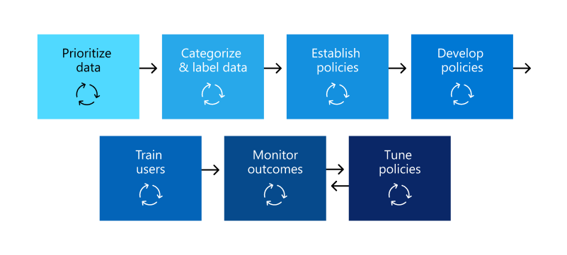
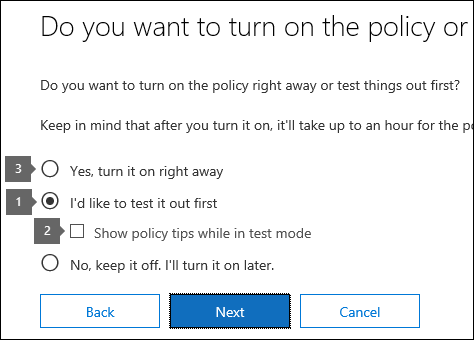
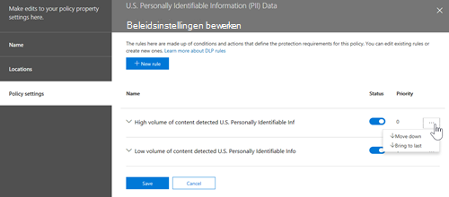

# Plan voor preventie van gegevensverlies (DLP)

Elke organisatie zal de preventie van gegevensverlies (DLP) anders plannen en implementeren, omdat de zakelijke behoeften, doelstellingen, resources en situatie van elke organisatie uniek voor hen zijn. Er zijn echter elementen die gebruikelijk zijn voor alle succesvolle DLP-implementaties. In dit artikel worden de best practices beschreven die worden gebruikt door organisaties in hun DLP-planning.

## Meerdere beginpunten

Veel organisaties kiezen ervoor om DLP te implementeren om te voldoen aan diverse overheids- of branchevoorschriften. Bijvoorbeeld de Algemene verordening gegevensbescherming van de Europese Unie (AVG) of de Health Insurance Portability and Accountability Act (HIPAA) of de California Consumer Privacy Act (CTPA). Ze implementeren ook preventie van gegevensverlies om hun intellectuele eigendom te beschermen. Maar de beginplaats en uiteindelijke bestemming in de DLP-reis variëren. 

Organisaties kunnen hun DLP-reis starten:

- vanuit een platformfocus, zoals informatie in chat- en kanaalberichten Teams of op Windows 10 apparaten
- weten welke gevoelige informatie ze prioriteit willen geven aan het beveiligen, zoals medische records, en rechtstreeks beleid definiëren om deze te beveiligen
- zonder te weten wat hun gevoelige informatie is, waar deze zich vindt en wie er mee bezig is, zodat ze beginnen met het ontdekken en categoriseren en een meer methodische benadering kiezen
- zonder te weten wat hun gevoelige informatie is, waar ze zijn of wie er mee bezig is, maar ze gaan rechtstreeks naar het definiëren van beleid en deze resultaten gebruiken als uitgangspunt en vervolgens hun beleid van hieruit verfijnen
- wetende dat ze de volledige Microsoft 365 information protection-stack moeten implementeren en dus een methodische benadering op langere termijn willen gebruiken

Dit zijn slechts enkele voorbeelden van hoe klanten DLP kunnen benaderen en het maakt niet uit waar u vandaan komt, Microsoft 365 DLP is flexibel genoeg om verschillende soorten informatiebeveiligingstrajecten van begin tot begin aan te passen aan een volledig gerealiseerde strategie voor preventie van gegevensverlies. 

## Overzicht van planningsproces

De [informatie over preventie van gegevensverlies](dlp-learn-about-dlp.md#learn-about-data-loss-prevention) introduceert de drie verschillende aspecten van het [DLP-planningsproces.](dlp-learn-about-dlp.md#plan-for-dlp) We gaan hier verder in op de elementen die veel voorkomen in alle DLP-abonnementen.

### Belanghebbenden identificeren

Wanneer dit wordt geïmplementeerd, kunnen DLP-beleidsregels worden toegepast in grote delen van uw organisatie. IT kan niet zelf een breed plan ontwikkelen zonder negatieve gevolgen. U moet de belanghebbenden identificeren die het volgende kunnen doen:

- de voorschriften, wetten en industriestandaarden beschrijven aan uw organisatie
- de categorieën gevoelige items die moeten worden beveiligd
- de bedrijfsprocessen waarin ze worden gebruikt
- het riskante gedrag dat moet worden beperkt
- prioriteit geven aan welke gegevens eerst moeten worden beveiligd op basis van de gevoeligheid van de items en het risico
- overzicht van het proces voor het controleren en herstellen van het DLP-beleid 
 
Over het algemeen zijn deze behoeften meestal 85% wettelijke bescherming en nalevingsbescherming en 15% bescherming van intellectuele eigendom. Hier volgen enkele suggesties voor rollen die u wilt opnemen in uw planningsproces:

- Regelgevende en compliancemedewerkers
- Hoofdrisicomedewerker
- Juridische functionarissen
- Beveiligings- en compliancemedewerkers
- Bedrijfseigenaren voor de gegevensitems
- Zakelijke gebruikers
- IT

### Beschrijf de categorieën gevoelige informatie die u wilt beveiligen

De belanghebbenden beschrijven vervolgens de categorieën gevoelige informatie die moeten worden beveiligd en het bedrijfsproces waarin ze worden gebruikt. DLP definieert Microsoft 365 categorieën bijvoorbeeld:

- Financieel 
- Medische en gezondheidsinformatie
- Privacy
- Aangepast

De belanghebbenden kunnen de gevoelige informatie identificeren als 'We zijn een gegevensverwerker, dus we moeten privacybescherming implementeren voor gegevensonderwerpgegevens en financiële informatie'.

 
  <!-- The business process is important as it informs the ‘data at rest’, ‘data in transit’, ‘data in use’ aspect of DLP planning and who should be sharing the items and who should not.-->

### Doelen en strategie instellen

Wanneer u uw belanghebbenden hebt geïdentificeerd en u weet welke gevoelige informatie bescherming nodig heeft en waar deze wordt gebruikt, kunnen de belanghebbenden hun beschermingsdoelstellingen instellen en kan IT een implementatieplan ontwikkelen. 

 <!--
### Discovery
 for the locations (DLP workloads) of these types of items.  (mapping DLP locations and data at rest, data in transit, data in use)

### IT can start coding test policies
start small and always in test mode. Note that DLP policies can feed into insider risk.

### Business process owners help with tuning
 false positive/false negative results and fitting DLP into their business processes.

-->

### Implementatieplan instellen

Uw implementatieplan moet het volgende omvatten:

- De begintoestand en de gewenste eindtoestand in kaart brengen en de stappen om van de ene naar de andere te gaan
- hoe u de detectie van gevoelige items wilt aanpakken
- beleidsplanning en de volgorde van de implementatie
- hoe u aan alle vereisten gaat
- planning van de manier waarop beleid eerst wordt getest voordat u over gaat naar handhaving
- hoe u uw eindgebruikers gaat trainen
- hoe u uw beleid gaat testen en afstemmen
- hoe u uw strategie voor preventie van gegevensverlies bekijkt en bijwerkt op basis van veranderende wettelijke, juridische, industriestandaard of intellectuele-eigendomsrechten en zakelijke behoeften

#### Pad van begin naar gewenste eindtoestand in kaart brengen

Documenteren hoe uw organisatie van de begintoestand naar de gewenste eindtoestand gaat, is essentieel om te communiceren met uw belanghebbenden en het projectbereik in te stellen. Hier volgen een reeks stappen die vaak worden gebruikt om DLP te implementeren. U wilt meer details dan dit, maar u kunt dit gebruiken om uw DLP-acceptatiepad te framen.

#### Detectie van gevoelige items

Er zijn meerdere manieren om te ontdekken wat afzonderlijke gevoelige items zijn en waar ze zich bevinden. Mogelijk hebt u al gevoeligheidslabels geïmplementeerd of hebt u besloten een zeer breed DLP-beleid te implementeren op alle locaties waar alleen items worden gedetecteerd en gecontroleerd. Zie Uw gegevens [kennen voor meer informatie.](information-protection.md#know-your-data)

#### Beleidsplanning

Wanneer u begint met de DLP-acceptatie, kunt u deze vragen gebruiken om uw beleidsontwerp en implementatie-inspanningen te richten.

##### Aan welke wetten, voorschriften en industriestandaarden moet uw organisatie voldoen?

Omdat veel organisaties naar DLP komen met als doel naleving van regelgeving, is het beantwoorden van deze vraag een natuurlijke beginpunt voor het plannen van uw DLP-implementatie. Maar als IT-implementator bent u waarschijnlijk niet in de positie om deze te beantwoorden. Het moet worden beantwoord door uw juridische team en bedrijfsmanagers. 
 
**Voorbeeld** Uw organisatie is onderworpen aan Het Verenigd Koninkrijk. financiële regelgeving.

##### Welke gevoelige items heeft uw organisatie die moeten worden beveiligd tegen lekkage?

Zodra uw organisatie weet waar deze staat in termen van nalevingsvereisten voor regelgeving, hebt u enig idee van welke gevoelige items moeten worden beschermd tegen lekkage en hoe u prioriteit wilt geven aan de beleidsuitvoering om ze te beschermen. Op deze manier kunt u de meest geschikte DLP-beleidsjablonen kiezen. Microsoft 365 wordt geleverd met vooraf geconfigureerde DLP-sjablonen voor Financiële, Medische en gezondheidsinstellingen, Privacy en u kunt uw eigen DLP-sjablonen maken met de aangepaste sjabloon. Terwijl u uw werkelijke DLP-beleid ontwerpt en maakt, kunt u ook het juiste type gevoelige informatie kiezen als u het antwoord op deze vraag [weet.](sensitive-information-type-learn-about.md#learn-about-sensitive-information-types)

**Voorbeeld** Als u snel wilt beginnen, kiest u de beleidssjabloon met de `U.K. Financial Data` typen , en gevoelige `Credit Card Number` `EU Debit Card Number` `SWIFT Code` informatie. 

##### Waar zijn de gevoelige items en in welke bedrijfsprocessen zijn ze betrokken?

De items die gevoelige informatie van uw organisatie bevatten, worden elke dag gebruikt tijdens het zakendoen. U moet weten waar exemplaren van die gevoelige informatie kunnen voorkomen en in welke bedrijfsprocessen ze worden gebruikt. Dit helpt u bij het kiezen van de juiste locaties om uw DLP-beleid op toe te passen. Microsoft 365 DLP-beleid wordt toegepast op locaties:

- Exchange-e-mail
- SharePoint sites
- OneDrive-accounts
- Teams chat- en kanaalberichten
- Windows 10 Apparaten
- Microsoft Cloud App Security
- On-premises opslagplaatsen

**Voorbeeld** De interne auditors van uw organisatie houden een reeks creditcardnummers bij. Ze bewaren een spreadsheet van hen op een beveiligde SharePoint site. Verschillende werknemers maken kopieën en slaan ze op hun werk op OneDrive voor Bedrijven site die wordt gesynchroniseerd met hun Windows 10 apparaat. Een van hen plakt een lijst met 14 van hen in een e-mail en probeert deze te verzenden naar externe auditors voor controle. U wilt het beleid toepassen op de beveiligde SharePoint site, alle interne auditors OneDrive voor Bedrijven accounts, hun Windows 10 apparaten en Exchange e-mail.

##### Wat is de tolerantie van uw organisaties voor lekkage?

Verschillende groepen in uw organisatie hebben mogelijk verschillende weergaven over het acceptabele niveau van gevoelige itemlekken en wat niet. Het bereiken van de perfecte nullekken kan te hoge kosten met zich brengen voor het bedrijf.

**Voorbeeld** De beveiligingsgroep van uw organisaties en het juridische team vinden dat er geen creditcardnummers mogen worden gedeeld met iemand buiten de organisatie en dat er geen lekkage moet worden voorkomen. Maar als onderdeel van de regelmatige controle van creditcardnummeractiviteit, moeten de interne controleurs bepaalde creditcardnummers delen met externe auditors. Als uw DLP-beleid het delen van creditcardnummers buiten de organisatie verbiedt, zijn er aanzienlijke verstoringen van het bedrijfsproces en extra kosten om de verstoring te beperken, zodat de interne auditors hun tracering kunnen voltooien. Deze extra kosten zijn onacceptabel voor de leidinggevenden. Om dit op te lossen, moet er een intern gesprek zijn om een acceptabel niveau van lekkage te bepalen. Zodra dat is besloten, kan het beleid uitzonderingen bieden voor bepaalde personen om de gegevens te delen of kan het worden toegepast in de modus Alleen controleren.

#### Planning voor vereisten

Voordat u bepaalde DLP-locaties kunt controleren, moet aan de vereisten worden voldaan. Zie de **secties Voordat u begint** de volgende secties:

- [Aan de slag met de preventie van gegevensverlies on-premises scanner (preview)](dlp-on-premises-scanner-get-started.md#before-you-begin)
- [Aan de slag met Eindpunt-DLP (gegevensverlies voor eindpunten)](endpoint-dlp-getting-started.md#before-you-begin)
- [Aan de slag met de Microsoft-nalevingsextensie (preview)](dlp-chrome-get-started.md#before-you-begin)
- [Beleid voor preventie van gegevensverlies gebruiken voor niet-Microsoft-cloud-apps (preview)](dlp-use-policies-non-microsoft-cloud-apps.md#before-you-begin)

#### Beleidsimplementatie

Wanneer u uw DLP-beleid maakt, moet u overwegen deze geleidelijk uit te rollen om de impact ervan te beoordelen en de effectiviteit ervan te testen voordat u ze volledig afdwingt. U wilt bijvoorbeeld niet dat een nieuw DLP-beleid onbedoeld de toegang tot duizenden documenten blokkeert of een bestaand bedrijfsproces doorbreekt.
  
Als u DLP-beleid maakt met een grote potentiële impact, raden we u aan de volgende volgorde te volgen:
  
1. **Start in de testmodus zonder Tips** en gebruik vervolgens de DLP-rapporten en eventuele incidentrapporten om de impact te beoordelen. U kunt DLP-rapporten gebruiken om het nummer, de locatie, het type en de ernst van beleidswedstrijden weer te geven. Op basis van de resultaten kunt u het beleid zo nodig afstemmen. In de testmodus heeft DLP-beleid geen invloed op de productiviteit van personen die in uw organisatie werken. Gebruik deze fase ook om uw werkstroom uit te testen voor het controleren en oplossen van DLP-gebeurtenissen.
    
2. **Ga naar de testmodus** met meldingen en beleidsregels Tips zodat u gebruikers kunt leren over uw compliancebeleid en ze kunt voorbereiden op het beleid dat wordt toegepast. Het is handig om een koppeling te hebben naar een pagina met organisatiebeleid met aanvullende informatie over het beleid in de beleidstip. In dit stadium kunt u gebruikers ook vragen om fout-positieven te rapporteren, zodat u het beleid verder kunt verfijnen. Ga naar deze fase als u er vertrouwen in hebt dat de resultaten van de beleidstoepassing overeenkomen met wat de belanghebbenden voor ogen hadden. 
    
3. **Start volledige handhaving van het beleid,** zodat de acties in de regels worden toegepast en de inhoud is beveiligd. Blijf de DLP-rapporten en eventuele incidentenrapporten of meldingen controleren om ervoor te zorgen dat de resultaten zijn wat u van plan bent. 

    

    U kunt een DLP-beleid op elk moment uitschakelen, wat van invloed is op alle regels in het beleid. Elke regel kan echter ook afzonderlijk worden uitgeschakeld door de status ervan in de regeleditor te wijzigen.

    

    U kunt ook de prioriteit van meerdere regels in een beleid wijzigen. Open een beleid voor bewerken om dit te doen. Kies in een rij voor een regel de beletsels **(...)** en kies vervolgens een optie, zoals **Omlaag** of **Naar laatste.**

    

#### Training voor eindgebruikers

Wanneer een DLP-beleid wordt geactiveerd, kunt u uw beleid configureren op E-mailmeldingen verzenden en beleidstips voor [DLP-beleid](use-notifications-and-policy-tips.md#send-email-notifications-and-show-policy-tips-for-dlp-policies) aan beheerders en eindgebruikers tonen. Hoewel uw beleid nog steeds in de testmodus staat en voordat ze zijn ingesteld op het afdwingen van een blokkeringsactie, zijn beleidstips nuttige manieren om het bewustzijn van riskant gedrag op gevoelige items te vergroten en gebruikers op te leiden om dit gedrag in de toekomst te voorkomen.  

#### DLP-vereisten en updatestrategie controleren

De regelgeving, wetten en industriestandaarden die aan uw organisatie zijn onderworpen, veranderen in de tijd en uw zakelijke doelstellingen voor DLP zullen ook worden gewijzigd. Zorg ervoor dat u regelmatig beoordelingen van al deze gebieden op neemt, zodat uw organisatie aan de naleving voldoet en uw DLP-implementatie blijft voldoen aan uw zakelijke behoeften.

## Benaderingen voor implementatie

|Beschrijving van behoeften van klanten  | benadering  |
|---------|---------|
|**Contoso Bank** is in een sterk gereguleerde industrie en heeft veel verschillende typen gevoelige items op veel verschillende locaties.   - weet welke typen gevoelige informatie de hoogste prioriteit hebben.   - moet bedrijfsonderbreking minimaliseren wanneer beleid wordt uitgerold.   - beschikt over IT-resources en kan experts in dienst nemen om te helpen bij het plannen en implementeren van ontwerpen   - heeft een premier-ondersteuningscontract met Microsoft| - Neem de tijd om te begrijpen aan welke voorschriften ze moeten voldoen en hoe ze hieraan moeten voldoen.   -Neem de tijd om de betere samenwaarde van de Microsoft 365 informatiebeveiligingsstack te begrijpen   - Een gevoeligheidslabelsysteem ontwikkelen voor items met prioriteit en toepassen   - Eigenaren van bedrijfsprocessen betrekken  - Ontwerp-/codebeleid, implementeren in testmodus, gebruikers trainen  - herhalen|
|**TailSpin Toys** weet niet wat ze hebben of waar het is en heeft weinig tot geen resourcediepte. Ze gebruiken Teams, ODB en Exchange uitgebreid.     |- Begin met eenvoudige beleidsregels voor de locaties met prioriteit.  - Controleren wat wordt geïdentificeerd  - Gevoeligheidslabels dienovereenkomstig toepassen  - Beleid verfijnen, gebruikers trainen       |
|**Fabrikam** is een kleine startup en wil het intellectuele eigendom beschermen en moet snel gaan. Ze zijn bereid om bepaalde resources te wijden, maar kunnen het zich niet veroorloven externe experts in te huren.  - Gevoelige items zijn allemaal in Microsoft 365 OneDdrive voor Bedrijven/SharePoint  - Acceptatie van OneDrive voor Bedrijven en SharePoint is traag, werknemers/schaduw IT gebruiken DropBox en Google drive om items te delen/opslaan  - Werknemers waarderen de snelheid van het werk boven de discipline gegevensbescherming  - Klant heeft alle 18 nieuwe werknemers Windows 10 gekocht     |- Profiteer van het standaard DLP-beleid in Teams  - Standaard beperkte instelling gebruiken voor SharePoint items  - Beleid implementeren dat extern delen voorkomt  - Beleid implementeren voor prioriteitslocaties  - Beleid implementeren voor Windows 10 apparaten  - Uploads naar niet-OneDrive voor Bedrijven cloudopslag blokkeren      |

<!--

## Planning for workloads

### Exchange

### SharePoint

### OneDrive for Business

### Teams

### Windows 10 Devices

### Microsoft Cloud App Security (MCAS)

### On-premises Scanner
-->

## Zie ook
- [Meer informatie over preventie van gegevensverlies](dlp-learn-about-dlp.md#learn-about-data-loss-prevention)
