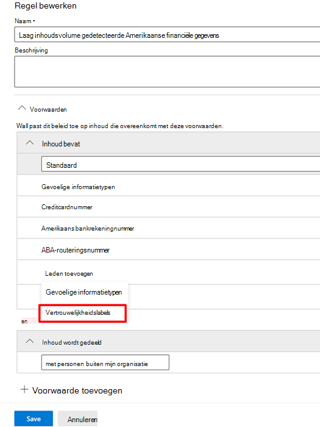

# Vertrouwelijkheidslabels gebruiken als voorwaarden in DLP-beleidUse sensitivity labels as conditions in DLP policies

U kunt [vertrouwelijkheidslabels](sensitivity-labels.md) gebruiken als voorwaarde in DLP-beleid voor deze locaties:You can use [sensitivity labels](sensitivity-labels.md) as a condition in DLP policies for these location:

- Exchange Online-e-mailberichtenExchange Online email messages
- SharePoint OnlineSharePoint Online
- OneDrive voor Bedrijven-sitesOneDrive for Business sites
- Windows 10-apparatenWindows 10 devices

Gevoeligheidslabels worden weergegeven als een optie in de lijst **Inhoud bevat**.Sensitivity labels appear as an option in the **Content contains** list.

> [!div class="mx-imgBorder"]
> 

> [!IMPORTANT]
> **Gevoeligheidslabels** als voorwaarde zijn niet beschikbaar als u **Chat- en kanaalberichten in Teams** hebt geselecteerd als een locatie om het DLP-beleid toe te passen.**Sensitivity Labels** as a condition will not be available if you have selected **Teams chat and channel messages** as a location to apply the DLP policy.

## Ondersteunde items, scenario's en beleidstipsSupported items, scenarios, and policy tips

U kunt gevoeligheidslabels gebruiken als voorwaarden op deze items en in deze scenario's.You can use sensitivity labels as conditions on these items and in these scenarios.

### Ondersteunde itemsSupported items

|ServiceService  |ItemtypeItem type  |Beschikbaar voor beleidstipAvailable to policy tip  |AfdwingbaarEnforceable  |
|---------|---------|---------|---------|
|ExchangeExchange    |e-mailberichtemail message         |jayes         |jayes         |
|ExchangeExchange    |e-mailbijlageemail attachment         |neeno         |ja \*yes \*         |
|SharePoint OnlineSharePoint Online     |items in SharePoint Onlineitems in SharePoint Online         |jayes         |jayes         |
|OneDrive voor BedrijvenOneDrive for Business     |itemsitems         |jayes         |jayes         |
|TeamsTeams     |Teams en kanaalberichtenTeams and channel messages         |niet van toepassingnot applicable         |niet van toepassingnot applicable         |
|TeamsTeams     |bijlagenattachments         |ja \*\*yes \*\*         |ja \*\*yes \*\*         |
|Windows 10-apparatenWindows 10 devices     |itemsitems         |jayes         |jayes         |
|MCAS (preview-versie)MCAS (preview) |itemsitems         |jayes         |jayes         |

\* DLP-detectie van e-mailbijlagen die als vertrouwelijk zijn gemarkeerd, wordt alleen ondersteund voor Office-bestandstypen.\* DLP detection of sensitivity labeled email attachments are supported for Office file types only.

\*\* Bijlagen die via een privéchat of kanalen in Teams worden verzonden, worden automatisch geüpload naar OneDrive voor Bedrijven en SharePoint.\*\* Attachments sent in Teams over 1:1 chat or channels are automatically uploaded to OneDrive for Business and SharePoint. Dus als SharePoint Online of OneDrive voor Bedrijven als locaties zijn opgenomen in uw DLP-beleid, worden gelabelde bijlagen die worden verzonden in Teams automatisch opgenomen in het bereik van deze voorwaarde.So if SharePoint Online or OneDrive for Business are included as locations in your DLP policy, then labeled attachments sent in Teams will be automatically included in the scope of this condition. Teams als locatie hoeft niet te zijn geselecteerd in het DLP-beleid.Teams as a location does not need to be selected in the DLP policy.

> [!NOTE]
> De mogelijkheid van DLP om gevoeligheidslabels te detecteren in SharePoint en OneDrive voor Bedrijven is beperkt.DLP's ability to detect sensitivity labels in SharePoint and OneDrive for business is limited. Raadpleeg [Vertrouwelijkheidslabels inschakelen voor Office-bestanden in SharePoint en OneDrive](sensitivity-labels-sharepoint-onedrive-files.md#limitations) voor meer informatie.For more information, see [Enable sensitivity labels for Office files in SharePoint and OneDrive](sensitivity-labels-sharepoint-onedrive-files.md#limitations).

### Ondersteunde scenario'sSupported scenarios

- Een DLP-beheerder kan een lijst met alle gevoeligheidslabels in de tenant zien wanneer ze ervoor kiezen om één of meer gevoeligheidslabels als voorwaarde op te nemen.DLP Admin will be able to see a list of all sensitivity labels in the tenant when they choose to include one or more sensitivity labels as a condition.

- Het gebruik van gevoeligheidslabels als voorwaarde wordt ondersteund voor alle werkbelastingen, zoals aangegeven in de bovenstaande ondersteuningsmatrix.Using sensitivity labels as a condition is supported across all workloads as indicated in the support matrix above.

- DLP-beleidstips blijven zichtbaar in alle werkbelastingen (behalve Outlook Win32) voor DLP-beleid dat een gevoeligheidslabel als voorwaarde bevat.DLP policy tips will continue to be shown across workloads (except Outlook Win32) for DLP policies which contain sensitivity label as a condition.

- Gevoeligheidslabels worden ook weergegeven als onderdeel van het e-mailbericht met het incidentenrapport als een DLP-beleid met een gevoeligheidslabel als voorwaarde overeenkomt.Sensitivity labels will also appear as a part of the incident report email if a DLP policy with sensitivity label as a condition is matched.

- Gevoeligheidslabeldetails worden ook weergegeven in het auditlogboek met DLP-regelovereenkomsten voor een DLP-beleid dat een gevoeligheidslabel als voorwaarde bevat.Sensitivity label details will also be shown in the DLP rule match audit log for a DLP policy match which contains sensitivity label as a condition.

### Beleidstips ondersteunenSupport policy tips

|WerkbelastingWorkload  |Ondersteunde/niet-ondersteunde beleidstipsPolicy tips supported/not supported  |
|---------|---------|
|OWAOWA |    ondersteundsupported     |
|Outlook Win 32Outlook Win 32    |  niet ondersteundnot supported       |
|SharePointSharePoint   |   ondersteundsupported      |
|OneDrive voor BedrijvenOneDrive for Business    |    ondersteundsupported     |
|eindpuntapparatenendpoint devices   |  niet ondersteundnot supported       |
