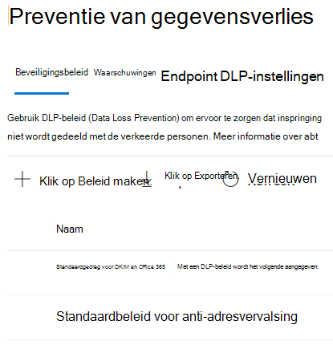

# Meer informatie over het standaard preventiebeleid voor gegevensverlies in Microsoft Teams (preview)Learn about the default data loss prevention policy in Microsoft Teams (preview)

[De mogelijkheden voor preventie van](dlp-learn-about-dlp.md) gegevensverlies zijn uitgebreid met Microsoft Teams chat- en kanaalberichten, inclusief privékanaalberichten.[Data loss prevention](dlp-learn-about-dlp.md) capabilities have been extended to include Microsoft Teams chat and channel messages, including private channel messages. Als onderdeel van deze release hebben we een standaard DLP-beleid gemaakt voor Microsoft Teams klanten die voor het eerst naar het Compliancecentrum gaan.As a part of this release, we created a default DLP policy for Microsoft Teams for first-time customers to Compliance center.

## Van toepassing opApplies to

Elke tenant die een licentie heeft met een of meer van de onderstaande licenties en actieve gebruikers Teams gebruikenAny tenant who is licensed with one or more of the below licenses and have active Teams users
 
- ME5,ME5, 
- MA5,MA5, 
- E5/A5 Compliance,E5/A5 Compliance, 
- IP+G,IP+G, 
- OE5,OE5, 
- O365 Advanced ComplianceO365 Advanced Compliance 
- EMS E5EMS E5

## Wat doet het standaardbeleid?What does the default policy do?

Het standaard DLP-beleid voor Teams houdt alle creditcardnummers bij die intern en extern worden gedeeld met de organisatie.The default DLP policy for Teams tracks all the credit card numbers shared internally and externally to the organization. Dit beleid is standaard ingeschakeld voor alle gebruikers van de tenant.This policy is on by default for all users of the tenant. Het genereert geen beleidstips voor eindgebruikers, maar genereert wel een waarschuwingsgebeurtenis en activeert ook een e-mail met een lage ernst naar de beheerder (toegevoegd aan het beleid).It does not generate any policy tips for end users but does generate an Alert event and also triggers a low severity email to the admin (added in the policy). Beheerder kan de activiteiten bekijken en de beleidsdetails bewerken door u aan te melden bij het Compliancecentrum.Administrator can view the activities and edit the policies details by logging into the Compliance center.

Beheerders kunnen dit beleid bekijken in het [compliancecentrum](https://compliance.microsoft.com/compliancesettings) > pagina Preventiebeleid voor gegevensverlies.Admins can view this policy in the [Compliance center](https://compliance.microsoft.com/compliancesettings) > Data Loss prevention policies page.

> [!div class="mx-imgBorder"]
> 

## Het standaardbeleid bewerken of verwijderenEdit or delete the default policy

Als [u het standaardbeleid wilt bewerken voor betere prestaties](create-test-tune-dlp-policy.md#tune-a-dlp-policy)of om het te verwijderen, gebruikt u een account met **DLP Compliance Management-machtigingen.**To [edit the default policy for better performance or to delete it](create-test-tune-dlp-policy.md#tune-a-dlp-policy), just use an account with **DLP Compliance Management** permissions. Zie Machtigingen [voor meer informatie.](create-test-tune-dlp-policy.md#permissions)For more information, see, [Permissions](create-test-tune-dlp-policy.md#permissions).

