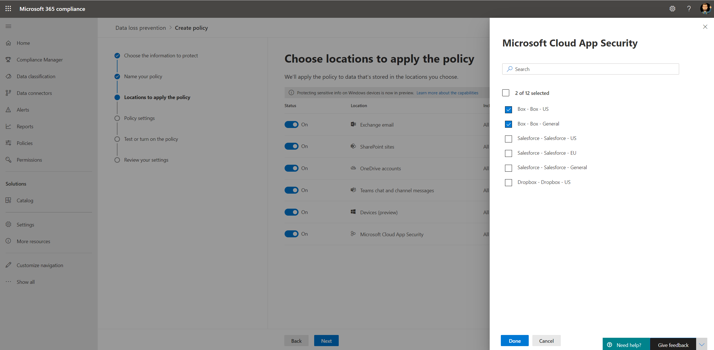

# Beleid voor preventie van gegevensverlies gebruiken voor niet-Microsoft-cloud-apps (preview)Use data loss prevention policies for non-Microsoft cloud apps (preview)

DLP-beleid (Data Loss Prevention) voor niet-Microsoft-cloud-apps maakt deel uit van de Microsoft 365 DLP-suite met functies; met behulp van deze functies kunt u gevoelige items ontdekken en beveiligen in Microsoft 365 services.Data loss prevention (DLP) policies to non-Microsoft cloud apps are part of the Microsoft 365 DLP suite of features; using these features, you can discover and protect sensitive items across Microsoft 365 services. Zie Meer informatie over preventie van gegevensverlies voor meer informatie over alle Microsoft [DLP-aanbiedingen.](dlp-learn-about-dlp.md)For more information about all Microsoft DLP offerings, see [Learn about data loss prevention](dlp-learn-about-dlp.md).

U kunt DLP-beleid gebruiken om niet-Microsoft-cloud-apps te controleren en te detecteren wanneer gevoelige items worden gebruikt en gedeeld via niet-Microsoft-cloud-apps.You can use DLP policies to non-Microsoft cloud apps to monitor and detect when sensitive items are used and shared via non-Microsoft cloud apps. Als u dit beleid gebruikt, hebt u de zichtbaarheid en controle die u nodig hebt om ervoor te zorgen dat ze correct worden gebruikt en beveiligd, en voorkomt u risicovol gedrag dat hen in gevaar kan brengen.Using these policies gives you the visibility and control that you need to ensure that they're correctly used and protected, and it helps prevent risky behavior that might compromise them.

## Voordat u begintBefore you begin

### Licenties voor SKU/abonnementenSKU/subscriptions licensing

Voordat u DLP-beleid gaat gebruiken voor niet-Microsoft-cloud-apps, bevestigt u uw Microsoft 365 [en](https://www.microsoft.com/microsoft-365/compare-microsoft-365-enterprise-plans?rtc=1) eventuele invoegtoepassingen.Before you start using DLP policies to non-Microsoft cloud apps, confirm your [Microsoft 365 subscription](https://www.microsoft.com/microsoft-365/compare-microsoft-365-enterprise-plans?rtc=1) and any add-ons. Als u deze functionaliteit wilt openen en gebruiken, moet u een van deze abonnementen of invoegtoepassingen hebben:To access and use this functionality, you must have one of these subscriptions or add-ons:

- Microsoft 365 E5Microsoft 365 E5
- Microsoft 365 E5 ComplianceMicrosoft 365 E5 Compliance
- Microsoft 365 E5 SecurityMicrosoft 365 E5 Security

### Uw Cloud App Security voorbereidenPrepare your Cloud App Security environment

DLP-beleid voor niet-Microsoft-cloud-apps gebruikt Cloud App Security DLP-mogelijkheden.DLP policies to non-Microsoft cloud apps use Cloud App Security DLP capabilities. Als u het wilt gebruiken, moet u uw Cloud App Security voorbereiden.To use it, you should prepare your Cloud App Security environment. Zie Direct zichtbaarheids-, beveiligings- en beheeracties instellen voor [uw apps voor instructies.](/cloud-app-security/getting-started-with-cloud-app-security#step-1-set-instant-visibility-protection-and-governance-actions-for-your-apps)For instructions, see [Set instant visibility, protection, and governance actions for your apps](/cloud-app-security/getting-started-with-cloud-app-security#step-1-set-instant-visibility-protection-and-governance-actions-for-your-apps).

### Verbinding maken een niet-Microsoft-cloud-appConnect a non-Microsoft cloud app

Als u DLP-beleid wilt gebruiken voor een specifieke niet-Microsoft-cloud-app, moet de app zijn verbonden met Cloud App Security.To use DLP policy to a specific non-Microsoft cloud app, the app must be connected to Cloud App Security. Zie voor meer informatie:For information, see:

- [Verbinding maken VakConnect Box](/cloud-app-security/connect-box-to-microsoft-cloud-app-security)
- [Verbinding maken DropboxConnect Dropbox](/cloud-app-security/connect-dropbox-to-microsoft-cloud-app-security)
- [Verbinding maken G-SuiteConnect G-Suite](/cloud-app-security/connect-google-apps-to-microsoft-cloud-app-security)
- [Verbinding maken SalesforceConnect Salesforce](/cloud-app-security/connect-salesforce-to-microsoft-cloud-app-security)
- [Verbinding maken Cisco WebexConnect Cisco Webex](/cloud-app-security/connect-webex-to-microsoft-cloud-app-security)

Nadat u uw cloud-apps hebt verbonden met Cloud App Security, kunt u Microsoft 365 DLP-beleid voor hen maken.After you connect your cloud apps to Cloud App Security, you can create Microsoft 365 DLP policies for them.

>[!NOTE]
>Het is ook mogelijk om DLP-Microsoft Cloud App Security te maken voor Microsoft-cloud-apps.It's also possible to use Microsoft Cloud App Security to create DLP policies to Microsoft cloud apps. U wordt echter aangeraden om DLP-Microsoft 365 te gebruiken voor het maken en beheren van DLP-beleid voor Microsoft-cloud-apps.However, it's recommended to use Microsoft 365 to create and manage DLP policies to Microsoft cloud apps.

## Een DLP-beleid maken voor een niet-Microsoft-cloud-appCreate a DLP policy to a non-Microsoft cloud app

Wanneer u een locatie voor het DLP-beleid selecteert, zet u de **Microsoft Cloud App Security** in.When you select a location for the DLP policy, turn on the **Microsoft Cloud App Security** location.

- Als u een specifieke app of exemplaar wilt selecteren, selecteert u **Exemplaar kiezen.**To select a specific app or instance, select **Choose instance**.
- Als u geen exemplaar selecteert, worden in het beleid alle verbonden apps in uw Microsoft Cloud App Security gebruikt.If you don't select an instance, the policy uses all connected apps in your Microsoft Cloud App Security tenant.

   

   

U kunt verschillende acties kiezen voor elke ondersteunde niet-Microsoft-cloud-app.You can choose various actions for every supported non-Microsoft cloud app. Voor elke app zijn er verschillende mogelijke acties (afhankelijk van de CLOUD-app-API).For every app, there are different possible actions (depends on the cloud app API).

Wanneer u een regel maakt in het DLP-beleid, kunt u een actie selecteren voor niet-Microsoft-cloud-apps.When you create a rule in the DLP policy, you can select an action for non-Microsoft cloud apps. Als u apps van derden wilt beperken, **selecteert u Apps van derden beperken.**To restrict third-party apps, select **Restrict Third Party Apps**.

Zie Een DLP-beleid maken en afstemmen voor informatie over het maken en configureren van [DLP-beleid.](./create-test-tune-dlp-policy.md?view=o365-worldwide)For information about creating and configuring DLP policies, see [Create test and tune a DLP policy](./create-test-tune-dlp-policy.md?view=o365-worldwide).

## Zie ookSee Also

- [Test maken en een DLP-beleid afstemmenCreate test and tune a DLP policy](./create-test-tune-dlp-policy.md?view=o365-worldwide)
- [Aan de slag met het standaard DLP-beleidGet started with the default DLP policy](./get-started-with-the-default-dlp-policy.md?view=o365-worldwide)
- [Een DLP-beleid maken vanuit een sjabloonCreate a DLP policy from a template](./create-a-dlp-policy-from-a-template.md?view=o365-worldwide)