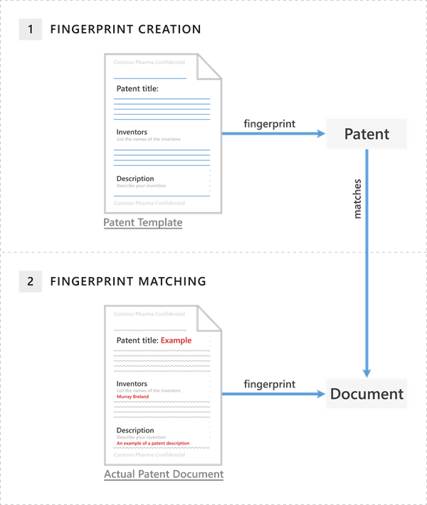

# <a name="document-fingerprinting"></a>Fingerprinting van documenten

Informatiewerkers in uw organisatie verwerken veel soorten gevoelige informatie op een normale dag. In het Beveiligings compliancecentrum kunt u met document fingerprinting deze gegevens gemakkelijker beveiligen door standaardformulieren te identificeren die in uw &amp; hele organisatie worden gebruikt. In dit onderwerp worden de concepten achter Document fingerprinting beschreven en wordt beschreven hoe u er een kunt maken met Behulp van PowerShell.
  
## <a name="basic-scenario-for-document-fingerprinting"></a>Basisscenario voor document fingerprinting

Document Fingerprinting is een DLP-functie (Data Loss Prevention) die een standaardformulier converteert naar een type gevoelige informatie, dat u kunt gebruiken in de regels van uw DLP-beleid. U kunt bijvoorbeeld een document vingerafdruk maken op basis van een lege octrooisjabloon en vervolgens een DLP-beleid maken dat alle uitgaande octrooisjablonen detecteert en blokkeert met gevoelige inhoud die is ingevuld. Desgewenst kunt u beleidstips instellen om afzenders te laten weten dat ze mogelijk gevoelige informatie verzenden. De afzender moet controleren of de geadresseerden in aanmerking komen voor het ontvangen van de octrooien. [](use-notifications-and-policy-tips.md) Dit proces werkt met op tekst gebaseerde formulieren die in uw organisatie worden gebruikt. Aanvullende voorbeelden van formulieren die u kunt uploaden zijn:
  
- Overheidsformulieren
- Nalevingsformulieren health Insurance Portability and Accountability Act (HIPAA)  
- Personeelsinformatieformulieren voor personeelsafdelingen
- Aangepaste formulieren die speciaal voor uw organisatie zijn gemaakt

In het ideale voorbeeld heeft uw organisatie al een gevestigde zakelijke gewoonte om bepaalde formulieren te gebruiken voor het verzenden van gevoelige informatie. Nadat u een leeg formulier hebt geüpload dat moet worden geconverteerd naar een document vingerafdruk en een bijbehorend beleid hebt ingesteld, worden documenten in uitgaande e-mail gedetecteerd die overeenkomen met die vingerafdruk.

## <a name="how-document-fingerprinting-works"></a>Hoe document fingerprinting werkt

U hebt waarschijnlijk al geraden dat documenten geen echte vingerafdruk hebben, maar de naam helpt de functie te verklaren. Op dezelfde manier als de vingerafdruk van een persoon unieke patronen heeft, hebben documenten unieke woordpatronen. Wanneer u een bestand uploadt, identificeert DLP het unieke woordpatroon in het document, maakt u een document vingerafdruk op basis van dat patroon en gebruikt deze document vingerafdruk om uitgaande documenten met hetzelfde patroon te detecteren. Daarom wordt met het uploaden van een formulier of sjabloon het meest effectieve type document vingerafdruk gemaakt. Iedereen die een formulier invult, gebruikt dezelfde oorspronkelijke set woorden en voegt vervolgens zijn of haar eigen woorden aan het document toe. Zolang het uitgaande document niet met een wachtwoord is beveiligd en alle tekst uit het oorspronkelijke formulier bevat, kan DLP bepalen of het document overeenkomt met de vingerafdruk van het document.

> [!IMPORTANT]
> Op dit moment kan DLP document fingerprinting alleen gebruiken als detectiemethode in Exchange online.

In het volgende voorbeeld ziet u wat er gebeurt als u een document vingerafdruk maakt op basis van een octrooisjabloon, maar u kunt elk formulier gebruiken als basis voor het maken van een document vingerafdruk.
  
### <a name="example-of-a-patent-document-matching-a-document-fingerprint-of-a-patent-template"></a>Voorbeeld van een octrooidocument dat overeenkomt met een document vingerafdruk van een octrooisjabloon


  
De octrooisjabloon bevat de lege velden 'Octrooititel', 'Bedenkers' en 'Beschrijving' en beschrijvingen voor elk van deze velden, dat is het woordpatroon. Wanneer u de oorspronkelijke octrooisjabloon uploadt, is deze in een van de ondersteunde bestandstypen en in tekst zonder tekst. DLP converteert dit woordpatroon naar een document vingerafdruk, een klein Unicode XML-bestand met een unieke hashwaarde die de oorspronkelijke tekst vertegenwoordigt, en de vingerafdruk wordt opgeslagen als een gegevensclassificatie in Active Directory. (Als beveiligingsmaatregel wordt het oorspronkelijke document zelf niet opgeslagen in de service; alleen de hashwaarde wordt opgeslagen en het oorspronkelijke document kan niet worden gereconstrueerd vanuit de hashwaarde.) De octrooi vingerafdruk wordt dan een type gevoelige informatie dat u kunt koppelen aan een DLP-beleid. Nadat u de vingerafdruk hebt verbonden met een DLP-beleid, detecteert DLP uitgaande e-mailberichten met documenten die overeenkomen met de vingerafdruk van het octrooi en behandelt deze volgens het beleid van uw organisatie. 

U kunt bijvoorbeeld een DLP-beleid instellen dat voorkomt dat gewone werknemers uitgaande berichten met octrooien verzenden. DLP gebruikt de octrooi vingerafdruk om octrooien op te sporen en deze e-mailberichten te blokkeren. U kunt ook uw juridische afdeling de mogelijkheid bieden octrooien naar andere organisaties te verzenden, omdat dit nodig is voor het bedrijf. U kunt toestaan dat specifieke afdelingen gevoelige informatie verzenden door uitzonderingen te maken voor die afdelingen in uw DLP-beleid, of u kunt toestaan dat deze afdelingen een beleidstip met een zakelijke rechtvaardiging overschrijven.
  
### <a name="supported-file-types"></a>Ondersteunde bestandstypen

Document fingerprinting ondersteunt dezelfde bestandstypen die worden ondersteund in e-mailstroomregels (ook wel transportregels genoemd). Zie Ondersteunde bestandstypen voor de inhoudscontrole van de [e-mailstroomregel](/exchange/security-and-compliance/mail-flow-rules/inspect-message-attachments#supported-file-types-for-mail-flow-rule-content-inspection)voor een lijst met ondersteunde bestandstypen. Eén beknopte opmerking over bestandstypen: geen regels voor e-mailstroom of Document fingerprinting ondersteunt het .dotx-bestandstype, wat verwarrend kan zijn omdat dit een sjabloonbestand is in Word. Wanneer u het woord 'sjabloon' in deze en andere onderwerpen document fingerprinting ziet, verwijst het naar een document dat u hebt ingesteld als een standaardformulier, niet het sjabloonbestandstype.
  
#### <a name="limitations-of-document-fingerprinting"></a>Beperkingen van document fingerprinting

Document Fingerprinting detecteert in de volgende gevallen geen gevoelige informatie:
  
- Met een wachtwoord beveiligde bestanden
- Bestanden die alleen afbeeldingen bevatten
- Documenten die niet alle tekst uit het oorspronkelijke formulier bevatten dat wordt gebruikt om de vingerafdruk van het document te maken
- Bestanden groter dan 10 MB

## <a name="use-powershell-to-create-a-classification-rule-package-based-on-document-fingerprinting"></a>PowerShell gebruiken om een classificatieregelpakket te maken op basis van document fingerprinting

Houd er rekening mee dat u momenteel alleen een vingerafdruk van een document kunt maken met PowerShell in het Beveiligings &amp; compliancecentrum. Als u verbinding wilt maken, [Verbinding maken u contact & Beveiligingscentrum PowerShell.](/powershell/exchange/connect-to-scc-powershell)

DLP gebruikt classificatieregelpakketten om gevoelige inhoud te detecteren. Als u een classificatieregelpakket wilt maken op basis van een document vingerafdruk, gebruikt u de **cmdlets New-DlpFingerprint** en **New-DlpSensitiveInformationType.** Omdat de resultaten van **New-DlpFingerprint** niet buiten de regel voor gegevensclassificatie worden opgeslagen, gebruikt u altijd **New-DlpFingerprint** en **New-DlpSensitiveInformationType** of **Set-DlpSensitiveInformationType** in dezelfde PowerShell-sessie. In het volgende voorbeeld wordt een nieuwe document vingerafdruk gemaakt op basis van het bestand C:\Mijn documenten\Contoso Employee Template.docx. U kunt de nieuwe vingerafdruk opslaan als een variabele, zodat u deze kunt gebruiken met de **cmdlet New-DlpSensitiveInformationType** in dezelfde PowerShell-sessie.
  
```powershell
$Employee_Template = Get-Content "C:\My Documents\Contoso Employee Template.docx" -Encoding byte -ReadCount 0
$Employee_Fingerprint = New-DlpFingerprint -FileData $Employee_Template -Description "Contoso Employee Template"
```

Laten we nu een nieuwe regel voor gegevensclassificatie maken met de naam 'Contoso Employee Confidential' met de document vingerafdruk van het bestand C:\Mijn documenten\Contoso Klantgegevens Form.docx.
  
```powershell
$Customer_Form = Get-Content "C:\My Documents\Contoso Customer Information Form.docx" -Encoding byte -ReadCount 0
$Customer_Fingerprint = New-DlpFingerprint -FileData $Customer_Form -Description "Contoso Customer Information Form"
New-DlpSensitiveInformationType -Name "Contoso Customer Confidential" -Fingerprints $Customer_Fingerprint -Description "Message contains Contoso customer information." 
```

U kunt nu de **cmdlet Get-DlpSensitiveInformationType** gebruiken om alle DLP-regels voor gegevensclassificatie te vinden. In dit voorbeeld maakt 'Contoso Customer Confidential' deel uit van de lijst met pakketpakketten voor gegevensclassificatieregel. 
  
Voeg ten slotte het gegevensclassificatieregelpakket 'Contoso Customer Confidential' toe aan een DLP-beleid in het Beveiligings &amp; compliancecentrum. In dit voorbeeld wordt een regel toegevoegd aan een bestaand DLP-beleid met de naam 'ConfidentialPolicy'.

```powershell
New-DlpComplianceRule -Name "ContosoConfidentialRule" -Policy "ConfidentialPolicy" -ContentContainsSensitiveInformation @{Name="Contoso Customer Confidential"} -BlockAccess $True
```

U kunt het pakket regels voor gegevensclassificatie ook gebruiken in e-mailstroomregels in Exchange Online, zoals wordt weergegeven in het volgende voorbeeld. Als u deze opdracht wilt uitvoeren, moet u eerst [Verbinding maken powershell Exchange Online uitvoeren.](/powershell/exchange/connect-to-exchange-online-powershell) Houd er ook rekening mee dat het tijd kost om het regelpakket te synchroniseren van het Beveiligings compliancecentrum naar &amp; het Exchange beheercentrum.
  
```powershell
New-TransportRule -Name "Notify :External Recipient Contoso confidential" -NotifySender NotifyOnly -Mode Enforce -SentToScope NotInOrganization -MessageContainsDataClassification @{Name=" Contoso Customer Confidential"}
```

DLP detecteert nu documenten die overeenkomen met de contoso-Form.docx document vingerafdruk.
  
Zie voor syntaxis- en parametergegevens:

- [New-DlpFingerprint](/powershell/module/exchange/New-DlpFingerprint)
- [New-DlpSensitiveInformationType](/powershell/module/exchange/New-DlpSensitiveInformationType)
- [Remove-DlpSensitiveInformationType](/powershell/module/exchange/Remove-DlpSensitiveInformationType)
- [Set-DlpSensitiveInformationType](/powershell/module/exchange/Set-DlpSensitiveInformationType)
- [Get-DlpSensitiveInformationType](/powershell/module/exchange/Get-DlpSensitiveInformationType)
