# <a name="double-key-encryption-for-microsoft-365"></a>Dubbele sleutelversleuteling voor Microsoft 365

> *Van toepassing op: Double Key Encryption for Microsoft 365, [Microsoft 365 Compliance](https://www.microsoft.com/microsoft-365/business/compliance-management), Azure [Information Protection](https://azure.microsoft.com/pricing/details/information-protection)*
>
> *Instructies voor: [Geïntegreerde labelingclient](/azure/information-protection/faqs#whats-the-difference-between-the-azure-information-protection-classic-and-unified-labeling-clients) voor Azure Information Protection voor Windows*
>
> *Servicebeschrijving voor: [Microsoft 365 Compliance](/office365/servicedescriptions/microsoft-365-service-descriptions/microsoft-365-tenantlevel-services-licensing-guidance/microsoft-365-security-compliance-licensing-guidance)*

Double Key Encryption (DKE) gebruikt twee toetsen samen om beveiligde inhoud te openen. Microsoft slaat één sleutel op in Microsoft Azure en u houdt de andere sleutel vast. U hebt volledige controle over een van uw sleutels met de service Dubbele sleutelversleuteling. U kunt beveiliging toepassen met de geïntegreerde labelingclient van Azure Information Protection op uw zeer gevoelige inhoud.

Double Key Encryption ondersteunt zowel cloud- als on-premises implementaties. Deze implementaties helpen ervoor te zorgen dat versleutelde gegevens ondoorzichtig blijven, waar u de beveiligde gegevens ook opgeslagen.

Zie Uw [Azure Information Protection-tenantsleutel](/azure/information-protection/plan-implement-tenant-key)plannen en implementeren voor meer informatie over de standaardsleutels voor tenants in de cloud.

## <a name="when-your-organization-should-adopt-dke"></a>Wanneer uw organisatie DKE moet aannemen

Dubbele sleutelversleuteling is bedoeld voor uw meest gevoelige gegevens die aan de strengste beveiligingsvereisten zijn onderworpen. DKE is niet bedoeld voor alle gegevens. Over het algemeen gebruikt u Dubbele sleutelversleuteling om slechts een klein deel van uw algehele gegevens te beveiligen. U dient zorgvuldig te werk te gaan bij het identificeren van de juiste gegevens voor deze oplossing voordat u deze implementeert. In sommige gevallen moet u mogelijk uw bereik beperken en gebruikmaken van andere oplossingen voor de meeste gegevens, zoals Microsoft Information Protection met door Microsoft beheerde sleutels of BYOK. Deze oplossingen zijn voldoende voor documenten die niet onderhevig zijn aan verbeterde beveiliging en wettelijke vereisten. Met deze oplossingen kunt u ook de krachtigste services Office 365 gebruiken. services die u niet kunt gebruiken met DKE-versleutelde inhoud. Bijvoorbeeld:

- Transportregels, waaronder anti-malware en spam die zichtbaarheid in de bijlage vereisen
- Microsoft Delve
- eDiscovery
- Zoeken en indexeren van inhoud
- Office Web-apps, inclusief coauthoringsfunctionaliteit

Externe toepassingen of services die niet zijn geïntegreerd met DKE via de MIP SDK, kunnen geen acties uitvoeren op de versleutelde gegevens.

De Microsoft Information Protection SDK 1.7+ ondersteunt Dubbele sleutelversleuteling. toepassingen die met onze SDK zijn geïntegreerd, kunnen deze gegevens overreden met voldoende machtigingen en integraties.

We raden organisaties aan Microsoft Information Protection-mogelijkheden (classificatie en labeling) te gebruiken om de meeste gevoelige gegevens te beveiligen en alleen DKE te gebruiken voor hun bedrijfskritische gegevens. Dubbele sleutelversleuteling is relevant voor gevoelige gegevens in sterk gereguleerde bedrijfstakken, zoals financiële services en gezondheidszorg.

Als uw organisaties een van de volgende vereisten hebben, kunt u DKE gebruiken om uw inhoud te beveiligen:

- U wilt ervoor zorgen dat *alleen u* beveiligde inhoud onder alle omstandigheden kunt ontsleutelen.
- U wilt niet dat Microsoft zelf toegang heeft tot beveiligde gegevens.
- U hebt wettelijke vereisten voor het vasthouden van sleutels binnen een geografische grens. Alle sleutels die u hebt voor gegevensversleuteling en ontsleuteling, worden bewaard in uw datacenter.

## <a name="system-and-licensing-requirements-for-dke"></a>Systeem- en licentievereisten voor DKE

**Dubbele sleutelversleuteling voor Microsoft 365** wordt geleverd met Microsoft 365 E5. Als u geen licentie voor Microsoft 365 E5 hebt, kunt u zich registreren voor een [proefabonnement.](https://aka.ms/M365E5ComplianceTrial) Zie voor meer informatie over deze licenties Microsoft 365 richtlijnen voor [beveiligings- & naleving.](/office365/servicedescriptions/microsoft-365-service-descriptions/microsoft-365-tenantlevel-services-licensing-guidance/microsoft-365-security-compliance-licensing-guidance)

**Azure Information Protection**. DKE werkt met gevoeligheidslabels en vereist Azure Information Protection.

DKE-gevoeligheidslabels worden beschikbaar gesteld voor eindgebruikers via het lint gevoeligheid in Office Bureaublad-apps. Installeer deze vereisten op elke clientcomputer waar u beveiligde documenten wilt beveiligen en gebruiken.

**Microsoft Office Apps voor enterprise** versie 2009 of hoger (bureaubladversies van Word, PowerPoint en Excel) op Windows.

**Azure Information Protection Unified Labeling Client** versions 2.7.93.0 of hoger. Download en installeer de Unified Labeling-client vanuit het [Microsoft-downloadcentrum.](https://www.microsoft.com/download/details.aspx?id=53018)

## <a name="supported-environments-for-storing-and-viewing-dke-protected-content"></a>Ondersteunde omgevingen voor het opslaan en weergeven van DKE-beveiligde inhoud

**Ondersteunde toepassingen**. [Microsoft 365-apps voor ondernemingen](https://www.microsoft.com/microsoft-365/business/microsoft-365-apps-for-enterprise-product) clients op Windows, waaronder Word, Excel en PowerPoint.

**Ondersteuning voor online-inhoud.** U kunt documenten en bestanden die zijn beveiligd met Dubbele sleutelversleuteling online opslaan in zowel Microsoft-SharePoint als OneDrive voor Bedrijven. U moet documenten en bestanden labelen en beveiligen met DKE door ondersteunde toepassingen voordat u naar deze locaties uploadt. U kunt versleutelde inhoud per e-mail delen, maar u kunt versleutelde documenten en bestanden niet online bekijken. In plaats daarvan moet u beveiligde inhoud weergeven met behulp van de ondersteunde bureaubladtoepassingen en -clients op uw lokale computer.

## <a name="overview-of-deploying-dke"></a>Overzicht van de implementatie van DKE

U volgt deze algemene stappen om DKE in te stellen. Nadat u deze stappen hebt voltooid, kunnen uw eindgebruikers uw zeer gevoelige gegevens beschermen met Dubbele sleutelversleuteling.

1. Implementeer de DKE-service zoals beschreven in dit artikel.

2. Maak een label met Dubbele sleutelversleuteling. Ga naar Informatiebeveiliging onder het [Microsoft 365 compliancecentrum](https://compliance.microsoft.com) en maak een nieuw label met Dubbele sleutelversleuteling. Zie [Toegang tot inhoud beperken door gevoeligheidslabels te gebruiken om versleuteling toe te passen.](./encryption-sensitivity-labels.md)

3. Gebruik dubbele sleutelversleutelingslabels. Bescherm gegevens door het label Versleutelde dubbele sleutel te selecteren op het lint Gevoeligheid in Microsoft Office.

U kunt enkele stappen voor het implementeren van dubbele sleutelversleuteling op verschillende manieren voltooien. Dit artikel bevat gedetailleerde instructies, zodat minder ervaren beheerders de service kunnen implementeren. Als u dit prettig vindt, kunt u ervoor kiezen om uw eigen methoden te gebruiken.

## <a name="deploy-dke"></a>DKE implementeren

In dit artikel en de implementatievideo wordt Azure gebruikt als implementatiebestemming voor de DKE-service. Als u naar een andere locatie implementeert, moet u uw eigen waarden geven.

Bekijk de [video over de implementatie van dubbele sleutelversleuteling](https://youtu.be/vDWfHN_kygg) voor een stapsgewijs overzicht van de concepten in dit artikel. De video duurt ongeveer 18 minuten.

U volgt deze algemene stappen om Dubbele sleutelversleuteling in te stellen voor uw organisatie.

1. [Software-vereisten voor de DKE-service installeren](#install-software-prerequisites-for-the-dke-service)
1. [De dubbele sleutelversleutelingsopslagplaats GitHub kloon](#clone-the-dke-github-repository)
1. [Toepassingsinstellingen wijzigen](#modify-application-settings)
1. [Testtoetsen genereren](#generate-test-keys)
1. [Het project maken](#build-the-project)
1. [De DKE-service implementeren en het sleutelopslaghuis publiceren](#deploy-the-dke-service-and-publish-the-key-store)
1. [Uw implementatie valideren](#validate-your-deployment)
1. [Uw sleutelwinkel registreren](#register-your-key-store)
1. [Gevoeligheidslabels maken met DKE](#create-sensitivity-labels-using-dke)
1. [DKE inschakelen in uw client](#enable-dke-in-your-client)
1. [Beveiligde bestanden migreren van HYOK-labels naar DKE-labels](#migrate-protected-files-from-hyok-labels-to-dke-labels)

Wanneer u klaar bent, kunt u documenten en bestanden versleutelen met DKE. Zie Gevoeligheidslabels toepassen op uw bestanden en [e-mail in](https://support.microsoft.com/office/2f96e7cd-d5a4-403b-8bd7-4cc636bae0f9)Office.

### <a name="install-software-prerequisites-for-the-dke-service"></a>Software-vereisten voor de DKE-service installeren

Installeer deze vereisten op de computer waarop u de DKE-service wilt installeren.

**.NET Core 3.1 SDK**. Download en installeer de SDK van [Download .NET Core 3.1.](https://dotnet.microsoft.com/download/dotnet-core/3.1)

**Visual Studio Code**. Download Visual Studio code van [https://code.visualstudio.com/](https://code.visualstudio.com) . Nadat u de code Visual Studio en **selecteert** u \> **Extensies weergeven.** Installeer deze extensies.

- C# voor Visual Studio code

- NuGet Pakketbeheer

**Git-resources**. Download en installeer een van de volgende opties.

- [Git](https://git-scm.com/downloads)

- [GitHub Bureaublad](https://desktop.github.com/)

- [GitHub Enterprise](https://github.com/enterprise)

**OpenSSL** OpenSSL moet [zijn geïnstalleerd](https://slproweb.com/products/Win32OpenSSL.html) om [testtoetsen te genereren](#generate-test-keys) nadat u DKE hebt geïmplementeerd. Zorg ervoor dat u het correct inroept vanuit het pad met omgevingsvariabelen. Zie bijvoorbeeld 'De installatiemap toevoegen aan PAD' op [https://www.osradar.com/install-openssl-windows/](https://www.osradar.com/install-openssl-windows/) voor meer informatie.

### <a name="clone-the-dke-github-repository"></a>De DKE-GitHub kloon

Microsoft levert de DKE-bronbestanden in een GitHub opslagplaats. U kloont de opslagplaats om het project lokaal te maken voor gebruik door uw organisatie. De DKE GitHub repository bevindt zich op [https://github.com/Azure-Samples/DoubleKeyEncryptionService](https://github.com/Azure-Samples/DoubleKeyEncryptionService) .

De volgende instructies zijn bedoeld voor onervaren gebruikers van git of Visual Studio Code:

1. Ga in uw browser naar: [https://github.com/Azure-Samples/DoubleKeyEncryptionService](https://github.com/Azure-Samples/DoubleKeyEncryptionService) .

2. Selecteer Code aan de rechterkant van het **scherm.** Uw versie van de gebruikersinterface kan een knop **Kloon of download** weergeven. Selecteer vervolgens in de vervolgkeuzebalk die wordt weergegeven het kopieerpictogram om de URL naar het klembord te kopiëren.

    Bijvoorbeeld:

   > [!div class="mx-imgBorder"]
   > 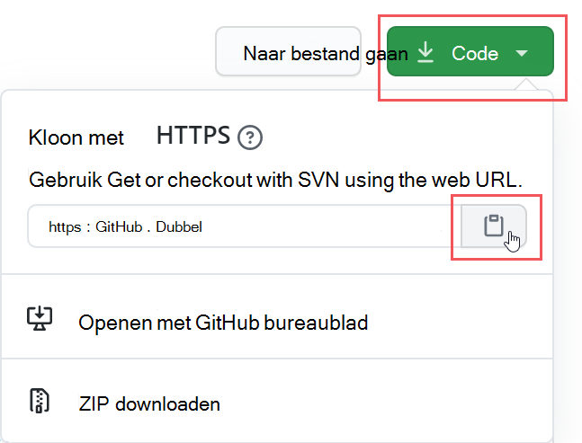

3. Selecteer Visual Studio Opdrachtpalet  weergeven en \>  selecteer **Git: Kloon.** Als u naar de optie in de lijst wilt gaan, begint u te typen om de items te filteren en selecteert u deze `git: clone` vervolgens in de vervolgkeuzelijst. Bijvoorbeeld:

   > [!div class="mx-imgBorder"]
   > 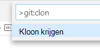

4. Plak in het tekstvak de URL die u hebt gekopieerd van Git en selecteer **Kloon uit GitHub.**

5. Blader in **het dialoogvenster Map** selecteren dat wordt weergegeven naar een locatie om de opslagplaats op te slaan en selecteer deze. Selecteer bij de prompt **Openen**.

    De opslagplaats wordt geopend in Visual Studio Code en geeft de huidige Git-branch linksonder weer. De vertakking moet bijvoorbeeld hoofd **zijn.** Bijvoorbeeld:

   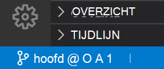

6. Als u niet in de hoofdtak zit, moet u deze selecteren. In Visual Studio Code selecteert u de vertakking en kiest u **hoofd** in de lijst met vertakkingen die worden weergegeven.

   > [!IMPORTANT]
   > Als u de hoofdtak selecteert, hebt u de juiste bestanden om het project te maken. Als u niet de juiste vertakking kiest, mislukt de implementatie.

Uw DKE-bronopslagplaats is nu lokaal ingesteld. Wijzig vervolgens [de toepassingsinstellingen](#modify-application-settings) voor uw organisatie.

### <a name="modify-application-settings"></a>Toepassingsinstellingen wijzigen

Als u de DKE-service wilt implementeren, moet u de volgende typen toepassingsinstellingen wijzigen:

- [Toegangsinstellingen voor sleutel](#key-access-settings)
- [Tenant- en sleutelinstellingen](#tenant-and-key-settings)

U wijzigt de toepassingsinstellingen in appsettings.jsbestand. Dit bestand bevindt zich in de DoubleKeyEncryptionService repo die u lokaal hebt gekloond onder DoubleKeyEncryptionService\src\customer-key-store. In Visual Studio code kunt u bijvoorbeeld naar het bestand bladeren, zoals wordt weergegeven in de volgende afbeelding.

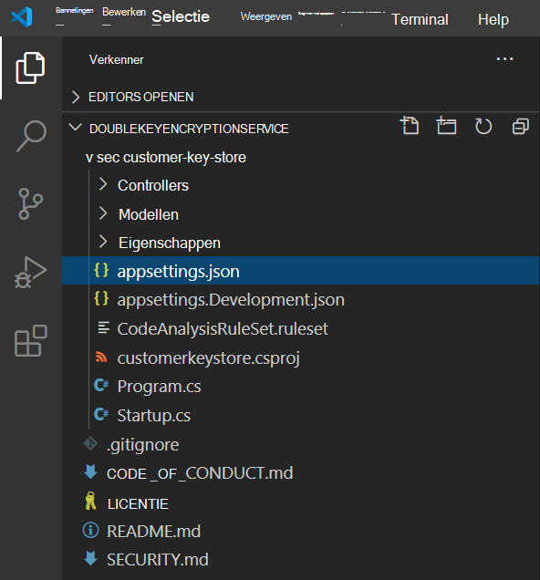

#### <a name="key-access-settings"></a>Toegangsinstellingen voor sleutel

Kies of u e-mail of rolautorisatie wilt gebruiken. DKE ondersteunt slechts één van deze verificatiemethoden tegelijk.

- **E-mailautorisatie**. Hiermee kan uw organisatie alleen toegang verlenen tot sleutels op basis van e-mailadressen.

- **Rolautorisatie**. Hiermee kan uw organisatie toegang verlenen tot sleutels op basis van Active Directory-groepen en moet de webservice LDAP kunnen query's uitvoeren.

**Belangrijke toegangsinstellingen voor DKE instellen met behulp van e-mailautorisatie**

1. Open het **appsettings.jsbestand en** zoek de `AuthorizedEmailAddress` instelling.

2. Voeg het e-mailadres of de adressen toe die u wilt machtigen. Scheid meerdere e-mailadressen met dubbele aanhalingstekens en komma's. Bijvoorbeeld:

   ```json
   "AuthorizedEmailAddress": ["email1@company.com", "email2@company.com ", "email3@company.com"]
   ```

3. Zoek de `LDAPPath` instelling en verwijder de tekst tussen de dubbele `If you use role authorization (AuthorizedRoles) then this is the LDAP path.` aanhalingstekens. Laat de dubbele aanhalingstekens op hun plaats. Wanneer u klaar bent, ziet de instelling er zo uit.

   ```json
   "LDAPPath": ""
   ```

4. Zoek de `AuthorizedRoles` instelling en verwijder de hele regel.

In deze afbeelding ziet **uappsettings.jsbestand** dat correct is opgemaakt voor e-mailautorisatie.

   

**Sleuteltoegangsinstellingen voor DKE instellen met behulp van rolautorisatie**

1. Open het **appsettings.jsbestand en** zoek de `AuthorizedRoles` instelling.

2. Voeg de namen van de Active Directory-groep toe die u wilt machtigen. Scheid meerdere groepsnamen met dubbele aanhalingstekens en komma's. Bijvoorbeeld:

   ```json
   "AuthorizedRoles": ["group1", "group2", "group3"]
   ```

3. Zoek de `LDAPPath` instelling en voeg het Active Directory-domein toe. Bijvoorbeeld:

   ```json
   "LDAPPath": "contoso.com"
   ```

4. Zoek de `AuthorizedEmailAddress` instelling en verwijder de hele regel.

In deze afbeelding ziet **uappsettings.jsbestand** correct is opgemaakt voor rolautorisatie.

   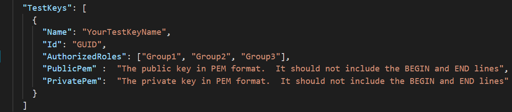

#### <a name="tenant-and-key-settings"></a>Tenant- en sleutelinstellingen

DKE-tenant- en sleutelinstellingen bevinden zich in de **appsettings.jsbestand.**

**Tenant- en sleutelinstellingen voor DKE configureren**

1. Open het **appsettings.jsbestand.**

2. Zoek de `ValidIssuers` instelling en vervang deze door uw `<tenantid>` tenant-id. U kunt uw tenant-id vinden door naar de Azure-portal te gaan en de [tenanteigenschappen weer te geven.](https://aad.portal.azure.com/#blade/Microsoft_AAD_IAM/ActiveDirectoryMenuBlade/Properties) Bijvoorbeeld:

   ```json
   "ValidIssuers": [
     "https://sts.windows.net/9c99431e-b513-44be-a7d9-e7b500002d4b/"
   ]
   ```
> [!NOTE]
> Als u externe B2B-toegang tot uw sleutelopslag wilt inschakelen, moet u deze externe tenants ook opnemen als onderdeel van de lijst met geldige uitgifters.

Zoek de `JwtAudience` . Vervang `<yourhostname>` deze door de hostnaam van de computer waarop de DKE-service wordt uitgevoerd. Bijvoorbeeld:

  > [!IMPORTANT]
  > De waarde voor `JwtAudience` moet exact overeenkomen met de naam van uw host. U kunt **localhost:5001 gebruiken** tijdens debuggen. Als u echter klaar bent met debuggen, moet u deze waarde bijwerken naar de hostnaam van de server.

- `TestKeys:Name`. Voer een naam voor uw sleutel in. Bijvoorbeeld:`TestKey1`
- `TestKeys:Id`. Maak een GUID en voer deze in als de `TestKeys:ID` waarde. Bijvoorbeeld `DCE1CC21-FF9B-4424-8FF4-9914BD19A1BE`. U kunt een site zoals [Online GUID Generator](https://guidgenerator.com/) gebruiken om willekeurig een GUID te genereren.

In deze afbeelding ziet u de juiste indeling voor tenant- en toetseninstellingen in **appsettings.jsop**. `LDAPPath` is geconfigureerd voor rolautorisatie.

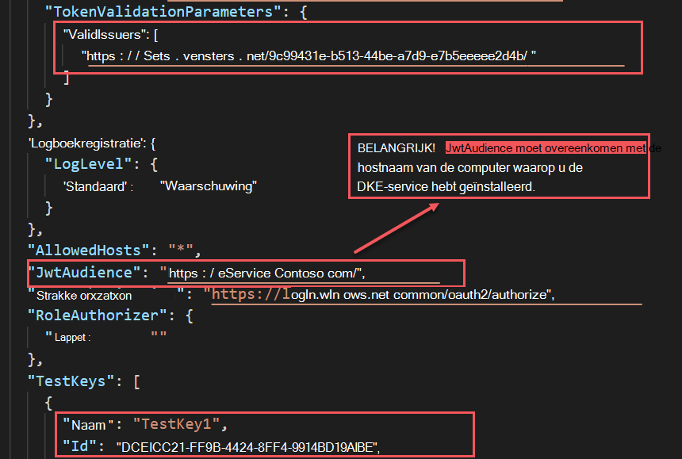

### <a name="generate-test-keys"></a>Testtoetsen genereren

Wanneer u de toepassingsinstellingen hebt gedefinieerd, kunt u openbare en persoonlijke testtoetsen genereren.

Sleutels genereren:

1. Voer in Windows startmenu de Opdrachtprompt OpenSSL uit.

2. Ga naar de map waar u de toetstoetsen wilt opslaan. De bestanden die u maakt door de stappen in deze taak uit te voeren, worden in dezelfde map opgeslagen.

3. Genereer de nieuwe toets.

   ```console
   openssl req -x509 -newkey rsa:2048 -keyout key.pem -out cert.pem -days 365
   ```

4. Genereer de persoonlijke sleutel.

   ```console
   openssl rsa -in key.pem -out privkeynopass.pem
   ```

5. Genereer de openbare sleutel.

   ```console
   openssl rsa -in key.pem -pubout > pubkeyonly.pem
   ```

6. Open **pubkeyonly.pem** in een teksteditor. Kopieer alle inhoud in het **bestand pubkeyonly.pem,** behalve de eerste en laatste regels, naar de sectie van het bestand `PublicPem`appsettings.js **bestand.**

7. Open **privkeynopass.pem** in een teksteditor. Kopieer alle inhoud in het **bestand privkeynopass.pem,** behalve de eerste en laatste regels, naar de sectie van hetappsettings.js`PrivatePem` **bestand.**

8. Verwijder alle lege spaties en nieuwelines in zowel de `PublicPem` `PrivatePem` secties als de secties.

    > [!IMPORTANT]
    > Wanneer u deze inhoud kopieert, verwijdert u geen van de PEM-gegevens.

9. Blader Visual Studio code naar het **bestand Startup.cs.** Dit bestand bevindt zich in de DoubleKeyEncryptionService repo die u lokaal hebt gekloond onder DoubleKeyEncryptionService\src\customer-key-store\.

10. Zoek de volgende regels:

    ```csharp
        #if USE_TEST_KEYS
        #error !!!!!!!!!!!!!!!!!!!!!! Use of test keys is only supported for testing,
        DO NOT USE FOR PRODUCTION !!!!!!!!!!!!!!!!!!!!!!!!!!!!!
        services.AddSingleton<ippw.IKeyStore, ippw.TestKeyStore>();
        #endif
    ```

11. Vervang deze regels door de volgende tekst:

    ```csharp
    services.AddSingleton<ippw.IKeyStore, ippw.TestKeyStore>();
    ```

    De eindresultaten moeten er ongeveer als volgt uitzien.

    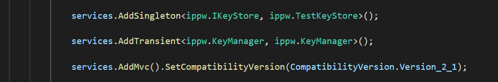

Nu bent u klaar om uw [DKE-project te bouwen.](#build-the-project)

### <a name="build-the-project"></a>Het project maken

Gebruik de volgende instructies om het DKE-project lokaal te maken:

1. Selecteer Visual Studio opdrachtpalet weergeven in de DKE-serviceopslagplaats in de DKE-servicebibliotheek en typ  \>  **build** op de prompt.

2. Kies taken in de **lijst: Buildtaak uitvoeren.**

   Als er geen buildtaken zijn gevonden, selecteert u **Buildtaak configureren** en maakt u er een voor .NET-kern als volgt.

   

   1. Kies **Maken tasks.jsop van sjabloon**.

      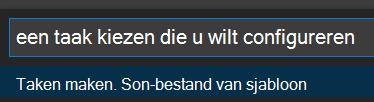

   2. Selecteer .NET Core in de lijst met **sjabloontypen.**

      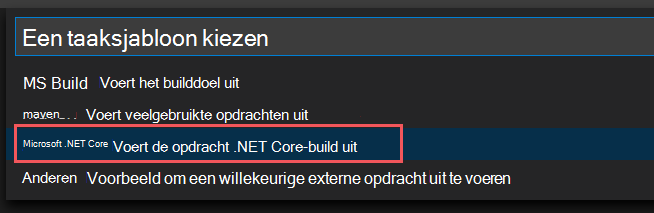

   3. Zoek in de buildsectie het pad naar het **bestand customerkeystore.csproj.** Als deze er niet is, voegt u de volgende regel toe:

      ```json
      "${workspaceFolder}/src/customer-key-store/customerkeystore.csproj",
      ```

   4. Voer de build opnieuw uit.

3. Controleer of er geen rode fouten zijn in het uitvoervenster.

   Als er rode fouten zijn, controleert u de uitvoer van de console. Controleer of u alle vorige stappen correct hebt uitgevoerd en dat de juiste buildversies aanwezig zijn.

4. Selecteer  \> **Foutopsporing starten uitvoeren** om het proces te debuggen. Als u wordt gevraagd een omgeving te selecteren, selecteert **u .NET-kern.**

   De .NET-kerndebugger wordt meestal op `https://localhost:5001` . Als u de toets wilt weergeven, gaat u naar een slash (/) en de `https://localhost:5001` naam van de sleutel. Bijvoorbeeld:

   ```https
   https://localhost:5001/TestKey1
   ```

   De toets moet worden weergegeven in de JSON-indeling.

Uw installatie is nu voltooid. Voordat u de keystore publiceert, controleert u in appsettings.jsde instelling JwtAudience of de waarde voor hostnaam exact overeenkomt met de naam van uw App Service-host. Mogelijk hebt u deze gewijzigd in localhost om problemen met de build op te lossen.

### <a name="deploy-the-dke-service-and-publish-the-key-store"></a>De DKE-service implementeren en het sleutelopslaghuis publiceren

Implementeer de service voor productie-implementaties in een cloud van derden of publiceer deze naar [een on-premises systeem.](/aspnet/core/tutorials/publish-to-iis?preserve-view=true&tabs=netcore-cli&view=aspnetcore-3.1)

Mogelijk geeft u de voorkeur aan andere methoden om uw sleutels te implementeren. Selecteer de methode die het beste werkt voor uw organisatie.

Voor pilotimplementaties kunt u implementeren in Azure en meteen aan de slag gaan.

**Een Azure Web App-exemplaar maken om uw DKE-implementatie te hosten**

Als u het sleutelopslagopslag wilt publiceren, maakt u een Azure App Service-exemplaar om uw DKE-implementatie te hosten. Vervolgens publiceert u de gegenereerde sleutels voor Azure.

1. Meld u in uw browser aan bij de [Microsoft Azure portal](https://ms.portal.azure.com)en ga naar **App Services**  >  **Toevoegen.**

2. Selecteer uw abonnement en resourcegroep en definieert de details van uw exemplaar.

   - Voer de hostnaam in van de computer waarop u de DKE-service wilt installeren. Zorg ervoor dat deze dezelfde naam heeft als de naam die is gedefinieerd voor de instelling JwtAudience in [**hetappsettings.jsbestand.**](#tenant-and-key-settings) De waarde die u voor de naam opwaardeerd, is ook de WebAppInstanceName.

   - Selecteer **voor Publiceren,** **selecteer code** en selecteer voor **Runtime stack** **.NET Core 3.1.**

   Bijvoorbeeld:

   > [!div class="mx-imgBorder"]
   > 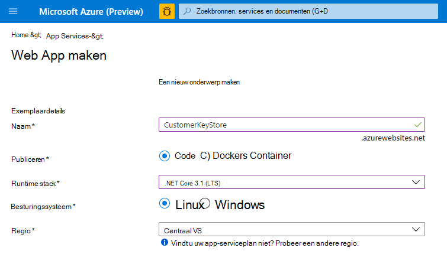

3. Selecteer onder aan de pagina **Controleren + maken** en selecteer vervolgens **Toevoegen.**

4. Ga op een van de volgende stappen te werk om de gegenereerde sleutels te publiceren:

   - [Publiceren via ZipDeployUI](#publish-via-zipdeployui)
   - [Publiceren via FTP](#publish-via-ftp)
   - [Publiceren via Visual Studio 2019 of hoger](/aspnet/core/tutorials/)

#### <a name="publish-via-zipdeployui"></a>Publiceren via ZipDeployUI

1. Ga naar `https://<WebAppInstanceName>.scm.azurewebsites.net/ZipDeployUI`.

   Bijvoorbeeld:https://dkeservice.scm.azurewebsites.net/ZipDeployUI

2. Ga in de codebase voor de sleutelwinkel naar de map **customer-key-store\src\customer-key-store** en controleer of deze map het **bestand customerkeystore.csproj** bevat.

3. Uitvoeren: **dotnet publiceren**

   In het uitvoervenster wordt de adreslijst weergegeven waar de publicatie is geïmplementeerd.

   Bijvoorbeeld:`customer-key-store\src\customer-key-store\bin\Debug\netcoreapp3.1\publish\`

4. Verzend alle bestanden in de adreslijst publiceren naar een .zip bestand. Wanneer u het .zip bestand maakt, moet u ervoor zorgen dat alle bestanden in de adreslijst zich op het hoofdniveau van het .zip bestand.

5. Sleep en zet het .zip bestand dat u maakt naar de ZipDeployUI-site die u hierboven hebt geopend. Bijvoorbeeld:https://dkeservice.scm.azurewebsites.net/ZipDeployUI

DKE wordt geïmplementeerd en u kunt naar de testtoetsen bladeren die u hebt gemaakt. Ga verder [met Uw implementatie valideren](#validate-your-deployment) hieronder.

#### <a name="publish-via-ftp"></a>Publiceren via FTP

1. Verbinding maken app-service die u hierboven hebt [gemaakt.](#deploy-the-dke-service-and-publish-the-key-store)

   Ga in uw browser naar: **Azure Portal**  >  **App Service** Deployment  >  **Center**  >  **Manual Deployment**  >  **FTP**  >  **Dashboard**.

2. Kopieer de verbindingsreeksen die worden weergegeven naar een lokaal bestand. U gebruikt deze tekenreeksen om verbinding te maken met de Web App-service en bestanden te uploaden via FTP.

   Bijvoorbeeld:

   

3. Ga in de codebase voor de sleutelopslag naar de **adreslijst customer-key-store\src\customer-key-store.**

4. Controleer of deze adreslijst het **bestand customerkeystore.csproj** bevat.

5. Uitvoeren: **dotnet publiceren**

   De uitvoer bevat de adreslijst waar de publicatie is geïmplementeerd.

   Bijvoorbeeld:`customer-key-store\src\customer-key-store\bin\Debug\netcoreapp3.1\publish\`

6. Verzend alle bestanden in de adreslijst publiceren naar een zip-bestand. Wanneer u het .zip bestand maakt, moet u ervoor zorgen dat alle bestanden in de adreslijst zich op het hoofdniveau van het .zip bestand.

7. Gebruik vanuit uw FTP-client de verbindingsgegevens die u hebt gekopieerd om verbinding te maken met uw App Service. Upload het .zip bestand dat u in de vorige stap hebt gemaakt naar de hoofdadreslijst van uw Web App.

DKE wordt geïmplementeerd en u kunt naar de testtoetsen bladeren die u hebt gemaakt. Valideer [vervolgens uw implementatie.](#validate-your-deployment)

### <a name="validate-your-deployment"></a>Uw implementatie valideren

Nadat u DKE met een van de hierboven beschreven methoden heeft geïmplementeerd, valideert u de implementatie en de instellingen voor het sleutelopslagopslag.

Uitvoeren:

```powershell
src\customer-key-store\scripts\key_store_tester.ps1 dkeserviceurl/mykey
```

Bijvoorbeeld:

```powershell
key_store_tester.ps1 https://mydkeservice.com/mykey
```

Zorg ervoor dat er geen fouten worden weergegeven in de uitvoer. Wanneer u klaar bent, registreert [u uw sleutelwinkel.](#register-your-key-store)

De sleutelnaam is hoofdsyteergevoelig. Voer de sleutelnaam in zoals deze wordt weergegeven in appsettings.jsbestand.

## <a name="register-your-key-store"></a>Uw sleutelwinkel registreren

Met de volgende stappen kunt u uw DKE-service registreren. Het registreren van uw DKE-service is de laatste stap bij het implementeren van DKE voordat u labels kunt gaan maken.

De DKE-service registreren:

1. Open in uw browser de [Microsoft Azure portal](https://ms.portal.azure.com/)en ga naar **Alle** \> **identiteitsregistraties voor** \> **services.**

2. Selecteer **Nieuwe registratie** en voer een duidelijke naam in.

3. Selecteer een accounttype in de weergegeven opties.

   Als u een Microsoft Azure gebruikt met een niet-aangepast domein, zoals **onmicrosoft.com,** selecteert u Alleen accounts in deze organisatiemap **(Alleen Microsoft - Enkele tenant).**

   Bijvoorbeeld:

   > [!div class="mx-imgBorder"]
   > 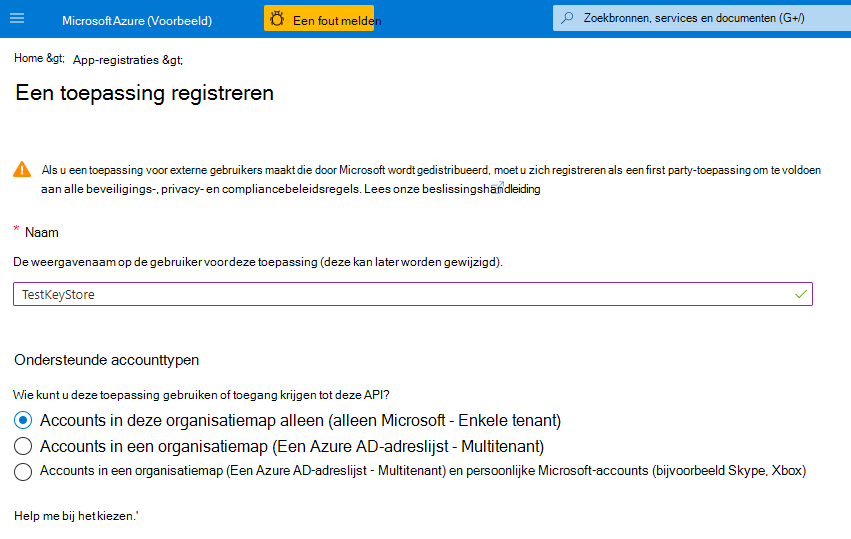

4. Selecteer onder aan de pagina Registreren **om** de nieuwe app-registratie te maken.

5. Selecteer in de nieuwe app-registratie in het linkerdeelvenster onder **Beheren** de optie **Verificatie**.

6. Selecteer **Een platform toevoegen.**

7. Selecteer in **de pop-up Platforms** configureren de optie **Web**.

8. Voer **onder Omleidings-URL's** de URI in van uw dubbele-sleutelversleutelingsservice. Voer de URL van de App-service in, inclusief zowel de hostnaam als het domein.

   Bijvoorbeeld:https://mydkeservicetest.com

   - De URL die u typt, moet overeenkomen met de hostnaam waar uw DKE-service is geïmplementeerd.
   - Als u lokaal test met Visual Studio, gebruikt u **https://localhost:5001** .
   - In alle gevallen moet het schema **https zijn.**

   Controleer of de hostnaam exact overeenkomt met de hostnaam van uw App Service. Mogelijk hebt u deze gewijzigd om `localhost` problemen met de build op te lossen. In **appsettings.jsis** deze waarde de hostnaam die u hebt ingesteld voor `JwtAudience` .

9. Schakel **onder Impliciet verlenen** het selectievakje **Id-tokens** in.

10. Selecteer **Opslaan** om de wijzigingen op te slaan.

11. Selecteer in het linkerdeelvenster **Een API weergeven** en selecteer vervolgens naast Toepassings-id URI de optie **Instellen.**

12. Selecteer nog steeds op de pagina Een **API blootstellen** in **de scopes** die door dit API-gebied zijn gedefinieerd, de optie **Een bereik toevoegen.** In het nieuwe bereik:

    1. De naam van het bereik definiëren **als user_impersonation.**

    2. Selecteer de beheerders en gebruikers die toestemming kunnen geven.

    3. Definieer de resterende waarden die nodig zijn.

    4. Selecteer **Bereik toevoegen.**

    5. Selecteer **Opslaan** bovenaan om uw wijzigingen op te slaan.

13. Selecteer nog steeds **op de pagina** Een API openen in het gebied **Geautoriseerde clienttoepassingen** de optie **Een clienttoepassing toevoegen.**

    In de nieuwe clienttoepassing:

    1. De client-id definiëren als `d3590ed6-52b3-4102-aeff-aad2292ab01c` . Deze waarde is de Microsoft Office client-id en stelt u Office toegangstoken te verkrijgen voor uw sleutelopslag.

    2. Selecteer **onder Geautoriseerde bereik de** **user_impersonation** bereik.

    3. Selecteer **Toepassing toevoegen.**

    4. Selecteer **Opslaan** bovenaan om uw wijzigingen op te slaan.

    5. Herhaal deze stappen, maar definieert deze keer de client-id als `c00e9d32-3c8d-4a7d-832b-029040e7db99` . Deze waarde is de geïntegreerde labelingclient-id van Azure Information Protection. 

Uw DKE-service is nu geregistreerd. Ga door met [DKE labels te maken.](#create-sensitivity-labels-using-dke)

## <a name="create-sensitivity-labels-using-dke"></a>Gevoeligheidslabels maken met DKE

Maak in Microsoft 365 compliancecentrum een nieuw gevoeligheidslabel en pas versleuteling toe zoals u anders zou doen. Selecteer **Dubbele sleutelversleuteling gebruiken** en voer de EINDPUNT-URL voor uw sleutel in.

Bijvoorbeeld:

> [!div class="mx-imgBorder"]
> 

Alle DKE-labels die u toevoegt, worden weergegeven voor gebruikers in de meest recente versies van Microsoft 365-apps voor ondernemingen.

> [!NOTE]
> Het kan tot 24 uur duren voordat de clients worden vernieuwd met de nieuwe labels.

### <a name="enable-dke-in-your-client"></a>DKE inschakelen in uw client

Als u een insider Office, is DKE voor u ingeschakeld. Schakel anders DKE voor uw client in door de volgende registersleutels toe te voegen:

```console
   [HKEY_LOCAL_MACHINE\SOFTWARE\WOW6432Node\Microsoft\MSIPC\flighting]
   "DoubleKeyProtection"=dword:00000001

   [HKEY_LOCAL_MACHINE\SOFTWARE\Microsoft\MSIPC\flighting]
   "DoubleKeyProtection"=dword:00000001
```

## <a name="migrate-protected-files-from-hyok-labels-to-dke-labels"></a>Beveiligde bestanden migreren van HYOK-labels naar DKE-labels

Als u klaar bent met het instellen van DKE, kunt u de inhoud die u hebt beveiligd met HYOK-labels migreren naar DKE-labels. Als u wilt migreren, gebruikt u de AIP-scanner. Zie Wat is de geïntegreerde labelscanner van [Azure Information Protection?](/azure/information-protection/deploy-aip-scanner)om aan de slag te gaan met de scanner.

Als u geen inhoud migreert, blijft de met HYOK beveiligde inhoud ongewijzigd.
